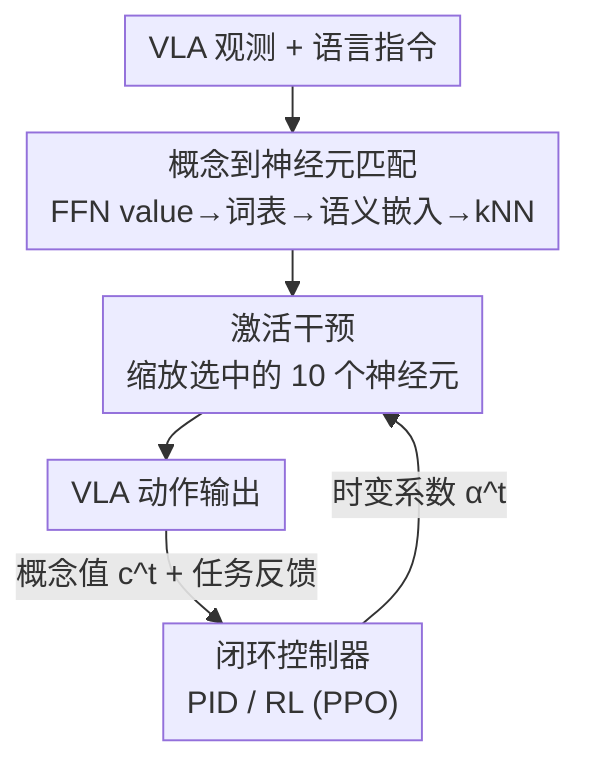

# Closed-Loop Neural Activation Control in Vision-Language-Action Models

**会议**: CVPR 2026  
**arXiv**: [2606.00269](https://arxiv.org/abs/2606.00269)  
**代码**: 待确认  
**领域**: 机器人 / 具身智能（VLA 推理期调控）  
**关键词**: VLA、激活转向、闭环控制、机制可解释性、PID、强化学习

## 一句话总结
针对现有 VLA 激活转向用**固定系数、开环操作**导致过冲与任务失败的问题，本文提出 CTRL-STEER：先用机制可解释性挑出与运动概念对齐的一组 FFN 神经元，再用 PID / RL 控制器在推理时**逐步在线调整**这组神经元的干预强度，从而在「转向到位」和「任务成功」之间取得更好折中——不改、不重训基座模型，把 OpenVLA 在强干预下从 1.8% 的成功率救回到接近甚至超过未转向基线。

## 研究背景与动机

**领域现状**：Vision-Language-Action（VLA）模型（如 OpenVLA、$\pi_0$）把预训练 VLM 当感知-语义骨干、接一个动作解码器自回归地吐出机器人动作 token，能跨物体类别和新指令做语义泛化。一条颇有吸引力的「免重训」调控路线是**激活转向（activation steering）**：在推理期对内部某些语义方向做干预，就能让机器人表现出「往上抬高一点」「走快一点」等行为。

**现有痛点**：现有转向方法（如 Haon 等人的工作）用的是**固定的转向系数 $\alpha$**——选中若干神经元后，把它们的激活整段乘上一个常数，从头到尾不变。这本质上是**开环**：它完全不看任务状态和概念误差怎么随时间演化。结果就是干预一强，末端轨迹被抬得太高撞到微波炉顶、或速度被推到失控，转向指标上去了、任务却失败了。论文里 X-VLA / OpenVLA 在 Static-20 下成功率从 ~77% 掉到个位数（最低 1.8%）。

**核心矛盾**：转向目标和基座模型自己学到的动力学之间存在 trade-off，而固定系数无法消解这个矛盾。更糟的是对**时序概念**（speed、smoothness、acceleration）——这些量依赖跨时间步的行为演化，而 VLA 每个时间步是独立前向、只用当前观测算残差更新，**单次前向根本算不出速度**。于是「某 value 向量和速度指标相关」并不等于「这个神经元能直接控制速度」，开环静态干预对时序概念尤其无效。

**本文目标**：把 VLA 转向重新表述为一个**闭环控制问题**——干预强度随执行过程动态调节，同时满足概念对齐和任务成功两个目标，且不重训基座。

**切入角度**：把「表示」和「调控」解耦——不再假设时序概念被单个神经元直接控制，而是沿运动对齐的残差方向干预，把「该施加多大强度」交给一个反馈控制器在线决定。

**核心 idea**：用「一组运动概念神经元 + 在线反馈控制器（PID / RL）」替代「单特征神经元 + 固定系数」，把激活转向从开环变成闭环。

## 方法详解

### 整体框架
CTRL-STEER 分两步。**离线/前置**：用机制可解释性从所有 FFN 层里挑出一组（最终 10 个）与运动概念对齐的神经元，构成干预集合 $\mathcal{S}$。**推理期闭环**：每个时间步把这组神经元的激活按一个**时变**系数 $\bm{\alpha}^t$ 缩放（而非固定 $\alpha$）；缩放后 VLA 吐出动作、环境给出当前概念值 $c^t$ 和任务反馈；控制器据此算出转向误差 $e^t = c^* - c^t$，更新下一步的 $\bm{\alpha}^{t+1}$，形成「干预 → 执行 → 测量误差 → 再调干预」的回路。控制器有两种实例：反应式的 PID，和带长程规划的 RL（PPO）。

### 关键设计

**1. 概念到神经元匹配：把「一组运动特征」而非单个特征映射到一簇 FFN 神经元**

痛点是：要做转向得先知道改哪些神经元，但神经元往往是**多义的**（polysemantic），一个可解释特征可能分布在多个单元上，先前工作只盯单个特征（up/down/left/...）的神经元。本文沿用 FFN 的 key-value 记忆视角：层 $\ell$ 的 FFN 输出可写成 $\mathrm{FFN}^\ell(r^\ell)=\sum_i m_i^\ell v_i^\ell$，每个神经元有一个输入无关的 value 向量 $v_i^\ell$，它和残差流同空间，可经 LM head 投到词表 logits $z_i^\ell = W_{\mathrm{out}} v_i^\ell$，softmax 后取 top-$k$（$k=20$）token，再用文本编码器算概率加权的语义嵌入 $sem_i^\ell = \sum_w p_i^\ell(w)\,e(w)$。然后对一**组**代表性特征 token（运动概念用 $\{$up, down, left, right, forward, backward$\}$）逐个做 kNN（cosine 相似，$k=5$）跨所有 FFN 层检索，并集成候选集 $\mathcal{S}=\bigcup_w \mathrm{kNN}_k(e(w);\{sem_i^\ell\})$。最后人工检查 top-$k$ 促进 token、剔除语义冲突的多义神经元，保留语义最一致的 **10 个**。和旧法只取单特征不同，这里围绕「更宽的控制概念」聚合多特征，且作者观察到选中的神经元集中在 transformer 后半段（高层语义对齐更强）

**2. 把转向写成闭环控制问题：用时变系数替代固定 $\alpha$**

先前做法是把选中神经元的激活直接换成常数 $\tilde m_i^\ell = \alpha$（$(\ell,i)\in\mathcal{S}$），在 $\{v_i^\ell\}$ 张成的子空间里做一个**恒定**的残差偏移——开环、不随状态变。本文定义目标概念在 $t$ 时刻的值 $c^t$ 与期望值 $c^*$ 之间的转向误差 $e^t = c^* - c^t$（例如高度转向取 $c^*=2h_0$ 即初始末端高度的两倍；速度取 $c^*=30$ cm/s），把问题改写为求一个时变向量 $\bm{\alpha}^t = \arg\min_{\bm{\alpha}}\sum_{\tau=t+1}^{T} e^\tau$，即在控制时域 $T$ 内最小化未来累计误差。这一步是全文的骨架转换：把「该施加多强干预」从一个手调超参变成一个**随执行在线求解**的控制信号，下面两个控制器就是它的两种解法

**3. PID 控制器：用历史误差做反应式在线调节**

PID 算时变标量信号 $\bm{\alpha}^t_{PID}=K_P e^t + K_I\sum_{\tau=0}^t e^\tau + K_D(e^t - e^{t-1})$，对所有选中神经元施加同一标量。比例项随当前偏差快速纠正；积分项累加历史误差、抵消基座动力学与转向目标冲突造成的**稳态偏置**（光靠比例项消不掉）；微分项对误差变化率响应——转向主要影响运动，神经元缩放的突变会诱发**振荡轨迹**，微分项抑制振荡、避免过冲、改善稳定性。为防残差偏移过大，把 $\bm{\alpha}^t_{PID}$ 约束在 $[0,20]$，增益取保守值（$K_P{=}4.0,\,K_I{=}0.5,\,K_D{=}1.0$，时域 20 步），尤其防噪声经微分项被放大。PID 的局限是**纯反应、不显式规划未来任务结果**，所以转向变好但任务成功仍可能次优

**4. RL（PPO）控制器：用长程规划联合优化转向与任务成功**

为把「规划」引入闭环，本文训一个 PPO 策略 $\pi_\theta$ 替代 PID。状态 $s_t=[a_t,\Delta a_t,\alpha^{t-1},t/T]$ 包含 $k$ 个选中神经元的当前激活、激活变化量、上一步施加的转向信号和归一化进度；策略输出一个 $k$ 维向量 $\bm{\alpha}^t_{RL}=\pi_\theta(s_t)$——和 PID 输出标量不同，它**给每个神经元单独赋值**，能建模概念对齐神经元之间的非线性依赖并协调它们。奖励 $r_t = r_{steer}(t) + \lambda\cdot r_{task}$ 把瞬时转向指标（高度 / 瞬时速度）和任务完成奖励加权折中（$\lambda$ 控制权衡）。训练上每个任务训一个独立策略，并**用 PID 输出 $\bm{\alpha}^t_{PID}$ 来初始化**再用环境交互精炼——相当于先给 RL 一个不错的起点，再让它学会兼顾长程任务成功，这是它能在转向到位的同时把成功率拉到甚至超过未转向基线的关键

### 损失函数 / 训练策略
基座 OpenVLA（7B，LLaMA-2 骨干，基于 prismatic VLM）在每个 task suite 上**独立微调以提升任务完成度，不改架构**；转向阶段完全不动基座权重。PID 无需训练，直接调增益。RL 用 PPO，每条轨迹 $T=920$ 步（20 步环境 warm-up + 900 步执行），奖励即式 $r_t=r_{steer}+\lambda r_{task}$，并以 PID 信号热启动。

## 实验关键数据

基座 OpenVLA（另在 X-VLA 上验证可迁移性），benchmark 为 LIBERO 四个 task suite（Goal/Object/Spatial/Long）与 BridgeData V2。转向两个概念：高度（state-based）与速度（temporal）。指标：高度报平均高度 / 95 分位 / AAT（Area Above Threshold，越大越「敢抬」），速度报平均速度 / SAT，SR 为任务成功率。

### 主实验（LIBERO 高度转向，节选 Table 3）

| Task Suite | 方法 | 高度(m) | AAT | SR(%) |
|---|---|---|---|---|
| LIBERO GOAL | OpenVLA(未转向) | 1.056 | 107.76 | 77.50 |
| LIBERO GOAL | Static C=20 | 1.041 | 95.92 | **41.00** |
| LIBERO GOAL | CTRL-STEER(PID) | 1.058 | 108.79 | 79.00 |
| LIBERO GOAL | CTRL-STEER(RL) | 1.062 | 99.78 | **82.00** |
| LIBERO LONG | OpenVLA | 0.832 | 181.66 | 58.00 |
| LIBERO LONG | Static C=20 | 0.723 | 201.08 | 10.00 |
| LIBERO LONG | CTRL-STEER(RL) | 0.804 | 181.86 | 57.00 |
| LIBERO OBJECT | Static C=20 | 0.203 | 2.60 | 33.50 |
| LIBERO OBJECT | CTRL-STEER(RL) | 0.211 | 4.67 | 77.00 |

读法：Static-20 几乎每个 suite 都把 SR 砸出大坑（Long 掉到 10%、Object 33.5%），CTRL-STEER 把成功率维持/超过未转向基线，同时 AAT 不塌。

### 速度（temporal）转向（节选 Table 4，LIBERO）

| Task Suite | 方法 | 速度(cm/s) | SAT | SR(%) |
|---|---|---|---|---|
| LIBERO LONG | OpenVLA | 11.26 | 2.69 | 58.00 |
| LIBERO LONG | Static C=20 | 12.70 | 4.27 | **1.50** |
| LIBERO LONG | CTRL-STEER(RL) | 11.04 | 2.54 | **66.50** |
| LIBERO GOAL | Static C=20 | 14.52 | 3.86 | **2.50** |
| LIBERO GOAL | CTRL-STEER(RL) | 14.04 | 3.49 | **83.00** |
| LIBERO OBJECT | Static C=20 | 10.16 | 2.47 | 2.50 |
| LIBERO OBJECT | CTRL-STEER(RL) | 14.11 | 2.17 | 76.50 |

时序概念上开环灾难性失败（SR 普遍 1.5%–2.5%），恰好印证「单次前向算不出速度、固定系数控不住时序概念」的动机；闭环把成功率救回 66%–83%。

### BridgeData V2（Table 2，OpenVLA）

| 方法 | AAT(高度) | SR(高度) | 平均速度 | SR(速度) |
|---|---|---|---|---|
| Unsteered | 39.15 | 40% | 16.93 | 40% |
| Static(20) | 47.96 | 12.5% | 25.18 | 14.9% |
| PID | 47.28 | 46% | 18.90 | 45.8% |
| RL | 48.13 | **47.6%** | 21.38 | **48.9%** |

### 关键发现
- **开环的代价是任务失败**：Static-20 转向幅度（AAT/速度）确实最大，但 SR 系统性崩塌（最低 1.5%–1.8%）；这正是论文要解决的 steering-success trade-off。
- **RL > PID**：摘要给出聚合数字——PID 维持成功率接近未转向基线（71.37%），RL 进一步把高度转向提到 73.88%、速度提到 76.12%，且在多个 suite 上 SR 反超未转向基线（如 Goal 高度 82% vs 77.5%）。原因是 RL 显式规划长程任务成功并给每个神经元单独赋值。
- **时序概念是分水岭**：固定系数在速度概念上几乎全军覆没，最能说明「表示≠可控、需要闭环」。
- **可迁移**：在 X-VLA 上同样有效，说明方法不绑定单一 VLA 架构。

## 亮点与洞察
- **「表示 / 调控解耦」这个 framing 很干净**：不纠结「哪个神经元等于速度」，而是承认时序概念单步算不出，把强度调节交给反馈控制器——把一个可解释性难题转化成一个控制问题，思路可迁移到 LLM 的 representation engineering（同样常被固定强度坑）。
- **拿经典 PID 接神经网络内部激活**：积分项消稳态偏置、微分项压振荡，这套几十年的控制直觉直接对应「转向过冲 / 轨迹抖动」，解释力强且零训练成本。
- **用 PID 热启动 RL**：先给 PPO 一个已经合理的转向信号再精炼，缓解从零训控制策略的样本效率问题，是个实用 trick。
- **全程不碰基座权重**：纯推理期干预，对「免重训适配新物理配置」这个昂贵痛点是务实路线。

## 局限与展望
- **每个任务训一个 RL 策略**：RL 控制器 task-specific、需各自 rollout 训练，跨任务/跨环境的泛化与可扩展性存疑，和「免重训、低成本适配」的初衷有一定张力。
- **神经元选择含人工环节**：多义神经元靠人工检查 top-$k$ token 剔除，依赖主观判断、难完全自动化与复现。
- **概念测量依赖仿真可得的 $c^t$**：误差 $e^t=c^*-c^t$ 需要在线拿到高度/速度真值，真实机器人上获取这些反馈信号未必容易。
- **概念面窄**：目前只验证了高度（state）与速度（temporal）两个概念、10 个神经元，更复杂/组合概念（平滑度、力控）尚未展开。⚠️ 部分聚合数字（71.37%/73.88%/76.12%）来自摘要与引言，与逐 suite 表格的对应口径以原文为准。

## 相关工作与启发
- **vs 固定系数激活转向（Haon 等，[12]）**：他们选**单特征**神经元、用**固定 $\alpha$** 开环干预；本文围绕**一组**运动特征选神经元，并把 $\alpha$ 换成 PID/RL 在线求解的**时变信号**，核心补上了「任务级反馈」这一环，区别就是开环 vs 闭环。
- **vs LLM representation engineering（注入/抑制潜在方向）**：思想同源（沿语义方向干预），但 LLM 那边是离散文本输出、无具身任务成功约束；本文把它落到连续控制 + 任务成功的双目标场景，并引入反馈控制。
- **vs 经典机器人 PID/RL 闭环控制**：传统闭环作用在动作/力矩层；本文把控制对象下沉到**模型内部 FFN 激活**，是「用控制论调神经网络内部状态」的一次嫁接。

## 评分
- 新颖性: ⭐⭐⭐⭐⭐ 把激活转向从开环重构为闭环、用 PID/RL 调控内部神经元，framing 新颖且自洽
- 实验充分度: ⭐⭐⭐⭐ 覆盖 4 个 LIBERO suite + BridgeData + 两种 VLA + 两个概念，但概念数仍偏少、RL 需逐任务训练
- 写作质量: ⭐⭐⭐⭐ 动机（时序概念不可单步控）推导清晰，公式完整；部分聚合数字与表格口径需对照
- 价值: ⭐⭐⭐⭐ 免重训、即插即用地缓解 steering-success 矛盾，对 VLA 推理期调控有实用价值

<!-- RELATED:START -->

## 相关论文

- [\[CVPR 2026\] Iterative Closed-Loop Motion Synthesis for Scaling the Capabilities of Humanoid Control](iterative_closed-loop_motion_synthesis_for_scaling_the_capabilities_of_humanoid_.md)
- [\[CVPR 2026\] SRPO: Self-Referential Policy Optimization for Vision-Language-Action Models](srpo_self-referential_policy_optimization_for_vision-language-action_models.md)
- [\[CVPR 2026\] MoEActok: A MoE-based Action Tokenizer for Vision-Language-Action Models](moeactok_a_moe-based_action_tokenizer_for_vision-language-action_models.md)
- [\[CVPR 2026\] ACoT-VLA: Action Chain-of-Thought for Vision-Language-Action Models](acot-vla_action_chain-of-thought_for_vision-language-action_models.md)
- [\[CVPR 2026\] QuantVLA: Scale-Calibrated Post-Training Quantization for Vision-Language-Action Models](quantvla_scale-calibrated_post-training_quantization_for_vision-language-action_.md)

<!-- RELATED:END -->
