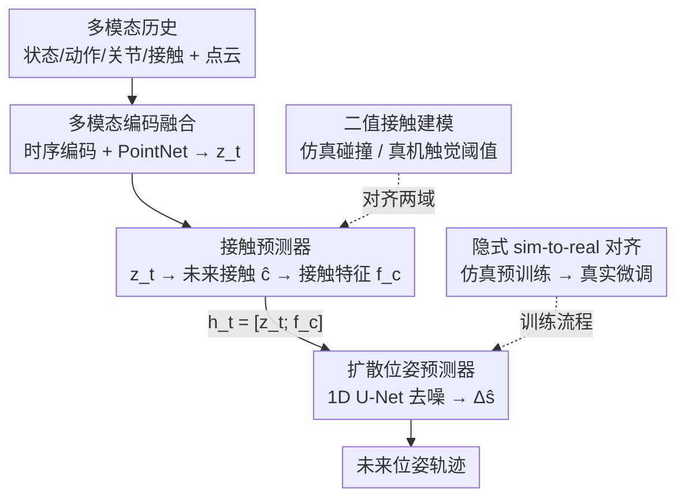

# Contact-Aware Neural Dynamics

**会议**: CVPR 2026  
**论文**: [CVF Open Access](https://openaccess.thecvf.com/content/CVPR2026/html/Jing_Contact-Aware_Neural_Dynamics_CVPR_2026_paper.html)  
**代码**: [项目页](https://changwei-jing.github.io/neural-physics/)  
**领域**: 机器人 / 具身智能  
**关键词**: sim-to-real、接触动力学、触觉感知、神经动力学模型、扩散模型  

## 一句话总结
针对灵巧手富接触操作的 sim-to-real 鸿沟，本文把现成仿真器当先验、用一个"先预测接触事件、再做接触条件扩散位姿预测"的神经前向动力学模型来隐式对齐仿真与真实，靠机器人手上的触觉二值接触信号锚定真实物理，在单/多物体任务上把长程预测 MSE 和 ADD-S 都刷到最好，并能把纯仿真训练的策略筛选/微调到更高真实成功率。

## 研究背景与动机
**领域现状**：机器人操作策略越来越依赖仿真做大规模、可复现的训练与评估，但仿真和真实之间存在 sim-to-real gap。对于运动学简单的 locomotion，动力学误差往往可容忍；可一旦进入手内操作、富接触（contact-rich）操作，接触几何、摩擦、柔顺性、积分时序上的微小偏差都会被放大，导致物体运动和稳定性完全跑偏。

**现有痛点**：主流弥合手段是**显式系统辨识**——调几何参数、调摩擦质量，优化一小撮物理参数让仿真 rollout 对上真实轨迹。但它假设"低维参数修正就够了"，而富接触任务的误差是**高维、状态相关、还掺杂离散积分误差**的（damping、restitution 这些复杂接触表述）。纯靠 domain randomization 或参数扫的方法是拿精度换鲁棒，仍然抓不住接触瞬间的非光滑跳变（non-smooth transitions）。另一类视觉向 sim-to-real（渲染、激进域随机化）只闭合了感知 gap，底层接触动力学模型基本没动。

**核心矛盾**：已有的**隐式对齐**工作（在解析动力学上加神经残差、可微仿真、纯仿真或纯真实训练的神经动力学）大多是 **contact-agnostic** 的——把接触不连续当噪声处理，或只用运动学/本体感觉信号，**白白浪费了操作里最富信息的信号：接触本身**。而高带宽触觉恰恰能提供快速、灵敏的接触信号来引导建模。

**本文目标**：构建一个既继承仿真的多样性/低成本、又继承真实数据保真度的前向动力学模型，让它能在富接触操作里准确预测多步 rollout，并真正用于策略评估和微调。

**切入角度**：与其去拟合一堆连续接触力（噪声大、对标定敏感、仿真和真机难以对齐），不如把接触抽象成**手级二值信号**"碰没碰到"，用它作为稳定的条件去驱动动力学预测——这个离散事件既能从仿真碰撞检测得到、也能从真机触觉阈值得到，天然在两域间对齐。

**核心 idea**：用"接触感知的神经前向动力学模型 + 隐式对齐"代替"显式参数辨识"，先在大规模仿真上学到接触诱导的物理行为，再用少量带触觉的真实交互数据微调，把仿真态在共享的接触表征里对齐到真实态。

## 方法详解
本文把富接触操作的 sim-to-real 对齐建模成一个**条件动力学预测问题**：在时刻 $t$，物体位姿 $s_t \in SE(3)$（平移+旋转），机器人手关节构型 $q_t \in \mathbb{R}^{d_q}$，动作 $a_t \in \mathbb{R}^{d_q}$，手与物体的接触用**二值**信号 $c_t \in \{0,1\}$ 表示（任一指尖接触物体则 $c_t=1$），物体几何用点云 $\mathcal{P} \in \mathbb{R}^{N\times 3}$（初始从 mesh 表面采样、随位姿变换）。

### 整体框架
模型吃一段定长历史 $\mathcal{H}_t = \{s_{t-K:t},\, a_{t-K:t},\, q_{t-K:t},\, c_{t-K:t},\, \mathcal{P}\}$，输出未来 $H$ 步的接触序列和位姿增量轨迹。整条 pipeline 分两阶段串行：**多模态编码融合 → Stage I 接触预测 → Stage II 接触条件扩散位姿预测**。状态/动作/关节/接触的时序历史各自编码后，点云走 PointNet 编码器拿几何嵌入，所有模态拼接后过一个轻量 MLP 融合成共享潜变量 $z_t \in \mathbb{R}^{512}$；Stage I 用 $z_t$ 先预测未来接触概率并编码成紧凑接触特征 $f_c$，拼回去得到接触条件向量 $h_t=[z_t; f_c]$，Stage II 用一个 1D U-Net 以 $h_t$ 为条件做去噪扩散，生成未来位姿增量 $\Delta\hat{s}_{t+1:t+H}$。整套模型**先在大规模仿真上训练，再用少量带触觉的真实数据微调**，从而隐式对齐两域接触动力学。

### 关键设计

**1. 二值手级接触表征：把非光滑接触抽成可学的离散事件**

富接触任务里指尖与物体的接触动力学高度非光滑——触碰瞬间出现力的尖峰和速度不连续，连续接触量（接触力/分布）既难可靠建模、又对标定敏感（即便接触状态没变，连续测量也会小幅抖动）。本文干脆不回归连续力，而是用**手级二值信号** $c_t\in\{0,1\}$：只关注"是否发生接触"这个结构性信号。这个设计有三重好处：① 二值化抹平了传感器的高频抖动，给训练更干净的监督；② 离散标签能**从仿真（MuJoCo 碰撞检测，指尖 mesh 与物体 mesh 相交即 $c_t=1$）和真机（触觉法向力超阈值 $\tau_{\text{force}}$）一致地导出**，天然在两域对齐接触表征；③ 它契合神经网络的光滑本性——网络不必去拟合接触幅值的高频变化，只学底层的离散接触事件，再把它当作稳定的条件信号喂给下游动力学。真机侧用一个轻量启发式判接触：当指尖力 $|F_x|+|F_y|+|F_z| > 0.3\text{N}$ 时该指尖记为接触，任一指尖触发则全局 $c_t=1$。

**2. 两阶段"先接触、后位姿"的解耦预测：让动力学显式以接触事件为条件**

与其让一个网络一口气吐出位姿（忽略接触就会在触碰处累计漂移），本文把预测拆成两阶段。**Stage I 接触预测器**：用融合潜变量 $z_t$ 经 MLP 预测 $H$ 步接触概率 $\hat{c}_{t+1:t+H}=\sigma(W_c z_t + b_c)$，用二值交叉熵 $\mathcal{L}_{\text{cnt}}=\mathrm{BCE}(\hat{c}_{t+1:t+H}, c_{t+1:t+H})$ 监督，再把预测序列投影成紧凑接触特征 $f_c\in\mathbb{R}^{d_c}$（$d_c=64$），拼成接触条件向量 $h_t=[z_t; f_c]$。**Stage II 扩散位姿预测器**：建模未来**位姿增量** $x_0=\Delta s_{t+1:t+H}$，每步用 6D 最小表示 $\Delta s_{t+k}=[\Delta p_{t+k},\, \omega_{t+k}]$，平移增量 $\Delta p_{t+k}=p_{t+k}-p_{t+k-1}$，旋转增量经指数映射 $R_{t+k}=\exp(\widehat{\omega}_{t+k}) R_{t+k-1}$ 更新。位姿分布用条件去噪扩散建模，前向加噪为

$$q(x_t \mid x_0)=\mathcal{N}\!\big(\sqrt{\bar{\alpha}_t}\, x_0,\, (1-\bar{\alpha}_t) I\big),$$

反向去噪由一个 1D U-Net 充当噪声预测器 $\epsilon_\theta=\mathrm{UNet}_{1D}(x_t, t, h_t)$，并在所有层用 FiLM 把 $h_t$ 注入条件，目标为 $\mathcal{L}_{\text{diff}}=\mathbb{E}[\lVert \epsilon - \epsilon_\theta(x_t, t, h_t)\rVert_2^2]$。这样动力学预测**显式以推断出的接触为条件**，模型能像带碰撞检测的仿真器那样自适应切换运动模式（如 slippage 场景检测到接触丢失后调整轨迹），而忽略接触的单步预测器会因复合误差严重漂移。整体损失联合优化两阶段：$\mathcal{L}=\mathcal{L}_{\text{cnt}}+\lambda \mathcal{L}_{\text{diff}}$。

**3. 隐式 sim-to-real 对齐：仿真当强先验，少量真实数据 co-train 锚定真实接触**

显式参数辨识修不动高维状态相关的接触误差，本文改走隐式对齐：先**完全在仿真**上训练动力学模型（单物体用 YCB 的 mustard bottle 共 8,000 条仿真轨迹，多物体用覆盖 40 个 YCB 物体的 15,000 条轨迹，并随机化物理与接触参数），让网络从状态/动作/接触历史里学到接触诱导的物理行为；再用**少量真实交互数据**（带触觉读数、且同时包含成功与失败轨迹）从预训练权重继续微调（用更低学习率稳住优化、精炼接触条件潜表征）。关键在于"co-train"而非"再拟合一个独立修正阶段"——这样仿真态和真实态被对齐进一个**基于接触事件的共享表征**，模型既吃到仿真的多样性/效率，又继承真实数据的保真度。为对抗视觉位姿估计（用 FoundationPose 做 backbone）的残余噪声和漂移，训练时降低控制频率并对测得位姿加小幅随机扰动做正则。

### 损失函数 / 训练策略
- **接触损失** $\mathcal{L}_{\text{cnt}}=\mathrm{BCE}(\hat{c}, c)$：监督 Stage I 的接触事件预测。
- **扩散损失** $\mathcal{L}_{\text{diff}}=\mathbb{E}[\lVert \epsilon-\epsilon_\theta\rVert_2^2]$：标准 DDPM 噪声回归，FiLM 条件注入。
- **联合目标** $\mathcal{L}=\mathcal{L}_{\text{cnt}}+\lambda\mathcal{L}_{\text{diff}}$，联合优化接触预测与接触条件动力学。
- **两阶段训练**：仿真大规模预训练 → 真实数据低学习率微调；真机位姿加扰动正则、降控制频率抑制估计噪声。

## 实验关键数据

评测在单物体 / 多物体两套设定、三种数据 regime（纯仿真、纯真实、sim+real co-training）下进行，指标为 MSE↓ 与 ADD-S 的 AUC↑（ADD-S 衡量预测与真值轨迹在 3D 空间内保持在距离阈值内的比例，反映长程预测的几何一致性）。

### 主实验

| 设定 | 方法 | MSE↓ (Real-Finetune) | ADD-S↑ (Real-Finetune) |
|------|------|------|------|
| 单物体 | Baseline [52] | —（无微调列） | — |
| 单物体 | MLP | 0.0110 | 77.43 |
| 单物体 | UNet | 0.0130 | 70.11 |
| 单物体 | Diffusion-UNet | 0.0091 | 82.45 |
| 单物体 | **Diffusion-UNet w/ Contact** | **0.0082** | **88.23** |
| 多物体 | Diffusion-UNet | 0.0065 | 75.82 |
| 多物体 | **Diffusion-UNet w/ Contact** | **0.0058** | **79.12** |

带接触的 Diffusion-UNet 在三种 regime 下都最好；co-training 设定下单物体达 0.0082 MSE / 88.23% ADD-S，多物体也保持强表现，说明接触感知表征同时提升物理真实性与 sim-to-real 迁移。

### 消融实验

| 配置 | 关键差异 | 现象 |
|------|---------|------|
| Diffusion-UNet w/ Contact | 完整：两阶段 + 接触条件 + 扩散 | 各 regime 最优 |
| Diffusion-UNet（w/o Contact） | 去掉接触条件 | 单物体微调 ADD-S 82.45→对比 88.23，掉约 6 个点 |
| UNet / MLP | 换掉扩散位姿预测器 | ADD-S 普遍更低，长程更易漂移 |
| Baseline [52] | 既有神经动力学基线 | 误差最高，无真实微调能力 |

### 下游应用：任务成功率（最终预测端点偏离真实 <5cm 记为成功）

| 训练 regime | 单物体成功率 (%) | 多物体成功率 (%) |
|------|------|------|
| Real-only | 52.6 | 47.1 |
| **Sim+Real w/ Contact** | **73.7** | **64.7** |

### 关键发现
- **接触条件是涨点主力**：去掉接触条件后 ADD-S 明显下降，且单步/无接触预测器在 slippage 等接触切换场景会复合漂移——带接触的模型能像带碰撞检测的仿真器一样自适应切换运动模式。
- **co-training > 纯真实**：纯真实训练（Real-only）长程累计漂移严重，成功率仅 52.6%/47.1%；用仿真当先验再用真实接触微调后跳到 73.7%/64.7%，多物体场景增益尤为明显。
- **二值接触的对齐价值**：用同一套二值定义连通仿真碰撞检测和真机触觉阈值，使接触表征在两域一致，是隐式对齐能成立的前提。

## 亮点与洞察
- **把"接触"当一等公民而非噪声**：现有隐式对齐多把接触不连续当噪声抹掉，本文反其道——用最简单的二值信号显式条件化动力学，既避开连续力的标定噪声，又精准锚定 sim 与 real 都能可靠得到的离散事件，是"少即是多"的典型。
- **"先预测接触、再条件位姿"的解耦**很巧妙：接触是因、位姿变化是果，先把因预测出来再驱动果，等于给扩散预测器装了个软性的碰撞检测器，这个 two-stage 思路可迁移到任何"离散事件触发连续状态突变"的预测问题（如开关、卡扣、足地接触）。
- **co-train 而非两段式修正**：不另起一个残差修正网络，而是从仿真预训练权重直接低 lr 微调，让两域在共享接触表征里融合，避免了"修正阶段过拟合真实小数据"的常见坑。

## 局限与展望
- **依赖 FoundationPose 估位姿**：数据采集时物体状态由视觉位姿估计提供，遮挡、杂乱、多物体堆叠下精度下降会累计进预测误差。
- **二值接触信息有限**：作者承认二值信号虽稳定易学，但抓不住接触面积、滑移方向、力分布等更丰富的真实接触属性——这也是 ADD-S 仍有提升空间的来源。
- **长程仍有复合误差**：短程预测好，但频繁接触切换或快速运动下的长程 rollout 仍累积误差，限制其在长时规划中的应用。
- **数据规模门槛**：跨多样运动/任务的泛化需要大而多样的数据集，数据采集昂贵时可扩展性受限。⚠️ 论文未给出真实微调数据的确切条数，仅称"少量"，规模敏感性待原文/附录确认。

## 相关工作与启发
- **vs 显式系统辨识（调摩擦/质量/几何参数）**：他们做低维参数修正，本文做高维隐式神经对齐；本文优势是能抓状态相关、非光滑的接触误差，劣势是需要真实交互数据而非纯仿真优化。
- **vs contact-agnostic 神经残差/可微仿真**：他们把接触不连续当噪声或只用运动学/本体感觉信号，本文显式引入触觉二值接触作为条件；区别在于"是否把接触当作建模信号"，本文据此更好地建模触碰瞬间的不连续。
- **vs 视觉向 sim-to-real（渲染/域随机化）与视觉世界模型**：他们闭合感知 gap、动力学常违反接触真实性，本文锚定在触觉而非视觉信号上，保证预测轨迹的物理接地。

## 评分
- 新颖性: ⭐⭐⭐⭐ 把触觉二值接触作为显式条件 + 两阶段接触/位姿解耦 + 隐式 co-train 对齐的组合，切口清晰且少有人这么做。
- 实验充分度: ⭐⭐⭐⭐ 单/多物体 × 三 regime 的对比 + 多 backbone 消融 + 下游成功率，覆盖较全；但真实数据规模、超参敏感性披露偏少。
- 写作质量: ⭐⭐⭐⭐ 动机—方法—实验链条顺畅，公式与设计动机交代清楚。
- 价值: ⭐⭐⭐⭐ 为富接触操作的 sim-to-real 提供了可扩展、数据驱动的动力学对齐范式，并能直接用于策略评估/筛选。

<!-- RELATED:START -->

## 相关论文

- [\[ICML 2025\] Geometric Contact Flows: Contactomorphisms for Dynamics and Control](../../ICML2025/robotics/geometric_contact_flows_contactomorphisms_for_dynamics_and_control.md)
- [\[CVPR 2026\] GeoDexGrasp: Geometry-aware Generation for Data-efficient and Physics-plausible Dexterous Grasping](geodexgrasp_geometry-aware_generation_for_data-efficient_and_physics-plausible_d.md)
- [\[CVPR 2026\] GeCo-SRT: Geometry-aware Continual Adaptation for Cross-Task Sim-to-Real Transfer](geco-srt_geometry-aware_continual_adaptation_for_cross-task_sim-to-real_transfer.md)
- [\[CVPR 2026\] CLaD: Planning with Grounded Foresight via Cross-Modal Latent Dynamics](clad_planning_with_grounded_foresight_via_cross-modal_latent_dynamics.md)
- [\[CVPR 2026\] ForceVLA2: Unleashing Hybrid Force-Position Control with Force Awareness for Contact-Rich Manipulation](forcevla2_unleashing_hybrid_force-position_control_with_force_awareness_for_cont.md)

<!-- RELATED:END -->
