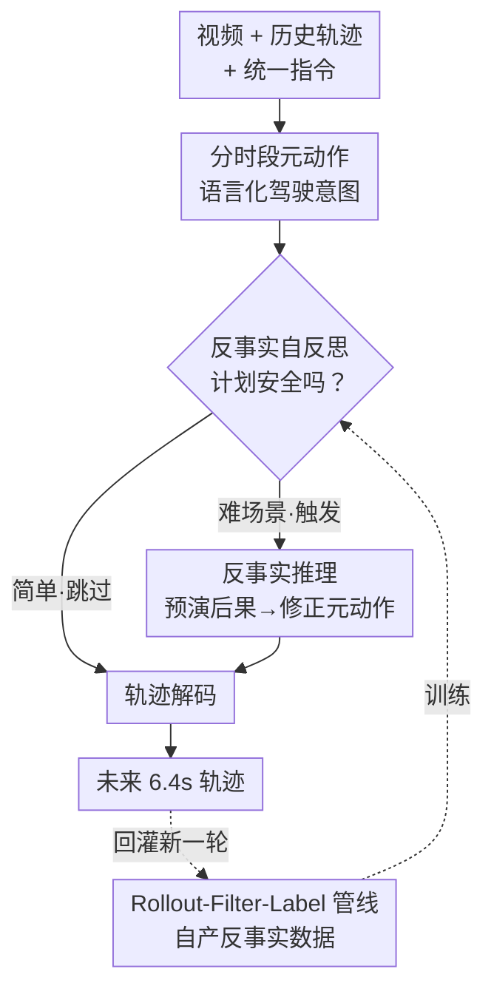

# Counterfactual VLA: Self-Reflective Vision-Language-Action Model with Adaptive Reasoning

**会议**: CVPR 2026  
**论文**: [CVF Open Access](https://openaccess.thecvf.com/content/CVPR2026/html/Peng_Counterfactual_VLA_Self-Reflective_Vision-Language-Action_Model_with_Adaptive_Reasoning_CVPR_2026_paper.html)  
**代码**: 无（NVIDIA 内部数据集，未开源）  
**领域**: 自动驾驶 / Vision-Language-Action  
**关键词**: VLA、反事实推理、自反思、自动驾驶、自适应思考

## 一句话总结
CF-VLA 让自动驾驶 VLA 先生成"分时段元动作"，再对自己刚提出的动作做反事实推理（"如果照这个计划走会怎样、该不该改"）并在出轨迹前自我修正，配合一条 rollout–filter–label 数据管线只在难场景上标注反事实 trace，从而学出"只在该想的时候才想"的自适应推理，轨迹精度提升约 17.6%、安全指标提升约 20%。

## 研究背景与动机

**领域现状**：带推理的 VLA（reasoning-augmented VLA）近两年成为端到端自动驾驶/机器人操作的主流增量——大视觉语言 backbone 在出动作前先生成一段中间语言 trace，描述它看到了什么、打算做什么，以此提升可解释性和鲁棒性（SimLingo、Alpamayo-R1、AutoVLA 等）。

**现有痛点**：这些 trace 几乎都是**描述性**而非**自反思**的。模型只会说"前面有行人在过马路""我应该小心"，但一旦它吐出一个文本意图，这个意图就被当成 ground truth 直接喂给底层策略，**没有任何环节回头检查这条指令本身是否和视觉线索冲突、该不该改**。换句话说，模型会"解说"却不会"质疑自己"。

**核心矛盾**：已有的"自我纠错"要么是事后救火（replanning/failure recovery，必须先观测到一次失败），要么依赖外挂的 world model / verifier 来模拟未来、评判计划好坏。外部模拟能评价一个计划，但**没法让 VLA 理解自己的推理过程**——这和真正的自反思有本质区别。能不能把反事实自反思做进 VLA 内部，不靠外部世界模型？两个障碍挡在前面：① 多数 VLA 的动作是 latent token，语言模型**没有抓手去谈论自己的动作**（缺 action→language 对齐）；② 标准训练管线从不教模型回答"按我刚提的计划走会发生什么、该怎么改"这类反事实问题。

**本文目标**：在 VLA 前向过程内部植入一个反事实自反思回路，对自己预测的控制量做因果分析并在执行前修正，且无需外部 verifier。

**核心 idea**：用**分时段元动作**做语言↔动作的对齐抓手，把推理从"对场景的一次性描述"升级为"对自己行为计划的反事实分析 + 可执行的自我纠正"，并用一条自产数据管线只在"元动作是瓶颈"的难场景上标注反事实监督。

## 方法详解

### 整体框架

CF-VLA 的输入是两路前视视频（120° 广角 + 30° 长焦，2 Hz、过去 2 s）、自车历史轨迹（过去 1.6 s 编成一个 history token）和统一指令 prompt；输出是覆盖未来 6.4 s 的离散轨迹 token。和普通 VLA 直接 `meta-actions → trajectory` 不同，CF-VLA 在中间插了一个自反思回路：

$$\text{meta-actions} \to \text{CF 推理} \to \text{更新后的 meta-actions} \to \text{trajectory}$$

模型先预测一串语言化的分时段元动作（概括驾驶意图），然后**以视觉上下文 + 自己刚提的元动作为条件**做一段反事实 chain-of-thought："如果照这个计划走会发生什么、是否可取？"，识别出不安全/次优的计划（如"朝路口加速" → "提前减速让行"），输出修正后的元动作，再据此解码最终轨迹。关键在于：要不要触发这段推理由模型自己决定（自适应思考），而能不能学会反事实推理则靠一条 rollout–filter–label 管线自产训练数据。

整条系统分两侧：**推理侧**是上面那个 `meta→CF→meta→traj` 的自反思前向；**数据侧**是把当前模型 rollout 一遍、筛出"元动作是瓶颈"的高价值场景、再用教师模型给它们标反事实 trace，喂回去训练。训练好的 CF-VLA 还能再塞回这条管线产新一轮数据，形成自我增强飞轮。

### 关键设计

**1. 分时段元动作：给语言模型一个"谈论自己动作"的抓手**

针对"动作是 latent token、语言无从谈起"这个障碍，CF-VLA 不用连续控制量或不可解释的 token，而是把驾驶意图拆成三条正交维度的语言原语：纵向（Accelerate / Decelerate / Keep Speed / Wait / Reverse）、横向（Straight / Left Turn / Right Turn）、车道（Keep Lane / Left/Right Lane Change）。每条维度在 6.4 s 规划窗内被切成**互不重叠的时间段**，例如"0.0–2.8s: Keep Speed，2.8–6.4s: Accelerate"。

这个"分时段"是关键：它和连续轨迹的时间结构天然对齐，让模型能在语言空间里**组合式地推理动作切换**（什么时候从保持速度切到减速），也让后续的反事实推理有对象可改——改的就是某个时间段的纵向/横向/车道标签。它扮演的是操作类 VLA 里"low-level command"的角色，但多了时间维度，因此能直接挂到轨迹结构上。消融（见下）显示，一旦把元动作用 ground truth 预填，轨迹误差直接砍半，说明剩余误差主要来自元动作预测不准而非轨迹解码——这正是要在元动作上做反事实推理的直接动机。

**2. 自反思反事实推理回路：在出轨迹前质疑并修正自己的计划**

这是全文核心。普通 reasoning-VLA 把元动作当最终答案，CF-VLA 则把它当"待审计的草案"：以视觉上下文和自己的元动作为条件，生成一段反事实 trace，诊断"为什么当前计划不如专家计划"以及"该怎么调"，然后吐出**更新后的元动作**，再解码轨迹。例如草案是"加速冲向环岛"而画面里有行人正在穿行，推理会指出这会违反路权、有碰撞风险，把纵向动作改成"提前减速 + 等待"。

它和已有"自我纠错"的本质区别：不依赖外部 world model 或 verifier，反事实评估发生在**同一次前向内部**，是 online self-correction。机制上靠语言空间统一：元动作和推理都是语言 token，是否进入反思由第一段元动作之后生成的控制词（`Action:` 直接出轨迹，`Thinking:` 进入反事实推理）决定。

**3. Rollout–Filter–Label 反事实数据管线：只在"元动作是瓶颈"的场景上标监督**

标准训练不教反事实推理，而人工标注又太贵。CF-VLA 用一条自产管线从模型自己的行为里挖高价值场景：

- **Rollout**：拿一个已会元动作、但还不会反事实推理的基座 VLA，在训练集上跑两套轨迹——自由生成 $x_{\text{free}}$（模型先预测元动作再解码轨迹）和预填元动作 $x_{\text{pf}}$（用 ground-truth 元动作、只解码轨迹），每种各采样 6 条。
- **Filter**：用最小位移误差 $\text{minADE}(x, x^\star)$ 衡量与专家未来的差距，挑出满足 $\text{minADE}(x_{\text{pf}}, x^\star) < \text{minADE}(x_{\text{free}}, x^\star)$ 且 $\text{minADE}(x_{\text{free}}, x^\star) > \epsilon$（$\epsilon=0.5$）的场景。直觉是：这些场景模型自由生成时表现差、但一旦把元动作填对就能贴上专家轨迹（且元动作 IOU 偏低）——**说明元动作正是瓶颈**，改对元动作就能直接收割轨迹提升。对角线上方（自由生成已经够好）的场景反事实监督收益有限，不标。
- **Label**：对筛出的场景，用高容量教师模型 Qwen2.5-VL-72B-Instruct 生成一段简洁反事实 trace，说明当前元动作为何次优、该如何调整，构成反事实数据集 $D_{\text{CF}}$。

这条"用轨迹分歧度做过滤"的设计是性能关键（消融见 Table 3）：只在瓶颈场景上标，比给全量样本都标既更准又输出更短。

**4. 自适应思考 + 多轮自增强飞轮：从混合数据里学"何时该想"，并越滚越省**

CF-VLA 没有用规则或额外 RL 去判断场景难易，而是把带/不带反事实 trace 的样本混在**同一条统一指令 prompt** 下训练，让模型隐式学会何时该反思——简单场景（跟车）几乎不触发，难场景（变道、转弯、VRU 弱势道路使用者）显著更频繁地思考。训练分阶段：先在纯轨迹集 $D_{\text{traj}}$ 学基本轨迹生成，再在 $D_{\text{traj}} \cup D_{\text{meta}}$ 上引入元动作，最后在 $D_{\text{traj}} \cup D_{\text{meta}} \cup D_{\text{CF}}$ 上微调出完整 CF-VLA，全程解冻所有参数。损失只在 assistant 生成的 token 上算交叉熵，且对反事实样本里**第一段（未修正的）元动作做 mask**，避免模型从自己的错误里学坏；元动作/推理/轨迹三组 token 各有不同 loss 权重。

更妙的是，训好的 CF-VLA 可以塞回 rollout–filter–label 管线产新一轮数据 $D_{\text{CF}}^{\text{Round2}}$。和 CoT 对同一场景只能生成几乎确定的解释不同，CF-VLA 的推理以预测元动作为条件，**同一场景能产出多样的推理 trace**，因此第二轮能继续榨取数据价值。实验显示第二轮在提升性能的同时把 think rate 砍掉近一半、输出更短，实现"精度↑ + 测试时算力↓"的双赢。

### 损失函数 / 训练策略
交叉熵只作用于 assistant token，prompt/system/user token 全部 mask；反事实样本的第一段元动作 block 也 mask 掉防止学错误。元动作、推理、轨迹三类 token 分配不同 loss 权重。轨迹用离散 token 表示，需扩充 VLM 词表以容纳轨迹 token 及 `<begin_of_traj>`/`<end_of_traj>`。模型规模与设计对标 Alpamayo-R1。

## 实验关键数据

数据集为 NVIDIA 内部 80,000 小时、25 国人类驾驶数据；$D_{\text{traj}}$ 约 1160 万段 20s 视频；$D_{\text{meta}}$ 训练集 433K 段 / 801K 样本、验证集 39K 段 / 73K 样本；$D_{\text{CF}}$ 约 200K 样本。指标分三类：轨迹精度（MinADE/AvgADE、MinFDE/AvgFDE、Corner Distance）、安全（Collision Rate、Off-road Rate）、推理质量（Meta-Action IOU、Output Length、Think Rate）。

### 主实验（Table 1，节选；↓越低越好，↑越高越好）

| 模型 | MinADE↓ | MinFDE↓ | Corner Dist.↓ | Collision↓ | Off-road↓ | IOU↑(init→edited) | Output Len.(Think Rate) |
|------|---------|---------|---------------|------------|-----------|-------------------|--------------------------|
| traj-only | 0.9283 | 2.5912 | 0.8563 | 0.0244 | 0.0720 | – | 10.00 (–) |
| meta-act (w/o route) | 0.8411 | 2.3647 | 0.7720 | 0.0224 | 0.0625 | 0.9169 | 85.32 (–) |
| lang-meta-act | 0.8021 | 2.2540 | 0.7358 | 0.0206 | 0.0617 | 0.9183 | 144.28 (1.00) |
| **CF-VLA (w/o route, round1)** | **0.7650** | **2.1416** | 0.6975 | 0.0191 | 0.0601 | 0.9153→0.9212 | 113.36 (0.148) |
| CF-VLA (w/o route, round2) | 0.7647 | 2.1365 | 0.6996 | 0.0194 | 0.0583 | 0.9174→0.9228 | 102.12 (0.083) |
| meta-act (w/ route) | 0.7263 | 1.9561 | 0.6600 | 0.0196 | 0.0619 | 0.9236 | 87.20 (–) |
| **CF-VLA (w/ route, round1)** | **0.6712** | **1.7988** | **0.6010** | **0.0177** | 0.0593 | 0.9207→0.9231 | 125.67 (0.219) |
| CF-VLA (w/ route, round2) | 0.6813 | 1.8291 | 0.6168 | **0.0174** | 0.0585 | 0.9238→0.9276 | 109.36 (0.123) |

- 性能阶梯清晰：traj-only < meta-act < lang-meta-act < CF-VLA。引入元动作较 traj-only 降约 9% minADE/FDE，加语言再降约 5%。
- CF-VLA 较非反思 meta-act 再降约 9–10% minADE/FDE，且反事实编辑后 IOU 提升约 0.5–1.0 绝对点。
- 安全：相对 traj-only，最佳 CF 模型碰撞率降约 25–30%、越界降约 15–20%、corner distance 降约 30%（摘要口径轨迹精度↑17.6%、安全↑20.5%）。
- 多轮：round2 在 AvgADE/FDE、越界、编辑后 IOU 上优于 round1，且 think rate 几乎减半、输出更短——精度与测试时开销同时改善。

### 消融实验（Table 2 & 3，w/o route 或 w/ route）

| 配置 | MinADE↓ | AvgADE↓ | IOU(init→edited) | Think Rate | 说明 |
|------|---------|---------|-------------------|------------|------|
| meta-act (baseline) | 0.8411 | 1.6216 | 0.9169 | – | 元动作基线 |
| meta-act (pre-filled) | 0.4831 | 0.9968 | 1.0 | – | 元动作填对，误差近乎砍半 |
| **CF-VLA (adaptive)** | **0.7650** | 1.5606 | 0.9153→0.9212 | 0.148 | 自适应反思，最佳权衡 |
| CF-VLA (force no think) | 0.7897 | 1.4890 | 0.9133 | 0.0 | 强制不想，难场景吃亏 |
| CF-VLA (force think) | 0.9319 | 2.1144 | 0.9132→0.8565 | 1.0 | 强制always想，反而退化 |
| CF-VLA (filtered ds) | 0.6712 | 1.4574 | 0.9207→0.9231 | 0.219 | 仅瓶颈场景标注，更准更短 |
| CF-VLA (whole ds) | 0.6811 | 1.4185 | 0.9207→0.9231 | 0.668 | 全量标注，think rate 高 3 倍 |

### 关键发现
- **元动作是瓶颈**：把元动作预填成 ground truth 后 MinADE 从 0.84 直接降到 0.48、近乎砍半，证明"剩余误差主要来自元动作预测"——这是把反事实推理放在元动作上而非轨迹上的根本依据。
- **该想才想最好**：force think（永远思考）不仅算力翻几倍（输出 257 vs 87 token），轨迹精度反而退化（MinADE 0.93）、编辑后 IOU 下降；force no think 又在难场景吃亏；adaptive 在两者间取得最佳权衡。
- **过滤是关键**：filtered ds 与 whole ds 编辑后 IOU 相同，但 filtered 的 MinADE/MinFDE/corner 更优、输出短得多（think rate 0.219 vs 0.668）——只在瓶颈场景上标更有效。
- **难度与思考强相关**：think rate 与 minADE 强相关，跟车类简单场景几乎不触发推理，变道/转弯/VRU 等高风险场景显著触发更多，且 CF-VLA 在越难的场景上误差下降越大。

## 亮点与洞察
- **把"自反思"做进前向内部而非外挂 verifier**：反事实评估和修正发生在同一次生成里，靠语言空间的控制词（`Action:`/`Thinking:`）切换，省掉了外部 world model，这是和 replanning/world-model VLA 的本质分野。
- **用"预填元动作 vs 自由生成"的轨迹分歧度自动挖瓶颈场景**：不需要人工判难易，$\text{minADE}(x_{\text{pf}})$ 远好于 $\text{minADE}(x_{\text{free}})$ 就说明"元动作是短板"，这个数据挖掘 trick 可迁移到任何"高层意图→低层执行"两段式策略的难例挖掘。
- **自适应推理可纯靠 SFT 涌现**：不靠 RL（对比 AdaThinkDrive）、不靠规则启发式，只把混合数据放进统一 prompt 训练，模型就学会"看场景难度分配算力"——这点很反直觉也很省。
- **反事实数据的多样性带来飞轮**：因为推理以预测元动作为条件，同一场景每轮 rollout 能产不同 trace，使多轮自训练真能持续榨取价值而非 CoT 那种确定性复读。

## 局限与展望
- **闭源 + 私有数据**：80,000 小时内部数据、无代码，外部几乎无法复现；所有指标都在自家验证集上，跨数据集泛化未知。
- **依赖大教师模型标注**：反事实 trace 由 Qwen2.5-VL-72B 生成，trace 质量受教师能力上限约束，可能引入教师自身的偏差/幻觉（⚠️ 论文未量化 trace 正确率）。
- **开环评估**：MinADE/Collision 等都是对专家未来的位移/几何比较，属开环指标，是否在闭环驾驶中真正减少事故仍需验证。
- **think 触发靠隐式学习**：何时该想完全由数据混合比例隐式决定，缺乏显式可控旋钮；force think 反而退化也提示该机制对训练分布敏感。
- **改进方向**：把 CF 推理接入闭环仿真做真·后果预演、用更小教师或自蒸馏降标注成本、给 think 触发加可解释的置信度信号。

## 相关工作与启发
- **vs SimLingo / CAST / VLAPS**：它们用反事实做"外部"——生成反事实指令-动作对或在仿真未来里搜索来改进策略，底层 VLA 自己并不推理或修改自己的计划；CF-VLA 在前向内部对**自己预测的元动作**做反事实并修正。
- **vs world-model VLA（如依赖未来预测模型判计划好坏的一类）**：外部模拟能评价计划但帮不了 VLA 理解自己的推理过程；CF-VLA 不要外部 verifier，是 model-internal 自反思。
- **vs OneTwoVLA / AdaThinkDrive（自适应推理）**：OneTwoVLA 用控制 token 在子任务边界切快/慢思考，慢思考绑定的是"任务切换"而非场景难度；AdaThinkDrive 用规则分难易 + RL 学何时想；CF-VLA 则**纯 SFT** 让自适应推理从"按模型自身能力识别难例 + 混合数据"中涌现，把算力集中到最难场景。
- **vs AutoVLA / Alpamayo-R1（reasoning-VLA）**：它们的 CoT 主要是一次性可解释 rationale；CF-VLA 把 trace 从"描述"升级为"对自己行为的因果自纠正信号"。

## 评分
- 新颖性: ⭐⭐⭐⭐⭐ 把反事实自反思做进 VLA 前向内部、且自适应推理纯靠 SFT 涌现，paradigm 层面是新的。
- 实验充分度: ⭐⭐⭐⭐ 主表 + 多组消融（元动作/自适应/过滤/多轮）扎实，但全在私有闭源数据、纯开环指标，外部不可复现。
- 写作质量: ⭐⭐⭐⭐ 动机推导清晰、图示到位，meta→CF→meta→traj 回路一目了然。
- 价值: ⭐⭐⭐⭐ 数据挖掘 trick 与自适应 SFT 思路可迁移到广义两段式策略，对端到端自动驾驶的安全性有实际意义。

<!-- RELATED:START -->

## 相关论文

- [\[CVPR 2026\] AT-VLA: Adaptive Tactile Injection for Enhanced Feedback Reaction in Vision-Language-Action Models](at-vla_adaptive_tactile_injection_for_enhanced_feedback_reaction_in_vision-langu.md)
- [\[CVPR 2026\] TRM-VLA: Temporal-Aware Chain-of-Thought Reasoning and Memorization for Vision-Language-Action Models](trm-vla_temporal-aware_chain-of-thought_reasoning_and_memorization_for_vision-la.md)
- [\[CVPR 2026\] ACoT-VLA: Action Chain-of-Thought for Vision-Language-Action Models](acot-vla_action_chain-of-thought_for_vision-language-action_models.md)
- [\[CVPR 2026\] AwareVLN: Reasoning with Self-awareness for Vision-Language Navigation](awarevln_reasoning_with_self-awareness_for_vision-language_navigation.md)
- [\[CVPR 2026\] SRPO: Self-Referential Policy Optimization for Vision-Language-Action Models](srpo_self-referential_policy_optimization_for_vision-language-action_models.md)

<!-- RELATED:END -->
