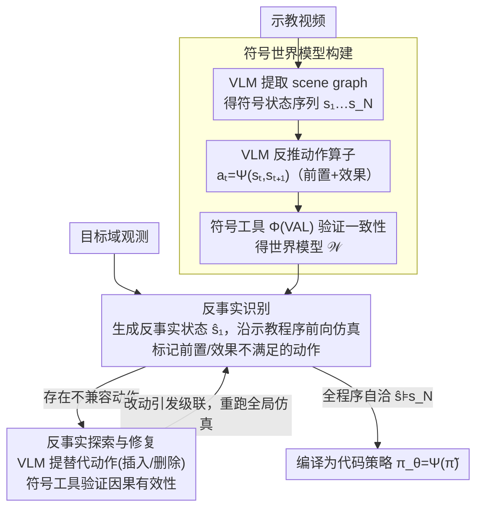

<!-- 由 src/gen_stubs.py 自动生成 -->
# Cross-Domain Demo-to-Code via Neurosymbolic Counterfactual Reasoning

**会议**: CVPR2026  
**arXiv**: [2603.18495](https://arxiv.org/abs/2603.18495)  
**代码**: 待确认  
**领域**: 机器人  
**关键词**: video-instructed robotic programming, cross-domain adaptation, neurosymbolic reasoning, counterfactual reasoning, code-as-policies

## 一句话总结

提出 NeSyCR 神经符号反事实推理框架，将视频示教抽象为符号世界模型，通过反事实状态推演检测跨域不兼容并自动修正程序步骤，在跨域 demo-to-code 任务上比最强基线 Statler 提升 31.14% 成功率。

## 背景与动机

1. **Code-as-Policies 范式兴起**：LLM/VLM 具备代码生成能力，使从语言指令或视频示教合成可执行机器人控制代码成为可能，但跨域适应仍是关键挑战
2. **视频示教的域差距不可避免**：示教域与部署域之间存在环境布局、物体属性、机器人构型等固有差异，直接模仿示教行为会导致程序失败
3. **感知观测不足以解释程序性差异**：观测能揭示物理差异，但无法解释结构性差异如何破坏底层任务程序或因果依赖关系
4. **VLM 缺乏程序性理解**：当前 VLM 难以重新构建因果依赖并在域偏移下实现行为兼容，容易产生语义合理但逻辑不一致的动作
5. **级联不兼容难以处理**：跨域差异不仅影响单个步骤，还可能引发级联不兼容（如工具位置变化导致后续步骤受阻），需要全局程序重排
6. **现有方法缺乏可验证的适应机制**：基于 VLM 的推理方法缺少符号工具验证，世界模型方法依赖从单次示教构建完整领域知识，常产生无效计划

## 方法详解

### 整体框架

NeSyCR 把跨域 demo-to-code 当成一个反事实推理问题：输入一段示教视频加目标域观测，输出能在新域里跑通的代码策略。它分两阶段——先从示教视频抽象出一个可前向仿真、可逻辑验证的符号世界模型（symbolic world model），再拿这个世界模型和目标域观测对照，用反事实推演分两步把程序改对：先**识别**哪些步骤换到新域会崩，再**探索修复**这些步骤、并在改动后反复重跑仿真直到整条程序重新自洽，最后把修好的符号程序编译成可执行代码。VLM 负责"看懂画面、出主意"，符号工具（symbolic tool，基于 VAL）负责"算清逻辑、把关验证"，两者在一个 repeat-until 闭环里互相约束。

### 关键设计

**1. 符号世界模型构建：把视频示教翻译成可前向仿真、可验证的轨迹**

观测本身只能告诉你环境长什么样，却解释不了一段操作背后的因果依赖——这正是直接模仿示教在跨域时失败的根源。NeSyCR 先让 VLM 把每帧观测提取成带物体实体和空间关系的 scene graph，得到符号状态序列 $\{s_1, \dots, s_N\}$；再对每对连续状态 $(s_t, s_{t+1})$ 用 VLM 反推出动作算子 $a_t = \Psi(s_t, s_{t+1})$，明确写出它的前置条件（precondition）和效果（effect）。关键是接着用符号工具 $\Phi$（基于 VAL）做一致性验证 $\forall t,\ \Phi(s_t, a_t) \models s_{t+1}$，确保整个世界模型 $\mathcal{W} = (\mathcal{Q}, \mathcal{P}, \mathcal{A}, \Phi)$ 逻辑自洽。采用 STRIPS 式形式化后，这个世界模型既能前向执行又能被逻辑校验，为后面的反事实推演提供了一个"可以做思想实验"的沙盘。消融里去掉它（w/o 符号世界模型）成功率掉了 34.21%，是降幅最大的一项，说明可验证的符号表示是整套方法的地基。

**2. 反事实识别：在符号层面推演"换个域哪一步会崩"**

有了沙盘，就能问反事实问题：如果把示教程序原封不动搬到目标域，哪一步会出错？NeSyCR 让 VLM 从目标域观测生成反事实初始状态 $\hat{s}_1$（相当于对反映域条件的变量做一次干预），再让符号工具沿示教程序逐步前向仿真。判定规则很明确：一旦某个动作的前置条件在当前反事实状态下不再满足，或它的效果无法在下一状态复现，就把它标记为不兼容。这一步只做"诊断"、不动程序，作用是把跨域差异精确定位到具体哪几个动作上——消融中单独去掉它（w/o 反事实识别）成功率降 21.05%，可见准确定位是后续修复的前提。

**3. 反事实探索与修复：局部改写程序并迭代到自洽（自然覆盖级联不兼容）**

定位到不兼容动作后，NeSyCR 在符号状态空间里做"加减法"式的局部修复：对每个不兼容动作，VLM 利用常识提出替代动作——其效果要能恢复后续有效动作 $a_{t+1}$ 被破坏的前置条件（如插入"先关上层抽屉"这类辅助步骤）；若找不到可用替代、或该动作对目标已冗余，就直接删除。每个候选都交给符号工具验证因果有效性（Eq.8），最终让适应后的程序 $\tilde{\pi}$ 满足 $\forall t,\ \Phi(\hat{s}_t, \tilde{a}_t) = \hat{s}_{t+1}$ 且最终 $\hat{s}_{t+1} \models s_N$（仍到达目标状态），再编译成代码策略 $\pi_\theta = \Psi(\tilde{\pi})$。关键在于这是一个 repeat-until 循环：每次改动后都重跑一遍全局前向仿真，所以一处修改激起的连锁不兼容（如挪动工具位置导致后面好几步都拿不到前置条件）会被自动检测并继续修，直到整条程序重新自洽——级联不兼容因此被这个迭代结构天然吃掉，而不是只盯着出问题的那一步。消融去掉替代动作验证（w/o 替代动作验证）成功率降 18.42%。比起从头重规划，这种"只做局部手术"保留了更多示教结构，也比纯 VLM 推理多了一层逻辑保证。

### 一个完整示例

以真实世界里"抽屉垂直堆叠"那个场景为例：示教视频里两个抽屉是水平并排的，机械臂依次去开它们；目标域换成上下垂直堆叠后，符号工具从反事实初始状态 $\hat{s}_1$ 出发前向仿真，走到"开下层抽屉"这一步时发现它的前置条件——上层抽屉已关闭、不挡路——在新域里并不成立，于是标记为不兼容。VLM 据此提议在这步之前插入"先关上层抽屉"的替代动作，符号工具验证插入后整条程序仍能逐步满足前置条件、最终到达目标状态，便接受这个修改并编译进最终代码策略。这样原本会因抽屉互相干涉而失败的程序，就被自动改成了交替操作的可行版本。

## 实验关键数据

### 实验设置

- **跨域因素**：5 类——障碍物（Obstruction）、物体可供性（Object affordance）、运动学配置（Kinematic config）、夹爪类型（Gripper type）、组合
- **基准任务**：长时序操作（最多 116 次 API 调用），涵盖抓放、扫动、旋转、滑动等子任务
- **复杂度分 3 级**：Low/Medium/High，共 440 个场景
- **6 个基线**：Demo2Code、GPT4V-Robotics、Critic-V、MoReVQA、Statler、LLM-DM

### 主要结果（Table 1 — 仿真环境）

| 方法 | SR (Low) | SR (Med) | SR (High) | 说明 |
|------|---------|---------|----------|------|
| Demo2Code | 26.67 | 25.00 | 22.50 | 无适应机制 |
| GPT4V-Robotics | 71.67 | 41.67 | 20.00 | VLM 推理 |
| Statler | 61.67 | 41.67 | 5.00 | 世界模型但无符号验证 |
| **NeSyCR** | **86.67** | **75.00** | **60.00** | 本文方法 |

- NeSyCR vs Statler 平均 SR 提升 **31.14%**，vs GPT4V-Robotics 平均 SR 提升 **27.73%**
- 在组合跨域因素下，NeSyCR 仍保持 47.5-80.0% SR，Statler 降至 32.5-67.5%

### 真实世界实验（Table 2）

| 方法 | SR | GC | PD |
|------|-----|-----|-----|
| Demo2Code | 0.00 | 25.00 | — |
| GPT4V-Robotics | 50.00 | 75.00 | 0.00 |
| Statler | 50.00 | 67.86 | 42.86 |
| **NeSyCR** | **87.50** | **98.21** | 24.49 |

- 使用 Franka Emika Research 3 机械臂，从人类视频示教适应到真实机器人部署
- 抽屉垂直放置场景：需要交替操作两个抽屉避免相互干涉

### 消融实验（Table 3）

| 变体 | SR | 下降 |
|------|-----|------|
| NeSyCR（完整） | 68.42 | — |
| w/o 替代动作验证 (Eq.8) | 50.00 | -18.42 |
| w/o 反事实识别 (Eq.6) | 47.37 | -21.05 |
| w/o 两者 | 39.47 | -28.95 |
| w/o 符号世界模型 (Eq.4) | 34.21 | -34.21 |

去除符号世界模型影响最大，证明可验证的符号推理是核心。

## 亮点

- **将跨域 demo-to-code 建模为反事实推理**，提供了一个清晰的形式化框架（STRIPS + 反事实状态空间探索）
- **VLM 与符号工具的协同设计精妙**：VLM 利用常识提出候选，符号工具保证逻辑正确性，互补性强
- **处理级联不兼容**：能自动检测一个修改如何影响后续步骤并进行全局修正
- **真实世界验证充分**：不仅在仿真中做了大规模定量实验（440 场景），还在真实机器人上验证了端到端可行性
- **实验设计精细**：5 类跨域因素 × 3 级复杂度的系统化实验矩阵，便于分析不同维度的性能

## 局限与展望

- **任务复杂度差距过大时性能显著下降**：当部署任务远超示教复杂度时，反事实推理难以弥补信息缺失
- **依赖 VLM 的 scene graph 提取质量**：符号状态翻译的准确性受限于 VLM 的感知能力
- **STRIPS 式表示的表达力有限**：难以建模连续物理量、柔性物体等复杂场景
- **计算开销**：VLM + 符号工具的迭代验证可能在长序列任务中引入较大延迟
- **单次示教限制**：仅从一个示教视频构建世界模型，多样性不足

## 与相关工作的对比

- **vs Code-as-Policies (SayCan, ProgPrompt)**：本文关注跨域适应而非单域代码生成
- **vs Demo2Code**：Demo2Code 直接模仿示教，无适应机制；NeSyCR 通过反事实推理修正程序
- **vs Statler**：Statler 有符号状态表示但未集成符号验证工具，从头重规划导致高复杂度下崩溃
- **vs LLM-DM**：LLM-DM 从单次示教构建完整领域知识，常生成无效计划；NeSyCR 保留示教结构仅做局部修正
- **vs 行为克隆/逆强化学习**：这些方法在感知和物理变化下泛化困难，NeSyCR 在符号层面进行适应

## 评分

- 新颖性: ⭐⭐⭐⭐ — 反事实推理 + 神经符号验证的组合在 demo-to-code 领域是新范式
- 实验充分度: ⭐⭐⭐⭐⭐ — 440 场景系统化实验 + 真实机器人验证 + 细粒度控制变量分析
- 写作质量: ⭐⭐⭐⭐ — 形式化清晰，符号表述严谨，案例讲解直观
- 价值: ⭐⭐⭐⭐ — 为跨域机器人编程提供了可验证的适应框架，方向重要

<!-- RELATED:START -->

## 相关论文

- [\[NeurIPS 2025\] NeSyPr: Neurosymbolic Proceduralization For Efficient Embodied Reasoning](../../NeurIPS2025/robotics/nesypr_neurosymbolic_proceduralization_for_efficient_embodied_reasoning.md)
- [\[ICLR 2026\] One Demo Is All It Takes: Planning Domain Derivation with LLMs from A Single Demonstration](../../ICLR2026/robotics/one_demo_is_all_it_takes_planning_domain_derivation_with_llms_from_a_single_demo.md)
- [\[ICML 2026\] Turning Adaptation into Assets: Cross-Domain Bridging for Online Vision-Language Navigation](../../ICML2026/robotics/turning_adaptation_into_assets_cross-domain_bridging_for_online_vision-language_.md)
- [\[ICML 2026\] Decompose and Recompose: Reasoning New Skills from Existing Abilities for Cross-Task Robotic Manipulation](../../ICML2026/robotics/decompose_and_recompose_reasoning_new_skills_from_existing_abilities_for_cross-t.md)
- [\[CVPR 2026\] DecoVLN: Decoupling Observation, Reasoning, and Correction for Vision-and-Language Navigation](decovln_decoupling_observation_reasoning_and_correction_for_vision-and-language_.md)

<!-- RELATED:END -->
