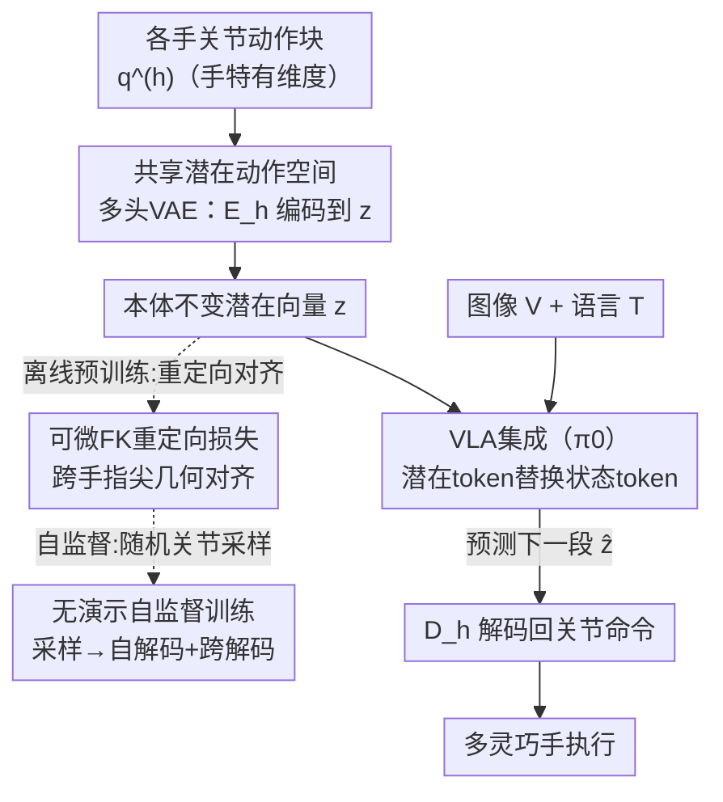

# Cross-Hand Latent Representation for Vision-Language-Action Models

**会议**: CVPR 2026  
**论文**: [CVF Open Access](https://openaccess.thecvf.com/content/CVPR2026/html/Jiang_Cross-Hand_Latent_Representation_for_Vision-Language-Action_Models_CVPR_2026_paper.html)  
**代码**: https://xl-vla.github.io （项目页）  
**领域**: 机器人 / 具身智能  
**关键词**: 视觉-语言-动作模型, 灵巧手, 跨本体, 潜在动作空间, 重定向  

## 一句话总结
XL-VLA 为四种结构各异的灵巧手训练了一个共享的、与本体无关的潜在动作空间，把它直接插进 π0 这样的 VLA 框架替换原来的关节状态 token，使单一手无关策略能同时控制多种灵巧手，在真机上把跨本体操作平均成功率从 0.55 提到 0.90。

## 研究背景与动机
**领域现状**：视觉-语言-动作（VLA）模型把大规模视觉/语言模型的能力延伸到机器人控制——看图、理解语言指令、输出动作。主流做法是把动作当成序列模型的额外输出模态，和视觉、语言一起做 seq-to-seq 建模。

**现有痛点**：语言有相对稳定通用的"词表"，但机器人的动作空间天生绑定在机器人的形态上。对灵巧手尤其严重——动作参数化（关节角度）在不同手之间差异巨大，且新硬件层出不穷。每出一款新手就要重新采一大批数据，成本高到不现实。

**核心矛盾**：要做可扩展的跨本体学习，就得有一个能跨多种手复用的统一动作表示；但关节空间维度（Ability/Inspire 12 维、X-Hand 12 维、Paxini 16 维）、手指数（4 或 5 指）、驱动方式都不一样，没法直接共享。

**本文目标**：拆成两个具体子问题——(1) 如何在一族机器人内定义统一的动作表示？(2) 如何无缝接入一个动作空间和现有手不同的新机器人？

**切入角度**：作者观察到，虽然每只手的关节空间是手特有的，但执行动作时**指尖的几何关系**（比如拇指到各指的捏合距离与方向）是可以跨手对齐的语义量。于是把"手特有的关节"和"手无关的序列模型"解耦——序列模型只在一个共享潜在空间里工作，手的身份只用来挑选对应的编解码器。

**核心 idea**：用一个跨手共享的潜在动作空间替代各手各自的原始关节空间，作为可直接插进标准 VLA 的"本体不变"动作表示，从而实现跨本体联合训练与零样本复用。

## 方法详解

### 整体框架
XL-VLA 由两部分组成：**(1) 一个预训练好的跨本体潜在动作空间**（一组手特有的编码器 $E_h$ / 解码器 $D_h$，它们都映射到同一个潜在分布），以及 **(2) 一个建立在 π0 之上的 VLA 主干**（视觉、语言编码器 + 动作专家 action expert）。

潜在空间先独立于 VLA 单独预训练好；之后训练 VLA 时把这些编解码器**全部冻结**。在线推理时，对手 $h$，先用 $E_h$ 把上一段绝对关节动作块 $q_t^{(h)}$（64 帧 @ 20 Hz，约 3.2 秒）压成一个紧凑潜在向量 $z_t = E_h(q_t^{(h)})$；VLA 主干以一小段这样的潜在 token 历史加上视觉、语言 token 为条件，预测下一段潜在块 $\hat z_{t+1}$；再用本体对应解码器 $D_h$ 解回关节命令 $\hat q_{t+1}^{(h)} = D_h(\hat z_{t+1})$。关键点：手身份 $h$ **只用于选择 $E_h/D_h$，从不作为显式 token 喂给 VLA 主干**，所以同一个手无关策略能跨手运行。

### 关键设计

**1. 共享潜在动作空间 + 多头 VAE 自编码器：让维度不同的手共用一个动作流形**

针对"每只手关节空间维度/结构都不一样、没法共享"的痛点，作者不为每只手单独定义动作空间，而是用一个**多头 VAE 风格的自编码器**把所有手映射到同一潜在分布。对每只手 $h$，编码器输出高斯后验参数 $(\mu^{(h)}, \sigma^{(h)}) = E_h(q^{(h)})$，用重参数化技巧采样潜在码 $z$，即 $q(z\mid q^{(h)}) = \mathcal N(\mu^{(h)}, \mathrm{diag}((\sigma^{(h)})^2))$，解码器再重建回关节空间 $\hat q^{(h)} = D_h(z)$。每个编解码器都是轻量 MLP。最基础的重建约束 $L_1$ 保证自编码不退化任何一只手的运动学：

$$L_1 = L_{rec} = \frac{1}{|H|}\sum_{h\in H}\mathrm{MSE}\big(\hat q^{(h)}, q^{(h)}\big)$$

只有 $L_1$ 还不够——它只保证每只手各自自编码良好，潜在码并没有被逼到"同一个 $z$ 在不同手上意义相同"。这正是下一个设计要补的。

**2. 可微前向运动学的重定向损失：用指尖几何把不同手的同一潜在码对齐**

要让潜在空间真正跨本体，必须让"同一个 $z$ 在不同手上产生几何一致的动作"。作者用**可微前向运动学（FK）**把关节映成指尖位置 $p_i^{(h)}$，定义指尖位移 $\delta_{ij}^{(h)} = p_i^{(h)} - p_j^{(h)}$，对子集 $P$（拇指对食/中/无名/小指四对捏合）施加重定向损失，惩罚源手 $s$ 与目标手 $t$ 之间捏合距离与方向的差异：

$$L_2 = \frac{1}{|H|(|H|-1)|P|}\sum_{s\neq t}\sum_{(i,j)\in P} w_{ij}^{(s)}\Big(\lambda_{dis}\big(\|\delta_{ij}^{(s)}\|_2 - \|\hat\delta_{ij}^{(t)}\|_2\big)^2 + \lambda_{dir}\big(1 - c_{ij}^{(s,t)}\big)\Big)$$

其中 $\hat\delta_{ij}^{(t)}$ 来自目标手解码后的配置，$c_{ij}^{(s,t)}$ 是两手捏合方向的余弦相似度，权重 $w_{ij}^{(s)} = \exp(-\lambda_{dis}^{exp}\|\delta_{ij}^{(s)}\|_2)$ 让越紧的捏合权重越大。手指索引按语义手工对齐；Paxini 缺小指，评估 $L_2$ 时丢掉涉及小指的对。这一项是潜在码"跨手语义一致"的核心来源——它把"对齐"这个本来需要配对轨迹监督的事，变成了只靠 FK 几何就能算的可微目标。

**3. 无演示的自监督潜在对齐训练：不要任何配对轨迹也能把空间对齐**

潜在自编码器训练时**完全不用演示数据，也不用 IK 生成的轨迹**。对每只手 $s$，在硬件关节限位内**随机采样**关节配置 $q^{(s)}$；把它编码成 $z$，再用**所有**解码器 $\{D_t\}_{t\in H}$ 解码：自解码 $D_s(z)$ 贡献 $L_1$，跨手解码 $D_t(z)\ (t\neq s)$ 贡献 $L_2$。所有手的损失聚合后一次反传，编解码器联合优化。因为 $L_2$ 只用各手的 FK 和解码姿态，整个跨本体对齐是完全自监督的，**不需要任何配对的跨手轨迹**——这也是它比 LAD 等需要配对监督的方法更省数据的根本原因。再加一项把潜在变量正则到标准高斯先验的 KL 损失，让空间平滑可采样、可插值：

$$L_3 = L_{KL} = \mathbb E_q\big[\mathrm{KL}\big(q(z\mid q)\,\|\,\mathcal N(0, I)\big)\big]$$

总潜在目标为 $L_{latent} = L_1 + L_2 + \beta L_3$，固定 $\beta=10^{-5}$、$\lambda_{dis}=2000$、$\lambda_{dir}=5$、$\lambda_{dis}^{exp}=12$。

**4. 把潜在 token 插入 π0：用冻结编解码器让 VLA 直接吃本体不变动作**

VLA 主干沿用 π0（PaliGemma 初始化的 VLM + 动作专家）。原版 π0 用一摞**状态 token**提供本体感知历史；XL-VLA 把它们**整体替换成潜在动作 token**：对手 $h$，$E_h$ 把上一段关节动作块编成潜在向量喂进去，模型在潜在 token 历史 + 视觉/语言 token 上预测下一段潜在块，再由 $D_h$ 解回关节命令。VLA 微调时编解码器全冻结，只训练动作专家。这样做的好处是潜在空间一旦练好就能即插即用，VLM 预训练带来的网络先验也被完整保留；而旧式 VLA 把动作离散化成 token 自回归解码，难以支撑灵巧手所需的高频精细控制，本文换成在潜在空间回归连续动作块正好绕开这个瓶颈。

### 损失函数 / 训练策略
潜在空间在合成随机关节样本上预训练（$L_1 + L_2 + \beta L_3$）。VLA 阶段从 π0 权重初始化，在自采的 4 手 × 10 任务多本体数据集上微调 60K 步，batch 128，8×H100（80GB）。这是一个用语言条件化的统一跨本体多任务策略。

## 实验关键数据

数据集：2 臂 7-DoF xArm + Unitree G1，4 种手（Ability/Inspire/X-Hand1 5 指，Paxini DexH13 4 指），10 个真机操作任务，每任务每手 50 条遥操作演示、共 2000 条（论文 intro 另称约 2M state-action 对）。每个任务真机执行 10 次算成功率。

### 主实验：跨本体 VLA 建模（vs π0）
四手十任务（PF/SC/SoC/HB/RL/PS/RB/PuS/PoS/PC）平均成功率：

| 方法 | Ability | Inspire | Paxini | XHand | 总平均 |
|------|---------|---------|--------|-------|--------|
| π0（共享策略，原始关节空间） | 0.37 | 0.27 | 0.35 | 0.29 | 0.55* |
| **XL-VLA（潜在动作空间）** | **0.73** | **0.68** | **0.78** | **0.70** | **0.90** |

\* 论文按任务×手聚合后报告 π0 总均值 0.55 → XL-VLA 0.90（+0.35，约 +40%）。逐手看 Ability 0.37→0.73、XHand（机械结构最特殊）0.29→0.70，提升在 Sort Cans、Hand over Bottle、Re-arrange Boxes 这类高灵巧度任务上尤为明显。⚠️ 表中各手单行均值与"0.55→0.90"是不同聚合口径，以原文为准。

### 潜在重放对比（vs LAD，有监督潜在重定向）
把一对手的遥操作轨迹编码进潜在空间、解码到另一对手上真机重放，能无断触/无自碰执行算成功：

| 方法 | Ability+Inspire | Paxini+XHand |
|------|-----------------|--------------|
| LAD（有监督） | 0.60 | 0.61 |
| **XL-VLA（无监督）** | **0.82** | **0.81** |

XL-VLA 在完全无监督、无配对标签的情况下显著超过有监督的 LAD，且在 SC/SoC/HB 等精细任务上 LAD 退化明显。

### 消融实验（潜在空间设计，指标均"越低越好"）
| 配置 | Recon Joint↓ | 跨本体 PTdir↓ | RTdist↓ | 说明 |
|------|------|------|------|------|
| Ours（H128→64, dim 32） | 5.476 | 11.857 | 6.295 | 完整配置，各项均衡较优 |
| − $L_1$ | 61.672 | 11.741 | 6.375 | 去重建，单手重建彻底崩 |
| − $L_2$（both） | 3.781 | **62.733** | **62.809** | 去重定向，跨本体几何全崩 |
| − $L_2^{dir}$ | 4.966 | 46.217 | 5.518 | 去方向项，方向误差暴涨 |
| L128（潜在维过大） | 5.324 | 8.736 | 6.215 | 维度过大反而损害本体不变结构 |

### 关键发现
- **去掉哪个损失最致命要看目标**：去 $L_1$ 重建直接崩（Joint RMSE 5.48→61.7）；去 $L_2$ 跨本体方向/距离误差从约 12/6 暴涨到约 63/63——印证重定向损失是"跨手语义一致"的命根子。
- **潜在维度不是越大越好**：性能在很宽的架构/维度范围内稳定，只有潜在维显著增大（如 L128）才退化，说明过大的潜在空间反而妨碍学到本体不变结构；最终选 dim 32 在容量与紧凑度间折中。
- **零样本跨本体迁移**：把若干任务从某手训练集里 hold out，XL-VLA 直接经对应解码器迁移到"未见任务×手"组合，全面超过"π0 + 运动学重定向"基线，且在任何手/任务上从不低于基线；G1 跨机器人共训也比原始动作空间高约 +57%。

## 亮点与洞察
- **用可微 FK 把"跨本体对齐"从需要配对数据变成自监督几何目标**：这是最巧的一步——指尖捏合的距离与方向是跨手可比的语义量，FK 可微就能端到端优化，于是无需任何配对轨迹即可对齐潜在空间，直接省掉了跨本体数据采集这一最贵环节。
- **潜在空间与 VLA 解耦、即插即用**：编解码器先单独练好再冻结插进 π0，意味着换 VLA 主干或加新手只动一侧，工程上很干净；新手只要补一对 MLP 编解码器并加入联合训练即可。
- **把"动作离散 token 自回归"换成"潜在连续块回归"**：既保留 VLM 预训练先验，又绕开了离散化动作对高频灵巧控制的限制，这个思路可迁移到任何需要高自由度连续控制的 VLA。

## 局限与展望
- 评测全在自建的 4 手 + 2 臂平台、10 个桌面任务上，未见更开放场景或更长程任务；泛化边界尚不清楚。
- 跨手对齐依赖**手工对齐手指语义索引**（拇指-各指配对），对手指拓扑差异更大或非拟人手（如多指/缺拇指）能否自动对齐存疑 ⚠️。
- 潜在空间用**随机关节采样**训练，覆盖的是硬件可达关节配置，但真实操作分布可能集中在某些子流形；随机采样是否充分覆盖任务相关姿态、会不会在罕见姿态上解码失真，论文未深入。
- 改进方向：把手指语义对齐也学习化（而非手工）、把潜在训练分布与真实演示分布对齐、扩到全身/双臂协同动作空间。

## 相关工作与启发
- **vs LAD（Latent Action Diffusion）**：LAD 用扩散在重定向配对上学连续 EEF 潜在、需要监督；本文用 VAE + FK 重定向损失做**无监督**对齐，潜在重放成功率 0.82/0.81 远高于 LAD 的 0.60/0.61，且不要配对标签。
- **vs UniVLA / 离散 VQ 潜在 + 逐手解码**：那类方法用离散 token 与每手解码器，本文用连续潜在 + 多头 VAE，避免离散化对高频灵巧控制的损害。
- **vs π0（本文 VLA 基座）**：π0 靠调序列长度勉强容纳不同本体但表现不稳；本文把状态 token 换成本体不变潜在 token，跨本体平均成功率 0.55→0.90，是"统一动作表示"相对"原始关节空间"的直接收益。
- **vs 运动学重定向基线（π0+RT）**：几何重定向在精细协调指动（HB/RB）上易失配，本文潜在表示零样本迁移全面占优且从不低于基线。

## 评分
- 新颖性: ⭐⭐⭐⭐⭐ 用可微 FK 重定向损失把跨本体潜在对齐做成完全自监督，且即插进标准 VLA，思路干净有效。
- 实验充分度: ⭐⭐⭐⭐ 真机 4 手 10 任务 + 跨机器人 + 零样本 + 重放 + 多维消融，扎实；但平台与任务规模有限、缺更开放场景。
- 写作质量: ⭐⭐⭐⭐ 公式与 pipeline 清晰，但主结果聚合口径（0.55/0.90 与各行均值）标注略含糊。
- 价值: ⭐⭐⭐⭐⭐ 直击灵巧手 VLA 的跨本体数据成本痛点，新手只需加一对编解码器，实用性强。

<!-- RELATED:START -->

## 相关论文

- [\[CVPR 2026\] HiF-VLA: Hindsight, Insight and Foresight through Motion Representation for Vision-Language-Action Models](hif-vla_hindsight_insight_and_foresight_through_motion_representation_for_vision.md)
- [\[CVPR 2026\] QuantVLA: Scale-Calibrated Post-Training Quantization for Vision-Language-Action Models](quantvla_scale-calibrated_post-training_quantization_for_vision-language-action_.md)
- [\[CVPR 2026\] Test-Time Perturbation Tuning with Delayed Feedback for Vision-Language-Action Models](test-time_perturbation_tuning_with_delayed_feedback_for_vision-language-action_m.md)
- [\[ICML 2026\] Contrastive Representation Regularization for Vision-Language-Action Models](../../ICML2026/robotics/contrastive_representation_regularization_for_vision-language-action_models.md)
- [\[CVPR 2026\] MoEActok: A MoE-based Action Tokenizer for Vision-Language-Action Models](moeactok_a_moe-based_action_tokenizer_for_vision-language-action_models.md)

<!-- RELATED:END -->
