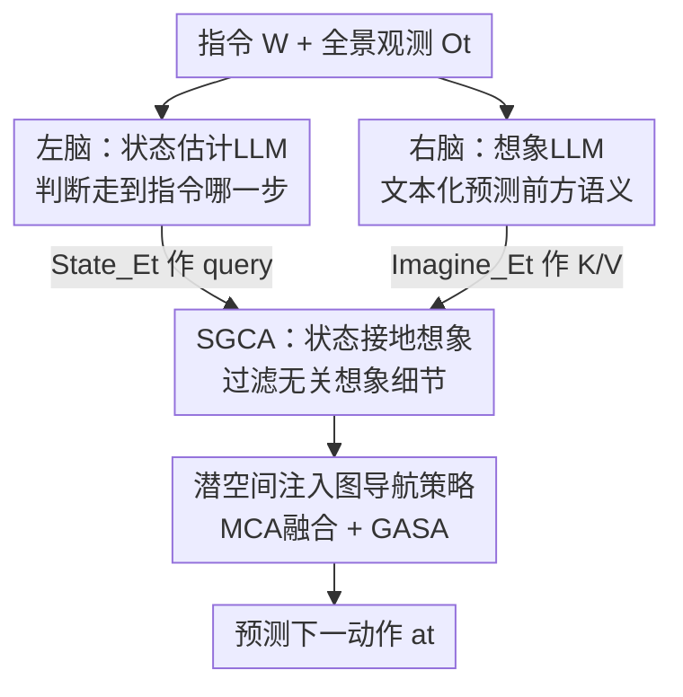

# Cross from Left to Right Brain: Adaptive Text Dreamer for Vision-and-Language Navigation

**会议**: CVPR 2026  
**论文**: [CVF Open Access](https://openaccess.thecvf.com/content/CVPR2026/html/Zhang_Cross_from_Left_to_Right_Brain_Adaptive_Text_Dreamer_for_CVPR_2026_paper.html)  
**代码**: 待开源（原文称 "The code will be available"）  
**领域**: 具身导航 / 视觉语言导航(VLN)  
**关键词**: 视觉语言导航, LLM 想象, 左右脑双分支, 文本梦想家, 状态接地交叉注意力  

## 一句话总结
针对 VLN 中"部分可观测"导致的语言-感知对齐难题，本文用**语言（而非图像）来想象未来关键语义**，提出双分支左右脑结构 ATD——左脑 LLM 估计当前导航状态、右脑 LLM 文本化想象前方场景，再用状态接地想象（SGCA）过滤无关想象并以 decoder-free 潜向量注入图导航策略，在仅 1.5B 参数下于 R2R 上 val unseen SR/SPL 较基线提升 12%/11%。

## 研究背景与动机
**领域现状**：视觉语言导航（VLN）要求智能体按自然语言指令在未见过的 3D 环境里走到目标。它的本质困难是**部分可观测**——每一步只能看到有限视野，指令里提到的地标/目标可能远在视野之外。早期工作用记忆机制（拓扑图、网格图、循环向量）来聚合走过的历史，近期工作则转向"想象"：主动模拟未访问视点的观测，把感知地平线往前延伸。

**现有痛点**：现有想象类方法几乎都依赖**视觉生成**——沿候选轨迹渲染像素级图像或特征级表征（如 PathDreamer、DreamWalker、HNR、UnitedVLN 用 NeRF/3DGS 渲染未来观测）。这带来三个具体问题：渲染计算开销大；生成的图像常带模糊或冗余区域，反而增加对齐难度；而且仍要编码完整全景视野，引入大量分散注意力的无关信息。

**核心矛盾**：作者的关键判断是——**有效导航靠的不是"重建整个场景"，而是"识别与任务相关的关键环境语义"**。给定指令"走下楼梯走向红沙发"，真正要推断的是"红沙发可能出现在哪里"，其余视觉内容基本无关。视觉生成方法把大量算力花在了重建无关细节上。

**切入角度**：语言天生具有**组合性和抽象性**，特别适合做这种"有选择的、抽象的"目标想象——一句"前方可能是客厅，会看到沙发、电视和桌子"就能紧凑地编码未来关键语义，远比渲染一张图高效。

**核心 idea**：把"想象未来"从视觉换成语言，并模仿人脑左右半球的功能分工——左脑负责逻辑整合（估计当前走到了指令的哪一步），右脑负责发散想象（预测前方场景语义），二者在共享潜空间里交互后再去指导导航策略。

## 方法详解

### 整体框架
ATD（Adaptive Text Dreamer）整体由两部分组成：一个**双分支左右脑视觉-语言推理结构**，和一个**基于拓扑图的导航专家**。任务建模为无向图 $G=(V,E)$，$V=\{V_i\}_{i=1}^{K}$ 是可导航节点；每步 $t$ 智能体观测一组相邻节点的 RGB 视图 $O_t=\{\langle o_i,a_i\rangle\}_{i=1}^{N}$，策略 $\pi(a_t\mid W,O_t;\Theta)$ 预测下一动作。

整条流水线是：把指令 $W$ 和当前全景观测 $O_t$ 同时喂给左脑（状态估计 LLM）和右脑（想象 LLM）——两个分支**权重共享**，但各有一个 Q-Former 把视觉 token 抽出来送进冻结的 InstructBLIP/Flan-T5。左脑输出当前导航状态的隐向量 $\text{State}\_E_t$，右脑输出未来想象的隐向量 $\text{Imagine}\_E_t$。接着用 SGCA（状态接地交叉注意力）让**状态去约束想象**，把无关的想象细节过滤掉，得到接地后的 ATD 节点嵌入。最后这个潜向量以 decoder-free 的方式（只过 encoder，不调用 LLM decoder）通过多头交叉注意力注入到图导航策略的节点嵌入里，再经图感知自注意力（GASA）预测下一个目标节点。

### 关键设计

**1. 文本化想象代替视觉生成：用语言抽象出未来关键语义**

这是全文的根。视觉想象类方法要渲染未来候选视点的图像，既慢又会把算力浪费在与任务无关的纹理细节上，还可能累积噪声。ATD 的右脑不生成任何像素，而是直接用**自然语言描述**前方可能出现什么——"往前走会看到沙发、电视和桌子"。训练时，作者在 Matterport3D 的预定义导航图上为每个采样位置的 $N$ 个候选节点用 Qwen2.5-VL-7B 采集详细 caption $\{C^i_{\text{candidate }t}\}_{i=1}^{N}$ 作为想象的 ground truth，用交叉熵损失 $L_{\text{rightbrain}}=-\sum_{t=1}^{T}\sum_{i=1}^{N}\{C^i_{\text{candidate }t}\}\log(I_t)$ 训练右脑去预测这些候选语义。这样想象天然是紧凑、可组合、语义聚焦的，避免了"重建整个场景"的无效开销。

**2. 左右脑双分支结构：逻辑整合的左脑 + 发散想象的右脑，只调 Q-Former**

光有想象不够——如果想象只盯着指令里已经完成的部分（如已经走过楼梯了还在想象楼梯），会误导决策。作者借鉴人脑功能分化，让左脑专门做**状态估计**：判断当前导航走到了指令的哪一阶段，从而排除已完成片段的干扰。左脑的 GT 用 GPT-4V 对当前观测+指令做状态推理得到，蒸馏进小 LLM，训练损失 $L_{\text{leftbrain}}=-\sum_{t=1}^{T}R_t\log(\hat R_t)$。两个分支形式上对称：

$$Q'_{lb}=\text{Q-former}_{lb}(W,O_t,Q_{lb}),\quad \langle \hat R_t,\ \text{State}\_E_t\rangle=\text{LLM}_{\text{frozen}}(\text{Prompt}(W,Q'_{lb}))$$
$$Q'_{rb}=\text{Q-former}_{rb}(W,O_t,Q_{rb}),\quad \langle I_t,\ \text{Imagine}\_E_t\rangle=\text{LLM}_{\text{frozen}}(\text{Prompt}(W,Q'_{rb}))$$

关键的高效之处：**只微调两个分支各自的 Q-Former**（可学习 query token $Q_{lb},Q_{rb}\in\mathbb{R}^{n\times d_1}$），InstructBLIP 的 LLM 和视觉骨干全程冻结。这样用很小的训练代价就激活了 LLM 里对应领域的常识知识，让逻辑推理和想象都能在导航过程中动态更新。

**3. SGCA 状态接地想象：让状态去过滤想象，随导航进度自适应**

右脑的想象是"无约束"的，有充分自由去设想未来，但也容易混入和当前导航无关的细节。SGCA（State Grounded Cross-Attention）用左脑的状态信息把想象里"重要且相关"的部分接地出来：以状态嵌入 $\text{State}\_E_t$ 作 query、想象嵌入 $\text{Imagine}\_E_t$ 作 key/value，用余弦相似度算注意力：

$$Q_S=\text{State}\_E_t W_Q,\quad \langle K_I,V_I\rangle=\text{Imagine}\_E_t\langle W_K,W_V\rangle$$
$$A=\text{SoftMax}(\text{Sim}_{\cos}(Q_S,K_I)),\quad \text{SGCA}(Q_S,K_I,V_I)=A\cdot V_I$$

注意力矩阵 $A$ 就是"从状态到想象的约束权重"，**当导航状态变化时 $A$ 随之调整**，自动过滤掉与当前阶段不匹配的想象。消融（Table 3）证明：方向很关键——必须"状态接地想象"（state→imagination），反过来"想象接地状态"或并行相加都更差，说明左脑约束右脑这个不对称设计是有效的。

**4. decoder-free 潜空间注入图导航策略：保留 LLM 推理又不丢导航专家技能**

如何把 LLM 的语言想象接到一个成熟的导航策略上而不互相拖累？作者用了一个 decoder-free 的潜接口：SGCA 输出节点的 ATD 嵌入 $V^{ATD}_t$，再用多头交叉注意力 MCA 把它和图节点的视觉嵌入 $V^{vis}_t$（节点周围观测视图的平均池化）融合，$V^{vis}_t$ 作 query、$V^{ATD}_t$ 作 key/value：

$$V^{\text{fusion}}_t=\text{MCA}(V^{ATD}_t,\ V^{vis}_t)$$

融合后的节点嵌入进入基于动态拓扑图（沿用 DUET）的跨模态 transformer，先与 LLM 编码的指令做交叉注意力，再过图感知自注意力 GASA——它在标准注意力里加入节点间的成对距离矩阵 $E$（来自图的边），同时考虑空间距离和视觉相似度：

$$\text{GASA}(V)=\text{Softmax}\!\left(\frac{VW_q(VW_k)^T}{\sqrt{d}}+EW_e\right)VW_v$$

整个推理阶段只用 encoder、不调用 LLM decoder，因此既保住了 LLM 的语言推理能力，又完整利用了导航专家的任务专精技能。导航策略用模仿学习训练，行为克隆损失 $L_{BC}$ 配合伪交互示范损失 $L_{PID}$（用最短路径生成的伪标签 $\tilde a^*_t$ 监督），总损失 $L=\lambda L_{BC}+L_{PID}$。

## 实验关键数据

### 主实验（R2R）
ATD 基于 InstructBLIP + Flan-T5-xl（1.5B），在 R2R 上训练，全部微调仅在单 GPU 上完成。下表为与代表性方法的对比（节选 SR/SPL）：

| 方法 | 参数/特点 | Val Unseen SR↑ | Val Unseen SPL↑ | Test SR↑ | Test SPL↑ |
|------|-----------|----------------|-----------------|----------|-----------|
| NaviLLM (Vicuna-7B) | 全量微调 7B | 67 | 59 | 68 | 60 |
| NavGPT2 (FlanT5-XL-1.5B) w/ PREVALENT | 单脑潜接口 | 70 | 59 | 71 | 60 |
| BEVBert | 额外深度构 BEV 图 | 75 | 64 | 73 | 62 |
| DUET+ScaleVLN† | 490 万额外数据 | 79 | 70 | 77 | 68 |
| **ATD (FlanT5-XL-1.5B) w/ PREVALENT** | **仅 MP3D, 1.5B** | **75** | **63** | **74** | **63** |

- 在所有"用 LLM 的方法"里 ATD 用最少参数（1.5B）拿到最好性能：比全量微调的 7B NaviLLM 在 test 上 SR +6%、SPL +3%；比同为 1.5B 的 NavGPT2 在 test 上 SR/SPL 各 +3%，印证"人类式左右脑结构优于单脑桥接结构"。
- 不靠任何外部数据，就逼近了用 490 万额外数据的 DUET+ScaleVLN，并在 test split 上超过用额外深度信息的 BEVBert。

### 零样本跨环境（R4R / REVERIE）
仅在 R2R 训练，直接迁移到语义更丰富的 R4R（长指令）和 REVERIE（高层目标+物体指代）：

| 方法 | R4R nDTW↑ | R4R sDTW↑ | REVERIE SR↑ | REVERIE SPL↑ |
|------|-----------|-----------|-------------|--------------|
| DUET | 41 | 11 | 24 | 19 |
| **ATD (FlanT5-XXL)** | **44** | **14** | **27** | **23** |

REVERIE 上 OSR/SR/SPL 各 +4%/+3%/+4%，说明 LLM 的语言想象增强了泛化，尤其在语义丰富的数据集上。

### 消融实验

| 配置 | Val Unseen SR↑ | Val Unseen SPL↑ | 说明 |
|------|----------------|-----------------|------|
| Baseline（无 SEM 无 IM） | 63 | 52 | DUET 去 local 分支、无 BERT 预训练 |
| + 仅状态估计 SEM | 72 | 61 | 单加左脑 |
| + 仅想象 IM | 73 | 60 | 单加右脑 |
| **Full ATD（SEM+IM 交互）** | **75** | **63** | 完整左右脑 |
| Cross from Right to Left（反方向 SGCA） | 73.95 | 63.08 | 想象接地状态，更差 |
| Parallel（去掉 SGCA，状态+想象相加） | 74.41 | 61.89 | 并行结构最差 |

### 关键发现
- **两个模块缺一不可且交互最关键**：单加 SEM 或单加 IM 都能大幅超越基线，但二者交互的完整模型最好；相比基线 ATD 在 val unseen 上 SR +12%、SPL +11%（val seen +8%/+5%）。
- **接地方向不可逆**：必须"状态→想象"，反向或并行都掉点，证明左脑约束右脑的不对称设计是核心。
- **SGCA 层数 3 或 4 最佳**（Table 5）；有趣的是层数=1 时 val unseen 反而好过 val seen，作者认为 ATD 有较高的泛化下界。
- **收敛更快**：ATD 约在 8 万次迭代就超过 NavGPT2 的最高 SPL（快约 10 万次迭代），9 万次迭代超过其最高 SR（快约 9 万次迭代）。

## 亮点与洞察
- **"想象用语言而非图像"是一次直觉反转**：大家默认想象未来=渲染未来图像，本文指出导航真正需要的是"任务相关的关键语义"，语言的抽象性恰好天然适配，既省算力又减噪声——这个 reframe 本身就很 aha。
- **左右脑分工把"状态估计"和"想象"解耦**，再用 SGCA 让状态去过滤想象，巧妙解决了"想象漂移到已完成指令片段"的问题；权重共享 + 只调 Q-Former 让这套双分支的训练代价极低（单 GPU、batch size 1）。
- **decoder-free 潜接口**是可迁移的 trick：想把任意 LLM 的推理/想象能力接到一个成熟下游策略上、又不想让二者互相拖累时，用潜向量对齐（只过 encoder）注入是个干净的范式，可迁移到 manipulation、具身 QA 等任务。

## 局限与展望
- 想象的 ground truth 依赖 GPT-4V（状态）和 Qwen2.5-VL-7B（候选 caption）离线采集，质量受这些教师模型的幻觉/偏差影响；⚠️ 原文未量化教师标注噪声对最终导航的传导效应。
- 主结果只在**离散环境 R2R**（基于 MP3D 预定义导航图）训练验证，跨环境也仅做零样本评估；在连续环境（VLN-CE）下文本想象是否仍然成立、是否需要重新设计候选语义采集，文中未涉及。
- 与用大规模额外数据的 DUET+ScaleVLN 仍有差距（test SPL 63 vs 68），说明"高效但不靠数据"路线的上限还受限于 MP3D 本身规模。
- 可改进方向：把右脑想象从"候选节点 caption"升级为带空间关系/可达性的结构化语义，或让左右脑在线自蒸馏减少对外部教师标注的依赖。

## 相关工作与启发
- **vs 视觉想象类（DreamWalker / HNR / UnitedVLN）**：它们用 NeRF/3DGS 渲染未来 RGB 观测，开销大、有冗余噪声、要编码全景；ATD 改用文本想象关键语义，紧凑高效，且不需要访问未来位姿。
- **vs NavGPT2**：同样用潜空间桥接 LLM 与导航专家，但 NavGPT2 是单脑结构；ATD 用左右脑双分支 + SGCA 让状态接地想象，在相同 1.5B 规模下 test SR/SPL 各 +3%。
- **vs NaviLLM**：NaviLLM 把任务统一成 QA 全量微调 7B LLM 当动作生成器；ATD 保留 LLM 文本生成能力、只调 Q-Former，用 1.5B 反超其 SR/SPL，印证"维持 LLM 文本生成能力对导航至关重要"。
- **vs DUET / BEVBert**：ATD 的图导航策略沿用 DUET 的动态拓扑图 + GASA，但在其上注入 LLM 的语言想象；相比 BEVBert 用额外深度构 BEV，ATD 不需额外模态即可在 test 上超过它。

## 评分
- 新颖性: ⭐⭐⭐⭐⭐ "用语言代替视觉做未来想象 + 左右脑分工 + 状态接地想象"的组合很新，reframe 干净。
- 实验充分度: ⭐⭐⭐⭐ R2R 主结果 + R4R/REVERIE 零样本 + 4 组消融较完整，但缺连续环境与教师标注噪声分析。
- 写作质量: ⭐⭐⭐⭐ 动机推导清晰、公式齐全，左右脑隐喻好记；个别记号（如 $\text{Sim}_{\cos}$ 维度）需对照原文。
- 价值: ⭐⭐⭐⭐⭐ 用 1.5B 在不靠额外数据下逼近 SOTA、收敛更快，decoder-free 潜接口对具身 LLM 落地有实用参考。

<!-- RELATED:START -->

## 相关论文

- [\[CVPR 2026\] AwareVLN: Reasoning with Self-awareness for Vision-Language Navigation](awarevln_reasoning_with_self-awareness_for_vision-language_navigation.md)
- [\[CVPR 2026\] FantasyVLN: Unified Multimodal Chain-of-Thought Reasoning for Vision-and-Language Navigation](fantasyvln_unified_multimodal_chain-of-thought_reasoning_for_vision-and-language.md)
- [\[CVPR 2026\] Cross-Hand Latent Representation for Vision-Language-Action Models](cross-hand_latent_representation_for_vision-language-action_models.md)
- [\[CVPR 2026\] Adaptive Action Chunking at Inference-time for Vision-Language-Action Models](adaptive_action_chunking_at_inference-time_for_vision-language-action_models.md)
- [\[CVPR 2026\] GA-VLN: Geometry-Aware BEV Representation for Efficient Vision-Language Navigation](ga-vln_geometry-aware_bev_representation_for_efficient_vision-language_navigatio.md)

<!-- RELATED:END -->
