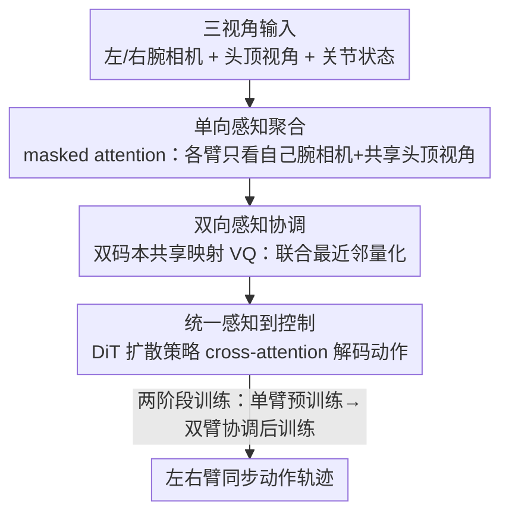

# CUBic: Coordinated Unified Bimanual Perception and Control Framework

**会议**: CVPR 2026  
**论文**: [CVF Open Access](https://openaccess.thecvf.com/content/CVPR2026/html/Wang_CUBic_Coordinated_Unified_Bimanual_Perception_and_Control_Framework_CVPR_2026_paper.html)  
**代码**: 未公开  
**领域**: 机器人 / 具身智能  
**关键词**: 双臂操作, 视觉运动策略, 扩散策略, 向量量化, 共享码本  

## 一句话总结
CUBic 把"双臂协调"重新建模成一个统一的感知表征问题——用一对共享映射的 VQ 码本把左右臂的感知 token 绑在同一潜空间里，再接一个 DiT 扩散策略输出动作，让"各臂独立"和"双臂协同"都从结构中自然涌现，在 RoboTwin 上平均成功率比 SOTA 视觉运动策略高 12%。

## 研究背景与动机
**领域现状**：视觉运动策略（visuomotor policy）已经能让机器人从原始图像端到端地预测动作，但绝大多数工作都只针对单臂场景——感知和控制都是为单个机械臂建模的。

**现有痛点**：把单臂的端到端学习扩展到双臂协作非常难。难点在于：每条臂既要**独立地**感知和动作，又要和另一条臂保持空间、时间上的一致性。双臂的联合动作空间随自由度组合式爆炸，协调还要在多个时空约束下推理，普通的端到端模仿学习很难 scale。

**核心矛盾**：现有双臂方法分成两派，而且两派的目标是冲突的。一派（如 AnyBimanual）把两条臂的感知和控制流**解耦**，强调独立、减少互相干扰，但牺牲了跨臂一致性；另一派用 cross-attention 等机制**强行耦合**两臂、促进信息交换，改善了协调却损失了可解耦性和鲁棒性。一个要"分"，一个要"合"，谁也没有统一的处理方式。

**本文目标**：能不能把"独立"和"协调"这两个对立目标，统一进一个连贯的框架里，而不是在结构上做二选一的权衡？

**切入角度**：作者认为，独立与协调不应该靠手工设计的耦合机制（角色划分、cross-attention）来强加，而应该是同一个**共享 token 表征**的涌现性质。如果左右臂的感知都被量化进一个共享映射的离散潜空间，那么"各自保留独立语义"和"互相感知对方上下文"就能在同一结构里同时成立。

**核心 idea**：把双臂协调从"结构权衡问题"重述为"统一的感知建模问题"——用一对共享映射的 VQ 码本搭一座桥，让协调从模型结构中内生涌现，而非外部强制注入。

## 方法详解

### 整体框架
CUBic 是一条从多视角图像直通双臂动作的统一管线，核心是把感知和控制都收进一个共享的 tokenized 潜空间。输入是左、右腕相机 + 头顶（top）相机三路图像加上双臂关节状态，输出是左右臂同步、物理一致的动作轨迹。中间分三步走：先把每条臂的局部感知聚合成 arm-specific 的 latent token（彼此隔离、共享 top 视角做全局锚点）；再用一对共享映射的 VQ 码本把左右臂 token 量化绑定，让协调在潜空间里隐式发生；最后把协调好的 token 喂给一个 DiT 扩散策略生成动作，并用两阶段训练从"感知层协作"过渡到"控制层协作"。

### 关键设计

**1. 单向感知聚合：用掩码注意力把局部精度和全局上下文分开喂**

多视角输入里每路相机的信息性质不同：头顶/外部视角给的是粗粒度全局上下文（能看到两臂和相对位置），腕相机给的是细粒度局部观测（物体—夹爪关系、表面细节）加上该臂的关节状态。如果一股脑全融在一起，会稀释局部—全局线索、引入冗余相关、把训练搞复杂。作者于是把感知输入归类：腕相机 + 关节状态算"臂专属信息"做局部感知，头顶视角算"共享全局上下文"做跨臂协作。

具体做法是一个带**单向自注意力掩码**的 Transformer。每路 RGB 用独立的 ResNet-18 抽特征，本体感觉信号过一个轻量 MLP 投到同一维度。再定义两组可学习的 latent action token $a_q^{\text{left}}, a_q^{\text{right}} \in \mathbb{R}^{N \times d}$ 作为左右臂潜动作空间的初始化（实验里 $N=4$）。掩码规则是：左臂的 latent token 只能 attend 它自己的 arm-specific token（腕相机全局平均特征 + 本体嵌入拼成的 $c^{\text{left}}$）和共享的头顶特征；而 arm-specific token 只能 attend 共享特征；头顶视角只 attend 自己，防止信息泄漏。右臂对称同理。这样既**严格隔离两臂、防止过早的跨臂干扰**，又把两个潜动作空间锚在同一个头顶视角的全局基础上，为后面的协调留好一致的上下文。

**2. 双向感知协调：一对共享映射的 VQ 码本，把"分"与"合"同时做到**

光隔离还不够，两臂总得有协调。这一步建立左右臂 latent action 之间的协调关系。经过掩码自注意力后，$a_q^{\text{left}}, a_q^{\text{right}}$ 各自编码了来自共享头顶视角的隐式信息，然后用两个双码本 $Z^{\text{left}}, Z^{\text{right}} \in \mathbb{R}^{K \times d_z}$ 量化（实验里 $K=256$，$d_z=32$）。关键在于这两个码本**共享一个统一的映射空间**：量化时不是各算各的最近邻，而是联合选索引——

$$d_{\text{left},i} = \|a_q^{\text{left}} - a_{z,i}^{\text{left}}\|_2^2,\quad d_{\text{right},i} = \|a_q^{\text{right}} - a_{z,i}^{\text{right}}\|_2^2,\quad i^* = \arg\min_i (d_{\text{left},i} + d_{\text{right},i})$$

即最优量化索引 $i^*$ 最小化左右臂距离之和，逼着两臂的潜表示收敛到一个**跨臂联合一致**的码字。作者还叠了一层残差向量量化（RVQ）增强码本表达力、稳住训练。这个共享量化让双码本学到左右臂特征的联合分布，在两条本来解耦的感知流之间建立了内生耦合：既把两臂语义对齐到同一潜流形，又保留各自的功能独立性，跨臂相关性通过共享码本动态隐式涌现——这正是"独立与协调统一"的落点。消融显示，去掉共享映射、改用完全独立的码本，成功率会大幅掉。

**3. 统一感知到控制 + 两阶段训练：DiT 扩散策略，从感知协作渐进到动作协作**

拿到既有协作上下文又保留臂专属精度的感知特征后，要把它翻译成可执行动作。量化后的 token $a_z^{\text{left}}, a_z^{\text{right}}$ 先和对应的 arm-specific token、头顶 token 一起进一个 encoder，转成富语义嵌入 $Q_{\text{left}} = \text{concat}(a_z^{\text{left}}, c_{\text{left}})$、$Q_{\text{right}}$ 同理，作为动作解码的感知条件。动作解码用 DiT（Diffusion Transformer）做策略网络，$Q$ 通过 cross-attention 注入扩散块。前向加噪 $a_H^k = \sqrt{\bar{\alpha}_k}\, a_H^0 + \sqrt{1-\bar{\alpha}_k}\,\epsilon$，模型学去噪函数 $D_\theta(a_H^k, k, Q)$，优化标准扩散目标 $\mathcal{L}_{\text{diff}} = \mathbb{E}_{a_H^0, \epsilon, k}\big[\|D_\theta(a_H^k, k, Q) - \epsilon\|^2\big]$；训练用 $k=100$ 步余弦噪声调度，推理用 DDIM 降到 $k=10$ 步。

最巧的是**两阶段训练 recipe**，靠"隔离再融合自注意力层"实现从感知协作平滑过渡到动作协作。**阶段一·单臂预训练**：两条臂的策略分支各自独立训练，每臂一套独立的 self-attention / cross-attention / FFN，沿运动维度把动作 $a_H$ 均分成 $a_{H,\text{left}}, a_{H,\text{right}}$ 各自算扩散损失；VQ 用直通梯度估计 $a_z = \text{sg}[a_z - a_q] + a_q$，码本损失 $\mathcal{L}_{\text{VQ}} = \|\text{sg}[a_q] - a_z\|_2^2 + \beta\|a_q - \text{sg}[a_z]\|_2^2$，阶段一总目标 $\mathcal{L}_{\text{phase1}} = \mathcal{L}_{\text{diff}}^{\text{left}} + \mathcal{L}_{\text{VQ}} + \mathcal{L}_{\text{diff}}^{\text{right}}$。这一阶段让感知编码器学到解耦但有信息量的表示、稳住离散表征学习。**阶段二·双臂协调后训练**：冻结所有感知模块以保住学到的协作表征，把 DiT 里的 self-attention 层**合并成两臂共享的统一模块**——让两臂在策略层互相可见、在扩散噪声里引入结构化相关，而 cross-attention 到感知 token 的通路仍各自分离，保住感知到控制流的完整性。阶段二目标 $\mathcal{L}_{\text{phase2}} = \mathcal{L}_{\text{diff}}^{\text{left}} + \mathcal{L}_{\text{diff}}^{\text{right}}$。这套"先各练各的、再共享自注意力"的设计，在保持感知解耦的同时催生同步、物理一致的双臂动作。消融显示去掉两阶段训练（直接端到端）成功率从 51.8% 掉到 42.1%。

## 实验关键数据

### 主实验
RoboTwin 仿真基准（基于 ManiSkill，每任务 100 条专家演示、250–850 步），7 个双臂任务，3 个随机种子、每种子 50 次执行取均值。观测 horizon $O=1$、预测 horizon $H=8$，$N=4$ latent token，码本 $K=256$、$d=32$，4×4090 训练、每阶段 900 epoch。

| 方法 | 平均成功率 | Pick Apple Messy | Blocks Stack Easy | Dual Bottles Pick (Hard) | Dual Shoes Place |
|------|-----------|------------------|-------------------|--------------------------|------------------|
| GR-MG | 8.0% | 8.0 | 30.3 | 0.0 | 0.0 |
| DP | 38.5% | 29.3 | 85.7 | 8.0 | 3.0 |
| DP3（用点云） | 39.8% | 9.7 | 55.3 | — | 12.0 |
| **CUBic（本文）** | **51.8%** | **40.0** | 84.3 | **16.0** | 10.0 |

CUBic 平均成功率比 DP3 高 12.0%、比 DP 高 13.3%、比 GR-MG 高 43.8%，且在 "Pick Apple Messy"、"Blocks Stack Easy" 这类复杂长程协调任务上优势尤为明显——而且**不用任何 3D 感知**就超过了用点云的 DP3。

真实世界用双臂 Agibot + 3 个 D435 相机，6 个任务、step-wise 评分（每完成一个子任务给分）：

| 设置 | DP 平均分 | CUBic 平均分 | 增益 |
|------|-----------|--------------|------|
| In-Domain（训练见过的位置） | 19.5 | 43.1 | +23.6 |
| Out-of-Domain（随机摆放） | 12.7 | 34.7 | +22.0 |

物体位置变化对 CUBic 影响不大，泛化性优于 DP。

### 消融实验

| 共享映射 | 两阶段训练 | 平均成功率 | 相对增益 |
|----------|------------|-----------|----------|
| ✗ | ✗ | 32.6% | — |
| ✓ | ✗ | 42.1% | +9.5 |
| ✗ | ✓ | 40.1% | +7.5 |
| ✓ | ✓ | **51.8%** | +19.2 |

| latent token 数 $N$ | 码本大小 $K$ | 平均成功率 |
|---------------------|--------------|-----------|
| 0 | 256 | 0.0%（彻底失败） |
| 4 | 256 | **51.8%** |
| 8 | 512 | 40.2% |

### 关键发现
- **共享映射和两阶段训练是两根互补支柱**：单开任一项分别带来 +9.5 / +7.5，两个一起开是 +19.2，超过各自之和，说明"感知层共享码本"和"控制层共享自注意力"协同放大。
- **latent token 不能没有**：$N=0$（直接量化图像和状态特征）模型彻底失败（0%），证明这组可学习 latent token 是搭跨臂协调桥的必要中介。
- **token 数和码本大小要匹配**：$N=4, K=256$ 最优，加到 $N=8, K=512$ 反而掉到 40.2%，说明过大的 latent/码本会削弱共享映射约束的效力——容量不是越大越好。

## 亮点与洞察
- **把"独立 vs 协调"的结构权衡重述成"统一表征"问题**：这是最核心的 reframing。以往要么解耦要么强耦合，CUBic 用"共享映射的双码本"让两者同时从结构涌现，避免了手工角色划分。
- **联合最近邻量化 $\arg\min_i (d_{\text{left},i} + d_{\text{right},i})$ 很巧**：只用一个共享索引就把两条独立感知流绑定，机制极轻却能逼出跨臂一致性，这个"共享量化"思路可迁移到任何需要多智能体表征对齐的场景。
- **"隔离再融合自注意力层"实现感知→控制的渐进协作**：阶段一各练各的、阶段二冻结感知只合并 self-attention，是一个干净的课程式训练范式，把"先学独立技能、再学协同"工程化了。
- **不用 3D 也能赢 DP3**：纯 2D 多视角 + 共享码本就超过用点云的 DP3，说明协调能力的瓶颈更多在表征结构而非感知模态。

## 局限与展望
- 仿真只在 RoboTwin 7 个任务上验证，真实世界 6 个任务，任务多样性和长程复杂度仍有限；个别任务（如 Dual Bottles Block Handover 仅 10%、Banana Handover 真实分 18.5）绝对成功率仍低，复杂交接类任务还是难。⚠️ 部分仿真任务上 CUBic 并非全部第一（如 Blocks Stack Easy 上 DP 的 85.7 略高于 CUBic 的 84.3），平均领先主要来自难任务。
- 代码未公开，共享码本 + RVQ + 两阶段训练的复现细节（如 RVQ 层数、$\beta$ 取值）原文未完全给出，复现门槛偏高。
- 两阶段训练每阶段 900 epoch、需 4×4090，训练成本不低；且方法目前是双臂特化，扩展到 >2 臂或异构机器人时共享码本怎么设计仍待研究。
- 观测 horizon $O=1$ 比较短，对需要更长历史的任务可能不利。

## 相关工作与启发
- **vs AnyBimanual（解耦派）**: 他们把两臂感知/控制流解耦保独立，本文用共享码本让独立与协调同时涌现，区别在于不靠结构隔离而靠潜空间约束，避免牺牲跨臂一致性。
- **vs cross-attention 耦合派（如 RoboTwin 上的强耦合方法）**: 他们靠 cross-attention 显式促进信息交换，本文把协调藏进共享量化的离散码本里，优势是保留了可解耦性和臂级自治，不会因强耦合损失鲁棒性。
- **vs Diffusion Policy / DP3**: 同样是扩散策略，但 DP/DP3 为单臂设计、感知与动作分离建模；CUBic 在 DiT 前加了 VQ 共享码本桥，并用两阶段训练显式建模双臂协调，因此在双臂任务上稳定超越，且无需 3D 感知就超过用点云的 DP3。

## 评分
- 新颖性: ⭐⭐⭐⭐ 把双臂协调重述为统一感知建模、用共享映射双码本让独立与协调涌现，reframing 漂亮
- 实验充分度: ⭐⭐⭐⭐ 仿真 + 真机 + 三组消融较完整，但任务规模和绝对成功率仍有限、代码未公开
- 写作质量: ⭐⭐⭐⭐ insight/details/analysis 分层叙述清晰，公式齐全，但部分实现超参未交代
- 价值: ⭐⭐⭐⭐ 给双臂视觉运动策略提供了一个统一、可解耦的表征框架，思路可迁移到多智能体协调

<!-- RELATED:START -->

## 相关论文

- [\[CVPR 2026\] EnergyAction: Unimanual to Bimanual Composition with Energy-Based Models](energyaction_unimanual_to_bimanual_composition_with_energy-based_models.md)
- [\[AAAI 2026\] TouchFormer: A Robust Transformer-based Framework for Multimodal Material Perception](../../AAAI2026/robotics/touchformer_a_robust_transformer-based_framework_for_multimodal_material_percept.md)
- [\[CVPR 2026\] CycleManip: Enabling Cycle-based Manipulation via Effective History Perception and Understanding](cyclemanip_enabling_cycle-based_manipulation_via_effective_history_perception_an.md)
- [\[CVPR 2026\] Motus: A Unified Latent Action World Model](motus_a_unified_latent_action_world_model.md)
- [\[CVPR 2026\] Do You Have Freestyle? Expressive Humanoid Locomotion via Audio Control](do_you_have_freestyle_expressive_humanoid_locomotion_via_audio_control.md)

<!-- RELATED:END -->
