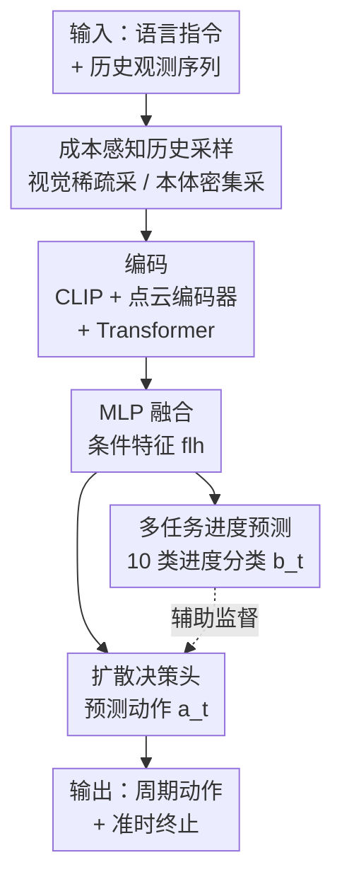

# CycleManip: Enabling Cycle-based Manipulation via Effective History Perception and Understanding

**会议**: CVPR 2026  
**论文**: [CVF Open Access](https://openaccess.thecvf.com/content/CVPR2026/html/Wei_CycleManip_Enabling_Cycle-based_Manipulation_via_Effective_History_Perception_and_Understanding_CVPR_2026_paper.html)  
**代码**: 项目页 https://isee-laboratory.github.io/CycleManip/ （未见公开 GitHub）  
**领域**: 机器人  
**关键词**: 机器人操作, 周期性任务, 历史建模, 模仿学习, 扩散策略  

## 一句话总结
针对机器人"摇瓶子三次""敲钉子八下"这类需要数清楚循环次数并准时停手的周期性操作，CycleManip 在端到端模仿学习里用「成本感知采样」高效扩展历史观测视野、用「多任务进度预测」逼模型理解周期阶段，在仿真和真机上把周期任务成功率从个位数/几十拉到 53–97%。

## 研究背景与动机
**领域现状**：当前主流的机器人操作策略——无论是扩散策略（DP、DP3）还是 VLA 模型（Pi-0、RDT）——都擅长根据当前观测预测下一步动作，在序列性长程任务上表现很强。

**现有痛点**：但它们在**周期性任务**（cyclic manipulation）上集体翻车。所谓周期任务是指需要重复同一个动作若干次、并在指定次数后准时停下，比如摇瓶子五次、用锤子敲八下。这类任务的麻烦在于：每摇完一次，视觉观测几乎长得一模一样，模型根本分不清现在是第几轮，于是要么陷入死循环停不下来、要么提前终止。

**核心矛盾**：周期任务本质是**非马尔可夫**的——当前该继续还是该停，不取决于当前一帧观测，而取决于"循环里累积了多少进度"。可现有模仿策略普遍只用很短的观测窗口（Pi-0 甚至只用当前 1 帧）预测动作，天生看不到历史。一个直觉的补救是把观测视野拉长，但每个时刻都编码、融合高维视觉观测，计算和延迟成本会爆炸。所以矛盾是：**周期任务需要长历史，但长历史的高维视觉编码太贵**。

**本文目标**：在不引入额外模型、不搭分层结构、不显著增加算力的前提下，端到端地让模仿策略既能**感知**足够长的历史、又能**理解**自己处在周期的哪个阶段。

**核心 idea**：把历史信息的利用拆成"感知"和"理解"两件事——用**成本感知采样**廉价地拉长观测视野（视觉稀疏采、本体感知密集采），再用**多任务进度预测**这个辅助监督逼模型学出能区分周期阶段的判别性特征。

## 方法详解

### 整体框架
CycleManip 的输入是用户语言指令 $lan$ 加上一段历史观测序列 $\{o_i\}_{i=1}^t$，输出是下一步动作 $a_t$，目标是闭环地执行并在正确次数后终止周期动作。基础策略形式为 $a_t = \pi(lan, \{o_i\}_{i=1}^t)$。

整条管线分三段：**(1) 成本感知采样**先把历史观测按编码代价分两类、用不同策略采样，廉价地把观测视野拉长；**(2) 编码与融合**用 CLIP 编码语言、点云编码器编码视觉、Transformer 编码低开销观测，再用 MLP 融合成条件特征；**(3) 双头输出**——融合特征一路喂给扩散模型预测动作（决策），另一路喂给一个辅助头预测当前进度（理解）。两个核心创新分别落在第一段（感知）和第三段的辅助头（理解）上，主干仍是一个标准的扩散策略，因此可以即插即用到别的模仿策略里。

### 关键设计

**1. 成本感知历史采样：用差异化采样廉价地把观测视野拉长**

这一步直接针对"周期任务要长历史、但高维视觉编码太贵"的矛盾。作者把历史观测分成两类：**高开销观测** $o_i^h$（RGB 图像 / 点云，编码贵）和**低开销观测** $o_i^l$（本体感知 proprioception，编码便宜）。两类用不同采样策略 $H_h$、$H_l$，策略写成 $a_t = \pi\big(H_h(\{o_i^h\}_{i=1}^t),\, H_l(\{o_i^l\}_{i=1}^t)\big)$。

对低开销观测，作者采用**密集且全程**的采样——把过去所有的低开销观测都纳进来，因为它编码便宜、放得起。关键是低开销观测用**末端执行器的位姿差**而非关节角或绝对位姿来表征：一是末端的循环规律比关节角更直观、更容易建模，直接反映整体运动模式；二是用位姿差能消除绝对位置带来的偏置，让模型把注意力放在"周期性本身"上。这一招用很低的成本就把时间观测范围拉得很长，正好喂饱周期计数所需的历史。

对高开销视觉观测，作者用**启发式帧采样** $H_h$：在保持采样帧数 $K_{high}$ 不变的前提下，覆盖更长的观测视野。具体地，记第一帧为 0、当前帧为 $t$，先做右侧二分采样取 $0.5\cdot K_{high}$ 帧，再从最新帧 $t$ 出发按 $t - 2^k$（$k$ 为采样索引）做指数采样取另外 $0.5\cdot K_{high}$ 帧。这样近处采得密、远处采得疏，既不增加帧数（不涨算力），又把视野拉到足够覆盖多个周期。实验里 $K_{high}=6$。

**2. 多任务进度预测：用辅助分类逼模型理解周期阶段**

光把视野拉长还不够——信息一多，反而给特征编码和理解带来负担。更根本的问题是：只用模仿监督时，同一个动作（如"敲一下锤子"）在不同周期里的 ground-truth 监督信号是**一样的**，可它们对应的历史其实不同，这会逼模型把不同阶段的特征收敛到同一个局部最优，反而丧失了区分周期进度的判别力。

为此作者加了一个**辅助任务：预测当前处在整个过程的哪个阶段**。进度真值 $b_t$ 由当前帧号除以该任务的最大帧号得到（一个 0–1 的进度），再把 $[0,1]$ 均匀切成十个区间、离散成类别标签 $y_t$，做一个 **10 类分类**。因为监督信号随进度变化，模型被迫为周期的不同阶段学出**不同的、可区分的特征表示**，从而更可靠地判断"该继续还是该停"。实现上为避免多任务头过拟合，先用多层 MLP 做特征融合（这份融合特征也供后续扩散决策用），再接一层 MLP 输出进度预测。

### 损失函数 / 训练策略
融合后的条件特征同时供扩散决策和辅助任务使用，语言特征与观测融合特征拼接后作为扩散模型的条件，用 FiLM 条件化输出动作预测。总损失为动作回归的 MSE 加进度分类的交叉熵：

$$L = \alpha \cdot \mathrm{MSE}(a_t, a_t^*) + \beta \cdot \mathrm{CE}(b_t, b_t^*)$$

其中 $a_t^*$、$b_t^*$ 是动作和辅助任务的真值，权重 $\alpha=1$、$\beta=0.1$。扩散采样器用 DDIM（训练 100 步、测试 10 步），动作 horizon 为 8，训练 300 epoch、batch 128，单张 RTX 4090 即可训。

## 实验关键数据

### 主实验
在自建的 CycleManip 仿真基准（基于 RoboTwin 2.0，8 个周期任务、每任务 200 条专家演示、循环次数 1–8）上对比 DP、DP3、RDT、Pi-0。指标为成功率 Suc.（既完成任务又达到正确循环次数才算成功）和循环计数偏差 Cyc.（执行次数与真值的平均绝对偏差，越低越好）。

| 任务 | DP3 Suc./Cyc. | RDT Suc./Cyc. | Pi-0 Suc./Cyc. | 本文 Suc./Cyc. |
|------|------|------|------|------|
| 敲块 | 23 / 5.55 | 20 / 2.15 | 13 / 3.44 | **86 / 0.25** |
| 摇瓶 | 16 / 4.58 | 15 / 1.53 | 19 / 2.00 | **95 / 0.29** |
| 滚轮 | 33 / 1.44 | 35 / 1.55 | 14 / 3.80 | **97 / 0.03** |
| 切胡萝卜 | 38 / 1.92 | 36 / 1.24 | 8 / 2.54 | **86 / 0.81** |
| 化学搅拌 | 18 / 1.41 | 12 / 2.0 | 2 / 2.37 | **53 / 0.76** |
| 摩斯敲击 | 1 / – | 0 / – | 0 / – | **91 / –** |

本文在全部 8 个周期任务上成功率与循环偏差都大幅领先：成功率多在 53–97%，而 baseline 普遍只有个位数到 40 出头；循环偏差大多压到 1 以下（如滚轮 0.03），baseline 动辄偏 2–8 次。作者指出 baseline 失败的根因就是观测窗口太短——Pi-0 只用当前 1 帧，成功率最低。

真机实验（6 个任务、跨夹爪/灵巧手/人形多种本体）以 DP3 为基线对比：

| 任务（本体） | DP3 Suc. | w/o Task Suc. | 本文 Suc. |
|------|------|------|------|
| 敲块（单夹爪） | 37.5 | 62.5 | **93.75** |
| 摇瓶（单夹爪） | 12.5 | 31.25 | **68.75** |
| 击鼓（双夹爪） | 0 | 60 | **90** |
| 清桌（双灵巧手） | 20 | 40 | **100** |
| 打气（人形） | 10 | 20 | **50** |
| 切割（双灵巧手） | 0 | 25 | **75** |

### 消融实验
真机表中的 `w/o Task`（去掉历史理解、只保留成本感知采样）即逐项消融，可清楚看出两个组件各自的贡献：

| 配置 | 敲块 Suc. | 击鼓 Suc. | 切割 Suc. | 说明 |
|------|------|------|------|------|
| DP3（基线，短视野） | 37.5 | 0 | 0 | 既无感知也无理解 |
| w/o Task（仅成本感知采样） | 62.5 | 60 | 25 | 加上历史感知，普遍大涨 |
| Ours（感知 + 理解） | **93.75** | **90** | **75** | 再加多任务理解，进一步提升 |

### 关键发现
- **历史感知是地基**：仅把成本感知采样加到基线上（w/o Task），各任务成功率就普遍大幅跳升（如击鼓 0→60、敲块 37.5→62.5），说明长历史观测确实是周期任务的先决条件。
- **历史理解是临门一脚**：在感知之上再加多任务进度预测，成功率继续抬升（敲块 62.5→93.75、切割 25→75），印证辅助监督把模型从"被动看历史"推向"主动理解周期阶段"，特征空间更具判别性。
- **几乎不涨算力**：效率分析（切胡萝卜，RTX 4090）显示本文相比 DP3 仅训练时间 0.073→0.102、推理 0.0893→0.0953、显存 16796→17342 / 5801→6003 MB 略增，但成功率从 38 升到 86——廉价采样的设计目标达成。
- **泛化与即插即用**：在 RoboTwin 2.0 的 4 个通用（非周期）任务上同样全面领先（如 place cans 91 vs DP3 48）；把本文方法接进 Pi-0（VLA）后，摇瓶 19→72、双刀切 1→41，证明可作为即插即用组件。

## 亮点与洞察
- **"按编码代价分类观测、差异化采样"是很省的巧思**：把贵的视觉稀疏采、便宜的本体感知全程密采，用接近零成本的代价换来长历史视野——这是绕开"长历史 vs 算力"矛盾的关键，思路可迁移到任何需要长时序但算力受限的策略学习。
- **用末端位姿差而非关节角/绝对位姿表征本体**：既凸显周期规律又消除绝对位置偏置，是个容易被忽略但很对症的表征选择。
- **进度预测作为辅助任务"逼出判别性特征"**：周期任务的监督信号在不同轮次是重复的，单靠模仿会让特征收敛塌缩；用一个 10 类进度分类把"现在第几阶段"显式监督进去，巧妙地恢复了特征的阶段可区分性。这个"重复监督会塌缩、需要辅助信号撑开特征空间"的洞察对其他重复性任务也有借鉴意义。
- **不加额外模型/分层结构**：整个方案就是在标准扩散策略上加采样和一个辅助头，端到端可训、可插到 VLA，工程上很干净。

## 局限与展望
- **进度真值依赖帧号比例**：$b_t$ 由当前帧除最大帧得到，这隐含假设每条演示的时间进度是均匀线性的；当动作速度不均或循环长度差异大时，这种线性进度标注可能不够准（⚠️ 论文未深入讨论这一假设的边界）。
- **真机每任务试验次数较少**：真机仅 16 trials，统计噪声较大，部分任务（如人形打气 50%）样本下结论需谨慎。
- **自动评估系统依赖任务特定规则**：循环计数靠状态机碰撞检测或位姿峰值检测，针对每类任务定制，扩展到全新任务形态时评估工具需重新设计。
- **更难任务仍有差距**：化学搅拌、打气等接触/动态复杂任务成功率仅 50–53%，说明长历史 + 进度监督还不足以完全覆盖高动态周期任务。

## 相关工作与启发
- **vs 历史建模类方法（visual memory / 大核 / 记忆缓存）**：以往机器人历史建模多服务长程任务、且偏重融合高维视觉记忆；本文转向更难的周期任务，并用低开销本体感知 + 成本感知采样来廉价整合历史，而非堆视觉记忆。
- **vs 传统周期任务方法**：早期用控制策略实现周期动作，对动态环境适应差；近期深度学习方法要么只能固定循环次数、要么局限特定场景、要么依赖外部辅助模型。本文在端到端、不依赖任何额外模型的前提下支持任意次数、多样化的周期任务。
- **vs 短视野模仿/VLA（DP、DP3、Pi-0、RDT）**：它们靠短观测窗预测动作，在周期任务上无法分辨当前轮次而失败；本文把它们当作可被增强的底座——既全面超越，又能以即插即用方式把自己的采样 + 进度头嵌进 Pi-0 带来大幅提升。

## 评分
- 新颖性: ⭐⭐⭐⭐ 首次系统化定义并求解周期性操作任务，"感知+理解"二分解与成本感知采样的组合干净有效
- 实验充分度: ⭐⭐⭐⭐ 仿真 8 任务 + 真机 6 任务 + 通用任务 + 即插即用 + 效率分析覆盖全面，但真机试验次数偏少
- 写作质量: ⭐⭐⭐⭐ 问题动机（图 2 的"看起来一样/数不清次数"）讲得很直观，方法与消融对应清晰
- 价值: ⭐⭐⭐⭐ 周期性日常任务是真实需求，方法轻量、跨本体、可即插即用，落地友好

<!-- RELATED:START -->

## 相关论文

- [\[CVPR 2026\] CycleManip: Enabling Cyclic Task Manipulation via Effective Historical Perception and Understanding](cyclemanip_enabling_cyclic_task_manipulation_via_effective_historical_percepti.md)
- [\[CVPR 2026\] DynBridge: Bridging Imagination and Control through Interaction Dynamics for Robot Manipulation](dynbridge_bridging_imagination_and_control_through_interaction_dynamics_for_robo.md)
- [\[CVPR 2026\] DiffuView: Multi-View Diffusion Pretraining for 3D-Aware Robotic Manipulation](diffuview_multi-view_diffusion_pretraining_for_3d_aware_robotic_manipulation.md)
- [\[CVPR 2026\] Rethinking Camera Choice: An Empirical Study on Fisheye Camera Properties in Robotic Manipulation](rethinking_camera_choice_an_empirical_study_on_fisheye_camera_properties_in_robo.md)
- [\[CVPR 2026\] CLaD: Planning with Grounded Foresight via Cross-Modal Latent Dynamics](clad_planning_with_grounded_foresight_via_cross-modal_latent_dynamics.md)

<!-- RELATED:END -->
