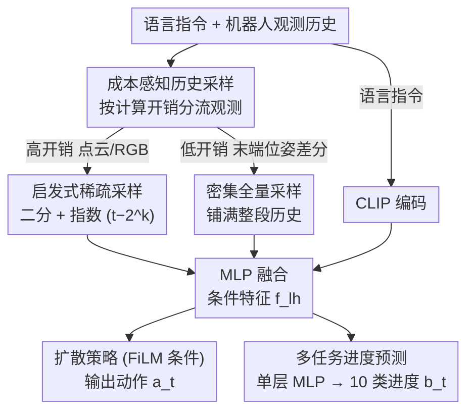

# CycleManip: Enabling Cyclic Task Manipulation via Effective Historical Perception and Understanding

**会议**: CVPR 2026  
**arXiv**: [2512.01022](https://arxiv.org/abs/2512.01022)  
**代码**: [https://isee-laboratory.github.io/CycleManip/](https://isee-laboratory.github.io/CycleManip/)  
**领域**: 机器人  
**关键词**: 循环操作, 机器人操作, 模仿学习, 历史感知, 多任务学习

## 一句话总结
CycleManip 首次系统性地解决机器人循环操作任务（如摇瓶子N次），通过成本感知的历史采样策略增强历史感知，配合多任务学习辅助目标提升历史理解，以端到端模仿学习方式实现循环次数可控的操作。

## 研究背景与动机
1. **领域现状**：机器人操作领域的模仿学习和VLA模型在顺序任务上表现出色，但对循环任务（重复动作+准确终止）的研究几乎空白。
2. **现有痛点**：（i）短观察窗口的策略无法区分循环的不同阶段（每次摇瓶后视觉观测几乎相同）；（ii）缺乏包含充足数据和自动评估工具的循环任务基准。
3. **核心矛盾**：循环任务是非马尔可夫过程，正确决策不仅取决于当前观测，还取决于已累积的进度。但扩展观察范围会大幅增加计算开销。
4. **本文目标**：设计端到端的模仿学习框架，使机器人能执行循环动作并在正确时刻停止。
5. **切入角度**：将观测分为高开销（视觉）和低开销（本体感知），差异化采样；用多任务学习促进循环阶段理解。
6. **核心idea**：成本感知采样（视觉稀疏+本体感知密集）+ 进度预测辅助任务 = 循环感知策略。

## 方法详解

### 整体框架
CycleManip 要解决的核心难题是：循环任务（摇瓶 N 次后停下）是个非马尔可夫过程——每摇一次后视觉观测几乎一模一样，光看当前画面根本数不清已经摇了几次。直接扩长视觉观察窗口能补回历史，但点云/RGB 帧又贵又多，算不起。于是整套流程沿着「分而治之地补历史 + 逼模型读懂历史」两条线展开：先用成本感知历史采样把廉价的末端位姿差分历史塞满、把昂贵的视觉历史稀疏采样，再连同语言指令分别编码、用 MLP 融合成扩散策略的条件特征去预测动作；同时把这份融合特征接到一个辅助分支上预测「现在进行到第几成」，用这个监督信号倒逼模型从看似重复的观测里学出阶段差异。此外论文还配套搭了 CycleManip 基准来支撑训练与自动评测（它是独立于上述推理 pipeline 的评测贡献，故不出现在下图中）。

### 关键设计

**1. 成本感知历史采样：用免费的本体感知顶替昂贵的视觉历史**

既然循环任务的麻烦在于「短窗口看不出进度」，最直接的修法是把观察范围拉长，但视觉帧的代价让全量历史不可行。CycleManip 的关键观察是——历史里真正承载循环节律的并不是 RGB，而是末端执行器的运动轨迹：摇瓶时它来回往复，这种周期性比关节角度更显眼、也更好建模。所以论文按计算开销把观测劈成两半区别对待：低开销的末端执行器位姿（用相邻帧的**位姿差分**而非绝对位置，避开机械臂落点漂移带来的位置偏差）几乎免费，就**全量密集采样**铺满整段历史；高开销的点云/RGB 则只**稀疏采**几帧——一半帧走二分采样负责粗粒度覆盖整条历史，另一半走指数采样（取 $t-2^k$ 这些时刻）把近期细节留得更密。这样近处看得清、远处也没断，而计算量几乎全压在那几帧视觉上，本体感知那条稠密历史基本是白送的。举例来说，摇了几十帧之后，视觉只挑出二分点和 $t-1,t-2,t-4,t-8\dots$ 这些近期帧，而每一帧的末端位姿差分都原样保留，循环往复的波形就完整地喂进了模型。

**2. 多任务进度预测：给重复的观测装一个「数到第几圈」的监督信号**

纯模仿学习有个隐患——每个循环里专家的标签都是「继续执行」，监督信号完全相同，模型没有任何动力去区分第一圈和第五圈，自然也学不会该在哪一圈停手。CycleManip 加了一个辅助任务来制造这种区分压力：让模型在预测动作的同时，额外预测当前进度 $b_t$，定义为当前帧号除以该轨迹最大帧号，再离散化成 10 个区间当作 10 类分类来做（观测特征先经多层 MLP 融合，末端再用单层 MLP 出进度）。这个进度损失逼着模型必须从那些「看起来一样」的观测里提炼出能区分阶段的判别性特征，否则分类分支根本做不对——也正是靠它，策略才知道循环走到尾声、该收尾停下。

**3. CycleManip 基准：把「无标准评测」这个拦路石本身先搬走**

循环任务长期没人系统研究，一部分原因是连个能自动判对错的评测平台都没有。论文基于 RoboTwin 2.0 搭了 8 个循环操作任务（锤钉子、摇瓶子、切胡萝卜等），每个任务配 200 条演示轨迹、循环次数覆盖 1–8 次；评测时不只看动作成没成功，还要数循环次数对不对——**只有操作成功且循环次数精确匹配才算通过**，这条「次数也要对」的判据正好把循环任务区别于普通顺序任务的核心难点逼了出来。

### 损失函数 / 训练策略
整体在扩散策略框架下训练，总目标是动作回归与进度分类两项之和：

$$\mathcal{L} = \alpha \cdot \text{MSE}(a_t, a_t^*) + \beta \cdot \text{CE}(b_t, b_t^*)$$

前项是扩散动作预测的 MSE，后项是 10 类进度分类的交叉熵，$\alpha,\beta$ 为两者的权重（⚠️ 具体取值以原文为准）。

## 实验关键数据

### 主实验

| 任务 | CycleManip成功率 | Baseline成功率 | 循环准确率 |
|------|----------------|--------------|----------|
| 锤钉子 | 高 | 低 | 高 |
| 摇瓶子 | 高 | 极低 | 高 |
| 切胡萝卜 | 中高 | 低 | 中高 |

### 消融实验

| 配置 | 关键指标 | 说明 |
|------|---------|------|
| Full CycleManip | 最优 | 完整框架 |
| w/o 进度预测 | 显著下降 | 辅助任务关键 |
| w/o 密集本体采样 | 下降 | 历史感知重要 |
| 仅视觉扩展 | 计算开销大但效果有限 | 证明成本感知采样的必要性 |

### 关键发现
- 方法在通用操作任务上也有很好的适应性，不限于循环任务。
- 可作为即插即用模块应用于VLA模型（如Pi0等）。
- 跨平台验证（双臂夹持器、灵巧手、人形机器人）证明了通用性。
- 密集本体感知采样的计算开销几乎可忽略，是最具性价比的历史建模方式。

## 亮点与洞察
- **首次系统性定义循环操作任务**，填补了机器人操作研究的空白。
- **成本感知采样**的设计直觉优秀：用免费的本体感知替代昂贵的视觉历史来捕捉循环模式。
- 进度预测辅助任务是一个简单但有效的trick。

## 局限与展望
- 进度预测离散化为10类可能不够精细。
- 当前仅支持固定循环次数，对"直到混合均匀"等动态终止条件未探索。
- 复杂物理交互（如不同材质的摩擦）可能需要更精细的力反馈。

## 相关工作与启发
- **vs Diffusion Policy**: 标准扩散策略使用短观察窗口，无法处理循环任务。CycleManip通过历史感知和理解扩展了其能力。
- **vs VLA models**: VLA模型也依赖短期观测，CycleManip的即插即用设计可直接增强它们。

## 评分
- 新颖性: ⭐⭐⭐⭐ 首次定义循环操作问题，方法实用但不复杂
- 实验充分度: ⭐⭐⭐⭐⭐ 8任务+3平台+仿真+真实+VLA集成
- 写作质量: ⭐⭐⭐⭐ 问题定义清晰，实验设计合理
- 价值: ⭐⭐⭐⭐ 填补重要空白，对机器人实际部署有价值

<!-- RELATED:START -->

## 相关论文

- [\[CVPR 2026\] CycleManip: Enabling Cycle-based Manipulation via Effective History Perception and Understanding](cyclemanip_enabling_cycle-based_manipulation_via_effective_history_perception_an.md)
- [\[CVPR 2026\] DynBridge: Bridging Imagination and Control through Interaction Dynamics for Robot Manipulation](dynbridge_bridging_imagination_and_control_through_interaction_dynamics_for_robo.md)
- [\[CVPR 2026\] Rethinking Camera Choice: An Empirical Study on Fisheye Camera Properties in Robotic Manipulation](rethinking_camera_choice_an_empirical_study_on_fisheye_camera_properties_in_robo.md)
- [\[CVPR 2026\] Unifying Perception and Action: A Hybrid-Modality Pipeline with Implicit Visual Chain-of-Thought for Robotic Action Generation (VITA)](unifying_perception_and_action_a_hybrid-modality_pipeline_with_implicit_visual_c.md)
- [\[CVPR 2026\] Affordance Field Intervention: Enabling VLAs to Escape Memory Traps in Robotic Manipulation](affordance_field_intervention_enabling_vlas_to_escape_memory_traps_in_robotic_ma.md)

<!-- RELATED:END -->
