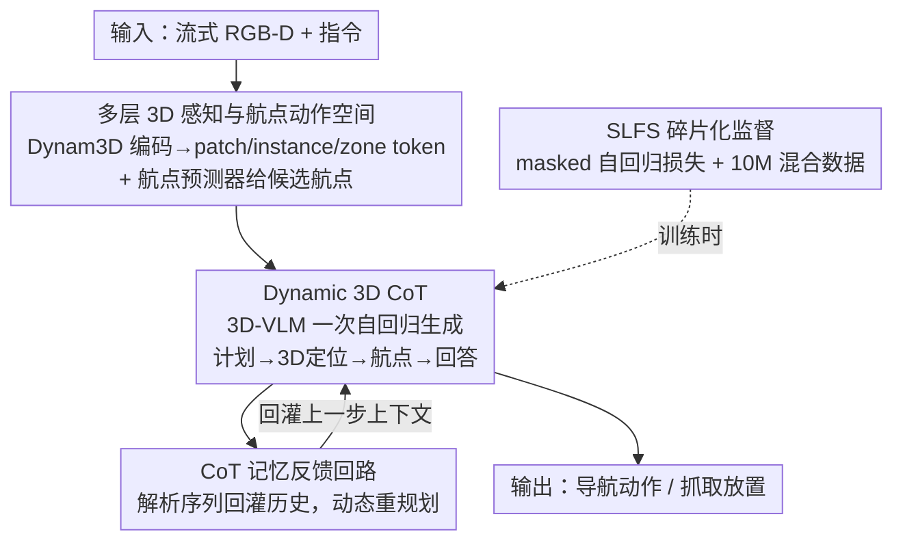

# D3D-VLP: Dynamic 3D Vision-Language-Planning Model for Embodied Grounding and Navigation

**会议**: CVPR 2026  
**论文**: [CVF Open Access](https://openaccess.thecvf.com/content/CVPR2026/html/Wang_D3D-VLP_Dynamic_3D_Vision-Language-Planning_Model_for_Embodied_Grounding_and_Navigation_CVPR_2026_paper.html)  
**代码**: https://github.com/MrZihan/D3D-VLP (有)  
**领域**: 具身智能 / 3D视觉 / 视觉语言导航  
**关键词**: 具身导航, 3D视觉语言模型, 3D Chain-of-Thought, 动态重规划, 碎片化监督  

## 一句话总结
D3D-VLP 把"规划—3D 定位—导航"三件事重写成一个 3D-VLM 内部的统一自回归链式思考（3D CoT），并配一个 CoT 记忆反馈回路实现动态重规划；再用「碎片化监督」策略让大量只标了一部分（比如只标导航动作）的 1000 万样本也能联合训练，在 R2R-CE、REVERIE-CE、HM3D-OVON、SG3D 等多个具身导航/定位基准上刷到新 SOTA。

## 研究背景与动机
**领域现状**：让具身智能体在大场景里"听懂指令、找到目标、走过去"，目前有两条主流路线。一条是端到端模型（StreamVLN、NaVILA、Dynam3D 等），指令+视频流直接映射成导航动作；另一条是模块化系统（InstructNav、AO-Planner 等），用 LLM 当高层规划器，再接一个 3D 定位模块和一个导航策略，分阶段串起来。

**现有痛点**：端到端模型是个黑盒——它绕过了显式的 3D 定位和推理，输出不了精确的目标位置，遇到长程规划或多目标任务就吃力，也没有可解释性。模块化系统反过来：每个模块各自为政，规划器拿不到定位/导航模块的实时反馈，没法在计划被堵住时动态改计划；而且各模块往往在不同数据集上分开训练，彼此之间存在 domain gap，配合不默契。

**核心矛盾**：可解释性、显式 3D 推理（模块化擅长）和高性能、协同优化（端到端擅长）之间存在割裂——你要么牺牲可解释性换性能，要么为了模块清晰而丢掉跨组件的协同与动态反馈。

**本文目标**：造一个既保留显式 3D 定位/规划（看得见中间推理）、又能像端到端那样协同优化和动态调整的统一模型，并且要能在大规模、未见、动态的真实环境里靠实时不完整观测工作。

**切入角度**：作者发现，规划、定位、导航本质上都可以表达成"生成一段 token 序列"——既然如此，何必拆成三个模型？把它们塞进同一个 3D-VLM 的一次自回归生成里，让三者天然共享上下文、互相条件化，协同就自动发生了。

**核心 idea**：用一条"3D Chain-of-Thought"——规划文本 → 显式 3D 定位 token → 导航航点 token → 回答文本——在单个 3D-VLM 里一次自回归生成，再用 CoT 记忆把历史回灌实现动态重规划；训练上用 masked 自回归损失把碎片化标注数据全用起来。

## 方法详解

### 整体框架
D3D-VLP 要解决的核心是"把分散的具身能力捏成一个会自我修正的统一推理器"。每个时刻，系统先用 Dynam3D 编码器把流式的 posed RGB-D 图像维护成一个**多层 3D 记忆**（patch / instance / zone 三级 token），同时一个航点预测器给出周围若干候选航点；这些 3D token + 指令 + 候选航点 + 上一时刻的 **CoT 记忆**一起喂进核心 3D-VLM（基于 NVILA-Lite-2B），由它**一次自回归生成**一段统一的 3D CoT 序列：下一步计划 → 锁定的目标 token → 选中的导航航点 → 回答文本。生成完不丢弃，而是解析出来更新 CoT 记忆，回灌给下一步——形成一个有状态、可重规划的闭环。训练侧则用 SLFS 策略，让 1000 万条只标了部分字段的混合数据都能贡献梯度。

### 关键设计

**1. 多层 3D 感知与航点动作空间：给推理一个持久、对齐的 3D 世界**

3D CoT 要做显式定位和导航，前提是有一个结构化、可被语言模型引用的 3D 表征，而不是临时的 2D 观测。本文沿用 Dynam3D 编码器构建层级场景表示：先把 2D patch 特征投影进 3D 空间得到带语义和几何信息的 3D 特征点 $M_\text{patch}$，再用 transformer 聚合成物体级 **Instance token** $M_\text{inst}$ 和粗粒度空间 **Zone token** $M_\text{zone}$；并用可泛化特征场从当前相机位姿渲染出**全景 patch token** $V_\text{patch}$ 做局部细粒度感知，合起来是 $M_t=(V_\text{patch}, M_\text{inst}, M_\text{zone})$。

动作空间上，作者刻意不用"前进 0.5 米/左转 15 度"这类文本动作，而是训练一个**航点预测器**：把全景 patch token $V_\text{patch}$ 和 12 个间隔 30° 的 query token 送进多层 transformer，输出附近可达航点。再用统一的 **3D 空间嵌入**把 3D token 和航点对齐——对每个时刻 $t$，先用当前位姿把全局坐标转到智能体中心相机坐标系，算出每个点到智能体的相对距离 $D_t$ 和水平角 $\theta_t$，把 $(P_t, D_t, \cos\theta_t, \sin\theta_t)$ 送进 MLP 空间编码器。这么做的关键在于：导航动作和 3D 感知 token 落在**同一个空间语义坐标系**里，VLM 选航点等价于在 3D 表征上做空间推理，而不是去翻译一句方位文本——消融里把它换回文本动作，R2R-CE 的 SR 从 61.3% 掉到 56.4%，证明这种对齐确实把模型的 3D 推理能力用上了。

**2. Dynamic 3D Chain-of-Thought：把规划/定位/导航塞进一次自回归生成**

这一条直接打模块化系统"互不协同"的痛点。核心做法是把整个具身任务——从高层任务分解（规划）、目标定位（定位）到低层动作（导航）——重写成**单一统一的自回归生成问题**。3D-VLM 以 $p(S_t \mid I, M_t\oplus P_t, C_{t-1})$ 生成一段结构化多模态序列 $S_t=(T_\text{plan}, T_\text{ground}, T_\text{nav}, T_\text{answer})$：$T_\text{plan}$ 是自然语言写的下一步计划；$T_\text{ground}$ 不是纯文本，而是先吐一个隐 `<target>` token，过一个 MLP grounding head 后和所有 3D token（外加一个 `<grounding_none>` token）算点积相似度，相似度最高者被选作锁定目标并喂回 VLM 继续生成——这就**逼模型在 CoT 里做出一次显式、可解释的定位决策**；$T_\text{nav}$ 同理，隐 `<waypoint>` token 过 navigation head 和候选航点嵌入（外加 `<navigation_stop>`）算相似度选下一步航点；$T_\text{answer}$ 是内部独白/问答/状态描述。

它和"文本链式思考"的本质区别在于：这是**多模态**的 CoT——语言推理 $T_\text{plan}$ 之后**直接**跟一个落到真实 3D token 上的定位动作和一个落到候选航点上的导航动作，全在一次自回归 pass 里完成。相比 NavCoT（在文本里幻想未来观测）、Embodied CoT（只 ground 到 2D 框），这里的 grounding 锚在持久的 3D 表征上，定位和导航天然共享同一份上下文和梯度，协同是结构内生的。

**3. CoT 记忆反馈回路：让一次性预测变成自我修正的闭环**

模块化系统最致命的是"规划器是静态的"——计划一旦定下，不会根据实时反馈改。本文给 3D CoT 加了记忆反馈：生成的 $S_t$ 不丢弃，而是解析后拼进历史记忆 $C_t = \text{Concat}(C_{t-1}, \text{Parse}(S_t))$，其中 $\text{Parse}(S_t)$ 分别记录已完成的子指令（来自 $T_\text{plan}$）、锁定的目标 token 与位置（来自 $T_\text{ground}$）、已走过的航点位置（来自 $T_\text{nav}$）。$C_t$ 回灌进 3D-VLM 作为下一步输入。

这让智能体**显式有状态**：每一步都被迫重读自己过往的计划、定位和轨迹。当某个子指令满足不了——目标 ground 不到、导航被堵、当前计划停滞——VLM 能在 $C_t$ 里读到这些失败信号，并自回归地提出修正后的计划 $S_{t+1}$。于是规划从"一次性预测"变成"自我纠错过程"。这也是它能解 SG3D 里"go back to it（回到刚才那个地方）"这类带上下文依赖的序列任务的关键。消融里去掉 CoT 记忆，R2R-CE 的 SR 从 61.3% 掉到 56.5%，而长程的 SG3D t-ACC 直接从 9.3% 崩到 4.1%——证明它正是长程序列任务的命门。

**4. 碎片化监督协同学习（SLFS）：让"只标了一半"的千万级数据全用起来**

训练统一 3D CoT 的现实障碍是数据稀缺：要给每个样本都标全 plan/ground/nav 三件套，经济上不可行。作者构建了 1000 万条混合数据集，只有约 17.5 万是三项全标的 gold 样本，其余约 990 万是部分标注（比如 580 万只标了 grounding、160 万只标了 navigation，见下表数据类型分布）。SLFS 在**损失层面**解决这个碎片化：模型对每个样本都生成完整序列 $S_\text{pred}=(T_\text{plan}, T_\text{ground}, T_\text{nav}, T_\text{answer})$，缺失字段在 ground truth 里填 `<mask>`，损失只在有标注的字段上算：

$$L_\text{CoT} = \sum_{i\in\text{Batch}} \sum_{k\in\text{CoT}} H_{i,k}\cdot L_k(S_{\text{pred},i}, S_{\text{gt},i})$$

其中 $H_{i,k}$ 是指示掩码，样本 $i$ 在 CoT 组件 $k$ 上有有效标注则为 1，否则为 0。妙处在于自回归的条件依赖：以"只标导航"的样本为例，$L_\text{nav}$ 只在 $T_\text{nav}$ 上算，但 $T_\text{nav}$ 在前向时是**条件于**模型自己内部生成的 $T_\text{plan}$ 和 $T_\text{ground}$ 的——所以 $L_\text{nav}$ 的梯度会穿过共享的 3D-VLM，**隐式地监督并强化**规划和定位模块。这样所有组件互相监督、互相强化，正是割裂模块所缺的"协同学习"。Gold 数据则当语义锚点，把模型内部表征对齐到正确的语言/定位/动作 token 上。

### 损失函数 / 训练策略
- 总损失即上式的 masked 自回归交叉熵 $L_\text{CoT}$，对 `<mask>` token 忽略不计。
- 数据按类型 1/2/3、4/5、6 以约 1:1:1 概率采样；同一 batch 内样本数据类型保持一致；含导航任务的样本在模拟器上用 DAgger 增强做在线训练。
- 训练 100K episodes（约 14 天），4 张 RTX 6000 Ada，总 batch size 8。3D-VLM 初始化自预训练 NVILA-Lite-2B。

## 实验关键数据

### 主实验
在 5 个具身导航/定位基准上全面对比。D3D-VLP（系统类型为 "E2E w/ CoT"）在 VLN 三个基准 + OVON 上均刷到 SOTA：

| 基准 | 指标 | D3D-VLP | 之前最强 | 提升 |
|------|------|---------|----------|------|
| R2R-CE | SR↑ / SPL↑ | 61.3 / 56.1 | InternVLA-N1 58.2 / 54.0 | +3.1 / +2.1 |
| R2R-CE（vs 感知基线） | SR↑ / SPL↑ | 61.3 / 56.1 | Dynam3D 52.9 / 45.7 | +8.4 / +10.4 |
| REVERIE-CE | SR↑ / SPL↑ | 47.5 / 34.7 | Dynam3D 40.1 / 28.5 | +7.4 / +6.2 |
| NavRAG-CE | SR↑ / SPL↑ | 31.1 / 23.9 | Dynam3D 24.7 / 18.8 | +6.4 / +5.1 |
| HM3D-OVON | SR↑ / SPL↑ | 47.3 / 30.4 | NavFoM 43.6 / 31.3 | +3.7 SR |

特别值得注意的是 vs 感知骨干 Dynam3D 的对比：在用同一套感知 backbone 的情况下 R2R-CE 涨了 +8.4 SR / +10.4 SPL，说明增益主要来自 3D CoT 和统一架构本身，而非感知 backbone。

长程序列任务 SG3D（更难，要求在线定位 + 序列一致性）上优势更明显：

| 方法 | s-SR↑ | t-SR↑ | SPL↑ | s-ACC↑ | t-ACC↑ |
|------|-------|-------|------|--------|--------|
| MTU3D (E2E) | 23.8 | 8.0 | 16.5 | - | - |
| Dynam3D-VisTA (模块化) | 26.4 | 9.3 | 15.4 | 21.4 | 4.2 |
| **D3D-VLP** | **33.7** | **13.8** | **21.6** | **28.3** | **9.3** |

t-ACC（整任务全对才算成功）从 4.2% 提到 9.3%，相对提升 121%。作者点出关键现象：模块化基线 s-ACC 有 21.4% 但 t-ACC 只有 4.2%——单步约 21% 对，整任务只有约 4% 完成，说明无记忆的模块化系统扛不住"回到刚才那个地方"这类上下文依赖。

### 消融实验
在 R2R-CE 导航 + SG3D 定位上拆三个核心贡献：

| 配置 | R2R SR↑ | R2R SPL↑ | SG3D s-ACC↑ | SG3D t-ACC↑ | 说明 |
|------|---------|----------|-------------|-------------|------|
| 完整模型（全数据） | 61.3 | 56.1 | 28.3 | 9.3 | Full |
| 只用带规划标注数据(类型1-3) | 46.2 | 38.7 | 22.5 | 5.5 | gold 太少，全面掉点 |
| 不用规划标注数据(类型4-6) | 60.8 | 55.4 | 24.3 | 5.3 | 导航近乎不掉，但复杂规划 t-ACC 崩 |
| w/o CoT 记忆 | 56.5 | 48.7 | 19.4 | 4.1 | 长程 t-ACC 崩塌 |
| 文本动作替代航点 | 56.4 | 48.8 | 27.8 | 8.6 | 导航明显下降 |

### 关键发现
- **CoT 记忆是长程任务的命门**：去掉后 R2R-CE SR 掉 4.8 个点，但 SG3D t-ACC 从 9.3% 崩到 4.1%——印证它对有状态序列任务的不可替代性。
- **SLFS 两个互补作用**：海量部分标注数据（类型4-6）足以恢复强导航（60.8% SR，逼近 61.3%）；但少量 gold 规划数据是复杂规划的关键，靠它把 SG3D t-ACC 从 5.3% 拉到 9.3%。
- **航点动作空间 > 文本动作**：换成文本动作 R2R-CE SR 掉到 56.4%，说明把动作和 3D token 对齐进同一空间嵌入能更好地调用模型的 3D 推理。
- **真实世界泛化**：Hello Robot Stretch 3 + AnyGrasp 的真机移动操作（10 个任务），D3D-VLP 完成 3 个，导航 23/32、抓取 12/16、放置 11/16，全面超过 OK-Robot、DynaMem、Dynam3D+OWLv2。

## 亮点与洞察
- **把三个模型压成一次自回归**：最"啊哈"的是 grounding 和 navigation 不是文本，而是隐 token 过专用 head 后和真实 3D token/候选航点算相似度选出来——既保留了显式可解释的中间决策，又让定位/导航天然共享上下文和梯度。这种"语言推理后直接接一个落到 3D 表征上的动作 token"的范式，可迁移到任何需要在结构化感知上做决策的多模态 agent。
- **碎片化监督的链式隐式监督**：只标了导航动作的样本，其梯度能穿过共享 VLM 反向监督内部生成的 plan/ground——这把"标注昂贵"问题转成"用条件依赖蹭监督信号"，对任何多阶段任务的数据稀缺都有借鉴价值。
- **记忆回灌 = 把规划变自纠错**：不引入额外重规划模块，只是把历史解析后塞回输入上下文，就让 VLM 自己在失败信号里改计划，工程上极简却管用。

## 局限性 / 可改进方向
- 作者承认：当前 SLFS 靠隐式梯度信号引导无标注数据上的 CoT，其自回归 CoT 生成探索性有限；未来可引入 RL，主动探索规划/定位/动作空间并对环境奖励优化，更好挖掘大规模无标注数据。
- ⚠️（自己观察）SG3D 评测沿用原设定，把 ground-truth 规划文本当输入喂给模型，因为复现真实计划不可行——这意味着 SG3D 上报告的更多是"给定计划后的定位+导航执行"能力，而非端到端自主规划，跨方法比较时需留意这一 caveat。
- 真机实验规模偏小（10 个任务，完成 3 个），整任务成功率本身仍低，离实用还有距离；且训练成本高（4×RTX 6000 Ada 跑约 14 天），复现门槛不低。
- 感知严重依赖 Dynam3D 编码器与可泛化特征场，3D 记忆的质量上限会直接约束 CoT 推理。

## 相关工作与启发
- **vs 端到端模型（StreamVLN / NaVILA / Dynam3D）**：它们指令→动作直接映射、无显式 3D 定位与多步规划；D3D-VLP 保留显式定位/规划 token 链，在同感知 backbone（Dynam3D）下 R2R-CE 涨 +8.4 SR，证明增益来自统一 CoT 架构而非感知。
- **vs 模块化系统（InstructNav / AO-Planner / Dynam3D-VisTA）**：它们各模块割裂、规划静态、跨数据集有 domain gap；D3D-VLP 用单 VLM + CoT 记忆实现协同学习与动态重规划，SG3D t-ACC 相对提升 121%。
- **vs 文本/2D CoT（NavCoT / Embodied CoT / SceneCOT）**：NavCoT 在文本里幻想未来观测、Embodied CoT 只 ground 到 2D 框、SceneCOT 仍像多个分立模块；D3D-VLP 的 CoT 锚在持久的多层 3D 表征上，且是单一统一模型。

## 评分
- 新颖性: ⭐⭐⭐⭐⭐ 把规划/3D定位/导航统一成单 VLM 内一次多模态自回归 CoT，并配记忆回灌做动态重规划，范式新颖
- 实验充分度: ⭐⭐⭐⭐⭐ 5 个基准 + 消融拆三贡献 + 真机移动操作，证据链完整
- 写作质量: ⭐⭐⭐⭐ 动机—方法—消融逻辑清晰，公式与符号到位；SG3D 用 GT 规划这一评测设定可更显眼地说明
- 价值: ⭐⭐⭐⭐⭐ 统一架构 + 碎片化监督两套思路对具身 agent 的数据与协同问题都有强借鉴，且开源

<!-- RELATED:START -->

## 相关论文

- [\[CVPR 2026\] Bridging the 2D-3D Gap: A Hierarchical Semantic-Geometric Map for Vision Language Navigation](bridging_the_2d-3d_gap_a_hierarchical_semantic-geometric_map_for_vision_language.md)
- [\[ICLR 2026\] From Spatial to Actions: Grounding Vision-Language-Action Model in Spatial Foundation Priors](../../ICLR2026/robotics/from_spatial_to_actions_grounding_vision-language-action_model_in_spatial_founda.md)
- [\[CVPR 2026\] OctoNav: Towards Generalist Embodied Navigation](octonav_towards_generalist_embodied_navigation.md)
- [\[CVPR 2026\] AwareVLN: Reasoning with Self-awareness for Vision-Language Navigation](awarevln_reasoning_with_self-awareness_for_vision-language_navigation.md)
- [\[CVPR 2026\] HTNav: A Hybrid Navigation Framework with Tiered Structure for Urban Aerial Vision-and-Language Navigation](htnav_a_hybrid_navigation_framework_with_tiered_structure_for_urban_aerial_visio.md)

<!-- RELATED:END -->
