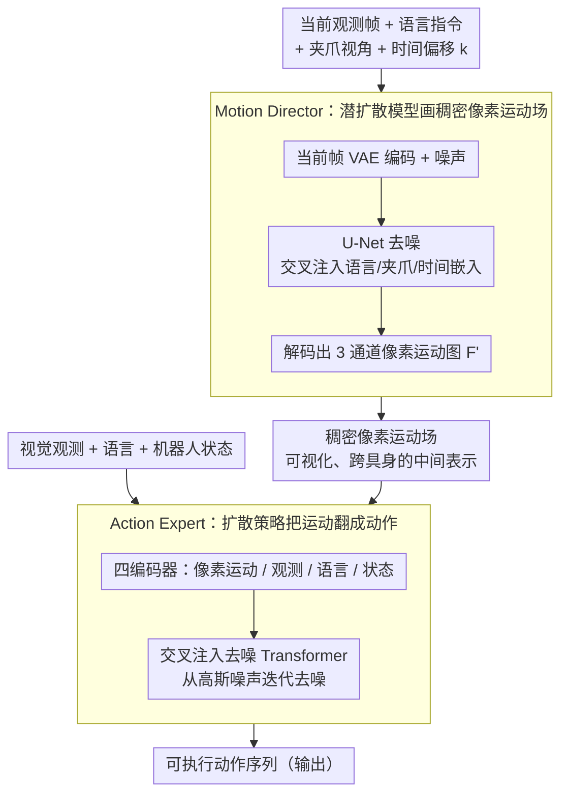

# DAWN: Pixel Motion Diffusion is What We Need for Robot Control

**会议**: CVPR 2026  
**arXiv**: [2509.22652](https://arxiv.org/abs/2509.22652)  
**代码**: [https://eronguyen.github.io/DAWN/](https://eronguyen.github.io/DAWN/)  
**领域**: 多模态VLM / 机器人控制  
**关键词**: 像素运动扩散, 视觉语言动作, 机器人操控, 两阶段扩散, 光流表示  

## 一句话总结
提出 DAWN，一个两阶段全扩散的视觉语言动作框架——Motion Director（潜扩散模型）生成稠密像素运动场作为可解释的中间表示，Action Expert（扩散 Transformer 策略）将像素运动转换为可执行机器人动作；在 CALVIN 基准上取得 SOTA（平均长度 4.00），并在真实世界单臂/双臂操控中展现强泛化能力。

## 背景与动机
VLA (Vision-Language-Action) 模型虽已取得显著成果，但大多直接从视觉观测映射到动作，缺乏对运动意图的显式建模。一些方法通过视频预测作为中间步骤，但在 RGB 空间操作增加了学习难度。像素轨迹作为运动表示已被证明有效，但现有方法使用稀疏像素追踪或间接地从生成视频中提取运动——不如直接预测稠密像素运动简洁高效。

## 核心问题
如何设计一个结构化、可解释且高效的中间运动表示来桥接高层语言意图和低层机器人动作？

## 方法详解

### 整体框架

DAWN 想给 VLA 加一层"看得见"的运动意图，免得模型从观测到动作一步黑箱跳过去。它用两阶段全扩散：Motion Director（潜扩散模型 LDM）先根据当前观测 + 语言指令画出一张稠密像素运动场，Action Expert（扩散 Transformer 策略）再把这张运动场连同观测、语言、机器人状态一起翻译成可执行的动作序列。中间这层稠密像素运动既能直接可视化、又不绑定具体机器人构型，是整篇方法的支点；而且两个阶段都拿 RAFT 光流当 ground truth，可以解耦并行训练、各自独立升级。

### 关键设计

**1. Motion Director：用预训练 LDM 画出稠密像素运动场**

高层运动规划交给一个基于预训练 Stable Diffusion 的 U-Net：当前帧先经 VAE 编码、与噪声拼接作为输入，再通过交叉注意力注入语言嵌入（CLIP 文本编码）、夹爪视角嵌入（CLIP 视觉编码）和时间偏移量 $k$，输出解码成 3 通道像素运动图 $F'_{t,k} = [u, v, (u+v)/2]$。训练时用 RAFT 光流模型生成 ground truth，而且只更新 U-Net、冻结所有编码器和 VAE——这样能最大限度复用大规模图像生成预训练的能力，不必从零去学怎么画运动。

**2. Action Expert：把运动场翻成动作的扩散策略**

低层执行是一个 Transformer 架构的扩散策略，四个编码器分别处理像素运动（DINOv3 ConvNeXt-S）、视觉观测、语言指令（T5-small）和机器人状态（2 层 MLP）。所有条件 token 拼接后通过交叉注意力注入去噪 Transformer，从高斯噪声迭代去噪生成动作序列。它本质上是在回答"既然场景该这么动，机器人关节就该这么走"。

**3. 为什么选稠密像素运动当中间表示**

直接从观测映射到动作缺乏对运动意图的显式建模，而用 RGB 视频预测当中间步骤又得在像素空间硬学、难度大。稠密像素运动正好卡在中间的甜点：它比 RGB 视频预测更结构化（直接编码运动方向和幅度），比稀疏像素追踪更信息丰富（稠密覆盖全场景），还能直接可视化成"模型打算让场景怎么动"，且不依赖特定机器人关节配置——一个表示同时满足了结构化、可解释、跨具身三个要求。

**4. 模块化可并行训练**

Motion Director 和 Action Expert 可以各自拿 RAFT 光流当 GT 并行训练，之后再可选地在 Motion Director 的真实输出上微调 Action Expert。高层和低层因此能独立升级、快速迭代，而不必每次都端到端重训。

### 损失函数 / 训练策略
- 两个模型都用 MSE 噪声估计损失
- Motion Director：100k 步，batch=16/GPU，4×A6000
- Action Expert：10k 步，batch=64/GPU
- AdamW lr=1e-4，混合精度训练
- 推理时 Motion Director 25 步扩散

## 实验关键数据

### CALVIN ABC→D（无外部数据）

| 方法 | 1st ↑ | 2nd ↑ | 3rd ↑ | 4th ↑ | 5th ↑ | Avg Len ↑ |
|------|-------|-------|-------|-------|-------|-----------|
| Diffusion Policy | 0.40 | 0.12 | 0.03 | 0.01 | 0.00 | 0.56 |
| MoDE | 0.92 | 0.79 | 0.67 | 0.56 | 0.45 | 3.39 |
| Seer-Large | 0.96 | 0.89 | 0.80 | 0.71 | 0.60 | 3.96 |
| **DAWN** | **0.97** | **0.89** | **0.82** | **0.72** | **0.60** | **4.00** |

### MetaWorld (11 任务)

| 方法 | 平均成功率 ↑ |
|------|------------|
| LTM | 57.7% |
| ATM | 52.0% |
| **DAWN** | **65.4%** |

### 真实世界单臂操控（xArm7, 1000 episodes, 6种物品提举放置）

| 方法 | 整体成功率 | 推理时延 |
|------|----------|---------|
| Enhanced DP | 较低 | 112.77ms |
| $\pi_0$ | 中等（常抓错物品）| 571.89ms |
| VPP | 高 | 190.55ms |
| **DAWN** | **最高** | 319.82ms |

DAWN 在几乎所有物品类别上成功率最高，且错误抓取率极低。

### 消融实验要点
- **像素运动 vs RGB 目标**：像素运动 (4.00) >> RGB 目标图 (3.21) >> 无中间表示 (2.78)
- **预训练 vs 从头训练**：预训练 LDM 的像素运动 (4.00) > 从头训练 (3.42)——预训练图像生成模型对像素运动预测有显著帮助
- **夹爪视角**：移除夹爪视角后降至 3.74（缺少遮挡和手-物交互信息）
- **扩散步数**：2 步 (3.88) → 25 步 (4.00) → 40 步 (3.95)，25 步最优
- **双臂操控**：像素运动同样降低双臂场景的动作预测 MSE

## 亮点
- **稠密像素运动作为通用运动表示**：比 RGB 预测更简洁，比稀疏轨迹更丰富，比关键点更通用
- **首次将预训练 LDM adapted 用于稠密像素运动生成**：充分利用了大规模图像生成预训练的能力
- **模块化可解释**：Motion Director 的输出可直接可视化，提供对模型决策的透明理解
- **数据高效**：仅 1000 真实世界 episodes 即可实现强泛化，体现了结构化中间表示的优势
- **双臂扩展**：在 Galaxea R1-Lite 双臂平台上验证了方法的通用性

## 局限与展望
- 推理延迟相对较高（319ms vs Enhanced DP 的 113ms），因为需要两阶段扩散
- Motion Director 的光流 GT 依赖 RAFT，在无纹理或快速运动场景可能不准确
- 使用外部数据（DROID）时性能优于无外部数据但未达到 VPP 和 DreamVLA 的最高水平
- 仅支持表面操控任务，未验证接触丰富的任务（如装配）

## 与相关工作的对比
- **vs VLA (OpenVLA, RT-2, $\pi_0$)**: VLA 端到端映射，缺乏可解释的中间表示；DAWN 通过像素运动提供透明的运动规划
- **vs Gen2Act (视频预测→运动提取)**: Gen2Act 先生成 RGB 视频再追踪像素提取运动，两步链式误差；DAWN 直接在潜空间预测运动
- **vs VPP (视频扩散特征)**: VPP 用视频扩散模型提取预测性特征但不显式生成运动；DAWN 的运动场更可解释且在小数据场景更有优势

## 启发与关联
- 像素运动作为机器人控制的通用中间表示，可以与 VLM 的视觉推理能力结合——让 VLM 理解和生成运动意图
- 预训练图像扩散模型成功适配到像素运动预测，提示了更多非 RGB 输出的 LDM 应用可能
- 模块化设计允许独立升级高层和低层组件，适合快速迭代

## 评分
- 新颖性: ⭐⭐⭐⭐ 稠密像素运动作为统一中间表示 + 双扩散架构是有效的新设计
- 实验充分度: ⭐⭐⭐⭐⭐ CALVIN + MetaWorld + 真实单臂 + 真实双臂，消融完整
- 写作质量: ⭐⭐⭐⭐ 论文结构清晰，方法描述详细
- 价值: ⭐⭐⭐⭐ 为机器人学习提供了一个简洁有效的结构化中间表示方案

<!-- RELATED:START -->

## 相关论文

- [\[CVPR 2026\] Pixel-level Scene Understanding in One Token: Visual States Need What-is-Where Composition](pixel-level_scene_understanding_in_one_token_visual_states_need_what-is-where_co.md)
- [\[CVPR 2026\] CoMo: Learning Continuous Latent Motion from Internet Videos for Scalable Robot Learning](como_learning_continuous_latent_motion_from_internet_videos_for_scalable_robot_l.md)
- [\[CVPR 2026\] GraspLDP: Towards Generalizable Grasping Policy via Latent Diffusion](graspldp_towards_generalizable_grasping_policy_via_latent_diffusion.md)
- [\[CVPR 2026\] Chain of World: World Model Thinking in Latent Motion (CoWVLA)](chain_of_world_world_model_thinking_in_latent_motion.md)
- [\[CVPR 2026\] HiF-VLA: Hindsight, Insight and Foresight through Motion Representation for Vision-Language-Action Models](hif-vla_hindsight_insight_and_foresight_through_motion_representation_for_vision.md)

<!-- RELATED:END -->
