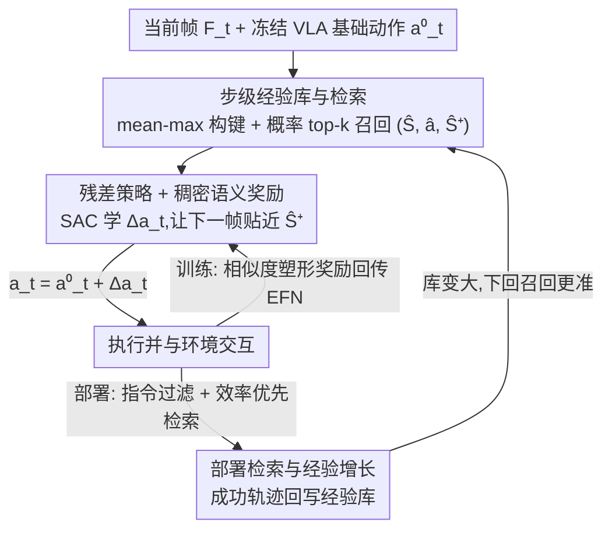

# Dejavu: Towards Experience Feedback Learning for Embodied Intelligence

**会议**: CVPR 2026  
**论文**: [CVF Open Access](https://openaccess.thecvf.com/content/CVPR2026/html/Wu_Dejavu_Towards_Experience_Feedback_Learning_for_Embodied_Intelligence_CVPR_2026_paper.html)  
**代码**: 项目页 https://dejavu2025.github.io/  
**领域**: 具身智能 / 机器人  
**关键词**: VLA, 经验回放检索, 残差策略, 部署后学习, Soft Actor-Critic  

## 一句话总结
给一个**冻结的 VLA 策略**外挂一个经验反馈网络（EFN）：它从一个会在部署中持续增长的「经验库」里检索语义相似的历史轨迹，用强化学习预测一个加到原动作上的**残差修正**，从而让机器人在不更新任何主干权重的前提下，靠「攒记忆 + 调用记忆」越用越好，LIBERO 长任务成功率从 53.7% 提到 76.5%，真机平均成功率从 25.8% 提到 70.2%。

## 研究背景与动机

**领域现状**：统一的视觉-语言-动作（VLA）模型在大规模离线数据上训练后，能跨任务泛化做操作（manipulation）。但这些模型一旦部署，权重就冻住了——它们在真实环境里基本「停止学习」，除非重新收集数据再做一次昂贵的微调。

**现有痛点**：人类碰到新问题时，往往不是去重写脑子里的核心知识，而是**回忆并复用过去的经验**（这正是「déjà vu / 似曾相识」背后的情景记忆机制）。而现有 VLA 没有这种能力：要变好就得改权重。已有的「检索增强 RL / 检索增强具身智能体」方法虽然也检索历史轨迹，但它们大多 (i) 仍然要在部署中持续更新一个**可训练**策略的权重；(ii) 在**静态离线语料**上检索，而不是一个随部署增长的活记忆库；(iii) 在压缩过的状态/任务抽象上做检索，而不是现代 VLA 那种丰富的、开放词表的视觉-语言接口。

**核心矛盾**：想让一个**已经很强但有缺陷的冻结策略**在部署后持续改进，又不想动它那庞大的主干——缺一个「部署时即插即用、靠记忆增长来变好」的机制。

**本文目标**：设计一个外挂模块，使冻结 VLA 能 (a) 把成功执行的轨迹存进一个会增长的经验库，(b) 在线检索与当前情境相关的经验，(c) 据此修正当前动作，整个过程**零梯度更新主干**。

**切入角度**：作者把 VLA 当成「冻结主干」，把改进交给一个轻量外部控制器——残差策略。关键观察是：好的修正不需要重学一个动作，只需要在原动作上加一个小的、由经验引导的偏移；而「这一步该往哪偏」可以用「让下一帧看起来像检索到的那条经验里的后继帧」来定义，从而把稀疏的成功/失败反馈变成稠密的相似度塑形信号。

**核心 idea**：用「检索一条相似经验 → 预测残差动作 → 让结果向经验的后继状态对齐」来替代「重新微调主干」，实现部署后通过记忆增长而非权重更新的自我提升。

## 方法详解

### 整体框架

EFN（Experience Feedback Network）把一个冻结 VLA 包起来，分三块：**经验库设计**（怎么存、怎么检索）、**残差策略学习**（怎么用 RL 训出那个修正）、**部署检索与经验增长**（部署时怎么调用记忆、怎么把新成功轨迹塞回库里）。在每个控制步 $t$，系统拿当前视觉特征 $F_t$ 和冻结 VLA 给出的基础动作 $a^{(0)}_t$，从经验库检索一条匹配的经验步 $(\hat F, \hat a, \hat F^+)$，EFN 据此输出残差 $\Delta a_t$，最终执行动作为 $a_t = a^{(0)}_t + \Delta a_t$。训练阶段用 Soft Actor-Critic（SAC）+ 稠密语义相似奖励来学这个残差；部署阶段所有权重（VLA 与 EFN）全部冻结，适应能力**纯粹来自记忆库的增长与召回**。

### 关键设计

**1. 步级经验库 + mean-max 构键 + 概率 top-k 检索：把「丰富的视觉-语言接口」变成可检索的记忆**

痛点是：现有检索增强方法在压缩的状态抽象上检索，配不上 VLA 那种 token 级的丰富表示。EFN 把经验组织成整条 rollout $\tau=(s_1,a_1,\dots,s_T,a_T)$，并对其中每一步执行动作的时刻 $(s_t,a_t)$ 都入库；每个 rollout 还存一个固定的指令嵌入 $\ell_\tau$（用 VLA 的语言模型在 episode 开头编码任务描述）。步级上存三样：VLA 视觉编码器特征 $F_t\in\mathbb{R}^{L\times C}$、用于检索的紧凑键向量 $k_t$、以及基础策略当时的原始动作 $a^{(0)}_t$。

键的构造用 **mean-max 融合 + 逐 token ℓ2 归一化**：先把每个 token 特征按通道归一化，再沿 token 维分别取 mean 和 max 并各自归一化得到 $m_t,x_t$，最后等权平均再归一化：

$$k_t = \frac{\tfrac12 m_t + \tfrac12 x_t}{\left\lVert \tfrac12 m_t + \tfrac12 x_t \right\rVert_2 + \varepsilon}\in\mathbb{R}^{d_k}.$$

检索时用同样融合得到查询 $q_t$，对所有键算余弦相似度 $s_i=\cos(q_t,k_i)$ 取 top-$k$，再用相似度偏置的 softmax **采样一条**（而非直接取最相似那条）：$p(i\mid q_t)=\exp(s_i/\tau)/\sum_{j\in N_k}\exp(s_j/\tau)$。这种「先检索再采样」在近邻里保留探索性，又偏向语义最相似的经验。为什么有效：mean 抓全局语义、max 抓显著局部线索，两者融合的键比单纯 pooling 更能在视觉空间里形成紧致的局部近邻（论文的 PCA 可视化显示 top-k 近邻确实聚在查询附近），让检索既相关又不至于过拟合到单条记忆。

**2. 残差策略 + 稠密语义匹配奖励：用「让下一帧像经验的后继帧」把稀疏成败信号变稠密**

痛点是：直接拷贝最近邻动作（kNN-RAG）很脆，而纯残差（ResAct）没有情景上下文、纯靠稀疏的成功/失败回报学得慢。EFN 的 actor 只输出残差 $\Delta a_t$，执行动作 $a_t=a^{(0)}_t+\Delta a_t$——$a^{(0)}_t$ 保住基础策略的能力，$\Delta a_t$ 只做一个由检索经验调制的小修正（论文的潜空间可视化显示这些残差箭头都是基础动作附近的短位移，说明 EFN 是「微调层」而非「另起炉灶的控制器」）。

核心是**稠密语义匹配奖励**：执行 $a_t$ 后环境给出 $s_{t+1}$，把它的语义表示和检索经验的后继帧 $\hat F^+$ 比相似度，$r^{\mathrm{sem}}_t=\cos\big(u(F_{t+1}),u(\hat F^+)\big)$（$u(\cdot)$ 即前述 mean-max 融合）。这等于直接告诉 agent「往那条成功经验的下一步靠」，不需要监督残差标签，也因为奖励只看特征相似度而非成败 flag，**成功和失败的轨迹都能拿来训练**（只要含有意义的状态转移）。再配一个残差幅度正则 $r_t=\lambda_{\mathrm{sem}}r^{\mathrm{sem}}_t-\lambda_{\mathrm{res}}\lVert\Delta a_t\rVert_2^2$ 防止把基础行为带偏。

训练用 SAC：把当前与检索上下文编码成 $c_t=\mathrm{enc}(F_t,a^{(0)}_t,\hat F,\hat a,\ell)$，残差策略 $\pi_\phi(\Delta a_t\mid c_t)$，两个 Q 网络评估修正后的动作，critic 用软 Bellman 备份、actor 最小化熵正则目标（梯度不流经检索目标 $\hat F,\hat F^+$，只更新 EFN 的 actor / critic / 上下文编码器）。SAC 的熵正则和 off-policy 样本效率正好适合「反复复用库里的存量经验」。

进一步，作者把奖励做了**抗摸鱼（anti-idling）塑形**：定义三个相似度 $s^{\mathrm{next}}_t=\mathrm{sim}(F_{t+1},\hat F^+)$、$s^{\mathrm{cur}}_t=\mathrm{sim}(F_t,\hat F)$、$s^{\mathrm{stay}}_t=\mathrm{sim}(F_{t+1},F_t)$，进度项 $p_t=s^{\mathrm{next}}_t-s^{\mathrm{cur}}_t$、运动项 $m_t=1-s^{\mathrm{stay}}_t$，最终奖励

$$r_t = w_{\mathrm{abs}}s^{\mathrm{next}}_t + w_{\mathrm{prog}}[p_t]_+ + w_{\mathrm{mot}}m_t - w_{\mathrm{lazy}}\big(s^{\mathrm{next}}_t\, n_t\, s^{\mathrm{stay}}_t\big) - \lambda_{\mathrm{time}}.$$

它在保留「绝对相似度奖励」之外，额外奖励真正向后继状态推进（$[p_t]_+$）、鼓励非平凡运动（$m_t$），并在「已经很像但几乎没进展、帧间也几乎不动」时触发惩罚——治的就是「停在一个好视角不动来骗相似度」这种退化行为；$\lambda_{\mathrm{time}}$ 的每步代价则偏好更短的成功轨迹。

**3. 部署检索与在线经验增长：指令过滤 + 效率优先 + 只回写成功轨迹**

痛点是：训练时检索可以「全库找」，但部署时若不区分任务、不偏好高效轨迹，就会召回大量无关或冗余的记忆。EFN 的部署 pipeline 与训练同构，但有三处不同。其一，**指令过滤**：用 VLA 语言编码器对当前任务描述算嵌入 $\ell^\star$，和所有 rollout 级嵌入比余弦相似度取 top-$n$ 条 rollout，$R_n=\mathrm{Top}\text{-}n\{\cos(\ell^\star,\ell_{\tau_j})\}$，只有这些 rollout 的步级条目才进入候选池 $C$——把检索范围限到「同类任务」的小而聚焦的集合（PCA 显示指令嵌入按任务类型成簇）。

其二，**效率优先**：给每个候选的相似度叠一个长度先验，$\tilde s_i=\lambda s_i+(1-\lambda)g(L_{\rho(i)})$，其中 $g(L)=\exp[-\beta L/\bar L]$ 随 rollout 长度递减，再在 top-$k$ 里 softmax 采样——既看「像不像」也偏向「来自更短/更高效行为」的记忆，因为短轨迹通常冗余动作少、完成更快。其三，**在线增长**：每个 episode 结束后把这条 rollout 的步元组写回库，但**部署时只回写成功到达目标的轨迹**（训练时可容忍接近成功甚至失败的轨迹），让未来检索都是高质量参考。受经验预算约束时可叠加 reservoir 采样 / 近因替换等标准保留策略，而不改动检索与学习机制。正是这一步让「部署后适应」真正成立：不动任何权重，库越攒越大、召回越来越准。

### 损失函数 / 训练策略
- **Critic**：$\mathcal{L}_{\mathrm{critic}}=\sum_{i=1,2}\mathbb{E}\big[(Q_{\theta_i}(c_t,a^{(0)}_t+\Delta a_t)-y_t)^2\big]$，目标 $y_t=r_t+\gamma\,\mathbb{E}[\min_i Q_{\bar\theta_i}(c_{t+1},a^{(0)}_{t+1}+\Delta a_{t+1})-\alpha\log\pi_\phi(\Delta a_{t+1}\mid c_{t+1})]$。
- **Actor**：最小化熵正则目标 $\mathcal{L}_{\mathrm{actor}}=\mathbb{E}[\alpha\log\pi_\phi(\Delta a_t\mid c_t)-\min_i Q_{\theta_i}(c_t,a^{(0)}_t+\Delta a_t)]$，温度 $\alpha$ 可调以维持目标熵。
- 与 UniVLA 集成时残差在**潜动作空间**预测（256 视觉 token + 4 个潜动作 token），加到基础潜动作后再由冻结动作头解码；测试时对 actor 均值施加 $\tanh$ 做确定化，horizon $H=320$。

## 实验关键数据

### 主实验

在 LIBERO 基准上，把 EFN 挂到 OpenVLA / UniVLA / GO-1 三个冻结主干上，对比四类基线（kNN-RAG 纯检索、ResAct 纯残差、R2A 检索增强 RL〔更新主干〕、GC-TTT 测试时训练〔更新主干〕）。每设置 50 episodes × 3 seeds 取平均，报成功率（越高越好）与成功条件下平均步数（越低越好）。

| 主干 / 方法 | Spatial 成功↑ | Object 成功↑ | Goal 成功↑ | Long 成功↑ | 平均成功↑ | 平均步数↓ |
|------|------|------|------|------|------|------|
| OpenVLA（冻结） | 84.7 | 88.4 | 79.2 | 53.7 | 76.5 | 160.2 |
| +R2A（改主干） | 87.5 | 91.1 | 84.6 | 63.2 | 81.6 | 156.3 |
| +EFN (Vol=300) | 88.5 | 91.3 | 85.7 | 72.1 | 84.4 | 160.0 |
| +EFN (Vol=1000) | **89.9** | **92.2** | **89.2** | **76.5** | **87.0** | 156.7 |
| UniVLA（冻结） | 96.5 | 96.8 | 95.6 | 92.0 | 95.2 | 164.2 |
| +EFN (Vol=1000) | **98.2** | **98.2** | **97.6** | **94.6** | **97.2** | **151.3** |
| GO-1（冻结） | 96.3 | 97.4 | 95.6 | 89.3 | 94.7 | 163.1 |
| +EFN (Vol=1000) | **98.1** | **98.5** | **97.3** | **92.8** | **96.7** | **154.8** |

最关键的提升在**长任务（Long）**：OpenVLA 上从 53.7% 跳到 76.5%（+22.8pt），远超 R2A 的 63.2%，而且 EFN 全程不动主干。Vol=300 的小库已能匹配或超过所有基线，Vol=1000 进一步但收益递减。

真机（AgiBot-G1 + GO-1，四个由易到难的任务）趋势一致，且差距更大：

| 方法 | BottlePlace 成功↑ | ShelfSort 成功↑ | StockLift 成功↑ | DrawerStore 成功↑ | 平均成功↑ | 平均步数↓ |
|------|------|------|------|------|------|------|
| GO-1（冻结） | 47.3 | 34.0 | 16.0 | 5.3 | 25.8 | 491.8 |
| +R2A（改主干） | 61.3 | 51.3 | 31.3 | 14.0 | 39.5 | 469.1 |
| +EFN (Vol=300) | 69.3 | 54.7 | 42.0 | 37.3 | 50.8 | 454.1 |
| +EFN (Vol=1000) | **82.0** | **74.7** | **65.3** | **58.7** | **70.2** | **435.1** |

最难的 DrawerStore 上，冻结 GO-1 只有 5.3%、kNN-RAG / GC-TTT 直接 0%，EFN(Vol=1000) 拉到 58.7%。效率上 EFN 每步延迟仅 +4.2%（35.7→37.2ms），但因平均步数 -11.5%，整段 episode 时间反而 -7.9%。

### 消融实验
LIBERO 上做四个受控变体：

| 配置 | 影响 | 说明 |
|------|------|------|
| Full（EFN 完整） | — | 成功率与效率均最佳 |
| w/o SAC | 成功率与效率均下降 | 换成纯 value critic，失去熵正则的探索 |
| w/o dense（去稠密相似奖励） | 学得更慢、最终更差 | 只剩稀疏任务回报，缺频繁塑形信号 |
| w/o instr（去指令过滤） | 下降 | 召回里混入跨任务的无关经验 |
| w/o anti-idle（去抗摸鱼项） | 下降 | 出现「停在好视角骗相似度」的退化行为 |

### 关键发现
- **检索-only 反而有害**：kNN-RAG 在仿真和真机上几乎都掉点，说明「直接拷贝最近邻动作」很脆，必须配残差修正。
- **更新主干并不划算**：R2A / GC-TTT 要改主干权重，GC-TTT 在非 i.i.d. rollout 上做激进测试时微调甚至越调越差（最难任务直接失败）；EFN 在相同交互预算下、零主干更新就超过它们。
- **稠密语义奖励是关键引擎**：去掉它学习显著变慢，这是把「成败稀疏信号」变可学的核心。
- **库容收益递减**：真机上 Vol=300→1000 的差距比仿真小，说明中等规模库已覆盖主要任务变化。

## 亮点与洞察
- **把「部署后学习」从改权重转成增长记忆**：EFN 是（作者所称）首个面向冻结 VLA 的部署后学习框架，靠在线经验积累 + 检索条件化残差修正来适应——这个范式很可迁移，凡是「有强但冻结的基础模型 + 想低成本在线变好」的场景都适用。
- **用「后继帧相似度」当稠密奖励**：把「成不成功」这种稀疏二值信号，换成「下一帧像不像那条成功经验的下一帧」，巧妙地把检索目标变成可塑形的密集监督，还顺带让失败轨迹也能用于训练。
- **残差而非替换**：潜空间可视化证明 EFN 只做小位移修正，保住了基础策略能力的同时纠偏，比「另训一个完整控制器」更安全、更省样本。
- **anti-idling 奖励项**很实用：稠密相似度奖励天然会被「停着不动骗相似度」钻空子，作者用 $s^{\mathrm{next}}/s^{\mathrm{cur}}/s^{\mathrm{stay}}$ 三量构造的进度+运动+惩罚组合堵住了这个漏洞，是相似度塑形奖励里值得复用的 trick。

## 局限与展望
- **依赖一个有质量的初始经验库**：方法本质是「检索+复用」，若任务全新、库里没有任何相关经验，残差缺乏可靠引导，收益会受限（论文也承认收益随库容递减）。
- **相似度奖励的语义代理风险**：奖励完全建立在视觉特征余弦相似度上，⚠️「下一帧更像后继帧」不总等于「任务真的更接近成功」，在视觉相似但语义不同的场景可能误导（作者用 anti-idle 缓解了一部分，但未根治）。
- **横向比较的 caveat**：表中 R2A / GC-TTT 是「更新主干」范式，与 EFN「冻结主干」不完全同条件，成功率高低需结合「是否改权重、交互预算」一起看，不宜单纯比数字。
- **保留策略略过**：经验预算下用 reservoir / 近因替换等被一笔带过，长期部署中库如何不退化、如何防止坏记忆累积，值得更系统的研究。

## 相关工作与启发
- **vs 检索增强 RL（如 R2A）**：他们把策略/价值函数与外部经验缓冲耦合、但仍持续更新可训练策略的权重，且多在静态离线语料上检索；本文在**冻结主干**上做、维护**会增长的活记忆库**、在 VLA 的视觉-语言接口上检索，优势是部署即用、零主干微调，劣势是高度依赖检索质量。
- **vs 残差策略学习（如 ResAct）**：他们也学「加性修正」，但缺情景检索与相似度塑形奖励；本文给残差喂入检索到的经验上下文并用稠密语义奖励训练，实验上比纯残差稳定且涨点更大。
- **vs 测试时训练（GC-TTT）**：他们在线更新主干来适应，在非 i.i.d. rollout 上容易不稳甚至退化；本文不更新任何权重，靠记忆召回适应，因此更稳、最难任务上不崩。

## 评分
- 新颖性: ⭐⭐⭐⭐ 「冻结 VLA + 活经验库 + 检索条件化残差」组合在部署后学习里是新的，把后继帧相似度做稠密奖励也颇巧。
- 实验充分度: ⭐⭐⭐⭐ 三主干 × LIBERO 四类任务 + 真机四任务 + 四项消融，成功率/步数双指标齐全，但缺更长期部署下记忆退化的考察。
- 写作质量: ⭐⭐⭐⭐ 方法分块清晰、公式完整，奖励塑形部分讲得透；图多但偏示意。
- 价值: ⭐⭐⭐⭐ 给「不改主干也能在线变好」提供了一个干净可复用的框架，对真实机器人持续部署有实际意义。

<!-- RELATED:START -->

## 相关论文

- [\[CVPR 2026\] AT-VLA: Adaptive Tactile Injection for Enhanced Feedback Reaction in Vision-Language-Action Models](at-vla_adaptive_tactile_injection_for_enhanced_feedback_reaction_in_vision-langu.md)
- [\[ICML 2026\] Plan in Sandbox, Navigate in Open Worlds: Learning Physics-Grounded Abstracted Experience for Embodied Navigation](../../ICML2026/robotics/plan_in_sandbox_navigate_in_open_worlds_learning_physics-grounded_abstracted_exp.md)
- [\[CVPR 2026\] Test-Time Perturbation Tuning with Delayed Feedback for Vision-Language-Action Models](test-time_perturbation_tuning_with_delayed_feedback_for_vision-language-action_m.md)
- [\[CVPR 2026\] TrajRAG: Retrieving Geometric-Semantic Experience for Zero-Shot Object Navigation](trajrag_retrieving_geometric-semantic_experience_for_zero-shot_object_navigation.md)
- [\[CVPR 2026\] OctoNav: Towards Generalist Embodied Navigation](octonav_towards_generalist_embodied_navigation.md)

<!-- RELATED:END -->
