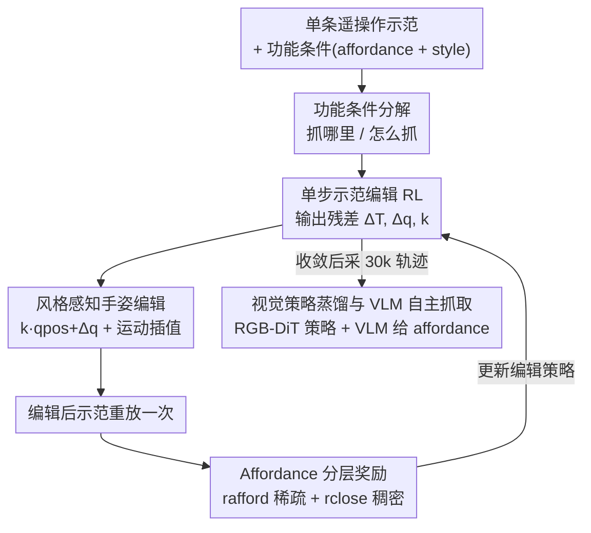

# DemoFunGrasp: Universal Dexterous Functional Grasping via Demonstration-Editing Reinforcement Learning

**会议**: CVPR 2026  
**论文**: [CVF Open Access](https://openaccess.thecvf.com/content/CVPR2026/html/Mao_DemoFunGrasp_Universal_Dexterous_Functional_Grasping_via_Demonstration-Editing_Reinforcement_Learning_CVPR_2026_paper.html)  
**代码**: 项目页见论文（CVF 版未给出 GitHub，⚠️ 以官方项目页为准）  
**领域**: 机器人 / 具身智能（灵巧手功能性抓取）  
**关键词**: 功能性抓取, 灵巧手, 强化学习, 示范编辑, Sim-to-Real

## 一句话总结
把"功能性抓取"拆成 affordance（抓哪里）+ grasping style（怎么抓）两个条件，再用"单步示范编辑 RL"——只采集一条示范、让策略对它输出残差修正——绕开高自由度灵巧手的多步多任务探索难题，在 3,200 个物体上训出一个通用功能抓取策略，并零样本迁移到真机（VLM 引导下真实成功率 64.4%）。

## 研究背景与动机
**领域现状**：灵巧手抓取近年靠大规模仿真 RL 取得不错的稳定性和泛化，能做到闭环、自适应的桌面抓取。但绝大多数方法只追求"抓得稳"（机械稳定性），不管"抓得对不对用途"。

**现有痛点**：下游操作（用喷壶、握锤柄、拿杯把）真正需要的是**功能性抓取**——既要抓在正确的功能区域，又要用符合用途的手型。现有功能抓取路线有两类毛病：(1) 生成式方法（合成人手姿态、从人类数据学）严重依赖人工监督和高质量数据，且多为开环规划，桌面执行时很脆；(2) RL 路线虽是闭环，但灵巧手动作空间维度极高，再叠加"物体多样 + 抓取风格多样"的多任务优化，探索空间爆炸，性能上不去。

**核心矛盾**：功能性抓取本质是**多步、多任务、高维**的 RL 问题——既要在长动作序列上探索，又要同时覆盖海量物体 × 风格 × affordance 组合，标准多步 RL 在这种设定下采样效率低、优化不稳。

**本文目标**：用一个统一策略覆盖任意物体 + 任意 affordance + 任意 style，并能零样本 sim-to-real。

**切入角度**：作者观察到——抓取的成败和功能精度，其实可以通过**对一条高质量示范做残差编辑**来高效优化，而不必从零合成整段运动。

**核心 idea**：把功能条件分解为 affordance + style 注入观测/奖励/动作空间，并把 RL 重写成"对单条示范的一步式编辑"，把多步高维 RL 压成单步残差精修。

## 方法详解

### 整体框架
DemoFunGrasp 的输入是一条遥操作采集的抓取示范、一个目标物体（点云 + 位姿）以及一组功能条件（affordance 点 + style 类别），输出是一个能闭环执行功能抓取的策略。整条管线分四步串起来：先把示范按物体几何和目标风格**编辑**出一条新的抓取轨迹；用 affordance/style 条件化的**单步 RL** 训练这个编辑策略；再把状态策略**蒸馏**成纯 RGB 的视觉策略以便迁移；最后在真机上由 **VLM** 给出 affordance 点做自主语言引导抓取。

关键在于把整个 RL 问题建模成**单步 MDP**：策略只观测 $(s_r, s_o, x_o, p_{\text{afford}}, l_{\text{style}})$（机器人末端 6D 位姿、物体位姿、完整点云、3D affordance 点、style 的 one-hot），一次性输出动作 $a=(\Delta T, \Delta q, k)$，对示范做一次编辑后整段重放，用奖励作为唯一学习信号。

### 关键设计

**1. 功能条件分解：把"抓哪里"和"怎么抓"解耦成两个可采样维度**

功能抓取以前难以指定目标和奖励，根源是"一个功能抓取"是个含糊的整体概念。作者把它拆成两个互补分量：**affordance** $p_{\text{afford}}\in\mathbb{R}^3$ 指定物体上要接触的功能区域（杯把、瓶盖边——where to grasp），**grasping style** $l_{\text{style}}$ 用 one-hot 指定参考手型类别（how to grasp）。两者一起就完整描述了一个功能抓取意图。这一分解的价值在于：它把"指定目标"变成了两个可在并行仿真里独立随机采样的离散/连续变量，并能同时塞进观测、奖励和动作空间，让一个策略学到 object × affordance × style 的整个组合空间，而不是为每种功能单独训一个策略。

**2. 单步示范编辑 RL：把多步高维探索压成对示范的一次残差修正**

这是全文核心，直接针对"多步多任务 RL 探索空间爆炸"。示范记为连续轨迹 $D=\{(p^{\text{ee-obj}}_t, q^{\text{ref-hand}}_t)\}_{t=0}^{T_D}$，是物体中心坐标系下完整的末端轨迹 + 手指关节序列。与传统"预抓取/抓取/后抓取"三段静态数据不同，作者保留**连续时间演化**（手指闭合时机、接触时的柔顺微调），让一步编辑能做物理上合理的插值。策略不去合成整段运动，而是预测 $\{\Delta T, \Delta q, k\}$ 作为对基轨迹的残差修正：$\Delta T$ 改末端位姿（决定 where），$\Delta q$ 和缩放系数 $k$ 调手型（决定 how）。编辑后的抓取只执行一次，奖励直接作为 RL 信号。这样 RL 被重写成"对单步动作的可解精修"而非完整运动合成，把动作空间和功能条件紧紧绑定，采样效率和性能都大幅提升。

**3. 风格感知的几何条件手姿编辑：让单条示范泛化到没见过的物体形状**

抓取可行性对局部几何极其敏感，单一示范手型套到不同物体上会失败。作者让残差缩放和关节调整 $(k,\Delta q)$ 根据采样物体几何 $x_o$ 自适应，目标手型为 $q^*_{\text{pos}} = k\cdot q_{\text{pos}} + \Delta q$，其中 $q_{\text{pos}}$ 是该 style 的标准关节配置。为在"成功率"和"风格意图"之间取舍，设计 style 奖励
$$r_{q_{\text{pos}}} = \exp\!\left(-\lVert q_{\text{pos}} - q^*_{\text{pos}}\rVert_2\right).$$
拿到目标手型后，沿参考轨迹用分数系数做运动插值：$q_i = q^{\text{ref}}_0 + f\cdot(q^{\text{ref}}_i - q^{\text{ref}}_0)$，其中 $f = \dfrac{q^*_{\text{pos}} - q^{\text{ref}}_0}{q^{\text{ref}}_{T_l} - q^{\text{ref}}_0}$。这套插值不需碰撞检测就能产出平滑关节轨迹，保持手指与物体运动的时间一致性。style 集合本身也经过仿真实验剪枝（去掉归一化后冗余、以及桌面工作空间下物理不可行的风格），最终 Shadow Hand 保留 9 种代表性风格、Inspire Hand 保留 4 种。

**4. Affordance 分层奖励：用稀疏+稠密两级信号把策略导向功能区域**

只给"抓成功"奖励，策略会退化成抓最稳的地方而非功能区域。作者先用表面法向对齐 + 物体规范位姿估计出一个 affordance 似然分布，每个 episode 从中采一个候选点（这种随机条件化让同一物体能发现多个有效功能抓法）。奖励上用分层设计：稀疏的接近项
$$r_{\text{afford}} = \mathbb{I}(\text{success})\,\mathbb{I}\!\left(d_{T-1} < \tfrac{\text{obj}_{bb}}{\gamma}\right)\exp(-d_{T-1}),\qquad r_{\text{close}} = \mathbb{I}\!\left(d^{\min}_{0:T-1} < \text{threshold}\right),$$
其中 $d^{\min}_{0:T-1}$ 是轨迹上 affordance 点到手接触点的最小距离（与是否成功无关），$\text{obj}_{bb}$ 是物体包围盒最长边、$\gamma$ 是超参。用 $\text{obj}_{bb}$ 做**物体尺度归一化**是关键 trick——大物体不会因绝对距离大而拿不到奖励，跨尺寸的 affordance 精度更稳。总奖励为 $r = \lambda_{\text{afford}} r_{\text{afford}} + \lambda_{\text{close}} r_{\text{close}} + \lambda_{q_{\text{pos}}} r_{q_{\text{pos}}} + r_{\text{success}}$，让 $r_{\text{close}}$ 在早期把手引向 affordance 区域、$r_{\text{afford}}$ 在后期做精细对齐。

**5. 视觉策略蒸馏与 VLM 自主抓取：从特权状态策略落到零样本真机**

状态策略能访问点云等特权几何信息、训得快也准，但不能直接上真机。作者在收敛后用它在仿真里采 30k 条成功轨迹（带激进域随机化：物体/桌面纹理、光照、相机外参、初始位姿），蒸馏成一个纯 RGB 的视觉策略——观测换成 $(s_r, r, c_{\text{afford}}, l_{\text{style}})$，其中 $c_{\text{afford}}$ 是 affordance 点在图像平面的 2D 投影。网络对比了 ACT、ViT-diffusion 和 VLM-encoder + DiT 三种，最终 **VLM 编码器 + DiT** 最好（能更好建模不同物体实例的多模态抓取策略与不确定性）。真机部署时再接一个 VLM（Embodied-R1）做 Object Functional Grounding，自动从语言指令产出 affordance 点，DemoFunGrasp 作为底层执行器，构成自主语言引导抓取系统。

## 实验关键数据

训练在 IsaacGym 用 PPO，状态策略用 YCB + DexGraspNet（共 3,200 物体）混合数据，物体在 50×50 cm 区域随机；真机用 6-DoF Inspire Hand + 7-DoF Franka 3 + 双 RealSense D435i。评测四个指标：GSR（抬升 ≥10 cm 且稳定 20 步算成功）、SAD（成功 affordance 距离，越小越好）、SD（风格多样性）、SA（风格准确率）。

### 主实验

Affordance 对齐（SAD，cm，越低越好），对比 SOTA 的 DemoGrasp：

| 模型 | Train | Seen Cat. | Unseen Cat. |
|------|------|------|------|
| DemoGrasp | 6.29 | 6.27 | 6.20 |
| **DemoFunGrasp** | **3.03** | **3.02** | **3.21** |

跨已见/未见类别，affordance 距离都比 DemoGrasp 降了 **3 cm 以上**——明显更贴近目标功能区域。

成功率与风格多样性，对比 UniDexGrasp：

| 方法 | Seen GSR↑ | Seen SD↑ | Unseen GSR↑ | Unseen SD↑ |
|------|------|------|------|------|
| UniDexGrasp | 74.3 | 1.00 | 70.8 | 1.00 |
| **Ours** | **76.26** | **1.48** | **71.65** | **1.44** |
| Ours (best style) | 81.74 | 1.48 | 78.68 | 1.36 |

在保持甚至略升 GSR 的同时，风格多样性接近 UniDexGrasp 的 **1.5×**；训练集上平均 GSR 略低（77.2% vs 79.4%），但在未见类别上泛化更好。9 种风格的 GSR 从 70.4% 到 77.9%（均值 75.0%）。

### 消融实验

状态策略上逐项消融（GSR↑ / SAD↓ / SA↑）：

| 配置 | GSR↑ | SAD↓ | SA↑ | 说明 |
|------|------|------|------|------|
| DemoFunGrasp（完整） | 77.04 | 3.02 | 94.74 | — |
| w/o affordance reward | 78.28 | 4.60 | 95.02 | GSR 略升但 SAD 恶化，抓到非功能区 |
| w/o obj size clipping | 81.67 | 3.63 | 93.28 | 去尺度归一化后大物体对齐变差 |
| w/o close reward | 76.44 | 3.79 | 90.58 | 缺早期引导，精度与风格双降 |
| w/o qpos reward | 74.38 | 2.98 | 95.36 | 去 style 奖励 GSR 掉最多（成功率项） |
| w/o style disturbance | 58.67 | 3.61 | 100 | **GSR 暴跌到 58.67%**，风格探索是命门 |

### 关键发现
- **风格扰动（style disturbance）是命门**：去掉后 GSR 从 77 暴跌到 58.67%——基于扰动的探索同时保证了抓取的鲁棒和多样，是整套方法里去掉代价最大的组件。
- **affordance reward 是"功能 vs 稳定"的开关**：去掉它 GSR 反而略升（78.28），但 SAD 从 3.02 恶化到 4.60，说明它确实在把策略从"抓最稳"拉向"抓在功能区"，代价是牺牲一点纯成功率。
- **物体尺度归一化（$\gamma$ 充当 clipping 因子）**对大物体 affordance 对齐至关重要，去掉后 SAD 升到 3.63，分布上大物体明显拖后腿。
- **Sim-to-Real**：RGB 策略仿真 GSR 81.2% / SAD 3.79 cm；零样本真机 9 个日常物体上人选 affordance 71%、VLM 预测 affordance 64%；扩到 33 个更不规则物体仍有 70.7%（70/99）。VLM 引导的端到端真实功能抓取平均成功率 64.4%。主要失败模式：affordance 区域太小、物体超出训练分布、VLM 预测点偏。

## 亮点与洞察
- **"分解 + 单步编辑"两招组合拳**：把功能抓取拆成 affordance/style 让目标可采样，再用单步示范编辑把高维多步 RL 压成一次残差精修——两者叠加才让"一条示范泛化到 3,200 物体"成立，是很可迁移的范式。
- **保留连续示范而非三段静态抓取**：保住手指闭合时机和接触柔顺，使一步插值能产出物理合理运动，这是很多功能抓取数据集没做对的细节。
- **物体尺度归一化奖励**：用包围盒最长边把 affordance 距离阈值随物体放缩，简单一招缓解了跨尺寸训练不稳——可直接搬到任何"距离类奖励要跨物体尺度"的任务。
- **状态策略当老师、VLM 当大脑、视觉策略当手**：分工清晰的 sim-to-real + 语言引导栈，复用性强。

## 局限与展望
- 失败模式暴露了 affordance 太小/薄物体（如叉子）会遮挡相机、超分布物体、VLM 点预测偏——视觉与 VLM 环节仍是真机瓶颈。
- ⚠️ 风格集合靠"大规模仿真实验经验性剪枝"得到（9/4 种），剪枝标准偏经验，换手型或新任务可能要重调。
- 评测缺少完全可比的功能抓取 baseline，作者只能拿抓取生成/抓取策略方法做近似对比，横向数字（如 GSR vs UniDexGrasp）的可比性需打折看。
- best-style 设定（每个物体回放所有风格取最好）GSR 冲到 81.7%，但这是"事后挑最优风格"，多样性反而下降，不能等同于在线单次成功率。

## 相关工作与启发
- **vs DemoGrasp [39]**：同属示范编辑 RL，但 DemoGrasp 只追稳定、接触点集中在最稳区域；本文加入 affordance/style 条件化，接触点分散到功能部位，SAD 降 3 cm 以上——把"稳定抓取"升级成"功能抓取"。
- **vs UniDexGrasp [37]**：UniDexGrasp 是抓取生成 + RL 管线但无功能条件；本文在相近 GSR 下拿到约 1.5× 风格多样性，且未见类别泛化更好，t-SNE 上风格簇仍清晰分离。
- **vs 开环生成式功能抓取**（人手先验 / 优化合成）：那些方法依赖人工监督、开环执行桌面易碎；本文是闭环 RL 策略，端到端连通 affordance 感知与执行。
- **vs VLM 重标注路线**：本文不把 VLM 当抓取主体，只让它产 affordance 点、底层交给鲁棒的 RL 执行器，规避了 VLM 直接控制的鲁棒性问题。

## 评分
- 新颖性: ⭐⭐⭐⭐⭐ "条件分解 + 单步示范编辑"组合让通用功能抓取真正可训、可迁移，范式清晰。
- 实验充分度: ⭐⭐⭐⭐½ 仿真 + 真机 + 多手型 + 完整消融都有，但缺真正可比的功能抓取 baseline。
- 写作质量: ⭐⭐⭐⭐ 方法分解和奖励设计讲得清楚，部分指标定义（IAS/ISS、过滤阈值）略散。
- 价值: ⭐⭐⭐⭐⭐ 零样本真机 + VLM 自主语言引导抓取，对具身操作落地价值高。

<!-- RELATED:START -->

## 相关论文

- [\[CVPR 2025\] DexGrasp Anything: Towards Universal Robotic Dexterous Grasping with Physics Awareness](../../CVPR2025/robotics/dexgrasp_anything_towards_universal_robotic_dexterous_grasping_with_physics_awar.md)
- [\[CVPR 2026\] General Process Reward Modeling for Robotic Reinforcement Learning](general_process_reward_modeling_for_robotic_reinforcement_learning.md)
- [\[CVPR 2026\] GeoDexGrasp: Geometry-aware Generation for Data-efficient and Physics-plausible Dexterous Grasping](geodexgrasp_geometry-aware_generation_for_data-efficient_and_physics-plausible_d.md)
- [\[CVPR 2026\] Towards Training-Free Scene Text Editing](towards_training-free_scene_text_editing.md)
- [\[CVPR 2026\] AdaDexTrack: Dynamic Modulation for Adaptive and Generalizable Dexterous Manipulation Tracking](adadextrack_dynamic_modulation_for_adaptive_and_generalizable_dexterous_manipula.md)

<!-- RELATED:END -->
