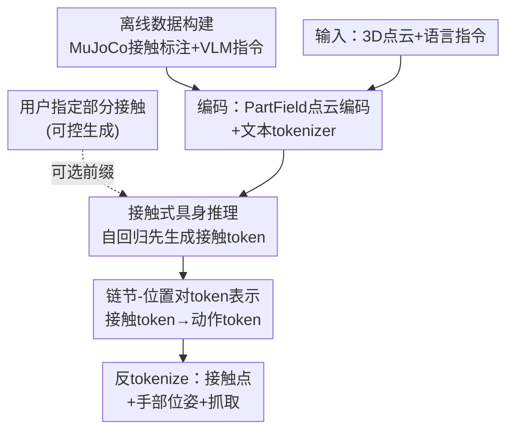

# DextER: Language-driven Dexterous Grasp Generation with Embodied Reasoning

**会议**: CVPR 2026  
**arXiv**: [2601.16046](https://arxiv.org/abs/2601.16046)  
**代码**: https://junha-l.github.io/dexter (项目主页)  
**领域**: 机器人 / 具身智能 / 灵巧抓取 / 视觉-语言-动作  
**关键词**: 灵巧抓取, 具身推理, 接触预测, 自回归生成, 可控生成

## 一句话总结
DextER 把"语言驱动的多指灵巧抓取"重新写成一条自回归序列——模型先生成**接触 token**（哪根手指链节碰物体表面的哪个 3D 位置），再生成抓取动作 token，用"接触推理"当作具身版的思维链中间步骤，在 DexGYS 上把成功率推到 67.14%（+3.83 p.p.），意图对齐指标 P-FID 相对前 SOTA 改善 96.4%。

## 研究背景与动机
**领域现状**：多指灵巧手有 20+ 自由度，要稳定且符合任务语义地抓取，远难于平行夹爪。近期主流是把视觉-语言模型（VLM）接到灵巧抓取上，融合 3D 几何与语言指令直接预测抓取参数。

**现有痛点**：现有方法分两派，各有硬伤。两阶段管线（先用 VLM 找任务相关区域/affordance，再喂给独立的抓取生成器）虽然中间产物可解释，但语义理解与物理合成**分开训练、互不学习**；端到端方法（多模态输入直接映射到抓取参数）推理快、隐式对齐，却**没有显式的物理交互推理**，失败了也难解释、难适配新任务。

**核心矛盾**：两派都漏掉了灵巧抓取最根本的物理原理——抓取成败取决于**手在哪里、以什么方式接触物体**。直接从观测映射到抓取参数，丢掉了"多指手如何与物体接触"这一结构先验。

**本文目标**：给灵巧抓取找到一种合适的"具身思维链"中间表示，既桥接高层任务语义（"抓杯子的把手"）又约束于机器人本体与物体几何。

**切入角度**：具身思维链（embodied CoT）在移动操作、平行夹爪上已被验证有效，但它们的中间表示是文本计划、bbox、轨迹点——这些对多指接触几何无能为力。作者的关键观察是：**接触模式本身就是最贴合灵巧操作的中间表示**。

**核心 idea**：用"预测哪些手指链节接触物体表面的哪些 3D 位置"作为本体感知的中间推理步骤，把抓取生成因式分解为 $p(\mathbf{a},\mathcal{C}\mid\mathbf{P},\mathbf{T})=p(\mathcal{C}\mid\mathbf{P},\mathbf{T})\cdot p(\mathbf{a}\mid\mathcal{C},\mathbf{P},\mathbf{T})$——先想接触、再出抓取，全部在统一的下一 token 预测框架内自回归生成。

## 方法详解

### 整体框架
给定目标物体点云 $\mathbf{P}\in\mathbb{R}^{N\times 3}$ 和描述期望抓取的语言指令 $\mathbf{T}$，目标是预测多指手的抓取位姿 $\mathbf{a}\in\mathbb{R}^{D}$（$D$ 为自由度）。DextER 不直接把输入映射到抓取参数，而是把预测拆成"先接触、后动作"两步：点云经 PartField 编码、文本经 tokenizer 编码，拼接后送入 LLM backbone；LLM **先自回归吐出接触 token**（链节-位置对），再吐出动作 token；最后反 tokenize 成接触点、手关节配置与抓取位姿。整条链就是一个序列生成问题，接触预测充当可解释的中间推理步。

离线还有一条数据构建支路：用 MuJoCo 物理引擎给两个抓取数据集自动标注接触、用 VLM 补语言描述，为上面的接触推理提供监督。推理时用户还能塞入部分接触约束，让模型补全剩余序列，实现可控生成。

### 关键设计

**1. 接触式具身推理：先想"哪根手指碰哪里"再生成抓取**

针对"端到端直接出抓取参数、缺物理推理"这个痛点，DextER 把生成显式因式分解为 $p(\mathcal{C}\mid\mathbf{P},\mathbf{T})\cdot p(\mathbf{a}\mid\mathcal{C},\mathbf{P},\mathbf{T})$：模型必须先预测接触集合 $\mathcal{C}$，再在其条件下生成完整抓取 $\mathbf{a}$。接触被设计成本体感知的中间表示——它一头连着任务语义（"抓把手"对应把手区域的接触），一头连着物理约束（手指链节能落在哪、物体表面在哪）。为了诱导模型真去做这步推理，训练时在指令前拼一组多样化的 meta-prompt（如"逐步思考：先预测哪些链节接触哪里，再预测抓取位姿"），并不断变换措辞防止过拟合到固定句式。这一步把"接触推理"变成灵巧操作专属的具身思维链，消融显示去掉它（w/o ECoT）P-FID 从 0.20 恶化到 0.30、成功率从 67.14% 跌到 62.37%、力闭合质量 $Q_1$ 从 0.89 降到 0.66，说明显式接触推理既改善意图对齐、又把模型引向物理更稳的抓取

**2. 链节-位置对的离散 token 表示：把接触和动作塞进统一词表自回归生成**

要让接触推理和抓取生成都跑在同一个下一 token 预测框架里，必须把连续量离散化。接触被表示为链节-位置对集合 $\mathcal{C}=\{(l_i,\mathbf{p}_i)\}$，其中 $l_i$ 是手部链节（如拇指根 thbase、食指远端 ffdistal），$\mathbf{p}_i\in\mathbb{R}^3$ 是物体表面 3D 接触位置。位置坐标先归一化到数据集固定包围盒、再每维均匀离散成 $N_{\text{pos}}=256$ 个 bin，每个接触编码为序列 $\langle l_i\rangle\langle p_{ix}\rangle\langle p_{iy}\rangle\langle p_{iz}\rangle$，整段用 `contact_start/end` 定界。抓取动作 $\mathbf{a}$（手腕 6D 位姿 + 手指关节角）同理用 1%/99% 分位归一化后离散成 $N_{\mathbf{a}}=256$ 个 bin，用 `action_start/end` 包裹。所有链节、bin、定界符都作为特殊 token 注册进预训练 tokenizer，扩词表但保留语言理解能力。训练时还用**混合注意力**：点云 token 用双向注意力捕获全局几何上下文，语言和动作 token 用因果注意力维持自回归生成——让 3D 理解充分交互、同时不破坏序列生成

**3. 接触位置 dropout 与可控生成：训练正则顺手解锁细粒度控制**

针对"模型容易过拟合到固定 token 模式、且用户无法干预抓取"的问题，作者在训练时以概率 $p_{\text{drop}}$ 把接触序列里的位置 token $\langle p_{ix}\rangle\langle p_{iy}\rangle\langle p_{iz}\rangle$ 抹掉、只保留链节 token $\langle l_i\rangle$。这样模型会见到"只知道哪些链节接触、不知道具体位置"的样本，被迫学会从不同详细程度的接触信息里推理。一举两得：消融显示 $p_{\text{drop}}=0.5$ 时泛化最好（无 dropout 时 P-FID 0.22，过高的 1.0 则退化到接近无 ECoT）；更妙的是，这种"部分接触也能补全"的能力天然支持**可控生成**——推理时用户给一段部分填充的 ECoT 前缀（指定 1-2 个链节及其接触位置），模型在尊重这些约束下补全剩余接触与动作 token，提供细粒度的抓取合成接口

**4. 物理引擎接触标注 + VLM 指令生成：自动化造出大规模接触监督**

接触推理需要大规模接触标注，但人工标注成本过高。作者用 MuJoCo 物理引擎自动生成结构化接触数据：把手和物体模型载入、执行正向运动学、从物理 buffer 里抽接触，得到两类标注——接触解剖（哪些手指链节接触）和接触位置（物体表面 3D 坐标），并同时作用于 DexGYS 和 Dexonomy 两个数据集。其中 Dexonomy 把抓取组织成 31 类分类法（力抓、精准捏等），结构化覆盖好但缺语言描述，作者再用 VLM 补全：每个抓取渲染 5 个多视角图、连同接触解剖一起喂 VLM，让它识别物体类别、推断被接触的功能部件（把手、边沿）并生成抓取描述。两个数据集互补——DexGYS 提供规模与语言，Dexonomy 提供结构化抓取变化

### 损失函数 / 训练策略
端到端用标准下一 token 预测，序列依次是：点云 token → 任务描述 → 接触 token → 动作 token，模型先学接触模式、再学对应抓取位姿。视觉编码器用预训练 PartField（基于 2D SAM mask 对比学习的部件分割预训练，天然部件几何感知，利于接触定位），语言 backbone 从 Qwen2.5-0.5B 初始化（Qwen 家族最小款）。PartField bottleneck 的 triplane 特征下采样得 768 个视觉 token，投影器为 2 层 MLP。batch size 64、100K 迭代、AdamW、学习率 1e-4 + 余弦衰减、bfloat16 混合精度 + 梯度裁剪 1.0，8×A6000 训练约 48 小时。

## 实验关键数据

### 主实验
DexGYS 验证集（全为未见物体），从意图一致性（P-FID / CD / Con.）、物理质量（Success / $Q_1$ / Pen.）、多样性（$\delta_t/\delta_r/\delta_q$）三方面评估：

| 方法 | P-FID↓ | CD↓ | Success↑(%) | $Q_1$↑ | Pen.↓ | $\delta_q$↑ |
|------|--------|------|-------------|--------|-------|-------------|
| SceneDiffusers | 7.93 | 1.68 | 62.24 | 0.83 | 0.25 | 0.39 |
| DGTR | 15.77 | 2.90 | 51.91 | 0.78 | 0.16 | 4.30 |
| DexGYSNet (前SOTA) | 5.60 | 1.20 | 63.31 | 0.83 | 0.22 | 6.12 |
| DextER (w/o ER) | 0.30 | 1.95 | 62.37 | 0.66 | 0.44 | 13.77 |
| **DextER** | **0.20** | **1.46** | **67.14** | **0.89** | 0.37 | **13.63** |

成功率 67.14% 超前 SOTA DexGYSNet 的 63.31%，+3.83 p.p.；P-FID 0.20 vs 5.60，相对改善 96.4%（意图对齐大幅提升）；多样性 $\delta_q$ 13.63 约为 DexGYSNet（6.12）的 2×，说明覆盖了更广的抓取模态而非塌缩到稠密 GT 模态附近。

### 消融实验
DexGYS 验证集六维消融（节选关键项）：

| 配置 | P-FID↓ | Success↑(%) | 说明 |
|------|--------|-------------|------|
| Full (默认) | 0.20 | 67.14 | 完整模型 |
| w/o ECoT | 0.30 | 62.37 | 去接触推理，P-FID +50%、成功率 -4.77 p.p. |
| $N_{\mathbf{a}}/N_{\text{pos}}=128$ | 0.21 | 66.19 | 离散过粗略损精度 |
| $N_{\mathbf{a}}=512$ | 0.26 | 65.24 | 离散过细、词表复杂反而退化 |
| $p_{\text{drop}}=0.0$ | 0.22 | 65.68 | 无 dropout 泛化变差 |
| $p_{\text{drop}}=1.0$ | 0.30 | 63.33 | 全丢位置≈退回无 ECoT |
| Uni3D 编码器 | 0.52 | 59.07 | 换非部件感知编码器大幅掉点 |
| Qwen2.5-1.5B | 0.18 | 67.55 | 3× 大模型仅微弱提升 |
| SmolLM2-360M | 0.31 | 64.87 | 换更小/异构架构仍可比 |

### 关键发现
- **具身推理（ECoT）贡献最大**：去掉它 P-FID 退化 50%、成功率掉近 5 个点、$Q_1$ 从 0.89 降到 0.66、穿透增加——它同时改善意图对齐和物理稳定性。
- **256 bin 是甜区**：动作和位置离散都在 256 bin 最优，过粗损精度、过细因词表复杂而退化。
- **PartField 的部件感知关键**：换成 Uni3D 后 P-FID 暴涨到 0.52、成功率跌到 59.07%，因为部件级特征天然契合"链节-位置对"的接触定位。
- **性能来自接触推理而非模型规模**：放大到 1.5B 仅从 67.14% 微升到 67.55%，换 360M 异构架构仍达 64.87%，说明增益主要来自接触式推理设计。
- **可控生成**：Dexonomy 上指定的接触链节越多，质量越好——Seen Obj. 下指定 1 个链节成功率 10.40%、指定 5 个升到 21.35%（无约束基线 12.24%），P-FID 也从 0.43 降到 0.12，验证部分接触约束能有效引导抓取合成。

## 亮点与洞察
- **把"接触"选作具身思维链的中间表示**，是这篇最"啊哈"的地方：文本计划/bbox/轨迹点对多指接触几何无能为力，而链节-位置对恰好同时编码了"碰哪"（语义）和"怎么碰"（物理），是为灵巧操作量身定做的 CoT。
- **dropout 一个正则手段顺手长出可控生成接口**：因为训练见过"只给链节、不给位置"的样本，推理时用户塞部分约束就能被尊重——把鲁棒性训练和交互式控制统一在同一机制里，很巧。
- **统一序列化的迁移性强**：把接触、动作、语言全离散进同一词表用下一 token 预测，意味着任意 VLA 任务只要能定义"中间物理状态"，都能照搬这套"先推理 token、后动作 token"的框架。
- **小模型 + 对的中间表示打赢大模型**：0.5B backbone 靠接触推理就超 SOTA，提示在具身任务里"想清楚再动手"比堆参数更划算。

## 局限与展望
- **依赖仿真接触标注**：接触监督来自 MuJoCo 正向运动学抽取，仿真与真实接触的 sim-to-real gap、以及物体网格质量都会影响标注准确性，论文未涉及真机验证。
- **Dexonomy 上的成功率绝对值偏低**（无约束时 8-12% 量级），作者归因于该集每条指令的 GT 抓取稀疏（一个 object-instruction 对只有一个 GT 位姿），使 CD 等距离指标失真——但这也说明跨数据集泛化仍有较大空间，⚠️ 跨数据集成功率不可与 DexGYS 的 67% 直接比大小。
- **接触表示的粒度受限于离散 bin**：256 bin 是甜区，但对极小物体或需高精度捏取的场景，固定 bin 分辨率可能不够。
- 改进方向：引入真机闭环或可微仿真细化接触、把接触表示扩展到力/法向等更丰富的物理量、探索动态操作（而非静态抓取位姿）。

## 相关工作与启发
- **vs 两阶段管线（DexGYSNet 等）**：它们先用 VLM 找区域/affordance 再喂独立抓取生成器，中间产物可解释但语义与物理分开训练、互不学习；DextER 把接触推理和抓取生成统一进一条自回归序列端到端训练，既保留中间可解释性、又让两者互相学习。
- **vs 端到端 VLA（直接映射到抓取参数）**：它们推理快但无显式物理推理、失败难解释；DextER 强制先输出接触 token 当中间步，提供可解释表示并被实验证明同时提升对齐和稳定性。
- **vs 通用 VLA 框架**：通用 VLA 在平行夹爪上泛化强，但缺高维灵巧控制的专门设计、只做感知到动作的端到端映射；本文专为多指接触几何设计中间表示，补上了具身 CoT 在灵巧操作上的空白。

## 评分
- 新颖性: ⭐⭐⭐⭐⭐ 把"接触"确立为灵巧操作专属的具身思维链中间表示，视角清晰且有说服力
- 实验充分度: ⭐⭐⭐⭐ 主实验 + 六维消融 + 跨数据集 + 可控生成都有，但缺真机验证、Dexonomy 绝对成功率偏低
- 写作质量: ⭐⭐⭐⭐⭐ 动机推导和 token 化设计讲得很清楚，因式分解公式点睛
- 价值: ⭐⭐⭐⭐⭐ "先推理接触再生成动作"的范式可迁移到广义具身任务，小模型即可超 SOTA

<!-- RELATED:START -->

## 相关论文

- [\[CVPR 2026\] MaskDexGrasp: Generative Masked Modeling for Part-Aware Dexterous Grasp Synthesis](maskdexgrasp_generative_masked_modeling_for_part-aware_dexterous_grasp_synthesis.md)
- [\[CVPR 2026\] GeoDexGrasp: Geometry-aware Generation for Data-efficient and Physics-plausible Dexterous Grasping](geodexgrasp_geometry-aware_generation_for_data-efficient_and_physics-plausible_d.md)
- [\[ICCV 2025\] DexVLG: Dexterous Vision-Language-Grasp Model at Scale](../../ICCV2025/robotics/dexvlg_dexterous_vision-language-grasp_model_at_scale.md)
- [\[CVPR 2026\] Recurrent Reasoning with Vision-Language Models for Estimating Long-Horizon Embodied Task Progress](recurrent_reasoning_with_vision-language_models_for_estimating_long-horizon_embo.md)
- [\[NeurIPS 2025\] MesaTask: Towards Task-Driven Tabletop Scene Generation via 3D Spatial Reasoning](../../NeurIPS2025/robotics/mesatask_towards_task-driven_tabletop_scene_generation_via_3d_spatial_reasoning.md)

<!-- RELATED:END -->
