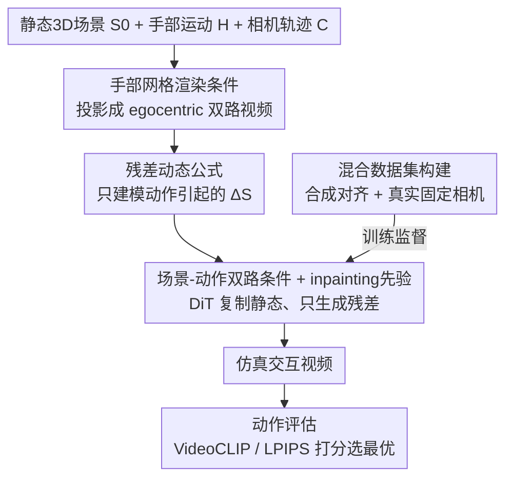

# Dexterous World Models

**会议**: CVPR 2026  
**论文**: [CVF Open Access](https://openaccess.thecvf.com/content/CVPR2026/html/Kim_Dexterous_World_Models_CVPR_2026_paper.html)  
**代码**: https://snuvclab.github.io/dwm/ (项目页)  
**领域**: 机器人/具身智能  
**关键词**: 世界模型, 灵巧操作, 视频扩散, 第一人称, 残差动态  

## 一句话总结
给定一个静态 3D 场景和一段第一人称的灵巧手部运动，DWM 用「场景-动作」条件化的视频扩散模型只生成手部操作引起的残差视觉变化（抓取、开门、移物），同时保持相机运动与未受影响区域不变，让原本只能导航/看的数字孪生第一次"动"起来，并能当作可仿真的视觉世界模型来评估候选动作。

## 研究背景与动机
**领域现状**：3D 重建已经能从日常环境轻松造出逼真的"数字孪生"，但这些孪生体基本是静态的——只支持导航和新视角合成，缺乏具身交互能力。要让它们变成真正的世界模型，需要：维持场景静态部分的一致表示、接受一个动作指令、并生成动作引起的动态变化同时忠实保留未改变的区域。

**现有痛点**：把视频生成模型直接拿来当世界模型有三个具体缺陷。其一，主流视频模型试图同时合成整个场景（静态+动态），很难聚焦于动作真正引起的那部分变化；其二，大多数视频模型只接受**文本**作为"动作输入"，而文本天生不精确，没法刻画手的姿态、细粒度时序这些对真实操作至关重要的信息；其三，很多世界模型把**相机运动**当作动作输入，但相机运动并不是世界动态的主要来源——日常场景里最大的变化来自灵巧手交互（抓握、操作物体），而这恰恰被现有方法忽略了。

**核心矛盾**：当模型被要求同时生成静态场景 $S_0$ 和动态变化 $\Delta S$ 时，场景生成与动态生成耦合在一起，破坏了因果一致性——模型容易在本该不变的地方乱改，反而难以准确建模真正想要的状态变化。

**本文目标**：构造一个既能维持已知静态环境、又能接受灵巧手动作输入、并只生成交互引起动态的世界模型。

**切入角度**：人类也是先感知并内化静态世界、再对它施加动作。所以作者**显式地把静态场景渲染作为输入提供给模型**，配上第一人称视角下捕获的手部轨迹——这种第一人称设定天然捕捉了用户的注意力焦点和操作时的手部运动，为交互提供了内在的 grounding。

**核心 idea**：把任务从"重建整段视频"重新表述为"只学习手部动作引起的残差动态 $\Delta V$"，并用一个预训练的视频 inpainting 模型当近似恒等映射来初始化，让扩散过程把精力全花在生成交互变化上。

## 方法详解

### 整体框架
DWM 要解决的问题是：给定静态 3D 场景 $S_0$ 和一段具身动作 $A_{1:F}=\{C_{1:F}, H_{1:F}\}$（相机轨迹 $C$ + 手部操作轨迹 $H$），生成一段时序连贯、展示合理人-场景交互的视频。整体转法是：先把静态场景和手部运动都**投影成第一人称视角下的两路视频**（静态场景视频 + 手网格视频），再喂给一个从 inpainting 模型初始化的 DiT 视频扩散模型，让它在保持静态外观和相机运动的前提下，**只生成操作引起的残差动态**，最后解码出仿真交互视频。这个仿真器还能反过来用：给一批候选动作各跑一遍仿真，按结果和目标的接近程度打分，从而做基于仿真的动作选择。

### 关键设计

**1. 残差动态公式：把静态场景从生成中剥离出来，只建模动作引起的变化**

世界模型的一般形式是 $p_\theta(S_{1:F}\mid S_0, A_{1:F})$，作者把每个未来状态写成 $S_t = S_0 + \Delta S_t$，其中 $\Delta S_t$ 是相对初始静态场景的动作残差变化。痛点在于：以往把人体动作纳入的工作（如 $p_\theta(V_{1:F}\mid I_0, A_{1:F}=\{C, H\})$）只给一张初始帧 $I_0$，模型必须把场景外观和动态变化作为一个**纠缠的表示**一起合成出来，因果链断裂。DWM 的做法是把完整静态场景 $S_0$ 直接作为条件喂进去，学的是

$$p_\theta(V_{1:F}\mid S_0, A_{1:F}) = \int_{\Delta S} p^d_\theta(\Delta S_{1:F}\mid S_0, H_{1:F})\, p^o_\theta(V_{1:F}\mid S_0, \Delta S_{1:F}, C_{1:F})\, d\Delta S$$

这里动态模型 $p^d_\theta$ **只产生**手部动作 $H$ 引起的动态变化 $\Delta S$（相机运动 $C$ 不影响世界动态，被丢掉），观测模型 $p^o_\theta$ 再把演化中的世界 $(S_0, \Delta S)$ 沿相机轨迹 $C$ 渲染成视觉帧。这定义了一条清晰的因果过程：**操作驱动世界的状态转移，相机轨迹决定这些变化怎么被看到**。和旧公式的本质区别是动态模型不再需要把 $S_0$ 当输出生成出来，避免了"乱改静态世界"。

**2. 场景-动作双路条件 + inpainting 先验：用近似恒等映射稳住静态、只学残差**

在渲染空间里残差被进一步写成 $V_{1:F} = \Pi(S_0; C_{1:F}) + \Delta V_{1:F}$，即"静态场景渲染 + 动作残差"。关键观察是：当 $\Delta S_t$ 只影响一小块区域时，$\Delta V_t$ 也很小，结果帧应当接近静态渲染。所以一个理想模型既要有**保留静态区域的恒等映射能力**，又要有**对动态区域的强生成先验**。作者据此把一个预训练的视频 inpainting 扩散模型 [1] 重新诠释为"带生成先验的恒等函数"并用它初始化 DWM——inpainting 模型在掩码全为 1（所有像素已知）时几乎原样复现输入视频，但它并非平凡恒等，而是学过空间结构、时序平滑、外观连续性，因此即便在全观测输入下也有强生成先验。用静态场景视频作输入就建立了一个"保留相机运动和场景外观、不引入交互"的基线输出，再叠加手部条件，扩散过程就被引导去**只合成操作引起的残差** $\Delta V$。模型在视频 VAE 的隐空间里工作，把静态场景隐变量 $c_s$ 和手网格隐变量 $c_h$ 沿通道维与噪声隐变量 $z_t$ 拼接后送入 DiT $\epsilon_\theta$，训练目标就是标准的隐扩散损失 $L_{LDM}=\mathbb{E}_{z_0,t,\epsilon}\big[\lVert \epsilon - \epsilon_\theta(z_t, t\mid c_s, c_h)\rVert_2^2\big]$。

**3. 手部网格渲染条件：用像素对齐的网格而非文本/掩码来精确刻画手-物接触**

文本动作输入太模糊、相机运动不是动态来源，所以 DWM 把动作信号定为**第一人称下渲染的手网格视频** $\Pi(H_{1:F}; C_{1:F})$，它在同一相机视角下同时编码了手的几何与运动线索。消融里作者对比了三种手部条件方式：参数注入（AdaLN，把 MANO 姿态参数经自适应层归一化注入，分 global 和 per-frame 两种）缺乏像素对齐，难复现细节接触；手部二值掩码虽有像素对齐，但只给位置、缺精确的关节铰接信息；而渲染手网格**显式提供了关节铰接和接触几何**，让模型能直接把手的运动和场景外观变化关联起来——这种显式且空间一致的条件带来了明显提升（见消融）。对真实固定相机视频，手网格用 HaMeR [33] 预测得到。

**4. 混合交互视频数据集：合成提供精确对齐、真实补足物理多样性**

训练需要三元组：(i) 沿相机轨迹渲染的静态场景视频、(ii) 第一人称手网格视频、(iii) 对应的交互视频，而现实里很难在完全对齐的第一人称轨迹下同时拍到静态场景和动态交互。作者用**两类数据拼接**解决：① 合成数据用 TRUMANS [20]（含 SMPL-X 全身姿态控制，把虚拟相机刚性绑在头关节模拟第一人称），对每段动作渲染三路同步输出——交互视频、回放同一轨迹但不改物体状态的静态场景视频、只渲染分割出的手面的手网格视频，保证严格时空对齐；② 真实数据用固定相机的 TASTE-Rob [58]，此时静态场景视频时不变，$\Pi(S_0; C_t)=\Pi(S_0; C_0)=V_0$，于是把首帧 $V_0$ 重复 $F$ 帧就构造出与交互视频视角完全对齐的静态视频，再配 HaMeR 预测的手网格即得三元组。合成给精确成对监督和多样相机运动，真实补足流体、形变等高保真物理动态。此外作者另用 Aria 眼镜（内置 SLAM 给毫米级轨迹）采集了 60 段动态第一人称真实样本专门用于评估泛化。

### 损失函数 / 训练策略
训练就是上面的隐扩散损失 $L_{LDM}$，条件隐变量沿通道维拼接进 DiT；推理时迭代去噪得到 $\hat z_0$ 再由 VAE 解码成交互视频。每个测试样本用 3 个随机种子生成 3 段视频取平均。

## 实验关键数据

构建了 144 样本基准：合成动态相机（Synthetic Dynamic，48 段来自 TRUMANS 未训练序列）、真实静态相机（Real-World Static，48 段来自 TASTE-Rob）、真实动态相机（Real-World Dynamic，48 段来自 Aria 自采）。指标用感知相似度 LPIPS / DreamSim（越低越好）和像素质量 PSNR / SSIM（越高越好）。

### 主实验
| 设置 | 指标 | CVX SDEdit | CVX-Fun Fine-tuned | InterDyn | **本文(Ours)** |
|------|------|-----------|--------------------|----------|----------------|
| 合成·动态相机 | PSNR↑ / SSIM↑ | 19.42 / 0.675 | 20.54 / 0.767 | – | **25.03 / 0.844** |
| 合成·动态相机 | LPIPS↓ / DreamSim↓ | 0.464 / 0.257 | 0.370 / 0.175 | – | **0.289 / 0.086** |
| 真实·静态相机 | PSNR↑ / SSIM↑ | 16.19 / 0.586 | 18.95 / 0.780 | 19.33 / 0.744 | **21.55 / 0.816** |
| 真实·静态相机 | LPIPS↓ / DreamSim↓ | 0.446 / 0.224 | 0.265 / 0.089 | 0.240 / 0.135 | **0.227 / 0.057** |
| 真实·动态相机 | PSNR↑ / SSIM↑ | 19.15 / 0.507 | 18.13 / 0.472 | – | **21.65 / 0.550** |
| 真实·动态相机 | LPIPS↓ / DreamSim↓ | 0.676 / 0.492 | 0.591 / 0.328 | – | **0.557 / 0.225** |

DWM 在**所有设置、所有指标**上都最优。真实动态相机场景在训练时完全没见过（甚至没有任何"开窗户"类训练样本），DWM 仍能生成连贯仿真，泛化能力很强。基线对比中：CVX-SDEdit 难以在保持外观的同时生成有意义的交互；CVX-Fun Fine-tuned 常常作用到错误目标、幻觉出物体；InterDyn 的手能和掩码对齐但建不出物体动态。

### 消融实验
| 配置 | 真实静态 LPIPS↓ | 真实静态 DreamSim↓ | 说明 |
|------|----------------|---------------------|------|
| 仅 TRUMANS（合成） | 0.304 | 0.124 | 只用合成数据训练 |
| **Ours（混合）** | **0.227** | **0.057** | 加入真实固定相机数据 |

| 手部条件方式 | PSNR↑ | SSIM↑ | LPIPS↓ | DreamSim↓ |
|--------------|-------|-------|--------|-----------|
| AdaLN (global) | 21.96 | 0.806 | 0.306 | 0.127 |
| AdaLN (per-frame) | 22.79 | 0.827 | 0.288 | 0.110 |
| Hand Mask | 22.88 | 0.797 | 0.338 | 0.137 |
| **Ours（手网格渲染）** | **24.15** | **0.834** | 0.304 | **0.094** |

### 关键发现
- **混合数据集的价值被真实数据放大**：加入 TASTE-Rob 真实固定相机数据后，不仅合成测试集变好，连含导航+精细操作的 Aria 动态相机真实数据也大幅提升（真实静态 LPIPS 0.304→0.227）。值得注意的是真实训练数据只有静态相机交互，却带来了对动态相机复杂场景的强泛化。
- **手部条件方式中"渲染网格"明显最优**：参数注入（AdaLN）缺像素对齐、掩码缺关节信息，手网格因显式编码铰接与接触几何，DreamSim 从 0.110~0.137 降到 0.094。
- **导航-操作可解耦**：不给手部条件时 DWM 退化为纯导航器；加上手部条件后才生成操作引起的动态——这种解耦说明残差建模确实把"看"和"动手"分开了。
- **可当动作评估器**：对多个候选动作各仿真一遍，文本目标用 VideoCLIP 余弦相似度 $s^{(i)}_{text}=\text{sim}_{VC}(V^{(i)}_{1:F}, g_{text})$、图像目标用 $s^{(i)}_{img}=-\text{LPIPS}(I^{(i)}_F, I_{goal})$ 打分，取最高分动作 $A^*=\arg\max_{A^{(i)}} s^{(i)}$，无需显式奖励函数或真机试错。

## 亮点与洞察
- **"提供静态场景"这一步是整篇的支点**：把 $S_0$ 当条件输入而非让模型生成，直接斩断了场景生成与动态生成的耦合，是因果一致性的关键，也让"只学残差"这个轻量目标成立。
- **把 inpainting 模型重诠释为"带生成先验的恒等函数"很巧妙**：全掩码下 inpainting 近似复现输入，正好提供了"保静态"的能力，又自带时空生成先验，省去从零学恒等映射的麻烦——这个 trick 可迁移到任何"输出≈输入+小残差"的视频编辑/世界建模任务。
- **用固定相机视频"假装"成对数据**：固定相机下静态视频时不变，重复首帧就能造出对齐的静态-交互对，绕开了"必须分别拍静态场景和交互"的采集难题，是把现成数据集纳入训练的聪明工程。
- **手网格 vs 掩码 vs 参数**的对比给出了清晰结论：像素对齐 + 显式几何 = 更好的接触建模，这对一切"用手/工具驱动场景变化"的生成任务都有参考价值。

## 局限与展望
- **依赖已知静态 3D 场景**：方法假设 $S_0$ 已重建好（真实评估甚至要先用 Aria 扫场景重建 3D Gaussian），对未重建/动态背景的开放环境不适用。
- **真实成对训练数据稀缺**：动态第一人称下的真实成对数据"难以大规模获取"，作者只能靠合成对齐 + 固定相机近似拼凑，真实动态相机数据仅用于评估（60 段）而非训练，⚠️真实泛化的上限仍待更大规模验证。
- **物理只是"看起来合理"**：模型生成的是视觉上 plausible 的动态，并不显式建模接触力/articulation 结构，复杂铰接或长时序因果（counterfactual）是否始终物理正确存疑。
- **动作评估靠 VideoCLIP/LPIPS 代理**：用感知/语义相似度近似"目标达成"，在语义细微或目标图与仿真视角不一致时可能误判，离真正的奖励建模还有距离。

## 相关工作与启发
- **vs 导航类视觉世界模型（如把相机运动当动作的 [6,63]）**：它们假设 $\Delta S=\emptyset$、只做新视角预测；DWM 认为相机运动不是动态主因，把灵巧手交互引入动作空间，建模真正的状态变化。
- **vs 人体动作驱动的动态场景模型 [5,40]**：它们走 image-to-video、从单帧幻觉出整个场景与演化，背景合成与动作动态纠缠；DWM 显式提供静态场景、只生成残差，因果更干净。
- **vs 机器臂操作世界模型 [13,19,62]**：它们通常假设固定相机视角，无法处理需要"导航+操作"的任务；DWM 的第一人称设定天然支持运动+操作的联合建模。
- **vs InterDyn [2]**：同样注入手部信息（掩码经 ControlNet），但只对齐手、建不出物体动态；DWM 用手网格渲染条件直接关联手运动与场景外观变化。

## 评分
- 新颖性: ⭐⭐⭐⭐⭐ 首次把灵巧手交互+静态场景显式分离引入视频扩散世界模型，"只学残差+inpainting 先验"的表述很干净
- 实验充分度: ⭐⭐⭐⭐ 三类数据全面对比、消融到位，但缺真机/下游控制闭环验证，动态真实数据规模偏小
- 写作质量: ⭐⭐⭐⭐⭐ 公式推导把"为什么要分离静态"讲得非常清楚，动机层层递进
- 价值: ⭐⭐⭐⭐⭐ 把静态数字孪生推向可交互仿真，对具身智能、动作评估、世界模型都有启发

<!-- RELATED:START -->

## 相关论文

- [\[CVPR 2026\] PointWorld: Scaling 3D World Models for In-The-Wild Robotic Manipulation](pointworld_scaling_3d_world_models_for_in-the-wild_robotic_manipulation.md)
- [\[CVPR 2026\] Chain of World: World Model Thinking in Latent Motion (CoWVLA)](chain_of_world_world_model_thinking_in_latent_motion.md)
- [\[CVPR 2026\] AdaDexTrack: Dynamic Modulation for Adaptive and Generalizable Dexterous Manipulation Tracking](adadextrack_dynamic_modulation_for_adaptive_and_generalizable_dexterous_manipula.md)
- [\[CVPR 2026\] Motus: A Unified Latent Action World Model](motus_a_unified_latent_action_world_model.md)
- [\[CVPR 2026\] VideoWorld 2: Learning Transferable Knowledge from Real-world Videos](videoworld_2_learning_transferable_knowledge_from_real-world_videos.md)

<!-- RELATED:END -->
