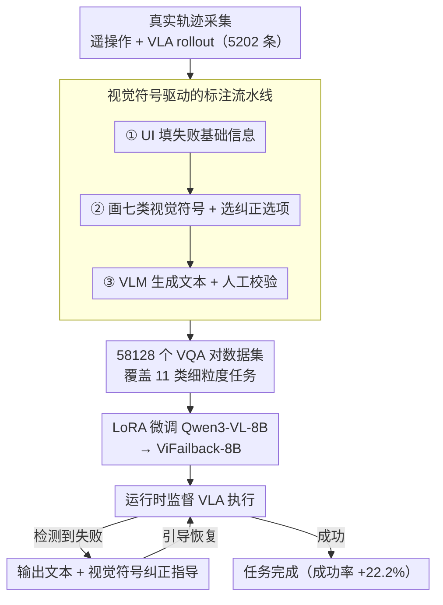

# Diagnose, Correct, and Learn from Manipulation Failures via Visual Symbols

**会议**: CVPR 2026  
**arXiv**: [2512.02787](https://arxiv.org/abs/2512.02787)  
**代码**: [项目页面](https://vifailback.github.io/)  
**领域**: 机器人  
**关键词**: 机器人操作失败, 视觉符号, VLM失败诊断, VLA恢复, 真实世界数据集

## 一句话总结
提出 ViFailback 框架，利用可视化符号（箭头、准星、标签等）高效标注真实世界机器人操作失败，构建 58,128 个 VQA 对的数据集，并训练 ViFailback-8B VLM 实现失败诊断和视觉+文本纠正指导，集成到 VLA 后实现 22.2% 的任务成功率提升。

## 研究背景与动机
**领域现状**: VLA 模型在机器人操作中表现优秀但在 OOD 场景下不可避免地失败。VLM 被用于任务规划和推理，但在**失败诊断和纠正**上能力不足。

**现有痛点**: (1) 现有失败数据集主要在仿真中通过注入扰动生成，受 sim-to-real gap 限制；(2) 真实世界失败数据的标注极其耗时，尤其是抽象类别（任务规划错误、失败原因）需要大量文本描述。

**核心矛盾**: 真实世界失败数据珍贵但标注成本高；仿真数据便宜但不够真实。如何高效利用真实失败数据？

**本文目标**: 建立一个低成本的真实世界机器人失败诊断和纠正框架，包括高效标注方法、数据集和训练好的 VLM。

**切入角度**: 用可视化符号（如彩色箭头表示运动方向、准星表示目标位置）直接在视频帧上标注，结合 VLM 自动生成文本描述，大幅降低标注成本。

**核心 idea**: 视觉符号作为中间表示，既便于人类快速标注（鼠标拖拽），又为 VLM 提供结构化的纠正指导信号。

## 方法详解

### 整体框架
这篇论文要解决的是「真实世界机器人操作失败」这个数据稀缺又难标注的难题：VLA 在分布外场景里总会失败，但要让 VLM 学会诊断"哪里错了、怎么改"，就得有大量带标注的真实失败数据，而抽象类别（任务规划错误、失败原因）靠纯文本描述标注极慢。ViFailback 的思路是把整条链路串成一个闭环——先用遥操作和 VLA rollout 收集 5,202 条真实轨迹，再用「视觉符号 + VLM 辅助文本」的标注流水线把这些轨迹标注成 58,128 个 VQA 对，接着在这批数据上微调 Qwen3-VL-8B 得到 ViFailback-8B，最后把它当作 VLA 运行时的外部监督器，发现失败就同时给出文本和视觉符号两路纠正指导、引导机器人恢复。整条链路的关键在于「视觉符号」这个中间表示：它既能让标注者用鼠标拖拽快速画出来，又能反过来给机器人提供结构化的动作指令。

### 关键设计

**1. 七类视觉符号体系：把 3D 纠正动作压进一张 2D 帧**

真实失败标注最贵的部分是用文本描述「该往哪个方向修」，而 ViFailback 的破局点是直接在视频帧上画符号。符号分三组共七类：运动符号用彩色直线箭头编码平移方向（红=前后 X 轴、绿=左右 Y 轴、蓝=上下 Z 轴），半圆箭头表示旋转；空间关系符号用双准星加虚线表示对齐、单准星标出目标区域；状态符号则用 ON/OFF 标签表示夹爪开合、禁止图标表示停止、倒带图标表示回退。这套设计里最巧的一笔是用颜色给箭头编码三维方向——一张二维帧本来表达不了"往机器人前方推"这种 3D 运动，颜色约定把这个维度补了回来。七类符号合起来恰好覆盖了操作纠正需要的全部基本动作原语，因此标注者画几个符号就替代了过去几段文字描述，标注成本大幅下降，而符号本身又是机器人可直接消费的指令。

**2. 视觉符号驱动的标注流水线：把真实失败数据的标注成本压到可负担**

真实世界失败数据珍贵但标注极慢，尤其是任务规划错误、失败原因这类抽象类别靠纯文本描述要写很多字。ViFailback 先用遥操作和 $\pi_{0.5}$ rollout 采集 5,202 条真实轨迹（657 成功 + 4,545 失败），再把标注拆成三步流水线：① 用 UI 控件填失败检测、关键帧、失败类型等基础信息；② 在视频帧上拖拽画出七类视觉符号、并从预设选项里选纠正动作；③ 让 VLM（Qwen2.5-Max 分解子任务、Qwen3-VL-235B 生成高级描述）自动补全文本描述，再由人工校验。这样把最贵的"文字描述纠正方向"换成"画几个符号 + VLM 补文字"，最终低成本产出 58,128 个 VQA 对。关键在于：符号既是标注者的快捷输入，又是 VLM 训练的结构化标签，一份标注同时服务标注效率和模型监督信号。

**3. 细粒度任务定义与 ViFailback-Bench：把"诊断+纠正"拆成可单独评测的能力**

如果只笼统问"这次失败怎么回事"，既难标注也难评估到底是模型哪一环能力不行。ViFailback 把能力拆成 11 类 VQA 任务：失败诊断细分为检测、关键帧定位、子任务定位、类型识别、原因分析五项，纠正指导细分为低级文本、高级文本、视觉符号指导三项。配套的 ViFailback-Bench（500 条轨迹 × 22 个任务，含 5 个完全分布外任务）又把测试分成 Lite 和 Hard 两档：Lite 是闭合题（选择/判断），测最基础的失败诊断和低级纠正是否准；Hard 是开放题，用 CoT 格式考察更难的失败推理和高级策略规划。这样拆的好处是：训练数据能针对每个能力维度分别覆盖，评测又能精确定位模型短板——闭合题答得好只说明模型识别得准，开放题才暴露它是否真"想明白了为什么会失败"。

**4. 闭环失败纠正：把 ViFailback-8B 当成 VLA 的运行时监督器**

前面三步产出的数据和模型，最终要落到"让机器人少失败"上。ViFailback 在这批数据上用 LoRA 微调 Qwen3-VL-8B 得到 ViFailback-8B，并把它接进 VLA 的执行回路当外部监督器：VLA 正常执行任务，ViFailback-8B 在旁监控，一旦检测到失败就同时输出文本纠正和视觉符号纠正两路指导，引导 VLA 调整动作、从失败中恢复。和 TracVLA 这类只 overlay 2D 轨迹、无法修订的方法相比，视觉符号纠正是机器人可直接消费的实时指令。真实机器人实验里这个闭环把任务成功率提升了 22.2%，证明"诊断→纠正"不只是离线评测指标，而能在线兜住 VLA 的分布外失败。

### 损失函数 / 训练策略
- 使用 LoRA (rank=32, α=64) 微调 Qwen3-VL-8B，1 epoch，lr=1e-5
- 解冻 LLM backbone 和 adapter 参数
- DeepSpeed ZeRO Stage 2，4× NVIDIA Hopper GPU
- 温度=0，最大生成长度 2048 tokens

## 实验关键数据

### 主实验（ViFailback-Bench Overall Accuracy %）

| 模型 | Lite↑ | Hard↑ | Average↑ |
|------|-------|-------|---------|
| Qwen3-VL-8B (base) | 38.33 | 33.04 | 35.92 |
| GPT-4o | 48.21 | 40.00 | 44.47 |
| Gemini-2.5-Pro | 54.64 | 32.45 | 44.54 |
| RoboBrain2.0-32B | 49.92 | 29.22 | 40.50 |
| **ViFailback-8B (Ours)** | **强于所有** | **强于所有** | **显著提升** |

### 消融实验（真实世界机器人实验）

| 配置 | 成功率提升 | 说明 |
|------|----------|------|
| VLA alone | baseline | 无外部监督 |
| **VLA + ViFailback-8B** | **+22.2%** | 外部监督器介入恢复失败 |

### 关键发现
- ViFailback-8B 在所有 11 项 VQA 任务上均大幅超越基础 Qwen3-VL-8B，证明数据集的训练有效性
- 即便是 GPT-4o 和 Gemini-2.5-Pro 等顶级闭源模型在机器人失败分析上也表现不佳，凸显了专用数据和训练的必要性
- 视觉符号输出不仅是直观的人类可读表示，还能直接指导 VLA 调整动作
- 4 类失败类型中，gripper 6d-pose 错误最为常见，任务规划错误占比也显著

## 亮点与洞察
- **视觉符号作为中间表示**是核心创新：既降低标注成本又为机器人提供结构化动作指导。用颜色编码 3D 方向的箭头设计巧妙。
- **真实世界数据 > 仿真数据**: 5,202 条真实轨迹的价值远超大规模仿真数据。
- **从诊断到恢复的闭环**: 不仅能分析失败，还能通过视觉符号引导 VLA 恢复，22.2% 的成功率提升证明了实际价值。
- **ViFailback-Bench** 填补了机器人 VLM 评估中"失败推理"维度的空白。

## 局限与展望
- 当前使用 ALOHA 双臂平台收集，需要验证其他机器人平台的泛化性
- 100 个任务虽多样但可能仍不足以覆盖所有操作技能
- VLA 的 instruction-following 能力是瓶颈——即使给出正确纠正，VLA 也可能无法精确执行
- 视觉符号的绘制仍需人工参与（虽然比纯文本标注快得多）
- 未探索在线学习——从失败中实时更新策略
- 7 类视觉符号的覆盖度是否足够需更多验证
- 失败检测的实时性（视频处理延迟）未充分讨论

## 相关工作与启发
- 与 YAY（人在回路中纠正）相比：ViFailback 通过视觉符号降低了人工参与的复杂度。
- 与仿真失败数据集（AHA, RACER）相比：真实世界数据避免了 sim-to-real gap。
- 与 Robo2VLM、ManipBench 的区别：后者评估"做什么/怎么做"，ViFailback 评估"哪里错了/为什么错"。
- 视觉符号思路可推广到其他人机交互场景（如远程操作指导）。
- TracVLA 等轨迹条件化模型 overlay 2D 轨迹但无法修订；ViFailback 提供实时纠正

## 技术细节补充
- **数据**: 4,995 遥操作 + 207 条 $\pi_{0.5}$ rollout，657 成功 + 4,545 失败
- **4 类失败**: 任务规划 / Gripper 6d-pose / Gripper 状态 / 人类干预
- **标注 Stage**: 1.UI控件填基础信息 → 2.选纠正选项+画符号 → 3.VLM生成文本+人工校验
- **VLM辅助**: Qwen2.5-Max 分解子任务，Qwen3-VL-235B 生成高级描述
- **平台**: ALOHA 双臂，100 个任务
- **Bench**: 500 轨迹 × 22 任务，5 个完全 OOD
- **评估**: 闭合题准确率 + 开放题 GPT-4o 三维度评分(语义/完整/等价)
- **LoRA 训练**: rank=32, α=64, 1 epoch, lr=1e-5, DeepSpeed ZeRO Stage 2
- **颜色编码**: 红=前后(X轴), 绿=左右(Y轴), 蓝=上下(Z轴)，用 2D 箭头表达 3D 运动

## 评分
- 新颖性: ⭐⭐⭐⭐⭐ 视觉符号标注框架 + 真实世界失败数据集 + 诊断-纠正闭环，贡献全面
- 实验充分度: ⭐⭐⭐⭐⭐ 16 个模型 benchmark + 真实机器人恢复实验
- 写作质量: ⭐⭐⭐⭐ 框架图清晰，任务定义完备
- 价值: ⭐⭐⭐⭐⭐ 对机器人从失败中学习这一关键问题提供了实用的解决方案

<!-- RELATED:START -->

## 相关论文

- [\[CVPR 2026\] Semantic Audio-Visual Navigation in Continuous Environments](semantic_audio-visual_navigation_in_continuous_environments.md)
- [\[CVPR 2026\] AVA-VLA: Improving Vision-Language-Action models with Active Visual Attention](ava_vla_improving_vision_language_action_models_with_active_visual_attention.md)
- [\[CVPR 2026\] STRNet: Visual Navigation with Spatio-Temporal Representation through Dynamic Graph Aggregation](strnet_visual_navigation_with_spatio-temporal_representation_through_dynamic_gra.md)
- [\[CVPR 2025\] Mitigating the Human-Robot Domain Discrepancy in Visual Pre-training for Robotic Manipulation](../../CVPR2025/robotics/mitigating_the_human-robot_domain_discrepancy_in_visual_pre-training_for_robotic.md)
- [\[ICML 2025\] SENSEI: Semantic Exploration Guided by Foundation Models to Learn Versatile World Models](../../ICML2025/robotics/sensei_semantic_exploration_guided_by_foundation_models_to_learn_versatile_world.md)

<!-- RELATED:END -->
