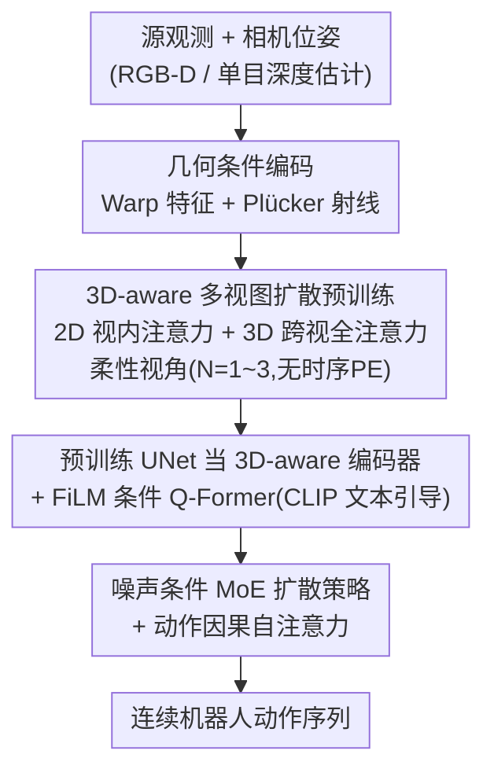

# DiffuView: Multi-View Diffusion Pretraining for 3D-Aware Robotic Manipulation

**会议**: CVPR 2026  
**论文**: [CVF Open Access](https://openaccess.thecvf.com/content/CVPR2026/html/Zhang_DiffuView_Multi-View_Diffusion_Pretraining_for_3D_Aware_Robotic_Manipulation_CVPR_2026_paper.html)  
**代码**: 未公开  
**领域**: 机器人 / 具身智能  
**关键词**: 多视图扩散预训练, 视觉表征, 模仿学习, 视角鲁棒性, 扩散策略

## 一句话总结
DiffuView 把"多视图扩散生成"当作一种 3D 一致的视觉预训练任务——让网络学会"给定源视角观测和相机位姿、生成目标视角"，从而隐式恢复场景几何；再把预训练好的扩散 UNet 当作视觉骨干接到扩散动作策略上，使机械臂在相机视角变化下仍能稳定操作，在视角偏移场景下成功率比现有方法高近 20%。

## 研究背景与动机
**领域现状**：机器人视觉操作（visuomotor control）的主流是从视觉观测里抽特征再生成动作。由于带"视觉+动作"配对标注的大规模数据稀缺，近年大量工作转向用自监督 / 大规模视觉预训练拿到可迁移表征，再迁到下游策略学习。

**现有痛点**：现有预训练范式有两条路，但都学不到"跨视角统一的 3D 表征"。一条是 MAE 类（MVP、3D-MVP、LIFT3D、EmbodiedMAE），靠重建被遮挡区域学特征，缺乏全局 3D 一致性；另一条是神经渲染类（GNFactor、SPA、PDFactor），把 2D 特征抬升到 triplane / 体素 / 高斯等 3D 隐空间，但需要逐场景优化、且依然难以跨不同视角和传感器配置泛化。更要命的是，绝大多数方法默认"训练和推理用完全相同的固定相机配置"，相机一动就崩。

**核心矛盾**：操作任务本质需要 3D 空间结构理解，但纯 2D 编码器没有 3D 感知；而显式 3D 表征（渲染/重建）又被绑死在特定场景和视角上，无法形成一个"换个相机也认得"的统一表征。

**本文目标**：学一种跨视角、跨传感器都一致的 3D-aware 视觉表征，并让下游策略在新视角下仍鲁棒；同时部署时不要求多相机，单视角也能用。

**切入角度**：作者观察到多视图扩散模型（Free3D、CAT3D、ViewCrafter、Bolt3D 等）在 3D 感知的新视角合成上已经非常强——能从源视角"脑补"出几何一致的目标视角。既然生成目标视角必须隐式建模跨视角的几何对应关系，那它的内部表征天然就是 3D 一致的，正好可以拿来做视角鲁棒的视觉骨干。

**核心 idea**：用"条件多视图生成"$p_\theta(\hat O_j \mid O_i, P_i, P_j)$ 作为预训练任务来逼网络学出 3D 一致表征，再把这个扩散骨干接到扩散动作策略上做模仿学习。

## 方法详解

### 整体框架
DiffuView 是一个两阶段框架。**第一阶段**做多视图扩散预训练：给定源观测和相机位姿，让扩散模型生成目标视角，逼它隐式恢复场景几何、学到跨视角对齐的 3D 一致 latent。**第二阶段**做策略学习：把预训练好的扩散 UNet 复用为 3D-aware 视觉编码器，抽出的特征经 FiLM 条件的 Q-Former 压成任务相关 token，再喂给一个带噪声条件 MoE 的扩散策略生成连续动作，用模仿学习训练。关键巧思是：训练时用多视图信息（源视角数 $N$ 随机取 1~3），但**部署时只需单视角**观测。

### 关键设计

**1. 几何条件编码：用 warp 特征和 Plücker 射线把"相机几何"塞进生成过程**

要让扩散模型生成几何正确的目标视角，光给它源图像不够，得显式告诉它"两个相机之间的几何关系"。DiffuView 做两件事。其一是 **warp 特征**：给定源观测 $O_i=\{I_i, D_i\}$、位姿 $P_i$、内参 $K_i$，先反投影出 3D 点，再重投影到目标相机得到 warp 后的 RGB 和深度 $(\tilde I_{i\rightarrow j}, \tilde D_{i\rightarrow j}) = \mathrm{Warp}(I_i, D_i, P_i, P_j, K_i, K_j)$；RGB-D 相机直接用实测深度，纯 RGB 则用 metric depth 估计网络补一个 $\hat D_i$ 当几何条件。其二是 **dense Plücker 射线嵌入**：对每个像素 $u(x,y)$ 算出视线方向 $d_{i,xy}=R_i^T K_i^{-1}u$ 和原点，用 Plücker 坐标表示

$$\mathbf r_{i,xy} = \langle \mathbf d_{i,xy}, \mathbf m_{i,xy}\rangle, \qquad \mathbf m_{i,xy}=\mathbf o_i \times \mathbf d_{i,xy},$$

拼成 $\mathbf e_{i,xy}=[\mathbf d_{i,xy}; \mathbf m_{i,xy}]\in\mathbb R^6$，整图形成 $\mathbf E_i\in\mathbb R^{6\times H\times W}$ 的逐像素几何相机上下文。这两类几何信息经一个轻量卷积编码器后**加到 VAE latent 上**：$z_\text{source}=\mathcal E(I_i)+\mathrm{CNN}(I_i, D_i, \mathbf E_i)$，$z_\text{target}=\mathcal E(I_j)+\mathrm{CNN}(\tilde I_{i\rightarrow j}, \tilde D_{i\rightarrow j}, \mathbf E_j)$。这样网络在去噪时始终"知道"相机摆在哪、像素对应哪条射线，才能学出真正几何一致的表征——消融里去掉 Plücker 嵌入成功率从 89.2 掉到 76.2，证明这条几何线索很关键。

**2. 3D-aware 多视图扩散与柔性视角：用双层注意力捕捉跨视几何，又不被固定视角数绑死**

预训练的目标是条件生成 $p_\theta(\hat O_j\mid O_i, P_i, P_j)$：训练时往目标视角的 VAE latent $\mathcal E(I_j)$ 加高斯噪声，模型靠源视角条件把它去噪还原。网络内部用两种注意力：**2D 空间注意力**在每个视角内部捕捉视内空间依赖，**3D 全注意力**跨所有视角推理几何对应关系——后者才是 3D 一致性的来源。模型总视角数 $N+M=8$（源 $N$、目标 $M$），但作者**故意不固定 $N$**，训练中让 $N$ 在 1~3 间随机变化，并且**刻意去掉时序位置编码**，防止网络去记"绝对视角位置"。好处是模型不被训练时的固定视角数绑住，推理时能自然外推到任意 $N$、$M$——这正是它"训练多视角、部署单视角"以及在 Mv-Bench 上跨视角泛化的根基。

**3. 预训练 UNet 当 3D-aware 编码器 + FiLM 条件 Q-Former：把生成模型转成任务相关的视觉接口**

预训练完不做生成，而是把扩散 UNet 复用成视觉编码器。借鉴 VPP 的思路，推理时**只跑一次扩散前向**（而非完整去噪），从 UNet 上采样层抽多尺度特征——这些层保留了细粒度的几何与语义信息。抽出的特征交给一个 **FiLM 条件的 Q-Former** 压成紧凑的任务相关视觉 token $z_\text{obs}$，其中 FiLM 调制由 CLIP 文本编码器的 end-of-text(EoT) token 引导，确保视觉特征被语言指令的语义意图"调色"。这一步是预训练视觉表征和下游动作学习之间的统一接口：既保住了 3D 一致性，又注入了"这次要干什么"的任务语义。消融显示去掉 FiLM 语言条件，成功率从 89.2 掉到 73.3，说明任务相关调制对对齐视觉表征和策略很重要。

**4. 噪声条件 MoE 扩散策略 + 动作因果自注意力：在去噪动作头里同时省算力、保时序一致**

动作头是一个扩散策略 $\varepsilon_\psi$，条件是观测 token $z_\text{obs}$ 和语言 token $l_\text{emb}$。前向加噪 $\mathbf a^{(t)}=\sqrt{\bar\alpha_t}\,\mathbf a_0+\sqrt{1-\bar\alpha_t}\,\boldsymbol\varepsilon$，训练目标是预测噪声

$$\mathcal L_\text{policy}=\mathbb E_{(\mathbf a_0, z_\text{obs}, l), t, \boldsymbol\varepsilon}\Big[\big\|\boldsymbol\varepsilon-\boldsymbol\varepsilon_\psi(\mathbf a^{(t)}, t, z_\text{obs}, l_\text{emb})\big\|^2\Big].$$

观测和语言嵌入通过 cross-attention 注入每个扩散 transformer block，并用 RMSNorm 替换 LayerNorm 稳训练。在此之上有两个改进：一是 **动作因果自注意力**，用因果掩码强制每个动作 token 只能看前面的 token，避免未来步信息泄漏，使多步轨迹更平滑、更物理可行；二是 **噪声时间步条件的 MoE**（即图注的 MoDE），每个 block 配 4 个专家，路由器根据当前噪声级 token $\eta(\sigma_t)$ 动态激活 Top-2 专家，从而加速去噪而不掉性能。消融里把激活专家降到 Top-1，成功率从 89.2 微降到 87.7，说明稀疏专家在省算力的同时基本不损精度。

### 损失函数 / 训练策略
预训练：在 RH20T 真实机器人数据（约 100 个任务的多视角序列，用 MapAnything 补 metric 深度）+ RoboSuite / CoppeliaSim 仿真渲染（>5000 个随机相机视角）的机器人中心数据集上微调多视图扩散模型，覆盖 >200 个操作任务，图像统一到 512×512，8 卡 A100 约 2 天。策略：用 DDIM 采样器、推理 10 步去噪；8 层 transformer block，latent 维 768；输入 2 帧单视角观测 + CLIP 语言嵌入，输出 chunk size 10 的动作块。

## 实验关键数据

### 主实验
在 Libero 和 MetaWorld 两个仿真基准上对比，指标为成功率。

| 基准 | 子集/难度 | DiffuView | 之前最优 | 说明 |
|------|-----------|-----------|----------|------|
| Libero | Libero-10 | 89.2 | 84.8 (VQVLA) | — |
| Libero | Libero-90 | 92.5 | 92.7 (π0.5-ki) | 略低于最强基线 |
| Libero | Average (100 tasks) | 92.2 | 91.9 (π0.5-ki) | 整体最优 |
| MetaWorld | Average (50 tasks) | 0.706 | 0.682 (VPP) | — |
| MetaWorld | Hard & Very Hard (11) | 0.537 | 0.526 (VPP) | 难任务上仍领先 |

视角泛化（Mv-Bench，固定 agent 视角训练，绕 z 轴旋转推理）：

| 视角角度 | 0° | 15° | 30° | 45° | 60° | Average |
|----------|------|------|------|------|------|---------|
| OpenVLA | 84.7 | 54.8 | 26.4 | 12.6 | 8.2 | 39.3 |
| DiffuView | 86.2 | 72.9 | 55.3 | 44.9 | 34.6 | 59.2 |

视角越偏，差距越大：60° 时 OpenVLA 已近乎失效（8.2），DiffuView 仍有 34.6，平均高出近 20 个点，印证"视角偏移下成功率高近 20%"的核心卖点。真实世界 4 个挑战任务（Franka Research 3）平均成功率 0.65，优于 DP(0.51)。

### 消融实验
在 Libero-10 上，指标为成功率（%）。

| 配置 | 成功率 | 说明 |
|------|--------|------|
| DiffuView (Full) | 89.2 | 完整模型 |
| w/o 机器人数据预训练 | 63.3 | 掉 25.9，跌幅最大 |
| w/o Plücker 嵌入 | 76.2 | 掉 13.0，几何条件很关键 |
| w/o Q-Former 中 FiLM 条件 | 73.3 | 掉 15.9，任务语义调制重要 |
| 噪声条件专家 Top-1 | 87.7 | 仅降 1.5，稀疏激活近乎无损 |

### 关键发现
- **机器人中心数据预训练贡献最大**：去掉后从 89.2 暴跌到 63.3，说明把通用多视图扩散模型迁到机器人场景的微调是性能基石，单纯 web 数据预训练不够。
- **FiLM 语言条件比 Plücker 还关键**：去掉 FiLM(掉 15.9) 比去掉 Plücker(掉 13.0) 掉得更多，表明视觉表征再好，也需任务语义对齐才能转化成策略性能。
- **柔性视角设计支撑跨视角泛化**：随机 $N$ + 去时序 PE 让模型在 $N=M=1$ 单视角部署，并在 Mv-Bench 大视角偏移下保持稳定；但视角偏移过大（出现几何遮挡）时仍明显退化。
- **可外推到 wrist 视角**：尽管未在腕部视角训练，预训练模型仍能生成腕部视角结果，体现 OOD 泛化能力（作者归因于扩散模型的强映射/生成能力）。

## 亮点与洞察
- **把"生成任务"当"表征预训练"**：核心洞察是——能生成几何一致的新视角，就必然学到了 3D 一致表征。DiffuView 不要扩散模型的生成结果，只要它内部的视觉骨干，这个"借生成之力炼表征"的思路可迁移到任何需要 3D 感知的下游任务。
- **训练多视角、部署单视角**的解耦很实用：通过随机源视角数 + 去时序位置编码，把"训练靠多相机监督"和"部署只需单相机"漂亮地拆开，降低了真机部署门槛。
- **扩散 UNet 单次前向当编码器**：借鉴 VPP，只跑一次扩散前向就抽多尺度特征，避免了完整去噪的高开销，是把生成大模型用作感知骨干的省算力 trick。
- **几何条件双管齐下**：warp 特征给"内容对应"、Plücker 射线给"相机几何"，两者互补地把 3D 信息注入 2D 扩散框架，是其他想给 2D 生成模型加 3D 感知的工作可借鉴的配方。

## 局限与展望
- **作者承认的局限**：框架缺乏对动态时序信息的显式理解，难以推理运动连续性依赖；展望是把 DiffuView 扩展为"柔性视角 + 时间"联合预训练，做统一的时空表征学习。
- **视角偏移过大即退化**：Mv-Bench 上 60° 时成功率仅 34.6，作者也指出大视角偏移会产生几何遮挡导致明显退化——视角鲁棒性有边界，并非任意视角都稳。
- **依赖深度与位姿**：几何条件编码需要深度（RGB-D 或单目估计）和准确相机位姿，纯 RGB 且位姿未标定的开放场景下可能受 metric depth 估计误差影响。⚠️ 论文未给出深度估计误差对最终成功率影响的定量分析。
- **数据工程成本高**：预训练需在 RH20T + 双仿真器渲染（>5000 视角、>200 任务）上微调 2 天 8×A100，构建机器人中心多视角数据集的成本不低。

## 相关工作与启发
- **vs MAE 类预训练（MVP / 3D-MVP / LIFT3D / EmbodiedMAE）**: 它们靠重建被遮挡区域学 2D 特征，缺乏全局 3D 一致性；DiffuView 用条件多视图生成显式逼出跨视角几何对应，3D 一致性更强。
- **vs 神经渲染类（GNFactor / SPA / PDFactor）**: 它们把 2D 抬升到 triplane/体素/高斯等显式 3D 隐空间，需逐场景优化、绑定固定视角；DiffuView 把 3D 一致性隐式编进扩散表征里，支持柔性视角部署、跨传感器更易泛化。
- **vs 生成增强策略（SuSIE / GR-1 / VPP）**: SuSIE 用图像编辑扩散合成目标图条件化策略、GR-1 自回归生成未来帧+动作、VPP 用视频扩散的预测表征引导策略；DiffuView 与 VPP 同样"借生成模型表征"，但聚焦的是**跨视角的 3D 一致性**而非时间动态，因此在视角偏移上优势明显（也正对应它缺时序理解的局限）。
- **vs VLA 模型（OpenVLA / π0.5 / Octo / RT-2）**: 它们借互联网级先验做迁移，但通常假设训推相机配置固定；DiffuView 专门针对视角鲁棒性预训练，在 Mv-Bench 上大幅超过 OpenVLA。

## 评分
- 新颖性: ⭐⭐⭐⭐⭐ 首次把多视图扩散模型用作机器人操作的视角鲁棒表征预训练，"以生成炼 3D 表征"的角度新颖。
- 实验充分度: ⭐⭐⭐⭐ 覆盖 Libero/MetaWorld/自建 Mv-Bench + 真机，消融完整；但缺深度估计误差等定量分析。
- 写作质量: ⭐⭐⭐⭐ 两阶段框架和几何条件讲得清楚，公式排版偶有 OCR 噪声但不影响理解。
- 价值: ⭐⭐⭐⭐⭐ 视角鲁棒 + 单视角部署直击真机痛点，视角偏移下成功率提升近 20%，实用价值高。

<!-- RELATED:START -->

## 相关论文

- [\[CVPR 2026\] Learning to See and Act: Task-Aware Virtual View Exploration for Robotic Manipulation](learning_to_see_and_act_task-aware_virtual_view_exploration_for_robotic_manipula.md)
- [\[CVPR 2026\] Learning Surgical Robotic Manipulation with 3D Spatial Priors](learning_surgical_robotic_manipulation_with_3d_spatial_priors.md)
- [\[CVPR 2025\] 3D-MVP: 3D Multiview Pretraining for Robotic Manipulation](../../CVPR2025/robotics/3d-mvp_3d_multiview_pretraining_for_manipulation.md)
- [\[CVPR 2026\] PointWorld: Scaling 3D World Models for In-The-Wild Robotic Manipulation](pointworld_scaling_3d_world_models_for_in-the-wild_robotic_manipulation.md)
- [\[CVPR 2026\] CycleManip: Enabling Cycle-based Manipulation via Effective History Perception and Understanding](cyclemanip_enabling_cycle-based_manipulation_via_effective_history_perception_an.md)

<!-- RELATED:END -->
