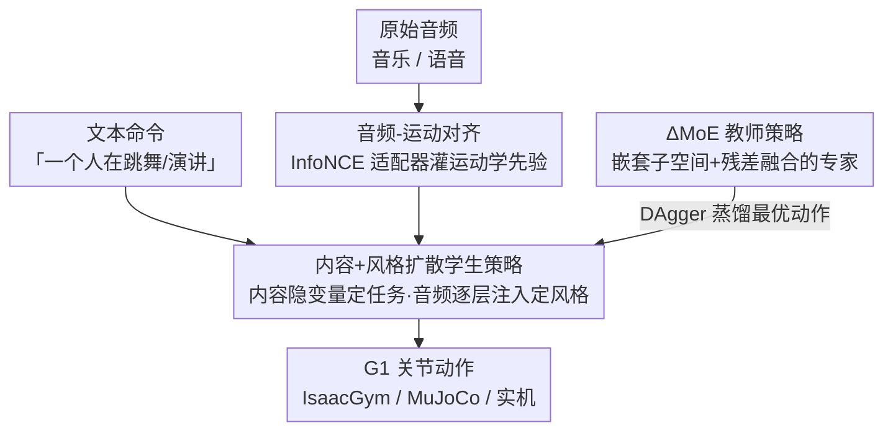

# Do You Have Freestyle? Expressive Humanoid Locomotion via Audio Control

**会议**: CVPR 2026  
**论文**: [CVF Open Access](https://openaccess.thecvf.com/content/CVPR2026/html/Li_Do_You_Have_Freestyle_Expressive_Humanoid_Locomotion_via_Audio_Control_CVPR_2026_paper.html)  
**代码**: 无（未公开）  
**领域**: 机器人 / 具身智能  
**关键词**: 人形机器人, 音频驱动运动, 扩散策略, 混合专家, 动作跟踪  

## 一句话总结
RoboPerform 把"音频→人形机器人动作"做成一个端到端、免重定向的生成框架：用对比学习把音频隐变量对齐到运动隐空间、用残差式混合专家（ΔMoE）训练教师策略、再蒸馏出一个把"内容（文本指定的任务）+ 风格（音频节奏/韵律）"解耦的扩散学生策略，让 Unitree G1 能直接随音乐跳舞、随语音打出协同手势，且延迟显著低于"先生成动作再重定向"的级联管线。

## 研究背景与动机

**领域现状**：人形机器人的全身控制目前主流是"运动跟踪"范式——给一段参考动作（来自动捕或文本生成），用强化学习训练一个策略去模仿。控制信号要么是预定义的动作片段（DeepMimic、ExBody2、GMT 这一脉），要么是稀疏的语言命令（LangWBC、RLPF）。

**现有痛点**：人类是"听到声音就会动"的——鼓点带出一步、旋律引出一跃、说话的重音自然带出手势。但现有系统做不到这种即兴表达。如果想让机器人随音频起舞，直觉做法是搭一条级联管线：音频→运动生成器生成人体动作→重定向到机器人→跟踪控制器执行。作者指出这条路有三个系统性毛病：(1) 解码、重定向、跟踪三段串行，误差会逐级累积，既伤表现力也伤物理一致性；(2) 多阶段顺序推理导致延迟很高，难以实机部署和快速迭代；(3) 高层声学线索和底层关节驱动是松耦合的，每个模块各自优化，风格、时序、动力学这些细粒度表达在传递中丢失。

**核心矛盾**：音频是一种时间结构极其稠密、但又很紧凑易传输的信号——音乐编码了节拍、速度、音色，语音携带了韵律、重音、话语节奏。这些恰恰决定"动作怎么做"。但只要中间插了一步"显式重建出人体动作"，音频里这些细腻的时序风格就会在重定向时被磨平。

**本文目标**：把人形运动控制重新定义为一个**生成问题**——给定条件信号，直接合成物理可行、风格对齐、语义落地的动作；并且让音频成为一等公民的控制信号，绕过显式动作重建。

**核心 idea**：`motion = content + style`。把"内容"定义为由文本命令（如"一个人在跳舞"）经文本-运动模型编码出的高层运动隐变量，规定要做什么核心任务；把"风格"定义为音频信号（音乐节拍 / 语音韵律），规定这个任务**怎么做**。于是音频被当作隐式的风格调制信号注入，而非先变成一段显式动作。

## 方法详解

### 整体框架

RoboPerform 是一个两阶段的"教师-学生"框架，输入是原始音频（音乐或语音）+ 机器人本体感知，输出是可直接在仿真/实机执行的关节动作。整条管线分三块串起来：

1. **音频-运动对齐**：先训练一个带时序注意力的适配器（adaptor），用 InfoNCE 把音频隐变量 $l_{audio}$ 拉近到运动隐变量 $l_{motion}$。这一步把运动学先验"灌"进音频隐变量里，于是后面不再需要一个专门的"音频→动作生成器"。
2. **ΔMoE 教师策略**：在仿真里用强化学习训练一个特权信息（privileged info）可见的 oracle 策略，核心是把条件输入切成嵌套子空间交给 4 个专家、再用残差融合得到动作，专门负责"覆盖多样的运动模式"。
3. **扩散学生策略**：用 DAgger 蒸馏教师，学生是一个基于扩散的动作生成器，把"固定的内容隐变量"作为主条件去引导去噪、同时把对齐过的音频风格隐变量逐层注入做调制。学生只用本体感知（去掉特权信息），可直接部署到 Unitree G1。

### 关键设计

**1. 音频-运动对齐适配器：让音频隐变量自带运动学，省掉显式动作生成器**

这是绕开级联误差的第一刀。痛点在于"音频→显式动作→重定向"那条路的源头，就是要先把音频翻译成一段人体动作。作者干脆不翻译，而是训练一个 6 层 Transformer（带时序注意力，用来抓音频里的节奏结构）当适配器，把音频隐变量 $l_{audio}$ 直接对齐到一个预训练 VAE 给出的运动隐变量 $l_{motion}$。对齐用 InfoNCE 对比损失：一个 batch 里成对的 $(l_{audio}^{(i)}, l_{motion}^{(i)})$ 互为正样本，其余跨样本配对为负样本，记缩放余弦相似度 $\text{sim}(u,v)=\frac{u^\top v}{\tau}$（$\tau$ 为温度），则

$$\mathcal{L}_{\text{InfoNCE}} = -\frac{1}{N}\sum_{i=1}^N \log \frac{\exp\big(\text{sim}(l_{audio}^{(i)}, l_{motion}^{(i)})\big)}{\sum_{j=1}^N \exp\big(\text{sim}(l_{audio}^{(i)}, l_{motion}^{(j)})\big)}.$$

训完之后，音频隐变量在运动隐空间里已经"知道"它对应什么样的动作，可以直接当策略的条件用，既保证了音频与动作的节奏一致，又彻底省掉了那个独立的音频-动作生成器——后面消融里去掉适配器，FineDance 上成功率从 0.93 掉到 0.79、MuJoCo 从 0.67 崩到 0.51，可见这一步是整条路的地基。

**2. ΔMoE 教师策略：把 CFG 的残差对比推广成嵌套条件子空间，让专家互补不冗余**

教师策略要覆盖很多种运动模式（不同舞种、不同语音节奏），普通混合专家的毛病是各专家学到的东西高度重叠、抢同一批信号，t-SNE 上几乎糊成一团，没真正分工。作者的解法是把条件输入看成 3 维向量 $c=[c_1,c_2,c_3]^\top$，定义一条嵌套的条件子空间链 $\{0\}=S_1\subset S_2\subset S_3\subset S_4=\mathbb{R}^3$，4 个专家各只看一个子空间：$e_1$ 看空输入（建模无条件先验 $p(a)$）、$e_2$ 看 $\{c_1,0,0\}$、$e_3$ 看 $\{c_1,c_2,0\}$、$e_4$ 看完整 $\{c_1,c_2,c_3\}$。门控网络给出归一化权重 $w=[w_1,...,w_4]^\top$，最终动作用**残差融合**：

$$\mathbf{a} = w_1\mathbf{a}_1 + \sum_{i=2}^{4} w_i(\mathbf{a}_i - \mathbf{a}_{i-1}),$$

其中 $\Delta\mathbf{a}_i = \mathbf{a}_i - \mathbf{a}_{i-1}$（$\mathbf{a}_0=0$）恰好是"引入第 $i$ 个条件维度带来的边际贡献"。作者论证这等价于无分类器引导（CFG）残差项的结构化推广：CFG 用 $\nabla_a \log p(a\mid c) + (\gamma-1)\nabla_a \log \frac{p(a\mid c)}{p(a)}$ 把条件和无条件信号解耦，而这里每个 $\Delta\mathbf{a}_i$ 就是"第 $i$ 维条件的信息增益"，天然保证各专家贡献互不重叠。论文打了个比方：像作画时从空白画布开始，逐笔加轮廓、加颜色，每一笔都只补非冗余的细节。t-SNE（图 4）显示 $\{a_1, a_2-a_1, \dots, a_4-a_3\}$ 这些分量彼此独立、不再纠缠，消融里 ΔMoE 相比 vanilla MoE 在 FineDance/IsaacGym 上成功率 0.93 vs 0.89、关节误差 0.18 vs 0.24。

**3. 内容+风格解耦的扩散学生策略：内容隐变量定任务、音频逐层注入定风格**

这是把 `motion=content+style` 真正落地的地方。学生策略是个扩散模型，作者把生成显式拆成两路条件：**内容**是用预训练运动生成器（LaMP-T2M）把一句文本（"The person is dancing to the music" / "giving a speech"）编码出的运动隐变量 $l_{motion}$，训练时所有动作共用同一个内容隐变量，它只负责规定"做什么任务"、当作去噪的主条件；**风格**是对齐过的音频隐变量 $l_{audio}$，在扩散主干的多层逐层加性注入：

$$\mathbf{o}_i = \text{Layer}_i(\mathbf{o}_{i-1}, l_{motion}) + \alpha\, l_{audio},$$

$\mathbf{o}_i$ 是第 $i$ 层输出，$\alpha$ 控制风格强度。这种渐进注入把去噪轨迹一点点引向"带节奏风格"的动作，相当于在固定的任务骨架上，按音频的节拍/韵律去调制。训练用类 DAgger 流程：在仿真里让学生策略 rollout、在它访问到的状态上向教师查询最优动作 $\hat a$ 来监督。扩散前向加噪 $x_t=\sqrt{\bar\alpha_t}\,a+\sqrt{1-\bar\alpha_t}\,\epsilon$（$\epsilon\sim\mathcal{N}(0,I)$），采用 $x_0$-预测参数化、重建动作 $\hat a_t=\frac{x_t-\sqrt{1-\bar\alpha_t}\,\epsilon_\theta(x_t,t)}{\sqrt{\bar\alpha_t}}$，用 MSE 损失 $L=\|a-\hat a_t\|_2^2$ 监督。推理时只用两步 DDIM 采样以保证实时。消融显示去掉内容隐变量后跟踪精度明显下降（BEAT2/IsaacGym 误差 0.11 vs 0.05），证明"内容打底、风格调制"这套拆法确实有用。

### 损失函数 / 训练策略
- **适配器**：InfoNCE 对比损失，对齐音频与运动隐空间。
- **教师**：在 IsaacGym 用 RL 训练，可见特权信息 + 参考动作，多项奖励优化，门控 + 4 个 MLP 专家。
- **学生**：DAgger 蒸馏 + 扩散去噪 MSE 损失（$x_0$-预测），AdaLN 注入条件，4 层 MLP 扩散主干；推理两步 DDIM。

## 实验关键数据

实机平台为 Unitree G1，训练数据用 FineDance（7.7 小时精细 3D 舞蹈）和 BEAT2（76 小时、30 位说话人的语音+动作），动作切成 10 秒片段、30FPS。评测分两类：音频-运动检索精度（衡量适配器）、动作跟踪（成功率 Succ + 关节误差 Empjpe + 关键点误差 Empkpe）。

### 主实验：动作跟踪（vs 显式重定向 baseline）

baseline 用 EMAGE/FineNet 先生成确定性动作，再用 PBHC（1000 次迭代）重定向到 G1、由显式动作驱动的 MLP 策略执行。

| 数据集 | 方法 | Succ↑ (IsaacGym) | Empjpe↓ | Succ↑ (MuJoCo) | Empjpe↓ |
|--------|------|------|------|------|------|
| BEAT2 | Baseline | 0.98 | 0.07 | 0.94 | 0.13 |
| BEAT2 | **Ours** | **0.99** | **0.05** | **0.96** | **0.10** |
| FineDance | Baseline | 0.88 | 0.24 | 0.61 | 0.32 |
| FineDance | **Ours** | **0.93** | **0.18** | **0.67** | **0.26** |

难度更高、动态更强的 FineDance 上提升更明显（跨仿真器 MuJoCo 的成功率 0.61→0.67、关节误差 0.32→0.26），说明免重定向的设计在难任务上收益更大；此外作者强调本文延迟显著低于 baseline（baseline 含动作生成 + 1000 迭代重定向）。

### 音频-运动检索

| 任务 | R@1↑ | R@2↑ | R@3↑ | MM-Dist↓ |
|------|------|------|------|------|
| Music→Motion | 66.7 | 78.8 | 83.5 | 1.154 |
| Speech→Motion | 64.6 | 76.5 | 82.1 | 1.232 |

适配器能较准地把音频段对齐回正确的运动隐变量，是后续直接拿音频当条件的前提。

### 消融实验

| 配置 | Succ↑ (FineDance/IsaacGym) | Empjpe↓ | 说明 |
|------|------|------|------|
| **+ Adaptor**（完整） | 0.93 | 0.18 | 音频对齐到运动隐空间 |
| − Adaptor | 0.79 | 0.49 | 去掉对齐，崩得最狠（MuJoCo 0.67→0.51） |
| **ΔMoE** | 0.93 | 0.18 | 残差专家 |
| Vanilla MoE | 0.89 | 0.24 | 专家特征重叠，跟踪变差 |
| **+ Content** | 0.93 | 0.18 | 内容隐变量打底 |
| − Content | 0.91 | 0.20 | 去掉内容语义，精度下降 |

### 关键发现
- **适配器贡献最大**：去掉它跌幅远超其他模块（FineDance/IsaacGym 0.93→0.79，MuJoCo 0.67→0.51），印证"把运动学先验灌进音频"是整条免生成器路线的命门。
- **ΔMoE 的价值在"分工"而不只是精度**：t-SNE 上 vanilla MoE 各专家特征重叠、ΔMoE 的残差分量彼此独立，残差融合真的让专家学到非冗余信息。
- **跨仿真器迁移有掉点但可控**：IsaacGym→MuJoCo 普遍掉成功率（如 FineDance 0.93→0.67），说明 sim-to-sim 仍是难点，实机泛化主要靠定性结果支撑。

## 亮点与洞察
- **`motion = content + style` 这个解耦很干净**：用一句固定文本编出"内容"骨架、用音频做"风格"调制，既保住任务语义又把节奏对齐交给音频，是把"音频驱动"做成可控生成的关键抽象——这套思路可迁移到任何"内容固定、风格随外部信号变"的具身控制（如随地形/触觉调制步态）。
- **ΔMoE 把 CFG 重新解释成 MoE**：用嵌套条件子空间 + 残差融合，让每个专家只学"多一维条件带来的边际增量"，从原理上消除专家冗余，比"加正交约束"之类的工程手段更有理论依据，且这套残差专家可直接用到别的多条件控制问题。
- **免重定向 = 低延迟 + 抗误差累积**：绕过"显式动作→重定向→跟踪"，推理时只跑两步 DDIM，把表现力的损耗和延迟一起砍掉，这是它敢上实机做"主持人/舞者"的底气。

## 局限与展望
- **代码与附录细节未公开**：奖励设计、特权信息构成、检索指标（如 rhythm hit rate）定义都放在 Appendix，正文给的超参较少，复现门槛偏高。⚠️ 部分公式（如残差融合与 CFG 等价推导）以原文为准。
- **内容隐变量是"固定常量"**：训练时所有动作共用同一个内容隐变量、文本只有"跳舞/演讲"两句，意味着当前更像"风格随音频变、任务语义被压扁"，对需要细粒度语义切换（如舞种间过渡、特定手势）的场景表达力有限。
- **sim-to-sim 掉点明显**：FineDance 上跨到 MuJoCo 成功率从 0.93 掉到 0.67，实机泛化主要靠定性视频佐证，缺少大规模实机定量评测。
- **可改进方向**：把内容隐变量也做成时变/可切换的、引入音频里的语义（歌词/话语意图）而不仅是节奏韵律、补上实机定量与延迟数字，会让"freestyle"更名副其实。

## 相关工作与启发
- **vs RoboGhost**：同样走"latent 驱动、免重定向"把运动当生成任务，但 RoboGhost 只用语言当输入；本文第一次把**音频**当条件信号，做到"动作与声音同步"。
- **vs 显式音频-动作管线（EMAGE / FineNet + 重定向）**：他们先生成确定性人体动作再重定向跟踪，级联误差 + 高延迟；本文直接 audio→action，成功率更高、误差更低、实时性更好。
- **vs Kungfubot2 的正交 MoE / BumbleBee**：都用专家/聚类提升多动作覆盖，本文的 ΔMoE 用残差融合（CFG 的结构化推广）来保证专家互补，机制上更针对"消除条件冗余"。

## 评分
- 新颖性: ⭐⭐⭐⭐⭐ 首个把音频当隐式风格信号、免重定向统一驱动人形跳舞+协同手势的框架，ΔMoE 把 CFG 重解释成残差 MoE 也很巧。
- 实验充分度: ⭐⭐⭐⭐ 两任务、双仿真器 + 实机、四组消融较完整，但实机以定性为主、缺延迟与跨平台的定量数字。
- 写作质量: ⭐⭐⭐⭐ 动机和 `content+style` 主线清晰，公式推导到位；部分指标定义被甩进附录略影响自洽。
- 价值: ⭐⭐⭐⭐⭐ 给"表现型人形机器人"开了一条音频驱动、低延迟、抗误差的实用路线，落地潜力大。

<!-- RELATED:START -->

## 相关论文

- [\[CVPR 2026\] Gallant: Voxel Grid-based Humanoid Locomotion and Local-navigation across 3D Constrained Terrains](gallant_voxel_grid-based_humanoid_locomotion_and_local-navigation_across_3-d_con.md)
- [\[CVPR 2026\] End-to-End Language-Action Model for Humanoid Whole Body Control](end-to-end_language-action_model_for_humanoid_whole_body_control.md)
- [\[CVPR 2026\] Iterative Closed-Loop Motion Synthesis for Scaling the Capabilities of Humanoid Control](iterative_closed-loop_motion_synthesis_for_scaling_the_capabilities_of_humanoid_.md)
- [\[AAAI 2026\] Coordinated Humanoid Robot Locomotion with Symmetry Equivariant Reinforcement Learning Policy](../../AAAI2026/robotics/coordinated_humanoid_robot_locomotion_with_symmetry_equivariant_reinforcement_le.md)
- [\[NeurIPS 2025\] Adversarial Locomotion and Motion Imitation for Humanoid Policy Learning](../../NeurIPS2025/robotics/adversarial_locomotion_and_motion_imitation_for_humanoid_policy_learning.md)

<!-- RELATED:END -->
