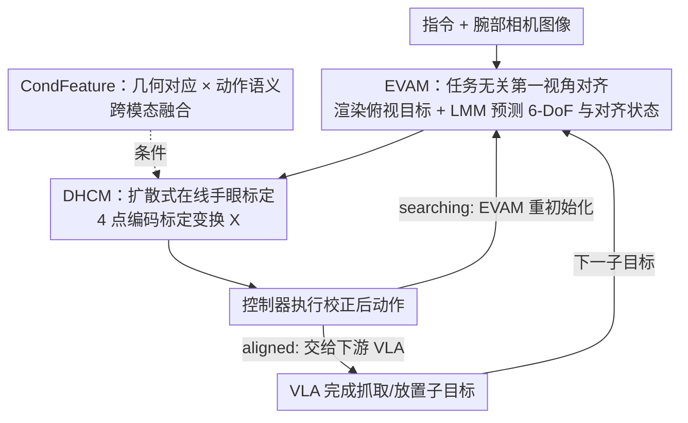

# EgoRoC: Towards Egocentric Robotic Control via Task-Agnostic Visual Alignment

**会议**: CVPR 2026  
**论文**: [CVF Open Access](https://openaccess.thecvf.com/content/CVPR2026/html/Feng_EgoRoC_Towards_Egocentric_Robotic_Control_via_Task-Agnostic_Visual_Alignment_CVPR_2026_paper.html)  
**代码**: 未公开  
**领域**: 具身智能 / 机器人控制  
**关键词**: 具身智能, VLA, 第一视角视觉对齐, 在线手眼标定, 条件扩散  

## 一句话总结
EgoRoC 把"机器人怎么看"从"机器人怎么做"里解耦出来，做成一个即插即用的第一视角对齐头：操作前先用腕部相机把视角对准目标、只吐出一个 6-DoF 位姿接口给下游 VLA，再配一个扩散式在线手眼标定模块把对齐动作转换/校正到末端执行器坐标系；只用静态图像对训练一次，就能跨任务、跨硬件、零样本地提升各种 VLA 的成功率（尤其长程和分布外任务）。

## 研究背景与动机
**领域现状**：当前主流的 Vision-Language-Action（VLA）模型（OpenVLA、RT-2、π0 等）用端到端架构，把图像+语言直接映射成机器人动作，在第三人称相机下对预定义操作任务表现很强。

**现有痛点**：这种端到端范式有三个具体麻烦。其一，**视觉理解和任务动作被纠缠在一起**——换个新任务，感知和控制都得一起重训，开销巨大。其二，**数据成本高**——任务导向的 VLA 依赖大规模、任务专属的"完整操作轨迹"数据集（定位+抓取+放置全流程），RT-2 要 560K、OpenVLA 要 970K episode。其三，**第三人称相机隐含了固定的手眼假设**，相机与机械臂的相对构型一变就要大量微调，本质上是相机和机器人之间形成了一种 visual-servo 耦合。

**核心矛盾**：根因在于——"看"这个能力被当成了"做"的副产品，每个任务都要从完整轨迹里重新学一遍视角对齐，造成跨任务的隐式冗余。作者认为 VLA 系统缺了一个原语（primitive）：**把"怎么看"和"怎么做"分开**。

**本文目标**：把第一视角的视觉对齐抽象成一个可复用、即插即用、与任务无关的能力，放在操作策略上游；它只用静态图像对训练、不改下游 VLA 的任何结构。

**切入角度**：作者从人类操作的直觉出发——技师对显微镜、外科医生摆关节镜，都是**先调好视角再动手**。而且现有 VLA 其实已经隐式受益于这种分工：OpenVLA 的 "Put Eggplant into Pot" 就有个 "Easy Version" 手动把末端执行器先初始化到目标上方再跑策略。这说明"先对齐"是个普适且有效的前置步骤。

**核心 idea**：让机器人"先学会看，再学会做"（learn to see before learn to do）——用一个腕部（第一视角）相机的对齐头建立任务无关的视角一致性，再用一个扩散式在线手眼标定把对齐结果搬到末端坐标系，整套以最小改动挂到任何现成 VLA 上。

## 方法详解

### 整体框架
EgoRoC 是一个挂在 VLA 上游的对齐前端，对外只暴露一个"薄薄的"6-DoF 位姿接口。它由两个串行模块组成：**EVAM**（Egocentric Visual Alignment Module，第一视角视觉对齐）负责估计一个把当前第一视角观测对准任务目标视角的 6-DoF 相对变换；**DHCM**（Diffusion-based Hand-eye Calibration Module，扩散式手眼标定）负责把 EVAM 的输出转换/校正到末端执行器坐标系、并补偿 EVAM 的小偏差。

部署时整个系统跟下游 VLA **交替运行**：给定自然语言指令，EVAM 先把任务解析成有序的子目标序列（如"把胡萝卜放到盘子上" → 先对齐胡萝卜、再对齐盘子），并用第三人称相机渲染一组有序的俯视目标图（这一步整个推理只做一次）。对每个子目标，EVAM 预测相对变换并给出对齐状态（aligning / aligned / searching），DHCM 校正这个变换，机器人控制器执行；当状态变成 **aligned** 就把控制权交给下游 VLA 完成抓取/放置，再进入下一个子目标。如果目标物离开视野（searching），EVAM 重新初始化对齐。这个 ⟨对齐 → 操作⟩ 交替回环让长程任务无需重训策略即可执行。

### 关键设计

**1. EVAM：把"对准视角"做成任务无关的 6-DoF 对齐头**

针对"视觉理解和任务动作纠缠、换任务要重训"的痛点，EVAM 把"对齐"单独拎出来当成一个独立可学的能力。它的输入是当前腕部相机图 $I_{cur}$、一张任务相关的目标图 $I_{tar}$、以及说明对齐目标的文本提示 $T$；输出是一个 6-DoF 相对变换 $A \in SE(3)$，$A \simeq \langle R, t\rangle$（$R \in SO(3)$，$t \in \mathbb{R}^3$），外加一个专门的**对齐状态 token**（aligning / aligned / searching）。其中目标图不是凭空给的：EVAM 先用 LMM 把指令解析成有序物体序列，再用 VGGT 配第三人称相机构建点云（point map）并渲染出有序的俯视目标序列 $I^{tar}_{carrot} \to I^{tar}_{plate}$；为了实时和把渲染图修补干净，作者用 Gemini 2.5 Flash Image 蒸馏监督微调了 pix2pix-turbo 来做 inpaint。骨干用 Qwen2.5-VL-7B（能处理变化分辨率），并按 RT-2 的做法把连续动作参数用百分位分箱（1%–99%）离散成每维 256 个 token，训练目标就是动作 token 上的 next-token 交叉熵。关键在于：**只训练注入的 LoRA 适配器**（视觉编码器、多模态投影层、部分 LLM 层），其余权重全冻结，下游 VLA 一行不改——这就是它"即插即用 + 数据高效"的来源：训练只需带相对位姿的静态图像对，而不是完整操作轨迹。

**2. DHCM：用条件扩散把对齐动作"搬"到末端坐标系并在线校正**

EVAM 给出的是相机视角下的相对位姿，但**腕部相机和机械臂之间的手眼关系会让这个调整位姿产生偏差**，而且传统手眼标定（Tsai–Lenz、Horaud 解 $AX=XB$）要受控环境、相机一动就崩。DHCM 的做法是把手眼标定 $X \in SE(3)$ 当成在线生成问题来解，并顺带补偿 EVAM 的小预测偏差。它的巧思是**用 4 个点 $P=\{p_1,p_2,p_3,p_4\}$ 来编码 $X$**：$p_1,p_2,p_3$ 落在单位球面上且两两正交，用来编码旋转 $R_X$；$p_4$ 无几何约束、用分米尺度归一化来编码平移 $t_X$。于是标定被写成一个条件点生成：

$$\mathcal{P} = \mathcal{D}_{\theta}(\mathbf{CondFeature})$$

其中 $\mathcal{D}_{\theta}$ 是用 Concatsquash MLP 实现的扩散生成器，条件是携带手眼信息的描述子 CondFeature；它把一个带噪点集 $z_t$ 经 $T$ 步去噪到目标分布。作者的核心洞察是：手眼系统的偏差被**隐式编码在输入里**——当前图与目标图这对图像、以及机器人已执行的动作。和经典标定相比，DHCM 在"运行中"就地标定，不需要 CAD 模型或测量工具，能泛化到任意相机-机械臂装配，从而支持硬件无关部署。

**3. CondFeature：几何对应 × 动作语义的跨模态条件特征**

DHCM 能不能标定准，全看条件特征 CondFeature 提取得好不好；它要把"该往哪移"（视觉几何）和"怎么移"（动作运动学）这两类信息融到一起。视觉侧走零样本对应：在目标图上采一个固定 $4\times4$ 网格 $G_{tar}$，用 COTR 把它匹配到当前图得到形变网格 $G_{cur}$，再做 Fourier 位置编码，最后用两支 Image-MLP 在扩散时刻 $t$ 和 $t{+}1$ 上做高斯噪声抑制、得到几何差异特征 $f^{geo}_{(t)}, f^{geo}_{(t+1)} \in \mathbb{R}^{128}$ 拼成 $f^{img}$。这个**网格化对应把几何从语义里解耦**出来（图 3），正好契合任务无关的设计哲学——它学的是空间关系，不依赖物体是什么。动作侧把时刻 $t \to t{+}1$ 的 6D 动作增量 $\Delta A \simeq \langle \Delta R, \Delta t\rangle$（欧拉角+平移）经 Text-MLP 映到 $f^{txt} \in \mathbb{R}^{128}$。两者融合用一个受 Q-Former 启发的跨注意力：和常规做法（直接拿 $f^{txt}$ 当 query、$f^{img}$ 当 key/value）不同，它先把两者拼成 $F=[f^{txt};f^{img}] \in \mathbb{R}^{256}$ 当 key-value（保留各模态信息），再用 $K{=}8$ 个可学习 query $Q \in \mathbb{R}^{8\times256}$ 去注意，最后线性投影成 $\mathbf{CondFeature} \in \mathbb{R}^{256}$。为了让不同手眼构型在嵌入空间里区分得开，作者还上了 **Rank-N-Contrast** 对比学习（温度 $\tau{=}2$）：它按"标签距离"排序构造正负样本，标签距离用两个变换矩阵的旋转角差 $\theta = \arccos\big(\frac{\mathrm{tr}(R)-1}{2}\big)$（$R = R_i R_j^\top$）来定义——这避免了对连续旋转做脆弱的正负二分类，让嵌入距离和真实旋转距离对齐。

### 损失函数 / 训练策略
DHCM 的总损失把对比、扩散、几何三类约束加在一起：

$$\mathcal{L}_{DHCM} = \mathcal{L}_{rank} + \mathcal{L}_{diff} + (\mathcal{L}_{sphere} + \mathcal{L}_{ortho} + \mathcal{L}_{dist})$$

- $\mathcal{L}_{rank}$：Rank-N-Contrast 损失，拉开不同标定矩阵的区分度；
- $\mathcal{L}_{diff} = \mathbb{E}_{q(z_t|\mathcal{P})}\|\mathcal{P} - \hat{\mathcal{P}}_\theta(z_t, \mathbf{CondFeature})\|_2^2$：扩散去噪重建损失；
- 三个几何正则：$\mathcal{L}_{sphere}=\sum_{i=1}^3(\|p_i\|_2^2-1)^2$ 强制 $p_1,p_2,p_3$ 落在单位球面；$\mathcal{L}_{ortho}=\sum_{i\neq j,\,i,j\le3}(p_i^\top p_j)^2$ 保证正交（维持旋转正交归一性质）；$\mathcal{L}_{dist}=\sum_{i=1}^3\|p_i-q_i\|_2^2$ 让生成点尽量贴近去噪前的原始输出 $q_i$、把调整幅度压到最小。

**两阶段训练**：所有训练数据都是从完整操作 episode 里抽出的"带相对位姿的腕部相机图像对"，分成两个子集。**第一阶段**在一个子集上分别训 EVAM 和 DHCM——EVAM 在 episode 标注的直接监督下学相对位姿；DHCM 每对图随机采若干标定矩阵 $X$、把真值相对位姿 $P$ 变换成 $P'$ 喂给 Text-MLP 分支，采的 $X$ 当对比/扩散/几何约束的标签。**第二阶段**端到端精修：冻结 EVAM 和 DHCM 里的 Geo-MLP 分支，只训跨模态融合和扩散生成器，此时 Text-MLP 的输入换成 EVAM 真实预测的 6-DoF 位姿、监督仍是 episode 推出的相对位姿——这一步教 DHCM **在部署时纠正 EVAM 的偏差、适配当前手眼构型**。

## 实验关键数据

数据用 2.3M 第一视角-目标图像对（取自 BridgeData + DROID 共 60k episode，均属 Open X-Embodiment）。骨干默认 Qwen2.5-VL-7B（LoRA rank 64）。基线为 5 个 SOTA VLA：OpenVLA、TinyVLA、SpatialVLA、Pi-0、OpenVLA-OFT。4 个任务缩写：Lift（Task-L）、Put A onto B（Task-Po）、Put all into（Task-PA）、Put into drawer（Task-PD），后两个为长程任务。主对比（图 4 雷达图、图 5 数据效率曲线）显示挂上 EgoRoC 后 5 个基线在仿真和真实环境的成功率一致提升，长程和分布外任务提升尤其明显。

### 主实验

手眼标定策略对比（真实环境，成功率 %，基线为微调后的 OpenVLA）：

| 方法 | Task-L | Task-Po | Task-PA | Task-PD |
|------|--------|---------|---------|---------|
| Tsai–Lenz（经典标定） | 67.0 | 52.0 | 40.0 | 17.0 |
| DHCM（仅第一阶段） | 66.0 | 49.0 | 37.0 | 15.0 |
| **DHCM（完整训练）** | **72.0** | **52.0** | **43.0** | **20.0** |

只训第一阶段的 DHCM 在多数任务上略低于经典 Tsai–Lenz，但完整两阶段训练后在所有任务上全面超过——说明第一阶段学到了手眼构型的表示，第二阶段的联合优化才让它学会**在执行中纠正 EVAM 偏差**。

共享 LMM 的即插即用变体（真实环境，成功率 %）：把 EVAM 的 LMM 直接复用下游 OpenVLA 的基座（DINOv2+SigLIP+Llama-2-7B），只为 EVAM 新训一个 LoRA：

| EVAM 的 LMM | Task-L | Task-Po | Task-PA | Task-PD | Avg. |
|-------------|--------|---------|---------|---------|------|
| Qwen2.5-VL-7B | 26.0 | 19.0 | 14.0 | 3.0 | 15.5 |
| OpenVLA（共享） | 28.0 | 20.0 | 12.0 | 3.0 | **15.8** |

共享基座能在不改数据/训练流程的前提下小幅提升（15.8 vs 15.5），增益集中在短程任务、Task-PA 上有轻微 trade-off，同时保住了即插即用属性。

### 消融实验

DHCM 各组件消融（真实环境，前两表为成功率 %，后两表为旋转角误差 RAE / 标准差 SD，越低越好）：

| 配置 | Task-L | Task-Po | Task-PA | Task-PD | 速度(s) | 说明 |
|------|--------|---------|---------|---------|---------|------|
| w/o grid（无网格匹配） | 61.0 | 40.0 | 32.0 | 11.0 | - | 没有显式几何信号 |
| COTR 2×2 grid | 69.0 | 48.0 | 38.0 | 15.0 | 0.11 | 网格太小易受错配噪声 |
| **COTR 4×4 grid（采用）** | 72.0 | 52.0 | 43.0 | 20.0 | 0.19 | 速度/精度折中 |
| COTR 8×8 grid | 77.0 | 54.0 | 46.0 | 23.0 | 0.87 | 最准但每步匹配太慢 |

| 配置 | RAE(°) | SD(°) | 说明 |
|------|--------|-------|------|
| 完整 DHCM | 2.03 | 0.89 | 参考 |
| w/o Rank-N-Contrast | 12.78 | 1.35 | 对比学习去掉后旋转误差暴涨 6 倍 |
| w/o 扩散（改直接 MLP 回归） | 6.27 | 1.76 | 误差和方差都明显变大 |

Geo-MLP 消融（成功率 %）：带 Geo-MLP 时 Task-L/Po/PA/PD = 72/52/43/20，去掉后 = 71/52/41/17，提升小但稳定——它帮扩散输出在解码后满足单位球面和正交约束、减少旋转表示转换误差。

### 关键发现
- **Rank-N-Contrast 是标定精度的命门**：去掉它旋转角误差从 2.03° 飙到 12.78°（约 6 倍），因为连续旋转做硬正负二分类很脆，按旋转角距离排序构造监督才稳。
- **扩散生成器优于直接回归**：RAE 2.03° vs 6.27°，作者归因于扩散能建模多峰标定分布、缓解旋转参数化里的轴向歧义（axis ambiguity）。
- **长程/分布外任务收益最大**：⟨对齐 → 操作⟩ 交替减少了累积的"感知-控制漂移"，在分布偏移下增强了指令跟随；数据效率曲线里分布外任务（Task-Po/PA）的提升带比分布内更宽。
- **网格大小是精度-速度权衡**：8×8 最准但 0.87s/步太慢，2×2 易受错配噪声，4×4 是落点。

## 亮点与洞察
- **"先学会看，再学会做"是个干净的解耦原语**：把视角对齐从任务策略里拆出来当成上游、可复用、与任务无关的能力，训练从"完整轨迹"降到"静态图像对"，这是数据成本和跨任务冗余的釜底抽薪。
- **只暴露一个 6-DoF 接口、下游 VLA 零改动**：这种"薄接口 + 冻结下游"的工程姿态让它能跨 OpenVLA/π0/TinyVLA 等多种骨干即插即用，可迁移性极强。
- **用 4 个点编码 SE(3) 标定 + 几何正则**：把手眼标定转成"球面正交三点 + 一个平移点"的条件点生成，再用扩散去噪，是把刚体约束塞进生成模型的巧妙做法，可迁移到其他需要在线估计刚体变换的场景。
- **把手眼偏差当"隐式编码在图像对+已执行动作里"的洞察**很有启发：不靠外部标定物，而是从运行时数据里反解几何，适合任意硬件装配。

## 局限与展望
- **依赖静态图像对**：作者承认这限制了它处理高度动态环境的能力，未来想做时序对齐和更高效的在线标定来降时延。
- **绝对成功率仍偏低**（⚠️ 共享 LMM 表里 4 任务平均才 15.5–15.8%，长程 Task-PD 仅 3%）——这套数主要用于"挂/不挂 EgoRoC 的相对增益"对比，绝对值偏低可能与任务难度、基线本身能力有关，跨表的成功率（如消融表里 OpenVLA 微调后 Task-L 72%）口径不同、不可直接横比。
- **主对比以雷达图/曲线呈现、缺逐任务数值表**：图 4/图 5 没给精确数字表格，复现时不易对齐具体提升幅度。
- **目标图渲染链路较重**：VGGT 建点云 + pix2pix-turbo inpaint（还蒸馏自 Gemini 2.5 Flash Image），这套前置渲染的鲁棒性和失败模式论文着墨不多。

## 相关工作与启发
- **vs 端到端 VLA（OpenVLA / RT-2 / π0）**：它们把感知和控制端到端纠缠、每任务要完整 episode（RT-2 560K、OpenVLA 970K）；EgoRoC 把对齐拎到上游、只用静态图像对训练、不改下游策略，降冗余、易跨任务，本质是给这些 VLA 加一个前置增强而非替代它们。
- **vs 经典手眼标定（Tsai–Lenz / Horaud）**：经典法解 $AX=XB$ 需要受控环境和测量工具、相机相对基座一动就崩；DHCM 在运行中就地标定、从第一视角腕部图直接估计、无需 CAD 或标记物，且实验上完整训练后全面超过 Tsai–Lenz。
- **vs 学习式标定（依赖第三人称视图）**：以往学习法多依赖外部第三人称视图和测量工具；本文把对应线索与已执行动作融成紧凑标定描述子、纯第一视角在线完成，支持硬件无关部署。

## 评分
- 新颖性: ⭐⭐⭐⭐⭐ 把"视觉对齐"从 VLA 里解耦成即插即用原语 + 用 4 点编码 + 扩散做在线手眼标定，两个角度都很新。
- 实验充分度: ⭐⭐⭐⭐ 5 个 VLA 骨干 × 仿真/真实 × 短程/长程覆盖广、消融扎实，但主对比缺逐任务数值表、绝对成功率偏低。
- 写作质量: ⭐⭐⭐⭐ 动机和模块讲得清楚，图 1/2 把"解耦"思想表达到位；部分指标口径需读者自己对齐。
- 价值: ⭐⭐⭐⭐⭐ 即插即用、不改下游、训练数据省，对真实机器人部署有很强实用价值。

<!-- RELATED:START -->

## 相关论文

- [\[CVPR 2026\] Spatial-Aware VLA Pretraining through Visual-Physical Alignment from Human Videos](spatial-aware_vla_pretraining_through_visual-physical_alignment_from_human_video.md)
- [\[CVPR 2026\] Action-Sketcher: From Reasoning to Action via Visual Sketches for Robotic Manipulation](action-sketcher_from_reasoning_to_action_via_visual_sketches_for_robotic_manipul.md)
- [\[CVPR 2026\] FLARE: A Failure-Aware Framework for Autonomous Correction and Recovery in Visual-Language Robotic Manipulation](flare_a_failure-aware_framework_for_autonomous_correction_and_recovery_in_visual.md)
- [\[CVPR 2026\] Unifying Perception and Action: A Hybrid-Modality Pipeline with Implicit Visual Chain-of-Thought for Robotic Action Generation (VITA)](unifying_perception_and_action_a_hybrid-modality_pipeline_with_implicit_visual_c.md)
- [\[CVPR 2026\] Learning to See and Act: Task-Aware Virtual View Exploration for Robotic Manipulation](learning_to_see_and_act_task-aware_virtual_view_exploration_for_robotic_manipula.md)

<!-- RELATED:END -->
