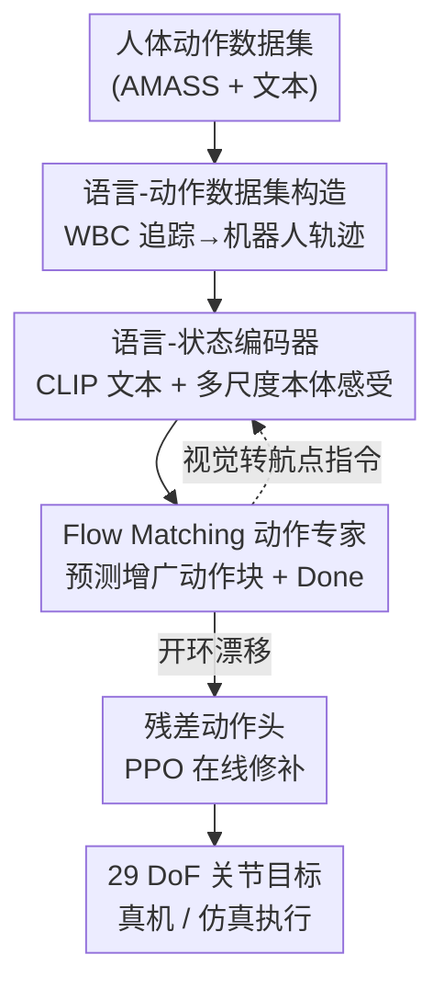

# End-to-End Language-Action Model for Humanoid Whole Body Control

**会议**: CVPR 2026  
**论文**: [CVF Open Access](https://openaccess.thecvf.com/content/CVPR2026/html/Wang_End-to-End_Language-Action_Model_for_Humanoid_Whole_Body_Control_CVPR_2026_paper.html)  
**代码**: 未公开  
**领域**: 机器人 / 具身智能  
**关键词**: 人形全身控制, 语言-动作模型, Flow Matching, 残差强化学习, 端到端  

## 一句话总结
SENTINEL 是首个完全端到端的"语言→人形全身底层动作"模型——它在仿真里用预训练全身控制器追踪人体动作、配上文本标注造出大规模语言-动作数据集，再用 flow matching 动作专家直接把语言指令和本体感受映射成 29 维关节目标，最后用残差强化学习头修补开环漂移，在仿真和真机 Unitree G1 上都拿到了显著优于"文本生成动作 + 控制器"两段式 baseline 的语义对齐和执行成功率（仿真成功率 99.45%）。

## 研究背景与动机
**领域现状**：让人形机器人按自然语言做全身动作（走、跳、挥手、演奏），目前主流是两段式：先用 text-to-motion 模型（MDM、T2M-GPT 等）从文本生成一段人体动作序列，再 retarget 到机器人、交给一个全身控制器（WBC）去物理执行。语言理解和物理执行被切成两个独立优化的模块。

**现有痛点**：两段式的中间表示（人体动作序列）和控制器的输入空间不对齐，两边各练各的，生成的动作往往物理上不可行——比如 MDM 生成一个大幅度旋转的"跳跃转体"，retarget 执行时控制器直接失衡摔倒。即使是绕过 retarget 的 UH-1（直接生成机器人位姿），或用 CVAE 蒸馏专家策略的 LangWBC，要么仍依赖中间表示、要么因 MLP 容量太小导致语义对齐差、对没见过的指令泛化不动。

**核心矛盾**：只要把"语言理解"和"物理执行"用一个人造中间表示（动作序列 / 位姿 / 隐变量）隔开，执行端的反馈梯度就回不到语言端，整个系统没法联合优化，语义-运动学一致性天然受限。

**本文目标**：去掉一切中间运动表示，让语言指令 + 本体感受直接映射到底层关节动作，并解决随之而来的两个工程难题——(1) 全身控制需要长时序推理（"向前走四步停下"得记住走了几步）；(2) 动作分块（action chunking）带来的开环漂移会破坏 sim-to-real。

**核心 idea**：用一个 flow-matching 动作专家做端到端的"语言-动作模型"，直接预测底层动作块，再叠一个残差 RL 头在线修补漂移——梯度可以从执行反馈一路回流到语言理解，实现联合优化。

## 方法详解

### 整体框架
SENTINEL 分三个阶段串起来。**阶段一（数据构造）**：先用 PPO 在 IsaacLab 里训一个 Mixture-of-Experts 的全身控制器，能在 Unitree G1 上追踪各种人体动作；然后拿这个控制器去 rollout 一个带文本标注的人体动作数据集（PHC 过滤后的 AMASS 子集），把每条人体动作 $m_i$ 追踪成一条"物理可行的机器人轨迹 $\tau_i$"，并保留原始文本 $l_i$，得到语言-动作数据集 $D_{\text{robot}}=\{(\tau_i, l_i)\}$，轨迹里每步是状态-动作对 $(s_t, a_t)$。**阶段二（预训练）**：训一个端到端语言-动作模型——语言-状态编码器把文本和本体感受历史编码成上下文，flow matching 动作专家据此预测未来 $H$ 步的动作块。**阶段三（后训练）**：冻住语言-动作模型，单独训一个轻量残差动作头，用 PPO + domain randomization 在线修补开环漂移、适配真机。此外，把视觉等其他模态转成"语言航点指令"就能扩展到导航等任务。

下图是整条 pipeline：

### 关键设计

**1. 物理接地的语言-动作数据集：把"人体动作"翻译成"机器人能做的动作"**

两段式失败的根因是 text-to-motion 生成的是"人的动作"，retarget 到机器人后物理上做不出来。本文不直接拿人体动作训模型，而是先训一个 MoE 全身控制器，让它在仿真里去真实追踪每条人体动作 $m_i$，把控制器实际 rollout 出来的、物理上可行的机器人轨迹 $\tau_i=\{(s_t,a_t)\}$ 记下来，配上原文本得到 $D_{\text{robot}}$。这样数据天生就"过了物理这一关"。采集时还开 domain randomization（随机化质心、摩擦系数、外部推力、力矩噪声）来扩大数据覆盖、提升鲁棒性。最终在 AMASS 的 12,422 条动作（含镜像）上采到约 20 万条语言标注机器人轨迹、约 1 亿组状态-动作对。这是端到端能 work 的数据基础——模型见到的每个 action 标签都是物理上站得稳的。

**2. Flow Matching 动作专家 + 多尺度观测：直接生成底层动作块、且能长时序推理**

模型由两部分组成：**语言-状态编码器**（Transformer）把 CLIP 文本编码器给出的语义 token 和机器人状态历史 $s^{\text{hist}}_t$ 一起编码成上下文 $c_t=[l, s^{\text{hist}}_t]$，通过 KV cache 暴露给动作专家；**动作专家**是一个 flow matching 模型，预测未来 $H$ 步的动作块 $A_t=[a_t,\dots,a_{t+H-1}]$。训练时给定真值动作块 $A_t$ 和插值系数 $\beta\sim\text{Beta}(1.5,1.0)$，构造噪声样本 $A^\beta_t=\beta\epsilon+(1-\beta)A_t$（$\epsilon\sim\mathcal N(0,I)$），让速度场 $v_\theta$ 逼近目标速度 $u(A^\beta_t|A_t)=\epsilon-A_t$：

$$L(\theta)=\mathbb E\,\big\|v_\theta(A^\beta_t,\beta,c_t)-u(A^\beta_t|A_t)\big\|^2$$

推理时从 $\beta=1$ 沿学到的流积分到 $\beta=0$（步长 $\Delta t=0.1$）得到动作块，按 receding-horizon 只执行前 $K$ 个动作再重新生成。

这个设计针对的痛点是"全身控制需要长时序推理"。普通操作任务看当前一帧就够，但"向前走四步停下"必须知道已经走了几步。作者构造**多尺度状态历史** $s^{\text{hist}}_t=[s^{\text{long}}_t, s^{\text{short}}_t]$：短期 $s^{\text{short}}_t$ 取最近 10 帧、50 Hz 采样，给稳定控制提供高分辨率反馈；长期 $s^{\text{long}}_t$ 取过去 10 秒、4 Hz 低频采样，提供把握动作进度的大时序上下文。消融里把长期观测去掉（仅 0.2s）后 R@1 从 0.582 暴跌到 0.153，证明长时序上下文对语义对齐是命脉。

**3. 动力学感知预测 + Done 预测：让动作物理自洽、且知道何时停**

只预测动作不显式约束动力学，模型容易学出物理上不连贯的轨迹。作者把动作专家的输出**增广**成 $\tilde a_t=[a_t, v^{\text{root}}_{t+1}, \omega^{\text{root}}_{t+1}, q_{t+1}]$，即在预测动作的同时预测下一时刻的根线速度、根角速度和关节位置——这等于给模型加了一个"预测环境转移"的辅助监督，把策略往物理接地的行为上正则化（注意这只是辅助信号，不像 motion generation 那样要重建细粒度关节轨迹）。

另一个痛点是文本控制没有固定 horizon，模型得自己决定何时终止。作者引入一个二值 **done token**，由一个 MLP 头作用在编码器最后一个状态 token 的隐状态上，预测"指令是否会在接下来 $H$ 步内完成"；推理时若 done 概率连续 $\lceil H/K\rceil$ 个块都超过 0.5，就主动终止当前指令。消融显示去掉 done 预测后 MMD 从 3.438 恶化到 5.852（指令完成后会出现乱动）。

**4. 残差动作头后训练：在线修补 action chunking 的开环漂移**

动作分块是开环执行的（一次生成 $H$ 步、执行 $K$ 步），高动态动作下会累积漂移，直接影响 sim-to-real。作者冻住整个语言-动作模型，额外训一个轻量残差头 $\pi_\Delta$：给定当前状态 $s_t$ 和动作专家预测的增广动作 $\tilde a_t$，输出残差 $\Delta a_t=\pi_\Delta(s_t,\tilde a_t)$，最终动作 $a^{\text{final}}_t=a_t+\Delta a_t$。它用 PPO + domain randomization 在 IsaacLab 里训，奖励由追踪项（让残差把未来关节位置拉向原预测 $\hat q$，$\exp(-\|q_t-\hat q_t\|/0.09)$）和正则项（约束残差幅度 $\exp(-\|\Delta a_t\|/0.09)$、动作变化率、摔倒终止罚 $-100$）组成。它保留语义意图的同时，给高动态动作在下一个动作块到来前提供及时的闭环修正——后训练后在带 domain randomization 的环境里成功率从 95.44% 提到 99.11%。

### 损失函数 / 训练策略
预训练用 flow matching 的速度场回归损失（式见上）做行为克隆，动作专家与语言-状态编码器共享骨干但动作专家隐藏维更小，交替堆叠 cross-attention 和 self-attention 层。后训练冻结主模型，只用 PPO 优化残差头，奖励项见下表。默认配置 $H=50$、$K=5$；模型 600M 参数。

| 奖励项 | 表达式 | 权重 |
|--------|--------|------|
| DoF 追踪 | $\exp(-\|q_t-\hat q_t\|/0.09)$ | 2.0 |
| 残差动作范数 | $\exp(-\|\Delta a_t\|/0.09)$ | 2.0 |
| 动作变化率 | $-\|a^{\text{final}}_t-a^{\text{final}}_{t-1}\|$ | 0.2 |
| 终止（摔倒） | $-1$ if fall down | 100 |

## 实验关键数据

### 主实验
数据集为 AMASS（PHC 过滤）子集，含 12,422 条带文本动作；在 Unitree G1 上评测。生成质量用在 $D_{\text{robot}}$ 上训的 TMR 检索模型抽特征，报 MM-Dist、R@K、Diversity、MMD（不用 FID，因 TMR 对比学习特征不服从高斯）；物理可行性报仿真执行成功率（不摔倒为成功）。

| 方法 | MM-Dist ↓ | R@1 ↑ | R@3 ↑ | MMD(1e-2) ↓ | Success Rate(%) ↑ |
|------|-----------|-------|-------|-------------|-------------------|
| Ground Truth | 0.110 | 0.969 | 0.999 | - | - |
| MDM + Retarget | 0.703 | 0.338 | 0.559 | 8.910 | 94.94 |
| T2M-GPT + Retarget | 0.577 | 0.481 | 0.714 | 4.115 | 89.33 |
| UH-1 | 0.644 | 0.394 | 0.585 | 4.729 | 86.95 |
| LangWBC | 0.682 | 0.435 | 0.622 | 8.642 | 81.78 |
| **SENTINEL (ours)** | **0.487** | **0.582** | **0.766** | **3.438** | **99.45** |

SENTINEL 在所有指标上都领先：语义对齐（R@1 0.582 vs 次优 0.481）和物理执行（成功率 99.45% vs 次优 94.94%）双赢。两个核心结论：(1) 在物理接地的机器人轨迹上训练，比"人体动作生成 + retarget"显著更稳；(2) Transformer 架构比 LangWBC 的 MLP 在语义理解和未见指令泛化上强得多。

### 消融实验
| 配置 | R@1 ↑ | MMD ↓ | Success ↑ | 说明 |
|------|-------|-------|-----------|------|
| Base | 0.582 | 3.438 | 99.45 | 完整模型 |
| w/ 0.2s 观测 | 0.153 | 72.468 | 99.50 | 去长期观测，语义崩溃 |
| w/ 2.0s 观测 | 0.489 | 3.956 | 99.56 | 换 20 帧@10Hz（同 LangWBC），仍掉点 |
| w/o State Prediction | 0.589 | 3.587 | 98.67 | 去动力学感知，成功率/MMD 略降 |
| w/o Done Prediction | 0.522 | 5.852 | 99.44 | 去 done，完成后乱动 MMD 恶化 |

模型规模消融（Table 4）：600M→200M→60M，R@1 从 0.582 掉到 0.371 再崩到 0.099，成功率从 99.45% 跌到 22.73%——容量对捕捉"语言-状态-动力学"复杂关系至关重要。残差后训练（Table 5）：在 domain randomization 下，Base 成功率 95.44%，加残差头后 99.11%、R@1 从 0.315 提到 0.392。

### 关键发现
- **长期观测是命脉**：去掉长期低频观测后 R@1 从 0.582 直接崩到 0.153、MMD 飙到 72.468，远比去掉 state/done 预测严重——全身控制确实强依赖长时序进度推理。
- **chunk 越长越好，但执行步要短**：$K=5$ 在所有 chunk size 下都最优；$H$ 从 5 增到 50 性能持续上升（即使只执行一小部分），长 horizon 训练能逼模型学长程语义依赖。$H=K$ 并不够。
- **残差头专治 sim-to-real**：只在带 domain randomization 的真实化环境里才显出价值（成功率 95.44%→99.11%），印证它修的是 action chunking 的开环漂移。
- 真机 Unitree G1 上零样本 sim-to-real，能做上肢（拉小提琴）、locomotion（直走）和复杂全身动作（连跳两次）；导航实验里两轮迭代把平均距离从 5.06m 收到 1.99m。

## 亮点与洞察
- **"先让控制器把数据走一遍"是端到端能成立的关键 trick**：不直接学人体动作、而是用预训练 WBC 把每条人体动作 rollout 成物理可行的机器人轨迹，等于把"物理可行性"前置进数据，模型只需做语言→已验证动作的映射——这个数据构造思路可迁移到任何"高层意图→底层控制"的端到端任务。
- **增广动作块（同时预测下一时刻状态）是个低成本的物理正则**：几乎不改架构，只让动作专家多吐几维 root 速度和关节位置当辅助监督，就能提稳定性，是 RL/BC 里"辅助状态预测"的巧用。
- **残差 RL 头解耦"语义"和"稳定"**：主模型管语义、冻住不动，轻量残差头专门在线修物理漂移，既不破坏语义意图又能闭环纠偏，对 sim-to-real 很实用。
- **多模态扩展靠"把感知转成语言航点"**：视觉用 FoundationPose 估目标位姿、塞进"走到 (x, y)"的语言模板，复用同一个语言-动作模型，不必为每个模态重训——这是端到端 + 语言接口的额外红利。

## 局限与展望
- 评测主要在仿真，真机只给了定性展示（拉小提琴、直走、跳跃），没有真机上的成功率/对比量化，sim-to-real 的可靠性还缺硬数据支撑。
- 依赖一个预训练好的 MoE 全身控制器来造数据，整体性能上限被这个控制器的追踪能力卡住；控制器追不动的高难动作，数据里就不会有。⚠️ 论文未讨论控制器失败动作如何处理。
- 多模态"扩展"目前只验证了导航（视觉→航点），且导航两轮后仍残留 ~2m 误差，离精确操作还有距离；把更丰富感知（接触、力觉）转成语言指令是否够用存疑。
- 600M 模型才达到满血性能（60M 直接崩到 22% 成功率），真机实时部署需要异步 action-chunk 推理 pipeline（细节在附录），算力门槛不低。

## 相关工作与启发
- **vs MDM/T2M-GPT + Retarget**：两段式先生成人体动作再 retarget 执行，物理可行性靠不住（大幅旋转动作直接摔）；本文端到端直接在控制层预测物理可行动作块，成功率 99.45% vs 它们 89~95%，且 R@1 更高。
- **vs UH-1**：UH-1 绕过 retarget 直接从文本生成机器人位姿，但仍是开环、且训练用的是 retarget 位姿数据而非真实交互轨迹；本文用仿真交互采的物理接地轨迹训练，且有闭环残差修正。
- **vs LangWBC**：LangWBC 用 CVAE + DAgger 蒸馏专家策略，MLP 架构容量小、语义对齐和泛化都弱（R@1 0.435、成功率 81.78%）；本文 Transformer + flow matching 在语义和物理上全面领先，且无需中间表示。
- **启发**：把"端到端 + 语言作为统一接口"用在底层控制上，最大价值是让执行反馈梯度回流到语言理解端；而"用专家策略离线造物理接地数据 → BC 预训练 → 残差 RL 在线纠偏"这套三段式，可能是把生成式策略推上真机的一条通用范式。

## 评分
- 新颖性: ⭐⭐⭐⭐⭐ 首个完全无中间表示的端到端语言→人形全身底层控制框架，思路清晰。
- 实验充分度: ⭐⭐⭐⭐ 仿真对比/消融/scaling/导航都很完整，但真机只有定性、缺量化对比。
- 写作质量: ⭐⭐⭐⭐⭐ 动机推导、三阶段方法和消融都讲得很透，图文对照清楚。
- 价值: ⭐⭐⭐⭐⭐ 给"语言控制人形机器人"提供了可落地的端到端范式，数据构造和残差纠偏思路可复用。

<!-- RELATED:START -->

## 相关论文

- [\[CVPR 2026\] LEAD: Minimizing Learner-Expert Asymmetry in End-to-End Driving](lead_minimizing_learner-expert_asymmetry_in_end-to-end_driving.md)
- [\[CVPR 2026\] Beyond Mimicry: Learning Whole-Body Human-Humanoid Interaction from Human-Human Demonstrations](beyond_mimicry_learning_whole-body_human-humanoid_interaction_from_human-human_d.md)
- [\[CVPR 2026\] RoboTAG: End-to-end Robot Pose Estimation via Topological Alignment Graph](robotag_end-to-end_robot_pose_estimation_via_topological_alignment_graph.md)
- [\[CVPR 2026\] Scalable Trajectory Generation for Whole-Body Mobile Manipulation](scalable_trajectory_generation_for_whole-body_mobile_manipulation.md)
- [\[NeurIPS 2025\] AutoVLA: A Vision-Language-Action Model for End-to-End Autonomous Driving with Adaptive Reasoning and Reinforcement Fine-Tuning](../../NeurIPS2025/robotics/autovla_a_vision-language-action_model_for_end-to-end_autonomous_driving_with_ad.md)

<!-- RELATED:END -->
