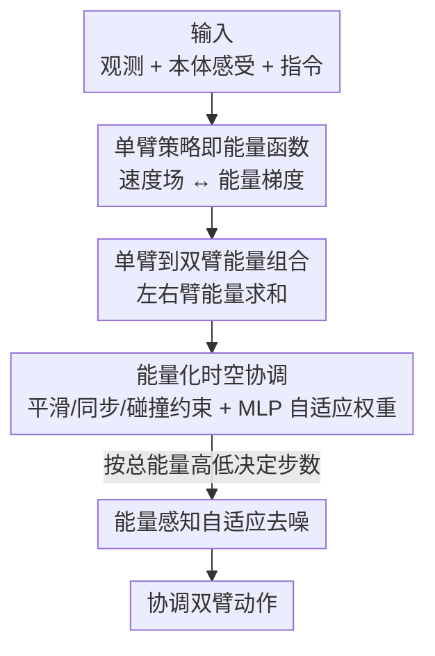

# EnergyAction: Unimanual to Bimanual Composition with Energy-Based Models

**会议**: CVPR 2026  
**论文**: [CVF Open Access](https://openaccess.thecvf.com/content/CVPR2026/html/Song_EnergyAction_Unimanual_to_Bimanual_Composition_with_Energy-Based_Models_CVPR_2026_paper.html)  
**代码**: https://github.com/codeshop715/EnergyAction  
**领域**: 机器人 / 具身智能  
**关键词**: 双臂操作, 能量模型(EBM), 组合式迁移, Flow Matching, 自适应去噪  

## 一句话总结
把两条预训练的单臂策略当成能量函数、用能量求和直接"拼"成一条双臂策略，再用能量约束保证时空协调、用能量大小自适应决定去噪步数，从而在几乎不需要双臂示范数据的情况下做出协调的双臂操作（RLBench2 上 20 条示范即达 77.3% 成功率，比次优高 32.5%）。

## 研究背景与动机
**领域现状**：单臂操作策略靠大规模示范数据和成熟架构（RT 系列、Octo、扩散策略等）已经做得相当好；但双臂操作要同时控制两条手臂，动作空间维度成倍增长，还得保证两臂在时间上同步、空间上不打架。

**现有痛点**：直接对双臂联合动作空间建模的方法（PerAct2 等）要从有限示范里隐式学出物理约束，常出现两臂碰撞、动作不同步；给两臂固定分工的方法迁移性差；而采集高质量双臂遥操作数据极其昂贵，靠堆双臂数据训基础模型走不通。

**核心矛盾**：双臂数据稀缺 ↔ 双臂联合动作空间高维难学。一边没数据，一边问题又比单臂难得多，硬学注定数据效率低。

**本文目标**：在几乎不增加双臂示范的前提下，把现成单臂策略里那套丰富的操作知识迁移到双臂任务上，并显式保证两臂协调、推理还要快。

**切入角度**：作者翻出了一个被现代机器人研究忽视的经典工具——能量模型（EBM）。EBM 有一条关键性质叫**组合性**：两个能量函数相加，对应的概率分布就是两者的"复合概念"。把这条性质用到迁移上，双臂动作生成就能被拆成两条单臂策略的组合，正好是一个"分而治之"的解法。

**核心 idea**：把左右臂单臂策略各自看作一个能量函数，**能量相加即组合成双臂策略**；在此之上再叠加时空协调能量约束和能量感知的自适应去噪，构成 EnergyAction。

## 方法详解

### 整体框架
EnergyAction 的输入是共享视觉观测 $o_t$、两臂各自的本体感受状态 $p_t^i$ 和语言指令 $l$，输出是两臂在每个时刻的协调动作 $a_t=(a_t^L, a_t^R)$（各自含 6D 末端位姿 + 夹爪状态）。整条 pipeline 不重新训练联合双臂策略，而是把两条**预训练好的单臂 Flow Matching 策略**当作能量函数复用：先把它们的条件速度场翻译成能量梯度，再把两条能量求和拼成双臂能量；拼出来的动作可能违反协调约束，于是再加一项把时间平滑、两臂同步、碰撞规避都编码进去的协调能量；最后推理时根据动作当前的能量值高低自适应决定去噪步数，简单动作一步出、复杂动作多走几步。

### 关键设计

**1. 单臂策略即能量函数，能量求和组合成双臂策略：用 EBM 的组合性把"拼策略"变成"加能量"**

这一步针对的痛点是：双臂联合策略难训。作者的做法是先在数学上把一条单臂 Flow Matching 策略与 EBM 对齐。Flow Matching 推理是一个确定性 ODE 更新 $a_{t+\Delta t}^i = a_t^i + \Delta t\cdot v_\theta(a_t^i,t,c^i)$；而 EBM 的 Langevin 采样在去掉噪声项、取 $\eta=\Delta t$ 的确定性极限下是 $a_{t+\Delta t}^i = a_t^i - \Delta t\cdot \nabla_{a^i}E_\theta(a_t^i,c^i)$。两者形式一致，于是得到核心对应关系 $v_\theta(a_t^i,t,c^i) = -\nabla_{a^i}E_\theta(a_t^i,c^i)$——**速度场就是负能量梯度**，单臂策略因此被解释成一个隐式能量函数 $E_\theta(a_t^i,c^i):=-\log p_t(a_t^i|c^i)+\text{const}$。

有了这层等价，组合就只是把两臂能量相加：

$$E_{comp}(a_t^L,a_t^R\mid c^L,c^R) = E_{\theta_L}(a_t^L,c^L) + E_{\theta_R}(a_t^R,c^R)$$

对应的双臂分布 $p(a_t\mid c^L,c^R)\propto p(a_t)\frac{p(a_t^L\mid c^L)}{p(a_t^L)}\frac{p(a_t^R\mid c^R)}{p(a_t^R)}$，把条件/无条件分布之比联系到 classifier-free guidance，最终落到一个可直接采样的组合速度场：

$$v_{comp}(a_t,t)=v_\theta(a_t,t)+\sum_{i\in\{L,R\}}w_i\big[v_\theta^i(a_t^i,t,c^i)-v_\theta^i(a_t^i,t)\big]$$

其中引导权重 $w_i$ 实现里取 1。这样组合的好处是：完整保留预训练单臂策略的模块结构、不动它的参数，知识迁移几乎零成本，是真正的"分而治之"。

**2. 能量化时空协调约束 + MLP 自适应权重：拼出来的双臂动作不打架、不抽搐**

单纯把两臂能量加起来，各管各的，生成的动作可能时间上不连贯、空间上撞在一起。作者把"协调"也写成能量项。时间侧用末端位姿的有限差分构造一组平滑层级：一阶差分罚速度 $\mathcal{E}_{vel}=\sum_i\|a_t^i-a_{t-1}^i\|^2$、二阶差分罚加速度、三阶差分罚 jerk，再加一个两臂同步项 $\mathcal{E}_{sync}=\big\|\|v_t^L\|_2-\|v_t^R\|_2\big\|^2+\|\hat v_t^L-\hat v_t^R\|^2$（同时约束两臂速度的大小和方向，$\hat v$ 是归一化速度方向）。空间侧用平滑的碰撞规避能量 $\mathcal{E}_{ee}=\max(0,d_{safe}-d_{ee}(a_t^L,a_t^R))^2$ 防止末端靠太近（安全距离 $d_{safe}=0.001$ 米），并用逆运动学求关节构型 $j_t^i=\text{IK}(a_t^i,j_{t-1}^i)$ 在关节空间加一项类似约束。$\max(0,\cdot)^2$ 的平滑形式保证梯度连续、可端到端优化。

六个约束项怎么配权重？作者不手调，而是用一个轻量 MLP 从当前状态预测：$\{w_1,\dots,w_6\}=\text{softmax}(\text{MLP}([a_t^L;a_t^R;v_t^L;v_t^R]))$，让模型在两臂靠近时自动加重碰撞规避、在速度变化时加重平滑。总能量 $E_{total}^{(t)}=E_{comp}^{(t)}+E_{coord}^{(t)}$ 同时管"语义正确（组合能量）"和"协调可行（协调能量）"，推理更新换成 $a_{t+\Delta t}=a_t+\Delta t\cdot v_{total}(a_t,t)$。

**3. 能量感知的自适应去噪：用能量值当"难度计"动态省去噪步数**

固定步数去噪对所有动作一视同仁，浪费算力。作者注意到总能量 $E_{total}$ 天然刻画了动作难度——低能量说明动作简单、约束基本满足，高能量说明不确定或违反约束。于是给出两套策略。**算法 1（自适应去噪）**：按初始能量定步数，$E_{total}<\tau_{low}$ 只走一步、$E_{total}>\tau_{high}$ 用最大步数（Flow Matching 取 5 步），中间线性插值，阈值 $\tau_{low}=4,\tau_{high}=10$ 由训练数据的能量分布定。**算法 2（提前停止去噪）**：边去噪边实时监控能量，一旦能量降到 $\tau_{low}$ 以下立即停。实测两套策略平均步数分别低到 1.79/1.27 和 2.13/2.32，远少于固定 5 步，却保持成功率不掉。

### 损失函数 / 训练策略
单臂策略用 Flow Matching 目标 $\mathcal{L}_\theta=\mathbb{E}_{t,X_1}[\|v_\theta(X_t,t)-v_t^*(X_t)\|^2]$ 在 RLBench 的 18 个单臂任务上预训练；组合到双臂时不再训练联合策略，协调能量与自适应权重 MLP 在少量双臂示范（1/5/10/20/100 条）上拟合。视觉来自 6 个 RGB-D 相机、256×256 分辨率。

## 实验关键数据

### 主实验
RLBench2 上 13 个语言条件双臂任务，3 个随机种子平均成功率（%）。EnergyAction 在 20 与 100 条示范两个设定下都拿到最高平均成功率，低数据下优势尤其大。

| 设定 | 指标 | EnergyAction | 3DFA(次优) | 提升 |
|------|------|------|----------|------|
| 100 demo | 平均成功率 | 86.4 | 81.8 | +4.6 |
| 20 demo | 平均成功率 | 77.3 | 44.8 | +32.5 |
| 20 demo·Handover item | 成功率 | 68.0 | 43.0 | +25.0 |
| 20 demo·Take Tray out of Oven | 成功率 | 90.0 | 13.0 | +77.0 |

20 条示范时对第二好方法（3DFA）领先 32.5%，说明组合式迁移在数据稀缺时把单臂知识用活了，避开了直接学高维双臂空间的优化难题。

### 消融实验
逐步去掉三个能量组件（E-Compose 组合 / E-Temporal 时间 / E-Spatial 空间），平均成功率：

| E-Compose | E-Temporal | E-Spatial | 20 demo | 100 demo | 说明 |
|:-:|:-:|:-:|:-:|:-:|------|
| ✓ | ✓ | ✓ | 77.3 | 86.4 | 完整模型 |
| ✓ | ✓ | ✗ | 76.6 | 85.3 | 去空间约束，小幅下降 |
| ✓ | ✗ | ✓ | 76.1 | 84.9 | 去时间约束，类似下降 |
| ✓ | ✗ | ✗ | 73.4 | 82.1 | 只剩组合，协调缺失更明显 |
| ✗ | ✗ | ✗ | 35.1 | 50.5 | 全去，性能崩塌 |

### 关键发现
- **能量组合是地基**：三个能量组件全去掉时，20 demo 从 77.3% 暴跌到 35.1%、100 demo 从 86.4% 跌到 50.5%，证明整套能量框架是单臂→双臂迁移的关键；只留组合、不要协调约束也不够（73.4%）。
- **零单臂预训练也能打**：在 20 demo 设定下变化单臂预训练任务数 0→18，性能持续上升、平均领先 AnyBimanual 53.0%；即便**完全不做单臂预训练**也有 52.3%，超过专为双臂设计的 3DFA 的 44.8%。
- **与单臂策略选型解耦**：左右臂换成 DDPM/DDIM/Flow Matching 任意组合（见下表），成绩都接近，说明能量组合框架的推理能力不依赖具体单臂策略实现。
- **真机验证**：Galaxea R1 lite 上 Handover / Pick up Plate 两个双臂任务，20 demo 平均 52.5%，明显高于 3DFA 的 35.0、π0-keypose 的 27.5、AnyBimanual 的 22.5。

| 左臂 / 右臂策略 | 20 demo | 100 demo |
|------|:-:|:-:|
| Flow Matching / Flow Matching | 77.3 | 86.4 |
| DDPM / DDPM | 76.2 | 86.1 |
| DDIM / DDIM | 75.3 | 82.1 |
| DDPM / DDIM | 74.5 | 83.7 |

## 亮点与洞察
- **把"组策略"还原成"加能量"**：最漂亮的一步是证明 Flow Matching 的速度场等于负能量梯度，从而能直接对两臂能量做加法。组合不动预训练参数、零额外训练，这种"用旧零件拼新功能"的思路可迁移到其他多智能体/多技能组合场景。
- **能量值一物多用**：同一个总能量 $E_{total}$ 既进协调优化、又当推理时的"难度计"决定去噪步数——一个量同时服务质量和效率，省去额外难度估计模块。
- **协调约束权重交给 MLP+softmax 自适应**，避免六项物理约束手调权重，是个实用的工程 trick。

## 局限与展望
- 整套方法依赖**预训练好的高质量单臂策略**，单臂能力差时迁移效果天花板被压低（作者也承认零预训练只是 52.3%，离满分远）。
- 协调约束里安全距离 $d_{safe}=0.001$ 米、阈值 $\tau_{low}=4,\tau_{high}=10$ 等都是固定/经验值，跨机器人本体或任务尺度时可能需要重调。⚠️ 文中未给出阈值对不同任务的敏感性分析。
- 假设双臂任务能被干净拆成"左臂子任务 + 右臂子任务"，对那种两臂强耦合、必须联合规划（而非各自完成再协调）的任务，能量相加这种近似是否仍成立，论文未深入讨论。
- 真机只测了 2 个任务、各 20 次，规模偏小，泛化性证据有限。

## 相关工作与启发
- **vs AnyBimanual**: 同样想把单臂知识迁到双臂，但 AnyBimanual 靠技能调度 + 视觉对齐，本文直接在能量空间做组合并显式加时空约束；论文报告平均领先 53.0%，且本文有碰撞规避能量、AnyBimanual 真机里出现两臂碰撞/不同步。
- **vs 3DFA**: 3DFA 用 flow matching + 3D 场景表示专为双臂端到端训练，本文则复用单臂策略做组合迁移；20 demo 低数据下本文 77.3% vs 44.8%，数据效率优势明显。
- **vs PerAct2 等联合建模**: 它们直接学双臂联合动作空间，要从有限示范隐式学物理约束，易碰撞/不同步；本文把约束显式写成可微能量项，并把高维问题分解成两个单臂子问题。
- **vs EBM 组合的图像/动作生成（Du et al.、EnergyMoGen 等）**: 这些在图像/人体动作上用能量求和组合语义概念，本文是首个把双臂操作策略表述为单臂策略能量组合的工作。

## 评分
- 新颖性: ⭐⭐⭐⭐⭐ 首次把双臂策略表述为单臂策略的能量组合，速度场↔能量梯度的等价推导优雅。
- 实验充分度: ⭐⭐⭐⭐ 仿真覆盖多数据档位+消融+策略解耦+单臂规模扩展，真机偏小但有验证。
- 写作质量: ⭐⭐⭐⭐ 动机—方法—公式衔接清晰，三大创新对应明确。
- 价值: ⭐⭐⭐⭐⭐ 用极少双臂数据复用单臂策略，对数据昂贵的双臂操作很有现实意义。

<!-- RELATED:START -->

## 相关论文

- [\[CVPR 2026\] CUBic: Coordinated Unified Bimanual Perception and Control Framework](cubic_coordinated_unified_bimanual_perception_and_control_framework.md)
- [\[ICCV 2025\] AnyBimanual: Transferring Unimanual Policy for General Bimanual Manipulation](../../ICCV2025/robotics/anybimanual_transferring_unimanual_policy_for_general_bimanual_manipulation.md)
- [\[CVPR 2026\] ActiveGrasp: Information-Guided Active Grasping with Calibrated Energy-based Model](activegrasp_information-guided_active_grasping_with_calibrated_energy-based_mode.md)
- [\[CVPR 2026\] QuantVLA: Scale-Calibrated Post-Training Quantization for Vision-Language-Action Models](quantvla_scale-calibrated_post-training_quantization_for_vision-language-action_.md)
- [\[CVPR 2026\] BiPreManip: Learning Affordance-Based Bimanual Preparatory Manipulation through Anticipatory Collaboration](bipremanip_learning_affordance-based_bimanual_preparatory_manipulation_through_a.md)

<!-- RELATED:END -->
