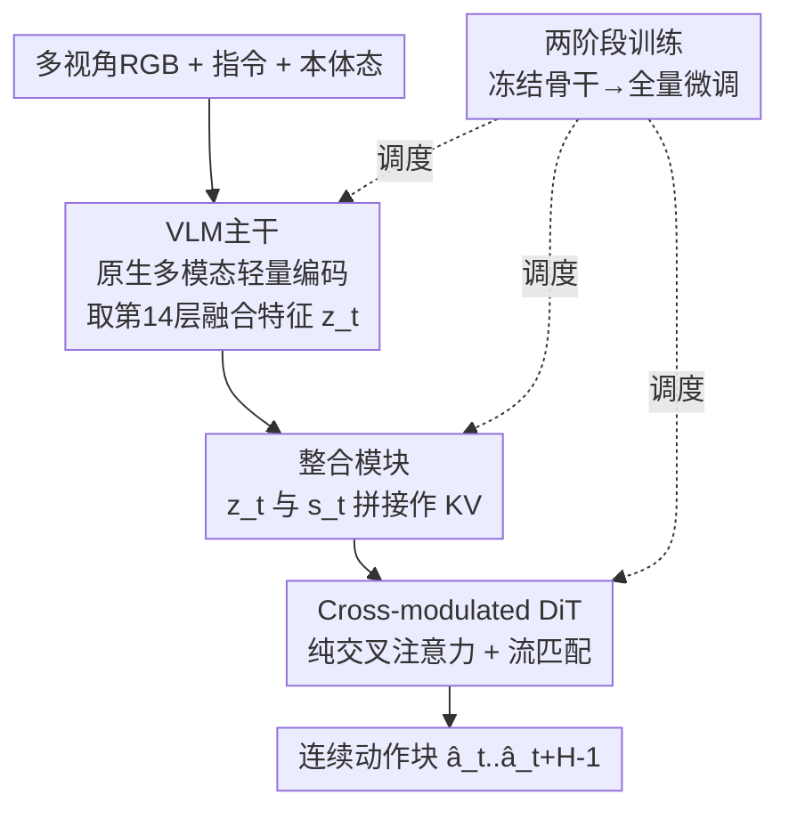

# Evo-1: Lightweight Vision-Language-Action Model with Preserved Semantic Alignment

**会议**: CVPR 2026  
**论文**: [CVF Open Access](https://openaccess.thecvf.com/content/CVPR2026/html/Lin_Evo-1_Lightweight_Vision-Language-Action_Model_with_Preserved_Semantic_Alignment_CVPR_2026_paper.html)  
**代码**: https://github.com/MINT-SJTU/Evo-1 (有)  
**领域**: 具身智能 / 视觉-语言-动作 (VLA)  
**关键词**: 轻量化VLA, 语义对齐保持, 流匹配扩散, 交叉注意力DiT, 两阶段训练  

## 一句话总结
Evo-1 用一个仅 0.77B 参数的原生多模态 VLM 当主干，配上纯交叉注意力的流匹配扩散动作专家和一套"先冻结后微调"的两阶段训练，在完全不做机器人数据预训练的前提下，靠保住 VLM 的语义空间在 Meta-World / RoboTwin / LIBERO 上拿到 SOTA，真机 78% 成功率且推理频率 16.4 Hz、显存仅 2.3 GB。

## 研究背景与动机
**领域现状**：视觉-语言-动作（VLA）模型把感知、语言、控制统一进一个多模态框架，让机器人能"看图听指令做动作"。主流路线（OpenVLA、π0、GR00T 等）是拿几十亿参数的大 VLM 当骨干，再在 OXE / DROID 这类大规模机器人数据上长时间预训练，泛化能力很强。

**现有痛点**：这条路有四个具体毛病。① 参数动辄几 B，训练和推理都吃显存、算力贵；② 计算量大导致控制频率低，真机交互时反应慢；③ 普遍用的端到端联合训练会**破坏 VLM 骨干的表征空间**，下游过拟合、泛化差；④ 强依赖大规模机器人数据预训练，而这种数据采集既贵又费人力。已有的轻量方案（TinyVLA、SmolVLA）参数压下去了，但复杂操作任务上的性能和鲁棒性明显不够看。

**核心矛盾**：这里有一个被忽视的张力——**保住预训练 VLM 的多模态语义** 与 **适配下游动作生成** 之间会打架。直接端到端联合训练，随机初始化的动作头会把带噪梯度反传进 VLM，把原本对齐好的视觉-语言注意力冲散（论文用注意力图直观展示了这种"语义漂移"）。

**本文目标**：在不做机器人数据预训练、参数 < 1B 的约束下，既要高成功率又要高推理频率，还要保住骨干的泛化能力。

**切入角度**：与其用"先纯文本 LLM 再后挂视觉对齐"的拼接式骨干，不如直接用**原生多模态**预训练的紧凑 VLM（InternVL3-1B），它的视觉-语言表征本就对齐紧密；再用一套训练调度避免动作头污染骨干。

**核心 idea**：用"原生多模态轻量骨干 + 纯交叉注意力流匹配动作专家 + 两阶段（冻结→微调）训练"三件套，把"语义对齐"当成第一优先级保护对象，从而在小参数、零机器人预训练下打平甚至超过大模型。

## 方法详解

### 整体框架
Evo-1 是一个模块化的 VLA：给定多视角 RGB 观测 $\{I_t^i\}_{i=1}^N$、语言指令 $L_t$ 和机器人本体状态 $s_t$，输出当前时刻的连续动作向量 $a_t \in \mathbb{R}^{d_a}$，整体映射写成 $a_t = f_{\text{Evo-1}}(\{I_t^i\}_{i=1}^N, L_t, s_t; \theta)$。它由三个核心组件串成一条"感知-语言-动作"流水线：① **VLM 主干**把图像+指令编码成融合表征 $z_t$；② **整合模块**把 $z_t$ 和本体态 $s_t$ 对齐拼接，喂给控制端；③ **Cross-modulated 扩散 Transformer**（动作专家）在这个条件下用流匹配生成未来一段连续动作。横切这条流水线的是一套**两阶段训练**：决定哪些部分先冻结、哪些后解冻，是"保住语义"能否成立的关键。

### 关键设计

**1. 原生多模态轻量主干：用对齐紧密的小 VLM 换掉拼接式大骨干**

针对痛点①②（参数大、频率低）和③（端到端破坏表征），Evo-1 直接选 InternVL3-1B 当骨干，而不是 OpenVLA 那种"文本 LLM 事后挂视觉"的拼接式 7B 骨干。InternVL3 在**单阶段原生多模态范式**下联合学视觉和语言，跨模态本就对齐得更好，所以同样的下游训练后，它的注意力图（论文 Fig.2）仍保持空间一致、语义聚焦，而 Prismatic-7B 已经明显漂移。具体地，视觉端用 InternViT-300M（从 InternViT-6B 蒸馏而来），每张 RGB 缩放到 448×448 后做 pixel-unshuffle 下采样把视觉 token 数降到 1/4，得到紧凑又保空间粒度的 patch 嵌入；语言端用 Qwen2.5-0.5B。融合时 InternVL3 把 patch 级图像嵌入替换进序列里的 `` 占位 token，再过共享解码器得到融合表征 $z_t = f_{\text{VLM}}(\{I_t^i\}, L_t)$。一个关键取舍是**只保留语言分支的前 14 层**——中间层被发现跨模态对齐最强，对视觉运动控制最有用，砍掉深层既省算力又不丢对齐信息。

**2. Cross-modulated 扩散 Transformer：纯交叉注意力的流匹配动作专家**

针对"如何高效、连贯地生成连续动作"，Evo-1 的动作专家是一个**只堆叠交叉注意力层**的 DiT，刻意去掉了 π0/SmolVLA 那种"自注意力与交叉注意力交替"的结构——作者后面消融证明这种交替会打断多模态信息的连续传播。它走流匹配（flow-matching）范式：学一个时间相关的速度场，把初始噪声逐步推向真值动作。训练时把真值动作 $A_t$ 和随机噪声 $\epsilon$ 线性插值

$$A_t^\tau = \tau A_t + (1-\tau)\epsilon,$$

其中插值权重 $\tau$ 从 Beta 分布采样并夹到 $[0.02, 0.98]$ 保证数值稳定。动作专家学一个以多模态上下文 $z_t$ 和状态 $s_t$ 为条件的速度场 $v_\theta$，优化目标是

$$\mathcal{L}^\tau(\theta) = \mathbb{E}\left[\,\left\| v_\theta(A_t^\tau, z_t, s_t) - u(A_t^\tau \mid A_t) \right\|^2\,\right],$$

$u(A_t^\tau \mid A_t)$ 是把 $A_t^\tau$ 推向 $A_t$ 的目标流方向。推理时一次预测一段长度为 $H$ 的动作块 $\hat A_t = f_{\text{AE}}(z_t, s_t, A_t^\tau)$。纯交叉注意力 + 动作分块让结构更紧凑、推理频率更高，这正是 16.4 Hz 的来源。

**3. 整合模块：中层特征与本体态"拼接"而非"投影"，保全信息**

针对"感知表征怎么接进控制端不丢信息"，整合模块从 VLM 的**第 14 层**取融合特征 $z_t$（中层语义，平衡视觉与语言），然后把 $z_t$ 与机器人本体态 $s_t$ **直接拼接**，而不是投影到一个共享嵌入空间——拼接保留了感知嵌入和本体态各自的完整信息。拼好的特征作为动作专家所有 DiT 层的 key-value 输入，噪声动作 $A_t^\tau$ 作 query 做交叉注意力，给动作生成提供一个全局、信息无损的条件上下文。论文消融里把它叫 Module A（Mid-Layer Cross-Attention），并和另外三种变体对比：B 在交叉注意力间插自注意力、C 逐层注入不同深度 VLM 特征、D 把 VLM 特征/状态/噪声动作一起拼成联合 KV——结果 A 因为**多模态信息传播最连续**而最优，B-D 都因打断了这种连续性而掉点。

**4. 两阶段训练：先冻结骨干对齐动作头，再全量微调，护住语义空间**

这是全文的灵魂设计，直接对应痛点③（端到端破坏表征）。直接端到端联合训练会让随机初始化的动作头把带噪梯度灌进 VLM，扭曲预训练语义、导致下游过拟合。Evo-1 拆成两步：**Stage 1（动作专家对齐）**——冻结整个 VLM 主干，只训整合模块和动作专家，让随机初始化的动作头先在不污染骨干的前提下，逐步对齐到多模态嵌入空间；**Stage 2（全量微调）**——等对齐稳定后再解冻 VLM，对整个架构联合微调，让骨干和动作头深度耦合、更好适配多样任务。作者用注意力可视化（Fig.7）佐证：两阶段训练后注意力仍清晰聚焦在物体和任务相关区域，而单阶段联合训练则注意力涣散、跑到无关区域。正因为护住了继承来的语义空间，模型才能在零机器人预训练下保持强泛化。

### 损失函数 / 训练策略
核心训练目标就是上面的流匹配 velocity 回归损失 $\mathcal{L}^\tau(\theta)$。训练调度即两阶段：Stage 1 冻 VLM 只训整合模块 + 动作专家，Stage 2 解冻全量微调。所有仿真任务每个任务约 50 条演示、真机每个任务 100 条遥操作演示，全程不依赖任何大规模机器人数据预训练。

## 实验关键数据

### 主实验
三大仿真基准（成功率 %，越高越好；Evo-1 仅 0.77B 且无机器人预训练）：

| 基准 | 指标 | Evo-1 (0.77B) | 之前最佳 | 提升 |
|------|------|------|----------|------|
| Meta-World | 平均成功率 | **80.6** | SmolVLA 68.2 (2.25B) | +12.4 |
| RoboTwin | 平均成功率 | **37.8** | π0 30.9 (3.5B) | +6.9 |
| LIBERO | 平均成功率 | **94.8** | π0 94.2 (3.5B) | +0.6 |

Meta-World 上四个难度（easy/medium/hard/very hard）全面领先，very hard 达 79.2%（SmolVLA 64.0）；LIBERO 在最难的 long 任务上 92.3%，明显高于多数会退化的基线；RoboTwin 的 Click Alarmclock 难档 58%（π0 仅 11%），展示出强双臂协调。

真机四任务（xArm6，每任务 20 试）+ 推理效率（RTX 4090d）：

| 模型 | 参数(B) | 显存(GB) | 推理频率(Hz) | 真机成功率(%) |
|------|---------|----------|--------------|---------------|
| SmolVLA | 0.45 | 2.0 | 12.7 | 50.0 |
| OpenVLA | 7.0 | 15.1 | 7.9 | 55.0 |
| π0 | 3.5 | 17.9 | 11.5 | 73.0 |
| **Evo-1** | **0.77** | **2.3** | **16.4** | **78.0** |

Evo-1 以约 π0 四分之一的参数，在显存、频率、成功率三项上都占优。

### 消融实验

| 配置 | 验证基准 | 结论 |
|------|---------|------|
| 整合模块 A（中层交叉注意力，本文） | LIBERO-Long | 最优——多模态信息传播最连续 |
| 整合模块 B（交叉+自注意力交替） | LIBERO-Long | 自注意力打断传播，掉点 |
| 整合模块 C（逐层注入不同深度特征） | LIBERO-Long | 各层条件不一致，掉点 |
| 整合模块 D（联合 KV 拼接） | LIBERO-Long | 条件特征跨层不一致，掉点 |
| 两阶段训练（本文） | Meta-World | 各难度全面优于单阶段 |
| 单阶段联合训练 | Meta-World | 注意力涣散、语义漂移，全面掉点 |

### 关键发现
- **"信息传播连续性"是整合模块成败的关键**：A 之所以赢，是因为同一份中层特征 + 状态被一致地喂给所有 DiT 层；B-D 要么插自注意力、要么各层用不同特征，破坏了这种连续性。
- **两阶段训练的收益主要来自"护住语义"**：注意力图直接显示单阶段会让模型注意到无关区域，两阶段则保持对物体/任务实体的聚焦——这解释了为什么它能在零机器人预训练下还泛化得好。
- **泛化鲁棒性**：真机 Pick-and-Place 干扰实验里，Evo-1 在未见干扰物（80% vs SmolVLA 65%）、背景变色（75% vs 60%）、目标位移/高度变化下全面优于 SmolVLA，base 场景 95%。
- **小骨干 + 原生多模态 > 大骨干 + 事后对齐**：InternVL3-1B 训练后注意力比 Prismatic-7B 更稳，印证了"原生对齐"对动作迁移的价值。

## 亮点与洞察
- **把"语义对齐"当成被保护的一等公民**：多数 VLA 默认端到端训练，本文反过来先冻结骨干、用注意力图量化"语义漂移"，把训练调度本身做成核心贡献，思路很干净。
- **纯交叉注意力 DiT 的反直觉选择**：去掉自注意力反而更好，背后逻辑是"别打断多模态条件的连续传播"——这个观察可迁移到其他条件扩散策略的结构设计。
- **拼接而非投影**：整合模块用 concat 保全 $z_t$ 与 $s_t$ 的完整信息，避免投影到共享空间造成的信息压缩，是个简单但有效的 trick。
- **工程友好**：0.77B + 2.3GB 显存 + 16.4Hz，能跑在消费级 GPU 上做实时控制，对落地很有意义。

## 局限与展望
- 论文未对各设计点做更细粒度的解耦（如"原生多模态骨干"与"两阶段训练"各自贡献多少），目前只能看到整体 SOTA。
- ⚠️ 真机泛化实验只在单一 Pick-and-Place 任务上做干扰，干扰类型（距离/高度/背景/干扰物）相对受控，是否覆盖更剧烈的分布漂移待验证。
- 第 14 层取特征、保留前 14 层语言分支这些超参带有经验性（"中间层对齐更强"引自他人工作），换骨干时是否仍最优需重新搜索。
- 仍依赖每任务数十~上百条演示，虽免了大规模机器人预训练，但 few-shot/zero-shot 到全新任务的能力尚未展示。

## 相关工作与启发
- **vs OpenVLA**：OpenVLA 用 7B Prismatic 骨干 + 离散动作建模 + OXE 大规模预训练；Evo-1 用 0.77B 原生多模态骨干 + 连续流匹配 + 零机器人预训练，参数小一个量级、注意力更稳，真机成功率 78% vs 55%。
- **vs π0**：π0 基于 PaliGemma + 流匹配动作专家，3.5B 且需机器人预训练；Evo-1 同样走流匹配但用纯交叉注意力 DiT、约 1/4 参数，仿真/真机均反超（Meta-World 80.6 vs 47.9，真机 78 vs 73）。
- **vs SmolVLA/TinyVLA**：同为亚十亿参数轻量 VLA，但它们在复杂操作上鲁棒性不足；Evo-1 靠"原生对齐骨干 + 护语义的两阶段训练"在难任务（very hard、LIBERO-long、RoboTwin hard）上拉开差距。

## 评分
- 新颖性: ⭐⭐⭐⭐ 组合式创新（原生骨干+纯交叉注意力DiT+两阶段训练），单点不算颠覆但"护语义"视角清晰
- 实验充分度: ⭐⭐⭐⭐⭐ 三仿真基准+真机四任务+效率/泛化/双消融，对比基线充分
- 写作质量: ⭐⭐⭐⭐ 结构清楚、注意力图佐证有力，部分设计动机偏经验性
- 价值: ⭐⭐⭐⭐⭐ 0.77B 实时可部署、零机器人预训练拿 SOTA，落地价值高且开源

<!-- RELATED:START -->

## 相关论文

- [\[AAAI 2026\] Continuous Vision-Language-Action Co-Learning with Semantic-Physical Alignment for Behavioral Cloning](../../AAAI2026/robotics/continuous_vision-language-action_co-learning_with_semantic-.md)
- [\[CVPR 2026\] Mantis: A Versatile Vision-Language-Action Model with Disentangled Visual Foresight](mantis_a_versatile_vision-language-action_model_with_disentangled_visual_foresig.md)
- [\[CVPR 2026\] Counterfactual VLA: Self-Reflective Vision-Language-Action Model with Adaptive Reasoning](counterfactual_vla_self-reflective_vision-language-action_model_with_adaptive_re.md)
- [\[CVPR 2026\] MergeVLA: Cross-Skill Model Merging Toward a Generalist Vision-Language-Action Agent](mergevla_cross-skill_model_merging_toward_a_generalist_vision-language-action_ag.md)
- [\[CVPR 2026\] Progress-Think: Semantic Progress Reasoning for Vision-Language Navigation](progress-think_semantic_progress_reasoning_for_vision-language_navigation.md)

<!-- RELATED:END -->
