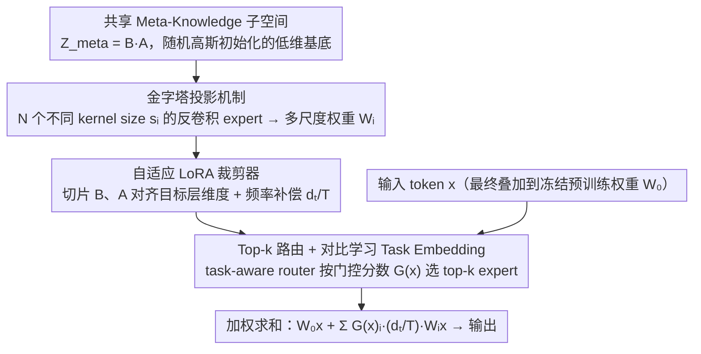

# Expert Pyramid Tuning: Efficient Parameter Fine-Tuning for Expertise-Driven Task Allocation

**会议**: CVPR 2026  
**arXiv**: [2603.12577](https://arxiv.org/abs/2603.12577)  
**代码**: [https://anonymous.4open.science/r/EPT-B0E4](https://anonymous.4open.science/r/EPT-B0E4)  
**领域**: 机器人  
**关键词**: [PEFT, LoRA, Mixture-of-Experts, 多尺度特征金字塔, 反卷积投影]

## 一句话总结
针对MoE-LoRA方法中所有expert结构相同（统一rank）导致无法适配不同复杂度任务的问题，提出EPT：通过共享meta-knowledge子空间 + 不同kernel size的反卷积expert构建参数金字塔，配合Adaptive LoRA Pruner和对比学习Task Embedding，在GLUE上以仅0.41M参数/任务达到87.0%平均分，超越所有MoE-LoRA变体。

## 研究背景与动机
**领域现状**：PEFT（特别是LoRA）已成为部署LLM到多任务场景的主流范式。为缓解多任务间梯度冲突导致的负迁移问题，MoE-LoRA方法（如MOELoRA、HydraLoRA、MoRE）通过门控机制将token路由到不同的低秩expert。

**现有痛点**：这些MoE-LoRA方法几乎都采用结构完全相同的expert——相同的rank、相同的capacity。但不同任务的复杂度差异很大：简单任务（如情感分类SST-2）只需高层语义抽象，复杂任务（如语言可接受性判断CoLA）需要精细的句法分析。作者用实验验证了这一观察：T5-base在不同GLUE任务上，最优rank差异显著（如MRPC最优rank=1，RTE最优rank=4，CoLA最优rank=8）。

**核心矛盾**：均匀架构的expert无法捕获多样化的特征粒度。低rank expert缺乏对复杂任务的表达力，高rank expert在简单任务上过参数化导致泛化差。而且每个expert独立学习各自的LoRA矩阵，参数间缺乏知识共享，导致参数冗余。

**本文目标**：(a) 如何让不同expert捕获不同粒度的特征？(b) 如何在expert间共享通用语言知识的同时保留任务特异性？(c) 如何准确路由token到合适的expert？

**切入角度**：借鉴CV中Feature Pyramid Network的多尺度思想——识别不同大小目标需要不同分辨率特征，类似地，处理不同复杂度的NLP任务需要不同粒度的参数适配。

**核心 idea**：用不同kernel size的反卷积算子从共享低维meta-knowledge子空间投影出多尺度参数金字塔，替代MoE-LoRA中各自独立的均匀expert。

## 方法详解

### 整体框架
EPT 要解决的是 MoE-LoRA「所有 expert 长得一模一样」的问题：既然不同任务需要不同粒度的适配，那 expert 本身就该有不同的容量。它替换 Transformer 线性层里的 LoRA 模块，但不再为每个 expert 各养一套独立的低秩矩阵，而是让所有 expert 共享同一个低维的 meta-knowledge 子空间 $\mathbf{Z}_{meta}$，再用不同 kernel size 的反卷积把这个子空间「放大」成不同尺度的权重增量。一个 token 进来，router 选出 top-k 个 expert，每个被选中的 expert 各自从 $\mathbf{Z}_{meta}$ 投影出权重增量 $\mathbf{W}_i$，按门控分数加权求和后叠加到预训练权重 $\mathbf{W}_0$ 上。整体形如一座「参数金字塔」：底座是共享的紧凑 meta-knowledge，往上则展开成多尺度的 expert 权重。下图按数据流串起四个核心模块——子空间提供基底，金字塔投影把它放大成多尺度权重，裁剪器对齐目标层维度，路由器再挑选并加权融合：

### 关键设计

**1. 共享 Meta-Knowledge 子空间：用一个低维基底喂饱所有 expert**

传统 MoE-LoRA 给每个 expert 各配一套独立的 LoRA 矩阵，参数互相不通气，既冗余又学不到跨任务的共性。EPT 的做法是只维护一个共享基底 $\mathbf{Z}_{meta} = \mathbf{B} \cdot \mathbf{A}$（$\mathbf{A} \in \mathbb{R}^{R \times W_{max}}$，$\mathbf{B} \in \mathbb{R}^{H_{max} \times R}$，且 $h, w \ll d_{model}$），所有 expert 都从这块基底出发，区别只在于各自用什么方式去「解读」它——就像多个观察者从不同分辨率看同一张图。一个容易被忽略但关键的细节是 $\mathbf{A}$、$\mathbf{B}$ 都用随机高斯初始化，而非标准 LoRA 的零初始化：这样训练一开始 $\mathbf{Z}_{meta}$ 就携带非退化、信息丰富的隐表示，给后续的反卷积投影一个有内容的起点，而不是从零慢慢长。

**2. 金字塔投影机制：让 expert 真正拥有不同的尺度**

这是全文的核心创新，直接针对「均匀 rank 抓不住多样化粒度」的痛点。EPT 定义 $N$ 个反卷积 expert，第 $i$ 个 expert 的 kernel tensor $\mathcal{K}_i$ 配一个不同的 kernel size $s_i$（stride 同样设为 $s_i$），投影过程 $\mathbf{W}_i = \text{Deconv}(\mathbf{Z}_{meta}; \mathcal{K}_i)$ 把同一个低维基底放大成不同尺寸的权重矩阵。kernel 小的 expert 参数少、聚焦局部细粒度模式，kernel 大的 expert 参数多、覆盖全局长程语义——这才是「真·多尺度」，而标准 MoE-LoRA 的同 rank expert 不过是同一分辨率的若干副本。实现里用 8 个 expert，尺度配为 $\{2,2,4,4,6,6,8,8\}$。这个设计与 CV 里的 FPN 同源：FPN 用不同层的特征图对应不同尺度的目标，EPT 则用不同 kernel size 的反卷积从同一 meta-knowledge 里抽出不同粒度的参数适配。每个 kernel $\mathcal{K}_i$ 采用零初始化，保证训练初期不扰动预训练权重。

**3. 自适应 LoRA 裁剪器：把任意尺度的输出对齐到目标层维度**

反卷积投影出来的权重尺寸由 kernel 决定，但 Transformer 不同层的目标维度并不统一（attention 投影和 FFN 的维度差异就很大），直接套上去会对不齐。裁剪器的处理很直接：对目标粒度 $(h_t, w_t)$，从完整的 $\mathbf{B}$、$\mathbf{A}$ 里切前 $h_t$ 行、前 $w_t$ 列，得到 $\mathbf{Z}_{meta}^{(t)} = \mathbf{B}_{:h_t,:} \cdot \mathbf{A}_{:,:w_t}$ 这个 $h_t \times w_t$ 的 scale-specific meta-seed，让同一块 meta-knowledge 能灵活适配到任意目标维度。更微妙的是它顺带解决了多任务优化的不均衡：均匀采样下 shared 参数每步都更新（频率为 1），而 task-specific 参数只有对应任务被采样时才更新（频率 1/T），两者梯度能量严重失衡。EPT 引入一个维度感知缩放因子 $d_t/T$，把前向写成

$$\mathbf{L} = \mathbf{W}_0 \mathbf{x} + \sum_{i \in \mathcal{P}} G(x)_i \cdot \frac{d_t}{T} \cdot (\mathbf{W}_i \mathbf{x})$$

用这个系数把两类参数的更新能量拉平，避免 shared 维度被高频更新的振荡淹没。

**4. Top-k 路由 + 对比学习 Task Embedding：让路由听得懂任务**

标准 MoE 路由只看 token 特征 $G(x)_i = \text{softmax}(\mathbf{W}_r \cdot x / \tau)$，选出 top-k（这里 $k=2$）个 expert，但它对「这个 token 属于哪个任务、任务间是什么关系」几乎不建模，容易把不同任务的 token 混着路由。EPT 额外为每个任务学一个 embedding $\mathbf{e}_t$，用对比损失 $\mathcal{L}_{con} = -\frac{1}{M}\sum_i \log \frac{e^{s_{i,t_i}}}{\sum_k e^{s_{i,k}}}$ 把同任务样本拉向自己的 task embedding、推开其它任务的 embedding，显式地把任务间的相关性和差异性编码进路由信号。效果在 PCA 可视化里很直观：QNLI 和 MNLI（同属 NLI）的 embedding 聚成一团，而 CoLA 和 STS-B（任务性质迥异）则明显分开。这一项以 $\lambda = 0.1$ 的权重并入总损失 $\mathcal{L}_{total} = \mathcal{L}_{gen} + \lambda \mathcal{L}_{con}$。

### 损失函数 / 训练策略
- 总损失 $\mathcal{L}_{total} = \mathcal{L}_{gen} + \lambda \mathcal{L}_{con}$，其中 $\mathcal{L}_{gen}$ 为标准自回归生成损失，$\mathcal{L}_{con}$ 为对比学习损失，$\lambda = 0.1$
- 优化器：AdamW，峰值学习率 $3 \times 10^{-4}$，线性衰减 + 500步warmup
- 训练5个epoch，batch size 32，最大序列长度128
- 温度参数 $\tau = 0.05$（控制路由分布的平滑度）
- 均衡数据采样：每个任务以 $P_t = 1/T$ 概率被采样，避免大数据集主导训练
- re-parameterization：推理时可将反卷积投影的结果合并回预训练权重，无额外推理开销

## 实验关键数据

### 主实验（GLUE Benchmark, T5-base）

| 方法 | 参数/任务 | MNLI | QQP | QNLI | SST-2 | STS-B | MRPC | RTE | CoLA | AVG |
|------|-----------|------|-----|------|-------|-------|------|-----|------|-----|
| LoRA (r=8) | 0.39M | 85.8 | 89.2 | 93.1 | 93.2 | 90.4 | 89.9 | 76.3 | 62.8 | 85.1 |
| MOELoRA | 0.81M | 86.3 | 90.4 | 93.2 | 94.2 | 89.8 | 90.7 | 79.9 | 65.3 | 86.2 |
| MoRE | 0.81M | 85.6 | 90.2 | 93.1 | 93.9 | 89.9 | 90.7 | 77.7 | 68.7 | 86.2 |
| **EPT** | **0.41M** | **86.4** | 90.2 | **93.6** | **94.5** | 90.0 | **90.7** | **82.0** | **68.9** | **87.0** |

### 常识推理（LLaMA2-7B）

| 方法 | 参数/任务 | BoolQ | OBQA | ARC-E | ARC-C | AVG |
|------|-----------|-------|------|-------|-------|-----|
| LoRA | 2.1M | 74.0 | 74.0 | 80.9 | 63.5 | 73.1 |
| MoRE | 4.5M | 74.7 | 80.5 | 80.0 | 64.5 | 74.9 |
| **EPT** | **3.3M** | 76.1 | 78.4 | **81.4** | **66.2** | **75.5** |

### 消融实验

| AB init | Top-K | ALP | AVG |
|---------|-------|-----|-----|
| ✗ | ✗ | ✗ | 86.0 |
| ✗ | ✗ | ✓ | 86.2 |
| ✓ | ✗ | ✓ | 86.5 |
| ✗ | ✓ | ✓ | 86.7 |
| ✓ | ✓ | ✓ | **87.0** |

三个组件各贡献约0.3-0.5分提升，联合使用时效果最佳。

### 金字塔结构对比

| 配置 | 描述 | AVG |
|------|------|-----|
| EPT-2 | 所有expert dim=2 | 86.5 |
| EPT-4 | 所有expert dim=4 | 86.2 |
| EPT-8 | 所有expert dim=8 | 86.3 |
| EPT-2468 | 混合{2,2,4,4,6,6,8,8} | **87.0** |

混合多尺度配置稳定优于任何统一尺度配置。

## 亮点
- **参数金字塔概念新颖**：将CV的FPN多尺度思想迁移到PEFT领域，用不同kernel size的反卷积构建multi-scale expert——这一类比精准且有效
- **参数效率极高**：仅0.41M参数/任务（约为MOELoRA的一半），却达到最佳性能。根本原因是所有expert共享meta-knowledge，独立参数仅为kernel tensor
- **re-parameterization能力**：推理时反卷积结果可合并回预训练权重，无额外延迟——这对部署至关重要
- **expert分配可视化有说服力**：QNLI/QQP（大数据集复杂任务）激活高维expert 7-8，STS-B/RTE（小数据集简单任务）激活低维expert 1-2，完美验证了方法假设
- **频率补偿因子设计巧妙**：$d_t/T$ 平衡shared和task-specific参数的梯度能量，是多任务优化中被广泛忽视的问题

## 局限与展望
- expert维度配置 $\{2,2,4,4,6,6,8,8\}$ 是静态超参数——通过NAS或autoML动态搜索最优配置可能进一步提升
- 评测限于NLU（GLUE + 常识推理），缺少生成任务（如摘要、翻译）的验证——PEFT在生成任务上的行为可能不同
- 仅在T5-base和LLaMA2-7B上实验，缺少更大模型（13B/70B）的可扩展性验证
- 对比学习task embedding需要任务标签——在task-agnostic场景（如持续学习、混合prompt）中不直接适用
- 反卷积操作虽然参数少，但训练时仍需执行反卷积计算——对比简单矩阵乘法的LoRA，训练速度的量化对比缺失

## 与相关工作的对比
- **vs 标准LoRA**：LoRA用统一rank的BA分解，EPT用多尺度反卷积投影。LoRA每个任务需独立adapter，EPT通过shared meta-knowledge + routing实现多任务共享
- **vs MOELoRA / MoRE**：这些方法用多个独立的LoRA作为expert（结构相同、参数独立），EPT让所有expert共享meta-knowledge基础并通过不同scale投影——参数更少（0.41M vs 0.81M）性能更好
- **vs HydraLoRA**：HydraLoRA通过共享B矩阵 + 独立A矩阵减少冗余，但expert架构仍然统一。EPT更进一步——不仅共享基础，还引入多尺度结构
- **vs DyLoRA / AdaLoRA**：这些方法通过动态rank分配适配不同任务，但限于单任务场景且实现复杂。EPT通过参数金字塔在multi-task框架中自然实现了rank自适应
- **vs DCFT**：同样使用反卷积做子空间投影，但DCFT是单expert单任务设计。EPT将反卷积扩展为multi-scale multi-expert架构

## 启发与关联
- **参数金字塔→视觉PEFT**：同样的思路可以迁移到ViT的PEFT——不同visual task（分类vs检测vs分割）可能也需要不同粒度的参数适配
- **meta-knowledge共享→联邦学习**：shared $\mathbf{Z}_{meta}$ + task-specific kernel的结构天然适合联邦学习——客户端只需传输小的kernel参数，meta-knowledge在服务器端聚合
- **反卷积投影的灵活性**：反卷积的kernel size/stride可以被看作连续化的rank选择——未来可以将kernel参数也纳入routing，实现更细粒度的capacity分配

## 评分
- 新颖性: ⭐⭐⭐⭐ FPN→PEFT的类比巧妙，反卷积投影构建参数金字塔是新设计，但各组件单独看并非全新
- 实验充分度: ⭐⭐⭐⭐ GLUE 8任务 + 常识推理4任务 + 完整消融 + expert分配可视化，但缺少生成任务和大模型验证
- 写作质量: ⭐⭐⭐⭐ 动机推导清晰（Table 1展示不同任务最优rank不同），方法描述系统化
- 价值: ⭐⭐⭐⭐ 0.41M参数达87.0% GLUE平均分是很强的结果，re-parameterization推理零开销使其实用性强

<!-- RELATED:START -->

## 相关论文

- [\[NeurIPS 2025\] PROFIT: A Specialized Optimizer for Deep Fine Tuning](../../NeurIPS2025/robotics/profit_a_specialized_optimizer_for_deep_fine_tuning.md)
- [\[CVPR 2026\] Test-Time Perturbation Tuning with Delayed Feedback for Vision-Language-Action Models](test-time_perturbation_tuning_with_delayed_feedback_for_vision-language-action_m.md)
- [\[CVPR 2026\] Learning to See and Act: Task-Aware Virtual View Exploration for Robotic Manipulation](learning_to_see_and_act_task-aware_virtual_view_exploration_for_robotic_manipula.md)
- [\[CVPR 2026\] LEAD: Minimizing Learner-Expert Asymmetry in End-to-End Driving](lead_minimizing_learner-expert_asymmetry_in_end-to-end_driving.md)
- [\[CVPR 2026\] DextER: Language-driven Dexterous Grasp Generation with Embodied Reasoning](dexter_language-driven_dexterous_grasp_generation_with_embodied_reasoning.md)

<!-- RELATED:END -->
