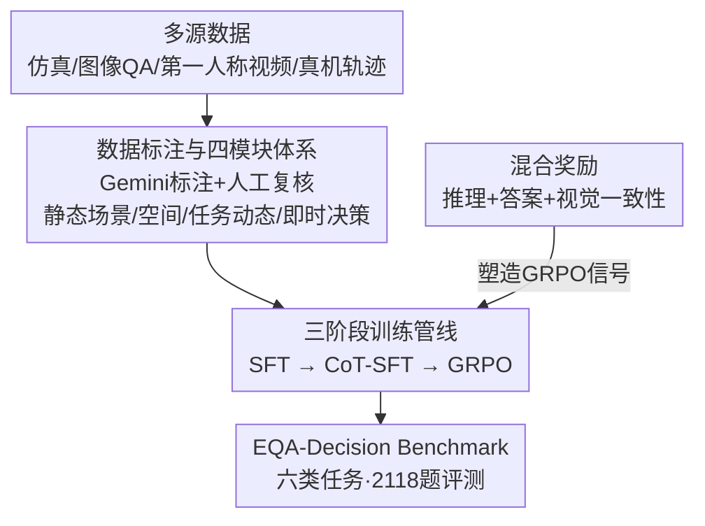

# Extending Embodied Question Answering from Perception to Decision

**会议**: CVPR 2026  
**论文**: [CVF Open Access](https://openaccess.thecvf.com/content/CVPR2026/html/Gong_Extending_Embodied_Question_Answering_from_Perception_to_Decision_CVPR_2026_paper.html)  
**代码**: 待确认  
**领域**: 机器人 / 具身智能  
**关键词**: 具身问答, 多模态大模型, 决策推理, GRPO, 数据集与基准  

## 一句话总结
本文构建了 400 万级的具身问答数据集 EQA-Decision（覆盖静态场景、空间理解、任务动态、即时决策四大模块九个子任务），并基于 Qwen3-VL-8B 用「SFT→CoT-SFT→GRPO + 混合奖励」三阶段训练出强基线 RoboDecision，把具身 QA 从"看到了什么"推进到"此刻该做什么"，在自建 benchmark 六类任务上整体分数从 48.84 提到 68.06。

## 研究背景与动机
**领域现状**：多模态大模型（GPT-4V、Gemini-2.5、Qwen2.5-VL）让具身智能快速发展，研究者纷纷把 MLLM 搬进机器人/具身环境，催生了一批评测感知与推理的数据集和 benchmark。

**现有痛点**：现有具身 QA 数据集"各管一段"——有的只测空间理解，有的只测程序化规划，都偏向**静态感知或孤立的单项推理技能**（空间 grounding、planning），缺一个统一的大规模框架做全面评测。更关键的是，它们几乎都忽略了 agent 与动态环境交互时**随时间展开的决策过程**。

**核心矛盾**：真正的具身智能需要的是"此刻该做什么"的即时决策，而这依赖于把感知、推理、动作随时间联动起来建模。现有 benchmark 没有对这个时序演化过程显式建模，自然也就**无法刻画即时决策**这一具身智能的核心能力。

**本文目标**：(1) 造一个统一、大规模、能同时覆盖感知→空间→时序→决策的具身 QA 数据集与 benchmark；(2) 给出一个能真正把"感知"接到"决策"的强基线模型。

**切入角度**：作者把具身推理沿"从感知到决策"这条轴拆成四个互补维度，并引入两类此前没有的新任务形式——**进度分析（progress estimation）**和**上下文感知的即时决策（instant decision）**，让评测能考察 agent 对时序动态的推理和实时调整动作的能力。

**核心 idea**：用"分层任务体系 + 视觉接地的强化奖励"把具身 QA 从静态感知扩展到时序决策——数据上系统覆盖四模块九子任务，模型上用混合奖励强迫推理锚定在画面证据而非文本先验。

## 方法详解

### 整体框架
全文是"数据集 + 基线模型 + benchmark"三位一体。**数据侧**：从仿真环境、图像 QA、第一人称视频、真机轨迹四类来源汇集原始数据，用 Gemini-2.5-pro 辅助标注 + 人工复核，构造出按四大模块/九子任务分层组织的 EQA-Decision 数据集（>400 万 QA 对，约 10% 样本带 CoT 标注）。**模型侧**：以 Qwen3-VL-8B 为底座，经 SFT→CoT-SFT→GRPO 三阶段训练，并在全程施加"推理 + 答案 + 视觉一致性"的混合奖励，得到 RoboDecision。**评测侧**：在与训练集严格不相交的 EQA-Decision Benchmark（六类任务、2118 题）上对比开/闭源 VLM 与具身基线。

### 关键设计

**1. 分层任务体系：把具身 QA 沿"感知→决策"轴拆成四模块九子任务**

针对"现有数据集只覆盖单项技能、忽略决策过程"的痛点，作者把具身推理系统拆成四个互补模块，再细分九个子任务：**静态场景构建**（存在与状态、计数与定位）→ **空间理解**（深度与方向、grounding 与指代、affordance）→ **任务动态推理**（子任务规划、状态跟踪与因果、进度估计）→ **即时决策**。前两个模块对应传统"看到了什么"的感知，后两个模块是本文新增的时序/决策能力。每个子任务都有专门的标注流水线：例如**进度估计**用 AgiBot/Open X-Embodiment 轨迹按速度和方向变化切成运动阶段，再由帧索引算出归一化进度比；**即时决策**则在相邻标注间隔 ≤5 秒的连续动作段里随机采"中间过渡帧"，让 Gemini 结合前后标注与整体任务描述总结当前步骤、完成状态、agent 与物体的空间关系，生成上下文感知的"下一步动作"QA。最终 400 万 QA 中，深度与方向（1.1M）、状态跟踪与因果（0.93M）、即时决策（1.0M）占主体，刻意向空间、时序、决策倾斜。和 Robo2VLM/RoboVQA/ShareRobot 相比（见表 1），只有 EQA-Decision 同时覆盖全部九子任务且**带 CoT 标注**。

**2. 三阶段渐进训练：先注知识、再学推理、最后接地决策**

针对"SFT 模型容易依赖文本先验、即使视觉变了也输出雷同答案"的问题，作者用一条从浅到深的三阶段管线逐步逼近决策能力。**Stage 1 SFT**：从 Qwen3-VL-8B-Instruct 出发，用 LoRA 微调，冻结视觉编码器保稳定，只优化语言层和融合层；训练数据从四模块**均匀采样**，目的是注入具身领域知识、打基础空间/时序/决策推理。**Stage 2 CoT-SFT**：均匀抽约 10% 数据，用 Gemini-2.5-pro 生成含 rationale 和 answer 两个字段的 CoT 标注，仅在这个子集上继续 LoRA 微调，让模型学会跨空间/时序构造连贯多步推理链，同时为后续 GRPO 提供 warm start 并稳定奖励信号。**Stage 3 GRPO**：用 Group Relative Policy Optimization 做强化微调，靠混合奖励（见设计 3）显式鼓励画面接地的推理，把模型从"文本驱动的应答器"扭转成"感知引导的决策者"。三阶段的分工在消融里很清晰——CoT-SFT 主管多步推理（去掉后 grounding/时序大幅塌），GRPO 主管决策优化（去掉后空间理解、grounding、即时决策都明显下滑）。

**3. 混合奖励：用三路信号把推理钉在画面上**

这是 GRPO 阶段的核心，专治"模型空想、推理飘离画面"。奖励是三项加权和：

$$R_{total} = \alpha R_{reason} + \beta R_{answer} + \gamma R_{visual}$$

其中 $\alpha,\beta,\gamma$ 是随任务类型自适应变化的权重。三项各司其职：$R_{reason}$ 衡量推理链的连贯性与因果合理性——把模型生成的推理 trace 和参考 CoT 都用 E5-large 编码，取余弦相似度，鼓励反映因果关系、空间论证和时序依赖的结构化推理；$R_{answer}$ 衡量答案正确性——自由文本答案用 E5-large 嵌入算语义相似度，对坐标/包围框/深度值这类**结构化输出**则用基于规则的打分函数；$R_{visual}$ 是关键的视觉一致性项——用 OpenCLIP 算视觉观测嵌入与生成推理嵌入的相似度，只有当推理**真实反映画面里有什么**时才给高分，从而把思考过程锚在感知证据上、不让它滑向文本偏见。三项联合优化，让模型学会直接从图像推理、生成能适配空间布局与场景动态的决策。

## 实验关键数据

### 主实验
EQA-Decision Benchmark 六类任务、共 2118 题（静态场景 264、空间深度 314、grounding-指代 200、时序 338、规划 480、即时决策 522），与训练集严格不相交。grounding/指代在像素空间评测（预测点/框与 GT mask 的平均重叠），其余任务用 GPT-5 做 LLM-Match（1–5 分线性映射到 [0,100]）。

| 模型 | Overall | 静态场景 | 空间-深度 | Grounding-指代 | 时序推理 | 规划推理 | 即时决策 |
|------|---------|----------|-----------|----------------|----------|----------|----------|
| Gemini-2.5-Pro | — | 56.54 | 47.56 | 17.42 | 56.35 | 47.56 | 48.68 |
| GPT-5 | — | 47.75 | 45.25 | 25.72 | 54.52 | 62.25 | 51.03 |
| Qwen3-VL-8B-Instruct | — | 54.84 | 35.51 | 23.98 | 54.02 | 54.27 | 48.84 |
| RoboBrain-7B-2.0 | — | 25.62 | 61.93 | 19.25 | 33.70 | 41.90 | 37.32 |
| **RoboDecision-8B** | **81.55** | **70.82** | **68.12** | **52.95** | **65.02** | **69.93** | **68.06** |

> ⚠️ 原文 Table 2 第一列"Overall"与各模块列的对齐略显错位（如 RoboDecision 的 Overall 标 81.55、即时决策 68.06，而正文又把整体得分写作 68.06），数值以原文为准；这里按正文叙述理解为 RoboDecision 整体 68.06、各模块分项如上。无论怎么对齐，结论一致：RoboDecision 在六类任务上全面领先。正文给出的关键对比是：相比 Qwen3-VL-8B-Instruct，整体从 **48.84 → 68.06**，最大涨幅在 grounding-指代、时序阶段识别、规划推理；并大幅超过具身基线 RoboBrain-7B-2.0（整体 37.32）。

跨 benchmark 泛化（表 3）：在 RoboVQA（长程机器人 VQA）、ERQA（细粒度具身推理）、Where2Place（自由空间放置）上 RoboDecision 同样领先。

| 模型 | RoboVQA BLEU-4 | ERQA (All) | Where2Place (All) |
|------|----------------|-----------|--------------------|
| Gemini-2.5-Pro | 23.63 | 48.70 | 18.11 |
| GPT-5 | 24.92 | 49.95 | 25.58 |
| Qwen3-VL-8B-Instruct | 18.64 | 42.50 | 32.45 |
| RoboBrain-7B-2.0 | 12.20 | 39.44 | 63.59 |
| **RoboDecision-8B** | **43.55** | **54.50** | **67.08** |

### 消融实验
表 4 同时拆训练阶段（去 GRPO / 去 CoT）和数据模块（去 Scene/Spatial/Task/Decision），指标为各模块得分及 Overall。

| 配置 | Overall | 关键变化 |
|------|---------|----------|
| Full | 68.06 | 完整模型 |
| w/o GRPO | 59.85 | 整体掉 8.2，空间-深度 70.82→60.91、即时决策 69.93→59.44 受损最重 |
| w/o CoT | 54.52 | 整体掉 13.5，最伤；grounding 68.12→44.27、时序 52.95→31.46 几近腰斩 |
| w/o Scene 数据 | 66.18 | 主要影响场景感知，对其他模块影响温和 |
| w/o Spatial 数据 | 59.16 | 空间-深度 70.82→58.17、grounding 68.12→41.72 大跌 |
| w/o Task 数据 | 60.74 | 时序 52.95→42.74、规划 65.02→56.53 下滑 |
| w/o Decision 数据 | 64.61 | 即时决策 69.93→55.84 受损最重 |

### 关键发现
- **CoT-SFT 比 GRPO 更"伤不起"**：去掉 CoT 整体掉 13.5、去掉 GRPO 掉 8.2，说明结构化推理监督是多步/grounding/时序能力的地基；GRPO 则在地基上专攻空间理解与即时决策。
- **即时决策有强烈跨模块依赖**：去掉 Spatial 或 Task 数据都会拖累即时决策，印证"可靠决策需要同时整合空间布局、时序线索、任务进度"——任何单一证据都不够。
- **数据模块各司其职、互补而非冗余**：去哪个模块就主要伤对应能力（Spatial→空间、Task→时序、Decision→即时决策），而 Scene 数据除了利于场景感知外，对即时决策/时序也有小幅正迁移。
- 定性分析（图 4）显示：去 spatial 数据会误判物体位置、过早出手；去 task 数据会误读任务所处阶段、选错下一步——与定量消融的依赖模式完全吻合。

## 亮点与洞察
- **把"决策"显式拆出来当一等公民**：以往具身 QA 把重心放在"描述可见内容"，本文新增 progress estimation 和 context-aware instant decision 两类任务，逼着模型在动态过程里推理"此刻该做什么"，这是数据层面最有价值的延展。
- **视觉一致性奖励是点睛之笔**：用 OpenCLIP 算"推理文本 ↔ 画面"的相似度作为奖励，直接对治 VLM "推理脱离画面、靠文本先验空想"的顽疾——这个 trick 可迁移到任何需要"思维锚定证据"的多模态 RL 场景。
- **三阶段分工被消融讲清楚了**：CoT-SFT 给推理打底、GRPO 接地决策，不是简单堆训练步骤，而是各自负责不同能力维度，结论可复用为具身 VLM 的训练范式。
- **即时决策的跨模块依赖**是个有洞察的实证：决策不是单点能力，而是空间+时序+任务进度的合成，提示后续工作不能只刷单项 benchmark。

## 局限与展望
- **强依赖 Gemini-2.5-pro 做标注**：四模块的 QA 几乎都由 Gemini 生成（仅随机人工抽检复核），数据质量上限受教师模型限制，且评测又用 GPT-5 做 LLM-Match，存在"用强 VLM 评 VLM"的潜在偏置。
- **奖励权重 $\alpha,\beta,\gamma$ 自适应的具体规则未在正文交代**（称"随任务类型变化"），复现性打折，细节需看补充材料。
- **进度估计的标注较粗**：用速度/方向变化切运动阶段、按帧索引算归一化进度比，对非匀速或多阶段交错的任务，进度的"真值"本身可能含噪。⚠️ 这是笔者基于方法描述的推断。
- **仍是离线 QA、未闭环到真机控制**：RoboDecision 输出的是语言形式的"下一步动作"，论文未验证把它接到低层控制器后在真机上的执行成功率，"感知→决策"之后还差"决策→执行"一环。

## 相关工作与启发
- **vs RoboVQA / Robo2VLM / ShareRobot**：它们把 EQA 从导航/场景推进到操作与任务理解，但每个只覆盖少数推理维度、且无 CoT 标注；本文在维度覆盖（九子任务全覆盖）和带 CoT 监督上都更全，并新增进度/即时决策两类时序任务。
- **vs 通用 VLA 系统**：早期 VLA 做"输入→动作"直映射或短程决策，长程规划/因果推理/自适应重规划探索不足；本文走的是"VLM 推理 + 强化奖励接地"路线，强调可解释的多步推理而非端到端动作回归。
- **vs RoboBrain-2.0 等具身基线**：RoboBrain 在某些空间/放置任务（如 Where2Place 63.59）上仍强，但在需要时序与多步规划的综合 benchmark 上整体落后 RoboDecision（37.32 vs 68.06），说明专项强不等于决策能力强。

## 评分
- 新颖性: ⭐⭐⭐⭐ 数据集的四模块/九子任务体系 + 视觉一致性奖励组合有新意，但单个组件（GRPO、CoT-SFT、Gemini 标注）都是已有范式的拼装。
- 实验充分度: ⭐⭐⭐⭐ 主表覆盖开/闭源/具身基线，跨三个外部 benchmark 验证泛化，消融同时拆训练阶段与数据模块，较扎实；Table 2 列对齐存疑略减分。
- 写作质量: ⭐⭐⭐⭐ 动机和管线讲得清楚，框架图直观；但奖励权重等关键细节甩给补充材料。
- 价值: ⭐⭐⭐⭐ 400 万级带 CoT 的决策导向具身 QA 数据集 + 统一 benchmark + 强基线，对推动"感知到决策"研究有实打实的基础设施价值。

<!-- RELATED:START -->

## 相关论文

- [\[CVPR 2026\] Predict Before You Explore: Predictive Planning with Specialized Memory for Embodied Question Answering](predict_before_you_explore_predictive_planning_with_specialized_memory_for_embod.md)
- [\[CVPR 2026\] OctoNav: Towards Generalist Embodied Navigation](octonav_towards_generalist_embodied_navigation.md)
- [\[CVPR 2026\] CUBic: Coordinated Unified Bimanual Perception and Control Framework](cubic_coordinated_unified_bimanual_perception_and_control_framework.md)
- [\[CVPR 2026\] ProFocus: Proactive Perception and Focused Reasoning in Vision-and-Language Navigation](profocus_proactive_perception_and_focused_reasoning_in_vision-and-language_navig.md)
- [\[CVPR 2026\] CycleManip: Enabling Cycle-based Manipulation via Effective History Perception and Understanding](cyclemanip_enabling_cycle-based_manipulation_via_effective_history_perception_an.md)

<!-- RELATED:END -->
