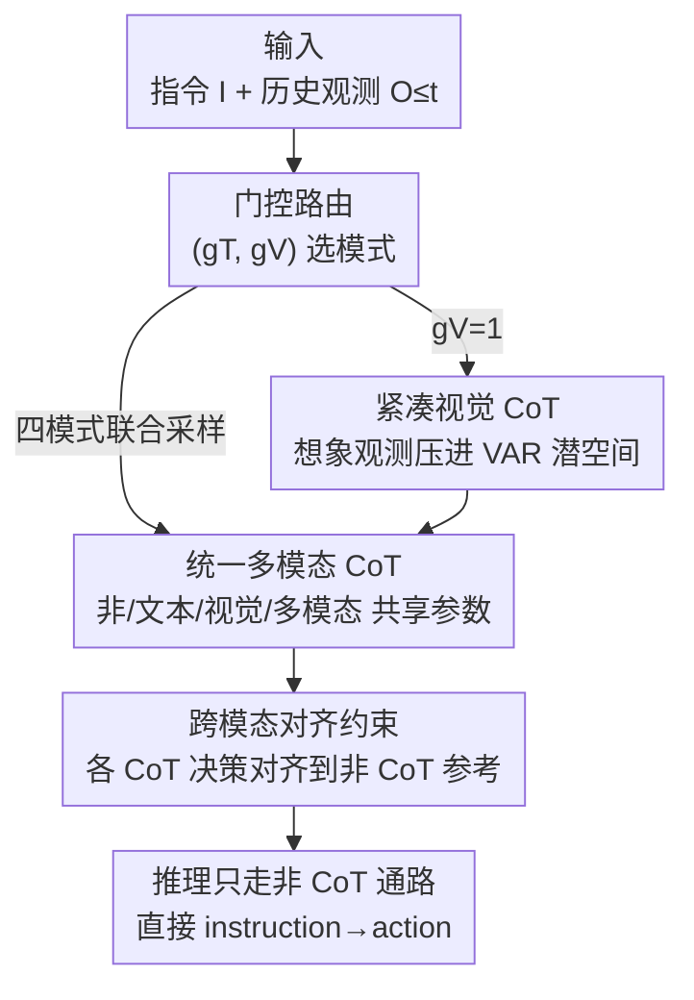

# FantasyVLN: Unified Multimodal Chain-of-Thought Reasoning for Vision-and-Language Navigation

**会议**: CVPR 2026  
**论文**: [CVF Open Access](https://openaccess.thecvf.com/content/CVPR2026/html/Zuo_FantasyVLN_Unified_Multimodal_Chain-of-Thought_Reasoning_for_Vision-and-Language_Navigation_CVPR_2026_paper.html)  
**代码**: https://github.com/Fantasy-AMAP/fantasy-vln  
**领域**: 机器人 / 具身智能（视觉语言导航 VLN）  
**关键词**: 视觉语言导航, 多模态CoT, 隐式推理, VAR潜空间, 跨模态对齐

## 一句话总结
FantasyVLN 让一个 VLN 模型在训练时同时学文本、视觉、多模态三种思维链（CoT），并把"想象的未来观测"压进 VAR 潜空间避免 token 爆炸，再用跨模态对齐约束把这些推理能力蒸馏进"不出 CoT 的直接决策"通路，从而在推理时直接 instruction→action、零显式推理开销，却仍保留推理能力，在长程导航 LH-VLN 上 SR 从次优的 0.65 提到 2.44、推理延迟比显式 CoT 快约一个数量级。

## 研究背景与动机

**领域现状**：视觉语言导航（VLN）要求具身智能体读懂自然语言指令、感知多视角视觉观测，并对长动作序列做规划。近期工作（NavCoT、NavGPT-2、OctoNav-R1、CoT-VLA）把思维链推理引入导航，提升了可解释性和长程规划能力，被视为通向"类人导航推理"的有希望路径。

**现有痛点**：现有 CoT 导航存在一道二选一的死结。纯文本 CoT（NavCoT、NavGPT-2、Aux-Think）把视觉观测翻译成 caption 再推理，丢掉了真实视觉感知，且容易过拟合到稀疏的人工标注推理步骤、泛化差——VLN 里一条指令往往有多条合法动作序列，CoT 监督本身极难标。多模态 CoT（CoT-VLA、WorldVLA）会在每一步显式生成"想象的未来观测"，导致 token 爆炸：一个跨 5–7 个动作的推理步会膨胀到 3k–5k token，比纯文本 CoT（通常 <500 token）大一个数量级，即使在高端 GPU 上也无法实时导航。

**核心矛盾**：CoT 的"推理质量"和导航的"实时性 + 泛化性"之间存在结构性冲突——想要视觉感知就得显式生成图像 token 付出延迟代价，想要省 token 就只能退回纯文本丢掉视觉；而显式 CoT 监督又天然过拟合。

**本文目标**：在不增加推理期 token 开销的前提下，保留 CoT 推理（尤其是多模态视觉推理）的收益，做到"既会推理又能实时"。

**切入角度**：作者借鉴 Aux-Think 的 "train-with-CoT, infer-without-CoT" 范式——推理能力可以在训练时学进表征，推理时不必真的把思维链吐出来。再叠加一个观察：想象观测的"信息"不必停留在像素空间，可以压到自回归视觉模型（VAR）的早期尺度潜空间里，用十几个 token 就编码完一帧的结构语义。

**核心 idea**：用统一的多 CoT 联合训练 + VAR 潜空间压缩视觉 CoT + 跨模态对齐约束，把文本/视觉/多模态三种 CoT 的能力"内化"进一个共享参数的非 CoT 直接决策通路，推理时只走非 CoT 通路。

## 方法详解

### 整体框架
FantasyVLN 把 VLN 建模为序列决策：智能体 $\pi_\theta$ 在每个时刻 $t$ 收到指令 $I$ 和历史多视角观测 $\{O_{\le t}\}$，预测下一步动作 $A_{t+1}\in S$，执行后转移状态，直到 stop 或到达步数上限 $T$。核心是让**一个共享参数的模型支持四种推理模式**：非 CoT（实时推理用）、文本 CoT（语义规划）、紧凑视觉 CoT（潜空间未来想象）、多模态 CoT（两者融合）。通过一个门控机制在四种模式间无缝切换，并用跨模态对齐约束在训练时强制四种模式的动作决策保持一致。

整条管线是"多模式联合训练 → 对齐蒸馏 → 推理只走非 CoT"的串行结构：输入经门控信号 $(g_T,g_V)$ 路由到不同推理通路；视觉通路把想象观测压进 VAR 潜空间；最后用对齐约束把所有推理通路的决策对齐到非 CoT 参考通路，使非 CoT 通路"隐式"继承推理能力。

### 关键设计

**1. 紧凑视觉 CoT：把想象观测压进 VAR 潜空间，杀掉 token 爆炸**

视觉 CoT 的致命伤是显式生成未来观测——像素空间一帧要预测几百到几千 token，直接成为整个框架的计算瓶颈。本文不在像素空间解码，而是用一个**预训练且冻结的 VAR（Visual AutoRegressive）模型**当 VLM 的图像解码器，并为二者构建联合词表。VLM 输入指令 $I$ 和观测 $\{O_{\le t}\}$，预测的是 VAR 的**早期尺度（early-scale）潜变量** $\hat V_{t+1}$ 和动作 $\hat A_{t+1}$；需要可视化时再由冻结的 VAR 通过 next-scale prediction 把 $\hat V_{t+1}$ 解码成像素图 $\hat O_{t+1}$。训练时 VAR 冻结、只让 VLM 学"基于潜空间未来想象预测动作"；推理时干脆不调用 VAR 解码。

这一步的关键在于"信息密度选尺度"：VAR 是粗到细的多尺度自回归，作者实测 scale 4 最优（见消融），早期尺度（1–2）信息太少模型只能拟合噪声，大尺度（≥6）编码的是高频纹理这种与导航决策无关的冗余细节，反而干扰"视觉想象↔动作"的关联。一帧只用十几个 token 编码，训练收敛比像素级视觉 CoT（WorldVLA）快约 4.6 倍。

**2. 统一多模态 CoT + 门控机制：四种推理模式共享一套参数**

为了把三种 CoT 范式塞进一个模型而不是训三个模型，作者引入两个二值门控信号 $g_T,g_V$ 分别控制文本/视觉推理通路是否激活，与标准导航输入拼在一起后，模型自回归地先生成指定的推理链 $\hat R_{t+1}$ 再预测动作：

$$[\hat R_{t+1},\hat A_{t+1}]=\pi_\theta\big(I,\{O_{\le t}\},g_T,g_V\big)$$

四种组合一一对应四种模式：$(0,0)$ 非 CoT 直接出动作、$(1,0)$ 文本 CoT（把指令拆成可执行子任务、据观测推断当前活跃子任务、再定策略）、$(0,1)$ 紧凑视觉 CoT、$(1,1)$ 多模态 CoT（同时生成配对的文本-视觉推理步 $\hat M_t=[\hat T_t,\hat V_t]$）。训练时对每条样本**随机采样门控信号**，动态把前向路由到不同通路，逼模型在共享参数空间里同时内化多种 CoT 能力。联合损失是各激活模式 task loss 的加权和：

$$L_{\text{Joint}}=\sum_{\text{mode}} \mathbb{1}[\text{mode active}]\cdot L_{CE}\big([\hat R_{t+1},\hat A_{t+1}],[R_{t+1},A_{t+1}]\big)$$

其中 $L_{CE}$ 是因果交叉熵。门控的价值在于"一套参数四种模式"，避免了多模型的参数与切换成本，也为下一步"把推理能力对齐进非 CoT 通路"提供了共享表征基础。

**3. 跨模态对齐约束：把推理能力蒸馏进非 CoT 通路，换来隐式推理**

光是联合训练，不同推理通路仍可能给出分歧的导航决策。作者的关键操作是**指定非 CoT 通路为"主参考"**（因为它无需解码海量推理 token、满足实时需求），在训练时强制其它三种 CoT 模式的动作决策向它对齐。具体是交替优化：先用 $L_{\text{non-CoT}}=L_{CE}(\hat A_{t+1},A_{t+1})$ 更新非 CoT 通路，再用更新后的 $\pi_\theta$ 做一次前向、stop-gradient 取出软目标 $\tilde A_{t+1}$，然后让文本/视觉/多模态三路的动作预测都向这个软目标对齐：

$$L_{\text{Align}}=L_{CE}(\hat A^T_{t+1},\tilde A_{t+1})+L_{CE}(\hat A^V_{t+1},\tilde A_{t+1})+L_{CE}(\hat A^M_{t+1},\tilde A_{t+1})$$

最终对齐后的联合目标 $L^*_{\text{Joint}}=L_{\text{Align}}+L_{\text{CoT}}$（$L_{\text{CoT}}$ 监督各模式自身的推理链生成），与非 CoT 目标交替最小化直到收敛（见 Algorithm 1）。所有模式共享输入、共享参数、共受同一监督，从而把多样 CoT 模式嵌进统一潜表征——这正是"隐式推理"的来源：推理时只走非 CoT 通路直接 instruction→action，却已继承了文本与视觉推理的收益，零额外开销。消融显示这个约束是命门：去掉后 SR 从 2.44 掉到 0、ISR 从 11.01 崩到 2.39。

### 损失函数 / 训练策略
交替最小化两个目标：(1) 非 CoT 目标 $L_{\text{non-CoT}}$（式 4），先把参考通路训好；(2) 跨模态对齐联合目标 $L^*_{\text{Joint}}=L_{\text{Align}}+L_{\text{CoT}}$（式 6）。软目标 $\tilde A_{t+1}$ 由 stop-gradient 取出，避免对齐项回传破坏参考通路。VAR 全程冻结。

## 实验关键数据

### 主实验
在长程多阶段导航基准 **LH-VLN**（测试集任务与环境完全 unseen，在线评测）上对比，指标为 SR（整任务成功率）、ISR（子任务成功率）、CSR（对前序子任务失败做惩罚的条件成功率）、CGT（按专家轨迹长度加权的 CSR）。

| CoT 模式 | 方法 | SR | ISR | CSR | CGT |
|---------|------|----|----|----|----|
| 视觉 | CoT-VLA / WorldVLA | 0 | 0 | 0 | 0 |
| 记忆 | MGDM | 0 | 2.34 | 1.65 | 2.91 |
| 文本 | Aux-Think | 0.65 | 3.16 | 2.04 | 1.47 |
| **统一多模态** | **FantasyVLN** | **2.44** | **11.01** | **9.64** | **8.99** |

FantasyVLN 在全部四个指标上 SOTA，ISR 是次优 Aux-Think 的约 3.5 倍。值得注意的是像素级视觉 CoT（CoT-VLA、WorldVLA）在 LH-VLN 上**全 0 崩溃**——作者归因于 LH-VLN 训练数据有限，且导航中"未来场景视频生成"远比固定相机的操作任务难，反衬出紧凑视觉 CoT 在同等数据约束下的优势。

推理效率（APS = 每秒执行动作数）：

| 解码模式 | 方法 | 模型规模 | APS |
|---------|------|---------|-----|
| 显式 | CoT-VLA | 7B | 0.19 |
| 隐式 | WorldVLA | 7B | 1.02 |
| 隐式 | Aux-Think | 8B | 0.97 |
| 隐式 | **FantasyVLN** | 7B | **1.03** |

隐式方法比显式 CoT-VLA 快约 5 倍：隐式每个动作只解一个 token，显式要吐几千 token 的中间步。

### 消融实验

| 配置 | SR | ISR | 说明 |
|------|----|----|------|
| 仅非 CoT | 0 | 2.01 | 无高层推理能力 |
| 非CoT + T-CoT | 0.98 | 8.26 | 加文本推理 |
| 非CoT + V-CoT | 1.46 | 11.19 | 加视觉推理 |
| 非CoT + MM-CoT | 0.49 | 7.77 | 加多模态推理 |
| 四模式全开（Full） | **2.44** | 11.01 | SR/CGT 最优，模式互补 |
| **w/o 跨模态对齐** | 0 | 2.39 | 去掉对齐，SR 直接归零 |

### 关键发现
- **跨模态对齐是命门**：去掉后 SR 0→2.44、ISR 2.39→11.01 的巨大落差，说明"决策一致性对齐形成统一表征空间"是隐式多模态推理架构不可或缺的机制，而非锦上添花。
- **任意单一 CoT 都显著加分，四模式互补最优**：单加 V-CoT 就把 ISR 拉到 11.19，但 SR/CGT 要四模式齐开才最大化，证明不同模态 CoT 提供互补收益。
- **VAR 尺度有甜点**：scale 4 ISR 最高（7.41），过小（1–2）信息不足只拟合噪声、过大（≥6）高频纹理冗余反而干扰决策；VAR 重建实验佐证 scale 4 恰好抓住场景结构语义。
- **显式 vs 隐式解码因模态而异**：文本推理下显式略胜（ISR 8.26 vs 6.06），但视觉/多模态推理下隐式碾压（11.19/11.01 vs 7.34/8.62）——因为基座 Qwen2.5-VL 无原生图像生成能力，显式视觉推理的 token 级误差累积严重，隐式恰好规避。
- **训练效率 4.6×**：FantasyVLN 约 3000 步收敛，WorldVLA 跑到 13800 步才到 0.5 准确率——潜空间一帧十几个 token vs 像素级几百 token 的差距。

## 亮点与洞察
- **"想象但不吐出来"的范式很巧**：把多模态 CoT 的视觉想象压进 VAR 早期尺度潜空间（十几个 token/帧），再用对齐约束蒸馏进非 CoT 通路，等于既享受视觉推理又零推理期开销——这套"训练时多模式、推理时单通路"的思路可迁移到任何被 token 爆炸困住的多模态推理任务。
- **用信息密度选潜空间尺度**：scale 4 的甜点不是调参运气，而是"结构语义足够、高频纹理还没进来"的信息密度拐点，并用 VAR 重建可视化坐实，方法论上很干净。
- **门控统一四模式**：两个二值信号 $g_T,g_V$ 就把四种推理范式编码进共享参数，训练随机采样门控，简洁地避免了多模型方案。
- **失败案例本身有信息量**：像素级视觉 CoT 在小数据长程导航上全 0 崩溃，反向论证了"潜空间压缩"在数据受限场景的必要性，比单纯刷点更有说服力。

## 局限与展望
- 作者承认：基座模型（Qwen2.5-VL）并非为"统一生成+理解"设计，不具备原生图像生成能力，因此视觉 CoT（需未来场景想象）的表现可能未触及框架上限。
- LH-VLN 数据规模本身有限，紧凑视觉 CoT 在此 regime 明显优于显式生成，但其在更大数据集上的 scaling 行为仍待验证。⚠️ 论文 Limitations 段在缓存末尾被截断，scaling 部分以原文为准。
- 自己发现的局限：绝对指标偏低（SR 仅 2.44），LH-VLN 长程多阶段任务整体仍非常难，离实用还远；跨模态对齐用非 CoT 当软目标教师，若非 CoT 通路本身决策偏差，可能把错误一并蒸馏进各 CoT 模式（教师质量上限问题）。
- 改进思路：换用原生具备图像生成能力的统一基座（如 Chameleon/Emu 类）有望释放视觉 CoT 上限；对齐时引入多教师或一致性筛选，缓解单一参考通路的偏差传播。

## 相关工作与启发
- **vs Aux-Think（文本 CoT）**: 同样走 "train-with-CoT, infer-without-CoT" 隐式推理，但 Aux-Think 推理链限于纯文本、丢失视觉感知；FantasyVLN 把视觉/多模态 CoT 也纳入并压进潜空间对齐，ISR 从 3.16 提到 11.01。
- **vs CoT-VLA / WorldVLA（像素级视觉 CoT）**: 它们在像素空间显式生成未来帧，token 爆炸且在 LH-VLN 上全 0 崩溃；本文在 VAR 潜空间做紧凑视觉 CoT，训练快 4.6×、推理快约 5×，且真正能跑出分数。
- **vs NavCoT / NavGPT-2（文本 CoT 导航）**: 它们靠把观测转 caption 做逐步文本推理、依赖稀疏 CoT 标注易过拟合；本文用跨模态对齐内化推理、不在推理期生成 CoT，规避了标注难与过拟合。

## 评分
- 新颖性: ⭐⭐⭐⭐⭐ 首个把文本/视觉/多模态三种 CoT 统一进单模型并用潜空间压缩+对齐实现隐式推理的 VLN 框架，思路完整且自洽。
- 实验充分度: ⭐⭐⭐⭐ 主表+效率表+模式消融+对齐消融+VAR 尺度+显式隐式对比+训练效率，分析扎实；但只在 LH-VLN 单基准、绝对指标偏低。
- 写作质量: ⭐⭐⭐⭐ 动机递进清晰、公式与算法完整，门控/对齐机制讲得透。
- 价值: ⭐⭐⭐⭐ "潜空间想象+对齐蒸馏"的隐式多模态推理范式对长程具身导航与更广的多模态推理都有借鉴价值。

<!-- RELATED:START -->

## 相关论文

- [\[CVPR 2026\] TRM-VLA: Temporal-Aware Chain-of-Thought Reasoning and Memorization for Vision-Language-Action Models](trm-vla_temporal-aware_chain-of-thought_reasoning_and_memorization_for_vision-la.md)
- [\[CVPR 2026\] ACoT-VLA: Action Chain-of-Thought for Vision-Language-Action Models](acot-vla_action_chain-of-thought_for_vision-language-action_models.md)
- [\[CVPR 2026\] Parse, Search, and Confirmation: Training-Free Aerial Vision-and-Dialog Navigation with Chain-of-Thought Reasoning and Structured Spatial Memory](parse_search_and_confirmation_training-free_aerial_vision-and-dialog_navigation_.md)
- [\[CVPR 2026\] AwareVLN: Reasoning with Self-awareness for Vision-Language Navigation](awarevln_reasoning_with_self-awareness_for_vision-language_navigation.md)
- [\[CVPR 2026\] From Manuals to Actions: A Unified VLA Model for Chain-of-Thought Manual Generation and Robotic Manipulation](from_manuals_to_actions_a_unified_vla_model_for_chain-of-thought_manual_generati.md)

<!-- RELATED:END -->
