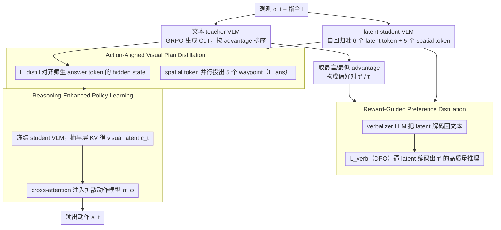

# Fast-ThinkAct: Efficient Vision-Language-Action Reasoning via Verbalizable Latent Planning

**会议**: CVPR2026  
**arXiv**: [2601.09708](https://arxiv.org/abs/2601.09708)  
**代码**: [项目主页](https://jasper0314-huang.github.io/fast-thinkact/)  
**领域**: 机器人  
**关键词**: VLA, 推理, latent CoT, 知识蒸馏, 偏好学习, 机器人操作

## 一句话总结

提出 Fast-ThinkAct，通过将冗长的文本 CoT 推理（~250 token）压缩为 6 个可语言化的连续 latent token，结合 reward-guided preference distillation 和 visual trajectory alignment，实现 89.3% 推理延迟降低（9.3× faster than ThinkAct-7B）同时保持甚至超越 SOTA reasoning VLA 的性能。

## 背景与动机

Vision-Language-Action (VLA) 任务要求智能体在复杂视觉场景中推理并执行自适应动作。近年 VLA 模型主要通过大规模机器人 demonstration 进行监督训练，在基础技能（pick-and-place）上表现良好，但在以下方面泛化能力不足：

1. **长时序规划**：需要多步骤推理的复杂任务（如先开炉灶再放锅）
2. **失败恢复**：运行时检测失败并生成纠正方案
3. **少样本适应**：快速适应新场景和新任务

Reasoning VLA（如 ThinkAct、CoT-VLA、MolmoAct）通过引入显式 chain-of-thought 推理来改善泛化能力。然而，生成冗长推理链引入了严重的推理延迟瓶颈：

- ThinkAct-7B 推理一步需约 7.5 秒（~0.1 Hz）
- 机器人操作需要 1-15 Hz 的实时决策频率
- ECoT-Lite 尝试用 reasoning dropout 加速，但直接截断文本推理会丢失关键信息导致性能下降

核心动机：**如何在保留推理能力的前提下，将冗长的文本 CoT 压缩为紧凑表示，同时正确捕获空间-时间动态信息？**

## 核心问题

- 文本 CoT 推理生成长序列（~250 token），推理延迟高达数秒，无法满足实时操控需求
- LLM 领域的 latent reasoning 方法（如 Coconut、CODI）无法直接迁移到 VLA 任务——需要空间-时间理解并且要桥接语义推理与具身控制
- 将推理压缩到连续 latent 空间后，缺乏直接的监督信号指导 latent 应该编码什么内容

## 方法详解

### 整体框架

Fast-ThinkAct 要治的是 reasoning VLA 的延迟病——ThinkAct 那种 ~250 token 的文本 CoT 一步要好几秒，根本喂不动 1-15 Hz 的机器人控制。它的办法是把推理从 token 空间搬进连续 latent 空间，压成 6 个 latent token，又不能把推理质量一起压没。整体是个 teacher-student 三步蒸馏：先用 teacher 的 reward 信号教 student 学出高质量的 latent 推理，再对齐 teacher/student 的轨迹级视觉规划表示，最后冻住 student VLM、用它的 latent 推理特征去增强一个扩散动作模型生成动作。下面三个关键设计正对应这三步，框架图自上而下也是这个流向。

### 关键设计

**1. Reward-Guided Preference Distillation：借 teacher 的 reward 给无监督的 latent 找信号**

latent 推理最棘手的地方是没有直接监督——把推理压进连续向量后，根本不知道这些向量该编码什么。Fast-ThinkAct 的巧办法是复用 teacher 的 reward：textual teacher $\mathcal{F}_{\theta^T}$ 基于 CoT-SFT checkpoint 用 GRPO 训练，它的 advantage 函数 $A(\tau)$ 天然就是推理质量的标尺。于是从每个 rollout group 里取最高/最低 advantage 的推理链当正负样本

$$\tau^+ = \arg\max_{\tau \in G} A(\tau), \quad \tau^- = \arg\min_{\tau \in G} A(\tau)$$

student VLM $\mathcal{F}_\theta$ 不再生成文本 token，而是自回归吐出 $M=6$ 个连续 latent 向量 $\mathbf{z} = \{z_m\}_{m=1}^M,\ z_m \in \mathbb{R}^d$。再引入一个 verbalizer LLM $\mathcal{V}_\psi$（Qwen3-0.6B，插入 cross-attention 层）把 latent 解码回自然语言，用 DPO 风格的目标逼它给高质量推理 $\tau^+$ 更高的似然：

$$\mathcal{L}_{\text{verb}} = -\mathbb{E}\left[\log \sigma\left(\beta \left(\log \frac{p_\psi(\tau^+|\mathbf{z})}{p_{\text{ref}}(\tau^+)} - \log \frac{p_\psi(\tau^-|\mathbf{z})}{p_{\text{ref}}(\tau^-)}\right)\right)\right]$$

$\beta=0.1$ 控制偏好强度。这等于反向逼着 student 把 latent 编码成"verbalizer 能解码出高质量推理"的内容——借 verbalizer 给本来没有监督的 latent 空间装上了一个监督信号。

**2. Action-Aligned Visual Plan Distillation：对齐轨迹级表示并把 waypoint 并行化**

光会推理还不够，还得把 teacher 的视觉规划能力搬过来。这一步在 `<answer>` token 处对齐 teacher 和 student 的 hidden state $\mathcal{L}_{\text{distill}} = \|h_t^T - h_t\|_2^2$，迁移 trajectory-level 的规划信息。同时在 latent 推理序列后挂上 $K=5$ 个可学习的 spatial token $\{s_i\}_{i=1}^K$，每个输出 hidden state 经 MLP 并行投成一个 waypoint $p_i \in \mathbb{R}^6$（格式 $[x_{\text{single}}, y_{\text{single}}, x_{\text{left}}, y_{\text{left}}, x_{\text{right}}, y_{\text{right}}]$）——一次并行预测，替掉 teacher 自回归吐 60-70 个 token 的 waypoint 文本，又省一截延迟。student 的总目标因此是 $\mathcal{L}_{\text{student}} = \mathcal{L}_{\text{verb}} + \mathcal{L}_{\text{distill}} + \mathcal{L}_{\text{ans}}$。

**3. Reasoning-Enhanced Policy Learning：冻结 VLM，用早层 latent 喂动作模型**

最后把 student VLM $\mathcal{F}_\theta$ 冻住，从 spatial token 的**早层** KV cache 里抽出 visual latent planning $c_t$，经 cross-attention 注入扩散 Transformer 动作模型 $\pi_\phi$（DiT-Policy 或 RDT）：

$$\mathcal{L}_{\text{IL}}(\phi) = \ell(\pi_\phi(o_t, l, c_t), \hat{a}_t)$$

选早层而非晚层 KV 是有消融撑腰的（LIBERO 89.7 vs 88.3 vs 87.1）——视觉规划信息在 VLM 的浅层就已经编码好了，没必要等到晚层。推理时只需跑 $\mathcal{F}_\theta + \pi_\phi$，verbalizer 只在训练和需要可解释时才用。

### 训练策略

- VLM backbone: Qwen2.5-VL 3B
- SFT → CoT-SFT → Teacher GRPO + Student distillation（4,500 iter）
- Verbalizer warmup 3,000 iter（LM loss），再切换 $\mathcal{L}_{\text{verb}}$ 1,500 iter
- Policy learning: 20K iter，冻结 VLM 和 state encoder
- 推理时仅需 $\mathcal{F}_\theta + \pi_\phi$，verbalizer 仅用于训练/可解释性

## 实验关键数据

### LIBERO & SimplerEnv（机器人操控）

| 方法 | LIBERO (avg) | SimplerEnv-Google | 推理延迟 (ms) |
|------|-------------|-------------------|--------------|
| OpenVLA-7B | 76.5 | 40.2 | N/A |
| ThinkAct-7B | 84.4 | 68.3 | 7513 |
| MolmoAct-7B | 86.8 | 64.9 | 6723 |
| ThinkAct-3B | 83.1 | 64.7 | 5674 |
| **Fast-ThinkAct-3B** | **89.7** | **68.7** | **805** (↓7.0×) |

LIBERO 超越 ThinkAct-3B 6.6%，SimplerEnv 超 4.0%，延迟降低 7×。

### RoboTwin2.0（双臂操控）

| 方法 | Easy Avg | Hard Avg |
|------|----------|----------|
| RDT | 56.4 | 22.8 |
| ThinkAct | 62.4 | 24.7 |
| **Fast-ThinkAct** | **65.7** | **26.4** |

在 long-horizon 任务（270+ 步）上优势更明显。

### Embodied Reasoning

| 方法 | EgoPlan-Bench2 | RoboVQA (B-Avg) | OpenEQA | Overall |
|------|---------------|-----------------|---------|---------|
| ThinkAct-3B | 44.0 | 55.3 | 48.9 | 49.4 |
| **Fast-ThinkAct-3B** | **46.4** | **60.8** | **51.2** | **52.8** |

超越 GPT-4V（36.4）和 Gemini-2.5-Flash（38.9）等商业模型。

### 关键消融

- 去掉 $\mathcal{L}_{\text{verb}}$：Overall 52.8 → 48.5（-4.3），缺少偏好引导
- 去掉 $\mathcal{L}_{\text{distill}}$：进一步降至 47.7，视觉规划迁移缺失
- 与高效文本推理对比：teacher 直接推理 49.8，6 个文本 token 46.3，RL length-penalty 47.8，**Fast-ThinkAct 6 个 latent token 53.3**
- Latent token 数消融：$M=1$ 不足、$M=30/100$ 引入噪声，$M=6$ 最优

## 亮点

- **Verbalizable latent 设计精巧**：latent 可通过 verbalizer 解码为文本，既实现了压缩又保持了可解释性，解决了 latent space 缺乏直接监督的根本难题
- **Reward-guided preference distillation**：复用 teacher GRPO 的 reward 信号构造 DPO 偏好对，无需额外标注，训练信号高效
- **延迟降低极其显著**：6 个 latent token + 5 个 spatial token 并行预测，89.3% 延迟降低，从不可用（0.1Hz）变为实时可用
- **Failure recovery 能力出色**：RoboFAC 上超越第二名 10.9-16.4 分，说明 latent 推理保留了理解错误和规划纠正的能力

## 局限与展望

- Verbalizer 基于预训练 LLM，继承了幻觉问题——verbalized 推理可能产生看似合理但不准确的描述（不影响 action 推理）
- 仅在模拟环境评估，未展示真实机器人部署结果
- Student 仅用 3B VLM backbone，7B 版本的消融不够充分（仅在 reasoning benchmark 上评估，未在 manipulation 上全面验证）
- Spatial token 数固定为 $K=5$，未探索自适应数量
- 训练流程复杂（SFT → CoT-SFT → Teacher GRPO → Student distillation → Policy learning），端到端简化空间大

## 与相关工作的对比

| 维度 | ThinkAct | MolmoAct | CoT-VLA | ECoT-Lite | Fast-ThinkAct |
|------|----------|----------|---------|-----------|---------------|
| 推理形式 | 文本 CoT | 2D visual trace | 视觉目标+文本 | Reasoning dropout | Latent CoT |
| 推理长度 | ~250 token | ~250 token | - | 可变 | 6 latent token |
| 推理延迟 | 7.5s (7B) | 6.7s (7B) | - | 降低但不稳定 | **0.8s (3B)** |
| RL 训练 | GRPO | 无 | 无 | 无 | Teacher GRPO → DPO distill |
| 可解释性 | 高（文本） | 高（视觉） | 中 | 低 | 中（可选 verbalize） |

核心区别：Fast-ThinkAct 将推理从 token space 迁移到 continuous latent space，用偏好学习代替直接蒸馏，实现了高效与高质量的平衡。

## 启发与关联

- Verbalizable latent 的思路具有通用性，可推广到自动驾驶等实时推理场景——任何需要 CoT 能力但受延迟约束的任务
- Teacher GRPO → Student DPO 的 reward-guided distillation 范式避免了 latent space 的标注难题，思路可迁移到其他 latent reasoning 工作
- 早层 KV cache 优于晚层的发现，暗示视觉规划信息在 VLM 的浅层就已编码，与 VLM probing 文献交叉
- 与 Coconut、CODI 等 LLM latent reasoning 形成互补——本文首次将 latent reasoning 扩展到 VLA 领域

## 评分

- 新颖性: 8/10 — Verbalizable latent + reward preference distillation 的组合设计新颖，解决了 latent reasoning 监督信号的关键难题
- 实验充分度: 9/10 — 六个基准（3 reasoning + 3 manipulation）、详尽消融、延迟分析全面
- 写作质量: 8/10 — 结构清晰，方法公式化完整，图示直观
- 价值: 9/10 — 推理延迟从秒级降到亚秒级且性能提升，解决了 reasoning VLA 落地的关键瓶颈

<!-- RELATED:START -->

## 相关论文

- [\[ICML 2026\] Latent Reasoning VLA: Latent Thinking and Prediction for Vision-Language-Action Models](../../ICML2026/robotics/latent_reasoning_vla_latent_thinking_and_prediction_for_vision-language-action_m.md)
- [\[NeurIPS 2025\] ThinkAct: Vision-Language-Action Reasoning via Reinforced Visual Latent Planning](../../NeurIPS2025/robotics/thinkact_vision-language-action_reasoning_via_reinforced_visual_latent_planning.md)
- [\[CVPR 2026\] Towards Open Environments and Instructions: General Vision-Language Navigation via Fast-Slow Interactive Reasoning](towards_open_environments_and_instructions_general_vision-language_navigation_vi.md)
- [\[CVPR 2026\] DecoVLN: Decoupling Observation, Reasoning, and Correction for Vision-and-Language Navigation](decovln_decoupling_observation_reasoning_and_correction_for_vision-and-language_.md)
- [\[ICML 2026\] LangForce: Bayesian Decomposition of Vision-Language-Action Models via Latent Action Queries](../../ICML2026/robotics/langforce_bayesian_decomposition_of_vision_language_action_models_via_latent_act.md)

<!-- RELATED:END -->
