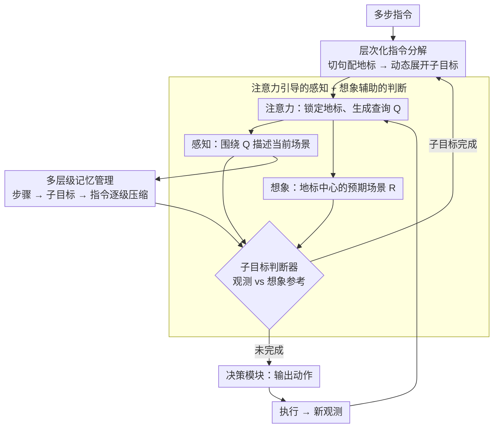

# FineCog-Nav: Integrating Fine-grained Cognitive Modules for Zero-shot Multimodal UAV Navigation

**会议**: CVPR 2026 Findings  
**arXiv**: [2604.16298](https://arxiv.org/abs/2604.16298)  
**代码**: [项目主页](https://smartdianlab.github.io/projects-FineCogNav)  
**领域**: 机器人  
**关键词**: 无人机导航, 视觉语言导航, 认知模块, 零样本, 层次记忆

## 一句话总结
本文提出 FineCog-Nav，一个受人类认知启发的零样本 UAV 视觉语言导航框架，将导航分解为语言处理、感知、注意力、记忆、想象、推理和决策七个细粒度认知模块，每个模块使用中等规模基础模型驱动，无需训练即可在复杂 3D 环境中完成长程导航。

## 研究背景与动机

1. **领域现状**：UAV 视觉语言导航（VLN）要求智能体从第一人称视角在复杂 3D 环境中跟随多步模糊指令进行长程导航。地面 VLN 已有较多零样本方法，但 UAV 场景因连续 3D 运动、有限全局感知和弱地标识别性而更具挑战。
2. **现有痛点**：现有零样本方法严重依赖大型模型（如 GPT-4V），更换为小模型（如 LLaVA-7B）后成功率从 28.3% 暴跌至 1.7%。多数方法使用通用 prompt 和松散模块协调，缺乏层次规划、动态子目标提取和记忆机制等关键组件。
3. **核心矛盾**：复杂 UAV 导航需要感知、推理和决策的深度协作，但现有框架要么是单体架构（一个大模型解决所有问题），要么是松耦合模块（各模块间交互不足）。
4. **本文目标**：设计一个无需训练的模块化框架，通过细粒度认知模块的协作实现可解释、可泛化的 UAV 导航。
5. **切入角度**：不以智能体身份而以认知功能组织模块——每个模块对应人类认知的一个方面（语言、感知、注意力、记忆、想象、推理、决策），通过结构化输入输出协议进行协作。
6. **核心 idea**：认知功能的精细模块化使得每个模块可以用中等规模模型配合角色特定 prompt 实现，不需要依赖超大模型，同时显式的认知依赖关系提供了可解释性。

## 方法详解

### 整体框架
FineCog-Nav 要解决的是同一个尴尬：换上小模型后零样本 UAV 导航近乎崩溃（GPT-4V 28.3% → LLaVA-7B 1.7%）。作者的判断是，问题不在模型不够大，而在导航被当成"一个大模型一口气解决所有事"。于是他们把导航拆成一组对应人类认知功能的模块——语言、注意力、感知、想象、记忆、推理、决策——让每个模块只干一件窄活，由中等规模基础模型配角色 prompt 驱动。

整条流水线是一个闭合的感知-推理-行动循环：语言模块先把长指令切成带地标的子目标；注意力模块挑出当前该盯哪个地标、生成查询；感知模块在查询引导下描述眼前场景；想象模块预先写出"子目标完成时应该看到什么"；判断器拿观测、记忆和这份想象参考比对，决定子目标是否达成；多层级记忆把这一路的观测压缩归档；最后决策模块据此输出动作。每个模块的输出就是下一个模块的输入，依赖关系是显式写出来的，因此整个推理链可解释、可调试。

### 关键设计

**1. 层次化指令分解：把又长又多步的指令降成可逐条执行的子目标**

UAV 指令往往是"飞过停车场，绕过那栋红楼，在喷泉右转后停下"这种长串多步描述，丢给一个模型直接规划很容易在中途丢失执行顺序。语言模块把这件事拆成两级：指令解析器 $\mathcal{S}$ 先按句子把指令 $I$ 切开，并给每句配上它涉及的地标，得到 $\{(I_i, L_i)\}$；子目标提取器 $\mathcal{E}$ 再结合当前观测，把每条指令动态展开成一串子目标 $\{g_i^{(k)}\}_{k=1}^K$。关键在于它以**执行顺序**而非语法结构来组织子目标——模型每一步只需面对"现在该完成哪个子目标"，规划复杂度被压到最低，也不必让小模型一次扛下整条指令的全局规划。

**2. 注意力引导的感知 + 想象辅助的判断：让小模型既看对地方、又知道该看到什么**

无引导的感知很容易被画面里的无关细节带偏，而判断"子目标到底完成没有"对小模型尤其难。这一组模块把两件事接起来解决。注意力模块从当前和下一条指令里挑出关键地标 $\{L_i, L_{i+1}\}$，据此生成针对性查询 $\{Q_i\}$，让感知模块只围绕这些地标去描述场景，而不是泛泛地把整幅画面讲一遍。想象模块则生成子目标完成时的预期场景描述 $R^{[g_i^{(k)}]}$——注意它**不是开放式地凭空编一个场景**，而是约束成以地标为中心的描述，正是这个约束把生成幻觉压了下来。最后子目标判断器把当前观测、子目标记忆和这份想象参考放在一起比对：眼前看到的是否匹配"我本应看到的"，从而给出比"直接问模型完成没"更可靠的判断。

**3. 多层级记忆管理：长程导航里既不淹没在历史细节、又不丢全局上下文**

像 NavGPT 那样把每一步的历史平铺着喂进去，走到长程任务后段就会信息过载、噪声盖过信号。FineCog-Nav 借鉴人类记忆巩固的思路，搭了三层逐级压缩的结构：最底层是步骤记忆 $M^{[t]}$，逐帧记录每步的观测和动作；一个子目标完成后，这段步骤记忆由 LLM 压缩成摘要 $M_\star$ 存入子目标记忆 $M^{[g_i^{(k)}]}$；多个子目标完成后，再聚合进指令级记忆 $M^{[I_i]}$。

$$M^{[t]} \;\xrightarrow{\text{LLM 压缩}}\; M^{[g_i^{(k)}]} \;\xrightarrow{\text{聚合}}\; M^{[I_i]}$$

这样越往上层、粒度越粗、保留的越是"已经走到哪、完成了什么"的全局线索，局部的逐帧噪声在压缩中被滤掉。消融里这一层最关键：换回扁平历史后性能严重下滑。

### 一个完整示例：执行"飞过广场，在喷泉处右转停下"

以一条两段指令为例走一遍认知流转：

1. **语言模块**把指令切成 $I_1$="飞过广场"（地标=广场）、$I_2$="在喷泉处右转停下"（地标=喷泉），并据当前观测展开第一条的子目标 $g_1^{(1)}$="到达广场上空"。
2. **注意力模块**锁定当前地标"广场"和下一地标"喷泉"，生成查询"画面中是否出现开阔铺装广场"。
3. **感知模块**只围绕该查询描述场景："正下方为部分建筑屋顶，前方约 50m 处有开阔铺装区域"。
4. **想象模块**给出 $g_1^{(1)}$ 完成时的参考："视野中心应为大片铺装广场，四周建筑环绕"。
5. **判断器**比对观测与想象参考——当前广场尚在前方、不在视野中心 → 子目标未完成 → 决策模块输出"继续前进"。
6. 数步后广场进入视野中心，判断器判定 $g_1^{(1)}$ 完成；步骤记忆被压缩成摘要"已飞抵广场上空"存入子目标记忆，语言模块转入 $I_2$，注意力切换到"喷泉"，循环继续，直到在喷泉处完成右转并停下。

整个过程里，记忆只往上传"已完成广场段"这一句摘要，而非几十帧原始观测，下一段推理因此不被前段细节淹没。

### 损失函数 / 训练策略
完全零样本，无需训练。每个模块靠角色特定、精心设计的 prompt 驱动中等规模基础模型（如 Qwen2.5-VL-32B 搭配各种 8B–32B LLM），能力来自模块分工与提示设计而非梯度更新。

## 实验关键数据

### 主实验

**AerialVLN-Fine（300 条轨迹）**：

| LLM 骨干 | 方法 | SR3D↑ | NE↓ | nDTW↑ |
|---------|------|-------|-----|-------|
| Qwen3-32B | BaseModel | 3.00% | 142.72m | 17.07% |
| Qwen3-32B | **FineCog-Nav** | **4.00%** | **95.31m** | **20.31%** |
| GPT-4o-mini | BaseModel | 0.33% | 325.98m | 8.74% |
| GPT-4o-mini | **FineCog-Nav** | **2.33%** | **100.37m** | **20.45%** |
| ChatGLM-4-32B | BaseModel | 2.00% | 180.66m | 10.59% |
| ChatGLM-4-32B | **FineCog-Nav** | **2.33%** | **94.18m** | **21.25%** |

### 消融实验

| 配置 | SR3D | nDTW | 说明 |
|------|------|------|------|
| FineCog-Nav 完整 | 4.00% | 20.31% | 全部认知模块 |
| 用扁平历史替代层次记忆 | ~2% | ~15% | 大幅下降 |
| 去除想象模块 | ~3% | ~17% | 子目标判断不准确 |
| 去除注意力模块 | ~3% | ~16% | 感知被无关信息干扰 |

### 关键发现
- **FineCog-Nav 在所有 LLM 骨干上一致超越基线**：即使使用 8B 小模型也能获得显著提升
- **导航误差减半以上**：GPT-4o-mini 的 NE 从 325.98m 降至 100.37m（-69%）
- **层次记忆是最关键模块**：消融实验显示替换为扁平历史后性能严重下降

## 亮点与洞察
- **以认知功能而非智能体身份组织模块**是最核心的设计哲学：这不同于多智能体系统中的角色划分，而是模拟人类导航时的认知过程，带来了更好的可解释性
- **想象模块**是有趣的创新：在判断子目标是否完成时，生成"期望看到的场景"作为参考，类似人类的心理模拟。约束为地标中心描述而非开放生成是减少幻觉的关键
- **AerialVLN-Fine 数据集**填补了 UAV VLN 缺乏高质量细粒度评估基准的空白

## 局限与展望
- 绝对成功率仍然很低（最高 4%），说明零样本 UAV VLN 仍是极具挑战性的问题
- 多模块管线增加了推理开销和模块间的错误传播风险
- 仅在 AerialVLN（模拟器）中验证，未在真实无人机上测试
- 安全模块基于简单的深度几何启发式，可能在复杂障碍物场景中不足
- 未来可探索模块间的自适应协作和端到端优化

## 相关工作与启发
- **vs NavGPT**: NavGPT 使用单个 LLM 处理所有导航决策。FineCog-Nav 将任务分解到专门的认知模块，使得中等规模模型也能完成大模型的工作
- **vs SPF (See, Point, Fly)**: SPF 主要增强视觉定位能力。FineCog-Nav 提供了更完整的认知框架，包含记忆、想象等高阶能力

## 评分
- 新颖性: ⭐⭐⭐⭐⭐ 认知功能模块化的设计理念新颖且有深度
- 实验充分度: ⭐⭐⭐⭐ 6 个 LLM 骨干 + 自建高质量基准 + 消融分析
- 写作质量: ⭐⭐⭐⭐ 框架描述清晰，认知模块间的信息流图示直观
- 价值: ⭐⭐⭐⭐ 为零样本 UAV 导航提供了可扩展的模块化框架

<!-- RELATED:START -->

## 相关论文

- [\[CVPR 2026\] TrajRAG: Retrieving Geometric-Semantic Experience for Zero-Shot Object Navigation](trajrag_retrieving_geometric-semantic_experience_for_zero-shot_object_navigation.md)
- [\[CVPR 2026\] History to Future: Evolving Agent with Experience and Thought for Zero-shot Vision-and-Language Navigation](history_to_future_evolving_agent_with_experience_and_thought_for_zero-shot_visio.md)
- [\[ECCV 2024\] Prioritized Semantic Learning for Zero-shot Instance Navigation](../../ECCV2024/robotics/prioritized_semantic_learning_for_zero-shot_instance_navigation.md)
- [\[AAAI 2026\] PanoNav: Mapless Zero-Shot Object Navigation with Panoramic Scene Parsing and Dynamic Memory](../../AAAI2026/robotics/panonav_mapless_zero-shot_object_navigation_with_panoramic_scene_parsing_and_dyn.md)
- [\[CVPR 2026\] FantasyVLN: Unified Multimodal Chain-of-Thought Reasoning for Vision-and-Language Navigation](fantasyvln_unified_multimodal_chain-of-thought_reasoning_for_vision-and-language.md)

<!-- RELATED:END -->
