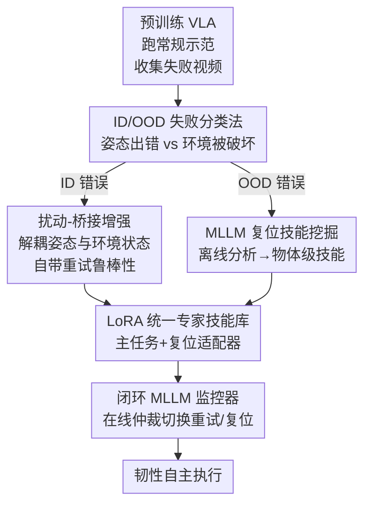

# FLARE: A Failure-Aware Framework for Autonomous Correction and Recovery in Visual-Language Robotic Manipulation

**会议**: CVPR 2026  
**论文**: [CVF Open Access](https://openaccess.thecvf.com/content/CVPR2026/html/Zhao_FLARE_A_Failure-Aware_Framework_for_Autonomous_Correction_and_Recovery_in_CVPR_2026_paper.html)  
**代码**: 无  
**领域**: 机器人操作 / 具身智能  
**关键词**: VLA, 失败恢复, 数据增强, MLLM 监控, 闭环纠错

## 一句话总结
FLARE 把机器人 VLA 的失败按"机器人姿态出错(ID)"和"环境被破坏(OOD)"分成两类，用扰动-桥接数据增强让模型自带"重试"能力、用 MLLM 离线挖掘失败视频自动学一套物体级"复位"技能，再由在线 MLLM 监控器闭环切换两种技能，把 RoboMimic 9 个接触密集任务的平均成功率从 π0.5 的 72.2% 提到 84.0%。

## 研究背景与动机
**领域现状**：Vision-Language-Action（VLA）模型（如 OpenVLA、π0、π0.5）把感知-语言-控制统一进一个网络，在长程操作任务上展现出很强的泛化能力，成为具身智能的主流范式。

**现有痛点**：这些模型极其"脆"——一次没抓稳、物体掉落、意外碰撞，就会让整条任务不可逆地失败。人类遇到这种小意外会自然地重试或把场景收拾好再继续，而 VLA 几乎没有这种自我纠错能力。

**核心矛盾**：作者把脆弱性的根源追到了**数据本身**，而非以往归因的模型结构或控制策略。人类示范数据是稀疏的、只含成功轨迹、且**轨迹单调（trajectory-monotonic）**：机器人始终沿着一条和任务进度强相关的窄姿态流形走。于是策略 $\pi_\theta$ 学到的是"我的关节配置 = 任务进展到哪一步"这种虚假关联，而不是从环境状态去推断进度。一旦扰动让机器人处在一个"环境合法、但姿态没见过"的状态，策略就误判为越界而僵住。同时数据里几乎没有失败-恢复样本，标准的数据重组（如 MimicGen）只会重排成功片段，永远合成不出恢复轨迹。

**本文目标**：给 VLA 装上一个**统一、可泛化**的失败恢复机制，既能处理姿态层面的偏差，也能处理环境层面的灾难。

**切入角度**：作者先把世界状态 $s_t$ 拆成环境状态 $s_t^e$（物体位姿）和机器人状态 $s_t^r$（末端执行器位姿），据此给失败下了一个清晰的二分定义，再针对两类失败各给一套解法。

**核心 idea**：用"Retry（重试）+ Reset（复位）"双范式，把机器人自主性从"追求完美执行"重构为"出错后能恢复的韧性"——ID 错误靠数据增强让模型自带重试鲁棒性，OOD 错误靠 MLLM 自举出来的复位技能解决。

## 方法详解

### 整体框架
FLARE 的输入是一个预训练 VLA 主干（π0.5）和少量人类示范，输出是一套能在部署时闭环纠错的"技能库 + 监控器"系统。整条管线分三段：先用常规示范训出一个 VLA、跑几百回合收集失败视频；再用 MLLM 把失败按 ID/OOD 分类——ID 错误走"扰动-桥接"增强、OOD 错误走"物体级复位技能挖掘"；最后把原始数据、重试增强数据、复位增强数据统一训成一组 LoRA 专家适配器（技能库），部署时由在线 MLLM 监控器在主任务与复位技能之间仲裁切换，形成闭环。

形式化上，VLA 是一个马尔可夫策略 $a_t \sim \pi_\theta(\cdot|o_t, I)$，根据当前视觉观测 $o_t$ 和语言指令 $I$ 预测动作块。作者定义两类失败：**ID 错误**指 $s_t=(s_t^e, s_t^r)$ 中环境合法（$s_t^e \in S_{task}^e$）但机器人姿态 $s_t^r$ 落在示范条件分布 $P(s_t^r|s_t^e, \mathcal{D}_{demo})$ 的低概率区，任务仍可从 $s_t^e$ 恢复，只需"重试"；**OOD 错误**指环境状态本身已不可恢复（$s_t^e \notin S_{task}^e$，如杯子被打翻），任何主任务动作都救不回来，必须用专门的"复位"技能。

### 关键设计

**1. ID/OOD 失败分类法：先想清楚"错在机器人还是错在环境"再对症下药**

以往的自纠错工作要么笼统地靠 MLLM 给语义反馈、要么靠 RL 硬学恢复行为，没有一个统一框架去区分"什么错该怎么救"。FLARE 的出发点是把失败按状态分解 $s_t=(s_t^e, s_t^r)$ 划成两类：环境还合法、只是姿态新颖的算 ID 错误（可重试），环境本身被破坏的算 OOD 错误（需复位）。这个分类法看似简单，却是整个框架的地基——它解释了 VLA 为什么"反常地没有重试能力"：策略把任务进度错误地绑定在姿态上，当机器人姿态恰好处在"放置"位、但环境里物体其实压根没抓起来时，策略会按姿态误判任务已到放置阶段。把这个根因点破后，两类错误就能各自配一套数据层面的解法，而不是寄望于更大的模型。

**2. 扰动-桥接增强：把机器人姿态从环境状态里"解耦"出来，逼模型学会从任意姿态重试**

ID 错误的根源是轨迹单调导致的姿态-环境虚假耦合，光靠片段拼接（segment stitching）合成新数据并不能打破这种单调性。FLARE 先用少量人类子任务片段（如"抓杯""放杯"）经运动学变换拼出一条基线轨迹 $T_{task}=(a_0, a_1, \dots, a_N)$，再在任务片段之间**系统性地注入扰动-桥接段** $d_i$，得到 $T_{aug}=(d_{init}, a_0, d_0, a_1, d_1, \dots, a_N)$。每个 $d_i$ 含两个相位：**扰动相** $d_i^A$ 用随机关节速度/末端运动把机械臂甩到一个任意越界姿态，主动打破姿态-状态相关性；**桥接相** $d_i^B$ 再把机器人从这个被扰乱的姿态拉回执行下一个任务段 $a_{i+1}$ 所需的合法起始姿态。两段都用无规划器的运动学插值（位置线性插值、旋转 SLERP）高效生成。

关键的训练技巧是：**扰动动作 $d_i^A$ 本身不当训练目标**（它们不是有意义的动作），真正喂给模型的是"桥接到任务"的子序列 $(d_i^B, a_{i+1}, a_{i+2}, \dots)$ 加上原始成功子序列。这样 VLA 被显式地教会"无论起始姿态是 $d_i^B$ 的哪个末态，下一步都该执行正确的 $a_{i+1}$"，从而把姿态-状态的虚假耦合彻底打断，获得可泛化的内生重试能力。实验里大扰动（更大旋转/平移）能造出方差更高的数据、带来更高成功率，但生成有效演示的效率会下降，存在 trade-off。

**3. MLLM 驱动的复位技能挖掘：让大模型当"失败分析师"，自举出一小套物体级复位技能**

重试只解决 ID 错误，对"杯子被打翻"这类 OOD 灾难无能为力，而示范数据里根本没有这类状态的恢复样本。FLARE 用一条高效流水线来补这个数据空洞：先让已具重试能力的模型跑几百回合、收集所有成功与失败视频；再用一个离线 MLLM（Gemini-2.5-Pro）当**失败分析师**，对每段失败视频输出结构化 JSON——错误类型（ID-可重试 / OOD-需复位）、复位目标物体、**error group**（构成错误的一组物体，如"卡住的咖啡胶囊+胶囊座"）、失败时间戳。其中 error group 的设计很巧：它把相互作用的出错物体当成一个**语义失败资产**，之后生成新复位演示时可以把整组物体（保持其内部相对位姿）搬到各种新场景布局里，让模型学到的是"卡住"这一语义本质的恢复，而非某个具体位置的恢复。

接着，对每个被判为 OOD 的失败，用时间戳从日志里抽出高保真环境状态 $s_t$（如 MuJoCo 状态），得到一批 $(s_t, I_{reset})$ 配对作为复位演示的起始构型；每个物体级复位技能只采 10–20 条人类示范 $\mathcal{D}_{reset}^{human}$，再用同一套扰动-桥接增强扩到 500 条，生成对机器人起始姿态和失败上下文布局都鲁棒的 $\mathcal{D}_{reset}^{aug}$。整条链路把"灾难恢复"这种几乎不可能靠成功数据合成的能力，用 MLLM 的视频理解能力低成本地引导出来。

**4. LoRA 专家技能库 + 闭环 MLLM 监控器：模块化训练避免技能互相干扰，部署时高层大模型指挥底层适配器切换**

如果把主任务和所有复位技能塞进一个单体模型，不同技能的梯度会互相打架。FLARE 改用 LoRA 在共享 VLA 主干上训一组专门适配器：主任务适配器 $\pi_{LoRA}^{task}$ 用 $\mathcal{D}_{task}^{aug}$（原始+重试增强）训、每个物体级复位技能各训一个 $\pi_{LoRA}^{reset,j}$（如"reset cup"适配器只用对应复位演示、配 prompt "reset the cup"）。这种模块化既避免冲突梯度，又天然可扩展——新技能只需加一个 LoRA、不动已有策略。部署时系统作为闭环运行：默认加载主任务适配器执行，在线 MLLM 监控器观察执行过程；遇 ID 错误不干预（靠内生重试自动恢复），遇 OOD 错误则切到对应复位适配器执行恢复，待 MLLM 确认环境复位到合法状态后再换回主任务适配器无缝续跑。这个"高层 MLLM 指挥 + 底层 VLA 适配器库"的两级设计，把鲁棒性、性能与可扩展性同时拿到。

## 实验关键数据

### 主实验
RoboMimic 9 个接触密集任务（D0/D1 后缀表示场景初始化的物体随机化范围，D1 更难），每任务 50 次评测取平均。FLARE 在 8/9 任务上达到 SOTA。

| 方法 | Coffee D1 | StackThree D1 | Threading D0 | 3Piece D1 | 平均成功率 |
|------|-----------|---------------|--------------|-----------|-----------|
| OpenVLA | 18% | 20% | 20% | 8% | 38.0% |
| Phoenix | 48% | 20% | 68% | 6% | 57.8% |
| Phoenix-Human（人工纠正上界） | 100% | 40% | 100% | 40% | 78.9% |
| π0.5（本文主干） | 56% | 84% | 42% | 46% | 72.2% |
| **Ours (FLARE)** | **78%** | **90%** | 72% | **58%** | **84.0%** |

平均成功率 84.0%，比此前最强纠错方法 Phoenix（57.8%）高 26.2 个点；即便扣掉强主干带来的增益，FLARE 仍在 π0.5 基础上再加 11.8%；更值得注意的是它甚至超过了带正确人工指导的 Phoenix-Human（78.9%）。作者还观察到：在更难的 D1 版本上的提升普遍比 D0 更明显，印证了扰动-桥接增强带来的环境变化鲁棒性。

真实机器人（Piper 臂 + RealSense D435i，每任务 10 条示范增强到 50，用 Any6D 做位姿估计、无需特权仿真坐标）也验证了有效性：

| 真实任务（40 次试验） | π0.5 基线 | Ours (FLARE) |
|----------------------|-----------|--------------|
| Stack Three Blocks（长程） | 62.5% | 75.0% |
| Insert U-shaped Block（接触密集） | 45.0% | 55.0% |

### 消融实验
在 Coffee 和 ThreePieceAssembly 上拆解复位技能与人工指令的贡献：

| 配置 | Coffee D1 | 3Piece D1 | 说明 |
|------|-----------|-----------|------|
| Ours | 78% | 58% | 完整模型 |
| Ours w/o Reset | 74% | 54% | 只用扰动-桥接、去掉复位技能，平均掉 3.5% |
| Ours Reset-Only | 64% | 50% | 只有复位、无重试增强，掉得更多 |
| Ours-Oracle | 90% | 64% | 复位指令换成人工反馈（上界），再加约 7% |

复位技能本身的成功率与生成效率高度依赖物体难度：

| 复位对象 | Coffee 成功率 | 3Piece 成功率 | Coffee 生成效率 | 3Piece 生成效率 |
|----------|--------------|---------------|-----------------|-----------------|
| 对象 1（机器盖/T 块） | 84% | 88% | 83.7% | 48.6% |
| 对象 2（咖啡胶囊/U 块） | 24% | 20% | 11.6% | 5.9% |

MLLM（Gemini-2.5-Pro）失败识别准确率：Retry/Reset 二分类 88%/96%，复位物体识别 88%/78%，时间戳识别 78%/66%。

### 关键发现
- **重试增强是性能主力，复位技能是补刀**：去掉复位只掉 3.5%，但去掉重试增强（Reset-Only）掉得更狠，说明扰动-桥接打破姿态-环境耦合贡献最大；二者结合才完整。
- **复位难度由物体可操作性决定**：扶正一个被打翻的咖啡胶囊（需抓取、调姿、立直）对实验用的夹爪很难，成功率仅 24%，作者指出这暗示需要更灵巧的手内位姿调整能力。
- **MLLM 监控仍有上限**：Ours-Oracle（人工指令）比自动版高 7%，说明更强的多模态 LLM 能进一步提升监控质量——当前瓶颈部分来自在线监控器的判断精度。
- **越难的场景提升越大**：D1 上的增益普遍大于 D0，验证了解耦增强对环境变化的鲁棒性。

## 亮点与洞察
- **把"脆弱"归因到数据 regime 而非模型**：作者用 $s_t=(s_t^e, s_t^r)$ 的分解把"VLA 没有重试能力"这个反直觉现象解释得很透——策略错把姿态当任务进度，这个洞察本身就值得借鉴。
- **扰动当数据、不当目标**：扰动相 $d_i^A$ 只用来制造多样起始姿态、绝不作为训练目标，真正学的是"从任意姿态续上正确动作"，这种"用噪声造分布、只学恢复"的思路可迁移到任何模仿学习里打破虚假相关性。
- **error group / 语义失败资产**：把"卡住的胶囊+座"当成一个可整体搬运、保持相对位姿的语义单元，让复位技能学到的是失败的语义本质而非位置，是泛化复位技能的关键技巧。
- **MLLM 双角色**：同一个大模型既当离线失败分析师（自举复位数据集），又当在线监控器（闭环仲裁），把大模型的视频推理能力用在了"造数据"和"做决策"两端。

## 局限与展望
- **复位灵巧度受限**：对象 2（胶囊/U 块）复位成功率仅 20%–24%，受夹爪能力制约，作者承认需要更灵巧的手内位姿调整。
- **依赖较强的多模态 LLM**：在线监控用 Gemini-2.5-Pro，Oracle 上界比自动版高 7%，说明监控精度仍是瓶颈；⚠️ 论文未充分讨论 MLLM 推理延迟对实时闭环控制的影响。
- **OOD 复位需先收集失败、再人工采少量示范**：虽然每技能仅 10–20 条人类演示，但整条管线仍需"跑出失败→人工补示范→增强"的离线循环，不是完全自动。
- **评测以仿真为主**：真实实验只有 2 个任务、绝对成功率（55%–75%）仍有距离，长程接触密集任务的可靠性还需更大规模验证。

## 相关工作与启发
- **vs Phoenix**：Phoenix 靠粗粒度运动指令 + 人类反馈做语义反思到底层纠正，其模板化的"预测-纠正"流水线跨任务泛化受限；FLARE 不依赖模板，直接在数据层面注入重试鲁棒性 + 物体级复位技能，平均成功率高 26.2 个点，甚至超过 Phoenix-Human 上界。
- **vs 基于 MLLM 的纠错（如 REFLECT）**：这类方法能诊断高层失败并重规划，但依赖固定技能库、底层适应性差；FLARE 的复位技能是按需从失败视频挖掘并训练的，可随 LoRA 扩展。
- **vs RL 自纠错（如 SeRO）**：RL 能显式学恢复行为、也能处理 OOD，但真实场景样本效率极低；FLARE 用数据增强 + 模仿学习绕开了 RL 的采样难题。
- **vs MimicGen 等数据重组**：MimicGen 只重排成功片段、无法打破轨迹单调性也合不出恢复轨迹；FLARE 的扰动-桥接专门解耦姿态-环境、并通过 MLLM 挖掘补上失败-恢复数据。

## 评分
- 新颖性: ⭐⭐⭐⭐⭐ ID/OOD 分类法 + 扰动-桥接 + MLLM 双角色三者组合成一个统一韧性框架，把脆弱性根因归到数据 regime 的视角很新。
- 实验充分度: ⭐⭐⭐⭐ 仿真 9 任务 + 真实 2 任务 + 多组消融到位，但真实实验规模偏小、复位灵巧度短板明显。
- 写作质量: ⭐⭐⭐⭐⭐ 形式化定义清晰，从根因到方法到实验逻辑顺畅，图表完整。
- 价值: ⭐⭐⭐⭐⭐ 失败恢复是 VLA 走向真实部署的关键瓶颈，数据中心的解法可复用性强。

<!-- RELATED:START -->

## 相关论文

- [\[CVPR 2026\] Action-Sketcher: From Reasoning to Action via Visual Sketches for Robotic Manipulation](action-sketcher_from_reasoning_to_action_via_visual_sketches_for_robotic_manipul.md)
- [\[CVPR 2026\] Language-Grounded Decoupled Action Representation for Robotic Manipulation (LaDA)](lada_robotic_manipulation.md)
- [\[CVPR 2026\] Spatial-Aware VLA Pretraining through Visual-Physical Alignment from Human Videos](spatial-aware_vla_pretraining_through_visual-physical_alignment_from_human_video.md)
- [\[CVPR 2026\] DiffuView: Multi-View Diffusion Pretraining for 3D-Aware Robotic Manipulation](diffuview_multi-view_diffusion_pretraining_for_3d_aware_robotic_manipulation.md)
- [\[CVPR 2026\] EgoRoC: Towards Egocentric Robotic Control via Task-Agnostic Visual Alignment](egoroc_towards_egocentric_robotic_control_via_task-agnostic_visual_alignment.md)

<!-- RELATED:END -->
