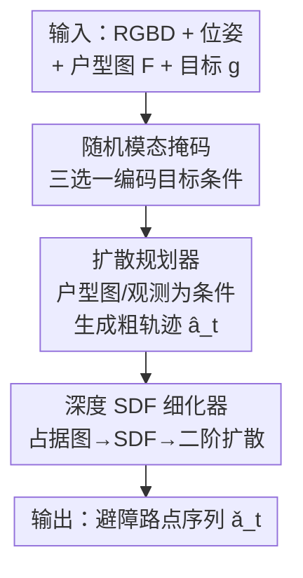

# FloVerse: Floor Plan-Guided Multi-Modal Navigation

**会议**: CVPR 2026  
**论文**: [CVF Open Access](https://openaccess.thecvf.com/content/CVPR2026/html/Huang_FloVerse_Floor_Plan-Guided_Multi-Modal_Navigation_CVPR_2026_paper.html)  
**代码**: https://wikiahuang.github.io/floverse/ (项目页)  
**领域**: 具身导航 / 机器人  
**关键词**: 户型图先验, 多模态导航, 扩散策略, 模态掩码, 轨迹细化

## 一句话总结
FloVerse 把户型图（floor plan）作为统一的空间先验，提出一个把 PointNav / ObjectNav / ImageNav 三种目标模态合并到单个模型的导航任务与数据集，并用两阶段扩散策略 ThreeDiff（带模态掩码的规划器 + 基于深度 SDF 的细化器）在三种模态上都拿到比无户型图、比单模态专家模型更高的成功率与路径效率。

## 研究背景与动机
**领域现状**：具身导航在 PointNav（给坐标）、ObjectNav（给物体类别）、ImageNav（给目标图像）三类任务上都已有不错的成绩，主流做法要么是显式建图（mapping-based），要么是直接从观测映射到动作的无图方法（mapless）。

**现有痛点**：建图方法要持续构建并维护地图，开销大；无图方法在目标尚未进入视野时缺乏全局指引，只能靠探索（exploration），容易产生短视行为、绕路。两类方法在「未见过的新场景」里效率都不高。

**核心矛盾**：智能体进入陌生室内环境时，缺少对整体空间布局的全局认知，只能靠局部观测一点点试探。而户型图恰恰是一种「廉价、随手可得、时间上稳定」的全局空间先验——它编码了墙体几何，还隐含了房间功能、物体典型分布等语义规律。但已有的户型图导航工作几乎只在 PointNav、且只在小规模场景上验证，没人系统检验它对 ObjectNav / ImageNav 是否同样有效。

**本文目标**：拆成三个子问题——(1) 造一个能统一三种目标模态、且每个场景都配户型图的大规模任务与数据集；(2) 设计一个单模型能同时吃三种模态目标、并真正利用户型图先验的策略；(3) 实证回答「户型图先验到底能不能跨模态提升导航」。

**切入角度**：作者假设户型图里的几何结构（PointNav 最直接受益）和语义规律（房间连通性、布局，对 ObjectNav/ImageNav 有帮助）可以被一个共享编码器隐式学到，且不同模态之间存在互补性——用 PointNav 学到的几何空间知识能迁移去帮语义目标模态。

**核心 idea**：用户型图作为统一空间先验 + 随机模态掩码训练，让一个扩散策略「模态无关」地从目标推理出粗轨迹，再用深度几何做一次避障细化。

## 方法详解

### 整体框架
ThreeDiff 是一个两阶段端到端轨迹生成框架。输入是智能体的第一视角 RGBD 观测序列、历史位姿、一张全局 2D 户型图 $F$，以及一个任意模态的目标 $g$（点 / 物体类别 / 目标图像）；输出是接下来若干步的连续 2D 路点（waypoint）序列。第一阶段的**规划器**把目标特征、户型图特征、观测特征拼接后作为条件，用扩散模型生成一条粗轨迹 $\hat{a}_t$，体现高层空间意图与长程依赖；第二阶段的**细化器**把当前深度图投成局部占据图、再算成符号距离场（SDF），用它去微调粗轨迹，产出避开附近障碍的安全路径 $\check{a}_t$。训练时目标模态被随机掩码，迫使模型学会模态无关的目标推理。

### 关键设计

**1. 随机模态掩码的多模态目标条件：用一个模型吃下三种目标**

痛点是过去要为 PointNav / ObjectNav / ImageNav 各训一个专家模型，既割裂又无法共享空间知识。作者在每次迭代里只把三种目标里的一种喂给模型，另外两种全部掩掉，得到的掩码目标条件为 $C_g = m \odot (C_{g_{point}}, C_{g_{object}}, C_{g_{image}})$，其中 $m=[m_{point}, m_{object}, m_{image}]$ 是恰好只有一位为 1 的 0/1 向量。三种条件各自的编码方式不同：点目标走 MLP，$C_{g_{point}}=\mathrm{MLP}(g_{point})$；图像目标把当前 RGB 观测 $I_t$ 和目标图像 $g_{image}$ 用 EfficientNet 编码后拼接，$C_{g_{image}}=\mathrm{MLP}(E(I_t) \oplus E(g_{image}))$；物体目标用冻结的 CLIP 把当前图像与目标类别文本编码后拼接，$C_{g_{object}}=\mathrm{MLP}(\mathrm{CLIP}(I_t) \oplus \mathrm{CLIP}(g_{object}))$。

这样做有两个好处：其一，三种模态在相同输入设定 $(s_t, F, \bar{a}_t)$ 下交替训练，彼此互相强化，让轨迹生成更具泛化性；其二，每种目标条件都「当前观测 + 目标」成对编码，模型因此学到一种跨模态一致的「当前—目标对应关系」，提升扩散训练的稳定性与样本效率。实验也证实了模态互补：联合训练在 ImageNav/ObjectNav 上稳定超过对应单模态模型。

**2. 户型图条件的扩散规划器：把全局空间先验灌进粗轨迹**

痛点是无图方法在目标不可见时没有全局指引、只能盲目探索。规划器把目标条件 $C_g$、户型图特征 $C_F$（用 EfficientNet 提取）、当前观测特征 $C_O$ 一起作为条件，去生成动作 $\hat{a}_t$。观测特征由多头自注意力对历史 $l$ 帧的 RGB/深度/位姿特征融合得到，$C_O = \mathrm{SA}(f_I^{t-l:t} \oplus f_D^{t-l:t} \oplus f_p^{t-l:t})$。规划过程用条件 U-Net + DDPM 调度器建模 $P_\theta(\bar{a}_t \mid C_g, C_F, C_O)$，训练目标是去噪 MSE：

$$L_1 = \mathrm{MSE}\big(\epsilon_k,\ \epsilon_\theta(\bar{a}_t + \epsilon_k,\ k)\big)$$

其中 $\epsilon_k$ 是第 $k$ 个去噪步的噪声标签。把户型图当条件输入后，智能体能在没见过的场景里直接「猜」出目标大致在哪、并规划长程路径，而不必先探索建图——这正是户型图作为先验的价值所在。值得注意的是，ThreeDiff 还表现出一种涌现能力：即使没有显式监督目标坐标，它也能隐式推断出目标位置。

**3. 基于深度 SDF 的轨迹细化器：补上扩散规划学不到的避障能力**

痛点是训练用的专家轨迹本身就是最优、无碰撞的，模型从没见过碰撞反馈，因此规划器主动避障能力弱。作者训练第二个扩散模型专门做安全细化：先把深度图按鸟瞰视角（BEV）投成局部二值占据图（grid $20\times50$、分辨率 0.1m，0 为障碍、1 为自由空间），再算出局部符号距离场 SDF，用 CNN 编码成 $f_{SDF}$，与规划器输出的 $\hat{a}_t$ 一起喂给第二个扩散模型，拟合 $P_\phi(\check{a}_t \mid \hat{a}_t, f_{SDF})$。它的训练目标在重建误差之外额外加了碰撞惩罚：

$$L_2 = \mathrm{MSE}\big(\epsilon_k,\ \epsilon_\phi(a_t + \epsilon_k,\ k)\big) + \lambda L_{collision}$$

其中 $L_{collision} = \frac{1}{N}\sum_{i=1}^{N} \exp(-\beta \cdot \delta_i)$，$\delta_i$ 是第 $i$ 个路点到最近障碍的 $l_2$ 距离（从 SDF 经线性插值算得以保证可微），$\lambda, \beta$ 控制碰撞损失权重。距离越近、惩罚指数级越大，逼着细化后的路点尽量远离障碍。训练时先把规划器训到收敛，再接入细化器联合训练至整体收敛。消融显示去掉细化器后 PointNav 掉点最多，说明它对轨迹安全性贡献关键。

### 损失函数 / 训练策略
两阶段先后训练：先单训规划器扩散模型至收敛，再加入细化器扩散模型联合训练至整体收敛。物体目标用冻结的 CLIP-ViT-B/32 编码图文；其余图像编码器均为从零训练、不共享权重的 EfficientNet-B0。多头注意力 4 头、每头 4 层。AdamW + CosineAnnealingLR，最大学习率 1e-4，最多 20 epoch；$\lambda=0.1$，$\beta=1$。在 4 张 4090 上训练，每卡 batch size 32。推理时一次预测 16 个路点、取前 10 个执行；为降随机性每步生成 30 条轨迹取平均；若发生碰撞则回退到上一状态、重新朝目标定向后再推理。

## 实验关键数据
设置：在 Gibson 模拟器评测，离散/连续动作都转成全局位姿执行。判定成功的阈值 $d=1$、最大步数 $T_{max}=500$、最大碰撞数 $\vartheta_{max}=15$。指标为成功率 SR 与路径长度加权成功率 SPL。数据集 FloVerse-1.6K：1,627 张户型图、325 个物体类别、299 个场景，约 240K 条专家轨迹、12M 帧 RGBD–位姿对。

### 主实验
ThreeDiff 在 PointNav 上对比 FloDiff、DD-PPO 等基线全面领先（Tab. 4）；ImageNav/ObjectNav 上也超过 NoMad、ZSON（Tab. 5）：

| 任务 / 数据 | 指标 | ThreeDiff | 最强基线 | 提升 |
|------|------|------|----------|------|
| PointNav · Gibson 4+ | SR / SPL | 54.4 / 50.0 | FloDiff(pre) 40.0 / 28.8 | +14.4 / +21.2 |
| PointNav · HM3D | SR / SPL | 38.1 / 32.5 | FloDiff(ft) 27.7 / 21.1 | +10.4 / +11.4 |
| ImageNav · HM3D | SR / SPL | 28.9 / 22.4 | NoMad(ft) 22.8 / 17.0 | +6.1 / +5.4 |
| ObjectNav · HM3D | SR / SPL | 28.6 / 22.3 | ZSON 7.2 / 1.1 | +21.4 / +21.2 |

在 GOAT-Bench（val-seen）上与三个官方基线比（Tab. 6）：ObjectNav 上 ThreeDiff 全面领先（SR 34.5 / SPL 30.8），ImageNav 上 SR 略低于 RL Skill Chain（31.0 vs 42.2）但 SPL 高出 7.6（25.6 vs 18.0），说明路径更高效。值得注意的是建图法 Modular GOAT 的 SPL 也输给 ThreeDiff，作者归因于建图初期要额外探索、拖慢整体效率。

### 消融实验
户型图先验（去掉 $F$）与细化器两项消融（Tab. 2 / Tab. 7）：

| 配置 | PointNav SR/SPL | ImageNav SR/SPL | ObjectNav SR/SPL | 说明 |
|------|------|------|------|------|
| ThreeDiff（完整） | 42.0 / 36.6 | 28.9 / 22.4 | 28.6 / 22.3 | 完整模型 |
| w/o 户型图 F | 25.8 / 25.6 | 22.6 / 18.4 | 20.9 / 16.5 | SR 分别掉 16.2 / 6.3 / 7.7 |
| w/o 细化器 | 34.3 / 29.2 | 27.7 / 21.4 | 25.3 / 19.4 | PointNav 掉点最多 |

跨模态互补（Tab. 3）：单模态 Point-only PointNav SR 42.1 / SPL 38.9，略高于联合的 ThreeDiff（42.0 / 36.6）；但 Image-only（25.4 / 20.7）、Object-only（24.3 / 19.9）都明显被联合训练的 ThreeDiff（ImageNav 28.9 / 22.4，ObjectNav 28.6 / 22.3）超过。

### 关键发现
- **户型图先验对 PointNav 增益最大**：PointNav SR 因户型图提升 16.2，远高于 ImageNav（+6.3）、ObjectNav（+7.7）。作者解释：PointNav 直接受益于户型图里显式的几何先验（精确引向目标坐标）；ImageNav/ObjectNav 只能用到房间布局这类粗语义线索，间接性限制了增益。
- **模态互补但有轻微干扰**：PointNav 学到的几何空间知识能迁移去帮语义目标模态（房间连通性、粗布局），所以联合训练的 ImageNav/ObjectNav 更好；但 ImageNav/ObjectNav 引入的隐式语义偏置会轻微干扰 PointNav 所需的显式几何结构学习，导致联合模型 PointNav SPL 比 Point-only 略降。
- **细化器对 PointNav 最关键**：去掉细化器后 PointNav 掉得最多（SR 42.0→34.3），可视化也显示细化后轨迹明显避开障碍，证明把深度转成局部 SDF 能有效捕捉可通行性线索、生成更安全的路点。

## 亮点与洞察
- **「户型图当统一先验」的视角很巧**：它廉价、时间稳定、又同时含几何与语义，作者第一次系统验证它能跨三种目标模态都提升导航，而不仅是 PointNav——这把一个原本只在窄场景成立的结论扩成了通用结论。
- **随机模态掩码 + 共享编码器**让单模型吃三种目标，且实证出「PointNav 的几何监督会迁移去帮语义模态」这一互补现象，可迁移到任何需要多任务共享空间表征的导航/操作设定。
- **两阶段「先规划再用 SDF 细化」补齐了模仿学习的盲区**：专家轨迹无碰撞、模型学不到避障，把深度→占据图→SDF 做成可微碰撞损失是干净的工程解，可迁移到其他「专家数据无负样本」的轨迹生成任务。

## 局限与展望
- **作者承认**：仅在住宅类室内户型图上验证，对其他布局（如办公、商场）效果未知；尚未在真实世界部署，sim-to-real 还待验证。
- **自己发现**：ImageNav/ObjectNav 的绝对成功率仍偏低（~29%），户型图的语义线索利用还很粗；评测主要在 Gibson 模拟器，跨模拟器/真机的鲁棒性未知。
- **改进思路**：把户型图里的语义（房间功能、典型物体分布）显式建模成可推理的结构（而非只靠编码器隐式学），可能进一步拉高语义目标模态的成功率。

## 相关工作与启发
- **vs FloNa / FloDiff [18]**: 他们首次用单目相机+户型图端到端导航，但只做 PointNav、只在小规模场景；本文把任务扩成 PointNav/ObjectNav/ImageNav 统一、造了 1.6K 规模数据集，并加了深度 SDF 细化与多模态掩码，PointNav 上 SR/SPL 大幅超过 FloDiff。
- **vs NoMad [28]**: 同样用扩散策略，但 NoMad 主做探索与图像目标、无户型图全局先验；ThreeDiff 引入户型图条件 + 细化器，ImageNav SR/SPL 高出约 6/5。
- **vs Uni-Goal / GOAT-Bench 多模态导航 [15,37]**: 它们用统一图结构或技能链处理多模态目标，但不依赖户型图先验；本文是首个把三种目标模态统一进「户型图引导」框架的模型，在 GOAT-Bench ObjectNav 上 SPL 反超建图法 Modular GOAT。

## 评分
- 新颖性: ⭐⭐⭐⭐ 首次系统验证户型图先验跨三种目标模态的通用价值，并提出统一任务+数据集+两阶段扩散模型。
- 实验充分度: ⭐⭐⭐⭐ 户型图/细化器/模态互补三组消融 + 多基线 + GOAT-Bench 交叉验证，较完整；但仅模拟器、绝对成功率偏低。
- 写作质量: ⭐⭐⭐⭐ 任务定义、方法、实验层次清晰，图表对照充分。
- 价值: ⭐⭐⭐⭐ 数据集 FloVerse-1.6K 与统一框架对具身导航社区有实用价值。

<!-- RELATED:START -->

## 相关论文

- [\[CVPR 2026\] AURA: Multi-modal Shared Autonomy for Urban Navigation](aura_multi-modal_shared_autonomy_for_urban_navigation.md)
- [\[CVPR 2026\] Multi-SpatialMLLM: Multi-Frame Spatial Understanding with Multi-Modal Large Language Models](multi-spatialmllm_multi-frame_spatial_understanding_with_multi-modal_large_langu.md)
- [\[CVPR 2026\] CLaD: Planning with Grounded Foresight via Cross-Modal Latent Dynamics](clad_planning_with_grounded_foresight_via_cross-modal_latent_dynamics.md)
- [\[CVPR 2026\] GeniNav: Generative Model Driven Image-Goal Navigation via Imagination-Guided Consistency Flow Matching](geninav_generative_model_driven_image-goal_navigation_via_imagination-guided_con.md)
- [\[CVPR 2026\] DiffuView: Multi-View Diffusion Pretraining for 3D-Aware Robotic Manipulation](diffuview_multi-view_diffusion_pretraining_for_3d_aware_robotic_manipulation.md)

<!-- RELATED:END -->
