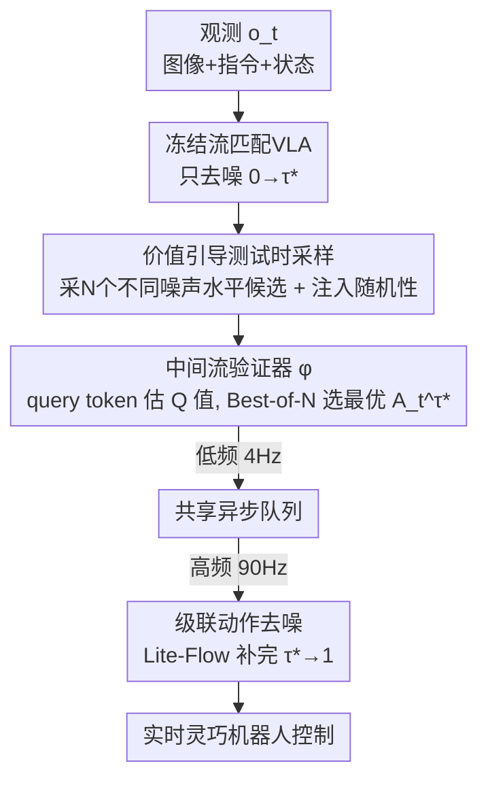

# FM-Steer: Enhance Generalist Policies with Value-Guided Cascaded Denoising

**会议**: CVPR 2026  
**论文**: [CVF Open Access](https://openaccess.thecvf.com/content/CVPR2026/html/Song_FM-Steer_Enhance_Generalist_Policies_with_Value-Guided_Cascaded_Denoising_CVPR_2026_paper.html)  
**代码**: https://hume-vla.github.io （项目页）  
**领域**: 机器人 / 具身智能 / VLA  
**关键词**: 测试时计算, 流匹配VLA, 价值引导采样, 级联去噪, 机器人操作  

## 一句话总结
FM-Steer 给流匹配（flow-matching）VLA 通用策略加了一套测试时计算框架：用一个中间流验证器对"半去噪"的候选动作打 Q 值、Best-of-N 选最优，再把选中的噪声动作交给一个轻量 Lite-Flow 去噪器异步补完剩余去噪，从而在不重训基座、还把控制频率从 4 Hz 拉到 90 Hz 的前提下，让 π0 在 LIBERO/Simpler/真机上分别涨 +4.4%/+25.9%/+12.9%。

## 研究背景与动机
**领域现状**：通用机器人策略（VLA）目前主流是把视觉-语言模型接一个动作专家来预测未来动作块。自回归式 VLA（RT-2、OpenVLA）把动作离散成 token 续写，而 π0、GR00T N1 这类**流匹配 VLA** 用连续的 flow matching 生成动作块，灵巧操作上明显更强。与此同时，LLM 领域"测试时计算（test-time scaling）"——多采样几条候选再选最好——已被证明能大幅提升复杂任务表现。

**现有痛点**：把"重复采样 + 验证"搬到机器人上的工作（V-GPS、RoboMonkey）有两个硬伤。其一，它们都只针对**自回归 VLA**，没法用在更强的流匹配 VLA 上——因为流匹配是确定性 ODE，朴素重复采样根本采不出多样候选。其二，重复采样把推理时间堆上去，控制频率被压得很低，灵巧/动态任务会抖动甚至直接失败。

**核心矛盾**：机器人控制比文本生成多了一条**实时性硬约束**——多花的推理算力会变成延迟。于是"测试时多算一点拿表现"和"保住高控制频率"天然对立：V-GPS/RoboMonkey 提了表现却把频率拖垮。

**本文目标**：分解成两个子问题——(1) 怎么对**流匹配 VLA** 做有效的测试时计算（先解决"采不出多样候选"）；(2) 怎么在多花算力的同时**还把控制频率提上去**（而不是降下来）。

**切入角度**：作者的关键观察是——验证不必等动作"完全去噪"才做。在 flow matching 的 Euler 前向轨迹上，**中间的噪声动作（flow point）**就已经携带了足够的信息可以打分；既然如此，就让昂贵的"采样+验证"只跑前半段、把便宜的"补完去噪"切出去异步快跑。

**核心 idea**：用"对中间噪声动作做价值引导采样 + 把剩余去噪级联给一个轻量去噪器异步完成"，把"测试时多算"和"高频控制"解耦开——慢的验证在低频（4 Hz）选好动作，快的 Lite-Flow 在高频（90 Hz）持续补完，互不卡顿。

## 方法详解

### 整体框架
FM-Steer 以一个现成的流匹配 VLA 为基座（冻结不动），在它外面挂两个模块：**中间流验证器 $\varphi$**（estimate Q 值、选最优候选）和 **Lite-Flow 去噪器 $\phi$**（轻量 transformer，补完剩余去噪）。

先回顾基座：流匹配 VLA 学一个条件向量场 $v_\theta(A_t^\tau, o_t)$，目标是最小化 $\mathcal{L}_{FM}=\mathbb{E}\lVert v_\theta(A_t^\tau,o_t)-u(A_t^\tau\mid A_t)\rVert^2$，其中真值场 $u(A_t^\tau\mid A_t)=\epsilon-A_t$，噪声动作 $A_t^\tau=\tau A_t+(1-\tau)\epsilon$，$\tau\in[0,1]$ 是噪声水平。推理时从纯噪声 $A_t^0\sim\mathcal{N}(0,I)$ 出发，用前向 Euler $A_t^{\tau+\delta}=A_t^\tau+\delta v_\theta(A_t^\tau,o_t)$ 一步步去噪到 $A_t^1$。

FM-Steer 把这条"从 0 到 1 的去噪轨迹"在 $\tau^*$ 处切成两段：基座 VLA 只跑 0→$\tau^*$（采出一批**噪声中间动作**作为候选），验证器从中选出 Q 值最高的最优候选 $A_t^{\tau^*}$，再把它切片、交给 Lite-Flow 跑 $\tau^*$→1 补完。部署时验证侧低频跑（4 Hz）做价值引导采样，Lite-Flow 侧从一个共享队列里不断取最新选中的动作高频补完（90 Hz），两者**异步协作**。

### 关键设计

**1. 价值引导测试时采样：在中间噪声动作上做 Best-of-N，而不是等动作生成完**

针对"流匹配是确定性 ODE、朴素重复采样采不出多样候选"且"等动作全去噪完才验证太慢"两个痛点。FM-Steer 不像 V-GPS/RoboMonkey 那样对**最终动作**采样验证，而是沿 Euler 前向轨迹采**中间噪声动作（flow point）**$A_t^{\tau_n}$。要采出多样候选，作者做了两件事。一是**强制候选间噪声水平不同**：第 $n$ 个候选的噪声水平设为 $\tau_n=T-(n-1)\xi$，即

$$A_t^{\tau_n}=\int_0^{T-(n-1)\xi} v_\theta(A_t^\tau,o_t)\,d\tau+\epsilon_n,$$

其中 $T\in(0,1)$ 是候选噪声上界（控制基座要承担多少去噪算力），$\xi$ 控制相邻候选的噪声间隔，每个 $\epsilon_n\sim\mathcal{N}(0,I)$ 独立采样。二是**给 Euler 前向注入随机性（noise forcing）**：把每个前向步建模成各向同性高斯 $p(A_t^{\tau+\delta}\mid A_t^\tau)\sim\mathcal{N}(\mu_\tau,\Sigma_\tau)$，方差 $\Sigma_\tau$ 是控制候选多样性的超参，均值 $\mu_\tau=A_t^\tau+v_\theta(A_t^\tau,o_t)\cdot\delta$ 仍按原 ODE 更新。这样既破了确定性、采出了多样候选，又因为只跑到 $\tau^*$ 而非 1，省下了基座大量测试时算力。

**2. 中间流验证器：用 query token 估"状态-动作价值"，离线 RL 训练**

针对"怎么判断哪个候选更好"。FM-Steer 引入验证器 $\varphi$，并用一个可学习的**特殊 query token $q_t$** 把它与基座紧耦合：$q_t$ 接在基座输入序列末尾、维度同语言 token，因为在最末位置，它能 attend 到前面所有 VLM 输入，在基座前向完成后聚合当前观测。随后 $q_t$ 与候选 $A_t^{\tau_n}$ 一起喂进验证器，估出状态-动作价值 $Q_\varphi(q_t,A_t^{\tau_n})$，再用最朴素的 Best-of-N 选最优：

$$A_t^{\tau^*}=\arg\max_{A_t^{\tau_n}} Q_\varphi(q_t,A_t^{\tau_n}).$$

训练上有个关键细节：验证器估的是**中间噪声动作**的 Q 值（不是最终动作），所以数据集 $D$ 里的"动作"被设成中间噪声动作 $A_t^T=T\cdot A_t+(1-T)\cdot\epsilon$；奖励用稀疏二值——每条 episode 最后 3 个 transition 记 +1（任务完成），其余记 0；用 calibrated Q-learning 优化。⚠️ 公式与奖励设定以原文为准。这一设计让"在去噪半途就提前发现高价值方向"成为可能，也正是它能从失败状态里"评估多条候选、选一条更好的前进轨迹"恢复过来。

**3. 级联动作去噪：把昂贵采样和快速补完解耦，靠 Lite-Flow 异步拉高控制频率**

针对"重复采样把控制频率拖垮"这个实时性硬约束。最优候选 $A_t^{\tau^*}$ 是一个噪声水平 $\tau^*$、horizon 为 $H$ 的噪声动作块；FM-Steer 把它**均匀切成 $K$ 个 horizon 为 $h$ 的子动作块**，对第 $k$ 个子块 $A_{t,k}^{\tau^*}$ 连同其观测 $o_{t,k}$，由 Lite-Flow 继续补完剩余去噪：

$$A_{t,k}=\int_{\tau^*}^{1} v_\phi(A_{t,k}^\tau,o_{t,k})\,d\tau+A_{t,k}^{\tau^*}.$$

于是整条去噪被**拆到两个模型上**：基座只跑 0→$\tau^*$，Lite-Flow 跑 $\tau^*$→1。Lite-Flow 是个轻量 transformer，仍用 Eq.(1) 的 flow matching loss 训练，但因为它从 $\tau^*$ 起步而非纯噪声，真值场要改写成 $u(A_{t,k}^\tau\mid A_{t,k})=A_{t,k}^{\tau_n}-A_{t,k}$。两个模块的数据都能从同一份机器人示范集构造，所以可同时训练。部署时二者**异步**：验证器低频（4 Hz）选好动作丢进共享队列，Lite-Flow 高频（90 Hz）从队列取最新动作连续补完——慢的测试时计算和快的反应式控制就这样并行起来，既不互相阻塞，又让控制频率不降反升。

### 一个完整示例
初始时刻 $t$：基座 VLA 低频生成 $N=5$ 个候选动作块 $\{A_t^{\tau_1},\dots,A_t^{\tau_5}\}$（horizon $H=30$，各自噪声水平不同）→ 验证器算 5 个 Q 值、选出最优 $A_t^{\tau^*}$ 存进共享队列 → 从 $A_t^{\tau^*}$ 前 $h=15$ 步切出子块 $A_{t,1}^{\tau^*}$ 交给 Lite-Flow → Lite-Flow 高频去噪出完整动作 $A_{t,1}$、立即在真机执行这 15 步 → 等机器人把 $\{A_{t,1}^{\tau^*},A_{t,2}^{\tau^*}\}$ 两个子块都执行完，Lite-Flow 再从队列取最新动作块继续。验证器和 Lite-Flow 各跑各的频率，异步衔接。

## 实验关键数据
评测覆盖 3 个仿真 benchmark（LIBERO / SimplerEnv WidowX / SimplerEnv Google Robot）和 3 个真机平台（WidowX 250s、Franka、AgiBot G-1），共 15 个学习场景、21 个真机任务。训练用 8×A100，部署单卡 RTX 4090；噪声上界 $T$ 取 0.7~0.9，每步采 $N=5$ 候选。

### 主实验：LIBERO（成功率 SR）
| Model | Spatial | Object | Goal | Long | Overall |
|--------|------|------|------|------|------|
| OpenVLA-OFT | 97.6% | 98.4% | 97.9% | 94.5% | 97.1% |
| GR00T N1 | 94.4% | 97.6% | 93.0% | 90.6% | 93.9% |
| π0（基座） | 96.8% | 98.8% | 95.8% | 85.2% | 94.2% |
| π0.5 | 98.8% | 98.2% | 98.0% | 92.4% | 96.8% |
| **FM-Steer (GR00T N1)** | 97.5% | 99.1% | 97.4% | 95.4% | 97.3% |
| **FM-Steer (π0)** | 98.6% | 99.8% | 99.4% | 96.7% | **98.6%** |

FM-Steer(π0) 拿下所有策略中最高平均 SR 98.6%（比基座 π0 的 94.2% 涨 +4.4%），且套在 GR00T N1 上也能涨，说明它是个**即插即用的增强器**。

### 主实验：SimplerEnv（vs 之前的测试时计算方法）
| Method | WidowX Overall | Google(Matching) | Google(Aggregation) |
|--------|------|------|------|
| OpenVLA | 37.7% | 35.4% | 30.0% |
| V-GPS | 37.0% | 36.1% | 30.2% |
| RoboMonkey | 47.8% | 37.3% | 30.5% |
| π0（基座） | 69.2% | 71.4% | 54.7% |
| **FM-Steer (π0)** | **79.5%** | **76.6%** | **60.3%** |

在 WidowX 上 FM-Steer 比 V-GPS 高 +42.5%、比 RoboMonkey 高 +31.7%；Google Robot 的 matching/aggregation 也都最优，体现出强视觉泛化与抗 OOD 能力。⚠️ 论文里"对 π0 涨 +25.9%"应指 Simpler 维度的相对提升，具体口径以原文为准。

### 消融实验（LIBERO + SimplerEnv，Table 3）
| 配置 | LIBERO | SimplerEnv | Overall | 说明 |
|------|------|------|------|------|
| [5] FM-Steer (π0) 完整 | 98.6 | 75.1 | **81.0** | — |
| [1] w/o 级联去噪（$T=1$） | 95.9 | 72.1 | 78.1 | 基座跑完整去噪，候选都来自同一分布，可选范围缩小 |
| [2] w/o 重复采样（只采 1 个） | 93.8 | 69.1 | 75.3 | 没候选可选，价值估计用不上 |
| [3] w/o Lite-Flow 去噪器 | 89.8 | 65.8 | 71.8 | 噪声动作直接控制机器人，动不精细 |
| [4] w/o 流验证器（随机选） | 84.9 | 61.4 | 67.3 | 随机选 1/5，可能选到有害候选 |

### 关键发现
- **流验证器是头号功臣**：去掉它（随机选候选）掉得最狠——SimplerEnv −14.95%、LIBERO −13.7%、**真机 −78%**，说明"选对候选"在复杂真实场景里是成败关键。
- **Lite-Flow 去噪器对真机至关重要**：去掉后直接拿噪声动作控机器人，SimplerEnv −9.8%、LIBERO −8.8%、**真机 −63%**，可见精细补完去噪在真机上几乎是刚需。
- **失败恢复能力突出**：在"把绿杯放到粉布上"等复杂任务上，GR00T/π0-FAST/OpenVLA 抓取/放置常失败且陷在错误状态出不来；FM-Steer 靠价值引导能评估多条候选、选更优轨迹，从失败里恢复，真机 10 任务平均 91% SR，比 π0 高 12%、比 OpenVLA 高 33%。
- **高频真机也能打**：Franka(20 Hz) 平均 87%、AgiBot G-1(30 Hz) 82%，分别比 π0 高 14.75% / 20%，证明它在"既要长程规划又要高频控制"的灵巧任务上站得住。

## 亮点与洞察
- **"验证不必等去噪完"是最妙的一拍**：把 Best-of-N 从"最终动作"前移到"中间噪声动作"，一举同时解决了流匹配采不出多样候选 + 验证太慢两个问题——这个"在轨迹半途就评估"的视角可迁移到任何 ODE/扩散式生成的测试时筛选。
- **级联去噪做对了解耦**：慢验证（4 Hz）与快补完（90 Hz）异步 + 共享队列，把"多算"和"高频"从对立变成并行，控制频率不降反升，这是它区别于 V-GPS/RoboMonkey 的根本。
- **冻结基座、外挂两模块、同源数据同时训**：不重训昂贵基座就能涨点，工程上极友好；query token 末位 attend 全序列来聚合观测，是把验证器轻量接入 VLM 的巧法。

## 局限与展望
- **依赖离线 RL 训出的价值估计**：验证器用稀疏二值奖励 + calibrated Q-learning 训练，奖励设计（末 3 个 transition 记 +1）较粗，价值估计质量直接决定 Best-of-N 选得对不对，在奖励难定义的任务上可能受限。
- **多了两个待调超参**：噪声上界 $T$、相邻候选间隔 $\xi$、随机性方差 $\Sigma_\tau$、候选数 $N$、切片 horizon $h$ 都需调，论文也承认 $T$ 取 0.7/0.9 表现不同，部署时需针对平台调。
- **异步双频依赖共享队列**：两模块跑在不同频率靠队列衔接，极端动态场景下队列里动作的"新鲜度"是否够、会不会用到过时观测，论文未深入讨论。⚠️ 这是笔者的推测性担忧。
- **改进思路**：把固定 $N$/$T$ 换成按状态难度自适应分配测试时算力（难任务多采、易任务少采），可能进一步省算力。

## 相关工作与启发
- **vs V-GPS / RoboMonkey**：它们也走"重复采样+验证"，但只针对**自回归 VLA**、且对**最终动作**采样，导致频率被拖垮、且没法用在流匹配 VLA 上；FM-Steer 改成对**中间噪声动作**采样验证 + 级联异步补完，既能增强更强的流匹配基座，又把频率提上去。SimplerEnv 上 +30~40% 的差距主要来自这。
- **vs π0 / GR00T N1（流匹配基座）**：它们是 FM-Steer 的增强对象——FM-Steer 不改基座、在测试时给它们加价值引导采样和级联去噪，相当于"免训练涨点插件"。
- **vs 图像域的级联去噪（Cascaded Diffusion、f-DM 等）**：级联去噪过去用于逐级生成高分辨率图像；本文首次把它搬到**动作生成**——不是为了提分辨率，而是为了把去噪算力拆到两模型上换取实时控制频率，用途完全不同。

## 评分
- 新颖性: ⭐⭐⭐⭐⭐ 首个面向流匹配 VLA 的测试时计算框架，"中间噪声动作上做价值引导 + 级联异步去噪"思路新且自洽。
- 实验充分度: ⭐⭐⭐⭐⭐ 3 仿真 + 3 真机平台、21 真机任务，主实验/对比/消融/可视化齐全。
- 写作质量: ⭐⭐⭐⭐ 方法与公式清晰，但部分超参细节与部分百分比口径需翻附录对齐。
- 价值: ⭐⭐⭐⭐⭐ 免重训即插即用、还把控制频率拉到 90 Hz，对落地灵巧操作很有吸引力。

<!-- RELATED:START -->

## 相关论文

- [\[ICML 2026\] RoboMME: Benchmarking and Understanding Memory for Robotic Generalist Policies](../../ICML2026/robotics/robomme_benchmarking_and_understanding_memory_for_robotic_generalist_policies.md)
- [\[ICLR 2026\] Scalable Exploration for High-Dimensional Continuous Control via Value-Guided Flow](../../ICLR2026/robotics/scalable_exploration_for_high-dimensional_continuous_control_via_value-guided_fl.md)
- [\[CVPR 2026\] OctoNav: Towards Generalist Embodied Navigation](octonav_towards_generalist_embodied_navigation.md)
- [\[CVPR 2026\] InternData-A1: Pioneering High-Fidelity Synthetic Data for Pre-training Generalist Policy](interndata-a1_pioneering_high-fidelity_synthetic_data_for_pre-training_generalis.md)
- [\[CVPR 2026\] FloVerse: Floor Plan-Guided Multi-Modal Navigation](floverse_floor_plan-guided_multi-modal_navigation.md)

<!-- RELATED:END -->
