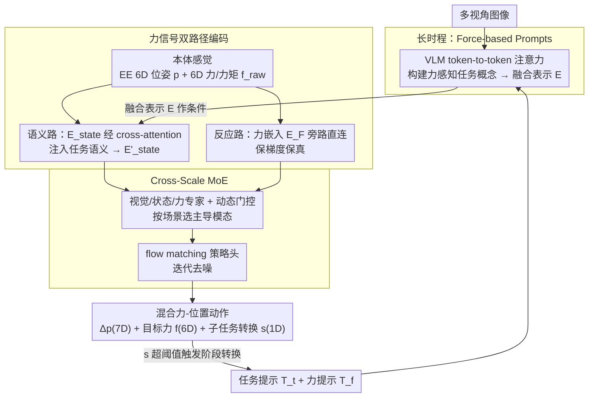

# ForceVLA2: Unleashing Hybrid Force-Position Control with Force Awareness for Contact-Rich Manipulation

**会议**: CVPR 2026  
**arXiv**: [2603.15169](https://arxiv.org/abs/2603.15169)  
**代码**: [项目主页](https://sites.google.com/view/force-vla2/home)  
**领域**: 机器人操作 / 视觉-语言-动作模型  
**关键词**: [VLA, 力控制, 混合力-位置控制, MoE, 接触丰富操作, 力感知]  

## 一句话总结
提出ForceVLA2，首个在VLA框架中统一力感知(force awareness)与混合力-位置控制(hybrid force-position control)的端到端模型：通过Force-based Prompts在VLM中构建跨阶段力感知任务概念，Cross-Scale MoE自适应融合任务语义与实时交互力实现闭环力-位置调节，在5个contact-rich任务上平均成功率66%，超π₀和π₀.5分别48.0%和35.0%。

## 背景与动机
当前VLA模型（如π₀、OpenVLA、GR00T-N1）在语义理解和语言跟随方面表现出色，但存在一个根本性缺陷：

1. **缺乏力推理与主动力交互能力**：现有VLA全部基于纯位置控制，将力仅作为辅助感知输入（如ForceVLA），而非主动的控制信号。这在contact-rich任务（擦拭、按压、装配）中导致机械臂过载、接触不稳定等严重失败模式。
2. **缺乏阶段性力感知**：contact-rich任务通常包含3-5个子任务阶段（如"接近→接触→施力→松开"），每个阶段对力的要求截然不同。现有VLA无法推理不同阶段的力目标，也无法根据力反馈判断子任务完成进度。
3. **力-位置耦合控制缺失**：从控制论角度，纯位置控制系统的可控性矩阵秩为6（只能控制6D位姿），无法独立控制12维的力-位置联合空间——力是环境动力学的被动输出而非独立可控变量。

根本原因：人类依靠高层视觉-语言推理确定阶段性目标，同时整合实时力反馈自适应调节力和位置。现有VLA缺乏这种多尺度力感知与主动力交互的统一机制。

## 核心问题
如何让VLA模型 (1) 在不同任务阶段构建力感知的任务概念并追踪阶段进度，(2) 将高层任务语义与实时交互力自适应融合，(3) 实现真正的闭环混合力-位置控制而非仅将力当辅助感知？

## 方法详解

### 整体框架

ForceVLA2 要让 VLA 真正"会用力"——不再把力当成旁观的辅助感知，而是主动输出力目标并闭环调节。它受人类感觉运动控制启发做成双层级：长时程层把力信息以文本提示（Force-based Prompts）注入 VLM，构建跨阶段的力感知任务概念；短时程层先把实时力信号做**双路径编码**（一路融进任务语义、一路旁路直连保梯度），再用 Cross-Scale MoE 按场景动态决定信视觉还是信力，输出混合力-位置动作。输入是多视角图像 + 任务提示 + 力提示 + 本体感觉状态（EE 6D 位姿 + 6D 力/力矩），输出 EE 位姿增量 $\Delta p \in \mathbb{R}^7$ + 目标接触力 $f \in \mathbb{R}^6$ + 子任务转换指示器 $s \in [0,1]$；其中 $s$ 越过阈值就触发阶段转换、刷新力提示，形成跨阶段的闭环。

### 关键设计

**1. Force-based Prompts：把"这一阶段该用多大力"写进 VLM 的任务概念**

contact-rich 任务往往分成 3-5 个阶段（接近→接触→施力→松开），每个阶段对力的要求截然不同，而现有 VLA 既不会推理阶段性的力目标、也不会拿力反馈判断子任务进度。ForceVLA2 给 VLM 喂两类文本提示：任务提示 $T_t$ 描述全局目标（如"擦拭花瓶"），力提示 $T_f$ 编码当前子任务状态和阶段性力目标（如"阶段2：保持 5N 下压力擦拭表面"）；每个任务预定义 3-5 个子任务，力提示充当一个离散状态机，决定是维持当前子任务还是转去下一阶段。视觉 token $Z_v$ 经视觉编码器 $f(\cdot)$ 处理后，与任务/力提示拼接、经文本编码器 $g(\cdot)$ 处理的语言 token 一起送进 VLM 做 token-to-token attention，得到融合的多模态表示 $E$。这样 VLM 既继承了预训练知识，又长出了评估子任务完成度、跨阶段转换、显式更新力线索的能力。

**2. 力信号的双路径编码：一路融语义、一路保梯度保真**

把力简单拼进网络反而会当干扰（实验里 π₀ w/ F 的 17% 还不如不加力的 18%），关键在于怎么注入。ForceVLA2 把 EE 6D 位姿 $p \in \mathbb{R}^7$ 经线性层 $\phi_P$ 编成 $E_P$，原始 6D 力/力矩 $f_{raw} \in \mathbb{R}^6$ 经线性层 $\phi_F$ 编成 $E_F$，而 $E_F$ 同时走两条路：一条与 $E_P$ 拼成 $E_{state}$、通过 cross-attention 与视觉-语言特征 $E$ 交互，注入全局任务语义，让力被"理解";另一条**旁路直连**到 MoE，跳过高层融合，保住原始力信号的梯度保真度，形成一个短时程反应式回路。一融一直，力既能被语义解读，又能以最低延迟驱动实时反应。

**3. Cross-Scale MoE：按场景动态决定信视觉还是信力**

把语义和实时力凑齐了，还得让模型自己判断什么时候该信谁。Cross-Scale MoE 包含视觉、状态、力三个模态专用 expert（各为轻量 MLP），动态门控网络算出 token 级路由权重 $w=[w_V, w_S, w_F]$——自由空间运动时自动偏重视觉推理，接触阶段自动偏重力或位置线索。融合表示 $E_{MoE}$ 送进 flow matching 策略头：从噪声 $a_t(0)\sim N(0,I)$ 出发、条件于 $E_{MoE}$ 迭代去噪，最终输出 $a_t = [\Delta p_t; f_t; s_t]$，即位姿增量(7D) + 目标力(6D) + 子任务转换概率(1D)。其中转换概率 $s_t$ 由位置接近度、姿态对齐度、力满足度三个量的联合概率算出——分别用 Beta、指数、均匀分布建模，超过阈值就触发子任务转换并重置。从控制论角度看，这一路把可控性从纯位置的 6D 扩展到了接近 12D 的力-位置联合空间。

**4. ForceVLA2-Dataset：带真实力标注的 contact-rich 数据**

力控方法之所以稀缺，很大原因是没有带力标注的数据。作者自采了一套：硬件是 Flexiv Rizon 4s 7-DOF 机械臂 + DH Robotics AG-95 自适应夹爪 + 3 个 RGB 相机（2 个 Intel RealSense D455 第三人称 + 1 个 D435 腕部）+ 6D 力/力矩传感器（300Hz）；用带力反馈的 GELLO 遥操作框架采集，保留自然的施力模式；覆盖 press bottle、clean vase、clean board、retrieve plate、assemble gears 五个任务，共 1000 条轨迹、约 500K 同步时间步，并基于力信号特征自动分割子任务边界、附上力提示标注。

### 训练策略

- 8×A100 GPU，batch size 32，30K步，约10小时
- 优化器AdamW，Cosine Decay学习率调度，EMA decay 0.99
- 推理速度：4090 GPU上15Hz，chunk size 30

## 实验关键数据

### 主实验（Table 1）

| 方法 | Press bottle | Clean vase | Clean board | Retri. plate | Assem. gears | Avg. |
|------|-------------|------------|-------------|--------------|-------------|------|
| π₀ (w/o force) | 35.0 | 20.0 | 35.0 | 0.0 | 0.0 | 18.0 |
| π₀.5 | 45.0 | 30.0 | 45.0 | 15.0 | 20.0 | 31.0 |
| ACP | 25.0 | 30.0 | 25.0 | 0.0 | 0.0 | 16.0 |
| π₀ w/ F (朴素力输入) | 30.0 | 25.0 | 20.0 | 10.0 | 0.0 | 17.0 |
| ForceVLA | 70.0 | 25.0 | 55.0 | 15.0 | 10.0 | 35.0 |
| **ForceVLA2** | **80.0** | **75.0** | **70.0** | **35.0** | **70.0** | **66.0** |

- vs π₀: +48.0%，vs π₀.5: +35.0%，vs ForceVLA: +31.0%
- Assemble gears任务：70% vs 第二名10%，提升60个百分点——最力敏感的任务差距最大
- π₀ w/ F仅17%反而不如base π₀的18%——简单拼接力输入会作为干扰损害预训练表示

### 消融实验（Table 2）

| FP | ME | CM | Avg. |
|----|----|----|------|
| ✗ | ✗ | ✗ | 18.0 (π₀ baseline) |
| ✓ | ✗ | ✗ | 27.0 (+9) |
| ✓ | ✓ | ✗ | 40.0 (+13) |
| ✓ | ✓ | ✓ | **66.0** (+26) |

- Cross-Scale MoE模块贡献最大增益（+26%）
- Force Prompt单独即可+9%，证明力感知任务概念的价值

### MoE模态融合消融（Table 3）

| VM | FM | Avg. |
|----|-----|------|
| ✗ | ✗ | 36.0 |
| ✓ | ✗ | 50.0 (+14) |
| ✓ | ✓ | **66.0** (+16) |

- 视觉模态和力模态在MoE中贡献大致相当，两者缺一不可

### 力注入位置消融（Table 5）
- VLM Pathway注入：5.0%（严重退化）
- Multimodal Encoder注入：58.0%
- State Fusion（ME + 状态融合）：**66.0%**——最佳方案

## 亮点
- **首个VLA混合力-位置控制框架**：不是将力作为辅助感知，而是让VLA主动输出力目标并闭环控制——从控制论角度将可控性从6D扩展到接近12D
- **多尺度力注入设计精巧**：长时程通过文本prompt构建阶段性力感知（继承VLM推理能力），短时程通过旁路直连保持力信号梯度保真（保证实时反应性），Cross-Scale MoE动态平衡两者
- **子任务转换的概率建模**：用Beta-Exponential-Uniform联合概率建模位置/姿态/力的完成度，优雅地解决了阶段切换判断问题
- **消融实验深入**：不仅分析了模块级贡献，还细致分析了力注入位置（VLM vs ME vs State Fusion）和MoE模态组合，每个设计选择都有实验支撑
- **朴素力输入反面教材**：π₀ w/ F的17%（甚至低于base 18%）有力地证明了"不是加力就行"，需要精心设计力的注入方式

## 局限与展望
- 数据规模有限：1000条轨迹、5个任务，泛化到更多任务和物体时效果未知——需要Open X-Embodiment级别的力控数据集
- 力提示为预定义的离散子任务列表——对未见过的任务需要人工设计力提示，缺乏自动力提示生成能力
- 子任务转换的概率模型假设了特定的参数分布（Beta、指数、均匀）——实际力信号可能不服从这些分布
- 仅在单一硬件平台（Flexiv）上验证——虽然论文声称hardware-agnostic，但未在Franka/UR等其他平台上实际测试
- 推理速度15Hz——对高频力控应用（如高速装配）可能不够快
- Retrieve plate任务成功率仅35%——力引导探测在遮挡较重时仍有较大改进空间

## 与相关工作的对比
- **vs π₀ / π₀.5 (纯位置VLA)**: 缺乏力控能力，在contact-rich任务中成功率仅18%/31%。ForceVLA2通过混合力-位置控制实现66%，差距在力敏感任务（assemble gears）上尤为显著（70% vs 0%/20%）
- **vs ForceVLA (力作为辅助输入)**: ForceVLA将力作为额外模态拼接输入VLA，仍然只输出位置动作。ForceVLA2不仅感知力更主动输出目标力，+31%的提升证明从force perception到force interaction的本质区别
- **vs ACP (自适应顺应控制)**: ACP通过导纳控制隐式引入力，但泛化能力弱（16%），且无法像ForceVLA2一样利用VLM的语义推理能力进行阶段性力规划
- **vs TLA / Tactile-VLA (触觉方法)**: 触觉传感器提供间接力估计，有噪声且无法替代直接力传感。ForceVLA2使用6D力/力矩传感器获得精确力反馈

## 启发与关联
- **力引导的主动探索**：ForceVLA2在Retrieve plate任务中展示了力引导探测——当视觉失败时通过力反馈自主重试抓取。这种"力即感知"的思路可迁移到触觉操作、盲抓等场景
- **多尺度信号融合范式**：长时程语义融合 + 短时程旁路直连的双通道设计，可推广到其他需要快慢信号融合的场景——如自动驾驶中的长期路径规划 + 短期避障反应
- **与AtomicVLA互补**：AtomicVLA擅长多步任务规划和技能分解，ForceVLA2擅长力交互。未来可以结合：用AtomicVLA的think模块做任务规划和技能分解，用ForceVLA2的力控模块执行contact-rich技能

## 评分
- 新颖性: ⭐⭐⭐⭐⭐ 首个VLA混合力-位置控制框架，多尺度力注入设计和概率子任务转换模型均有创新
- 实验充分度: ⭐⭐⭐⭐ 5个真实任务×20次试验 + 完整消融（模块级+模态级+注入位置级），但缺少跨平台验证
- 写作质量: ⭐⭐⭐⭐⭐ 从控制论动机→双层级架构→概率建模→实验验证，逻辑链完整，附录含控制论分析
- 价值: ⭐⭐⭐⭐⭐ 开辟VLA力控新方向，从force perception到force interaction的范式转变，对实际部署意义重大

<!-- RELATED:START -->

## 相关论文

- [\[ICML 2025\] Geometric Contact Flows: Contactomorphisms for Dynamics and Control](../../ICML2025/robotics/geometric_contact_flows_contactomorphisms_for_dynamics_and_control.md)
- [\[CVPR 2026\] DAWN: Pixel Motion Diffusion is What We Need for Robot Control](dawn_pixel_motion_diffusion_robot_control.md)
- [\[CVPR 2026\] Language-Grounded Decoupled Action Representation for Robotic Manipulation (LaDA)](lada_robotic_manipulation.md)
- [\[CVPR 2026\] PULSE: Privileged Knowledge Transfer from Rich to Deployable Sensors for Embodied Multi-Sensory Learning](pulse_privileged_knowledge_transfer_from_rich_to_deployable_sensors_for_embodied.md)
- [\[ICML 2026\] Position: Good Embodied Reward Models Need Bad Behavior Data](../../ICML2026/robotics/position_good_embodied_reward_models_need_bad_behavior_data.md)

<!-- RELATED:END -->
