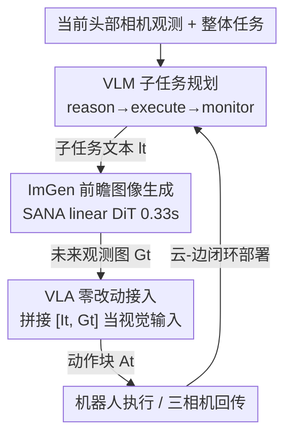

# ForeAct: Steering Your VLA with Efficient Visual Foresight Planning

**会议**: CVPR 2026  
**论文**: [CVF Open Access](https://openaccess.thecvf.com/content/CVPR2026/html/Zhang_ForeAct_Steering_Your_VLA_with_Efficient_Visual_Foresight_Planning_CVPR_2026_paper.html)  
**代码**: https://github.com/mit-han-lab/foreact  
**领域**: 机器人 / 具身智能  
**关键词**: VLA, 视觉前瞻规划, 世界模型, 闭环控制, 子任务规划  

## 一句话总结
不再用一句高层语言指令去驱动 VLA，而是用一个高效的"前瞻图像生成器 + VLM 子任务规划器"逐步给 VLA 喂入"想象出来的未来观测图 + 子任务文本"，让 VLA 只管把图变成动作（visuo-motor），在 11 个真实多步任务上把 π0 的平均成功率从 46.5% 抬到 87.4%（+40.9%）。

## 研究背景与动机
**领域现状**：VLA（Vision-Language-Action）模型把"视觉观测 + 语言指令"端到端映射成机器人动作，是当前通用机器人的主流路线（RT-2、OpenVLA、π0、π0.5、GR00T-N1 等）。

**现有痛点**：这些 VLA 在"抓起一个物体放到指定位置"这类简单任务上还行，一旦遇到复杂、长程、开放环境的任务就力不从心。作者把根因归结为一件事——**VLA 很难把抽象的高层语言指令"接地"到一连串具体可执行的动作上**。让它同时做"高层语义推理"和"低层视觉-动作映射"，是在用一个通常只有 3B 的小骨干硬扛两件难度迥异的事。

**已有缓解路线及其不足**：(1) 把规划和控制塞进同一个模型——但小骨干推理能力有限，在机器人数据上微调又会灾难性遗忘，损伤通用能力；(2) 分层框架，把规划交给一个独立的强模型——缓解了遗忘，但**没有从根本上解决 VLA"指令接地"的难题**，因为交给 VLA 的仍是文字。(3) 用视频生成做视觉预测来引导控制（SuSIE、COT-VLA 等）——理念对，但普遍推理慢、算力贵、多为开环（忽略环境反馈），且与现成 SOTA VLA 不兼容。

**切入角度**：作者的关键观察是——**与其告诉机器人"做什么"，不如直接给它看"做成什么样"**。给一张"桌子收拾干净后"的图，比一句"把桌子收拾干净"信息量大得多。但最终态往往太抽象、缺中间步骤，于是进一步问：能不能**逐步**给机器人提供"视觉指令"，一步一张未来观测图，引着它走到终点？

**核心 idea**：用一个**高效世界模型实时生成"想象中的下一步未来观测图"**，配合 VLM 拆解子任务，把这张图当作额外视觉输入喂给 VLA。这样 VLA 卸掉了高层语义推理的担子，**只需专注 visuo-motor 推理**，精度和泛化双双提升；而且只需"扩充视觉输入"，对现成 VLA 零架构改动。

## 方法详解

### 整体框架
ForeAct 是一个挂在现成 VLA 旁边的视觉前瞻规划器，整体是一个**闭环**：VLM 子任务规划器看一眼当前头部相机观测，生成一个当下要做的子任务文本 → 前瞻图像生成模块 ImGen 据此把"半个子任务之后的未来观测图"画出来 → 这张未来图连同子任务文本、机器人三路相机视图一起喂给 VLA → VLA 输出动作、机器人执行 → VLM 监测新状态、判断子任务是否完成并重规划下一个子任务，如此循环直到任务完成。

形式化地，标准 VLA 学的是条件分布 $\pi(A_t \mid I_t, q_t, l)$，其中 $A_t=[a_t,\dots,a_{t+H-1}]$ 是长度 $H$ 的动作块，$I_t$ 是多相机当前观测，$q_t$ 是本体感知状态，$l$ 是语言指令。ForeAct 把它重写为：

$$\pi(A_t \mid I_t, q_t, l) = \pi_l(A_t \mid [I_t, G_t], q_t, l_t)\,\pi_h(G_t, l_t \mid I_t, l)$$

$\pi_h$ 是前瞻规划器，给出预测未来观测 $G_t$ 和子任务描述 $l_t$；$\pi_l$ 就是 VLA，把 $G_t$ 当成额外视觉输入、$l_t$ 当成语言条件去产生动作。规划器又进一步拆成两块：

$$\pi_h(G_t, l_t \mid I_t, l) = \pi_g(G_t \mid I_t, l_t)\,\pi_v(l_t \mid I_t, l)$$

其中 $\pi_g$ 是核心——前瞻图像生成模型 ImGen，把高层指令"接地"成一张具体的未来观测图；$\pi_v$ 是一个 VLM，负责推理复杂任务、推断子任务。

### 关键设计

**1. 高效前瞻图像生成 ImGen：把"想象的下一步"实时画出来**

这是全方法的核心，要解决的痛点是——视频生成类前瞻方法太慢、太贵、还开环。作者要的是一个能进闭环控制的世界模型：给定当前观测 $I_t$ 和子任务文本 $l_t$，预测一张高分辨率（640×480）的未来观测 $G_t$，且必须够快。架构上直接借用 SOTA 文生图模型 **SANA** 的设计：用 **32× 深度压缩自编码器 DCAE** 把图编码到极紧凑的 latent（大幅减少 token 数），再用 **linear DiT** 把高分辨率下的注意力计算变成线性复杂度。SANA 本是文生图、不吃图像条件，作者的改造很直接——**把条件图像与噪声输入在 token 维拼接**，从而把去噪过程变成"以当前图为条件的条件去噪"。训练目标沿用 flow matching，从 SANA-1.6B-512px 权重初始化以继承图像先验。为保泛化，模型**只吃视觉 + 语言、不吃本体感知**（避免绑死某种机器人形态），且**只为头部相机生成**（全局视野信息量最大）。最终在 H100 上用 8 步去噪即可在 **0.33s** 内产出可靠图像（1–2 步会有严重伪影，>8 步收益可忽略）。

**2. 千万级跨形态预训练：让世界模型学会通用的"具身动力学"**

光有架构不够，世界模型得真懂"动作会让世界怎么变"。作者从 AgiBot-World Colosseo、RoboMind、Galaxea Open-World、Bridge 四个开源数据集收集大规模**跨形态、多任务**数据（刻意排除 Open-X-Embodiment、DROID 因其相机分辨率太低）。预处理上，对已自带子任务切分的长程数据集直接采用其切分，对简单的 Bridge 直接用原任务描述，共得 **116 万个子任务**。在每个子任务内按 1 秒间隔采条件帧，并为每个条件帧取"半个子任务长度之后"的帧作为未来帧（这个偏移能让帧对呈现出有意义的动作变化），配对语言即该子任务动作描述，最终约 **1000 万对**训练数据。全局 batch 512、64 张 H100 上训 80 万步。消融显示：不预训练时模型在 OOD 任务上**完全失败**（保真度/质量 0.00），印证预训练是泛化能力的来源。

**3. VLM 的"推理-执行-监测"循环：把闭环和失败恢复管起来**

ImGen 负责画图，但"现在该做哪个子任务、上一步做完没、要不要重规划"得有人管——这是 VLM（Qwen-3-VL-8B-Instruct）的活，运行在一个 **reason–execute–monitor** 三拍循环里：给定整体任务和当前观测，先 **reason** 出一个当下立即可执行的子任务；VLA 执行后，VLM **monitor** 评估更新后的状态、跟踪进度，若当前子任务已完成就**重规划**下一个。正是这个监测-重规划环让系统能从执行失败里动态恢复、适应环境不确定性——在组合式 OOD 任务里，基线会卡在"反复去抓一个已经被拿走的位置"的死循环，而 ForeAct 靠 VLM 监测出进度、给出对应的下一步前瞻图，从而把三个不同子任务依次走完。

**4. 对 VLA 零架构改动接入 + 云-边闭环部署：让现成 SOTA VLA 即插即用**

前瞻规划再好，若要改 VLA 架构就难落地。ForeAct 的接入方式只动**视觉输入**：微调时把当前观测与"未来观测"在视觉输入上拼接（未来观测取每个子任务片段的末帧）；推理时把 ImGen 生成的前瞻图追加到当前观测后作为视觉输入，生成的子任务文本作为语言输入——VLA 本身一行架构都不用改，π0、π0.5 都能直接套。部署上设计了**分层云-边闭环**：边端（VLA 跑在 RTX 5090）负责反应式本地控制、采集并上传观测；云端（VLM + ImGen 用 vLLM 跑在 H100）负责高层规划与前瞻生成，把结果蒸馏成一个"双引导包"（文本 $l_t$ + 视觉 $G_t$）回传边端，边端 VLA 快速推理派发最终动作，形成响应式闭环。

### 损失函数 / 训练策略
ImGen 用 flow matching 目标训练，图像统一 resize 到 640×480，恒定学习率 5e-5（5K 步 warmup），从 SANA-1.6B-512px 初始化。部署到具体机器人时做轻量微调：在自采真实数据上 batch 32、训 5 个 epoch、恒定 lr 1e-5、不 warmup。VLA（π0 / π0.5）在子任务级片段上微调，视觉输入扩充为"当前观测 + 未来观测"拼接。

## 实验关键数据

### 主实验：真实世界 11 任务（π0 骨干）
在 Galaxea R1 Lite 双臂移动机械臂上采集 11 个 Kitchen / Workspace / Factory 真实任务（420 episode → 2312 子任务级 episode），按"原子动作"成功率打分。

| 系统 | 平均成功率 | 相对 π0 |
|------|-----------|---------|
| π0（3.3B VLA 基线） | 46.5% | — |
| VLM + π0（加文本子任务引导） | 57.1% | +10.6% |
| **Ours（ForeAct）** | **87.4%** | **+40.9%** |

ForeAct 在全部 11 个任务上都最高，且每个任务成功率均 >70%；相对"仅加文本子任务引导"的 VLM+π0 也有 **+30.3%**，说明涨点主要来自"视觉前瞻"而非单纯的子任务拆解。

### 换更强骨干 π0.5（代表性子集）
| 任务 | π0.5 | Ours | 任务 | π0.5 | Ours |
|------|------|------|------|------|------|
| Pick_Veg | 60.0 | 86.6 | Office_Desk | 76.0 | 85.4 |
| Place_Bowl | 75.0 | 83.3 | Pick_Tool | 50.0 | 96.7 |
| Pen_Drawer | 68.8 | 81.3 | Pack_Flower | 91.8 | 95.8 |

平均成功率从 70.3% 提到 **88.2%**，证明该框架对更强 VLA 同样有效、具可扩展性。

### LIBERO 仿真（π0.5 骨干）
| 方法 | Spatial | Object | Goal | Long | 平均 |
|------|---------|--------|------|------|------|
| OpenVLA | 84.7 | 88.4 | 79.2 | 53.7 | 76.5 |
| CoT-VLA | 87.5 | 91.6 | 87.6 | 69.0 | 83.9 |
| π0.5 | 97.3 | 98.8 | 96.9 | 94.2 | 96.8 |
| CogVLA | 98.6 | 98.8 | 96.6 | 95.4 | 97.4 |
| **Ours (w/ π0.5)** | 97.3 | **99.8** | **97.3** | 95.4 | **97.5** |

即便 π0.5 已近饱和，仍能把平均从 96.8% 抬到 97.5%。

### 消融与分析

**前瞻图像生成：预训练的作用（Table 1，人评 0/1 打分，各 50 张）**

| 配置 | 域内保真度 | 域内质量 | OOD 保真度 | OOD 质量 |
|------|-----------|---------|-----------|---------|
| w/o 预训练 | 0.18 | 0.24 | 0.00 | 0.00 |
| w/ 预训练 | 1.00 | 1.00 | 0.88 | 0.96 |

不预训练时 OOD 完全失败、域内也极低，说明 116 万子任务的跨形态预训练是泛化能力的根本来源。

**指令模态消融（Pick_Tool，Table 4）**：单 π0 用语义文本仅 20.0%，换成"空间位置文本"涨到 46.8%（绕开了语义接地），而 Ours（语义文本 + 目标图）达 **93.4%**——印证细粒度图像引导远胜粗糙文本。

### 关键发现
- **涨点来自"看图"而非"拆子任务"**：VLM+π0 已经做了子任务拆解只到 57.1%，加上视觉前瞻才跳到 87.4%，差距（+30.3%）说明视觉指令是核心。
- **数据效率惊人**：在 Clean_Rubb 任务上，ForeAct 用 60% 数据即 >90% 成功率、20% 数据仍有 79%，远超基线；因为它把"抽象语义指令"转成了"具体视觉目标"，不需要穷举所有配置（如 Pick_Tool 有 600 种组合，遥操作采全不现实，ForeAct 93.4% 而基线 <30%）。
- **组合式 OOD 鲁棒**：在 Pick_Veg 的"空间/组合/联合 OOD"变体上，ForeAct 维持 58–77%，而 π0、VLM+π0 跌到 5–46%；基线会卡在"反复抓空位"的死循环，ForeAct 靠 VLM 监测 + 逐步前瞻图走通全程。
- **够快**：8 步去噪、0.33s 生成 640×480 未来图，使其真正能进实时闭环控制。

## 亮点与洞察
- **"展示而非告知"的范式转换**：核心洞察是把 VLA 难做的"语言→动作接地"换成它擅长的"图像→动作映射"，用一张想象的未来图替代一句抽象指令。这个思路可迁移到任何"高层意图难落地"的策略学习上。
- **把文生图 SOTA 改造成实时世界模型**：复用 SANA 的 DCAE + linear DiT，靠"条件图与噪声拼接"零成本把文生图变条件图生图，0.33s 进闭环——这是"算力高效"和"世界模型"罕见兼得的工程范例。
- **零侵入接入**：只扩充视觉输入、不改 VLA 架构，意味着任何现成/未来的 SOTA VLA 都能白嫖这套前瞻引导，落地门槛极低。
- **闭环监测是 OOD 鲁棒的隐形功臣**：很多前瞻方法是开环的，ForeAct 用 VLM 的 monitor-replan 把"画错/执行失败"兜住，这是它在组合 OOD 上不崩的关键。

## 局限与展望
- **依赖重型云端算力**：ImGen + VLM 部署在 H100、VLA 在 RTX 5090，云-边架构虽巧但对算力和网络延迟有要求，纯边端实时性存疑（⚠️ 论文未给端到端闭环延迟分解，只给了 0.33s 的图像生成单项）。
- **未来观测取"子任务末帧"是近似监督**：训练时用片段末帧当未来目标、采"半个子任务后"的帧，这种启发式偏移对动作变化剧烈或时长不均的子任务是否最优，论文未充分消融。
- **评测局限单一平台**：真实实验只在 Galaxea R1 Lite 一种双臂平台上做，跨本体的真实部署泛化（而非仅预训练数据多样）仍待验证。
- **图像保真度靠人评 0/1**：Table 1 用人工二值打分，缺更客观的连续指标，"保真度=是否走在完成任务的正确路径上"的判定带主观性。

## 相关工作与启发
- **vs π0 / π0.5（端到端 VLA）**：它们让单个小骨干同时扛语义推理和动作生成；ForeAct 把语义推理外包给 VLM+ImGen，VLA 只做 visuo-motor，且零改动即可叠加，在 π0 上 +40.9%、π0.5 上 +17.9%。
- **vs CoT-VLA / SuSIE（统一模型内生成目标图）**：CoT-VLA 在一个统一模型里生成目标图 + 动作；ForeAct 把前瞻生成解耦成独立高效模块，可跨任意 SOTA VLA 复用，且闭环 + 0.33s 实时。
- **vs 视频生成做控制（开环路线）**：现有视频生成法慢、贵、多开环且不兼容 SOTA VLA；ForeAct 单张前瞻图 0.33s、闭环、即插即用，是其针对性回应。
- **vs 分层规划（规划交给独立强模型）**：分层法缓解了遗忘但交给 VLA 的仍是文字、没解决接地问题；ForeAct 给的是"视觉指令"，从根上简化了接地。

## 评分
- 新颖性: ⭐⭐⭐⭐⭐ "用想象的未来观测图逐步引导 VLA"的范式转换清晰有力，把高效文生图模型改造成实时闭环世界模型很巧。
- 实验充分度: ⭐⭐⭐⭐⭐ 真实 11 任务 + 两种骨干 + LIBERO 仿真 + OOD + 数据效率 + 指令模态消融，覆盖全面且涨幅显著。
- 写作质量: ⭐⭐⭐⭐ 动机递进与公式重构讲得很顺，图表清晰；个别部署延迟与监督细节略简。
- 价值: ⭐⭐⭐⭐⭐ 零架构改动、0.33s 实时、数据效率高，对现成 VLA 即插即用，落地价值与可复用性都很高。

<!-- RELATED:START -->

## 相关论文

- [\[CVPR 2026\] HiF-VLA: Hindsight, Insight and Foresight through Motion Representation for Vision-Language-Action Models](hif-vla_hindsight_insight_and_foresight_through_motion_representation_for_vision.md)
- [\[CVPR 2026\] CLaD: Planning with Grounded Foresight via Cross-Modal Latent Dynamics](clad_planning_with_grounded_foresight_via_cross-modal_latent_dynamics.md)
- [\[ICLR 2026\] Sparse Imagination for Efficient Visual World Model Planning](../../ICLR2026/robotics/sparse_imagination_for_efficient_visual_world_model_planning.md)
- [\[CVPR 2026\] Mantis: A Versatile Vision-Language-Action Model with Disentangled Visual Foresight](mantis_a_versatile_vision-language-action_model_with_disentangled_visual_foresig.md)
- [\[CVPR 2026\] Spatial-Aware VLA Pretraining through Visual-Physical Alignment from Human Videos](spatial-aware_vla_pretraining_through_visual-physical_alignment_from_human_video.md)

<!-- RELATED:END -->
