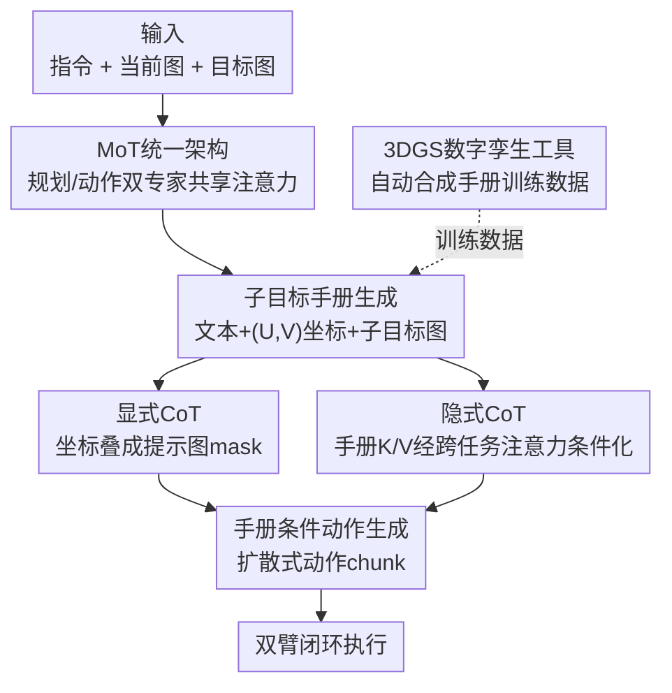

# From Manuals to Actions: A Unified VLA Model for Chain-of-Thought Manual Generation and Robotic Manipulation

**会议**: CVPR 2026  
**论文**: [CVF Open Access](https://openaccess.thecvf.com/content/CVPR2026/html/Gu_From_Manuals_to_Actions_A_Unified_VLA_Model_for_Chain-of-Thought_CVPR_2026_paper.html)  
**代码**: [项目页](https://sites.google.com/view/maunalvla)（暂未见开源代码）  
**领域**: 机器人 / 具身智能  
**关键词**: VLA、Manual CoT、Mixture-of-Transformers、长程操作、3DGS数字孪生

## 一句话总结
ManualVLA 用一个 Mixture-of-Transformers 统一框架，让 VLA 模型先从"目标态"想象出图文并茂的中间手册（子目标图+像素坐标+文本指令），再通过显式/隐式两条 Manual Chain-of-Thought 把手册落成精确动作，在乐高拼装、物体重排等长程任务上平均成功率比此前分层 SOTA 高 32%。

## 研究背景与动机
**领域现状**：VLA（Vision-Language-Action）模型把互联网规模预训练的视觉语言模型接到机器人控制上，端到端地从观测直接映射到动作，在开放场景的抓取、操作上展现了很强的泛化能力。

**现有痛点**：但遇到"给定明确目标态"的长程任务——比如照着最终拼好的样子去拼乐高、按指定布局把桌面物体放进盒子——这类只告诉机器人"结果长什么样（what）"、不告诉它"中间怎么一步步做（how）"的任务，现有 VLA 就抓瞎了。它们要么直接把感官输入映射到动作、缺少对中间过程的规划，要么靠人工手册/示范视频补全过程，泛化差且高度依赖人力。

**核心矛盾**：长程目标任务同时要求两件互相牵扯的事——(1) 高层规划：从最终态反推出一串合理的中间子目标；(2) 精确控制：每一步都要严格对齐目标配置。现有方法要么只会其一，要么把规划和控制拆成两个互不通气的模型，子目标和细粒度动作之间的关系断了。

**本文目标**：让一个 VLA 模型具备"从 what 推 how"的人类式能力——把预定义的最终目标，自己拆解成一串连贯且精确的执行步骤。

**切入角度**：人类拼乐高时并不需要别人逐帧示范，而是脑补出几个关键中间状态、再据此操作。作者据此让模型自己"想象"出中间手册，并把这份手册同时当作显式控制条件和隐式引导信号喂给动作生成。

**核心 idea**：用一个 MoT 统一模型把"手册生成"和"动作执行"两个专家拼在一起，再用 Manual Chain-of-Thought 把生成的多模态手册翻译成精确动作——既不靠人工手册，也不靠示范视频。

## 方法详解

### 整体框架
ManualVLA 以 Janus-Pro 为底座，扩展成一个 Mixture-of-Transformers（MoT）统一模型，内部含两个共享同一套注意力、但各自拥有独立 FFN / 注意力投影 / LayerNorm 参数的专家：**规划专家**负责生成多模态手册，**动作专家**负责生成精确动作。

整条流程是：给定语言指令 $l$、当前图像 $\mathcal{I}^{\text{current}}_t$ 和最终目标图像 $\mathcal{I}^{\text{goal}}$，规划专家先生成一份子目标手册——包含目标物体的文本描述 $\hat{l}_t$、目标物体质心的像素坐标 $p_t=(U,V)$、以及下一步的子目标图像 $\mathcal{I}^{\text{subgoal}}_t$：

$$\pi_\theta(\mathcal{I}^{\text{subgoal}}_t, p_t, \hat{l}_t \mid \mathcal{I}^{\text{goal}}, \mathcal{I}^{\text{current}}_t, l).$$

然后系统把预测坐标当 mask 叠到当前图像上，得到提示图 $\mathcal{I}^{\text{prompt}}_t$；动作专家再以机器人状态 $s_t$、提示图，以及生成手册时缓存下来的 K/V 特征 $\mathcal{F}^{\text{subgoal}}_t, \mathcal{F}^p_t, \mathcal{F}^{\hat{l}}_t$ 作为条件，扩散式地生成动作 chunk $a_{t:t+h}$：

$$\pi_\theta(a_{t:t+h} \mid s_t, \mathcal{I}^{\text{prompt}}_t, \mathcal{F}^{\text{subgoal}}_t, \mathcal{F}^p_t, \mathcal{F}^{\hat{l}}_t).$$

整个 pipeline 在一条 token 序列里端到端训练；为缓解长程任务数据稀缺，作者还额外做了一个基于 3DGS 的数字孪生工具自动造手册数据。

### 关键设计

**1. MoT 统一双专家架构：让规划和控制在一个模型里通气**

直接把感官输入映射到动作的 VLA 应付不了"只给目标态"的任务，而把规划、控制拆成两个独立模型又会让子目标和动作脱节。ManualVLA 的做法是在 DeepSeek-LLM 1.5B 之上构造 MoT：标准 Transformer 的所有非 embedding 组件（FFN、注意力投影 $W_Q/W_K/W_V/W_O$、LayerNorm）都按任务类别 $t_i\in\{\text{manual},\text{action}\}$ 复制成两套参数，token 按自己所属任务选用对应参数。单层 MoT 可写为

$$\mathrm{MoT}_\Theta(x) = x + \mathcal{N}^{t(\cdot)}_{\text{ffn}}\!\Big(\Phi^{t(\cdot)}_{\text{ffn}}\big(x + \mathcal{N}^{t(\cdot)}_{\text{attn}}(\Phi_{\text{attn}}(x))\big)\Big),$$

其中 $t(\cdot)$ 表示每个位置的 token 用自己任务的参数。关键在于：投影矩阵按 token 任务逐个选取，但注意力权重 $A=\mathrm{softmax}(QK^\top/\sqrt{d_k})$ 是在所有 token 上全局计算的——这就让手册 token 和动作 token 既能各自专精、又能跨任务交互。视觉端也按两种需求分流：手册生成走 VQGAN 式离散 tokenizer（codebook $Z\in\mathbb{R}^{16384\times 8}$），动作生成走 SigLIP-Large 连续编码器。消融显示，若退化成只复制 FFN 的标准 MoE，就无法同时产出高质量手册和动作。

**2. 子目标手册生成：把"目标态"翻译成图文并茂的中间步骤**

长程任务的难点是中间步骤未知。规划专家据此生成一份三模态手册：文本描述（说清这一步操作哪个物体、做什么动作）、像素级 $(U,V)$ 坐标（每个目标物体质心位置，给精确定位）、子目标图像（让模型对物理世界动态有具象建模）。作者假设长程任务不需要密集的时序子目标，只在任务状态发生关键变化的帧给引导就够——比如把一对积木放上板子时。所以 ManualVLA 只在上一个子目标完成后才生成新手册：先出文本描述，若被操作物体描述和上一次不同（如从"yellow blocks"变成"purple blocks"）就生成全新手册，否则复用旧手册继续生成动作。这避免了冗余的中间引导，规划开销更省。

**3. Manual Chain-of-Thought：显式 + 隐式双路把手册落成动作**

光生成手册没用，关键是怎么把它变成精确动作，这正是子目标与细粒度控制断裂的痛点所在。ManualCoT 用两条互补的路一起做：**显式 CoT** 把预测的 $(U,V)$ 坐标在当前图上叠成 mask，高亮 affordance 区域当作提示图喂给动作专家——这是像素层面、看得见的条件；**隐式 CoT** 则在潜空间起作用，借助跨任务共享注意力和专门设计的注意力 mask，让手册的潜表征作为动作建模的条件信号，按"先 what（操作什么物体）→ 再 where（放到哪）→ 最后 anticipated outcome（操作后的预期画面）"的顺序为动作提供隐式引导。注意力 mask 让动作专家能 attend 到手册表征、同时屏蔽更早的输入，使两个专家之间高效交换信息。消融表明显式和隐式两条缺一不可，去掉任一条成功率都明显下滑。即便生成的手册有轻微误差，靠 ManualCoT 和 MoT 的容量，动作输出仍然稳健。

**4. 3DGS 数字孪生工具：自动造长程手册训练数据**

目标态不确定性大，训规划专家需要海量带中间态的数据，纯靠人工采集成本太高。作者基于 3D Gaussian Splatting 做了个高保真数字孪生工具：先多视角拍摄重建出乐高板和每块积木的 3D 资产，对齐到统一笛卡尔坐标系；再按迭代放置流程，从初始态出发、每次在板上随机采样一个合法位置放一块积木，在每个中间态用前视相机渲染当前配置，从而批量产出逼真的中间步骤图像 + 位置 + 文本信息。每个任务能合成 10K+ 帧手册数据，让模型在下游只需约 100 条真机示范就能学到可泛化的操作。

### 损失函数 / 训练策略
三阶段训练，初始化时用 Janus-Pro 预训练参数、并把 LLM 复制两份分别初始化规划/动作专家：
- **Stage 1 动作专家预训练**：从 400K+ 跨本体轨迹筛出的装配数据上训 5 个 epoch，条件只有指令+当前图+机器人状态，扩散目标为预测噪声与真实噪声的 MSE：$\mathcal{L}_{\text{action}}=\mathbb{E}_{\epsilon\sim\mathcal{N}(0,1),i}\|\hat\epsilon_i-\epsilon\|_2^2$。
- **Stage 2 手册专家预训练**：只训手册专家，数据来自数字孪生工具（每任务 10K+ 帧），对子目标手册（物体描述+目标位置+子目标图 token）用交叉熵 $\mathcal{L}_{\text{manual}}$ 监督。
- **Stage 3 联合微调**：每个下游任务用 SpaceMouse 遥操采 100 条示范（含动作数据和自动抽取的手册数据），按统一 token 序列联合训练全部组件，总目标 $\mathcal{L}_{\text{final}}=\mathcal{L}_{\text{manual}}+\mathcal{L}_{\text{action}}$。

## 实验关键数据

平台为双臂 Franka，三个长程目标任务：2D 乐高拼装、3D 乐高拼装、物体重排。

### 主实验
手册生成质量（300 个未见测试样本，子目标图用 PSNR/FID 评、坐标用 MAE 评）：

| 任务 | 子目标图 PSNR↑ | 子目标图 FID↓ | (U,V) MAE↓ |
|------|------|------|------|
| 2D LEGO | 29.01 | 36.39 | 3.23 |
| 3D LEGO | 28.68 | 34.63 | 3.58 |
| 物体重排 | 28.11 | 24.46 | 6.21 |

操作成功率对比（20 个未见目标态，S.R. 为整任务端到端成功率）：

| 方法 | 2D LEGO S.R. | 3D LEGO S.R. | 物体重排 S.R. |
|------|------|------|------|
| π0 | 0.15 | 0.10 | 0.10 |
| π0.5 | 0.20 | 0.15 | 0.15 |
| FAST | 0.10 | 0.05 | 0.05 |
| CoT-VLA | 0.30 | 0.25 | 0.30 |
| VLM + π0.5（分层 SOTA） | 0.60 | 0.35 | 0.50 |
| **ManualVLA** | **0.85** | **0.65** | **0.65** |

相比最强分层 baseline（VLM+π0.5），最终任务完成率提升 15%–30%，三任务平均高约 32%。直接映射动作的 π0/π0.5/FAST 在长程任务上几乎全军覆没（多在早期成功、后续崩掉）。

### 消融实验
均在 2D LEGO 任务、报告长程任务成功率（数值来自论文图 6，⚠️ 以原文为准）：

| 配置 | 结论 |
|------|------|
| 手册只含 (U,V) → +子目标图 → 完整三模态 | 手册模态越全成功率越高，文本/图/坐标各自贡献不可替代 |
| w/o 显式 CoT | 只给潜特征+当前图，成功率明显下降 |
| w/o 隐式 CoT | 只给提示图，成功率明显下降 |
| MoT → 退化为 MoE（只复制 FFN） | 无法同时产出高质量手册和动作 |
| 动作生成范式 | 扩散式优于其他范式 |

### 关键发现
- **手册信息越全越好**：在固定用显式 CoT 提示图的前提下，逐步加入子目标图、文本描述，操作成功率单调上升——说明三种模态都是有用的隐式条件，而非冗余。
- **显式与隐式 CoT 互补且缺一不可**：两者分别提供像素级可见条件和潜空间语义引导，去掉任一条都掉点。
- **MoT 优于 MoE**：长程任务需要同时高质量地做规划和控制，只复制 FFN 的 MoE 撑不住，必须把注意力投影、LayerNorm 也任务化。
- **泛化稳健**：在背景/物体形状/光照扰动下（表 3），ManualVLA 在 2D LEGO 上从 0.85 仅降到 0.65/0.60/0.70（-23%/-29%/-17%），降幅普遍小于 VLM+π0.5，得益于手册专家和数字孪生数据带来的丰富引导。

## 亮点与洞察
- **"从 what 推 how"的范式很对味**：把人类拼乐高时"脑补关键中间态再操作"的直觉做成可学习的手册生成，直击长程目标任务"中间步骤未知"的本质痛点，比堆人工手册/示范视频更优雅。
- **显式+隐式双路 CoT 是巧设计**：同一份手册既当看得见的像素提示（显式）、又当潜空间条件信号（隐式），两条路冗余互补，对手册的小误差有容错性——这种"一份中间产物两种用法"的思路可迁移到其他需要规划-执行衔接的任务。
- **MoT vs MoE 的对照很有启发**：作者用消融说明，长程任务里光复制 FFN 不够，必须把注意力投影也任务化，否则规划和控制会互相拖累——这给"统一模型该共享到什么粒度"提供了实证。
- **3DGS 数字孪生造数据**：用 3D 高斯重建+迭代放置自动渲染中间态，把"采集带中间标注的长程数据"这件苦差事自动化，下游只要 ~100 条真机示范，工程性很强。

## 局限与展望
- **手册仍可能出错**：作者承认生成手册有轻微误差，虽靠 ManualCoT 容错，但在更长、误差累积更严重的任务上是否仍稳健存疑。
- **关键帧假设**：方法假设"只在状态关键变化处给引导就够"，对需要密集连续调整的精细操作（如柔性体、装配公差极小）是否成立未充分验证。
- **任务域偏窄**：实验集中在乐高拼装、物体重排等规整、可被 3DGS 良好重建的刚体场景，遮挡严重、透明/反光物体或非结构化场景下数字孪生数据质量可能下降。
- **改进方向**：可探索手册的不确定性估计/自纠错、把数字孪生扩展到柔性体与更复杂物理交互，以及在更小规模底座上验证 MoT 收益。

## 相关工作与启发
- **vs CoT-VLA**：CoT-VLA 也加最终目标图、预测关键子目标未来图，但只用显式的像素级子目标，缺少潜空间的隐式条件衔接，子目标与细粒度控制关系仍薄弱；ManualVLA 用显式+隐式双路 CoT，且手册是图文坐标三模态，成功率显著更高（2D LEGO 0.30→0.85）。
- **vs VLM+π0.5（分层 SOTA）**：分层 baseline 把 VLM 规划和 π0.5 控制拆成两段独立模型，是 ManualVLA 手册思路的"非统一"变体；ManualVLA 用 MoT 把两者并进一个共享注意力的模型，规划-控制信息流通更顺，且泛化扰动下掉点更少。
- **vs CheckManual / 示范视频类（Vid2Robot、DexCap）**：这些方法靠预先给定的人工手册或人类手部视频提供中间过程，引入额外人力和算力；ManualVLA 是首个用统一 VLA 模型自己生成多模态手册再落成动作的尝试，去掉了对外部手册/视频的依赖。

## 评分
- 新颖性: ⭐⭐⭐⭐⭐ 首个让 VLA 自生成多模态手册并经显式/隐式 CoT 落成动作的统一模型，范式新。
- 实验充分度: ⭐⭐⭐⭐ 三任务真机+多角度消融+泛化分析扎实，但任务域偏规整刚体、缺更长程/非结构化验证。
- 写作质量: ⭐⭐⭐⭐ 动机清晰、图文对照好，部分公式排版（OCR 后）需还原。
- 价值: ⭐⭐⭐⭐⭐ 直击长程目标任务痛点，手册+双路 CoT+数字孪生造数据的组合工程落地性强。

<!-- RELATED:START -->

## 相关论文

- [\[CVPR 2026\] ACoT-VLA: Action Chain-of-Thought for Vision-Language-Action Models](acot-vla_action_chain-of-thought_for_vision-language-action_models.md)
- [\[CVPR 2026\] Unifying Perception and Action: A Hybrid-Modality Pipeline with Implicit Visual Chain-of-Thought for Robotic Action Generation (VITA)](unifying_perception_and_action_a_hybrid-modality_pipeline_with_implicit_visual_c.md)
- [\[CVPR 2026\] FantasyVLN: Unified Multimodal Chain-of-Thought Reasoning for Vision-and-Language Navigation](fantasyvln_unified_multimodal_chain-of-thought_reasoning_for_vision-and-language.md)
- [\[CVPR 2026\] TRM-VLA: Temporal-Aware Chain-of-Thought Reasoning and Memorization for Vision-Language-Action Models](trm-vla_temporal-aware_chain-of-thought_reasoning_and_memorization_for_vision-la.md)
- [\[CVPR 2026\] Motus: A Unified Latent Action World Model](motus_a_unified_latent_action_world_model.md)

<!-- RELATED:END -->
