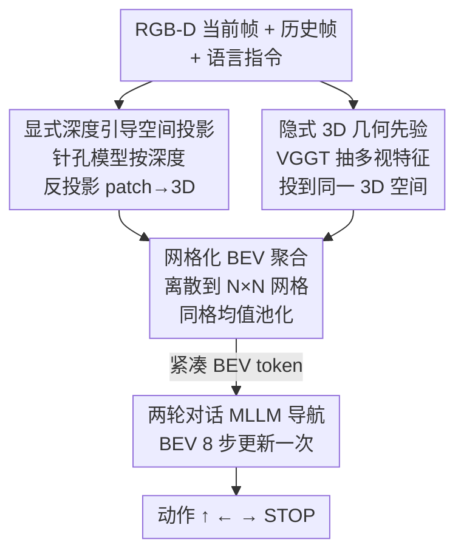

# GA-VLN: Geometry-Aware BEV Representation for Efficient Vision-Language Navigation

**会议**: CVPR 2026  
**论文**: [CVF Open Access](https://openaccess.thecvf.com/content/CVPR2026/html/Yang_GA-VLN_Geometry-Aware_BEV_Representation_for_Efficient_Vision-Language_Navigation_CVPR_2026_paper.html)  
**代码**: 无  
**领域**: 机器人 / 具身智能  
**关键词**: 视觉语言导航, BEV表征, 多模态大模型, 几何感知, token压缩

## 一句话总结
把 RGB-D 观测投影成一张以智能体为中心、融合显式深度几何与 3D 基础模型隐式先验的紧凑 BEV 表征，替换掉 MLLM 导航器里冗余的稠密 RGB patch token，在不用 DAgger 增广、不混训 VQA 的前提下，用更少的 token 跑出了连续环境 VLN 的 SOTA。

## 研究背景与动机

**领域现状**：连续环境视觉语言导航（VLN-CE）目前主流是把多模态大模型（MLLM）当导航策略骨干——把历史 RGB 帧逐帧编码成视觉 token，连同语言指令一起喂给 MLLM 预测离散动作（前进/左转/右转/STOP）。MLLM 强大的指令理解和推理能力让这条路线效果不错。

**现有痛点**：这种 image-centric 范式有两个硬伤。一是 token 爆炸——每帧产出 $H_p \times W_p$ 个 patch token，$t$ 帧累计 $t \times H_p \times W_p$ 个，历史一长计算量就失控（论文实测一步推理需要约 4003 个 token）。二是缺空间结构——patch embedding 是"拍平"的，模型并不知道不同帧之间的几何关系，视角一变空间一致性就崩，长程探索和空间记忆都受限。

**核心矛盾**：MLLM 继承了图像级训练带来的 2D patch 处理惯性，但导航本质是一个 3D 空间推理任务。用稠密 2D token 既贵又表达不了几何，这是表征形式和任务需求之间的根本错配。

**本文目标**：设计一种**既紧凑又有空间表达力**的视觉表征，把它塞进 MLLM 导航器，同时降 token、增几何。

**切入角度**：导航轨迹虽然发生在 3D 室内，但运动基本约束在 2D 地面上——那就把观测压成一张鸟瞰图（BEV）。BEV 天然以智能体为中心、把多帧对齐到同一坐标系，既消冗余又显式编码空间布局。

**核心 idea**：用 RGB-D 把 patch 特征反投影到 3D、再聚合到 BEV 网格（显式几何），并额外融入预训练 3D 基础模型的特征（隐式几何先验），两路互补构成 Geometry-Aware BEV（GA-BEV），用它替代稠密 RGB token 驱动 MLLM 导航。

## 方法详解

### 整体框架

GA-VLN 的输入是当前帧 + 历史帧的 RGB-D 前视图（单目 60° 视场）和语言指令，输出是离散动作序列。核心是把"一堆历史 RGB 帧"换成"一张 GA-BEV"再喂给 MLLM。整条流水线分四步：先用相机针孔模型把每个 patch 中心按深度反投影到 3D（显式几何）；同时用一个冻结的 3D 基础模型（VGGT）抽历史序列的多视几何特征、对齐维度后投到同一个 3D 空间（隐式几何先验）；再把这两路 3D 特征一起离散到以智能体为中心的 $N \times N$ BEV 网格里做均值池化聚合，只保留非空格子，得到极其紧凑的 BEV token；最后把 BEV token + 当前前视图特征 + 指令送进 MLLM，用一个两轮对话机制预测动作。

### 关键设计

**1. 显式深度引导空间投影：把 2D patch 钉进 3D 世界坐标**

针对"patch embedding 拍平、没有几何"的痛点，这一步在输入阶段就把空间结构注入进来。每步导航拿到 patch 级 RGB 特征 $V_t \in \mathbb{R}^{H_p \times W_p \times d_p}$，把对应深度图双三次插值到同分辨率 $D_t$，再用针孔相机模型把每个 patch 中心 $(u,v)$ 反投影到世界坐标：

$$\hat{p}_t(u,v) = \begin{bmatrix} R_t & p_t \end{bmatrix} K^{-1} \begin{bmatrix} u \\ v \\ 1 \end{bmatrix} D_t(u,v)$$

其中 $K$ 是相机内参，$R_t$、$p_t$ 是当前相机旋转和位置，$D_t(u,v)$ 是该像素深度。这样每个 2D patch 都拿到了它在物理世界里的 3D 落点，特征从一开始就"接地"，多帧观测因此能对齐到统一坐标系——这正是后续 BEV 聚合能消冗余、保一致的前提。

**2. 隐式 3D 几何先验：用冻结的 3D 基础模型补上单帧深度看不到的结构**

显式投影只用单帧局部深度线索，深度稀疏或有噪时会失效。这一设计引入预训练 3D 基础模型 $f_{3DFM}$（用 VGGT-1B），它在大规模 3D 重建任务上学到的多视几何意识和形状先验，能补上跨帧的全局几何规律。具体是把历史图像序列编码成带隐式几何先验的特征 $V^g = f_{3DFM}(\{I_1,\dots,I_t\})$，再经一个投影层 $\tilde{V}^g = f_{project}(V^g)$ 对齐到视觉编码器的维度（$f_{project}$ 是 Linear–GeLU–Linear 的 2 层 MLP，隐层 4096 维匹配 SigLIP），最后用**和设计 1 完全相同**的深度引导投影流程把 $\tilde{V}^g$ 也送进 3D 空间。$f_{3DFM}$ 训练时全程冻结，只微调其余模块——隐式先验在深度退化时托底，和显式投影构成互补。

**3. 网格化 BEV 聚合：把稀疏 3D 特征压成紧凑的鸟瞰 token**

3D 空间里的特征天然稀疏，直接用既低效又不贴合"运动约束在 2D 地面"的事实。这一步把两路特征统一成集合 $V = V \cup \tilde{V}^g$、对应 3D 位置 $\hat{P}$，全部投到 $(x,z)$ 平面，离散成以智能体为中心、格距 $\Delta$、感知范围 $[-R,R]$ 的 $N \times N$ 网格。格子 $(i,j)$ 收集落在其范围内的特征 $S_{i,j}$（不同 $y$ 高度落到同一 $(x,z)$ 的都并进来），再对同格特征均值池化：

$$B = \Big\{ \frac{1}{|S_{i,j}|} \sum_{v \in S_{i,j}} v + e_{i,j} \;\Big|\; |S_{i,j}| > 0,\; i,j \in [1,N] \Big\}$$

$e_{i,j}$ 是格坐标的 2D 正弦位置编码，且**只保留非空格子**——所以最终 BEV token 数远小于 $N \times N$，甚至比原始 patch 集 $t \times H_p \times W_p$ 还少。每步还会把所有历史 3D 点变换到当前智能体坐标系，保证过去观测和当前位姿几何对齐，契合导航的 egocentric 本质。这是 token 从 4003 砍到几百的关键。

**4. 两轮对话导航框架：让 BEV 每 8 步才更新一次**

把导航建模成两轮对话生成，每轮 MLLM 一次吐 4 个动作（共 8 个）。第一轮喂指令 + 当前前视图 + 由至多 8 帧历史聚合的 BEV 特征；第二轮**只更新当前前视图、复用第一轮的 BEV 特征**，从而把昂贵的 BEV 构建摊薄到每 8 个动作才做一次，直到预测出 STOP 终止。这把表征的紧凑性进一步转化成推理时延的下降。

### 损失函数 / 训练策略
基座 MLLM 用 LLaVA-Video-7B，视觉编码器 SigLIP，3D 基础模型 VGGT-1B（取倒数第二层特征、冻结参数）。BEV 格距 $\Delta = 0.25$m、范围 $[-10, 10]$m。视觉编码器学习率 5e-6、其余模块 2e-5，余弦退火，预训练 2 个 epoch。训练只用导航数据（R2R-CE / RxR-CE / EnvDrop / ScaleVLN / SRDF 共数十万条轨迹），**不用 DAgger 增广、不混训 VQA**。

## 实验关键数据

### 主实验
在连续环境 VLN-CE 的三个标准 benchmark（R2R-CE / RxR-CE / NavRAG-CE）val unseen 上，GA-VLN 在大多数指标上取得 SOTA。下表为 R2R-CE 与 RxR-CE 主结果（SR=成功率，SPL=路径长度加权成功率，越高越好；NE=导航误差，越低越好）：

| 方法 | 系统 | DAgger | R2R SR↑ | R2R SPL↑ | RxR SR↑ | RxR SPL↑ |
|------|------|--------|---------|----------|---------|----------|
| Uni-NaVid | Image-MLLM | ✓ | 47.0 | 42.7 | 48.7 | 40.9 |
| NaVILA | Image-MLLM | × | 54.0 | 49.0 | 49.3 | 44.0 |
| StreamVLN | Image-MLLM | ✓ | 56.9 | 51.9 | 52.9 | 46.0 |
| InternVLA-N1 | Image-MLLM | ✓ | 58.2 | 54.0 | 53.5 | 46.1 |
| **GA-VLN (本文)** | GA-VLN | **×** | **61.0** | **55.2** | **55.4** | 45.2 |

关键看点：GA-VLN 在 **不用 DAgger** 的情况下，R2R-CE SR 达 61.0%、SPL 55.2%，全面超过依赖 DAgger 的 StreamVLN、InternVLA-N1，体现 GA-BEV 表征自带的强空间归纳偏置带来了数据效率。

### 消融实验
表 2 拆解 GA-BEV 两个组件（BEV Rep.=显式深度投影；3D-Geo.=隐式 3D 先验），并报告每步推理的 TFLOPs 和时延（R2R-CE val unseen）：

| 配置 | BEV Rep. | 3D-Geo. | SR↑ | SPL↑ | 总 TFLOPs | 时延(ms) |
|------|----------|---------|------|------|-----------|----------|
| #1 Baseline | × | × | 51.49 | 46.18 | 32.19 | 342.9 |
| #2 GA-VLN (w/o VGGT) | ✓ | × | 59.21 | 53.87 | 5.15 | 212.9 |
| #3 GA-VLN (Full) | ✓ | ✓ | 60.96 | 55.19 | 8.73 | 258.7 |

只加显式 BEV 投影（#1→#2）SR 就从 51.49% 跳到 59.21%，同时 TFLOPs 从 32.19 暴降到 5.15、时延几乎砍半——紧凑表征带来的是性能和效率双赢。再叠加隐式先验（#2→#3）SR 进一步到 60.96%，VGGT 引入的额外 1.97 TFLOPs 开销可控，总量仍远低于 baseline。

表 3 进一步分析 token 与空间分辨率的权衡（去掉 SRDF 数据集训练）：

| 配置 | BEV 格距 | 3D-Geo. | Token 数 | SR↑ |
|------|----------|---------|----------|------|
| #1 Baseline | — | × | 4003 | 46.49 |
| #2 w/o VGGT | 0.25m | × | 394 | 51.50 |
| #3 Full | 0.25m | ✓ | 514 | 53.56 |
| #4 过细 | 0.125m | ✓ | 1193 | 51.27 |
| #5 过粗 | 0.5m | ✓ | 184 | 50.52 |

token 数从 baseline 的 4003 压到 394~514，SR 反而涨了 5~7 个点。格距上 0.25m 是甜点：过细（0.125m）压不掉冗余、过粗（0.5m）丢空间细节，都掉点。

### 关键发现
- **紧凑表征不是以性能换效率，而是双赢**：把 4003 个稠密 token 压成约 500 个 BEV token，SR 从 46% 升到 60% 区间，说明稠密 patch 里大量是噪声/冗余，BEV 的几何结构反而是更强的归纳偏置。
- **显式投影是主力，隐式先验是托底**：消融里显式 BEV 贡献最大的跃升，VGGT 隐式先验是锦上添花（+1~2 SR），主要价值在深度稀疏/含噪时的鲁棒性。
- **历史窗口 32 步够用**：历史帧从 32 加到 48 略有提升，再长就饱和甚至下降，远端观测空间相关性弱、还会在 BEV 里累积噪声。
- **对传感器噪声鲁棒**：深度/位姿加 $\sigma=0.05$m、旋转加 $\sigma=5°$ 噪声，SR 仅小幅下降（60.96→58~59），并在 Stretch 3 实体机器人上零样本部署成功。

## 亮点与洞察
- **用 BEV 给 MLLM"换燃料"**：最巧妙的是没动 MLLM 骨干，只是把喂进去的视觉 token 从稠密 patch 换成几何接地的 BEV token，就同时拿下了效率和性能——表征工程比堆数据/堆模型更划算。
- **显式 + 隐式几何的互补**：显式深度投影提供精确但局部的几何，3D 基础模型提供模糊但全局的先验，两者投到同一 BEV 空间融合，是"硬几何 + 软先验"的范式，可迁移到任何需要空间表征的具身任务。
- **数据效率是真招牌**：不靠 DAgger 这种昂贵的轨迹增广、不靠 VQA 混训就 SOTA，说明好的空间归纳偏置能替代一部分数据规模——对算力有限的团队很有借鉴价值。
- **两轮对话摊薄 BEV 构建成本**：BEV 8 步才更新一次的工程设计，把表征紧凑性进一步榨成时延优势，是个简单但有效的 trick。

## 局限与展望
- **依赖 RGB-D 深度**：显式投影需要深度输入，纯 RGB 场景下设计 1 退化，得更依赖 VGGT 隐式先验，鲁棒性边界未充分探索。⚠️ 论文用噪声实验间接验证了一部分，但未给无深度时的结果。
- **NavRAG-CE 上 SR 偏低**：在 NavRAG-CE 上 SR 仅 22.2%（虽仍领先部分基线），跨数据集分布差异大，作者只用额外 1 epoch 微调，泛化仍有空间。
- **冻结 3D 基础模型**：VGGT 全程冻结，没探索端到端微调或更轻量 3D 模型替代，VGGT-1B 仍带来约 2 TFLOPs 额外开销。
- **2D 地面假设**：BEV 把运动压到地面平面，对楼梯、多层、强 3D 操作类任务可能不适用。

## 相关工作与启发
- **vs 图像式 MLLM 导航（StreamVLN / NaVILA / Uni-NaVid）**：它们直接把稠密 RGB 帧当 token 喂 MLLM，token 多且无显式几何；本文用 GA-BEV 替换之，token 砍一个数量级、显式编码几何，且不需 DAgger。
- **vs 传统 BEV-based VLN（DUET / 早期 BEV 工作）**：早期 BEV 主要当作建模候选航点空间关系的**辅助结构**，不是完整 3D 场景表征；本文是首个把 BEV 成功迁移成 MLLM 导航器主输入、并融入 3D 基础模型先验的工作。
- **vs 3D 端到端方法（Dynam3D / g3D-LF / VLN-3DFF）**：它们多借 NeRF / 3DGS 做高保真场景建模或新视角合成，重且依赖 DAgger；本文走"紧凑 BEV + MLLM"路线，在效率和数据效率上更优。

## 评分
- 新颖性: ⭐⭐⭐⭐ 首个把几何感知 BEV 作为 MLLM 导航器主输入并融合 3D 基础模型先验，范式清晰但各组件（BEV/深度投影/3DFM）均有前人基础
- 实验充分度: ⭐⭐⭐⭐⭐ 三 benchmark + 组件消融 + token/分辨率/历史窗口分析 + 噪声鲁棒 + 实体机器人零样本，覆盖全面
- 写作质量: ⭐⭐⭐⭐ 动机和方法叙述清晰，公式完整，图示到位
- 价值: ⭐⭐⭐⭐⭐ 不用 DAgger/VQA 就 SOTA，token 砍一个数量级，对具身导航的工程落地价值高

<!-- RELATED:START -->

## 相关论文

- [\[ACL 2026\] VLN-NF: Feasibility-Aware Vision-and-Language Navigation with False-Premise Instructions](../../ACL2026/robotics/vln-nf_feasibility-aware_vision-and-language_navigation_with_false-premise_instr.md)
- [\[CVPR 2026\] GeoDexGrasp: Geometry-aware Generation for Data-efficient and Physics-plausible Dexterous Grasping](geodexgrasp_geometry-aware_generation_for_data-efficient_and_physics-plausible_d.md)
- [\[CVPR 2026\] AwareVLN: Reasoning with Self-awareness for Vision-Language Navigation](awarevln_reasoning_with_self-awareness_for_vision-language_navigation.md)
- [\[CVPR 2026\] FantasyVLN: Unified Multimodal Chain-of-Thought Reasoning for Vision-and-Language Navigation](fantasyvln_unified_multimodal_chain-of-thought_reasoning_for_vision-and-language.md)
- [\[CVPR 2026\] Cross from Left to Right Brain: Adaptive Text Dreamer for Vision-and-Language Navigation](cross_from_left_to_right_brain_adaptive_text_dreamer_for_vision-and-language_nav.md)

<!-- RELATED:END -->
