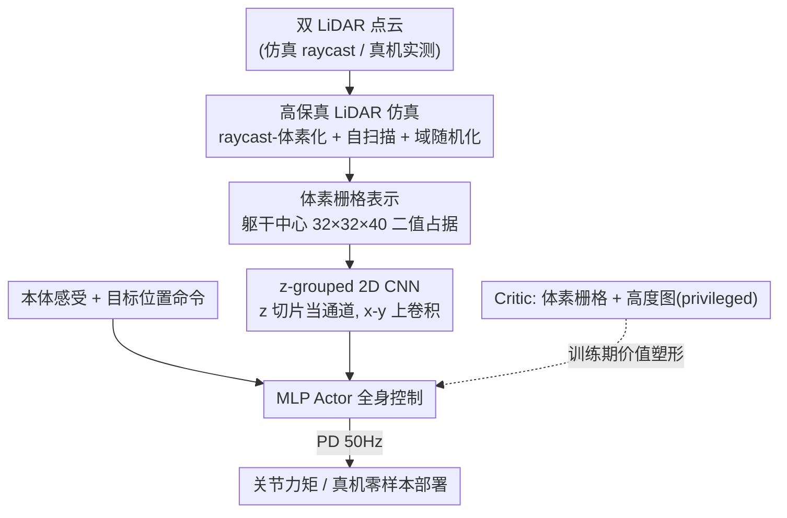

# Gallant: Voxel Grid-based Humanoid Locomotion and Local-navigation across 3D Constrained Terrains

**会议**: CVPR 2026  
**论文**: [CVF Open Access](https://openaccess.thecvf.com/content/CVPR2026/html/Ben_Gallant_Voxel_Grid-based_Humanoid_Locomotion_and_Local-navigation_across_3-D_Constrained_CVPR_2026_paper.html)  
**代码**: 项目主页 Gallant（论文标注「Website: Gallant」，未给明确仓库链接，⚠️ 以原文为准）  
**领域**: 机器人 / 具身智能  
**关键词**: 人形机器人, 感知运动, 体素栅格, LiDAR 仿真, 局部导航

## 一句话总结
Gallant 把车载 LiDAR 点云体素化成机器人中心的占据栅格，用一个「把 z 轴当通道」的轻量 2D CNN 端到端映射到全身控制策略，再配上能模拟机器人自身肢体的高保真 LiDAR 仿真，让单个策略零样本迁移到真机，在爬楼、上高台等任务上首次做到 >90% 成功率，并覆盖地面、侧向、头顶三类障碍。

## 研究背景与动机
**领域现状**：人形机器人在非结构化 3D 环境里稳定行走，依赖对周围几何的准确、全局一致的感知。当前主流感知模块要么用深度图，要么把 LiDAR 点云压成 elevation map（2.5D 高度场），再喂给强化学习策略。

**现有痛点**：这两条路都只能给出「局部、被压平」的环境视图。深度相机视场窄（约 0.43π 立体角）、量程有限，难以推理空间上延展的复杂场景；elevation map 把每个地面格点压成一个高度值，**彻底丢掉了垂直方向和多层结构**——天花板、低矮横梁、楼梯底面、夹层这些「头顶约束」在高度场里根本不存在。而且高度场需要一个重建阶段，会引入算法特有的失真和延迟，把感知和控制进一步解耦。原始 LiDAR 点云虽然视场广、几何细，但稀疏、含噪，直接拿来学策略既不样本高效，实时推理也吃不消。

**核心矛盾**：感知表示要同时满足三点——保留完整 3D 多层结构、足够轻量能实时端到端训练、仿真到真机（sim-to-real）一致——而现有表示总在「信息完整性」和「计算可学性」之间二选一。

**本文目标**：用一个单一端到端策略，覆盖地面障碍、侧向杂乱（lateral clutter）、头顶约束（overhead）、多层结构、窄通道，且能从仿真零样本迁到真机。

**切入角度**：作者注意到机器人中心的 LiDAR 占据栅格天然具有强稀疏性——大多数 (x, y) 列只有一两个被占据的 z 切片，大片空间完全为空。既然结构如此规整，就没必要上昂贵的 3D 卷积。

**核心 idea**：用**体素栅格**当几何保真的轻量表示，用**把 z 当通道的 2D CNN**高效处理它，并用**能扫到动态物体（含机器人自身肢体）的高保真 LiDAR 仿真**保证 sim-to-real 一致，三者串成从传感器仿真到控制的全栈管线。

## 方法详解

### 整体框架
Gallant 是一个体素栅格驱动的感知-学习框架，把人形感知运动建模成部分可观测马尔可夫决策过程（POMDP），用 PPO 训练 actor-critic 策略。系统由三块拼成：(i) 一条并行化的高保真 LiDAR 仿真管线，在训练时动态生成带噪声/延迟的真实观测；(ii) 一个针对稀疏体素栅格定制的轻量 2D CNN 感知模块；(iii) 八类代表性地形构成的课程式训练集。

数据流是：双 LiDAR 点云（仿真里由 raycast 生成、真机由实测得到）→ 统一到躯干坐标系并体素化成 $32\times32\times40$ 的二值占据栅格 → z-grouped 2D CNN 编码成紧凑特征 → 与本体感受信号（关节、角速度、重力方向、动作历史等）拼接 → MLP actor 输出全身动作 → PD 控制器 50Hz 跟踪。整个链路端到端可优化，目标位置（而非速度指令）作为命令输入，从而把局部导航和运动控制**融进同一个策略**。

### 关键设计

**1. 体素栅格感知表示：用机器人中心占据栅格保住被高度图丢掉的垂直结构**

针对 elevation map 把场景压平、丢掉头顶和多层结构的痛点，Gallant 把两个躯干 LiDAR 的回波统一到躯干坐标系，在一个立方体感知体积 $\Omega=[-0.8,0.8]\,\text{m}\times[-0.8,0.8]\,\text{m}\times[-1.0,1.0]\,\text{m}$ 内、以 $\Delta=0.05\,\text{m}$ 分辨率离散，得到沿 x、y、z 的 $32\times32\times40$ 栅格。每个体素只要内部有至少一个 LiDAR 点就置 1，否则为 0，得到二值占据张量 $X\in\{0,1\}^{C\times H\times W}$，其中 $C=40$（高度切片数）、$H=W=32$。相比把点云投影成 2.5D 高度场，体素栅格在一个约 4.00π 立体角的大视场里完整保留多层结构（机器人能"看见"头顶天花板和脚下的台阶底面），同时把原始稀疏含噪的点云聚合进体素、降维并平滑掉噪声，得到一个适合高效学习的轻量张量。Tab.1 里 Gallant 是唯一同时支持地面/侧向/头顶三类障碍的方法。

**2. z-grouped 2D CNN：把高度切片当通道，用 2D 卷积吃下稀疏体素**

占据栅格高度稀疏且局部集中——多数 (x, y) 列只有一两个被占据的 z 切片，大片区域全空。如果硬上 3D 卷积，参数和显存都浪费在大量空体素上。作者的做法是**把 z 轴当成卷积的通道维**，只在 x-y 平面做 2D 卷积：让 $X\in\mathbb{R}^{C\times H\times W}$、$W\in\mathbb{R}^{O\times C\times k\times k}$，输出

$$Y_{o,v,u}=\sigma\!\left(\sum_{c=0}^{C-1}\sum_{\Delta v,\Delta u}W_{o,c,\Delta v,\Delta u}\cdot X_{c,v+\Delta v,u+\Delta u}+b_o\right).$$

通道混合负责捕捉垂直结构，2D 空间卷积负责利用 x-y 上下文。相比 $k^3$ 的 3D 核，这个设计把计算和显存大致省下 $k$ 倍。它之所以比稀疏卷积更优：体素在 x-y 平面其实相对稠密，稀疏卷积省不下多少算力，反倒被 rulebook 开销拖累；而 z 当通道既保住了垂直模式，又能用高度优化的稠密 2D 算子、支持高效并行训练和板载实时推理。它对这种「在 x-y 近似平移等变、却随机身旋转」的自我中心栅格提供了恰当的归纳偏置。

**3. 高保真 LiDAR 仿真（含自扫描 + 域随机化）：让仿真里的体素栅格和真机分布对齐**

主流 GPU 仿真器要么不支持高效 LiDAR、要么只能扫单个静态网格，可现实里机器人蹲下穿天花板时，自己的腿会占据体素并在射向远处地面的射线上挖出遮挡「空洞」。如果仿真只扫静态地形（w/o-Self-Scan），体素栅格里地面会被错误地补成一片平地，造成机器人在非直立姿态下感知分布严重 OOD。Gallant 用 NVIDIA Warp 实现轻量的 raycast-体素化管线：为每个网格在其局部坐标系预计算 BVH，仿真时只变换射线原点、把方向旋进网格局部系——$\text{raycast}(TM,\mathbf{p},\mathbf{d})=T^{-1}\text{raycast}(M,T^{-1}\mathbf{p},R^{-1}\mathbf{d})$——从而避免每步重建昂贵的全场景 BVH，并能同时扫到静态地形和**动态网格（包括机器人自身肢体）**。在此之上叠四类域随机化：LiDAR 位姿扰动、命中点扰动、10Hz 下 100–200ms 延迟、随机翻转 2% 体素模拟缺失。这套自扫描 + 域随机化是把仿真观测对齐到部署条件、缩小 sim-to-real gap 的关键。

**4. 基于目标位置的端到端单策略 + 非对称 actor-critic：把导航和运动合一**

以往局部导航多用分层设计（高层规划器出速度指令、低层策略跟踪），解耦让策略没法充分利用地形，跟踪误差和慢更新还会拖累性能；而把避障奖励硬加进速度跟踪又会造成目标冲突。Gallant 改用**目标位置**作为命令，让策略自己在地形上推理该怎么动，把局部导航和运动控制融进一个端到端策略。奖励把速度跟踪项换成抵达奖励 $r_{\text{reach}}=\frac{1}{1+\|\mathbf{P}_t\|^2}\cdot\frac{\mathds{1}(t>T-T_r)}{T_r}$（$T_r=2\text{s}$），只在临近 timeout 时给奖励，留出轨迹探索时间。一个关键巧思是**非对称观测**：actor 只吃体素栅格（避开高度图这种延迟敏感通道），但 critic 额外吃高度图当 privileged 信息——高度图在仿真里无延迟、对地面障碍信息量很大，用它来塑造价值、改善信用分配；部署时策略本身又不依赖它，兼顾训练效率和 sim-to-real 鲁棒性。

### 损失函数 / 训练策略
用 PPO 训练，每个 episode 在 $8\,\text{m}\times8\,\text{m}$ 区块中心出发、向周界采样目标 G，固定 10s 时限。八类地形（Plane / Ceiling / Forest / Door / Platform / Pile / Upstair / Downstair）按难度标量 $s\in[0,1]$ 课程式插值：$\mathbf{p}_\tau(s)=(1-s)\mathbf{p}_\tau^{\min}+s\mathbf{p}_\tau^{\max}$，成功升级、失败降级。摔倒、躯干/髋/膝受力超 100N 的剧烈碰撞、或超时都会终止 episode。每个策略训 4000 iteration，跑 5 次独立评测（每次 1000 个完整 episode）。

## 实验关键数据

硬件为 29-DoF Unitree G1，胸前+背后各挂一个 Hesai JT128 LiDAR（各 95°×360° 视场），仿真用 IsaacSim、8 张 RTX 4090 训练；真机部署用板载 Orin NX，头部 Livox Mid-360 + FastLIO2 做目标相对定位，OctoMap 做轻量预处理出占据栅格。

### 主实验（仿真八地形成功率，Tab.3）
成功率 $E_{\text{succ}}$（%，越高越好）；下表摘取与各消融维度对比的关键地形：

| 配置 | Ceiling | Forest | Platform | Pile | Upstair | 说明 |
|------|---------|--------|----------|------|---------|------|
| Gallant（完整） | **97.1** | **84.3** | **96.1** | 82.1 | **96.2** | z-2D CNN + 体素+高度图 critic + 5cm |
| w/o-Self-Scan | 28.4 | 78.1 | — | — | — | 仿真不扫动态物体 → 非直立姿态 OOD，Ceiling 暴跌 |
| Only-Height-Map | 5.3 | 10.5 | 96.0 | 86.2 | 98.3 | 高度图无法表多层 → 头顶/侧向几乎全挂 |
| Only-Voxel-Grid | 96.9 | 75.9 | 94.2 | 72.3 | 89.3 | critic 也只给体素，掉点验证非对称设计 |
| 3D-CNN | 97.5 | 73.9 | 92.7 | 65.3 | 86.0 | 个别地形略高，但多数更差且推理慢 |

### 消融实验（感知网络 / 分辨率，Tab.3）
| 配置 | Forest | Pile | Upstair | 关键发现 |
|------|--------|------|---------|---------|
| Gallant（5cm, z-2D CNN） | **84.3** | **82.1** | **96.2** | 精度与延迟最佳折中 |
| Sparse-2D-CNN | 80.2 | 57.6 | 89.1 | x-y 较稠密，稀疏卷积省不下算力还有 rulebook 开销 |
| 10cm 分辨率 | 77.5 | 65.2 | 94.1 | FoV 变大但量化太粗，损害接触/间隙细节 |
| 2.5cm 分辨率 | 59.0 | 54.1 | 86.3 | 精度高但 FoV 缩小，长垂直结构（Ceiling）难感知 |

### 真机实验（sim vs real，Fig.7）
| 地形 | 仿真成功率 % | 真机成功率 % |
|------|-------------|-------------|
| Ceiling | 97.1 | 100.0 |
| Door | 98.7 | 100.0 |
| Platform | 96.1 | 93.3 |
| Pile | 82.1 | 80.0 |
| Upstair | 96.2 | 100.0 |
| Downstair | 97.9 | 93.3 |

真机 15 次试验对比里（Fig.6），HeightMap baseline 在 Ceiling、Door 这类头顶/侧向障碍上几乎全挂（2.5D 表示所限），且因真机高度图重建含噪、躯干 pitch/roll 引入 LiDAR 抖动，连地面地形都不如 Gallant；NoDR（去掉 LiDAR 域随机化）在 Ceiling/Door 还行，但在地面地形上因误判与障碍的相对位置、反应过晚而大幅掉点。

### 关键发现
- **自扫描是命门**：仿真不扫机器人自身肢体，会让蹲姿下体素栅格 OOD，Ceiling 成功率从 97.1% 崩到 28.4%——动态物体扫描对最终性能至关重要。
- **体素+高度图非对称配置最优**：高度图只给 critic 当 privileged 信号塑造价值、不进 actor，既吃到高度图的训练增益又不让部署策略依赖延迟敏感通道。
- **分辨率有甜点**：5cm 在 FoV 覆盖和几何保真间最优；2.5cm 精度高但 FoV 太小（Ceiling 这类需感知远处垂直结构的地形最受伤），10cm 则量化太粗。
- **Pile 是主要瓶颈**：成功率约 80%，把仿真 LiDAR 延迟设为零能升到 >90%，说明真机传感延迟是关键卡点。
- **sim-real 强相关**：仿真高成功率的地形真机也高，验证大规模仿真评测可作为真机表现的可靠预测器。

## 亮点与洞察
- **「z 当通道」是全文最妙的一刀**：它把一个看似要上 3D CNN 的稀疏占据问题，降维成成熟高效的稠密 2D 卷积，既省 ~$k$ 倍算力、又因 x-y 近似平移等变而有恰当归纳偏置——这个 trick 可迁移到任何机器人中心、z 方向稀疏的占据栅格感知任务。
- **自扫描这个细节非常反直觉但极关键**：大家做 LiDAR 仿真时往往只扫环境，Gallant 指出必须把机器人自己的腿也扫进去，否则蹲姿下分布就 OOD。这是 sim-to-real 工程里很容易漏、代价又很大的坑。
- **非对称 actor-critic 用得很干净**：把「训练时有用但部署时有害」的高度图精确塞进 critic-only 的 privileged 通道，是 privileged learning 思想在感知表示层面的漂亮应用，可复用于任何「某模态训练有益、部署有延迟」的场景。
- **用目标位置而非速度指令统一导航与运动**，让策略能主动调整足端轨迹去爬台阶/跨缝，而不是被动跟踪——这是把分层架构合并成单策略的关键前提。

## 局限与展望
- **作者承认**：尚未达到 100% 成功率，主因是 LiDAR 延迟——10Hz 每帧 >100ms 的延迟（光反射 + 通信开销）限制了机器人的预先反应能力。未来计划把 Gallant 当几何感知的 teacher，并探索更低延迟传感器，迈向全反应式、近乎完美的策略。
- **Pile 地形天花板明显**：精确足端落点需求高，真机约 80%，对传感延迟特别敏感。
- **自己观察**：⚠️ 真机 success rate（Fig.6/Fig.7 的 15 次试验或百分比）样本量偏小，且对比 baseline 仅 HeightMap / NoDR 两个，未与其他点云/depth 的 SOTA 真机方法直接同台；代码仅标注 Website 未给明确仓库，复现门槛偏高。
- 感知体积固定为 $1.6\times1.6\times2.0\,\text{m}$ 的躯干中心立方体，超出此范围的远处目标导航需依赖外部定位（Livox + FastLIO2），并非纯端到端。

## 相关工作与启发
- **vs elevation map 类方法（Long et al. / Wang et al. / Ren et al.）**：他们把点云压成 2.5D 高度场只能推理地面（部分能侧向），本文用体素栅格保住多层结构、覆盖头顶约束，且省掉重建阶段的失真与延迟；代价是需要训练期 LiDAR 仿真。
- **vs 深度图方法（Zhuang et al.）**：深度相机更新快但视场窄（~0.43π），Gallant 用双 LiDAR 拿到 ~4.00π 立体角的全空间感知。
- **vs 点云直接输入（Wang et al.）**：点云保几何但处理成本高、板载实时不可行，体素化是「结构化 + 高效」的折中。
- **vs 分层局部导航**：把目标位置塞进单策略端到端训练，避免高低层解耦带来的跟踪误差与目标冲突，让策略能主动利用地形。

## 评分
- 新颖性: ⭐⭐⭐⭐ 体素栅格 + z-as-channel 2D CNN + 自扫描 LiDAR 仿真的组合在人形感知运动里是新的全栈方案，单个 trick 不算颠覆但工程闭环扎实
- 实验充分度: ⭐⭐⭐⭐ 仿真消融覆盖自扫描/网络/表示/分辨率四个维度且有真机验证，但真机试验次数少、baseline 偏弱
- 写作质量: ⭐⭐⭐⭐ 动机-方法-实验链条清晰，公式与图示到位，部分关键数表需对照原图细读
- 价值: ⭐⭐⭐⭐⭐ 首次在爬楼/上高台等任务做到 >90% 成功率并覆盖三类障碍，对人形机器人感知运动有很强落地参考价值

<!-- RELATED:START -->

## 相关论文

- [\[CVPR 2026\] Do You Have Freestyle? Expressive Humanoid Locomotion via Audio Control](do_you_have_freestyle_expressive_humanoid_locomotion_via_audio_control.md)
- [\[AAAI 2026\] Coordinated Humanoid Robot Locomotion with Symmetry Equivariant Reinforcement Learning Policy](../../AAAI2026/robotics/coordinated_humanoid_robot_locomotion_with_symmetry_equivariant_reinforcement_le.md)
- [\[NeurIPS 2025\] Adversarial Locomotion and Motion Imitation for Humanoid Policy Learning](../../NeurIPS2025/robotics/adversarial_locomotion_and_motion_imitation_for_humanoid_policy_learning.md)
- [\[CVPR 2026\] Towards Motion Turing Test: Evaluating Human-Likeness in Humanoid Robots](towards_motion_turing_test_evaluating_human-likeness_in_humanoid_robots.md)
- [\[CVPR 2026\] D3D-VLP: Dynamic 3D Vision-Language-Planning Model for Embodied Grounding and Navigation](d3d-vlp_dynamic_3d_vision-language-planning_model_for_embodied_grounding_and_nav.md)

<!-- RELATED:END -->
