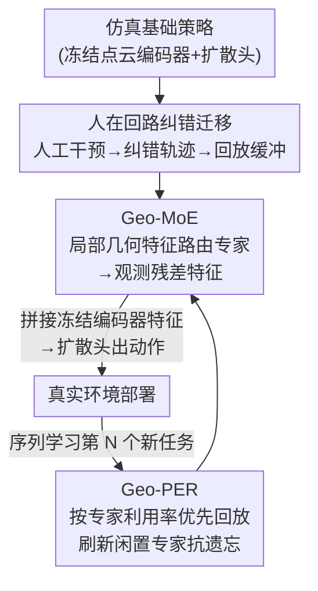

# GeCo-SRT: Geometry-aware Continual Adaptation for Cross-Task Sim-to-Real Transfer

**会议**: CVPR 2026  
**论文**: [CVF Open Access](https://openaccess.thecvf.com/content/CVPR2026/html/Yu_GeCo-SRT_Geometry-aware_Continual_Adaptation_for_Cross-Task_Sim-to-Real_Transfer_CVPR_2026_paper.html)  
**代码**: 有（论文称已开源，链接见 CVF 论文页）  
**领域**: 机器人 / 具身智能  
**关键词**: sim-to-real, 持续学习, 几何特征, 混合专家, 经验回放  

## 一句话总结
GeCo-SRT 把"模拟到真实"迁移从一次性调参改造成**跨任务持续累积**的过程：用人在回路的纠错轨迹量化 sim-to-real gap，再用「几何感知混合专家（Geo-MoE）」把点云的局部几何特征（平面性、线性、显著性）作为跨任务、跨域不变的可复用知识载体，并用「几何专家引导的优先经验回放（Geo-PER）」保护闲置专家不被遗忘，最终在 4 个真实机械臂任务上平均成功率比 baseline 高 52%，且只用 1/6 数据就能追平。

## 研究背景与动机
**领域现状**：用低成本仿真数据训练真实机器人是个诱人的路径，但仿真和现实之间存在不可避免的差距（渲染不真实、物理简化），导致仿真里学到的策略一部署到现实就性能暴跌——这就是经典的"sim-to-real gap"。主流解法有三类：系统辨识（System Identification）建模真实物理参数、域随机化（Domain Randomization）在大量仿真变体上训练、以及数据驱动的纠正方法（如 Transic 用人工纠错轨迹）。

**现有痛点**：系统辨识依赖预定义模型结构、人力成本高且难以建模复杂非线性动力学；域随机化依赖专家手工配置随机化范围，可能覆盖不到真实系统的真实特性；数据驱动方法虽然摆脱了手工设计，但**都被限制在单任务适配**。这意味着每来一个新任务，都要从头重新收集数据、重新调参，前面任务积累的迁移经验被完全浪费。

**核心矛盾**：现有方法把每一次 sim-to-real 迁移都当成**孤立**的事来做（isolated transfer），无法把过去的迁移经验复用到新任务上。根本原因是它们缺一个"既跨任务又跨域都不变"的知识载体——视觉感知对纹理、材质的域偏移极其敏感，没法当稳定桥梁。

**切入角度**：作者观察到**局部几何特征**天然具有双重不变性。一方面是**域不变**：表面法向、平面性这类从 3D 数据导出的几何结构，在仿真和现实里是一致的，不像纹理那样会随域变化；另一方面是**任务不变**：同一个立方体的平整表面，既是"pick cube"的抓取目标，也是"stack cube"的关键特征。几何基元（边、角）在不同操作任务间共享。

**核心 idea**：把局部几何特征当作**跨任务持续累积知识的载体**——用混合专家网络让不同专家专精不同几何模式，并用经验回放保护这些专家知识不被新任务覆盖，从而把孤立迁移升级成"越迁越省"的持续迁移。

## 方法详解
### 整体框架
GeCo-SRT 要回答两个问题：(1) 怎么把人设计的 sim-to-real 启发式（什么时候该纠正）转成神经网络能学的格式？(2) 跨多次迭代迁移中，到底什么知识是可迁移的？

针对第一个问题，方法用**人在回路（human-in-the-loop）**把 sim-to-real 迁移重构成"从人工纠错轨迹中学习"：先在仿真里用模仿学习训一个冻结的基础扩散策略（base policy），部署到真实环境后由人在共享自治框架下实时干预纠错，把纠错数据 $D^{hi}_{real}$ 和仿真数据 $D^{ei}_{sim}$ 合成回放缓冲区 $D^{mi}_{buf}$，专门训练一个**共享的感知残差模块** $E^s_p$ 去对齐点云观测特征。针对第二个问题，作者把这个共享残差模块实现成 **Geo-MoE**（几何感知混合专家），抽取局部几何特征并动态激活专家；再用 **Geo-PER** 在持续学习时按"专家利用率"优先回放历史样本，保护专家专精知识。整条管线如下：

### 关键设计

**1. 人在回路纠错迁移：把 sim-to-real 启发式量化成可学的回放缓冲**

痛点是"什么时候该纠正、怎么纠"本来是人脑里的启发式，神经网络学不了。作者用共享自治框架把它显式化：对每个任务 $i$，先在仿真里用行为克隆训一个基础扩散策略 $\pi_{bi}$（点云编码器 $E^{bi}_p$ + 扩散动作头 $\pi^{bi}_h$，优化简化的 L2 扩散损失 $L_{diff}=\mathbb{E}[\|\epsilon-\epsilon_\theta(a^k_t,k,o_t)\|^2]$）。部署到真实环境后，每个时间步如果操作员预判要失败就介入接管 $a_t\leftarrow a^h_t$ 并把指示位 $I^h_t$ 置真，否则让策略自己走 $a_t\leftarrow\pi_{bi}(o_t)$。收集这些 $(o_t,a_t,I^h_t)$ 元组构成真实纠错数据集 $D^{hi}_{real}$，再和仿真轨迹合并成回放缓冲 $D^{mi}_{buf}$。关键在于：**基础策略 $\pi_{bi}$ 全程冻结**，只有共享的感知残差模块 $E^s_p$ 在所有任务间持续更新——这样它能逐步把每个任务缓冲里的可复用知识固化下来，把"纠错"这个动作转成了一条可持续累积的数据流，为后续持续学习铺好底座。

**2. Geo-MoE 几何感知混合专家：用局部几何特征当跨域跨任务的可迁移知识**

这是方法的核心，直接对应"什么知识可迁移"这个问题。Geo-MoE 作为感知残差模块 $E^s_p$，专门处理局部几何差异、动态激活专精专家。具体流程：先用 k-近邻（k-NN）从输入点云 $P$ 采样局部点组 $g_i$，对每个组用局部 PCA 估计三类局部几何特征——**平面性（planarity）、线性（linearity）、显著性（saliency）**；再用一个轻量门控网络 $G$ 算出对 $M$ 个并行专家的路由权重 $w_i=\mathrm{Softmax}(G(g_i))$，组的处理结果是专家加权和：

$$g'_i = \sum_{j=1}^{M} w_{i,j}\cdot \mathrm{Expert}_j(g_i).$$

所有组特征聚合成单个校正残差向量 $g'_{res}$，与冻结基础编码器输出拼接成校正特征 $\hat f=\mathrm{Concat}(E^{bi}_p(o), g'_{res})$，送进扩散头出动作 $\hat a=\pi^{bi}_h(\hat f)$。训练时冻结基础策略、只更新 Geo-MoE，损失为 $L_{total}=\mathrm{MSE}(\hat a,a)+\alpha L_{balance}$，其中 $L_{balance}$ 是防止门控塌缩、保证专家均衡利用的标准辅助损失。为什么有效：和那些用"整体点云"硬补 sim-to-real gap 的方法不同，Geo-MoE 按局部几何属性把不同模式路由给不同专家，学到的是更细粒度、几何感知的知识——单任务实验里它平均成功率 50.0%，远超只在动作空间补残差的 7.5%，说明观测层的几何对齐才是关键。

**3. Geo-PER 几何专家引导的优先经验回放：按专家利用率回放，保护闲置专家不被遗忘**

持续学习到第 $N$ 个任务时，前 $N-1$ 个任务的数据存进统一回放缓冲 $R=\bigcup_{j=1}^{N-1}D^{mj}_{buf}$。最大的挑战是**专家级灾难遗忘**：标准 PER 按任务 loss 给样本排优先级，会忽视当前任务用不到的"闲置专家"，它们的专精几何知识就被慢慢遗忘了。Geo-PER 的核心是把优先级指标**从任务 loss 换成专家利用率**。做法：给每个历史样本 $i$ 存下专家激活向量 $W_i=\{w_{i,1},\dots,w_{i,M}\}$；处理当前任务 $N$ 的新数据时算出各专家平均利用率 $U^{new}=\{u^{new}_1,\dots,u^{new}_M\}$；再动态更新历史样本采样优先级：

$$P_i \propto \sum_{j=1}^{M} w_{i,j}\cdot \frac{1}{u^{new}_j+\epsilon}.$$

这个式子是对专家失衡的主动反制：如果专家 $j$ 在新任务里被用得少（$u^{new}_j$ 低），它的倒数项 $(u^{new}_j+\epsilon)^{-1}$ 就大，于是那些强烈激活过该专家的历史样本（$w_{i,j}$ 高）会被高概率采到，闲置专家的参数因此被持续纳入梯度更新。和标准 PER 比，Geo-PER 是专门为 MoE 结构定制的——它保证即便某专家在当前任务上闲置，也会周期性地被历史数据"刷新"，从而保住专精知识、抗遗忘。

### 损失函数 / 训练策略
训练分两阶段。仿真阶段训扩散基础策略：学习率 $3\times10^{-4}$，去噪步数 10，动作分块大小 8，用 2000 条专家轨迹。持续 sim-to-real 阶段：每任务采集 60 条人工纠错轨迹，混入历史任务数据抗遗忘，残差学习率 $1\times10^{-3}$，每个专家学习率 $1\times10^{-3}$；Geo-PER 的优先级指数设 0.6、平滑项 $1\times10^{-6}$、优先级更新 EMA 系数 0.4。⚠️ 原文同时写了"混入 10% 历史数据"和"人工纠错占 95%"，两处比例口径略有出入，以原文为准。

## 实验关键数据
评测用 4 个机械臂操作任务（Pick Cube / Stack Cube / Pick Banana / Plug Insert），横跨 ManiSkill 仿真和真实世界（Xarm5 机械臂 + Robotiq-2F140 夹爪 + 两个 RealSense D435/D435i 融合点云）。两个指标：成功率 SR（前向迁移能力，每任务 30 次试验取平均）和归一化负向后向迁移 N-NBT（衡量灾难遗忘，越低越好）。

### 主实验
单任务 sim-to-real 迁移（成功率 SR）：

| 方法 | Pick Cube | Stack Cube | Pick Banana | Plug Insert | 平均 SR |
|------|-----------|------------|-------------|-------------|---------|
| Direct Deploy（直接部署） | 5.7% | 0.0% | 6.7% | 0.0% | 3.1% |
| Action Residual（动作残差） | 16.7% | 3.3% | 10.0% | 0.0% | 7.5% |
| Transic | 66.7% | 30.0% | 23.3% | 33.3% | 38.3% |
| **Geo-MoE（本文）** | **80.0%** | **43.3%** | **40.0%** | **36.7%** | **50.0%** |

直接部署仅 3.1% 证实 gap 巨大；只在动作空间补残差仅 7.5%，说明不解决观测层的 gap 根本不够。Geo-MoE 平均 50.0%，靠的是按几何属性细粒度路由。

跨任务持续学习（按 Pick Cube→Stack Cube→Pick Banana→Plug Insert 顺序学，SR↑ / N-NBT↓ 取平均）：

| 方法 | 平均 SR ↑ | 平均 N-NBT ↓ |
|------|-----------|--------------|
| Naive Fine-tuning | 9.2% | 75.0% |
| Transic + PER | 40.0% | 55.0% |
| Geo-MoE + EWC | 38.3% | 49.5% |
| Geo-MoE + PER | 55.8% | 29.6% |
| **Ours (GeCo-SRT)** | **63.3%** | **26.5%** |

只把骨干换成 Geo-MoE（Transic+PER 40.0% → Geo-MoE+PER 55.8%）就大幅涨点且降遗忘，说明 Geo-MoE 架构天生更适合持续学习；再加 Geo-PER 升到 63.3% 平均成功率、最低遗忘，验证专精知识需要主动保护。

### 消融实验
拆解 Geo-MoE 两个核心组件（Observation Residual = 用点云编码器对齐观测 gap；MoE = 混合专家架构）：

| Observation Residual | MoE | 平均 SR ↑ | 平均 N-NBT ↓ | 说明 |
|:---:|:---:|---------|--------------|------|
| × | × | 7.5% | 75.0% | baseline（仅动作残差） |
| × | ✓ | 9.2% | 65.5% | 没有信息特征时 MoE 几乎无效 |
| ✓ | × | 45.8% | 37.0% | 加观测残差独自带来最大跃升 |
| ✓ | ✓ | **55.8%** | **29.6%** | 完整模型，两者互补 |

### 关键发现
- **观测残差是涨点主力**：单加 MoE（×,✓）几乎无改善（7.5%→9.2%），但加上 Observation Residual（✓,×）平均成功率直接跳到 45.8%、N-NBT 暴跌到 37.0%——专家架构必须先有信息丰富的几何特征喂进来才有意义。
- **MoE 在稳定特征上做专精**：在观测残差基础上加 MoE 进一步到 55.8%，靠把几何模式路由到不同专家做针对性处理，既提升后续任务表现又缓解遗忘。
- **任务几何相似度决定迁移收益**：在数据稀缺（仅 10 条轨迹）下，从相似的 Pick Cube 迁到 Stack Cube 是显著正迁移（40.0%，远超 from-scratch 26.7%，逼近 from-scratch 用 60 条的 43.3%）；从不相似的 Plug Insert 迁过来则负迁移（16.7%）。有意思的是 Pick Banana→Plug Insert 也有益，作者归因于"抓取非立方体物体"的共享几何挑战。
- **数据效率**：持续学习版只用 20 条轨迹在 Pick Cube 上达 76.6%，逼近 from-scratch 用 3× 数据（60 条）的水平；总体 1/6 数据即可追平 baseline。

## 亮点与洞察
- **几何特征的"双重不变性"是全文最巧的立论**：把"什么可迁移"这个抽象问题，落到"局部几何（平面性/线性/显著性）既跨域又跨任务不变"这个具体可计算的载体上——比起在纹理敏感的视觉空间硬补 gap，这是更稳的桥梁，也是 MoE 路由能 work 的前提。
- **Geo-PER 把 PER 的优先级从 task-loss 换成 expert-utilization**，是个可迁移的 trick：任何 MoE+持续学习的场景，只要担心"闲置专家被遗忘"，都可以用"利用率倒数"这个反制项强行把闲置专家拉回梯度更新，思路干净。
- **冻结基础策略 + 只训共享残差模块**的设计让"持续累积"有了明确的知识容器：所有任务共享同一个 $E^s_p$，知识自然沉淀在里面，而不是散落在每个任务各自的策略里。

## 局限与展望
- 只在 4 个机械臂任务、单一硬件平台（Xarm5）上验证，任务和物体几何多样性有限；几何相似度高时正迁移、不相似时负迁移，说明方法对"几何不相似的任务序列"可能不友好。
- ⚠️ 依赖人工纠错轨迹（每任务 60 条 + 共享自治框架），人在回路的成本虽比从头调参低，但仍非全自动；纠错质量直接影响回放缓冲质量。
- 局部几何特征（平面性/线性/显著性）由局部 PCA 估计，对点云噪声、深度相机精度敏感；对纹理主导、几何线索弱的任务（如柔性物体、透明物体）可能失效。
- 专家数 $M$、k-NN 邻域大小等超参对几何特征分辨率的影响文中未充分消融，迁移到更复杂场景时可能需要重调。

## 相关工作与启发
- **vs Transic**：Transic 同样用人工纠错轨迹做无显式建模的 sim-to-real 迁移，但停留在**单任务**且用整体残差网络。本文在它基础上换成 Geo-MoE 几何感知骨干、并引入持续学习，把单任务迁移升级成跨任务知识累积——单任务上 50.0% vs 38.3%，持续学习上 63.3% vs 40.0%。
- **vs 系统辨识 / 域随机化**：前者建模真实物理参数但人力密集、难处理复杂动力学；后者靠手工配随机化范围、可能覆盖不全。本文绕开显式物理建模和手工随机化，用数据驱动的几何残差对齐观测 gap。
- **vs 标准持续学习（EWC / 标准 PER）**：EWC 靠约束重要参数更新保护旧知识、标准 PER 按 task-loss 排优先级，但都没考虑 MoE 的专家级利用率。Geo-MoE+EWC 仅 38.3%、Geo-MoE+PER 55.8%，而专门为 MoE 定制的 Geo-PER 达 63.3%，说明把持续学习机制和 MoE 结构对齐才能最大化抗遗忘。

## 评分
- 新颖性: ⭐⭐⭐⭐⭐ 首次把 sim-to-real 迁移做成跨任务持续累积，几何双重不变性 + Geo-MoE + Geo-PER 三者环环相扣，立意清晰。
- 实验充分度: ⭐⭐⭐⭐ 单任务/持续/数据效率/相似度四组真实机械臂实验齐全，但只有 4 任务单一平台，规模偏小。
- 写作质量: ⭐⭐⭐⭐⭐ 两个核心问题驱动、图文清晰，公式和机制讲得明白。
- 价值: ⭐⭐⭐⭐ 低成本高效跨任务 sim-to-real 对真实机器人部署有直接价值，1/6 数据追平很实用。

<!-- RELATED:START -->

## 相关论文

- [\[CVPR 2026\] GeCo-SRT: Geometry-aware Continual Adaptation for Robotic Cross-Task Sim-to-Real Transfer](gecosrt_geometryaware_continual_adaptation_for_rob.md)
- [\[CVPR 2026\] Contact-Aware Neural Dynamics](contact-aware_neural_dynamics.md)
- [\[CVPR 2026\] QuantVLA: Scale-Calibrated Post-Training Quantization for Vision-Language-Action Models](quantvla_scale-calibrated_post-training_quantization_for_vision-language-action_.md)
- [\[CVPR 2026\] GA-VLN: Geometry-Aware BEV Representation for Efficient Vision-Language Navigation](ga-vln_geometry-aware_bev_representation_for_efficient_vision-language_navigatio.md)
- [\[CVPR 2026\] GeoDexGrasp: Geometry-aware Generation for Data-efficient and Physics-plausible Dexterous Grasping](geodexgrasp_geometry-aware_generation_for_data-efficient_and_physics-plausible_d.md)

<!-- RELATED:END -->
