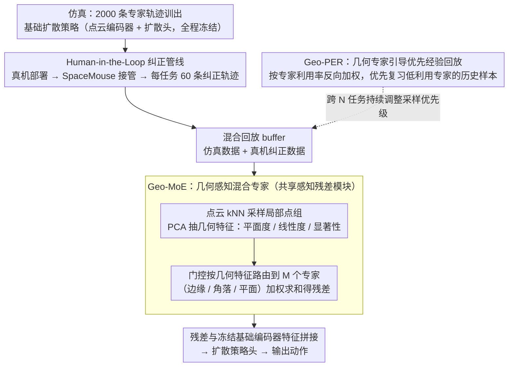

# GeCo-SRT: Geometry-aware Continual Adaptation for Robotic Cross-Task Sim-to-Real Transfer

**会议**: CVPR 2026  
**arXiv**: [2602.20871](https://arxiv.org/abs/2602.20871)  
**代码**: 无  
**领域**: 机器人/具身智能  
**关键词**: Sim-to-Real迁移, 持续学习, 几何感知MoE, 点云表征, 经验回放  

## 一句话总结
GeCo-SRT提出持续跨任务Sim-to-Real迁移范式，利用局部几何特征的域不变性和任务不变性，通过几何感知MoE模块提取可复用的几何知识并用专家引导的优先经验回放防遗忘，在4个操作任务上比基线平均提升52%成功率且仅需1/6数据。

## 背景与动机
传统Sim-to-Real方法（系统辨识、域随机化、数据驱动迁移）将每次迁移视为独立过程——每个新任务都需从头调参、重新收集数据，成本高且浪费先前经验。核心问题在于：不同任务之间的Sim-to-Real gap实际上共享大量结构化的跨域知识（如几何形状在仿真和现实中一致），但现有方法无法在任务间积累复用这些知识。

## 核心问题
如何在多个Sim-to-Real任务之间**持续积累可迁移知识**，使得每个新任务的迁移更快更好，而非每次从零开始？什么样的知识载体既跨域又跨任务？

## 方法详解

### 整体框架

GeCo-SRT 想解决的是「每个 Sim-to-Real 任务都从零开始」的浪费：它把多个迁移任务串成一条持续学习的链路，让任务之间能互相借力。整条管线走 Human-in-the-Loop 模式——先在仿真里用 2000 条专家轨迹训出一个基础扩散策略，部署到真机时由操作员用 SpaceMouse 实时接管纠错（每任务约 60 条纠正轨迹），再把纠正数据和仿真数据混进同一个回放 buffer，只训练一个跨任务共享的感知残差模块 Geo-MoE。基础策略全程冻结，知识全部沉淀在这个持续更新的残差模块里；当任务一个接一个地来时，再用 Geo-PER 调度回放采样、保护已学到的几何知识不被遗忘。

### 关键设计

**1. Human-in-the-Loop 纠正管线：把 Sim-to-Real gap 量化成可积累的纠正轨迹**

域差距本身是隐式的、难以直接优化。本文把它显式化为人类纠正轨迹：先在仿真里用 2000 条专家轨迹训出基础扩散策略（点云编码器 + 扩散头），部署到真机后由操作员通过 SpaceMouse 在共享自主框架下实时接管——预见失败时介入并记下纠正动作，这些纠正数据（每任务约 60 条）就成了 gap 的具体样本。纠正数据与仿真数据混进同一个回放 buffer 后**只更新共享的感知残差模块、基础策略冻结**，使得「新任务带来的新知识」有一条干净的沉淀路径——每次迁移的增量都落在同一个残差模块上，任务越多它越强。

**2. 几何感知混合专家 Geo-MoE：把局部几何当作跨域跨任务的知识载体**

每次迁移都重调参的根本原因，是没找到一种「既跨仿真/现实、又跨任务」的可复用知识。本文的洞察是局部几何特征恰好具备这种**双重不变性**——一块平面、一条边缘在仿真和现实里长得一样（域不变），在抓取、堆叠等不同任务里也都会出现（任务不变）。Geo-MoE 就是上一步那个共享感知残差模块的具体实现：从输入点云用 kNN 采样局部点组，用局部 PCA 抽出平面度、线性度、显著性等几何特征，再用这些特征驱动门控网络把点组路由到不同专家，每个专家专精一类几何结构（边缘/角落/平面）；各点组的专家输出加权求和聚合成一个残差向量，与冻结基础编码器的特征拼接后送入扩散策略头产生动作。正因为路由依据是域不变、任务不变的几何量，学到的专家知识才能在新任务上直接复用，而不是绑死在某个任务的外观上。

**3. 几何专家引导的优先经验回放 Geo-PER：让闲置专家也被周期性刷新**

跨任务持续学习时，标准 PER 按任务损失采样，会冷落当前任务用不到的专家，导致它们悄悄遗忘旧任务的几何知识。Geo-PER 把采样优先级从「任务损失」换成「专家利用率」：先为每条历史样本存下它的专家激活向量，适配新任务时算出当前任务对各专家的平均利用率；如果某专家在当前任务被低利用（利用率 $u_j^{\text{new}}$ 低），就优先从历史 buffer 里捞那些**强激活该专家**的样本（权重 $w_{i,j}$ 高），采样概率为

$$P_i \propto \sum_{j=1}^{M} w_{i,j} \cdot \frac{1}{u_j^{\text{new}} + \epsilon}$$

这是一种反向对冲——越是当前没人用的专家，越要主动喂它旧样本，从而保证所有几何专家都被周期性复习，而不是只伺候当前任务。

### 损失函数 / 训练策略

$\mathcal{L}_{\text{total}} = \text{MSE}(\hat{a}, a) + \alpha \mathcal{L}_{\text{balance}}$，其中 balance loss 防止门控坍塌到少数专家。基础策略训练 lr=$3 \times 10^{-4}$，残差学习 lr=$1 \times 10^{-3}$；Geo-PER 采样优先度参数 0.6，EMA 更新系数 0.4；每任务 60 条纠正轨迹。

## 实验关键数据

| 设定 | 指标 | GeCo-SRT | Transic+PER | Geo-MoE+PER | Direct Deploy |
|--------|------|------|----------|------|------|
| 单任务迁移 | Avg SR(%) | **50.0** | 38.3 | - | 3.1 |
| 持续4任务迁移 | Avg SR(%) | **63.3** | 40.0 | 55.7 | 3.1 |
| 持续4任务迁移 | Avg N-NBT(%) | **26.5** | 48.2 | 36.3 | - |
| 数据效率 | 匹配基线所需数据 | **1/6** | - | - | - |

### 消融实验要点
- 观测残差（点云编码器）是最关键组件：加入后SR从3.1%跃升到45.8%
- 仅加MoE不加观测残差无效（几何路由需要有意义的特征做基础）
- 观测残差+MoE组合最优（55.8% SR）
- Geo-PER vs 标准PER：63.3% vs 55.7%，证明专家级优先级优于任务级损失优先级
- 任务相似性影响迁移效果：PickCube→StackCube正迁移（40%），PlugInsert→StackCube负迁移（16.7%）
- 专家数N=3最优，N=2和N=8也稳健（60-65%）
- 新增Faucet/Tidying任务：持续学习（83.3/56.7%）远优于零样本（53.3/30%）和从头训练（76.6/43.3%）

## 亮点
- 首次将Sim-to-Real迁移从孤立任务扩展为持续跨任务知识积累范式
- 局部几何特征的"双重不变性"洞察新颖且经过实验验证——确实是理想的跨域跨任务知识载体
- Geo-PER将经验回放优先级从任务级转移到专家级的设计独特，针对MoE结构定制
- 数据效率突出：20条轨迹就能接近从头60条轨迹的性能
- MoE可解释：可视化显示专家确实自发专精于边缘/角落/平面

## 局限与展望
- 主要解决观测gap（视觉层面），对复杂动力学gap（物理层面）效果有限
- 依赖Human-in-the-Loop纠正数据收集，虽然只需60条轨迹但仍需人工参与
- 4个任务的规模较小，更大规模的任务序列是否仍然有效待验证
- 仅使用点云输入，RGB性能明显较差（40% vs 80%）

## 与相关工作的对比
- **Transic**: 同样用人工纠正轨迹做Sim-to-Real迁移，但是行为克隆残差网络，无MoE无持续学习，单任务38.3% vs GeCo-SRT单任务50%
- **Domain Randomization**: 需要手工设置随机化范围，且每任务独立；GeCo-SRT自动累积跨任务知识
- **LIBERO/LOTUS等持续学习**: 针对纯模仿学习的持续学习，未涉及Sim-to-Real gap；GeCo-SRT首次将持续学习引入Sim-to-Real迁移

## 启发与关联
- 几何特征作为跨域不变量的思路可以和之前读的AFRO（3D动态预训练）互补——AFRO学动态，GeCo-SRT用几何做迁移
- 专家级优先经验回放的设计可以推广到其他MoE-based持续学习系统

## 评分
- 新颖性: ⭐⭐⭐⭐ 持续跨任务Sim-to-Real是全新设定，Geo-MoE+Geo-PER组合有原创性
- 实验充分度: ⭐⭐⭐⭐ 4+3个真实机器人任务，详尽消融+迁移分析+数据效率+可解释性
- 写作质量: ⭐⭐⭐⭐ 问题驱动清晰，方法叙述有层次
- 价值: ⭐⭐⭐⭐ 为Sim-to-Real迁移提供了新的持续学习视角，数据效率高

<!-- RELATED:START -->

## 相关论文

- [\[CVPR 2026\] GeCo-SRT: Geometry-aware Continual Adaptation for Cross-Task Sim-to-Real Transfer](geco-srt_geometry-aware_continual_adaptation_for_cross-task_sim-to-real_transfer.md)
- [\[CVPR 2026\] RoboWheel: A Data Engine from Real-World Human Demonstrations for Cross-Embodiment Robotic Learning](robowheel_a_data_engine_from_real-world_human_demonstrations_for_cross-embodimen.md)
- [\[CVPR 2026\] Learning to See and Act: Task-Aware Virtual View Exploration for Robotic Manipulation](learning_to_see_and_act_task-aware_virtual_view_exploration_for_robotic_manipula.md)
- [\[CVPR 2026\] QuantVLA: Scale-Calibrated Post-Training Quantization for Vision-Language-Action Models](quantvla_scale-calibrated_post-training_quantization_for_vision-language-action_.md)
- [\[CVPR 2026\] GA-VLN: Geometry-Aware BEV Representation for Efficient Vision-Language Navigation](ga-vln_geometry-aware_bev_representation_for_efficient_vision-language_navigatio.md)

<!-- RELATED:END -->
