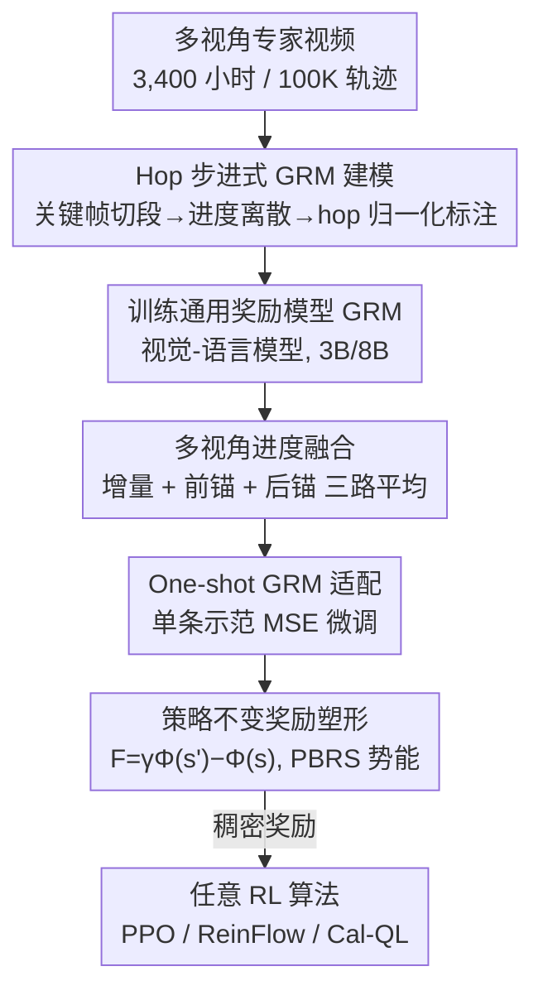

# General Process Reward Modeling for Robotic Reinforcement Learning

**会议**: CVPR 2026  
**论文**: [CVF Open Access](https://openaccess.thecvf.com/content/CVPR2026/html/Tan_General_Process_Reward_Modeling_for_Robotic_Reinforcement_Learning_CVPR_2026_paper.html)  
**代码**: https://robo-dopamine.github.io （项目页）  
**领域**: 机器人 / 强化学习 / 奖励建模  
**关键词**: 过程奖励模型, 机器人操作, 强化学习, 奖励塑形, 多视角

## 一句话总结
提出 Robo-Dopamine：先用 3,400 小时多视角视频训练一个"步进式、跨任务"的通用进度奖励模型 GRM，再配一套有理论保证的"策略不变奖励塑形"把稠密信号喂给 RL，让真机策略在单条示范 + 约 150 次在线 rollout（约 1 小时）内从近乎 0 涨到 95% 成功率。

## 研究背景与动机

**领域现状**：把强化学习用到真实机器人操作上，最大的拦路虎是奖励函数怎么设计。稀疏的二值结果奖励（成功给 1、否则给 0）在长程、富接触任务里探索极其困难；手工设计的稠密奖励又要大量领域知识、难以规模化。于是近年大家转向"学出来"的过程奖励模型（Process Reward Model, PRM），用一个模型实时估计任务完成进度作为稠密奖励。

**现有痛点**：作者指出现有 PRM 有两个根本缺陷。其一，奖励模型本身不够好——很多是任务特定的、泛化差；进度分布被假设成均匀的，抓不住关键子步骤的差异；而且只用单视角观测，在遮挡场景下连"手腕视角才看得见的细粒度进展"都判断不了。其二，用这些稠密信号做奖励塑形的算法在理论上往往是错的：朴素地把稠密进度加进回报，会诱发"语义陷阱"（semantic trap），让智能体倾向于停在高进度值的状态里"刷分"而不是真正完成任务。

**核心矛盾**：稠密奖励能加速探索，但只要它不满足"最优策略不变"（policy invariance），就会悄悄改变任务目标，把策略带偏。既要稠密又要不改目标，是这条路线绕不开的张力。

**本文目标**：(1) 学一个跨本体、跨任务、对遮挡鲁棒的步进式进度奖励模型；(2) 设计一套能用稠密信号、但数学上保证不改变最优策略的塑形方案；(3) 让真机策略以极少的在线交互高效自我提升。

**切入角度**：作者把"任务进度"本身当作监督信号，并且不直接回归绝对进度，而是学"相对的相对进度"（hop），再用势能型奖励塑形（PBRS）的经典理论框架保证策略不变。

**核心 idea**：用"hop 归一化的步进式进度 + 多视角融合"造一个通用奖励模型，再用"势能 = 进度"的策略不变塑形把它安全地接进任意 RL 算法。

## 方法详解

### 整体框架
Robo-Dopamine 分两大块：**Dopamine-Reward**（怎么学奖励模型 GRM）和 **Dopamine-RL**（怎么把 GRM 安全地用进 RL）。前者把海量多视角视频按"子任务关键帧"切段、离散成进度状态，再以 hop 形式训练一个视觉-语言模型 GRM 去预测任意两状态之间的相对进展；推理时从三个互补视角融合预测得到稳健进度。后者拿到预训练 GRM 后，用单条人类示范一次性适配到新任务，再把进度当势能函数做策略不变奖励塑形，喂给任意 RL 算法（PPO / ReinFlow / Cal-QL 等）在线学习。

### 关键设计

**1. Hop 步进式进度建模：把"进度"变成有界、可累积的监督信号**

痛点是：直接回归两状态间的绝对进度增益 $\Phi_\delta(s_p,s_q)=\Phi(s_q)-\Phi(s_p)$，迭代预测会累积误差、把重建出的进度 $\Phi^\star(s)$ 推到 $[0,1]$ 之外。作者先把每条专家轨迹用人工标注的多视角关键帧 $\{K_0,\dots,K_N\}$ 切成子任务段，再在每段内按 chunk 大小 $C$ 自适应采样（段内中间点数 $m=\frac{1}{N}\lfloor L/C\rfloor$），得到状态序列并定义 ground-truth 全局进度 $\Phi(s_i)=i/M$。关键是不学绝对增益，而学 **hop**——相对于"剩余/已走"距离归一化的相对进展：

$$H(s_p,s_q)=\begin{cases}\dfrac{\Phi(s_q)-\Phi(s_p)}{\Phi(s_M)-\Phi(s_p)} & q\ge p\ (\text{PROGRESS})\\[2mm]\dfrac{\Phi(s_q)-\Phi(s_p)}{\Phi(s_p)-\Phi(s_0)} & q<p\ (\text{REGRESS})\end{cases}$$

前进时用"到目标的剩余距离"归一、后退时用"从起点已走的距离"归一，监督被压进 $[-1,1]$。它的理论好处是：迭代套用预测 hop 重建全局进度时，$\Phi^\star(s)$ 被保证严格落在 $[0,1]$ 内（附录给证明）。采样时还把 hop 离散成 $N_{hop}$ 个桶、时间距离分 $N_{dis}$ 个桶做平衡，并额外注入比例 $\alpha$ 的 zero-hop 样本（$|\Phi(s_q)-\Phi(s_p)|\le\epsilon$）来抑制对静止片段的偏置。整套管线最终产出 35M 样本、覆盖真机/仿真/第一人称人类视频。

**2. 多视角进度融合：用三个互补视角抵消单点预测的漂移**

单纯做增量预测（incremental）虽然局部细腻，但沿长轨迹会累积误差漂移。作者在推理时从三个视角各算一份进度再平均。增量视角递推：$\Phi^\star_I(s_t)=\Phi^\star(s_{t-1})+\Delta\Phi^\star_{t-1,t}$，其中 hop 按符号缩放（$H^\star\ge0$ 时乘剩余 $[1-\Phi^\star(s_{t-1})]$、$H^\star<0$ 时乘已走 $\Phi^\star(s_{t-1})$）。前锚视角（forward-anchored）锚定起始零进度态 $\Phi^\star_F(s_t)=H^\star(s_{init},s_t)$ 提供全局稳定参考；后锚视角（backward-anchored）锚定目标态 $\Phi^\star_B(s_t)=1+H^\star(s_{goal},s_t)$，在接近完成时特别敏感。三者平均 $\Phi^\star(s_t)=\frac{1}{3}(\Phi^\star_I+\Phi^\star_F+\Phi^\star_B)$，把"局部精度 / 起点稳定 / 终点敏感"三种长处揉到一起，得到抗漂移的稳健进度。注意这里的"多视角"既指上面三种锚定方式，也对应输入侧把手腕视角与第三人称视角一起喂给 GRM，靠多相机解决遮挡。

**3. One-shot GRM 适配：单条示范就把通用模型对齐到新任务**

预训练 GRM 已经有了评估进度的广义先验，因此面对新任务/高精度任务时不需要重训，只用一条人类示范 $D_{human}$ 做最小二乘微调：$L_{GRM}(\omega)=\mathbb{E}_{(s_p,s_q)\sim D_{human}}\|H^\star_\omega-H_{gt}\|_2^2$，从预训练参数 $\omega_0$ 出发 SFT 得到任务适配的 $GRM_{\omega^\star}$。这一步是"近 0→95%"高样本效率的前提：在线 RL 之前先用极小代价把奖励信号校准到目标任务上。

**4. 策略不变奖励塑形：把进度当势能，根治"语义陷阱"**

痛点是朴素稠密奖励 $r=\Phi^\star(s_{t+1})-\Phi^\star(s_t)$ 优化折扣回报时，等价于最大化一个被改写的目标 $J'(\pi)\propto\mathbb{E}_\pi[\sum\gamma^{t-1}\Phi^\star(s_t)]$，它会奖励"停在高进度态"而非完成任务——这就是语义陷阱。作者要求塑形奖励同时满足三条：最优策略不变、与标准折扣回报/TD 更新相容、可由单步转移本地计算。由这三条唯一确定了势能型形式，从连续时间"折扣势能" $e^{-\lambda t}\Phi^\star(s_t)$ 推出离散单步增量 $F(s_t,s_{t+1})=\gamma\Phi^\star(s_{t+1})-\Phi^\star(s_t)$（$\gamma=e^{-\lambda h}$）。再自动判定稀疏结果奖励：当估计进度 $\Phi^\star(s_{t+1})\ge1-\delta$（$\delta=0.05$）即视为完成给 $r_{gold}=1$。最终奖励：

$$r_{GRM}(s_t,a_t,s_{t+1})=r_{gold}+\gamma\Phi^\star(s_{t+1})-\Phi^\star(s_t)$$

因为塑形项沿轨迹是望远镜求和（telescoping），累积后塌缩成只依赖初始态 $s_0$ 的常数边界项 $-\Phi^\star(s_0)$，于是塑形后的 Q 函数只是原 Q 的逐状态平移 $Q^\pi_{GRM}(s,a)=Q^\pi_{gold}(s,a)-\Phi^\star(s)$。平移量与动作 $a$ 无关，所以 $\arg\max_a Q^\star$ 不变——这正是经典 PBRS（势能奖励塑形）框架，进度 $\Phi^\star$ 充当势能函数，既给稠密引导又不动最优策略。该框架对 online / offline / offline-to-online、value-based / gradient-based 各类 RL 都通用。

### 损失函数 / 训练策略
GRM 预训练在 35M hop 样本上学相对进度；下游适配用单条示范做 MSE 微调（式 9）。RL 阶段奖励即 $r_{GRM}$（式 11），可直接套进 PPO（配 OpenVLA-OFT）、ReinFlow（配 π0）、Cal-QL（真机 offline-to-online）等算法。

## 实验关键数据

### 主实验
跨 8 个数据集评估 GRM 的进度感知（VOC：预测进度与打乱帧真实时序的秩相关，范围 $[-1,1]$，越高越好），并在仿真/真机上评估策略学习。

| 评估 | 指标 | GVL | VLAC-2B | GRM-8B 单视角 | GRM-8B 多视角 |
|------|------|------|---------|--------------|--------------|
| VOC 均值（稀疏/中/密） | 秩相关 ↑ | 0.20 / 0.12 / 0.13 | 0.24 / 0.29 / 0.33 | 0.92 / 0.91 / 0.89 | **0.96 / 0.96 / 0.94** |
| 任务完成判断（60 测试均值） | 准确率 ↑ | 37.2% | 33.9% | 83.9% | **92.8%** |

任务完成判断里 GRM-8B 多视角（92.8%）还反超了 GPT-5（83.9%）、Gemini-2.5-Pro（81.1%）、Qwen3-VL（76.7%）等通用大模型。基线 PRM（GVL/VLAC）随采样变密性能明显退化，而 GRM 在三种采样密度下都稳定高分。

策略侧：GRM 一次性适配后，Dopamine-RL 让真机策略从近 0 提升到 95% 成功率，仅需约 150 次在线 rollout（约 1 小时真机交互），部分任务达 100%；仿真任务（Insert-Squares / Stack-Three-Cubes / Fold-the-Towels）相对稀疏奖励 RL 分别提升约 +38.3 / +68.2 / +55.0 个百分点。

### 消融实验
| 配置 | VOC 均值（S/M/D） | 说明 |
|------|------------------|------|
| GRM-8B 多视角（Full） | 0.96 / 0.96 / 0.94 | 多视角 + 多视角融合 |
| GRM-8B 单视角 | 0.92 / 0.91 / 0.89 | 去掉多视角输入后掉点 |
| GRM-3B 多视角 | 0.96 / 0.94 / 0.93 | 缩小到 3B 仍远超基线 |
| GVL / VLAC-2B | ≤0.33 | 现有 PRM 基线 |

### 关键发现
- **多视角是稳健性的关键**：单视角→多视角在密采样下提升最明显（0.89→0.94），印证遮挡场景下手腕视角不可或缺（对应 RQ3 融合的作用）。
- **基线随采样变密退化、本文不退化**：说明 hop 归一化 + 多视角融合真正抓住了细粒度时序，而非靠粗粒度关键帧蒙对。
- **进度奖励模型可超越通用大模型**：在任务完成判断上 GRM-8B 多视角（92.8%）高于 GPT-5（83.9%），说明专门为机器人进度建模的小模型比通用 VLM 更可靠。
- **样本效率极高**：1 小时真机交互即从近 0 到 95%，得益于 one-shot 适配先把奖励校准好 + 策略不变塑形不浪费探索。

## 亮点与洞察
- **把 PBRS 理论"对症下药"**：语义陷阱的本质是塑形改了目标，作者用势能型塑形（望远镜求和塌缩成常数）从数学上保证最优策略不变，比经验性加稠密奖励干净得多。
- **hop 的"相对的相对"设计很巧**：用剩余/已走距离归一化，既给出有方向的进退信号，又天然把重建进度锁在 $[0,1]$，规避了绝对回归的越界与误差累积。
- **奖励模型与 RL 解耦、对算法不可知**：$r_{GRM}$ 是即插即用的奖励，能接 PPO/ReinFlow/Cal-QL，迁移到新机器人栈时只换 RL 后端、不动奖励侧。
- **数据规模即护城河**：3,400 小时、100K 轨迹、350+ 日常任务、真机/仿真/人类视频混合，是 GRM 跨本体泛化的底座，这套标注管线本身可复用。

## 局限与展望
- **依赖人工关键帧切段**：GRM 训练数据靠人工多视角关键帧切子任务，标注成本高，限制进一步扩规模。
- **进度作为唯一奖励的盲区**：把"完成度"当唯一信号，对"安全/省力/避碰"等非进度目标无能为力，复杂约束任务可能需要额外奖励项。
- **OOD 幻觉仍需兜底**：作者在附录单列了感知鲁棒估计来缓解 OOD 场景的预测幻觉，说明 GRM 在分布外仍可能给错进度，依赖额外机制兜底。
- **真机评测规模有限**：8 个真机任务、60 条 rollout 的判断测试规模偏小，更大规模长程任务上的稳定性有待验证。

## 相关工作与启发
- **vs 任务特定 PRM（如 SARM）**：他们为单任务设计奖励、泛化差；本文用 hop + 大规模多本体数据学通用 GRM，一次预训练 + one-shot 适配即可迁移。
- **vs 通用 VLM 当奖励（GVL）**：GVL 用 VLM 直接判进度，随采样变密退化严重；GRM 专门以相对进度为监督、多视角融合，密采样下仍稳。
- **vs 朴素稠密奖励塑形**：直接加进度差会落入语义陷阱（奖励停滞）；本文用 PBRS 势能形式保证策略不变，从根上避免。
- **vs 模仿学习（IL）**：IL 依赖静态专家数据、样本效率与 OOD 泛化差；本文用 RL + 稠密 GRM 奖励，在线交互中超越静态数据上限。

## 评分
- 新颖性: ⭐⭐⭐⭐⭐ hop 相对进度 + 多视角融合 + 策略不变塑形三件套，把 PRM 路线的两大缺陷一次补齐
- 实验充分度: ⭐⭐⭐⭐ 8 数据集 VOC + 真机/仿真策略 + 多 RL 算法验证充分，但真机判断测试规模偏小
- 写作质量: ⭐⭐⭐⭐ 逻辑清晰、理论部分扎实，公式较密需对照附录
- 价值: ⭐⭐⭐⭐⭐ 真机 1 小时近 0→95%，对机器人 RL 的奖励工程有直接落地价值

<!-- RELATED:START -->

## 相关论文

- [\[ICLR 2026\] MVR: Multi-view Video Reward Shaping for Reinforcement Learning](../../ICLR2026/robotics/mvr_multi-view_video_reward_shaping_for_reinforcement_learning.md)
- [\[ICLR 2026\] APPLE: Toward General Active Perception via Reinforcement Learning](../../ICLR2026/robotics/apple_toward_general_active_perception_via_reinforcement_learning.md)
- [\[CVPR 2026\] DemoFunGrasp: Universal Dexterous Functional Grasping via Demonstration-Editing Reinforcement Learning](demofungrasp_universal_dexterous_functional_grasping_via_demonstration-editing_r.md)
- [\[AAAI 2026\] Actor-Critic for Continuous Action Chunks: A Reinforcement Learning Framework for Long-Horizon Robotic Manipulation with Sparse Reward](../../AAAI2026/robotics/actor-critic_for_continuous_action_chunks_a_reinforcement_le.md)
- [\[CVPR 2026\] Learning to See and Act: Task-Aware Virtual View Exploration for Robotic Manipulation](learning_to_see_and_act_task-aware_virtual_view_exploration_for_robotic_manipula.md)

<!-- RELATED:END -->
