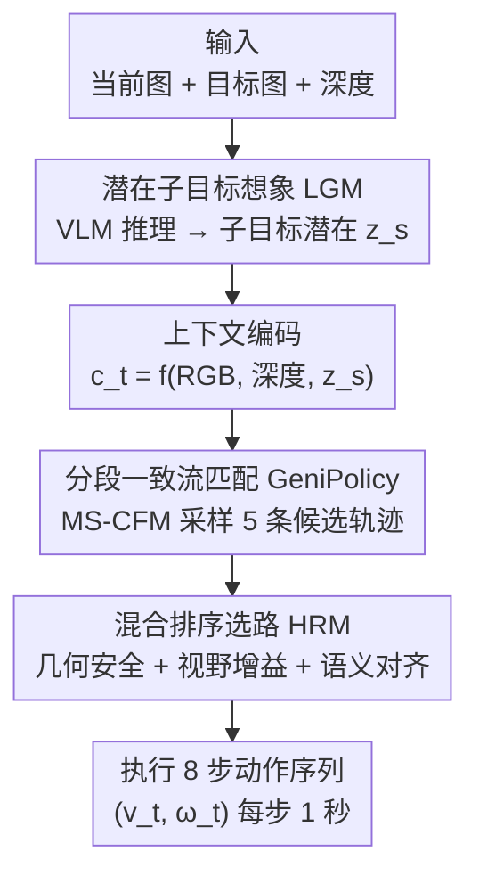

# GeniNav: Generative Model Driven Image-Goal Navigation via Imagination-Guided Consistency Flow Matching

**会议**: CVPR 2026  
**论文**: [CVF Open Access](https://openaccess.thecvf.com/content/CVPR2026/html/Chen_GeniNav_Generative_Model_Driven_Image-Goal_Navigation_via_Imagination-Guided_Consistency_Flow_CVPR_2026_paper.html)  
**代码**: 项目页 https://cyq638.github.io/geninav/（未见公开代码仓）  
**领域**: 机器人 / 具身智能  
**关键词**: 图像目标导航, 生成式策略, 流匹配, 潜在子目标, 轨迹评估  

## 一句话总结
GeniNav 用 VLM 在潜在空间"想象"中间子目标来引导一个多段一致性流匹配（MS-CFM）策略生成平滑轨迹，再用融合几何安全、语义对齐、视野增益的混合排序模块挑出最优路径，在无地图的图像目标导航上把成功率从 ~54% 提到 68.7%。

## 研究背景与动机
**领域现状**：图像目标导航（image-goal navigation）要求机器人仅凭当前 RGB-D 观测和一张目标图像，在没有预建地图的情况下走到目标视角。早期工作用确定性策略把观测直接映射到低级动作，但逐步决策忽略了"通往目标有多条可行路径"这一事实，导致短视行为、难以长程规划。近来生成式策略（diffusion / flow matching）成为主流——它们一次产出一整段连贯动作序列，能在多条候选路径上推理，NoMaD 用扩散策略迭代去噪、FlowNav 用条件流匹配（CFM）以更少推理步达到类似表达力。

**现有痛点**：作者指出三个具体短板。其一，NoMaD 这类方法本质是局部规划器，依赖预建拓扑地图给中间目标，地图缺失时（尤其起点和目标语义差异大）探索效率很低。其二，扩散类框架虽有多模态灵活性，却没充分利用语义和安全线索，常生成运动学合法但语义次优的路径。其三，整个领域缺乏统一的闭环 benchmark——已有数据集只提供开环轨迹或静态场景重建，无法做公平可复现的对比。

**核心矛盾**：生成式策略的"多模态采样能力"与"语义/几何约束"之间是脱节的——光会采样出多条路径，却没有可靠机制判断哪条既语义对路又物理可行；同时显式生成子目标图像（如 ViNT、ImagineNav）又容易产生几何不一致、不可达的幻觉目标。

**本文目标**：在无地图设定下，把三件事统一进一个框架——(1) 给策略提供可靠的中间语义引导；(2) 生成时间一致、平滑的轨迹；(3) 用统一的多模态准则评估并选出最终轨迹。

**切入角度**：与其生成显式子目标图像，不如把子目标表示成 VLM 推理出的**潜在语义特征**——这样隐式地保证几何可行性，同时维持语义对齐和方向一致，避开了显式图像子目标的幻觉问题。

**核心 idea**：用 VLM 在潜在空间想象子目标来"牵引"一个分段一致性流匹配策略，再用一个同时看几何安全和语义对齐的混合排序器收尾，并配一个闭环 benchmark 把整套流程标准化。

## 方法详解

### 整体框架
GeniNav 把图像目标导航建模为一个由多模态感知驱动的**连续多段流过程**。给定当前 RGB 图像 $I^{rgb}_t$、深度图 $I^{dep}_t$ 和从 LGM 抽取的子目标特征 $z_s$，系统先把语义、几何和任务信息编码成统一上下文 $c_t = f_\theta(\phi(I^{rgb}_t), \psi(I^{dep}_t), z_s)$。在 $c_t$ 条件下，GeniPolicy 用 MS-CFM 把高斯噪声逐段转化为面向目标的动作序列，一次采样 5 条候选轨迹 $A_k$；最后 HRM 在几何可行性、视野可见性、语义一致性三重准则下评估候选并选出执行路径。整个框架两阶段训练：先在"观测-目标"对上预训练 LGM，再把它与 GeniPolicy 联合优化以保证引导与轨迹一致。

三个贡献模块串成一条清晰流水线：LGM 想象子目标 → GeniPolicy 生成候选轨迹 → HRM 排序选路。

### 关键设计

**1. 潜在子目标想象模块 LGM：用 VLM 在潜在空间"想象"中间目标而非生成图像**

传统图像目标导航只用一个目标 embedding 做策略条件，语义引导太弱、捕捉不到中间语义依赖，长程规划经常失效；而显式生成子目标图像又会带来几何不一致和不可达目标。LGM 的做法是把子目标表示成**潜在语义特征**，当作"语义推理"和"轨迹生成"之间的接口。具体地，把当前观测 $I^{rgb}_t$、目标图 $I_g$ 和一段文本导航提示 $P$ 一起喂给 Qwen2.5-VL-7B：文本被 tokenize，两张图被 2D 视觉编码器编成 image token，所有 token 经多模态 transformer 融合，取最后一层隐状态 $X_{vlm}$；再用一个轻量 transformer 编解码模块聚合跨模态上下文、增强空间-语义对齐，mean-pool 后过 MLP 投影得到子目标潜在 $z_s$。关键在于 VLM 不显式画出子目标图，而是通过视觉-文本注意力**隐式推断导航意图**，从而绕开显式图像子目标的幻觉问题。

但 $z_s$ 缺乏显式约束，作者用三个互补辅助损失来"塑形"潜在空间：(i) **语义对齐损失** $L_{sem}$ 让 $z_s$ 对齐预训练视觉-语言教师抽取的未来子目标特征，引导其编码任务相关的未来语境；(ii) **几何嵌入损失**把当前-目标视角的相对位姿离散成 SE(2) 分类——径向距离 $r$ 和朝向角 $\phi$ 各分成 $N_r$、$N_\theta$ 个 bin，模型预测 $p_\theta(\phi|z_s)$ 和 $p_\theta(r|z_s)$ 各用交叉熵优化；(iii) **对比正则项** $L_{NCE}$ 增强实例间区分、防止表示坍缩。总目标为：

$$L_{total} = \lambda_{sem}L_{sem} + \lambda_{dir}L_{dir} + \lambda_{dis}L_{dist} + \lambda_{nce}L_{NCE}$$

这样得到的潜在空间既语义对齐又几何接地，为 GeniPolicy 提供稳定的条件信号。

**2. GeniPolicy 与多段一致性流匹配 MS-CFM：把全局流切成多段、各段独立又彼此一致，保证时间平滑**

普通流匹配（FM）用一个全局向量场 $v_\theta$ 把高斯噪声 $a_0$ 沿轨迹 $\gamma_a(\tau)$ 确定性地演化到目标动作，训练目标是最小化预测速度与真值速度的差 $L_{FM}=\mathbb{E}\|v_\theta(\tau,a_t^\tau|c_t)-u_t(a_t^\tau|c_t)\|_2^2$。问题是单个全局流场在长程控制里容易产生弯曲、时间不一致的轨迹。一致性流匹配（CFM）引入速度对齐约束 $v(t,\gamma_a(t))=v(s,\gamma_a(s))$ 强制流向沿时间一致，让轨迹更直更稳。

MS-CFM 在此基础上进一步把时间区间 $[0,1]$ 切成 $K$ 个局部段，每段配独立条件向量场 $v^{(i)}_\theta$，段内局部流映射定义为 $f^{(i)}_\theta(\tau,a_t^\tau|c_t)=a_t^\tau+(\frac{i}{K}-\tau)v^{(i)}_\theta(\tau,a_t^\tau|c_t)$，训练损失在每段上对齐相邻时刻的流映射与速度（用 EMA 参数 $\theta^-$ 和小偏移 $\Delta\tau$）：

$$L_{GeniPolicy} = \mathbb{E}_{\tau\sim U_i}\Big[\|f^{(i)}_\theta(\tau)-f^{(i)}_{\theta^-}(\tau+\Delta\tau)\|_2^2 + \alpha\|v^{(i)}_\theta(\tau)-v^{(i)}_{\theta^-}(\tau+\Delta\tau)\|_2^2\Big]$$

推理时向量场沿 $K$ 段确定性演化 $a^{i/K}_t=a^{(i-1)/K}_t+\frac{1}{K}v^{(i)}_\theta(\frac{i-1}{K},a^{(i-1)/K}_t|c_t)$。这种分段设计的妙处在于：全局保持平滑（段间一致性约束串起来形成分段线性流），同时每段又能局部适配动作分布的变化——比单全局流表达力更强，又比扩散策略推理步数少得多。

**3. 混合排序模块 HRM：几何安全先过滤、再用 GPT-4V 语义打分 + 视野增益加权选路**

光生成 5 条候选还不够，得有统一准则挑出"既物理可行又语义对路"的那条。HRM 先把每条连续轨迹离散成一串 3D 位姿，用外参矩阵 $T_{cam\leftarrow robot}$ 变换到相机系、再用内参 $K$ 投影成像素折线叠加到当前帧。然后三道评估：

- **几何安全**：把离散 3D 点投到深度图，若 $z'_i - I^{dep}_t(u_i,v_i) > \delta$（$\delta$ 是补偿传感器噪声和机器人体积的安全容差）就判为碰撞；任何含碰撞点的轨迹直接剔除，只有无碰撞轨迹进入后续评估。
- **语义对齐**：把投影可视化和 LGM 为当前/目标图生成的文本描述拼成视觉-语言 prompt 喂给 GPT-4V，得到语义分 $\tilde{R}_k$，衡量轨迹终点朝向、空间一致性、语义相关度与目标场景的匹配度。
- **视野增益**：在终点朝向 $\theta^{(k)}_{end}$ 附近 $\pm30°$ 水平视野内均匀采 $M$ 条射线，投到深度图取可见深度并归一化为 $\tilde{S}^k_{view}=\frac{1}{M D_{max}}\sum_{m=1}^{M}D_t(u_m,v_m)$，分越高说明终点区域遮挡越少、越利于探索。

最终在通过安全约束的轨迹里按 $F_k=\lambda_1\tilde{R}_k+\lambda_2\tilde{S}^k_{view}$ 加权，取 $k^*=\arg\max_k F_k$。HRM 的区别在于：它不像 cost-guided 只看低级空间线索、也不像纯 VLM 评估只看语义，而是把视觉相关性、几何可行性、动态稳定性统一进同一个多模态打分。

### 损失函数 / 训练策略
两阶段训练：第一阶段在观测-目标对上预训练 LGM（语义对齐 + SE(2) 几何分类 + 对比正则四项联合，Eq.1）；第二阶段把 LGM 与 GeniPolicy 联合优化，用 MS-CFM 的段内一致性损失（Eq.6）保证子目标引导与生成轨迹一致。推理时每步采 5 条候选、每条 8 步动作、每步执行 1 秒。

## 实验关键数据

### 主实验
所有方法都在 Gibson 训练集上训练、统一在无地图无先验、一致传感输入下评测：原本依赖全局地图的方法（NoMaD/FlowNav/NaviDiffusor/MetricNet/NaviBridger）被改成只用目标图，LiDAR 方法（LDP/DTG/VL-TGS）改用 Habitat 深度图。Gibson 验证集测域内性能，MP3D 测跨域泛化（不微调）。

| 方法 | 选路方式 | Gibson SR%↑ | Gibson SPL%↑ | Gibson CR%↓ | MP3D SR%↑ | MP3D SPL%↑ | MP3D CR%↓ |
|------|----------|------|------|------|------|------|------|
| NoMaD | Random | 35.0 | 22.3 | 21.3 | 24.4 | 11.9 | 28.8 |
| FlowNav | Random | 44.7 | 27.7 | 15.1 | 31.5 | 22.6 | 21.3 |
| NaviDiffusor | Cost-Guided | 48.0 | 37.4 | 12.8 | 40.9 | 28.6 | 18.3 |
| MetricNet | Cost-Guided | 54.5 | 43.3 | 11.9 | 41.2 | 29.4 | 17.5 |
| VL-TGS | VLM | 48.2 | 37.6 | 14.2 | 35.6 | 25.0 | 20.3 |
| NavDP | Critic-Guided | 52.4 | 41.5 | 13.6 | 40.6 | 28.4 | 19.5 |
| **GeniNav (Ours)** | **HRM** | **68.7** | **59.4** | **9.8** | **55.2** | **45.7** | **14.2** |

相比最强生成式基线 MetricNet，GeniNav 在 Gibson 上 SR +14.2、SPL +16.1、CR 从 11.9 降到 9.8；跨域到 MP3D 仍保持全场最高 SR/SPL，说明只靠视觉+深度、不依赖任何预建地图就能生成几何一致、动态稳定的轨迹，且跨域鲁棒。作者还做了 sim-to-real：在小规模真实数据上微调后部署到带 RealSense D435i 的实体机器人，在 RTX 6000 Ada 上实时运行，无地图也能跑出平滑无碰撞、语义对齐的轨迹。

### 消融实验
在 Gibson / MP3D 验证集上逐模块消融（下表取 Gibson 侧关键值）：

| 配置 | Gibson SR↑ | Gibson SPL↑ | Gibson CR↓ | 说明 |
|------|------|------|------|------|
| **Full GeniNav** | **68.7** | **59.4** | **9.8** | 完整模型 |
| w/o LGM | 58.2 | 48.8 | 14.1 | 只用目标 embedding，SR 掉 10.5 |
| w/o Aux Loss | 61.8 | 50.9 | 12.7 | 去三辅助损失，潜在漂移、碰撞增多 |
| w/ Explicit Image Subgoal | 62.5 | 51.6 | 11.2 | 显式扩散子目标图（ViNT 式），仍逊于潜在设计 |
| Conditional Flow Matching | 63.7 | 53.2 | 13.5 | 单全局流，轨迹弯曲、时间不一致 |
| Diffusion Policy | 39.0 | 26.4 | 25.7 | 同推理预算下扩散步数不够，大幅掉点 |
| Random Selection | 53.2 | 37.5 | 18.9 | HRM 换随机选，目标偏好不稳、漂移 |
| Critic-based Eval. | 63.8 | 53.5 | 14.1 | HRM 换 critic（NavDP 式），有域偏置 |
| VLM Eval. | 60.3 | 51.4 | 15.8 | HRM 换纯 VLM，缺几何意识、选出语义合理但不安全的路 |

### 关键发现
- **GeniPolicy（MS-CFM）贡献最大**：把它换成 Diffusion Policy 在同推理预算下 SR 从 68.7 暴跌到 39.0、CR 飙到 25.7——分段一致性流在效率和时间稳定性上对生成式导航是决定性的；换成单全局 CFM 也掉到 63.7，证明"分段"这一步确实有用。
- **潜在子目标 > 显式图像子目标**：w/ Explicit Image Subgoal（62.5）虽优于无监督变体，但仍输给完整潜在设计（68.7），印证作者"显式子目标图带来不一致/不可达"的判断；辅助损失也很关键，去掉后碰撞明显增多。
- **HRM 必须几何+语义一起看**：纯 VLM 评估（60.3）会选出"语义合理但空间不安全"的轨迹，critic 评估（63.8）有域偏置泛化差，只有融合几何安全+视野增益+语义对齐的 HRM 才到 68.7。
- **数据集规模**：GeniBench 491.6 km，比 NavDP 的 363.2 km 更大，且是唯一支持 data-aligned 闭环评估的（见 GeniBench 对比表）。

## 亮点与洞察
- **"潜在想象"替代"图像想象"**：把子目标从"生成一张未来图"改成"VLM 推理出的潜在语义特征"，一招同时规避了图像幻觉和几何不可达，又天然 end-to-end 可训——这是把 VLM 接进导航策略很优雅的接口设计。
- **分段一致性流匹配**：MS-CFM 把"全局平滑"和"局部自适应"用 $K$ 段独立向量场 + 段内一致性损失调和起来，是 FlowNav 式 CFM 在长程控制下的自然升级，消融里它的增益最大。
- **HRM 的三准则可迁移**：几何安全（深度碰撞检测）→ 语义对齐（GPT-4V 打分）→ 视野增益（射线采样可见深度）这套"先硬过滤再软加权"的选路范式，可直接迁到任何生成多候选轨迹的机器人任务上。
- **闭环 benchmark GeniBench**：176 场景（86 Gibson + 90 MP3D）、491.6 km、带真实机器人动力学，补上了生成式导航缺统一闭环评测的坑。

## 局限与展望
- **重度依赖大模型**：在线推理里 HRM 调用 GPT-4V 做语义打分、LGM 用 Qwen2.5-VL-7B，实时性和成本对部署是隐忧（论文称在 RTX 6000 Ada 上实时，但每步调 GPT-4V 的延迟/费用没详细给，⚠️ 以原文为准）。
- **室内为主**：GeniBench 全是室内场景（Gibson/MP3D），对室外、动态行人、大尺度场景的泛化未验证。
- **候选数固定为 5**：每步只采 5 条候选轨迹，复杂分叉路口下覆盖度是否够、候选数与性能的关系没系统分析。
- **sim-to-real 仅定性**：真机部署用图示展示，未给真实环境的量化 SR/SPL，跨域差距难评估。

## 相关工作与启发
- **vs NoMaD / FlowNav**：它们是依赖预建拓扑地图的局部规划器，且随机选轨迹（Random）；GeniNav 无地图、用 HRM 主动选路，Gibson SR 从 35.0/44.7 提到 68.7。
- **vs ViNT / ImagineNav**：它们显式生成中间子目标图像，易有几何不一致和不可达目标；GeniNav 用潜在子目标隐式保证可行性（消融里显式图像子目标 62.5 < 潜在 68.7）。
- **vs VL-TGS**：它用 CVAE 生成 + 语言驱动选路，潜在易模式坍缩、且只看语义不看几何；GeniNav 用流匹配避免坍缩，HRM 同时看几何安全和动态稳定（MP3D SR 35.6 → 55.2）。
- **vs NavDP**：它用 critic 评估安全做 sim-to-real，但 benchmark 只有 3 个场景且 critic 有域偏置；GeniNav 的 HRM 不需训练 critic、GeniBench 覆盖 176 场景。

## 评分
- 新颖性: ⭐⭐⭐⭐ 潜在子目标想象 + 分段一致性流 + 几何-语义混合选路三者组合在图像目标导航上是新颖的系统设计
- 实验充分度: ⭐⭐⭐⭐ 域内/跨域双数据集 + 逐模块消融 + sim-to-real，但真机仅定性、候选数等超参分析缺
- 写作质量: ⭐⭐⭐⭐ 三模块对应三贡献，公式和动机讲得清晰
- 价值: ⭐⭐⭐⭐ 方法 + 闭环 benchmark（491.6 km）双交付，对生成式导航社区有实用价值

<!-- RELATED:START -->

## 相关论文

- [\[CVPR 2026\] Global Prior Meets Local Consistency: Dual-Memory Augmented Vision-Language-Action Model for Efficient Robotic Manipulation](global_prior_meets_local_consistency_dual-memory_augmented_vision-language-actio.md)
- [\[CVPR 2026\] ActiveGrasp: Information-Guided Active Grasping with Calibrated Energy-based Model](activegrasp_information-guided_active_grasping_with_calibrated_energy-based_mode.md)
- [\[CVPR 2026\] FloVerse: Floor Plan-Guided Multi-Modal Navigation](floverse_floor_plan-guided_multi-modal_navigation.md)
- [\[ICLR 2026\] Sparse Imagination for Efficient Visual World Model Planning](../../ICLR2026/robotics/sparse_imagination_for_efficient_visual_world_model_planning.md)
- [\[CVPR 2026\] Memory-Augmented Scene Understanding and Exploration for Open-World Aerial Object-Goal Navigation](memory-augmented_scene_understanding_and_exploration_for_open-world_aerial_objec.md)

<!-- RELATED:END -->
