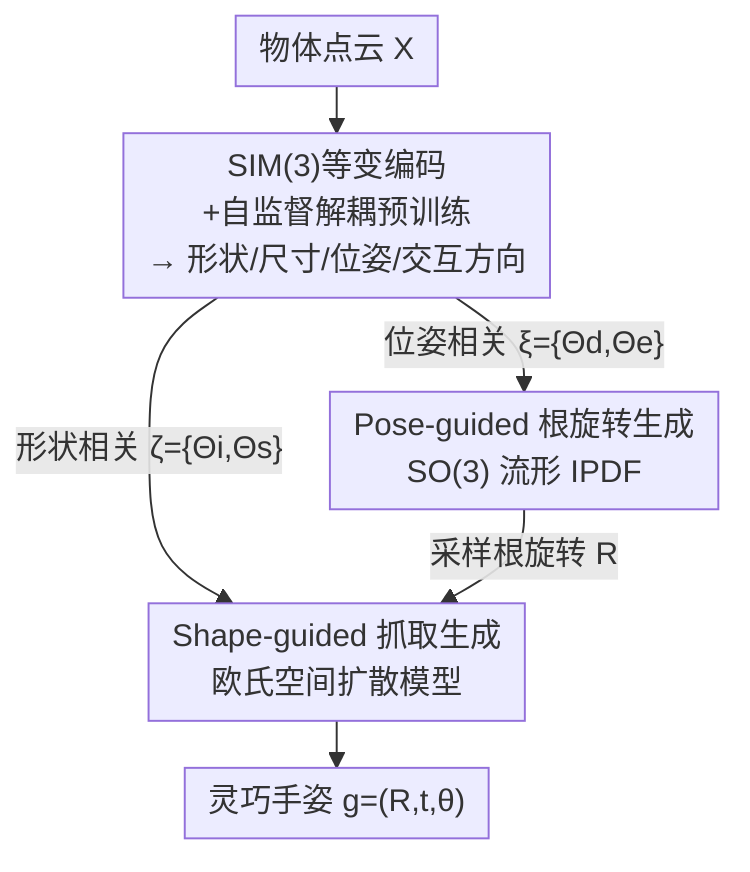

# GeoDexGrasp: Geometry-aware Generation for Data-efficient and Physics-plausible Dexterous Grasping

**会议**: CVPR 2026  
**论文**: [CVF Open Access](https://openaccess.thecvf.com/content/CVPR2026/html/Han_GeoDexGrasp_Geometry-aware_Generation_for_Data-efficient_and_Physics-plausible_Dexterous_Grasping_CVPR_2026_paper.html)  
**代码**: https://xjtbinghan.github.io/GDG.github.io （项目页）  
**领域**: 机器人 / 灵巧抓取  
**关键词**: 灵巧抓取, SIM(3)等变, 几何表征, 扩散模型, 物理合理性

## 一句话总结
GeoDexGrasp 用一个 SIM(3) 等变网络配合自监督解耦预训练，从点云里抽出可解释、可迁移的形状/尺寸/位姿/交互方向四类几何表征，再把灵巧抓取拆成「SO(3) 流形上的根旋转生成 + 欧氏空间里的手指关节扩散生成」两段解耦流程，用不到 SOTA 五分之一的参数量做到了相当的成功率，并把穿透深度降了约 40%。

## 研究背景与动机
**领域现状**：灵巧手（如 24 自由度的 ShadowHand）抓取近年主流是数据驱动的生成式方法——用 CVAE / Glow flow / 扩散模型在 DexGraspNet、UniDexGrasp、DexGraspAnything 等大规模数据集上拟合「物体点云 → 手姿 $g=(R,t,\theta)$」的多模态分布，靠数据量换多样性。

**现有痛点**：这些方法几乎只做统计拟合，忽略了抓取本身固有的几何先验。后果有二——一是**数据效率低**，数据一减成功率就崩；二是**物理合理性差**，很多在仿真里被判为「成功」的抓取其实是靠「过度抓握」（over-grasping），手指深深穿进物体里（penetration），在真机上根本用不了。

**核心矛盾**：模型把「同一个物体被旋转 / 缩放 / 换姿态」当成全新的样本去记忆，而没有像人那样「看一眼形状、尺寸、朝向就能推断怎么抓」。低层网络缺乏对 SIM(3) 变换的内在不变/等变结构，导致它必须用海量增广样本去硬记这些变换。

**本文目标**：用物体中心的几何表征来同时提升灵巧抓取生成的数据效率和物理合理性，并对没见过的尺寸做到泛化。

**切入角度**：人抓取时依赖物体几何（shape/size/pose）做推理。作者据此把等变网络（embed 几何归纳偏置到结构里，无需靠数据记忆变换）引入高自由度灵巧抓取——这是此前等变工作多停留在平行夹爪/策略学习、没怎么进灵巧手的空白。

**核心 idea**：先用 SIM(3) 等变 + 自监督解耦预训练学出「形状/尺寸/位姿/交互方向」四类**可解释、可迁移**的几何表征，再把抓取生成在两个本就不同的空间里**解耦**——旋转走 SO(3) 流形概率模型，手指关节走欧氏空间扩散模型，各自用对应的几何条件来引导。

## 方法详解

### 整体框架
输入是物体点云 $X\in\mathbb{R}^{N\times3}$，输出是一组高质量、多样的灵巧手姿 $G=\{g_i\}$，其中 $g=(R,t,\theta)$：$R\in SO(3)$ 是根旋转，$t\in\mathbb{R}^3$ 是根平移，$\theta\in\mathbb{R}^{24}$ 是手指关节角。整个 pipeline 分三阶段：**阶段 1** 学几何表征（一个 SIM(3) 等变网络 + 自监督解耦预训练，再用 PointSO 补上交互方向）；**阶段 2** 用位姿相关表征 $\xi=\{\Theta_d,\Theta_e\}$ 在 SO(3) 流形上生成根旋转；**阶段 3** 在根旋转确定后把问题转成旋转不变的抓取任务，用形状/尺寸相关表征 $\zeta=\{\Theta_i,\Theta_s\}$ 作为条件、在欧氏空间跑扩散模型生成手指关节角和根平移。

这一「分阶段 + 空间解耦」的设计来自一个观察：根旋转活在 SO(3) 流形上、手指关节活在欧氏空间，把它们耦合在一起同步生成既低效又难收敛。形式上把联合分布分解为：

$$p(g \mid X, \hat{\Theta}) = p(R \mid \xi)\cdot p(t,\theta \mid X, R, \zeta)$$

### 关键设计

**1. SIM(3) 等变编码 + 自监督解耦预训练：把几何变换变成结构归纳偏置而非要记忆的样本**

针对「模型把旋转/缩放后的物体当全新样本记忆、数据效率低」这个根因，作者用一个 SIM(3) 等变网络 $\Phi$（基于 vector neuron 框架，backbone 是 VN-Transformer）来编码点云。等变的定义是：对任意刚性变换 $\Gamma=(R,t,s)\in SIM(3)$ 都满足 $f(\Gamma X)=\Gamma f(X)$。具体产出一组分工明确的潜表征 $\Theta=\Phi(X):=(\Theta_e,\Theta_i,\Theta_c,\Theta_s)$，满足：

$$\Gamma\Theta = (\Theta_e R,\ \Theta_i,\ s\Theta_c R + t,\ s\Theta_s) = \Phi(sXR+t)$$

其中 $\Theta_e\in\mathbb{R}^{C\times3}$ 是旋转等变特征（随物体一起转）、$\Theta_i\in\mathbb{R}^{C}$ 是旋转/平移/尺度都不变的特征、$\Theta_c$ 是质心（仅用于归一化对齐，后续不用）、$\Theta_s$ 是尺度因子。这样物体一旦旋转或缩放，表征跟着一致变换，网络不必从数据里「背」这些变换。

但等变/不变只是低层对称性约束，未必对齐到「形状」「位姿」这种高层几何语义。于是作者加了一个**解耦预训练**：依据「能编码形状的表征应当能独立重建整个物体」的原则，设两个轻量 MLP 辅助分支——位姿分支从 $\Theta_e$ 回归旋转参数 $R_r$，形状分支从 $\Theta_i$ 重建完整点云 $X_r$；把预测旋转作用到重建形状得到位姿感知重建 $Y=X_r R_r$，用双向 Chamfer 距离约束 $Y$ 与输入 $X$ 一致：

$$L_{pretrain}=\sum_{x\in X}\min_{y\in Y}\|x-y\|_2^2+\sum_{y\in Y}\min_{x\in X}\|y-x\|_2^2$$

（刻意用简单解码器，逼表征本身更好。）预训练后**冻结编码器**，抽出位姿 $\Theta_e$、形状 $\Theta_i$、尺寸 $\Theta_s$（尺寸直接由点云平均幅值算，不需预训练）。此外，由于 $\Theta_e$ 是自发学出的、没有显式参考系，作者再用 **PointSO**（一个在大规模 3D 数据上预训练、能按语言提示如「杯柄」「相机镜头」推断物体语义方向的朝向基础模型）输出显式交互方向 $\Theta_d=\Psi(X,l)$ 来补全方向信息。最终几何表征集合记为 $\hat\Theta=\{\Theta_d,\Theta_e,\Theta_i,\Theta_s\}$。

**2. Pose-guided 根旋转生成：在 SO(3) 流形上单独建模旋转，避免和欧氏空间手指耦合**

针对「旋转和手指同步生成低效、难收敛」的痛点（先前 DexGraspAnything 干脆把根旋转固定成单位矩阵，代价是丢掉了根旋转自由度、只能做水平抓、不真实），本阶段只用位姿相关表征 $\xi=\{\Theta_d,\Theta_e\}$ 来生成根旋转分布 $p(R\mid\xi)$。作者用 IPDF——一个定义在 SO(3) 上的概率密度模型：它在球面上生成等体积网格来均匀采样旋转，每个旋转经位置编码 + MLP；同时把交互方向 $\Theta_d$ 与位姿表征 $\Theta_e$ 融合、过 projector 得到条件特征。IPDF 对固定数量的体素分区输出未归一化对数概率，归一化密度为：

$$p(R\mid\xi)=\frac{p(\xi,R)}{p(\xi)}\approx\frac{1}{V}\frac{\exp(f(\xi,R))}{\sum_{i=1}^{N}\exp(f(\xi,R_i))}$$

其中 $N$ 是体素分区数、$V=\pi^2/N$ 是每个分区体积。训练用真值旋转的负对数似然 $L_{rot}=-\log p(R_{gt}\mid\xi)$；推理时用 CDF 从离散分布里随机采样根旋转 $R$。这样旋转的多自由度被保留下来，物体换姿态时能从不同角度抓，而不是只会水平抓。

**3. Shape-guided 抓取生成：根旋转定下后转成旋转不变任务，用形状/尺寸条件扩散生成手指**

拿到根旋转 $R$ 后，先把点云和根平移归一化 $\hat X=XR^{-1},\ \hat t=tR^{-1}$，问题就转成了一个旋转不变的抓取：手指关节角和根平移完全由物体形状、尺寸决定，分布 $p(t,\theta\mid X,R,\zeta)$ 变成 $p(\hat t,\theta\mid\hat X,\zeta)$。作者在欧氏空间用 DDPM 去噪扩散建模 $h=(\hat t,\theta)\in\mathbb{R}^{3+K}$：

$$p_\theta(h_{0:T}\mid\hat X,\zeta)=p(h_T)\prod_{\tau=1}^{T}p_\theta(h_{\tau-1}\mid h_\tau,\hat X,\zeta,\tau)$$

条件注入方式很关键：先把形状表征 $\Theta_i$ 与尺度 $\Theta_s$ 做 Hadamard 逐点调制，过线性投影预测调制系数 $\beta,\gamma$，再用它们去调制 PointTransformer 抽出的 3D 特征 $V$，作为去噪条件。训练损失除标准噪声 MSE 外，还加了两个几何约束——接触鼓励损失 $L_c$（引导手内部点贴近物体表面）和穿透惩罚 $L_p$（惩罚手指穿透物体）：

$$L_{grasp}=\eta_1 L_{MSE}+\eta_2 L_c+\eta_3 L_p$$

正是这两个几何约束 + 解耦得到的形状/尺寸条件，让生成的抓取既贴合物体边界又不穿透，物理合理性大幅提升。

### 损失函数 / 训练策略
SIM(3) 等变网络先在 DexGraspAnything(DGA) 数据集上做解耦预训练；主训练阶段先分开训练阶段 2 的旋转生成模块和阶段 3 的抓取生成模块，待各自收敛后再联合微调。

## 实验关键数据

测试物体在自监督预训练和策略训练中均**从未出现**。评测三指标：物理合理性（手网格与物体点云的穿透深度，越小越好）、成功率（Isaac Gym 中物体在六向扰动下保持稳定）、多样性（成功抓取的关节值/根旋转标准差）。

### 主实验：抓取质量（五数据集平均）

| 方法 | 穿透深度↓ (mm, Avg.) | 成功率↑ (%, Avg.) | 参数量 (M) |
|------|------|------|------|
| UniDexGrasp | 29.3 | 25.4 | 117.9 |
| SceneDiffuser | 30.8 | 37.1 | 27.5 |
| UGG | 25.5 | 44.7 | 67.0 |
| DexGraspAnything (前 SOTA) | 21.2 | 58.5 | 159.7 |
| D(R,O) | 26.0 | 49.7 | 14.1 |
| **GeoDexGrasp (本文)** | **13.6** | **60.1** | 28.7 |

穿透深度从前 SOTA 的 21.2mm 降到 13.6mm（约 −40%），五个数据集上都一致领先；平均成功率 60.1% 同时是最高，且参数量只有 DexGraspAnything 的不到 1/5（28.7M vs 159.7M）。定性上，DexGraspAnything 因固定根旋转只能水平抓，本文则能多角度抓且穿透更小。

### 消融实验（DexGRAB 数据集）

| 配置 | 解耦 | $\Theta_e,\Theta_d$ | $\Theta_s,\Theta_i$ | 预训练 | 成功率↑ | 穿透↓ |
|------|:--:|:--:|:--:|:--:|------|------|
| a | | | | | 41.8 | 40.7 |
| b | ✓ | | | | 56.1 | 33.8 |
| c | ✓ | ✓ | | | 58.6 | 31.5 |
| d | ✓ | ✓ | ✓ | | 63.2 | 19.9 |
| e (Full) | ✓ | ✓ | ✓ | ✓ | **67.5** | **15.5** |

### 关键发现
- **空间解耦贡献最大的「起跳」**：a→b 仅加解耦策略，成功率从 41.8 跳到 56.1、穿透从 40.7 降到 33.8，验证了「旋转走 SO(3)、手指走欧氏」的分治确实缓解了同步生成的低效/收敛问题。
- **形状-尺寸表征主管「不穿透」**：c→d 加入 $\Theta_s,\Theta_i$ 后穿透从 31.5 骤降到 19.9，说明形状/尺度条件让模型真正「看到」了物体边界；位姿表征 $\Theta_e,\Theta_d$ 则更多提升成功率。
- **解耦预训练锦上添花**：d→e 加预训练成功率 +4.3、穿透再降 4.4，印证「把低层等变特征对齐到高层几何语义」的价值。
- **数据效率**：每物体样本量从 100% 砍到 25% 时，UGG/DexGraspAnything 成功率明显下滑，本文仍维持较高成功率——几何先验在低数据下尤其管用。
- **尺寸泛化**：在 Cube/Cylinder/Torus 三类形状上全面超越基线（OOD 尺寸也稳）；但在拓扑复杂的 Toy Horse 上所有方法都差，作者点出一个开放挑战——**拓扑复杂形状上尺度引起的接触模式重构**让关节-动作映射高度非线性，难以随尺寸平滑迁移。⚠️ Table 2 单元格较多，正文仅取作者强调的结论，具体逐尺寸数值以原文为准。

## 亮点与洞察
- **「空间该用什么数学结构就用什么」**：根旋转本就在 SO(3) 流形、手指在欧氏空间，作者没有强行用一个网络硬拟合，而是各用合适的概率模型（IPDF / 扩散）分治——这是把任务的几何结构直接写进模型设计，而非靠数据兜底，非常值得迁移到其它高自由度生成任务。
- **等变 + 解耦预训练的组合拳**：等变给的是「变换一致性」的低层归纳偏置，解耦预训练（用「能独立重建物体」当代理任务）再把它对齐到「形状/位姿」的高层语义，两步缺一不可——消融里 d→e 的提升正说明预训练不是可有可无。
- **轻量却强**：不到 1/5 参数做到相当成功率，说明在这类任务里几何先验比纯堆数据/堆参数更划算，对真机部署友好。
- **把「成功率」打回原形**：作者反复强调仿真里很多「成功」其实是过度抓握 + 严重穿透、真机不可用——用穿透深度作为物理合理性指标来校正这个虚高，这个评测视角本身就有启发。

## 局限与展望
- 作者承认：把尺寸表征映射到灵巧手动作高度非线性，因此显式抽尺度因子带来的提升有限，未来需进一步探索。
- 拓扑复杂物体（Toy Horse）上全军覆没，尺度引起接触模式重构的难题没解决。
- 仅用全局形状表征，作者计划结合局部特征来更好建模手-物接触、做更细粒度抓取。
- ⚠️（自己看）真机实验依赖 SAM3D 从单视角 RGB-D 重建完整几何来缩小 sim-to-real gap，重建质量会直接影响抓取，论文未给出重建失败时的退化分析；评测主指标偏物理合理性，对功能性抓取（抓握后能否完成下游操作）着墨较少。

## 相关工作与启发
- **vs DexGraspAnything (前 SOTA)**：它把根旋转固定成单位矩阵来回避旋转-手指耦合，代价是丢自由度、只能水平抓；本文用 SO(3) 流形 IPDF 单独建模旋转，保留多角度抓取能力，且穿透更低、参数仅其 ~1/5。
- **vs UniDexGrasp**：UDG 也做了旋转-手指解耦（本文受其启发），但用 Glow flow 生成且无显式几何表征；本文用等变 + 解耦预训练拿到可解释几何条件，数据效率和物理合理性更好。
- **vs 等变机器人工作（EquiAct / EquiBot / ET-SEED）**：这些把 SIM(3)/SE(3) 等变引入平行夹爪策略或扩散策略；本文是首次把 SIM(3) 等变推到高自由度灵巧抓取生成。
- **vs 优化类方法（D(R,O) / GenDexGrasp）**：优化法能给稳定解但耗时、解空间探索差；本文生成式 + 几何先验在穿透和平均成功率上都更优。

## 评分
- 新颖性: ⭐⭐⭐⭐ 首次把 SIM(3) 等变 + 解耦预训练引入高自由度灵巧抓取，空间解耦的两段生成设计清晰。
- 实验充分度: ⭐⭐⭐⭐ 五数据集 + 数据效率 + 尺寸泛化 + 消融 + 真机，覆盖全面；逐尺寸表略复杂、部分依赖补充材料。
- 写作质量: ⭐⭐⭐⭐ 动机—方法—实验逻辑顺，公式与表征分工交代清楚。
- 价值: ⭐⭐⭐⭐ 轻量、低穿透、可迁移的几何表征思路，对真机灵巧抓取部署有实际意义。

<!-- RELATED:START -->

## 相关论文

- [\[CVPR 2026\] GA-VLN: Geometry-Aware BEV Representation for Efficient Vision-Language Navigation](ga-vln_geometry-aware_bev_representation_for_efficient_vision-language_navigatio.md)
- [\[CVPR 2026\] DextER: Language-driven Dexterous Grasp Generation with Embodied Reasoning](dexter_language-driven_dexterous_grasp_generation_with_embodied_reasoning.md)
- [\[AAAI 2026\] Towards Affordance-Aware Robotic Dexterous Grasping with Human-like Priors](../../AAAI2026/robotics/towards_affordance-aware_robotic_dexterous_grasping_with_human-like_priors.md)
- [\[CVPR 2025\] DexGrasp Anything: Towards Universal Robotic Dexterous Grasping with Physics Awareness](../../CVPR2025/robotics/dexgrasp_anything_towards_universal_robotic_dexterous_grasping_with_physics_awar.md)
- [\[CVPR 2026\] MaskDexGrasp: Generative Masked Modeling for Part-Aware Dexterous Grasp Synthesis](maskdexgrasp_generative_masked_modeling_for_part-aware_dexterous_grasp_synthesis.md)

<!-- RELATED:END -->
