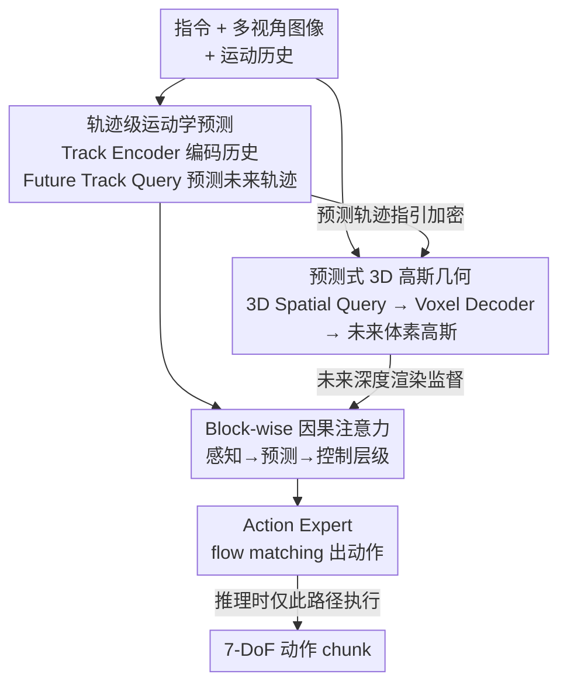

# GeoPredict: Leveraging Predictive Kinematics and 3D Gaussian Geometry for Precise VLA Manipulation

**会议**: CVPR 2026  
**论文**: [CVF Open Access](https://openaccess.thecvf.com/content/CVPR2026/html/Qian_GeoPredict_Leveraging_Predictive_Kinematics_and_3D_Gaussian_Geometry_for_Precise_CVPR_2026_paper.html)  
**代码**: [项目主页](https://jingjingqian75.github.io/GeoPredict-Page/)（暂未见开源代码）  
**领域**: 机器人 / 具身智能  
**关键词**: VLA、机器人操作、预测式运动学、3D高斯几何、训练期监督

## 一句话总结
GeoPredict 给一个连续动作的 VLA 策略（基于 π₀）加上两个「未来预测」辅助任务——预测机器人关键点的多步 3D 轨迹、预测工作空间的未来 3D 高斯几何，且这两个模块**只在训练时**作监督信号、推理时完全不跑，从而在不增加部署开销的前提下，让策略学到面向 3D 空间和长程动力学的内部表示，在 RoboCasa、LIBERO 和真机上都明显超过 π₀ 基线。

## 研究背景与动机
**领域现状**：Vision-Language-Action（VLA）模型把预训练 VLM 的语义/视觉先验直接映射到机器人动作，泛化性很强，是当前操作策略的主流范式（OpenVLA、π₀ 等）。

**现有痛点**：这些模型基本是「2D 中心 + 反应式」的——它们只看当前观测、在图像平面上直接出动作，缺乏显式的 3D 空间建模。在需要精确 3D 推理的任务（判断物体位姿、间隙、末端执行器在工作空间坐标下的运动）上就不可靠，长程、物理一致的控制更是力不从心。

**核心矛盾**：已有「预测式」visuomotor 工作（预测未来 RGB / 深度 / 点图）虽然给了时序信号，但大多是 view-independent 的，不强制多视角或 3D 几何一致性；而如果真把高容量的 3D 预测模块和大 VLA backbone 硬耦合、推理时还要做复杂 3D 解码，计算开销又会大到无法实时部署。于是「想要 3D 预测能力」和「想要推理轻量」之间存在张力。

**本文目标**：让 VLA 同时具备两种预测能力——(1) **预测式运动学先验**：概括机器人接下来几步大概怎么动，而不是只看瞬时关节状态；(2) **预测式 3D 高斯几何**：用一个显式、可微、与工作空间对齐的表示推理场景如何演化，且能被深度/多视角信号监督。关键约束是：这两种预测信号必须无缝塞进 VLA，且**推理开销几乎不增加**。

**核心 idea**：把「预测未来轨迹」和「预测未来 3D 高斯几何」当成**纯训练期的辅助监督**，用它们塑造 Transformer 的内部表示；推理时把这些模块整个砍掉，动作生成路径和原始 VLA 一模一样。一句话——用「训练时多学两个预测任务、推理时一个都不跑」来同时拿到 3D 先验和部署效率。

## 方法详解

### 整体框架
GeoPredict 建在一个强连续动作 VLA（π₀）之上：π₀ 用 PaliGemma（SigLIP 视觉编码器）做 VLM，再接一个机器人专用的 action expert，通过条件 flow matching 把噪声积分成 7-DoF 的动作 chunk $A_t=[a_t,\dots,a_{t+H-1}]$（$H=50$，每个 $a_t\in\mathbb{R}^7$ 含平移、旋转偏移和夹爪开合）。GeoPredict 在这套主干上挂两个预测模块，并让它们通过一套 block-wise 因果注意力被一个中央 Transformer 统一处理。

整条流水线是：给定指令、多视角图像、以及由 Track Encoder 编码的运动历史，中央 Transformer 学两件事——其一，用一组可学习的 Future Track Query 预测多步 3D 关键点轨迹；其二，用一组 3D Spatial Query 经 Voxel Decoder 预测未来工作空间几何（一组 3D 高斯）。预测出的未来轨迹反过来通过 **track-guided refinement** 指导高斯几何「在哪里加密」，让几何容量集中到交互区域。最后 action expert 生成动作。注意预测出的轨迹和高斯**只用于训练监督**（轨迹用 MSE 监督、高斯用未来深度图渲染监督），推理时这些模块不执行。

### 关键设计

**1. 轨迹级运动学预测：用历史轨迹 + 未来轨迹给策略灌运动学先验**

针对「只看瞬时关节状态、不会预判机器人怎么动」的痛点，GeoPredict 在轨迹层面建模运动。它跟踪 $K$ 个 3D 关键点（关节 + 末端执行器；LIBERO/RoboCasa 用 $K=8$，真机用 $K=7$）。**历史侧**用 Track Encoder 把每个关键点从 0 到 $t-1$ 的轨迹 $T^k\in\mathbb{R}^{(t-1)\times 3}$ 压成一个 history token：一个共享可学习 query $Q_{hist}$ 对嵌入后的轨迹做 cross-attention，得到 $Z^{hist}_k=\mathrm{CrossAttn}(Q_{hist},\,\mathrm{MLP}(T^k),\,\mathrm{MLP}(T^k))$，这些 token 编码了惯性、关节限位和运动规律，再拼进 Transformer 输入。**未来侧**引入 $K$ 个可学习的 future track query $\{q^{fut}_k\}$，与指令、当前图像、history token 一起处理，得到未来轨迹嵌入 $e^{fut}_k$；再用共享 MLP 配上 1D 正弦时间编码解码出 $H+1$ 个时间步的显式坐标：

$$\hat p_{k,t+\tau}=\mathrm{MLP}\big(e^{fut}_k+\mathrm{PE}_{time}[\tau]\big),\quad \tau=0,\dots,H.$$

训练用对所有关键点、所有时间步的 MSE 监督 $L_{track}=\frac{1}{K(H+1)}\sum_k\sum_\tau\|\hat p_{k,t+\tau}-p^{gt}_{k,t+\tau}\|_2^2$。这样做的双重好处是：一方面逼着 Transformer 主干学到「动态一致」的运动表示（动作生成本质就是在预测未来轨迹），另一方面这些显式未来轨迹会被下一个高斯模块拿去做空间加密。

**2. 预测式 3D 高斯几何：用 3D 高斯显式预测未来工作空间几何**

针对「2D 中心、缺显式 3D 几何」的痛点，这个模块预测工作空间未来的几何。先把工作空间（如 $1.6\times1.6\times1.0$ m）按体素 $v=0.04$m 离散化，再沿每轴下采样 4 倍得到粗网格 $N_x\times N_y\times N_z$，每个粗体素给一个可学习 $C$ 维嵌入构成 spatial query，并加上 3D 正弦位置编码 $Q_{spatial}=Q_{init}+\mathrm{PE}_{spatial}$，展平成序列喂进 Transformer。注意力后得到 $E^{spatial}$，再复用时间编码构造时移版本 $E^{spatial}_{t+\tau}=E^{spatial}+\mathrm{PE}_{time}[\tau]$，经由转置卷积/上采样组成的 Voxel Decoder 恢复到原始体素分辨率，最后用 3D 卷积把每个体素特征映射成 $N_G$ 个 3D 高斯基元 $g=\{\mu,\alpha,\Sigma\}$（中心、不透明度、协方差）。因为只关心几何不关心外观，**故意省掉颜色系数**，所有体素的高斯并起来就是初始场景表示 $G^{init}_{t+\tau}$。这是把「预测未来」具体化成了「预测未来每个时刻的可微 3D 高斯场」，比预测 2D 图像/深度更能强制 3D 一致性。

**3. Track-guided refinement：用预测轨迹把高斯容量砸到交互区域**

粗高斯能抓住整体布局，但精确操作需要交互区（末端执行器、关节、目标物附近）的高保真几何。这个设计把设计 1 的预测轨迹和设计 2 的高斯连起来：在时刻 $t+\tau$，对每个体素定义二值加密掩码——只要有预测关键点 $\hat p_{k,t+\tau}$ 落进该体素就置 1：

$$M_{refine}[i,j,k]=\begin{cases}1,&\exists\, p\in P_{t+\tau}\ \text{s.t.}\ p\in V[i,j,k]\\0,&\text{otherwise}\end{cases}$$

对被选中的体素，用一个共享 MLP 把体素特征额外解码出 $N'_G$ 个更细的高斯（$N'_G>N_G$，最终配置 $N_G=4,\ N'_G=64$），与初始高斯并成 $G^{total}_{t+\tau}=G^{init}_{t+\tau}\cup G^{refine}_{t+\tau}$。妙处在于：被加密的体素只占整个体积的一小部分，所以即便把 $N'_G$ 从 8 提到 64，训练时间几乎不变（15.5→15.7 h/epoch），却能在「机器人将要去的地方」精准加密，比全局高分辨率高斯（$N_G=8$ 要 19.1 h/epoch）又快又准。

**4. 未来深度渲染监督 + block-wise 因果注意力：怎么监督、怎么塞进 Transformer**

高斯怎么监督？用可微 alpha 合成把 $G^{total}_{t+\tau}$ 在所有 $H+1$ 个时刻**渲染成深度图**（只渲深度、不渲颜色）。对像素射线 $r$，累计透射率 $T_i=\prod_{j<i}(1-\alpha_j)$，渲染深度 $\hat D(r)=\sum_{i\in N}T_i\alpha_i d_i$。再加一个工作空间掩码 $M_{spatial}$，只对反投影后落在预定义工作空间内的射线计 loss，得到 masked L1 深度损失 $L_{depth}$。所有预测模块怎么和主干交互？用一套改自 π₀ 的 **block-wise 因果注意力**：token 分成五组并按「(1) 2D Token 文本+图像 → (2) 3D Token 历史轨迹 → (3) 3D Query 未来轨迹+spatial query → (4) State Token 本体感受 → (5) Action Noise」的顺序排，块内全双向、跨块严格因果（只能看本块和前面的块）。这就强加了一个**「感知 → 预测 → 控制」的层级**：先融合 2D 语言/视觉，再纳入 3D 运动历史，再形成未来轨迹/空间预测，最后结合本体感受由 action 块出动作，预测模块恰好处在中间，把结构化的运动/几何先验注入主干。

### 损失函数 / 训练策略
端到端联合训练，三项加权和：$L_{total}=\lambda_1 L_{action}+\lambda_2 L_{track}+\lambda_3 L_{depth}$，其中 $L_{action}$ 是 π₀ 的连续 flow-matching 损失，三个权重最终都取 1.0。训练 40,000 步，AdamW（LR 2.5e-5），8×H20、总 batch 32，预测 horizon $H=50$；观测含 2 个环境相机 + 1 个腕部相机，深度监督只用两个 $224\times224$ 环境相机。**推理**时所有上下文 token（文本、图像、history track、3D query）一次前向算好并缓存 KV，action expert 复用缓存做 $a$ 步迭代去噪出动作；voxel decoder、深度渲染等几何模块**完全不执行**，动作路径与原始 VLA 完全一致。

## 实验关键数据

### 主实验
仿真用 RoboCasa（Human-50 few-shot，每任务仅 50 条人类示范）和 LIBERO（四个 suite），主基线是去掉预测模块的 π₀ 自身，以隔离方法贡献。

| 基准 | 设置 | π₀ 基线 | GeoPredict | 提升 |
|------|------|---------|-----------|------|
| RoboCasa Human-50 | 24 任务平均成功率 | 42.3% | **52.4%** | +10.1% |
| LIBERO | 四 suite 平均 | 93.9% | **96.5%** | +2.6% |
| LIBERO-Long | 长程 suite | 87.6% | **94.0%** | +6.4% |

RoboCasa 上 GeoPredict（52.4%）大幅超过其它未来预测/世界模型方法（GWM 39.2%）和 2D 策略（BC-Transformer 28.8%）；LIBERO 上平均 96.5% 也超过当前 SOTA UniVLA（95.2%），且四个 suite 全面领先（Spatial 98.0 / Object 98.2 / Goal 95.7 / Long 94.0）。

| 真机任务 | π₀ 基线 | GeoPredict | 提升 |
|----------|---------|-----------|------|
| Spatial（未见放置位置） | 60.0% | **85.0%** | +25.0% |
| Geometry（未见物体尺寸） | 50.0% | **95.0%** | +45.0% |
| Robustness（背景干扰物） | 35.0% | **90.0%** | +55.0% |

真机（DISCOVER 机械臂，每类 50 条示范、20 次试验）上提升尤为夸张，Geometry 一项 +45%，说明预测式 3DGS 给了策略对 3D 几何的可泛化理解、能据物体几何自适应抓取，这正是 2D 中心 π₀ 缺的。

### 消融实验
RoboCasa 上从 π₀ 自底向上逐件加模块（平均成功率 %）：

| 配置 | 平均成功率 | 说明 |
|------|-----------|------|
| π₀ 基线 | 42.3 | 不加任何预测模块 |
| + History Track Encoder | 44.8 | 历史运动学先验 |
| + Future Track Query（$L_{track}$） | 47.2 | 显式未来轨迹预测 |
| + Future Depth（仅 $G^{init}$） | 49.4 | 加预测式 3DGS 深度监督 |
| $L_{track}+L_{depth}$（无 refinement） | 50.5 | 联合训练但不做轨迹引导加密 |
| + Track-guided refinement（Full） | **52.4** | 完整模型 |

深度渲染设计的进一步消融（Table 4）：带颜色渲染（49.2%）不比只渲深度（49.4%）好，证实几何信息足矣；全局加密 $N_G=8$ 到 51.4% 但训练时间从 12.0 飙到 19.1 h/epoch；而 track-guided refinement（$N_G=4,N'_G=64$）只要 15.7 h/epoch 就拿到峰值 52.4%。

### 关键发现
- **3DGS 几何模块贡献最大**：从 47.2%（只有运动学）跳到 49.4%（加深度监督），是单步最大增益；而 track-guided refinement 在已经联合训练的基础上再贡献 +1.9%（50.5%→52.4%），验证「用运动学预测去加密 3DGS」确实给了更好的几何先验。
- **加密比全局加分辨率更划算**：交互区只占体积一小部分，所以把 $N'_G$ 提到 64 几乎零额外开销（15.5→15.7 h），而全局提分辨率（$N_G=8$）又慢又只到 51.4%。
- **几何泛化场景增益最大**：真机 Geometry 任务 +45%、Robustness +55%，说明几何/空间越吃紧的场景，预测式几何先验越有用；few-shot 的 RoboCasa Human-50 也因此受益明显（+10.1%）。

## 亮点与洞察
- **「训练期监督、推理期砍掉」这招很巧**：把昂贵的 3D 高斯预测/深度渲染当成塑造内部表示的脚手架，推理时一行不跑、KV 缓存复用、动作路径和 π₀ 完全一样——既拿到 3D 先验又不牺牲实时性，这是解决「3D 能力 vs 部署开销」张力的关键。
- **让运动学预测去指导几何加密**，两个预测任务不是各管各的，而是 track→refine 串起来：机器人将去的地方正是几何要精细的地方，这个对齐让有限的高斯容量花在刀刃上。
- **只渲深度不渲颜色**：操作任务要的是几何不是外观，砍掉颜色既省算力又不掉点（49.2 vs 49.4），是个干净的「按需建模」决策。
- 可迁移思路：「预测式辅助任务仅作训练监督」这一范式可推广到其它需要昂贵中间表示（点云、占用栅格、流场）的策略学习，避免把重模块带进推理。

## 局限与展望
- **依赖多视角 RGB-D 和相机外参**：深度渲染监督需要标定深度和外参，作者也承认这给规模化带来挑战（虽然认为现代数据集/硬件普及度在缓解）。
- **高斯几何只在训练时验证、推理时是「隐式」**：策略到底吸收了多少几何，难以在部署时直接读出；定性上 refined 高斯比 init 更清晰，但缺乏对「内部表示真的更 3D 一致」的定量探针。⚠️ 这一点是笔者推断，原文未给此类内省指标。
- **预测 horizon 固定 $H=50$、工作空间需预定义**：掩码和体素网格都依赖预设的工作空间尺寸，迁移到差异很大的机器人/场景时可能要重调。
- 改进方向：探索无需深度真值/外参的自监督几何信号（如仅靠多视角一致性），或把训练期几何蒸馏成推理可用的轻量 3D token。

## 相关工作与启发
- **vs π₀（基线）**：π₀ 用 flow matching 出连续动作但 2D 中心、反应式。GeoPredict 直接建在 π₀ 上，加两个训练期预测任务塑造表示，推理结构不变；区别在于「同样的动作路径，但 Transformer 内部多了运动学/几何先验」，这也让两者对比能干净地隔离方法贡献。
- **vs 预测未来观测的方法（Seer / SuSiE / UniPi / DreamVLA 等）**：它们多预测未来 RGB/深度/点图，常是单步预测、view-independent，且去噪耗时降低控制频率。GeoPredict 在显式 3D 空间预测整段 $H$ 步的几何演化、强制 3D 一致，且预测全在训练期、不拖慢推理。
- **vs 用 3DGS 做机器人世界模型（GWM）**：GWM 直接预测海量高斯属性，推理计算昂贵；GeoPredict 把 3DGS 仅当训练期几何监督，规避了部署负担，RoboCasa 上 52.4% vs GWM 39.2%。
- **vs SpatialVLA / BridgeVLA**：它们集成显式 3D 信息或辅助任务，但缺乏对 3D 场景**动态**的预测式理解；GeoPredict 的核心差异是「预测未来几何如何演化」而非只编码当前几何。

## 评分
- 新颖性: ⭐⭐⭐⭐ 「运动学预测引导 3DGS 加密 + 纯训练期监督」的组合很巧，但单个组件（轨迹预测、3DGS、辅助监督）都有前作，是漂亮的整合而非全新原理。
- 实验充分度: ⭐⭐⭐⭐⭐ 仿真两大基准 + 真机三类任务 + 逐件消融 + 深度渲染设计消融，证据链完整，真机增益尤其有说服力。
- 写作质量: ⭐⭐⭐⭐ 方法层级清晰、公式齐全、动机具体；个别记号（如 H 既指 horizon 又指空间尺寸）需读者自己区分。
- 价值: ⭐⭐⭐⭐⭐ 「训练时学几何、推理时零开销」对真实部署的 VLA 很实用，范式可迁移，真机几何/鲁棒性提升幅度大。

<!-- RELATED:START -->

## 相关论文

- [\[CVPR 2026\] ActiveVLA: Injecting Active Perception into Vision-Language-Action Models for Precise 3D Robotic Manipulation](activevla_injecting_active_perception_into_vision-language-action_models_for_pre.md)
- [\[CVPR 2026\] PointWorld: Scaling 3D World Models for In-The-Wild Robotic Manipulation](pointworld_scaling_3d_world_models_for_in-the-wild_robotic_manipulation.md)
- [\[CVPR 2026\] ACoT-VLA: Action Chain-of-Thought for Vision-Language-Action Models](acot-vla_action_chain-of-thought_for_vision-language-action_models.md)
- [\[CVPR 2026\] Learning Predictive Visuomotor Coordination](learning_predictive_visuomotor_coordination.md)
- [\[CVPR 2026\] Spatial-Aware VLA Pretraining through Visual-Physical Alignment from Human Videos](spatial-aware_vla_pretraining_through_visual-physical_alignment_from_human_video.md)

<!-- RELATED:END -->
