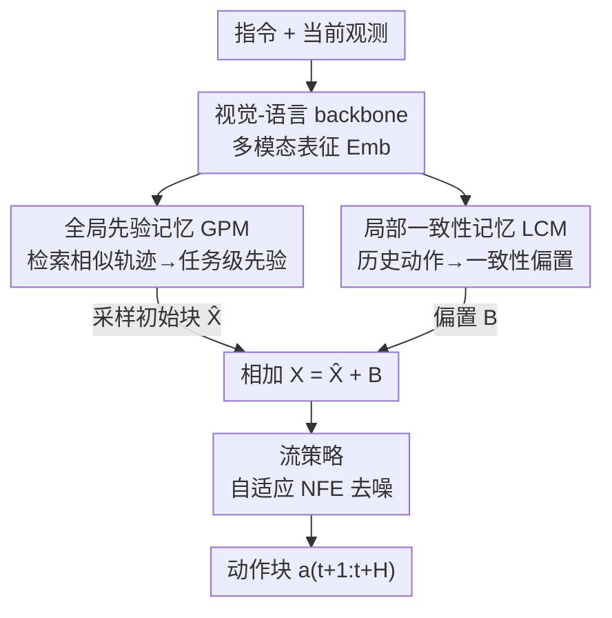

# Global Prior Meets Local Consistency: Dual-Memory Augmented Vision-Language-Action Model for Efficient Robotic Manipulation

**会议**: CVPR 2026  
**arXiv**: [2602.20200](https://arxiv.org/abs/2602.20200)  
**代码**: https://cybertronagent.github.io/OptimusVLA.github.io/ (项目主页)  
**领域**: 机器人 / 具身智能 / VLA  
**关键词**: 视觉-语言-动作模型, 流匹配, 检索式先验, 时序一致性, 记忆机制

## 一句话总结
OptimusVLA 给分层 VLA 的动作生成器配了两块记忆——全局先验记忆（GPM）用检索到的相似轨迹替换高斯噪声起点、缩短流匹配生成路径，局部一致性记忆（LCM）用轻量结构建模历史动作、注入时序一致性约束——在三个仿真平台和真机上同时拿到更高成功率（LIBERO 98.6%）和 2.9× 的推理加速。

## 研究背景与动机

**领域现状**：分层（hierarchical）VLA 已成为机器人操作的主流范式——上面一个视觉-语言 backbone 负责感知与理解，下面一个生成式策略（多用扩散 / 流匹配）负责高频动作生成。这种分工比纯自回归的 token 解码快得多，$\pi_0$、$\pi_{0.5}$、MemoryVLA 等都是代表。

**现有痛点**：作者指出瓶颈已经从感知转移到了**动作生成**这一步，且集中在两个问题上。其一是**推理慢**：流匹配把各向同性高斯噪声 $\mathcal{P}_0=\mathcal{N}(0,I)$ 一路搬运到结构化的动作分布 $\mathcal{P}_1$，两个分布差距太大，需要很多步去噪（NFE，number of function evaluations）才能到达高质量动作，而且随机起点经常落在运动学上不可行的区域，采出废样本。其二是**鲁棒性差**：现有策略只看当前观测、遵循马尔可夫假设，无法区分视觉上相似但任务阶段不同的状态（比如"抽屉还没打开"和"抽屉刚被关上"长得一样），也缺乏与已执行轨迹的时序一致性，导致控制抖动。

**核心矛盾**：两个朴素补救都有副作用。直接拿某条 action-prior 当起点会把学到的映射坍缩成"只能生成那一条相似轨迹"、丧失多样性；而把长历史观测拼进输入来补时序信息，又会大幅增加延迟与显存，还和 VLA 单帧预训练分布错位。即"既要缩短生成路径又不能损失泛化"、"既要时序感知又不能拖慢控制"。

**本文目标**：在不改 VLA 预训练范式、不引入重计算的前提下，同时解决动作生成的效率与鲁棒性问题。

**切入角度**：作者的关键观察是——机器人里**相似任务共享相似的动作分布**（pick_a_cup 和 pick_a_plate 动作很像），所以"好的生成起点"不该是固定的噪声设计，而该是一个**检索问题**；同时时序一致性不需要重新跑 VLM，只要对最近几段动作做轻量建模就够。

**核心 idea**：给动作生成器挂两块记忆——全局先验记忆把生成起点从 $\mathcal{N}(0,I)$ 搬到"相似任务的邻域"，局部一致性记忆把历史动作转成一个加到输入上的一致性偏置，用记忆驱动的先验初始化 + 时序约束换来又快又稳的动作生成。

## 方法详解

### 整体框架
OptimusVLA 在标准分层 VLA（视觉-语言 backbone + 流策略 flow policy）之上，并联挂上 GPM 和 LCM 两块记忆。给定语言指令 $\ell$ 和当前观测 $O_t$（含本体状态 $q_t$ 与多视角图像），VLM backbone 先编码出多模态表征 $E_{emb}$。这个表征兵分两路：一路投影成检索 token $z_{re}$ 去查 GPM 的记忆库，得到任务级先验分布 $\mathcal{P}_{re}$ 并采样出初始动作块 $\hat{\mathbf{X}}_t$；另一路把上一段执行过的动作块 $\mathbf{A}_{t-1}$ 交给 LCM，算出一致性偏置 $\mathbf{B}_t$。两者相加 $\mathbf{X}_t=\hat{\mathbf{X}}_t+\mathbf{B}_t$ 构成流策略的真正输入，最后流策略 $p_\theta$ 在**自适应 NFE** $N$ 下把 $\mathbf{X}_t$ 去噪成未来 $H$ 步的动作块 $a_{t+1:t+H}$。一句话：GPM 管"从哪儿开始生成"，LCM 管"生成要和历史连贯"，两者共同决定流策略的起点。

### 关键设计

**1. 全局先验记忆 GPM：把生成起点从高斯噪声换成检索来的任务级先验**

这一块直击"推理慢、采样易落入不可行区"的痛点。GPM 把先验初始化重构成一个**记忆检索**问题，由三个组件串成：(a) **Prior Head**——一个轻量 MLP 把多模态表征 $E_{emb}$ 投影成检索 token $z_{re}=\mathrm{PriorHead}(E_{emb})$；(b) **Memory Bank**——存了 $M$ 对 $\{z_m,J_m\}$（任务嵌入 + 对应完整轨迹），用余弦相似度检索出 $k$ 条最近邻轨迹 $\{J_i,s_i\}$，归一化出全局相似度 $\bar{s}=\sum_i\alpha_i s_i$（$\alpha_i=\mathrm{softmax}(s_i/\tau_s)$），再对每条轨迹按滑动窗抽出动作块 $C_i$，加权拼成任务级先验高斯分布 $\mathcal{P}_{re}=\mathcal{N}(\mu,\mathrm{diag}(\mathrm{Var}))$，其中 $\mu=\sum_i\alpha_i C_i$、$\mathrm{Var}=\sum_i\alpha_i(C_i-\mu)^{\odot 2}$；(c) **Prior-Aware Sampler**——用相似度自适应地决定噪声尺度与去噪步数：

$$\lambda=\lambda_{\max}-\tfrac{\bar{s}+1}{2}(\lambda_{\max}-\lambda_{\min}),\quad N=N_{\min}+\big(1-\tfrac{\bar{s}+1}{2}\big)(N_{\max}-N_{\min})$$

最终初始化 $\hat{\mathbf{X}}_t=\mu+\lambda(\epsilon\odot\sqrt{\mathrm{Var}})$。直觉上，检索越像（$\bar{s}$ 越大）就越信任先验：注入更小的噪声 $\lambda$、用更少的步数 $N$；检索不像就保留更多探索性。这样既把生成起点拉到目标流形附近、把 NFE 从 $\pi_{0.5}$ 的 10.0 砍到 3.2，又因为是高斯混合先验（而非某条确定轨迹）保住了多样性、避免坍缩到"只会复制最近邻"

**2. 局部一致性记忆 LCM：用轻量结构建模历史动作、注入时序一致性约束**

这一块针对"只看当前观测、阶段不可辨、控制抖动"的痛点，关键是**不重新跑 VLM** 就拿到时序感知。LCM 是一块工作记忆，由两个轻量结构组成：**Consistency Layer** 对上一段动作块 $\mathbf{A}_{t-1}=[\mathbf{a}_{t-H+1},\dots,\mathbf{a}_t]$ 做自注意力，捕捉块内动作之间的依赖与约束，得到中间表征 $\hat{\mathbf{B}}_{t-1}$；**Dynamic Awareness Module** 用一个 Mamba 结构（线性复杂度建模长程依赖）建模**块间**时序动态，把 $\hat{\mathbf{B}}_{t-1}$ 更新成下一步的一致性偏置 $\mathbf{B}_t$。这个偏置直接加到流策略输入上（$\mathbf{X}_t=\hat{\mathbf{X}}_t+\mathbf{B}_t$），相当于把"动作流里的一致性"转成一个加性约束。和那些"拼长观测序列"或"每步重跑 VLM 更新记忆"的工作相比，LCM 只处理动作序列、计算开销可忽略，却给了策略明确的进度感知和轨迹平滑性——这也是它在双臂任务（需要双臂协调一致）上特别有用的原因

### 损失函数 / 训练策略
训练分三阶段：① 先按 $\pi_{0.5}$ 的架构与协议预训练一个分层 VLA；② 训 Prior Head，用 InfoNCE 学任务判别性表征 $\mathcal{L}_{\mathrm{GPM}}=-\mathbb{E}_q[\log\frac{\exp(\mathrm{sim}(z_{re},z^+)/\tau_c)}{\sum_{j}\exp(\mathrm{sim}(z_{re},z_j)/\tau_c)}]$（同 batch 内负样本）；③ 冻结 GPM、训 LCM，让它预测"全局先验均值 $\mu_t$ 到真值动作块 $\mathbf{A}_t^\star$ 之间的残差"，目标 $\mathbf{B}_t^\star=\mathbf{A}_t^\star-\mu_t$，用 MSE $\mathcal{L}_{\mathrm{LCM}}=\mathbb{E}[\|\mathbf{B}_t-\mathbf{B}_t^\star\|_2^2]$。模型从 $\pi_{0.5}$ 权重初始化、加上 GPM/LCM 后共 3.6B 参数，8×A800、global batch 512、训 30,000 步、学习率 5e-5。

## 实验关键数据

### 主实验

LIBERO（500 rollouts，各 suite 平均成功率，%）：

| 方法 | Spatial | Object | Goal | Long | Avg. |
|------|---------|--------|------|------|------|
| OpenVLA-OFT | 97.6 | 98.4 | 97.9 | 94.5 | 97.1 |
| MemoryVLA | 98.4 | 98.4 | 96.4 | 93.4 | 96.7 |
| $\pi_{0.5}$ | 98.8 | 98.2 | 98.0 | 92.4 | 96.9 |
| **OptimusVLA** | **99.6** | **99.8** | **98.4** | **96.4** | **98.6** |

CALVIN（ABC→D，5 任务平均链长 Avg. Len 越高越好）：OptimusVLA 4.45，$\pi_{0.5}^\dagger$ 4.26，$\pi_0$ 3.92（论文称比 $\pi_0$ 提升 13.5%）。RoboTwin 2.0 Hard（100 rollouts）平均成功率 38%（排名第 1），其中 Stack Bowls Two 达 58%，比 RDT 高 +28%。

真机（GALAXEA R1 Lite，14-DoF 双臂）：Generalization 任务平均成功率 85.0%、Long-horizon 任务 64.0%，分别比 $\pi_0$ 高 42.9% 和 52.4%，同时推理 2.9× 加速。效率上 LIBERO 推理时间快 6.5×、NFE 少 3.1×（OptimusVLA NFE 3.2 vs $\pi_{0.5}$ 10.0）。

### 消融实验

GPM / LCM 各自贡献（Table 4，括号为相对完整模型的下降）：

| GPM | LCM | LIBERO-Long | CALVIN (Len) | 真机 Generalization |
|-----|-----|-------------|--------------|---------------------|
| ✓ | ✓ | 96.4 | 4.45 | 85.0 |
| ✗ | ✓ | 93.2 (↓3.3%) | 4.28 (↓3.8%) | 77.0 (↓9.4%) |
| ✓ | ✗ | 94.8 (↓1.7%) | 4.38 (↓1.6%) | 79.5 (↓6.5%) |
| ✗ | ✗ | 92.4 (↓4.1%) | 4.26 (↓4.3%) | 75.0 (↓11.8%) |

记忆库规模消融（Table 5，LIBERO-Long 成功率）：

| 配置 | 成功率 | 说明 |
|------|--------|------|
| Num=6500, k=8 | 96.4 | 完整设置，最佳 |
| Num=6500, k=16 | 94.8 | k 过大反而退化 |
| Num=6500, k=1 | 92.6 | 只检 1 条，过拟合单轨迹 |
| Num=1300, k=8 | 95.2 | 库小一点，仍稳健 |
| Num=130, k=8 | 93.6 | 库太小，先验不够丰富 |

### 关键发现
- **GPM 是泛化主力**：去掉 GPM 在真机 Generalization 掉 9.4%、CALVIN 掉 3.8%，因为没有先验后模型坍缩回标准流策略，被巨大的 prior-target gap 拖累跨场景泛化；它对长程任务（LIBERO-Long）也起稳定作用，靠检索先验把生成锚在目标流形附近抑制误差累积。
- **LCM 管平滑与阶段感知**：去掉 LCM 在 LIBERO-Long 掉 1.7%，在需要双臂协调的 Long-horizon / RoboTwin 上作用更明显（提供双臂一致性约束）。
- **记忆库要"够大且检索够多"**：每个任务只存一条轨迹会让先验太确定性而退化；$k$ 太小过拟合单条检索结果、$k$ 太大（16）也会退化，$k=8$ 能构成兼顾特异性与探索性的高斯混合先验。
- **训练也更快**：从同样 $\pi_{0.5}$ 权重出发，OptimusVLA 18,000 步就在 LIBERO-Goal 到 97.6%，$\pi_{0.5}$ 要 26,000 步——先验把"从噪声到动作"的变换难度降下来了。

## 亮点与洞察
- **把"噪声先验设计"重构成"记忆检索"**：这是最巧的一步——不再纠结怎么设计一个好的固定噪声分布，而是承认"相似任务动作相似"，直接检索 + 高斯混合拼出先验，既缩短生成路径又靠混合保住多样性，避免了朴素 action-prior 的坍缩。
- **相似度自适应噪声与步数**：$\lambda$ 和 $N$ 都随检索相似度 $\bar{s}$ 联动——越确定越省步、越不确定越多探索，把"效率"和"鲁棒"用一个标量优雅地权衡，而不是写死超参。
- **时序信息只从动作序列拿、不碰 VLM**：LCM 用自注意力 + Mamba 处理动作块，绕开了"重跑 VLM 更新记忆"的吞吐瓶颈，这个"用轻量侧路补时序"的思路可迁移到任何 frozen-backbone + 轻量 policy 的系统。
- **LCM 学的是"先验均值到真值的残差"**：训练目标设计得很聪明——既然 GPM 已经给了 $\mu_t$，LCM 只需补上时序相关的修正量，分工清晰、各管一摊。

## 局限与展望
- **依赖记忆库的覆盖度**：GPM 的效果建立在"训练轨迹里有语义相似的任务"上；对完全陌生、动作分布无相近样本的新任务，检索先验可能帮不上忙甚至误导，论文未深入这种 worst-case。
- **记忆库规模 / 检索成本随任务增长**：当前库 6500 条已足够，但任务体量上去后 Memory Bank 的存储与最近邻检索开销如何 scale、是否需要近似检索，文中未讨论。
- **超参偏多**：$\lambda_{\min/\max}$、$N_{\min/\max}$、温度 $\tau_s,\tau_c$、$k$ 等都需调，跨平台学习率统一为 5e-5 但其余敏感性只给了 $k$ / 库大小一项消融。
- **三阶段训练较繁琐**：预训练 → 训 Prior Head → 冻结 GPM 训 LCM，三段式流程对复现和迁移到别的 backbone 有一定门槛。

## 相关工作与启发
- **vs $\pi_0$ / $\pi_{0.5}$（标准流匹配 VLA）**：它们从各向同性高斯噪声出发、固定 NFE，OptimusVLA 在同一架构（甚至同初始权重）上换成检索先验 + 自适应 NFE，效率与泛化同时提升——是对流匹配"起点"的改造，而非换生成范式。
- **vs MemoryVLA / 工作记忆类方法**：这类方法靠 VLM backbone 每步表征当前多模态信息，每次记忆更新都要一次完整 VLM 前向，成为快控制环的吞吐瓶颈；LCM 只对动作序列做轻量建模，拿到时序一致性而不反复调 VLM。
- **vs 拼接长历史观测的方法**：直接 concat 长观测序列虽有效但增加延迟/显存、且和 VLA 单帧预训练分布错位；OptimusVLA 用动作侧的局部记忆规避了这两个问题。

## 评分
- 新颖性: ⭐⭐⭐⭐ "先验初始化=记忆检索"的重构很漂亮，双记忆并联 + 相似度自适应噪声是有辨识度的组合创新。
- 实验充分度: ⭐⭐⭐⭐⭐ 三个仿真平台 + 真机双臂，主表/双模块消融/记忆库消融/训练与推理效率分析都齐，数据自洽。
- 写作质量: ⭐⭐⭐⭐ 动机—方法—实验逻辑清晰、公式完整；个别拼写笔误（proceess、dynamicaly 等）和 LBM/LCM 命名混用稍影响阅读。
- 价值: ⭐⭐⭐⭐⭐ 在不动预训练范式的前提下同时拿到精度与 2.9× 加速，对真机部署很实用，记忆检索先验的思路可复用。

<!-- RELATED:START -->

## 相关论文

- [\[ICML 2026\] Dual-Stream Diffusion for World-Model Augmented Vision-Language-Action Model](../../ICML2026/robotics/dual-stream_diffusion_for_world-model_augmented_vision-language-action_model.md)
- [\[CVPR 2026\] Boosting Vision-Language-Action Finetuning with Feasible Action Neighborhood Prior](boosting_vision-language-action_finetuning_with_feasible_action_neighborhood_pri.md)
- [\[CVPR 2026\] Mantis: A Versatile Vision-Language-Action Model with Disentangled Visual Foresight](mantis_a_versatile_vision-language-action_model_with_disentangled_visual_foresig.md)
- [\[ICLR 2026\] MemoryVLA: Perceptual-Cognitive Memory in Vision-Language-Action Models for Robotic Manipulation](../../ICLR2026/robotics/memoryvla_perceptual-cognitive_memory_in_vision-language-action_models_for_robot.md)
- [\[CVPR 2026\] GeniNav: Generative Model Driven Image-Goal Navigation via Imagination-Guided Consistency Flow Matching](geninav_generative_model_driven_image-goal_navigation_via_imagination-guided_con.md)

<!-- RELATED:END -->
