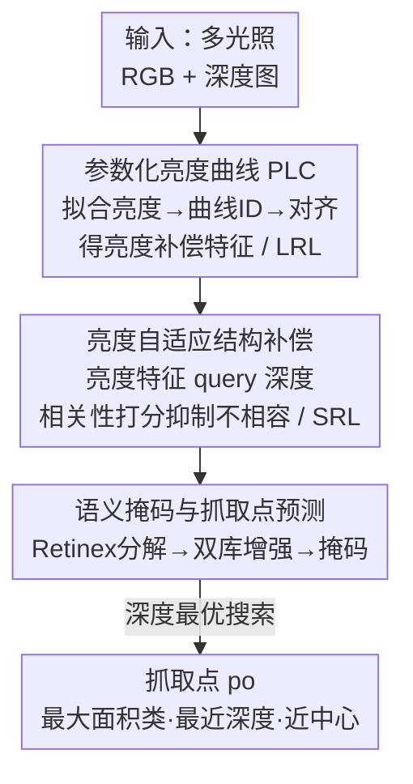

# GraspALL: Adaptive Structural Compensation from Illumination Variation for Robotic Garment Grasping in Any Low-Light Conditions

**会议**: CVPR 2026  
**论文**: [CVF Open Access](https://openaccess.thecvf.com/content/CVPR2026/html/Zhong_GraspALL_Adaptive_Structural_Compensation_from_Illumination_Variation_for_Robotic_Garment_CVPR_2026_paper.html)  
**代码**: https://github.com/Zhonghaifeng6/GraspALL （有）  
**领域**: 机器人 / 具身智能  
**关键词**: 衣物抓取, 光照自适应, 多模态融合, RGB-D, 服务机器人  

## 一句话总结
GraspALL 把连续变化的光照编码成一组可学习的"亮度曲线"，用估计出的光照等级去**动态调控** RGB 与深度（非 RGB）特征的融合权重，从而在任意低光条件下生成光照一致的衣物抓取表征，在自建的多光照衣物抓取数据集上把抓取成功率相对基线提升了 32–44%。

## 研究背景与动机

**领域现状**：服务机器人在清洁、协助穿衣等家庭任务里需要抓取衣物，已有方法（基于目标检测 / 关系检测 / 学习策略）在正常光照下已经能拿到很高的抓取精度。为了应对光照退化，主流做法是引入深度图等非 RGB 模态——因为深度图具有"光照不变"的结构特性，可以在 RGB 退化时补充结构信息。

**现有痛点**：家庭场景的光照是动态变化的（照顾病人、老人、婴儿时机器人常常要在暗光甚至无光环境下作业）。低光会严重破坏衣物的纹理、褶皱、边缘细节。但现有的多模态融合方法把非 RGB 当作**静态补充**——不管光照多亮多暗，都以固定方式注入深度结构特征。

**核心矛盾**：论文用 Canny 算子做了一个关键观察（Fig. 2）——同一件衣物在不同亮度下，从图像里提取出的结构图本身就**不一致**，光照会扭曲衣物的几何。当 RGB 在低光下被抑制时，更强的非 RGB 结构信号会"盖过"RGB，使模型过度依赖深度线索、忽略掉微弱但关键的 RGB 亮度信息，反而降低了对光照变化的鲁棒性。也就是说：**模型对非 RGB 结构特征的依赖程度，本应随光照而变，而旧方法把它写死了**。

**本文目标**：让模型先感知输入的光照等级，再据此从非 RGB 模态里抽取**与当前光照匹配**的结构补偿。这拆成两个子问题：(1) 如何准确估计输入光照等级、给跨模态融合一个量化的指引；(2) 在光照估计基础上，如何诱导非 RGB 生成自适应于光照变化的结构补偿。

**核心 idea**：用一组可学习的**参数化亮度曲线**把"任意连续光照"编码成可检索的量化参考，再用这个参考去**条件化地**驱动深度图生成结构补偿，并按光照相容性抑制不匹配的特征——把"非 RGB 静态补充"换成"光照自适应的动态补偿"。

## 方法详解

### 整体框架

GraspALL 是一个建立在"亮度—结构交互补偿"上的抓取点识别模型，由三个核心部件支撑：**参数化亮度曲线（PLC）**、**亮度响应库（LRL）** 和 **结构响应库（SRL）**。整条流水线分三段（对应原文 Fig. 3 的 A/B/C）：

1. **亮度特征建模（A）**：用 PLC 把输入图像的亮度模式拟合成一条曲线，匹配出曲线 ID，并以最亮图像为锚把其他光照下的亮度特征对齐，得到"亮度补偿特征"，按 ID 用 EMA 写入亮度响应库 LRL；
2. **结构特征建模（B）**：用上一步检索到的亮度特征去 query 深度图特征，算相关性分数，抑制与当前光照不相容的深度结构，得到"光照自适应结构补偿特征"，用 Canny 图约束、按 ID 写入结构响应库 SRL；
3. **语义掩码与抓取点预测（C）**：对输入做 Retinex 分解，分别用 LRL / SRL 增强亮度与结构特征，解码出语义掩码；再在主导衣物类别上用"深度最优搜索"策略选出稳定的抓取点。

### 关键设计

**1. 参数化亮度曲线（PLC）：把"任意光照"变成一组可学习、可检索的量化参考**

针对"如何准确估计光照等级"这个子问题。传统亮度估计依赖直方图，但直方图不可学习，难以适配多样的光照变化。PLC 改用一组可学习参数来统一表征不同光照下的代表性亮度模式：先定义一个亮度曲线库 $C=\{C_1,\dots,C_N\}$（$N=12$），每条曲线 $C_n$ 由 $R=256$ 个离散采样点、用可学习原始参数 $P_n=\{P_{n,1},\dots,P_{n,R}\}$ 参数化。给定一组不同光照下的图像 $\{I_1,\dots,I_N\}$，以直方图统计选出最亮的 $I_{max}$ 作参考；对其余图像用 $R$ 区间直方图算出代表性亮度值集合 $H_R$，再找与 $H_R$ 匹配点最多的曲线作为该图的曲线 ID：

$$ID_n = \arg\min \||H_i - C(P_{n,i})\||,\quad i\in R,\ n\in N.$$

接着以最亮图 $I_{max}$ 为亮度锚，通过共享的编码器—解码器把其他图像 $I_n$ 的亮度特征对齐到 $I_{max}$：$I_n^{max}=D(E(I_n))$，并用谱一致性损失 $L_{sc}$ 监督 $I_{max}-I_n^{max}$ 的 L1 距离。对齐过程中得到的编码特征 $F_{en}^n=E(I_n)$ 就是"亮度补偿特征"——它既增强衣物可分性，又隐式反映了光照造成的结构缺陷。这些特征按曲线 ID 用 EMA（动量 $\alpha=0.05$）写入**亮度响应库 LRL** $M_L$：$M_L=(1-\alpha)M_L^n+\alpha\cdot F_{en}^n$。$L_{sc}$ 通过链式反传一路把梯度传回曲线参数 $P_n$，让曲线库自己调参、做到更准的亮度索引。这一招的本质区别在于：旧方法的光照解释不可学习，PLC 让"光照解释"本身变成可优化、可泛化到未见光照的统一表征（4.6 节用 Grad-CAM 验证了对未见光照的稳定注意力）。

**2. 亮度自适应结构补偿：用光照特征去"挑"深度图里当下该用的结构**

针对"如何让非 RGB 生成自适应结构补偿"这个子问题。深度图在极暗下结构稳定但缺乏判别性外观细节——高度可形变的衣物会产生相似几何，只靠深度会类别混淆；而退化的 RGB 仍保留互补的语义线索。关键是要**条件化地、随光照动态地**抽取深度特征，而不是静态注入。具体做法：对图像 $I_n$ 先用式(1)匹配曲线 ID、从 LRL 取出对应亮度特征 $M_L^n$；编码深度图 $F_{en}^{de}=E(I_{dep})$；用线性层把 $M_L^n$ 投成 query $Q_{lu}$、把 $F_{en}^{de}$ 投成 $K_{de},V_{de}$，用亮度去 query 深度结构得到相关性分数：

$$Score=\mathrm{Softmax}(Q_{lu}\cdot K_{de}),\quad F_{en}^s=\mathrm{Reshape}(Score\times V_{de}).$$

这个分数刻画了亮度特征对深度特征里"有效 / 无效信息"的不同关注度——本质是**按当前光照抑制掉不相容的深度结构、保留相容的**，这正好对症"低光下强结构信号盖过 RGB"的痛点。为约束结构建模不跑偏，引入 Canny 约束：对最亮图 $I_{max}$ 用 Canny 提取参考结构图 $S_{can}$，把 $F_{en}^s$ 解码成结构图 $S_{can}^{dep}=D(F_{en}^s)$，用二值交叉熵 $L_{bce}(S_{can}^{dep},S_{can})$ 监督。得到的结构补偿特征同样按曲线 ID 用 EMA 写入**结构响应库 SRL** $M_S$，供后续抓取点预测调用。两个响应库其实充当了"中介"，把有用特征从复杂多模态融合里解耦出来——这也是它推理更快、参数更小的原因（推理时只需 PLC 估光照等级、再从两库直接检索匹配特征，不必反复做跨模态融合）。

**3. 语义掩码 + 深度最优搜索抓取点：先认类别、再在主导衣物上找稳定褶皱点**

针对"多类别衣物抓取"与"几何中心未必可抓"两个实际问题。已有方法多靠点云建模抓取点、忽略语义类别，难以应对多类别。GraspALL 先做抓取点的语义化：对输入做 Retinex 分解 $I_L,I_S=N_{Retinex}(I_n)$，分别编码出亮度特征 $F_L$、结构特征 $F_S$；再分别用 $F_L$ 去 query LRL 的 $M_L$、用 $F_S$ 去 query SRL 的 $M_S$（与式(5)同款打分机制），得到增强后的 $F_L^{en},F_S^{en}$，拼接后 MLP + 解码出语义掩码 $M_m$，用交叉熵 $L_{ce}$ 监督。

拿到掩码后做"深度最优搜索"（Fig. 4）：先选**面积最大**的类别 $\Omega_{c^*}=\arg\max_{c\in C}|\Omega_c|$ 保证抓在主导衣物上；在该区域内取深度值最小（离相机最近）的 $k$ 个像素 $p_1,\dots,p_k=\mathrm{Depth_{top}}(\Omega_{c^*})$，作为最易接触的表面点（往往是褶皱 / 凸起）；最后用最小外接矩形拟合几何中心 $p_{center}$，在候选点里选离中心最近的作为最优抓取点 $p_o=\arg\min_{p\in p_k}\||p-p_{center}\||_2$。这样既避免了纯几何中心抓取常因衣物可形变而落在不可抓处、导致拖拽不稳，又保证抓点落在结构稳定的褶皱区。抓完一件后迭代重复抓剩余衣物。

### 损失函数 / 训练策略
三个监督信号各司其职：谱一致性损失 $L_{sc}$ 约束 PLC 的曲线学习（提供索引一致性约束）；二值交叉熵 $L_{bce}$ 监督 RGB-D 融合出的结构图（提供结构监督）；交叉熵 $L_{ce}$ 监督语义掩码生成。两个响应库均以 EMA（$\alpha=0.05$）增量更新。训练用单张 NVIDIA 4090。

## 实验关键数据

数据集为自建的 **MIGG（Multi-Illumination Garment Grasping）**，用 NVIDIA Isaac Sim 生成：两类家庭场景（客厅沙发 / 卧室床）、八类衣物资产、物理可控的光照（强度 / 方向 / 色温），输出同步的 RGB + 深度 + 语义掩码三元组（512×512），共 15384 组，13008 训练 / 2376 测试。评测用 mIoU（语义掩码精度）与 mGSR（平均抓取成功率，每方法每光照等级测 15 次）。

### 主实验：抓取成功率（mGSR，越低光差距越大）

| 光照区间 | BiFCNet | SAM-M | ReKep | DarkSeg | GraspALL | 相对次优 |
|---------|---------|-------|-------|---------|----------|---------|
| 80–120（中等） | 61.6% | 59.2% | 63.4% | 78.3% | **93.3%** | +32% |
| 40–80 | 52.4% | 51.6% | 52.4% | 63.3% | **88.3%** | +36% |
| 0–40（极低光） | 39.9% | 43.3% | 42.4% | 53.3% | **84.2%** | +44% |

语义掩码精度（mIoU）上，GraspALL 在 90–120 / 60–90 / 30–60 / 0–30 四档分别达 84.8% / 84.3% / 83.4% / 82.8%，从亮到暗**波动小于 2%**；而对照的 MRFS 从亮到暗 mIoU 掉了约 12%。极低光档相对次优基线 +14%~+20%。

### 消融实验（Lum: 0–40）

| 配置 | mIoU | mGSR | 说明 |
|------|------|------|------|
| Model-1 去 PLC | 65.4% | 50.0% | 掉点最猛——没有可解释光照估计，RGB/深度融合失去显式指引 |
| Model-2 去 LRL | 71.3% | 72.5% | 亮度响应库缺失，亮度—结构互补受损 |
| Model-3 去 SRL | 68.5% | 57.5% | 结构响应库缺失，结构判别力下降 |
| Model-4 去 $L_{sc}$ | 64.9% | 50.2% | PLC 学习失去约束信号 |
| Model-5 去 $L_{bce}$ | 68.7% | 70.4% | RGB-D 融合失去监督 |
| Model-6 完整 | **82.6%** | **88.3%** | 全部组件 |

### 关键发现
- **PLC 是地基**：去掉 PLC（Model-1）mGSR 从 88.3% 直接掉到 50.0%，是所有消融里最猛的——可解释的光照估计是整个自适应融合的前提，没有它后面两个响应库都无从按光照检索。
- **越暗越能拉开差距**：GraspALL 相对次优的提升从中等光的 +32% 一路扩大到极低光的 +44%，说明光照自适应补偿正是冲着"动态 / 极端光照"这个旧方法软肋去的。
- **又快又小**：用双响应库当中介解耦特征、推理时只检索不反复融合，GraspALL 在更高 mIoU 的同时 FPS 更高、参数更少（Fig. 7）。
- **泛化到未见光照**：用 Grad-CAM 对比，PLC 在不同亮度下保持稳定注意力、低光下甚至结构关注更强；换成不可学习的直方图均值则注意力发散（4.6 节）。
- **真机验证**：在 Realman 机器人 + RGB-D 传感器、1013 张真实多光照衣物图上，0–20 / 20–40 / 40–60 / 60–80 四档成功率为 12/15、13/15、13/15、14/15，全面优于基线。

## 亮点与洞察
- **把"光照"变成可检索的索引**：PLC 用一组可学习曲线 + 曲线 ID，把连续光照量化成离散可检索的参考，再用 EMA 响应库缓存"每种光照该用什么特征"。这个"曲线库 + 响应库"的检索式设计既提供了显式的融合指引，又顺手把多模态融合的重计算解耦掉，是很巧的一石二鸟。
- **诊断先于设计**：作者先用 Canny 图证明"同一衣物在不同光照下结构图本身不一致"（Fig. 2），把"非 RGB 静态补充"的失效讲透，再据此设计动态补偿——动机扎实，不是泛泛喊"多模态更好"。
- **可迁移**："用模态 A 的特征去 query 模态 B、按相关性分数抑制不相容信息"这套机制，可迁移到任何"某模态质量随外部条件波动、需要动态决定依赖另一模态多少"的场景（如雾天 / 雨天的多传感器融合）。
- **抓取点工程很务实**：深度最优搜索把"最大面积类 + 最近深度 + 最近几何中心"组合起来，直接对症衣物可形变导致几何中心不可抓的痛点。

## 局限与展望
- 作者承认 **MIGG 是仿真数据集**（Isaac Sim 生成），虽然刻意做成物理一致的受控基准，但真实材质 / 反射 / 多光源等因素未充分覆盖；真机数据集只有 1013 张，规模偏小。计划扩充真实数据、纳入更多家庭场景与衣物材质。
- PLC 主要建模"单一且重要的光照因子"对衣物外观的影响，多光源、反射、材质等复合效应留作未来工作——⚠️ 即在复杂真实光照下 PLC 的曲线表征能力可能受限。
- 曲线库规模 $N=12$、采样点 $R=256$、EMA 动量 $\alpha=0.05$ 等超参的选取分析放在补充材料里，正文未给敏感性曲线，复现时这些值的鲁棒性需注意。
- 方法强依赖深度图作为非 RGB 模态，若部署平台只有 RGB 或深度噪声大，结构补偿这条路径的收益会打折。

## 相关工作与启发
- **vs SegMiF / MRFS / AMDA（多模态融合做语义掩码）**：它们也用深度增强 RGB，但把非 RGB 当静态补充，光照变化下 mIoU 显著下滑（MRFS 从亮到暗掉约 12%）；GraspALL 用 PLC 显式估计光照、动态调控融合，波动 <2%。
- **vs DarkSeg（低光衣物抓取）**：DarkSeg 能处理部分低光，但面对动态多样的光照仍吃力；GraspALL 把"连续光照"统一编码、按等级检索补偿，0–40 档 mGSR 84.2% vs DarkSeg 53.3%。
- **vs SAM-M / ReKep（大模型驱动）**：即便用 SAM / 强提示，复杂低光场景下仍难处理——说明问题不在模型规模，而在缺乏对光照的显式自适应建模，这也是本文的核心论点。

## 评分
- 新颖性: ⭐⭐⭐⭐⭐ 首个系统分析光照变化对衣物抓取的影响，并用可学习亮度曲线 + 双响应库把"静态补充"变成"光照自适应补偿"，视角与机制都新。
- 实验充分度: ⭐⭐⭐⭐ 自建 MIGG 基准 + 4 类抓取基线 + 3 类掩码基线 + 消融 + Grad-CAM 泛化 + 真机验证，相当完整；扣分在数据集以仿真为主、真机规模偏小。
- 写作质量: ⭐⭐⭐⭐ 动机用 Canny 观察讲得透，公式与流程清晰；部分符号（如 $I_n^{max}$、链式梯度式）略密集。
- 价值: ⭐⭐⭐⭐ 直接服务于"全天候服务机器人"的真实刚需，方法与数据集都能被低光多模态抓取 / 分割工作复用。

<!-- RELATED:START -->

## 相关论文

- [\[CVPR 2026\] Obstruction Reasoning for Robotic Grasping](obstruction_reasoning_for_robotic_grasping.md)
- [\[CVPR 2026\] Structural Action Transformer for 3D Dexterous Manipulation](structural_action_transformer_for_3d_dexterous_manipulation.md)
- [\[ICML 2026\] Neural Low-Discrepancy Sequences](../../ICML2026/robotics/neural_low-discrepancy_sequences.md)
- [\[CVPR 2026\] GraspLDP: Towards Generalizable Grasping Policy via Latent Diffusion](graspldp_towards_generalizable_grasping_policy_via_latent_diffusion.md)
- [\[CVPR 2026\] GraspGen-X: Cross-Embodiment 6-DOF Diffusion-based Grasping](graspgen-x_cross-embodiment_6-dof_diffusion-based_grasping.md)

<!-- RELATED:END -->
