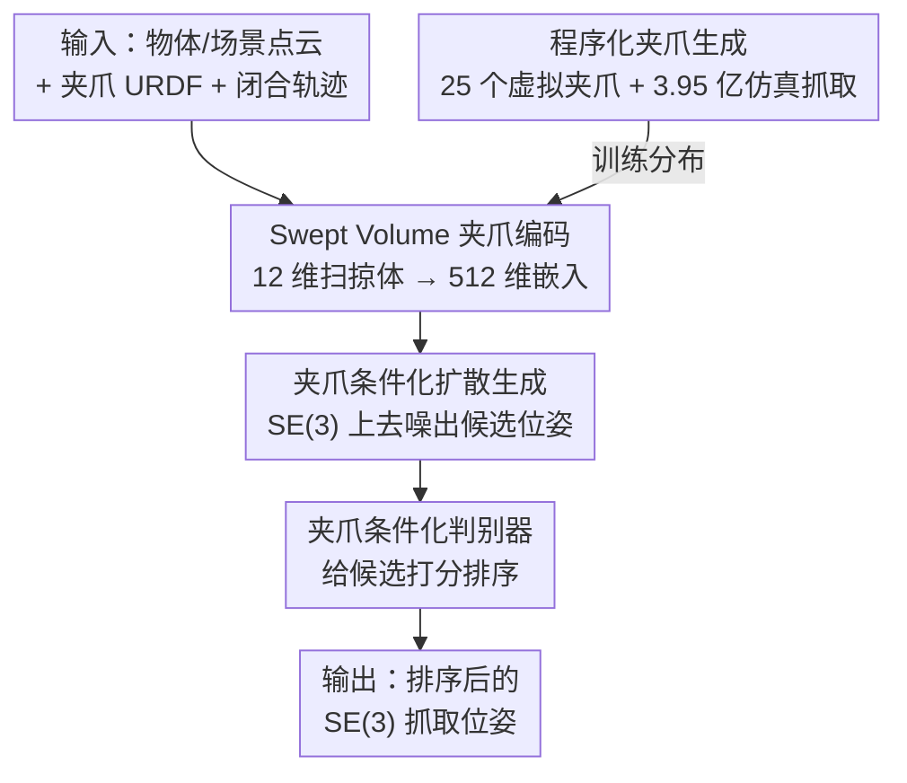

# GraspGen-X: Cross-Embodiment 6-DOF Diffusion-based Grasping

**会议**: CVPR 2026  
**论文**: [CVF Open Access](https://openaccess.thecvf.com/content/CVPR2026/html/Han_GraspGen-X_Cross-Embodiment_6-DOF_Diffusion-based_Grasping_CVPR_2026_paper.html)  
**代码**: https://graspgenx.github.io （项目页，宣布开源模型/代码/3.95 亿抓取数据集）  
**领域**: 机器人抓取 / 具身智能  
**关键词**: 6-DOF 抓取, 跨形态(cross-embodiment), 扩散模型, 夹爪表征(Swept Volume), 程序化生成  

## 一句话总结
GraspGen-X 把扩散式 6-DOF 抓取模型额外条件化在「夹爪表征」上——用一个 12 维的 Swept Volume（扫掠体）启发式描述夹爪闭合时手指扫过的空间，再用程序化生成的 25 个夹爪 + 3.95 亿次仿真抓取来训练，从而第一次实现了对**未见过的真实夹爪 + 未见过物体**的零样本 6-DOF 抓取，真机成功率 79%，显著超过抓取位姿重定向等基线。

## 研究背景与动机
**领域现状**：6-DOF 抓取（给定物体点云、预测能稳定夹起物体的 SE(3) 夹爪位姿）是机器人 pick-and-place 系统的核心模块。近年生成式模型让"抓取采样器"从启发式（对踵采样、像素级预测）进化到 VAE、flow-matching、扩散模型，配一个判别器给候选打分排序。GraspGen 就是当前 SOTA：扩散生成器 + 判别器，在准确率和覆盖率间平衡得很好。

**现有痛点**：在一套"通用抓-放系统"里，3D 感知、实例分割（SAM2）、运动规划这些模块换个机器人基本零样本可用——唯独抓取生成不行。所有现有 6-DOF 抓取模型都**只对一种夹爪训练**，一旦换夹爪就得重训。论文举例：GraspGen 训一个单形态模型要 8 卡跑一周生成数据+训练。于是抓取生成成了跨形态部署里"最不可迁移"的一环。

**核心矛盾**：业界常用的折中是**抓取位姿重定向（retargeting）**——把在 Franka 上训好的模型预测的位姿，沿抓取接近方向平移一个偏移量，硬套到新夹爪上。但这只补偿了指尖在 z 轴上的距离差，完全忽略了手指几何、闭合运动学、接触动力学的差异，性能上限低。

**本文目标**：训一个**显式条件化在夹爪上**的扩散抓取模型，让它零样本泛化到新夹爪 + 新物体，并且还能当作微调的好起点。

**切入角度**：作者假设——要让模型零样本认识一个没见过的夹爪，必须给它一个**显式、紧凑、能捕捉闭合过程**的夹爪参数化，而不是隐式编码或单纯的类型标签。同时真实夹爪太少、分布太偏，训练分布得靠**程序化生成**来填满夹爪空间。

**核心 idea**：用"手指闭合时扫过的体积（Swept Volume）"这个 12 维启发式表征夹爪，把它喂给扩散生成器和判别器；并用 Infinigen-Sim 程序化造出大量虚拟夹爪来覆盖测试分布。

## 方法详解

### 整体框架
GraspGen-X 建立在 GraspGen 之上：输入是物体/场景点云 + 夹爪的 URDF + 夹爪的闭合关节轨迹（从全开到全闭），输出是一批排序后的 SE(3) 抓取位姿。GraspGen 原本由两部分组成——一个在 SE(3) 空间上扩散、条件化于**物体嵌入**的生成器，和一个用 on-generator 正负样本训练、给候选打分的判别器。GraspGen-X 的改动只有一处但关键：**给生成器和判别器都额外注入一个夹爪嵌入**，这个嵌入来自 Swept Volume 启发式。

整条管线分两条线：**推理线**（点云 + 夹爪表征 → 生成器扩散出候选 → 判别器排序 → 输出）和**数据线**（程序化生成夹爪 → ACRONYM/Isaac-Sim 仿真打标 → 3.95 亿抓取训练集）。三个贡献节点——Swept Volume 编码、夹爪条件化的扩散生成+判别、程序化夹爪——分别解决"怎么表示夹爪""怎么用上夹爪""拿什么夹爪训"。

### 关键设计

**1. Swept Volume 夹爪编码：用"手指扫过的体积"紧凑刻画夹爪形态与闭合运动**

这是全文核心，针对"换夹爪就失效"的痛点。作者不去编码夹爪的完整网格或点云，而是用一个**轴对齐立方体**去近似手指在闭合过程中扫过的那块空间。每个 Swept Volume 由立方体的 3 维尺寸 $(x,y,z)$ 和立方体中心相对夹爪基座的 3 维平移 $t$ 组成，共 6 维。关键是作者取**两个时刻**——夹爪全开时和闭合到一半时——各算一个 6 维 Swept Volume，拼成 $12$ 维向量，再用一个 3 层 MLP 映射到 $512$ 维夹爪嵌入：

$$\mathbf{e}_{\text{gripper}} = \mathrm{MLP}\big(\,[\,\text{SV}_{\text{open}}\,;\,\text{SV}_{\text{half}}\,]\,\big),\quad [\text{SV}_{\text{open}};\text{SV}_{\text{half}}]\in\mathbb{R}^{12},\ \mathbf{e}_{\text{gripper}}\in\mathbb{R}^{512}$$

为什么有效：① 它**直接对齐抓取问题本身**——抓取成功与否取决于手指会扫到哪、夹到哪，Swept Volume 正好把这块"作用区域"显式画出来，比夹爪外形的细枝末节（螺丝、连杆）信息密度高得多。② 取全开 + 半开两个状态是有意为之：对像 Robotiq-2F140、XArm Hand 这类**旋转式 2 指夹爪**，手指闭合时会沿 z 轴往前伸，只看全开状态会丢掉这个闭合动力学信息，加上半开状态才补全。对全程平行的夹爪（Franka、Robotiq-2F85）则直接用覆盖两指之间的立方体；对会旋转的（Robotiq-3F）则近似手指后续扫过的空间。

**2. 夹爪条件化的扩散生成器 + 判别器：把夹爪嵌入注入 GraspGen 的两端，做成端到端跨形态模型**

针对"重定向只补 z 轴偏移、上限低"的痛点。GraspGen-X 不在单形态模型外面打补丁，而是把夹爪嵌入 $\mathbf{e}_{\text{gripper}}$ 和物体嵌入 $\mathbf{e}_{\text{object}}$（由 PointTransformer / PointNet++ 从点云编码）**一起作为条件**，喂给两个组件：扩散生成器在 SE(3) 空间上去噪、生成候选夹爪位姿；判别器用 on-generator 的正负样本训练、对每个候选打置信度并排序。这样同一个模型见到新夹爪只需算出它的 Swept Volume 嵌入，就能直接生成适配该夹爪几何与闭合方式的位姿，而不是把别的夹爪的位姿平移过来。论文的零样本实验直接证明了这条路更对：端到端学比"单形态模型 + 位姿矫正"更优，尤其在高自由度 3 指夹爪上相对提升近 40%。

**3. 程序化夹爪生成：用 Infinigen-Sim 造出覆盖测试分布的虚拟夹爪训练集**

针对"真实夹爪太少、分布太偏"的痛点。作者一共收集 20 个真实夹爪，均分成 10 训练 / 10 测试，发现仅用 10 个真实夹爪训练效果差——训练集和测试集在夹爪空间里几乎不重叠、还很稀疏。于是改用程序化生成：基于 Infinigen-Sim（用 Blender 的 geometry node 写数学规则、随机配置组合出铰接物体），为平行夹爪、旋转式 2 指、3 指高自由度三类各设计一个生成器类。它不建模螺丝连杆这种细节，只追求整体尺寸/形态的多样性和手指几何的真实度，并顺便输出 Swept Volume 等训练所需元数据。关键的一步是**用真实训练/测试夹爪去调随机范围**，让程序化夹爪的 Swept Volume 分布盖住真实分布：实验里 50 个程序化夹爪（Proc-Train50）与真实测试集（Real-Test10）的分布重叠明显高于 10 个真实训练夹爪，这正是它泛化更好的来源。

### 损失函数 / 训练策略
沿用 GraspGen + ACRONYM 的对踵采样与仿真打标流程。生成器训练用 175M 抓取（约 8.7K GPU 小时生成数据），8×A100 跑 780K 步、学习率 1e-5、约 80 小时；判别器用 50% 正 / 50% 负的 on-generator 样本，8×A100 跑 300K 步、学习率 1e-5、约 76 小时。最终在 25 个程序化夹爪（10 平行 + 10 旋转 2 指 + 5 三指）上训练，总计 3.5 亿采样抓取——作者称是迄今最大的多形态 6-DOF 抓取数据集。微调时学习率降到 1e-6 最高效。

## 实验关键数据

### 主实验：零样本泛化到新夹爪 + 新物体（仿真）
指标为 PR 曲线的 AUC，在 10 个新测试夹爪、新测试物体上平均。GraspGen-DTR 是直接迁移（Franka 模型硬套），RTG 是位姿重定向。

| 夹爪类别 | GraspGen-DTR | GraspGen-RTG | GraspGen-X (本文) |
|----------|--------------|--------------|-------------------|
| 平行 2 指 | 0.215 | 0.365 | **0.502** |
| 旋转 2 指 | 0.033 | 0.379 | **0.413** |
| 高自由度 3 指 | 0.136 | 0.503 | **0.699** |
| 全部 10 个 | 0.126 | 0.398 | **0.506** |

DTR 一遇到不同类别（如旋转 2 指）几乎完全失效；RTG 相对 DTR 提升 200%+，说明重定向确实是个有效启发式，但只考虑 z 轴指尖偏移、忽略手指几何与接触动力学；GraspGen-X 在所有类别都 SOTA，相对 RTG 再提升 25%，3 指夹爪上提升近 40%。模型甚至对训练完全没见过的 5 指夹爪也有一定泛化（Surge Hand 0.404、Inspire Hand 0.363）。

### 消融一：夹爪编码方式对比（453 测试物体 × 10 真实测试夹爪，mAUC）

| 编码方式 | mAUC | 说明 |
|----------|------|------|
| PointNet++ | 0.349 | 夹爪网格点云编码 |
| UniGrasp (cVAE) | 0.418 | PointNet-VAE 隐编码 |
| AdaGrasp (TSDF) | 0.432 | 体素 TSDF + 3D/2D CNN |
| **GraspGen-X (Swept Volume)** | **0.528** | 比次优 TSDF 高 25% |

Swept Volume 用最简单的 12 维向量却打过了 TSDF、cVAE、PointNet++ 这些重得多的表征，验证了"对齐抓取问题"的紧凑启发式更高效。

### 消融二：Swept Volume 参数化的拆解
- **GripperTypeOnly / RetargetOffsetOnly**：只给 3 维类型 one-hot 或 z 轴偏移量，信息过简，学不出可比模型。
- **FullyOpenOnly（只用全开 6 维）** 比"全开+半开 12 维"差，主因是旋转 2 指夹爪闭合时手指沿 z 轴前移，必须靠半开状态才能编码这段闭合过程。
- **w/GripperType（额外拼类型 one-hot）** 反而掉点：作者推测跨形态训练需要在不同类型夹爪间共享信息，硬加类型标签会割裂参数化空间。

### 关键发现
- **程序化夹爪 > 真实夹爪训练**：对所有夹爪编码方式（Swept Volume、TSDF、PointNet++）都有显著提升，根因是程序化夹爪对测试分布覆盖更好；且程序化夹爪越多越好（受算力限制本文只用了 25 个）。
- **更好的微调起点**：从 GraspGen-X 微调（GraspGen-X-SFT）比从 Franka 单形态模型微调或从头训都更快收敛（平移/旋转误差、召回率三条学习曲线全面更优）。
- **真机零样本**（工业 UR10 + Robotiq-2F140，模型零训练）：

| 方法 | 孤立物体 | 杂乱场景 | 总体成功率 |
|------|----------|----------|-----------|
| **GraspGen-X (本文)** | **85.7%** | **71.4%** | **79.0%** |
| GraspGen-RTG | 73.3% | 57.1% | 65.2% |
| AnyGrasp | 80.0% | 42.9% | 61.4% |

仅用仿真数据训练就泛化到真机新夹爪；在低成本 AgileX 平行夹爪上抓 YCB 芥末瓶、ArUco 方块达 100% 成功率（10 次试验均值）。杂乱货架场景下因运动规划更易因运动学不可行/碰撞被拒，所有方法都掉点，但 GraspGen-X 凭物体中心建模 + SAM2 仍优于场景中心的 AnyGrasp。

## 亮点与洞察
- **"扫掠体"这个表征本身就是 aha**：抓取的成败本质看手指会扫过/夹住哪块空间，Swept Volume 直接把这块作用区域用一个轴对齐立方体画出来——12 维向量打过 TSDF/cVAE，说明在抓取这个问题上"对的归纳偏置"远胜"更大的网络"。
- **全开+半开两个状态**这个细节很巧：它用极小代价（多 6 维）把"闭合运动学"塞进表征，专治旋转式夹爪手指前伸的问题，是把动力学信息编码进静态向量的聪明做法。
- **程序化生成填补分布**：与其追求真实夹爪的高保真，不如用程序化生成 + 真实分布对齐随机范围去"盖住测试集"，这个思路可迁移到任何"真实形态样本稀缺"的跨形态学习问题（机械臂、灵巧手、移动底盘）。
- **加类型 one-hot 反而掉点**：是个反直觉但有启发的结论——跨形态训练要的是跨类型共享信息，离散类型标签会切碎参数化空间，提醒"更多条件不一定更好"。

## 局限与展望
- 作者承认：受算力限制只训了 3.5K 物体、3.5 亿抓取、25 个程序化夹爪，相信进一步 scaling 还有提升空间。
- 目前覆盖平行 / 旋转 2 指 / 3 指高自由度三类，尚未训练 **5 指灵巧手**（虽然对未见 5 指夹爪有一定零样本能力，但分数明显偏低 ~0.36-0.40）。
- ⚠️ 摘要/正文对数据集规模口径略有出入（abstract 称 395M、conclusion 称 350M 训练抓取，并把 175M 生成器 + 5.2K GPU 小时判别器数据分开计），具体以原文与开源数据集为准。
- 自己看：Swept Volume 用轴对齐立方体近似，对手指形状非常不规则、或多指交叉闭合的复杂夹爪可能过于粗糙；杂乱场景成功率（71.4%）相比孤立物体仍有明显差距，瓶颈部分在运动规划而非抓取生成本身。

## 相关工作与启发
- **vs GraspGen**：本文是 GraspGen 的跨形态扩展——同样的扩散生成器 + 判别器架构，但两端都额外条件化夹爪嵌入；GraspGen 换夹爪要重训，GraspGen-X 零样本即用。
- **vs 抓取位姿重定向 (RTG)**：RTG 只沿接近方向平移补偿 z 轴指尖差、忽略几何与接触动力学，本文证明端到端学跨形态模型上限更高（相对 +25%，3 指 +40%）。
- **vs UniGrasp / D(R,O) / AdaGrasp / 接触图类方法**：这些大多只在少数真实夹爪上训、靠点云/TSDF/cVAE 编码夹爪或预测接触点 + IK，难泛化到新夹爪且常假设完整 3D 几何；本文用程序化合成夹爪 + Swept Volume 启发式，在部分点云下也能零样本泛化到未见真实夹爪。
- **vs VLA / RT-X 等跨形态通用模型**：VLA 用 readout token / masking 处理可变动作空间，但在全新硬件上零样本仍弱；本文主张抓取场景下**显式参数化具身**（Swept Volume）才是零样本的关键。

## 评分
- 新颖性: ⭐⭐⭐⭐⭐ 首个显式条件化夹爪、真正做到跨夹爪零样本的扩散式 6-DOF 抓取模型，Swept Volume 表征简洁有力。
- 实验充分度: ⭐⭐⭐⭐⭐ 仿真零样本 + 微调 + 编码消融 + 训练分布消融 + 双真机平台，证据链完整。
- 写作质量: ⭐⭐⭐⭐ 思路清晰、消融到位；数据集规模口径有小出入，部分细节压在附录。
- 价值: ⭐⭐⭐⭐⭐ 把抓取生成从"跨形态最不可迁移的一环"变成零样本可用，并承诺开源 3.95 亿抓取数据集，对整个抓取社区价值大。

<!-- RELATED:START -->

## 相关论文

- [\[CVPR 2026\] A Cross-view Fusion Framework for Robust 6-DoF Grasp Pose Estimation](a_cross-view_fusion_framework_for_robust_6-dof_grasp_pose_estimation.md)
- [\[CVPR 2026\] GraspLDP: Towards Generalizable Grasping Policy via Latent Diffusion](graspldp_towards_generalizable_grasping_policy_via_latent_diffusion.md)
- [\[CVPR 2026\] RoboWheel: A Data Engine from Real-World Human Demonstrations for Cross-Embodiment Robotic Learning](robowheel_a_data_engine_from_real-world_human_demonstrations_for_cross-embodimen.md)
- [\[CVPR 2026\] TraceGen: World Modeling in 3D Trace Space Enables Learning from Cross-Embodiment Videos](tracegen_world_modeling_in_3d_trace_space_enables_learning_from_cross-embodiment.md)
- [\[ECCV 2024\] Learning Cross-Hand Policies of High-DOF Reaching and Grasping](../../ECCV2024/robotics/learning_cross-hand_policies_of_high-dof_reaching_and_grasping.md)

<!-- RELATED:END -->
