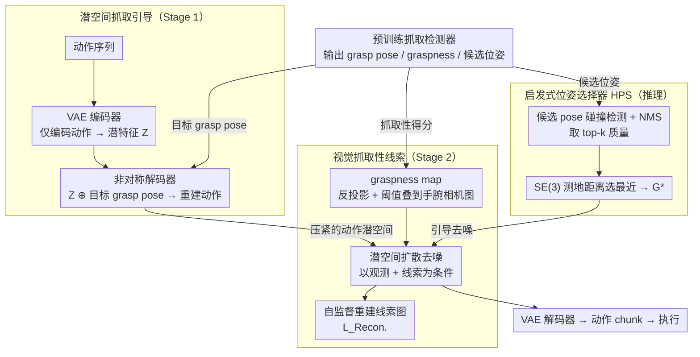

# GraspLDP: Towards Generalizable Grasping Policy via Latent Diffusion

**会议**: CVPR 2026  
**arXiv**: [2602.22862](https://arxiv.org/abs/2602.22862)  
**代码**: 有（Project Page）  
**领域**: 机器人  
**关键词**: 机器人抓取, 潜在扩散策略, 抓取先验, 模仿学习, 泛化

## 一句话总结
提出 GraspLDP，将预训练抓取检测器的 grasp pose 先验和 graspness map 视觉线索注入潜在扩散策略框架，通过 VAE 编码的动作潜空间引导和自监督重建目标，显著提升抓取精度和泛化能力。

## 研究背景与动机
在机器人操作流程中，抓取是实现物理交互的关键初始步骤。基于模仿学习的视觉运动策略（如 Diffusion Policy、ACT）在通用操作任务上展现了潜力，但在抓取子任务上往往不如专门的抓取检测方法，因为对整个抓取动作序列的建模本质上更复杂。

现有的将抓取先验整合到模仿学习中的方法（如 Robograsp、GPA-RAM）存在两个问题：(1) 仅将 grasp pose 作为条件输入拼接到策略模型中，导致 grasp pose 与输出动作序列的关联弱，难以提供有效指导；(2) 低语义的 grasp pose 与高维视觉输入之间存在模态不匹配，策略模型难以充分提取抓取空间分布信息。另一方面，数据驱动方法 GraspVLA 虽然性能强但需要 160 块 RTX 4090 训练 10 天生成 1B 帧模拟数据，成本极高。

核心 idea：借鉴图像生成中潜在扩散模型的成功经验，在动作潜空间中注入精确的目标 grasp pose 来引导动作生成，同时用 graspness map 作为视觉线索指导扩散过程，将静态的目标 grasp pose 和动态的动作序列桥接到共享潜空间。

## 方法详解

### 整体框架
GraspLDP 想解决的是：模仿学习策略在抓取这一步上总打不过专门的抓取检测器，因为它把整段抓取动作序列当成一个高维回归问题硬学，又没法把现成的抓取先验真正用起来。它的思路是把抓取先验拆成两条线注入策略——一条是精确的目标 grasp pose，注进**动作潜空间**直接约束动作生成；一条是 graspness map 这种几何视觉线索，注进**扩散去噪过程**引导末端朝可抓区域移动。

整体分两阶段训练。第一阶段（Action Latent Learning）先用一个 VAE 把动作序列压成紧凑潜特征，并在解码端把目标 grasp pose 拼进去重建动作，逼潜空间学会"动作如何被 pose 约束"。第二阶段（Diffusion on Latent Action Space）在这个潜空间上训练扩散策略去噪，把 graspness map 叠到手腕相机图像上作为视觉条件，再加一个对该线索的自监督重建目标，确保模型不会把线索当摆设忽略掉。推理时由一个启发式选择器从检测器给出的候选 pose 里挑一个最合适的来引导。三个核心设计——潜空间抓取引导、视觉抓取性线索、启发式位姿选择器——分别对应这两阶段训练与推理选择，预训练抓取检测器贯穿其间提供 grasp pose、graspness 与候选位姿三类先验。

### 关键设计

**1. 潜空间抓取引导（Grasp Guidance in Latent Space）：让 grasp pose 在解码端强约束动作，而不是当条件被稀释**

既有方法（Robograsp、GPA-RAM）把 grasp pose 拼成条件喂给策略，pose 和输出动作隔了一整个网络，关联很弱、引导力被稀释。GraspLDP 改在动作潜空间里动手：VAE 编码器只看动作 $\mathbf{Z} = \mathcal{E}(A)$，把动作压成低维潜特征；解码器才把目标 pose 拼进来重建 $\hat{A} = \mathcal{D}(\mathbf{Z} \oplus \mathcal{G})$，训练损失 $\mathcal{L}_{VAE} = \text{MSE}(A, \hat{A}) + \lambda \mathcal{L}_{KL}$。这种非对称设计很关键——编码器不接 pose，保证潜变量纯粹编码动作本身；pose 只在解码时调制，于是它对动作重建的约束是直接而强的。扩散策略随后在这个压紧的潜空间里去噪，而非在原始高维动作空间，引导更集中、推理也更快。消融里去掉这条引导（w/o Latent Guidance），物体/视觉泛化直接从 ~58/65 暴跌到 ~21/19，是全篇最致命的一刀。

**2. 视觉抓取性线索（Visual Graspness Cue）：把几何抓取性当成光照不变的视觉 prompt**

grasp pose 是低语义的几何量，和高维 RGB 输入存在模态鸿沟，策略很难自己从图像里"看出"哪里好抓。GraspLDP 借来预训练 graspness 网络给点云每个点打的抓取性得分，反投影回像素得到一张 graspness map，再叠到手腕相机图上：得分超阈值的像素 $M(j,k) > \tau$ 染成掩码色 $O_{cue}(j,k)$，其余保留原像素。光这样叠还不够，模型可能学着无视它，所以在每个反向扩散步同时重建这张线索图作为自监督目标 $\mathcal{L}_{Recon.} = \text{MSE}(O_{cue}, \hat{O}_{cue})$，与扩散损失合成 $\mathcal{L}_{LDP} = \mathcal{L}_{Diff.} + \lambda_{Recon.} \mathcal{L}_{Recon.}$。graspness 是几何驱动、对光照不变的可抓信号，所以它在视觉泛化（不同光照/外观）上收益最大——消融移除后 Visual Gen. 掉了 7.1 个点，是四个维度里跌得最多的。

**3. 启发式位姿选择器（Heuristic Pose Selector, HPS）：在抓取质量和运动学接近性之间权衡选 pose**

推理时检测器会吐出一堆候选 grasp pose，盲目选质量最高的可能离当前手太远、轨迹拐得很别扭，选最近的又可能抓不稳。HPS 先用碰撞检测加 NMS 过滤、留下 top-k 质量候选，再算当前末端位姿 $P$ 到每个候选 $\mathcal{G}_j$ 的 SE(3) 测地距离 $d_{\mathcal{G}_j, W} = \sqrt{\xi^\top W \xi}$（$\xi$ 为两位姿间的李代数差，$W$ 为加权矩阵），取距离最小者 $\mathcal{G}^* = \arg\min_j d(\mathcal{G}_j)$ 作引导。这等于同时压抓取可行性（top-k 质量过滤）和轨迹平滑性（测地最近），实验里它稳压 random / highest / nearest 三种单一策略，说明质量和接近性必须联合考虑。

### 损失函数 / 训练策略
两阶段分开训：Stage 1 训 VAE，目标是 $\text{MSE}$ 重建加 KL 正则；Stage 2 训潜在扩散策略，目标是扩散损失加 graspness 线索的自监督重建损失 $\mathcal{L}_{Recon.}$。训练数据约 12K 条高质量抓取演示（LIBERO benchmark ⚠️ 训练集与演示规模以原文为准），相比 GraspVLA 的 1B 帧模拟数据省了几个数量级。

## 实验关键数据

### 主实验

| 方法 | In Domain | Spatial Gen. | Object Gen. | Visual Gen. | 平均 |
|------|-----------|-------------|-------------|-------------|------|
| Diffusion Policy | 62.8 | 48.9 | 11.4 | 16.3 | 34.9 |
| GraspVLA | 50.8 | 49.5 | 46.8 | 51.7 | 49.7 |
| Ours Baseline (CG) | 72.3 | 59.1 | 48.3 | 47.7 | 56.9 |
| **GraspLDP** | **80.3** | **71.1** | **58.2** | **64.6** | **68.6** |

### 消融实验

| 配置 | ID SR | SG SR | OG SR | VG SR |
|------|-------|-------|-------|-------|
| GraspLDP (full) | 80.3 | 71.1 | 58.2 | 64.6 |
| w/o Graspness Cue | 77.4 (-2.9) | 67.3 (-3.8) | 54.2 (-4.0) | 57.5 (-7.1) |
| w/o Latent Guidance w/ CG | 73.5 (-6.8) | 62.2 (-8.9) | 52.3 (-5.9) | 54.5 (-10.1) |
| w/o Latent Guidance | 60.6 (-19.7) | 49.8 (-21.3) | 21.2 (-37.0) | 19.4 (-45.2) |
| w/o GC & LG | 55.1 (-25.2) | 46.2 (-24.9) | 16.0 (-42.2) | 15.7 (-48.9) |

### 关键发现
- GraspLDP 在域内抓取成功率比 Diffusion Policy 提升 17.5%，空间/物体/视觉泛化分别提升 22.2%、46.8%、48.3%
- Latent Guidance 是最关键组件，移除后 OG/VG 暴跌至 ~20%，说明潜空间 grasp pose 引导对泛化至关重要
- Graspness Cue 在 Visual Generalization 上的提升最大（-7.1%），因为几何抓取性线索对光照变化具有鲁棒性
- HPS 比 random/highest/nearest 选择策略更优，联合考虑质量和运动学接近性是必要的
- 推理延迟仅比 Diffusion Policy 多 ~15%，远快于 GraspVLA

## 亮点与洞察
- 将图像生成中的潜在扩散思想迁移到机器人动作生成，在潜空间中注入先验是比条件拼接更有效的引导方式
- graspness map 作为视觉 prompt 的设计简洁有效，自监督重建确保信息利用
- 真实世界实验中，GraspLDP 在杂乱场景的 Scene Completion Rate 达到 96.2%，接近开环方法 AnyGrasp 的 92.3%

## 局限与展望
- 依赖预训练的抓取检测网络（如 AnyGrasp），若检测器在新物体上失效则 pose 先验变差
- 目前仅针对抓取子任务，未扩展到完整的长序列操作
- VAE 训练和扩散训练分为两阶段，端到端联合训练可能更优

## 相关工作与启发
- Diffusion Policy 提出了扩散模型用于动作生成的范式，GraspLDP 将其扩展到潜空间并注入任务先验
- GraspVLA 是数据驱动路线（1B 帧），GraspLDP 走先验注入路线，在更少数据下更高效
- 潜空间引导的思路可推广到其他需要先验知识的操作任务（如装配、工具使用）
- PPI 用离散关键位姿引导连续动作生成，GraspLDP 进一步在潜空间中实现更精细的引导
- GSNet 的 graspness 概念被复用为视觉 prompt，展示了抓取检测与策略学习的协同潜力

## 补充细节
- 真实世界实验中杂乱场景抓取：GraspLDP 的 SCR 达到 96.2%，4 个场景平均 SR 80%
- 推理时 graspness 计算仅需 36ms，latent decode 不到 1ms，整体延迟可控制在 ~100ms
- VAE 使用非对称解码器，encoder 不接受 grasp pose，decoder 接受——信息流设计确保 latent 编码动作本身、decoder 注入 pose 调制
- GFE（Grasp Frame Error）指标创新地基于 SE(3) 测地距离评估策略跟随 grasp pose 引导的精度
- 训练数据仅 12K 演示，远少于 GraspVLA 的 1B 帧，但泛化性能全面超越

## 评分
- 新颖性: ⭐⭐⭐⭐ 潜空间 grasp pose 注入和 graspness 视觉线索的自监督重建有新意
- 实验充分度: ⭐⭐⭐⭐⭐ 仿真+真实世界、多维度泛化评估、详细消融、HPS 消融均完善
- 写作质量: ⭐⭐⭐⭐ 结构清晰，方法描述详细，实验设计合理
- 价值: ⭐⭐⭐⭐⭐ 解决了策略抓取泛化的实际问题，OG +46.8% 的提升对实际部署意义重大

## 关键术语
- **Graspness**: 点云中每个点的可抓取性得分，几何驱动的抓取可行性度量
- **Latent Diffusion Policy**: 在 VAE 编码的动作潜空间上进行扩散去噪
- **SE(3) Geodesic Distance**: 特殊欧氏群上的测地距离，统一衡量旋转和平移差异

<!-- RELATED:START -->

## 相关论文

- [\[ICML 2026\] Lagrangian Perturbation Diffusion Steering: Latent Reinforcement Learning for Generative Policies](../../ICML2026/robotics/lagrangian_perturbation_diffusion_steering_latent_reinforcement_learning_for_gen.md)
- [\[NeurIPS 2025\] Generalizable Domain Adaptation for Sim-and-Real Policy Co-Training](../../NeurIPS2025/robotics/generalizable_domain_adaptation_for_sim-and-real_policy_co-training.md)
- [\[CVPR 2026\] DAWN: Pixel Motion Diffusion is What We Need for Robot Control](dawn_pixel_motion_diffusion_robot_control.md)
- [\[CVPR 2025\] ManiVideo: Generating Hand-Object Manipulation Video with Dexterous and Generalizable Grasping](../../CVPR2025/robotics/manivideo_generating_hand-object_manipulation_video_with_dexterous_and_generaliz.md)
- [\[ICML 2025\] Efficient Robotic Policy Learning via Latent Space Backward Planning](../../ICML2025/robotics/efficient_robotic_policy_learning_via_latent_space_backward_planning.md)

<!-- RELATED:END -->
