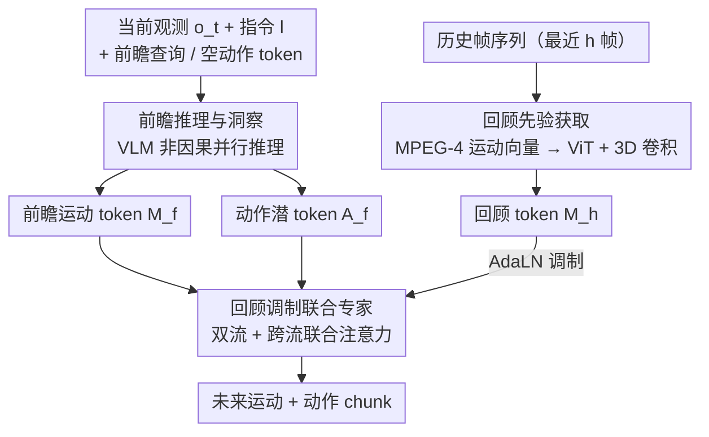

# HiF-VLA: Hindsight, Insight and Foresight through Motion Representation for Vision-Language-Action Models

**会议**: CVPR 2026  
**arXiv**: [2512.09928](https://arxiv.org/abs/2512.09928)  
**代码**: [GitHub](https://github.com/OpenHelix-Team/HiF-VLA)  
**领域**:机器人
**关键词**: VLA模型, 运动表示, 时间推理, 长时操作, 世界模型

## 一句话总结

提出 HiF-VLA 框架，通过运动向量（Motion Vector）作为紧凑时间原语，统一回顾（Hindsight）、洞察（Insight）和前瞻（Foresight）三种时间推理能力，实现 VLA 模型的双向时间扩展，在长时操作任务中以极低计算开销大幅超越基线。

## 研究背景与动机

视觉-语言-动作（VLA）模型近年来在机器人操作领域取得了显著进展，通过将视觉和语言信息映射到动作空间实现端到端控制。然而，大多数 VLA 模型隐式假设马尔可夫性质——仅基于当前观测预测动作，缺乏对时间依赖性的显式建模。这导致了**时间近视**（temporal myopia），在长时序操作中表现为轨迹碎片化和任务级连贯性下降。

现有缓解时间近视的方法主要有两个方向：

**历史帧堆叠**：如 TraceVLA、Octo 等将多帧过去观测作为输入，但存在严重冗余——相邻帧高度相似，计算开销大且推理延迟高（Tab.3 显示 history=4 时延迟增加 3.15×）

**像素级子目标预测**：如 CoT-VLA、Seer 等预测未来视觉子目标，但易受局部失真和语义漂移影响

本文的核心论点是：**运动（motion）比原始像素更适合作为时间上下文的表示**。运动向量捕获状态间的动态变化，同时过滤静态像素噪声，是历史和未来的自然桥梁。

## 方法详解

### 整体框架

HiF-VLA 想解决的是 VLA 模型的「时间近视」：原始模型只看当前帧 $o_t$ 和指令 $l$ 就直接预测一段动作 $\tilde{a}_{t:t+n} \sim P_\theta(a_{t:t+n} \mid o_t, l)$，既不知道刚才发生了什么，也不预演接下来会怎样。HiF-VLA 的做法是给模型同时接上「过去」和「未来」两端，但两端用的都不是像素，而是**运动**——一种紧凑的时间原语。

整体在 OpenVLA-OFT（Prismatic-7B VLM 骨干）上改造，数据流变成三段：先把最近 $h$ 帧的历史运动 $m^{his}_{t-h:t}$ 压成回顾上下文，再让 VLM 一边输出动作、一边预测未来运动，最后由一个联合专家把两条流融合成最终动作。形式上推理目标从单纯的动作扩展为动作与运动的联合分布 $(\tilde{a}_{t:t+n}, \tilde{m}_{t:t+n}) \sim P'_\theta(a_{t:t+n}, m_{t:t+n} \mid o_t, l, m^{his}_{t-h:t})$。训练时两者一起学，推理时运动这一路是可选的——需要省算力时可以只解动作。三个贡献模块分别对应「回顾（过去）—前瞻（未来）—融合（解码）」三段，下面的关键设计逐个展开。

### 关键设计

**1. 回顾先验获取：用 MPEG-4 运动向量代替帧堆叠，把历史压成几乎无损又极轻的上下文**

历史帧堆叠的痛点是冗余——相邻帧高度相似，多塞几帧进去主要是在重复搬运静态像素，算力和延迟都被拖垮。HiF-VLA 直接借用视频编解码里现成的 MPEG-4 运动向量（MV）：它编码相邻两帧间每个宏块的位移 $MV_{t-1:t}(x,y) = (x_t - x_{t-1}, y_t - y_{t-1})$，张量尺寸只有 $h \times (H/16) \times (W/16) \times 2$，比原始帧小一两个数量级，却保留了「什么在动、往哪动」这一最关键的时间线索。这段 MV 序列经一个轻量 ViT 编码器加浅层 3D 卷积，压成紧凑的回顾 token $M_h \in \mathbb{R}^{K_h \times d}$。之所以选 MV 而不是自己估一套光流，是因为 MV 在编解码标准里本就是为「近无损重建」服务的，等于免费拿到一份高效又忠实的历史动态摘要。

**2. 前瞻推理与洞察：让 VLM 预测未来运动而非未来像素，把「预演」做得不失真**

像 CoT-VLA、Seer 那样预测未来的像素级子目标，容易遇到局部失真和语义漂移——画面一旦糊掉或飘了，后续动作也跟着错。HiF-VLA 改成预测未来的运动：往输入里加 $K_f$ 个可学习的前瞻查询 token 和 $K_a$ 个空动作 token，和指令、当前观测拼在一起送进 VLM。VLM 用非因果注意力一次性并行推理，输出前瞻运动 token $M_f$ 和动作潜在 token $A_f$。因为预测目标是运动而不是高维像素，既绕开了像素重建的失真，也省掉了大量冗余维度，相当于让模型「想清楚下一步往哪动」再落到具体动作。

**3. 回顾调制联合专家：历史不进 VLM 输入，而在解码器里用 AdaLN 条件化，动作与运动两流并行又解耦**

把历史运动直接塞进 VLM 输入有个隐患：它会干扰预训练好的视觉-语言对齐，等于用一个新模态去搅乱原模型的根基。HiF-VLA 的处理是把回顾信息留到下游的联合专家解码器里，通过自适应层归一化（AdaLN）来调制——

$$\text{AdaLN}(z; h_c) = \gamma(h_c) \cdot \frac{z - \mu(z)}{\sigma(z)} + \beta(h_c)$$

回顾上下文 $h_c$ 只去缩放和平移特征 $z$，不改动 VLM 的注意力结构。在这个专家内部，前瞻运动 token 和动作 token 走成两条并行流，靠**跨流联合注意力**互相交互，同时各自保留独立 FFN，保证两种表示互补但不混成一团。这样设计的依据是：运动本就是动作在视觉空间里的物理投影，把两者放在一起联合预测，能让高层语义理解和底层动力学对得更齐。

### 损失函数 / 训练策略

总损失为动作 L1 损失和运动重建 L1 损失的加权和：

$$\mathcal{L}_{all} = \mathcal{L}_A + \lambda \cdot \mathcal{L}_{MV}$$

其中 $\lambda = 0.01$，LIBERO 训练 150K 步，CALVIN 训练 80K 步，8×A100 GPU，全局 batch size 64。

## 实验关键数据

### 主实验

**LIBERO-Long（10 任务，500 次试验）**：

| 方法 | 视角 | 平均成功率 |
|------|------|-----------|
| OpenVLA-OFT | 第三人称 | 91.0% |
| MemoryVLA | 第三人称 | 93.4% |
| **HiF-VLA** | **第三人称** | **94.4%** |
| OpenVLA-OFT | 多视角 | 94.0% |
| Seer | 多视角 | 87.7% |
| **HiF-VLA** | **多视角** | **96.4%** |

HiF-VLA 的第三人称变体（94.4%）甚至接近多视角基线的性能。

**CALVIN ABC-D（训练 A-C，测试未见环境 D）**：

| 方法 | 视角 | Avg. Len. ↑ |
|------|------|------------|
| VPP | 多视角 | 4.33 |
| Seer | 多视角 | 4.28 |
| **HiF-VLA** | **多视角** | **4.35** |
| HiF-VLA | 第三人称 | 4.08 |

### 消融实验

**效率对比（LIBERO-Long，第三人称，history=4）**：

| 配置 | GPU 内存 | 延迟 | 成功率 |
|------|---------|------|--------|
| Baseline | 30.8GB (1.00×) | 72.9ms (1.00×) | 91.0% |
| + 子目标 | 38.2GB (1.24×) | 115.9ms (1.59×) | 91.8% |
| + 前瞻（HiF） | 31.8GB (1.03×) | 82.7ms (1.13×) | 92.2% |
| + 历史帧 | 63.6GB (2.06×) | 229.5ms (3.15×) | 90.4% |
| + 回顾（HiF） | 31.4GB (1.02×) | 117.7ms (1.61×) | 92.2% |
| + 回顾+前瞻 | 32.2GB (1.05×) | 121.6ms (1.67×) | 93.2% |

历史帧堆叠增加 3.15× 延迟反而降低性能；HiF-VLA 的前瞻仅增加 0.13× 延迟。

**回顾嵌入位置**：在专家解码器中条件化回顾信息优于直接注入 VLM 输入，因为运动信息可能干扰视觉-语言预训练对齐。

**回顾长度**：长度 8 时达到峰值性能（第三人称 94.4%，多视角 96.4%）。

### 关键发现

1. 原始帧堆叠不仅增加巨大计算开销，还可能**降低**性能（90.4% vs 91.0%），因为冗余像素信息稀释了任务相关的时间线索
2. 运动向量作为历史表示比原始帧更高效且更有效——用 2% 额外 GPU 内存实现 1.2% 绝对提升
3. HiF-VLA 的推理延迟随历史长度增长仅边际增加，而帧堆叠基线几乎线性增长（history=8 时 4.5×）
4. 真实世界实验中基线在 Press-Buttons-Order 中仅 17.4%，因为无法检测按下/未按下的微小视觉差异；HiF-VLA 凭借时间感受野成功检测细微状态转换

## 亮点与洞察

- **运动向量的巧妙借用**：从视频编解码领域借用 MV 作为历史表示，既有理论基础（近无损重建）又有实践优势（紧凑高效）。这是一个非常优雅的跨领域迁移
- **"边思考边行动"范式**：联合预测运动和动作，使得 VLA 在生成动作时同时推理未来动态，类似人类的决策过程
- **回顾注入位置的实验**很有启发性：说明在预训练多模态模型中，新模态信息的注入位置至关重要——解码器/后处理层比直接嵌入更安全

## 局限与展望

1. 当前运动表示依赖估计精度，在高度动态场景中可能对噪声敏感
2. 未探索在互联网视频上的大规模预训练以增强运动理解和生成能力
3. 回顾长度在不同任务中可能需要自适应调整，当前使用固定窗口
4. 仅在 LIBERO 和 CALVIN 基准上验证，未涉及更复杂的真实任务（如厨房操作、仓库物流等）

## 相关工作与启发

- 与 CoT-VLA 和 UP-VLA 的像素级子目标预测相比，使用运动向量进行前瞻更紧凑且不易失真
- 与 TraceVLA 和 Octo 的帧堆叠方法相比，MV 编码在保持信息量的同时大幅降低冗余
- AdaLN 条件化机制来自扩散模型（DiT），在此被创造性地用于时间调制，值得借鉴
- 该框架可以视为一种运动中心的世界模型（World Action Model），连接感知、动力学和控制

## 评分

- 新颖性: ⭐⭐⭐⭐⭐ （运动向量作为时间原语 + 回顾调制联合专家的设计非常新颖）
- 实验充分度: ⭐⭐⭐⭐⭐ （模拟+真实世界、效率分析、推理可扩展性、详尽消融）
- 写作质量: ⭐⭐⭐⭐ （结构清晰，RQ 驱动的实验设计）
- 价值: ⭐⭐⭐⭐⭐ （对 VLA 领域的时间建模提供了高效且有效的新范式）

<!-- RELATED:START -->

## 相关论文

- [\[CVPR 2026\] Cross-Hand Latent Representation for Vision-Language-Action Models](cross-hand_latent_representation_for_vision-language-action_models.md)
- [\[CVPR 2026\] ACoT-VLA: Action Chain-of-Thought for Vision-Language-Action Models](acot-vla_action_chain-of-thought_for_vision-language-action_models.md)
- [\[CVPR 2026\] ForeAct: Steering Your VLA with Efficient Visual Foresight Planning](foreact_steering_your_vla_with_efficient_visual_foresight_planning.md)
- [\[CVPR 2026\] Adaptive Action Chunking at Inference-time for Vision-Language-Action Models](adaptive_action_chunking_at_inference-time_for_vision-language-action_models.md)
- [\[CVPR 2026\] AVA-VLA: Improving Vision-Language-Action models with Active Visual Attention](ava_vla_improving_vision_language_action_models_with_active_visual_attention.md)

<!-- RELATED:END -->
