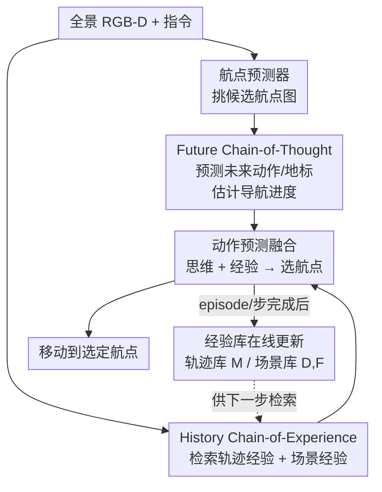

# History to Future: Evolving Agent with Experience and Thought for Zero-shot Vision-and-Language Navigation

**会议**: CVPR 2026  
**论文**: [CVF Open Access](https://openaccess.thecvf.com/content/CVPR2026/html/Dai_History_to_Future_Evolving_Agent_with_Experience_and_Thought_for_CVPR_2026_paper.html)  
**领域**: Agent / 具身导航  
**关键词**: 零样本VLN-CE, LLM导航, 反馈推理, 经验回放, 未来思维链

## 一句话总结
EVONAV 给零样本视觉语言导航（VLN-CE）的 LLM 智能体补上「回顾历史 + 预判未来」的反馈回路：用 Future Chain-of-Thought（F-CoT）预测未来动作与地标来估计导航进度、用 History Chain-of-Experience（H-CoE）把已完成轨迹和走过的场景在线总结成可检索经验，两者协同让决策从「一锤子直推」进化为「带反馈的连续纠错」，在 R2R-CE 上比同 LLM 的 Open-Nav 提升 +20% SR、+21% OSR、+17% SPL，且更省时省显存。

## 研究背景与动机

**领域现状**：连续环境下的视觉语言导航（VLN-CE）要求智能体在没有预建地图、只能用低层动作（前进 0.25m、左右转 15°）的设定下，跟随自然语言指令走到目标点。传统做法是在 R2R-CE 这类任务数据上做监督训练（CMA、BEVBert、ETPNav 等），靠在已见环境里学到的归纳偏置取得高精度。近两年则兴起用 LLM 做零样本 VLN-CE：借助 LLM 丰富的常识与推理能力，先用通用视觉翻译器（如 BLIP-2）把全景图像翻成文本，再让 LLM 据此推理下一步动作（NavGPT、MapGPT、Open-Nav 等）。

**现有痛点**：作者指出现有 LLM 路线有两层硬伤。其一，靠额外视觉翻译器「间接」处理画面，丢掉了视觉细节，LLM 看到的是被压缩过的文字描述。其二、也是更关键的——这些方法都是**单向直推（naive reasoning）**：给定当前观测和指令直接吐一个动作，既不回看历史上哪一步走错了，也不预判这一步走下去未来会怎样。一旦初始几步走错，就会沿着错误轨迹连续失败（continuous failure），尤其在那些本就难的任务上。

**核心矛盾**：人类导航时会沿着「历史 → 现在 → 未来」不断进化决策——总结过去的错误形成经验、想象未来的结果规避风险。而现有 LLM 智能体缺的正是这条反馈链：它有强推理能力，却没有让推理「闭环」的历史经验和未来思维作为输入，于是推理能力没被充分释放，决策容易幻觉。

**本文目标**：在不做任何任务数据训练（保持零样本、利于 sim-to-real）的前提下，给 LLM 智能体装上「回顾历史」和「预判未来」两条反馈，把直推式决策 $\text{LLM}(O,I)\to A_{now}$ 改造成带反馈的进化式决策。

**核心 idea**：用「未来思维」和「历史经验」双向夹逼当前决策。形式上把原范式重写为
$$\text{H-CoE} \leftarrow \text{LLM}(O,I) \to A_{now} \to \text{F-CoT}$$
即一边由 F-CoT 向前预测动作/地标作为「思维」，一边由 H-CoE 向后总结轨迹/场景作为「经验」，两股信息一起喂回动作预测模块，让智能体像人一样「review history、dream future」。

## 方法详解

### 整体框架
EVONAV（正文写作 EvoNav）的输入是每一步的全景 RGB-D 图（12 张 RGB + 深度，环绕 0°、30°…330°）和该 episode 的语言指令，输出是下一步要移动到的候选航点。整条流水线分四段：先用标准航点预测器从全景图里挑出候选航点图；接着 **F-CoT** 对候选图做「未来思维」推理，预测下一步动作和地标，用来估计当前导航进度、指明潜在方向；然后 **H-CoE** 从一个会持续总结、存储已完成轨迹和走过场景的「经验库」里，检索出与当前指令/场景相关的轨迹经验和场景经验；最后把检索到的历史经验和预测出的未来思维一起塞进**动作预测模块**，融合做出更可靠的航点选择。经验库随着 episode 和导航步的完成而在线更新，所以智能体跑得越多、可借鉴的经验越丰富，决策越稳。

### 关键设计

**1. Future Chain-of-Thought（F-CoT）：用预测未来来锚定「我走到哪了、该往哪走」**

直推式决策的盲点是「不知道自己在指令里的进度」——指令是一串子动作，但智能体不清楚已经完成到第几步，于是方向判断容易跑偏。F-CoT 用四个串行子步把「未来」显式推出来，反过来标定当前状态。① **指令拆解**：让 LLM 把整条指令拆成时序子动作 $I_t$（如「穿过」）和空间地标 $I_s$（如「白色双开门」），$I_t,I_s=\text{LLM}(I)$。② **预测未来动作** $P_f=\text{LLM}(H,O,I)$，其中 $H$ 是当前步之前的路径信息（起点时设为「Step 0 起始位置」）——之所以先预测未来动作，是因为「未来还没发生的动作」一旦定下，就能用「完整子动作减去未来动作」反推出智能体当前的状态。③ **进度估计**：基于未来动作回顾历史路径，推断已执行动作 $A_d=\text{LLM}(I_s,I_t,P_f,H)$。④ **预测未来地标** $L_f=\text{LLM}(I,I_s,I_t,A_d)$，按两条规则走——下一动作明确提到地标时，从地标列表里精确匹配并原样输出名称；只描述方向（左转/前进）而无地标时直接输出「None」。预测出的未来地标 $L_f$ 不只是「思维」，还会当成 H-CoE 检索场景经验的查询词，把「我接下来想找什么」和「我以前在哪见过类似场景」对接起来。消融显示未来动作 $P_f$ 比未来地标 $L_f$ 单独用更有效，因为没有动作引导的进度估计不完整，会让地标预测变次优；两者一起用（A3）才最好。

**2. H-CoE 历史轨迹经验：把整段 episode 的成败总结成「下次别再犯」的文本经验**

智能体的另一个盲点是「同类任务上反复栽在同一个坑」。轨迹经验解决的是 episode 级别的全局指导。每完成一个 episode，先在线算出该次导航的综合表现 $R=\psi(NE,SR,OSR,SPL)(Nav,Nav_{GT})$（用预测路径与真值路径比），再据 $R$ 和完整轨迹 $H^*$ 让 LLM 按三条规则总结成经验 $E$：**完全失败（SR=0）**——分析导航错误、给出修正流程、提炼关键提示并复核；**完美导航（SR=1 且 SPL≥0.8）**——原样复现这套决策；**成功但低效（SR=1 且 SPL<0.8）**——给出提升 SPL 的优化建议。这些经验用向量数据库 chroma 持续存进经验库 $M$，第 $n$ 个 episode 完成后在线扩库 $M_n=M_{n-1}\cup[(I_n,I_s^n,H_n^*,E_n)]$。注意经验只能在 episode 完成后才收集，所以执行第 $n$ 个时库里只有前 $n-1$ 个的经验，避免「偷看答案」。检索时以当前 episode 的完整地标 $I_s$ 作查询，用余弦相似度做 T2T 检索取 top-K 轨迹经验。消融里加上轨迹经验（B1→B2）SR 从 27 涨到 31，证明「同类历史任务的总结」确实有用。

**3. H-CoE 历史场景经验：用「文字描述 + CLIP 视觉外观」双通道复用走过的画面**

轨迹经验是全局的，但每一步还需要局部视觉线索。场景经验解决的是 step 级别的局部参考。构建时双管齐下：每步用 LLM 抽出视觉描述、投影成嵌入 $d$ 存进场景描述库 $D$；同时用 CLIP 抽视觉外观特征、嵌入 $f$ 存进场景外观库 $F$，两库同样按「完成才收集」的规则在线扩展。检索时用 F-CoT 预测的未来地标 $L_f$ 当查询词（因为它代表了潜在方向），走两路检索后相加 $V_e=V_d+V_f$：$V_d$ 是文本到描述的相似度检索（T2D），$V_f$ 是文本到视觉、用 CLIP 把查询词和存的图投到同一特征空间做相似度（T2V）。消融很有意思：单看视觉描述（C2）比单看视觉外观（C1）更强，因为带常识的 LLM 即便只读文字描述也能给出更精炼的观察；但视觉外观能补上 LLM 文字里缺的颜色、布局、纹理，两者合并（C3）最好。

**4. 动作预测融合：把思维和经验拧成一次决策**

前三个设计产出的信息最终在动作预测模块汇合。这一步让 LLM 按四要素决策：**视图观察**（简洁描述视野内物体及空间关系）、**思维辅助**（用未来地标 $L_f$ 帮当前方向预测）、**经验辅助**（检索当前 episode 的轨迹经验 $T^e$ 和场景经验 $V^e$）、**航点选择**（综合上述选最合适航点移动）。形式上第 $n$ 个 episode 第 $i$ 步的动作预测为
$$R_n,S_n,Y_n=\text{LLM}(I_s,I_t,I,H,O,T^e,V^e,A_d)$$
其中 $R_n$ 是推理过程、$S_n$ 是航点描述、$Y_n$ 是选中的移动航点，随后把这些信息和先前的 $H$ 聚合，更新出 $n$ 步的导航历史 $H'$。这个模块是「框架四段」里把 F-CoT 的思维（$L_f,A_d$）和 H-CoE 的经验（$T^e,V^e$）真正落到一次动作上的收口处。

### 一个例子：穿过厨房那一步
指令是「离开浴室，穿过正对大厅的门，径直穿过厨房，在吧台尽头左转再左转，进右边房间，站在衣柜和水槽之间」。走到 Step 3 时，F-CoT 预测出未来动作「径直穿过厨房」、未来地标「Kitchen」。智能体在 View 0 看到一条狭窄的食品储藏室通道、左侧深色架子摆着白盘子、前方通向开阔厨房且右侧可见冰箱；它的思维是「我已成功离开浴室进入厨房区，未来动作再次印证了这个进度；当前要『径直穿过厨房』，View 0 给出最直、最居中的前进路径，且和轨迹经验里『走过厨房』的思路吻合」，于是预测航点 0。对照 SOTA 方法在同一步选了 View 7（朝卧室门），EVONAV 靠「未来地标 = 厨房」这条思维把方向锚定在了正确的直行路径上——这正是反馈推理相对直推的差别所在。

## 实验关键数据

### 主实验

R2R-CE 上与监督式、带预训练的零样本、免训练零样本三类方法对比（除 Smartway 和 MapGPT 外都用同一航点预测器以排除其影响）：

| 方法 | NE↓ | nDTW↑ | OSR↑ | SR↑ | SPL↑ |
|------|------|------|------|------|------|
| BEVBert（监督） | 5.13 | 61.40 | 64 | 60 | 53.41 |
| SmartWay-GPT4o（零样本+预训练） | 7.01 | - | 51 | 29 | 22.46 |
| Open-Nav-GPT4o | 6.70 | 45.79 | 23 | 19 | 16.10 |
| Open-Nav-Gemini-2.5-pro | 7.28 | 49.51 | 30 | 23 | 19.90 |
| **EvoNav-GPT4o（本文）** | 5.97 | 56.32 | 35 | 30 | 24.91 |
| **EvoNav-Gemini-2.5-pro（本文）** | **5.04** | **62.38** | **51** | **43** | **37.77** |

同 LLM 下相对 Open-Nav-Gemini，EVONAV 把 SR 从 23 拉到 43（+20）、OSR 从 30 到 51（+21）、SPL 从 19.9 到 37.77（+17.87）；甚至超过了「用更多数据预训练航点预测器」的 SmartWay。在更难、要求理解复杂用户需求的 NavRAG-CE 上同样 SOTA：

| 方法 | NE↓ | OSR↑ | SR↑ | SPL↑ |
|------|------|------|------|------|
| Open-Nav-GPT4o | 6.81 | 38 | 22 | 11.89 |
| Open-Nav-Gemini-2.5-pro | 6.77 | 44 | 24 | 13.39 |
| **EvoNav-GPT4o** | 6.77 | 41 | 29 | 14.28 |
| **EvoNav-Gemini-2.5-pro** | **6.20** | **51** | **30** | **17.60** |

真机实验在实验室、走廊、电梯厅、书房四个场景各标注 20 条指令，EvoNav-Gemini 在四场景 SR 全面领先（如实验室 SR 40 vs Open-Nav 35、走廊 35 vs 20），证明零样本设定下的真实泛化能力。

### 消融实验

Table 4 在 R2R-CE 上逐组件剥离（Base 为 Gemini-2.5-pro 直推）：

| 配置 | 启用项 | OSR↑ | SR↑ | SPL↑ | 说明 |
|------|--------|------|------|------|------|
| Base | 全关 | 14 | 9 | 7.46 | 直推基线 |
| A1 | +未来动作 $P_f$ | 33 | 25 | 22.10 | 单加动作 |
| A2 | +未来地标 $L_f$ | 31 | 23 | 19.96 | 单加地标，弱于 A1 |
| A3 | $P_f+L_f$（完整 F-CoT） | 36 | 27 | 24.92 | F-CoT 全开 |
| B2 | A3 + 轨迹经验 $T^e$ | 42 | 31 | 27.64 | 加全局经验 |
| C3 | A3 + 场景描述+外观 | 48 | 40 | 34.07 | 加局部经验 |
| Full | F-CoT + H-CoE 全开 | 51 | 43 | 37.77 | 完整模型 |

### 关键发现
- **从 Base 到 A3 是质变**：仅加上 F-CoT 的未来动作+地标，SR 就从 9 飙到 27、OSR 从 14 到 36，说明「让 LLM 先想清楚未来、再定位当前进度」是释放其推理力的关键开关。
- **未来动作 > 未来地标**：A1（25 SR）优于 A2（23 SR），因为缺了动作引导的进度估计不完整，会让地标预测变次优。
- **场景经验比轨迹经验贡献更大**：C3（SR 40）明显高于 B2（SR 31），局部视觉参考对逐步决策更直接；而其中「文字描述」又比「CLIP 外观」更强（C2>C1），但外观能补颜色/纹理，合并最佳。
- **经验不是越多越好**：检索量消融显示轨迹经验「1 条」最佳、场景经验「4 张图」峰值，再多会引入无关噪声拉低上下文质量；检索时机也以 episode 前 30% 才开始建库/检索为最优（太早相似度低、太晚收益少）。
- **更快更省**：Table 6 显示同卡同 API 下，EvoNav 推理显存 2.4G vs Open-Nav 12.5G、单 episode 7.6 分钟 vs 14.7 分钟——精度涨 20% 的同时反而更轻。

## 亮点与洞察
- **「预测未来反推现在」这一招很巧**：直接问 LLM「你走到第几步了」往往答不准，而先让它预测未来动作、再用「完整子动作 − 未来动作」反推当前状态，把难以直接估计的进度变成了可计算的差集，是个值得迁移到其他需要进度追踪任务的 trick。
- **未来地标既是「思维输出」又是「检索查询」**：$L_f$ 一身两用——既辅助方向预测，又当 H-CoE 检索场景经验的 query，把「我接下来想找什么」和「我以前在哪见过」自然对接，避免了两个模块各管各的脱节。
- **按成败分级总结经验**：失败/完美/低效三档对应「纠错+提示」「原样复现」「提效建议」三种总结策略，比无差别存轨迹更有针对性，本质是给 LLM 准备了「带标签的反思样本」。
- **零样本却越跑越强**：经验库在线累积让同一套模型在更多 episode 后决策更稳，且不需要任何梯度训练，天然利于 sim-to-real。

## 局限与展望
- **依赖经验库的「先验积累」**：检索时机消融表明前 30% episode 几乎没有可用经验，意味着冷启动阶段（少量任务时）H-CoE 收益有限，方法更适合长程、重复性场景。
- **多次 LLM 调用的延迟**：F-CoT 四个子步 + H-CoE 双检索 + 动作预测，单步要调用 LLM 多次，虽然比 Open-Nav 省显存省时，但相对监督模型仍偏重，真机实时性存疑（论文未给端到端帧率）。
- **检索量/时机超参较敏感**：1-traj、4-image、30%-start 都是经验调出的甜点，换数据集或环境是否仍最优未验证。
- **作者展望**：未来探索多智能体协作以进一步提升 LLM 智能体的推理能力。

## 相关工作与启发
- **vs Open-Nav / NavGPT / MapGPT（LLM 直推路线）**：它们把视觉翻成文本后单向直推动作，缺历史回看和未来预判；EVONAV 在同 LLM 下靠 F-CoT+H-CoE 的反馈回路把 SR 翻倍，且更省资源，核心区别是「带反馈 vs 直推」。
- **vs 终身学习/全局记忆方法（如 SLAM 维护 3D 结构）**：那些方法靠 SLAM 等定位工具建几何记忆、只在重访同一环境时有用、且缺任务知识；EVONAV 的经验不依赖额外工具、存的是任务级经验与思维、能泛化到新环境，三点都不同。
- **vs 监督式 VLN-CE（BEVBert/ETPNav）**：监督方法精度更高（SR 60）但靠任务数据训练、零样本泛化差、难 sim-to-real；EVONAV 走零样本路线，虽未追平监督上限，但在免训练赛道里 SOTA 且可直接上真机。

## 评分
- 新颖性: ⭐⭐⭐⭐ 把「历史经验 + 未来思维」的人类反馈机制系统化为 F-CoT/H-CoE 双链，「预测未来反推进度」「未来地标兼作检索查询」等设计有巧思。
- 实验充分度: ⭐⭐⭐⭐⭐ 两个仿真 benchmark + 四场景真机 + 多 LLM 泛化 + 逐组件消融 + 检索量/时机/算力多维分析，非常扎实。
- 写作质量: ⭐⭐⭐⭐ 框架图与公式清晰、消融解读到位；个别记号（如 $E_t$/$T^e$、$E_v$/$V^e$）前后略有不一致。
- 价值: ⭐⭐⭐⭐ 零样本免训练、省显存省时、可上真机，对具身导航社区「review history、dream future」的范式有实用推动力。

<!-- RELATED:START -->

## 相关论文

- [\[CVPR 2026\] TrajRAG: Retrieving Geometric-Semantic Experience for Zero-Shot Object Navigation](trajrag_retrieving_geometric-semantic_experience_for_zero-shot_object_navigation.md)
- [\[CVPR 2026\] FantasyVLN: Unified Multimodal Chain-of-Thought Reasoning for Vision-and-Language Navigation](fantasyvln_unified_multimodal_chain-of-thought_reasoning_for_vision-and-language.md)
- [\[CVPR 2026\] Bridging the 2D-3D Gap: A Hierarchical Semantic-Geometric Map for Vision Language Navigation](bridging_the_2d-3d_gap_a_hierarchical_semantic-geometric_map_for_vision_language.md)
- [\[CVPR 2026\] ACoT-VLA: Action Chain-of-Thought for Vision-Language-Action Models](acot-vla_action_chain-of-thought_for_vision-language-action_models.md)
- [\[CVPR 2026\] FineCog-Nav: Integrating Fine-grained Cognitive Modules for Zero-shot Multimodal UAV Navigation](finecog_nav_fine_grained_cognitive_modules_for_zero_shot_uav_navigation.md)

<!-- RELATED:END -->
