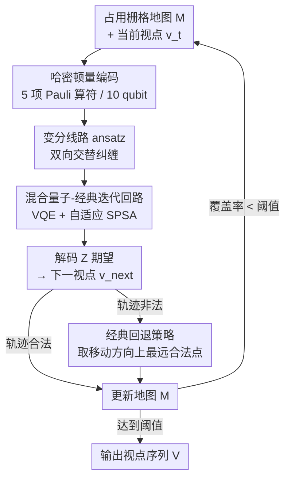

# HQC-NBV: A Hybrid Quantum-Classical View Planning Approach

**会议**: CVPR 2026  
**论文**: [CVF Open Access](https://openaccess.thecvf.com/content/CVPR2026/html/Yu_HQC-NBV_A_Hybrid_Quantum-Classical_View_Planning_Approach_CVPR_2026_paper.html)  
**领域**: 机器人 / 主动感知（Next-Best-View 视点规划）  
**关键词**: Next-Best-View、视点规划、量子-经典混合、变分量子线路、机器人探索

## 一句话总结
把机器人探索里的"下一最佳视点"（NBV）问题改写成一个量子哈密顿量的求基态问题，用 10 量子比特的变分线路 + VQE/SPSA 同时评估多个移动方向，借助量子叠加与纠缠跳出经典启发式/采样方法的局部最优，在 2D 探索场景里把探索效率相比经典方法提升 7.9–49.2%。

## 研究背景与动机

**领域现状**：NBV（Next-Best-View）是机器人探索、搜救、自主导航中的核心问题——每一步要决定"相机下一步往哪挪、朝哪看"才能用最少的移动获得最多的新信息。经典做法分两类：采样式方法（基于 RRT/RRT\* 在已知自由空间里撒候选视点，按"信息增益/代价比"挑最优）和确定式方法（用启发式规则，如熵最小化、边界探索 frontier 来引导选点）。

**现有痛点**：采样式方法因为是对解空间的近似采样，常常给出次优解，而且复杂场景下候选数量随环境规模指数膨胀，算力扛不住；确定式启发法则容易卡在局部最优，尤其在大场景里很难找到全局最优。本质上 NBV 离散化之后是个**组合优化**问题，可行视点集 $F$ 的解空间复杂度 $O(|F|)$，经典优化器（Powell、COBYLA 等）在这种离散、非凸、信息增益函数不可微的地形上很容易陷进去。

**核心矛盾**：经典方法只能**串行**地逐个评估候选视点，而 NBV 的几个决策参数（移动方向、距离、朝向）之间存在强耦合的层级依赖——你选的方向会影响该用多大距离、相机该转到哪个角度。串行评估既慢，又割裂了参数间的相互依赖。

**切入角度**：量子计算的两个特性恰好对上 NBV 的两个痛点——**叠加**让一组量子比特能同时表征并评估所有候选移动参数（并行搜索），**纠缠**能天然编码参数之间的层级依赖。而且 NBV 的组合优化本质与量子退火/变分量子算法擅长的问题结构高度吻合。

**核心 idea**：用一个精心设计的代价哈密顿量 $\hat{H}$ 把 NBV 目标函数编码进 10 个量子比特，让"最优视点"对应哈密顿量的基态；再用带双向交替纠缠的变分量子线路去逼近这个基态，配合经典的 SPSA 优化器和轨迹校验形成一个混合量子-经典回路。这是首个把混合量子-经典框架引入信息驱动视点规划的工作。

## 方法详解

### 整体框架

HQC-NBV 是一个迭代的探索系统：维护一张三态（未知/自由/占据）的占用栅格地图 $\mathcal{M}$，每一步以当前视点和地图为输入，输出下一个最佳视点，直到覆盖率达到阈值。单步内部走的是一条"经典构造问题 → 量子求解 → 经典解码校验"的混合回路：先根据当前地图把探索目标编码成代价哈密顿量 $\hat{H}$，再构造参数化变分线路 $U(\vec\theta)$，用 VQE + 自适应 SPSA 优化变分参数逼近基态，从测得的 $Z$ 期望解码出下一视点参数，最后做轨迹合法性校验（不合法就用经典回退策略），更新地图后进入下一轮。

经典优化目标是
$$\min_{v\in C} J(v) = -E(v) + \lambda_m M(v),\qquad \text{s.t. } P(v'\to v)\cap O=\varnothing$$
其中 $E(v)$ 是探索收益（潜在信息增益），$M(v)$ 是移动代价，约束保证路径不撞障碍。离散化后变成 $v^*=\arg\min_{v\in F}J(v)$，正是这一步把问题交给量子求解。

### 关键设计

**1. 问题哈密顿量编码：把"该往哪看"翻译成量子比特的能量地形**

NBV 的离散信息增益函数对优化器很不友好（不可微、地形崎岖），经典优化器容易卡死。作者的做法是把目标函数 $J(v)$ 重写成一个由 Pauli 算符加权和构成的代价哈密顿量
$$\hat{H} = \sum_i \alpha_i \hat{P}_i = \hat{H}_{dir} + \hat{H}_{dist} + \hat{H}_{adj} + \hat{H}_{orient} + \hat{H}_{coh}$$
其中 $\hat{P}_i$ 是 Pauli 串（$I,X,Y,Z$ 的张量积），$\alpha_i$ 是系数。关键在于让"经典代价低的视点配置 = 量子能量低的态"，于是哈密顿量的**基态** $|\psi_0\rangle$ 就编码了最优视点参数。

10 个量子比特按物理意义分组、按参数重要性分配精度：前 2 比特编码主方向，距离和微调各 2 比特，相机朝向角占 4 比特（朝向需要最高精度去对准信息丰富区域）。五个分量各司其职且都由占用地图实时算出系数：方向项 $\hat{H}_{dir}$ 用 $Z$ 算符按各基本方向的未探索密度引导朝未知区移动（如 $\alpha_{dir,0}=\lambda_{dir,0}\cdot\tanh(e_W+e_S-e_E-e_N)$）；距离项 $\hat{H}_{dist}$ 系数正比于障碍邻近度并按比特位权 $2^{-(i+1)}$ 衰减，惩罚过度移动；微调项 $\hat{H}_{adj}$ 随未探索比例 $(1-c)$ 缩放，让探索越往后微调越精细；朝向项 $\hat{H}_{orient}$ 把目标方向与高弥散下的探索促进项结合；而**相干项** $\hat{H}_{coh}=\sum_i\alpha_{X_i}X_i+\sum_{(i,j)\in P}\alpha_{XX_{i,j}}X_iX_j$ 用 $X$ 算符和双比特纠缠项在物理相关的参数对（方向-微调、距离-微调、方向-朝向）之间维持量子叠加与耦合，纠缠系数同样随 $(1-c)$ 缩放。这样系数函数都是平滑的，把原本崎岖离散的信息增益变成了对变分参数可求平滑梯度的能量期望——这正是它能赢过经典优化器的根因。

**2. 参数中心的变分线路：用双向交替纠缠捕捉参数间的层级依赖**

光有哈密顿量还要有能逼近其基态的线路。作者设计了一个 $L=5$ 层的参数化量子线路 $U(\vec\theta)=U_L\cdots U_2 U_1$，作用在均匀叠加态 $|+\rangle^{\otimes n}$ 上。每层 $U_l=U_l^{rx}\cdot U_l^{ent}\cdot U_l^{rot}$ 含三部分：$R_y$ 旋转按参数组（方向/距离/微调/朝向）分块编码、纠缠模块建立量子关联、最后 $R_x$ 旋转引入与 $R_y$ 及 $Z$ 测量的非对易性以扩大可探索的希尔伯特子空间。

精髓在纠缠模块的**两级层级 + 双向交替**结构。先做**组内纠缠**（intra-group）：每个参数组内部用 CNOT 链把相邻比特串起来；再做**组间纠缠**（inter-group）：在参数组之间建连接，且连接模式随层奇偶**交替方向**——偶数层 $\text{CNOT}_{dir,adj}\cdot\text{CNOT}_{dist,adj}\cdot\text{CNOT}_{dir,orient}$，奇数层反过来 $\text{CNOT}_{orient,dir}\cdot\text{CNOT}_{adj,dist}\cdot\text{CNOT}_{adj,dir}$。这种双向交替让信息在参数组间正反两个方向都能流动，既能表达"方向↔距离↔朝向"这种复杂层级耦合，又不必把线路堆得很深。它直接呼应了 NBV 决策参数本身的层级依赖结构——这是经典串行评估做不到的"参数耦合一起优化"。

**3. 混合量子-经典迭代回路：VQE 求基态 + 自适应 SPSA + 经典回退兜底**

NISQ 时代的量子硬件有噪声，纯量子求解不可靠，所以作者把量子求解嵌进一个有经典兜底的回路（Algorithm 1）。每一步用 VQE（变分量子本征求解器）最小化能量期望 $\vec\theta^*=\arg\min_{\vec\theta}\langle\psi(\vec\theta)|\hat{H}|\psi(\vec\theta)\rangle$，优化器选**自适应 SPSA**——它只需两次函数评估就能估梯度，对量子测量噪声鲁棒，且适合高维变分参数空间；其学习率按优化进展与停滞检测自适应调整 $\eta_{t+1}=\eta_t+\mu m_t+(1-\mu)\Delta\eta_t$。优化后从测得的 $Z$ 期望解码出下一视点，再做**轨迹校验**：若新视点落在已观测区域内且不撞障碍则接受；否则触发经典回退策略——沿移动方向取最远的合法位置。这一层经典校验+回退保证了在量子解不可行时系统仍能稳定推进，是"混合"二字的落点，也是让概念验证能在真实探索里跑通的工程关键。

### 损失函数 / 训练策略
单步目标即能量期望 $\langle\psi(\vec\theta)|\hat{H}|\psi(\vec\theta)\rangle$ 再加可行性辅助约束项 $f(\vec\theta_i)$（Algorithm 1 第 9 行 $c_i=\langle\psi|\hat H|\psi\rangle+f(\vec\theta_i)$）；用自适应 SPSA 估梯度迭代 $N_{iter}$ 步。整个系统用 Qiskit 实现，在 Qiskit Aer 模拟器后端运行；相机 FOV 取 $2\pi/3$，最大射线距离 8 单位。

## 实验关键数据

### 主实验
在 4 个不同复杂度的 2D 场景（S1 周围障碍、S2 中心障碍、S3 半封闭复杂墙体 20×20、S4 更大 40×40）上对比经典探索方法（RH-NBV、frontier-based）与经典优化器（Powell、COBYLA）。

| 场景 | 方法 | 覆盖率 | 所需视点数 |
|------|------|--------|-----------|
| S1 | **HQC-NBV** | **92.85%** | 16 |
| S1 | RH-NBV / Frontier | 80.54% | 16 |
| S2 | **HQC-NBV** | **93.02%** | 12 |
| S2 | RH-NBV | 78.27% | ~24（约 2 倍视点） |
| S3 | **HQC-NBV** | **91.97%** | 18 |
| S3 | Frontier-based | 81.75%（提前终止） | — |

综合下来，相比经典探索方法路径长度减少 9.60–27.92%、探索效率（覆盖率/移动距离）高 16.19–30.75%；论文摘要/结论汇报的总体探索效率提升区间为 **7.9–49.2%**，最高覆盖率可达 95.8%。与传统优化器 Powell/COBYLA 比优势更明显——后者常卡在局部最优、覆盖率在 67.1% 以下就平台化。

### 消融实验
作者把量子特有组件拆开做了两组消融：纠缠架构变体（FA 全架构、NE 无纠缠、IG 仅组内、EG 仅组间）和相干项变体（CH 完整哈密顿量、NC 无相干项、SQX 仅单比特 X）。

| 消融维度 | 变体 | 关键现象 |
|----------|------|---------|
| 纠缠架构 | NE 无纠缠 | S1/S2 达到 65% 覆盖需多花 **61.11% / 57.14%** 视点 |
| 纠缠架构 | EG 仅组间 vs IG 仅组内 | EG 始终优于 IG，说明跨参数组纠缠比组内纠缠更关键 |
| 相干项 | NC 无相干项 | 频繁陷入局部最优，S1/S2 覆盖率上不去 **68.46% / 65.77%** |
| 相干项 | SQX 仅单比特 X | 居中表现，能维持基本探索但难逃复杂场景的局部最优 |

### 关键发现
- **组间纠缠 > 组内纠缠**：维持参数组之间的纠缠（方向↔距离↔朝向耦合）比组内纠缠对探索更重要，印证了 NBV 决策参数存在跨组层级依赖这一动机。
- **相干项决定后期突围能力**：去掉双比特相干项后，性能下滑最严重的恰是探索后期（覆盖率 >50%、剩余未知区稀疏分散时），说明双比特相干项在"协调不同参数同时更新"上不可替代。
- **可扩展性良好**：S4 面积是 S1–S3 的 4 倍，所需视点（56）≈ 其它场景（~15）的 4 倍，吻合 4:1 面积比，说明方法不随环境增大而退化。
- **并行搜索可视化**：以方向比特为例，四个方向初始各 0.25 概率，经 500 次迭代逐渐收敛，South 以 59% 概率胜出——直观展示了量子叠加"同时评估所有方向再收敛"的过程。

## 亮点与洞察
- **把不可微的离散信息增益变成可微的能量期望**：这是全文最巧的一刀。经典 NBV 的信息增益函数离散崎岖、优化器难下手；改写成结构化 Pauli 算符的哈密顿量期望后，对变分参数有平滑梯度，从根上解释了为何能赢过 Powell/COBYLA。这个"离散组合优化 → 连续变分能量"的思路可迁移到其它机器人离散决策问题。
- **物理意义驱动的量子比特分配与纠缠拓扑**：10 个比特按"方向 2 / 距离 2 / 微调 2 / 朝向 4"分配，纠缠对也按真实参数相关性（方向-朝向等）来连，而非盲目全连接——既省线路深度又对上问题结构，是量子线路设计里"领域先验入电路"的范例。
- **双向交替纠缠**这一设计让信息在参数组间正反流动，用浅线路表达深层耦合，对 NISQ 硬件的浅深度约束很友好。
- **混合回路的经典兜底**让概念验证真正能跑：量子解不可行时沿方向取最远合法点，工程上让系统在噪声硬件下仍稳定推进。

## 局限与展望
- **仅 2D + 简化感知的概念验证**：作者明确这是 proof of concept，限定在 2D 环境、简化传感模型，未涉及真实 3D 场景与复杂传感噪声。
- **全程在模拟器上跑**：实验都在 Qiskit Aer 模拟器后端，没有上真实量子硬件，NISQ 设备的真实退相干/门误差对结论的影响是未知数。
- **量子优势的归因偏经验**：性能提升通过消融"量子组件 vs 去掉量子组件"来论证，但与一个同样把信息增益连续化的纯经典强基线（而非 Powell/COBYLA 这种通用优化器）的对照偏弱，部分增益可能来自"可微能量地形"本身而非量子叠加。
- **横向数字不可直接比大小**：不同场景难度/视点预算不同，覆盖率与视点数需结合场景看，7.9–49.2% 这种大区间是跨场景汇总。
- **展望**：扩展到 3D 表示、更丰富的视点参数化、不确定性感知的 NBV 形式，并做系统性评测。

## 相关工作与启发
- **vs 经典 NBV（RH-NBV [Bircher et al.]、frontier-based）**：经典法靠启发式/边界或模型预测控制串行选点，易陷局部最优、复杂场景提前终止；本文用量子叠加并行评估、纠缠捕捉参数耦合，覆盖率与效率更高，但代价是依赖（模拟的）量子线路求解。
- **vs 量子计算机视觉（Farina 多模型拟合、Zaech 多目标跟踪 Ising、Arrigoni 运动分割）**：已有量子 CV 工作大多把问题写成 Ising/QUBO 交给绝热量子计算/退火；本文用的是 NISQ 时代的**变分量子算法（VQE + 参数化线路）**，且是首个面向信息驱动视点规划/机器人探索的量子方案。
- **启发**：当一个机器人决策问题本质是离散组合优化、且决策变量间有强层级耦合时，"哈密顿量编码 + 变分线路"是一条可借鉴的连续化求解路径，纠缠拓扑可按变量的物理相关性来设计。

## 评分
- 新颖性: ⭐⭐⭐⭐⭐ 首个把混合量子-经典变分框架引入 NBV 视点规划，哈密顿量编码 + 双向交替纠缠是扎实的原创设计。
- 实验充分度: ⭐⭐⭐⭐ 多场景对比 + 纠缠/相干双维度消融 + 可扩展性分析较完整，但限于 2D 模拟器、缺真机与更强经典基线。
- 写作质量: ⭐⭐⭐⭐ 公式与算法流程清晰、动机递进自然，量子优势的因果归因略偏经验。
- 价值: ⭐⭐⭐⭐ 作为量子计算进入机器人感知的概念验证有方向性意义，但当前阶段离实用尚远。

<!-- RELATED:START -->

## 相关论文

- [\[CVPR 2026\] Learning to Act Robustly with View-Invariant Latent Actions](learning_to_act_robustly_with_view-invariant_latent_actions.md)
- [\[CVPR 2026\] DiffuView: Multi-View Diffusion Pretraining for 3D-Aware Robotic Manipulation](diffuview_multi-view_diffusion_pretraining_for_3d_aware_robotic_manipulation.md)
- [\[CVPR 2026\] A Cross-view Fusion Framework for Robust 6-DoF Grasp Pose Estimation](a_cross-view_fusion_framework_for_robust_6-dof_grasp_pose_estimation.md)
- [\[CVPR 2026\] Learning to See and Act: Task-Aware Virtual View Exploration for Robotic Manipulation](learning_to_see_and_act_task-aware_virtual_view_exploration_for_robotic_manipula.md)
- [\[CVPR 2026\] HTNav: A Hybrid Navigation Framework with Tiered Structure for Urban Aerial Vision-and-Language Navigation](htnav_a_hybrid_navigation_framework_with_tiered_structure_for_urban_aerial_visio.md)

<!-- RELATED:END -->
