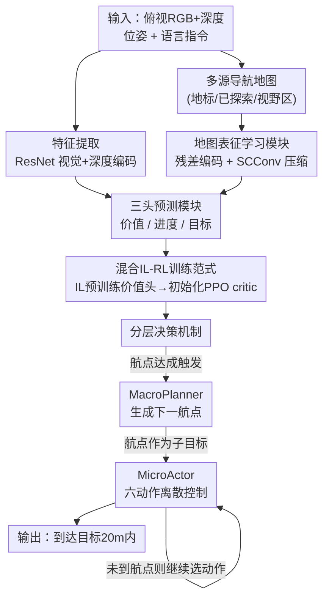

# HTNav: A Hybrid Navigation Framework with Tiered Structure for Urban Aerial Vision-and-Language Navigation

**会议**: CVPR 2026  
**论文**: [CVF Open Access](https://openaccess.thecvf.com/content/CVPR2026/html/Fan_HTNav_A_Hybrid_Navigation_Framework_with_Tiered_Structure_for_Urban_CVPR_2026_paper.html)  
**领域**: 机器人 / 具身导航（空中视觉语言导航）

**关键词**: 空中VLN、无人机导航、模仿学习+强化学习、分层决策、地图表征学习

## 一句话总结
HTNav 用「IL 预训练 + PPO 微调」的混合训练范式给城市无人机视觉语言导航打底，再叠一个「宏观规划航点 + 微观选动作」的分层决策机制和一个残差地图编码模块，在 CityNav 上把测试集未见场景的成功率从 9.70% 翻倍到 25.49%。

## 研究背景与动机
**领域现状**：空中 VLN（Aerial Vision-and-Language Navigation）让无人机根据自然语言指令在城市尺度上飞到目标点，应用价值很大（物流配送、城市巡检、灾害监测）。目前主流分两条路线：一类（CityNav、FG-AVDN、FlightGPT）用卫星遥感/俯视 2D 图像在真实城市底图上规划路径；另一类（AerialVLN、OpenUAV、OpenFLY）建在 AirSim 等仿真环境里做 3D 沉浸式导航。本文走的是前者，基于 CityNav 这个城市尺度 benchmark。

**现有痛点**：作者把现实城市导航的失败归成三类（论文 Figure 1）。其一，**泛化差**——从见过的场景迁到未见场景时成功率断崖式下跌、导航误差累积，整体 SR 本来就低。其二，**长程规划崩**——迭代决策过程中误差不断累积，无人机很容易丢失对目标的定位，最后整条轨迹失败。其三，**空间理解弱**——城市里空间关系复杂，模型解析不清"在某楼对面""绕过停车场"这类指令里的空间约束，就会朝错误方向飞。

**核心矛盾**：纯模仿学习（IL）只从专家轨迹里学，被演示数据分布锁死，遇到未见场景没有探索能力；纯强化学习（RL）能靠试错探索出新策略、迁移性强，但训练慢、冷启动时探索是"无引导"的乱撞，在城市这种大状态空间里收敛极慢。两种范式各有硬伤，单用哪个都不够。

**本文目标**：在复杂、未见的城市环境里把长程无人机导航做稳，需要同时解决泛化、长程规划、空间理解三件事。

**切入角度**：作者的关键观察是——IL 学到的不只是动作策略，还能顺带学一个**状态价值函数 $V(s_t)$**；如果在 IL 阶段就训练好这个价值头，再拿它去初始化 RL 的 critic，RL 一上来就有了高质量的价值基线，探索从"无引导"变成"有引导"。这把两种范式的优势缝在一起：IL 提供初始化和策略先验，RL 在此之上继续探索。

**核心 idea**：用「IL 预训练价值函数 → 初始化 RL critic」的混合 IL-RL 范式打底，再叠加宏观/微观分层决策把长程任务拆成航点序列，并用残差地图模块强化空间表征。

## 方法详解

### 整体框架
HTNav 建在 MGP 框架之上，要解决的是 CityNav 任务：无人机拿到一句目标描述（如"绕着大停车场那栋蓝白色大楼"）和自己的位姿，靠俯视 RGB+深度图做实时观测，同时根据历史轨迹增量构建导航地图，一步步飞到目标 20 米范围内算成功。

整条流水线分三块协同：**特征提取模块**用 ResNet 编码 RGB、深度和地图三路输入；**预测模块**是三头结构——价值头预测期望累积回报 $V(s_t)$、进度头预测导航完成度、目标头回归最终目标坐标；**分层决策模块**用这些信息做决策，宏观的 MacroPlanner 产出下一个航点，微观的 MicroActor 在六动作离散空间里选具体动作。训练上先 IL 预训练拿到稳的基线策略和价值头，再用 PPO 做 RL 微调，价值头权重直接迁移给 PPO 的 value network。

### 关键设计

**1. 混合 IL-RL 训练范式：用 IL 学到的价值函数给 RL 探索装上"引导"**

针对的是"纯 IL 被演示分布锁死、纯 RL 冷启动乱撞收敛慢"这个核心矛盾。HTNav 把训练拆成两个阶段。阶段一用专家演示轨迹训一个多任务目标预测器，除了预测目标位置和进度，还显式加了一个**状态价值头**，估计从状态 $s_t$ 出发的期望折扣回报：

$$V(s_t) = \mathbb{E}\left[\sum_{k=0}^{\infty} \gamma^k r_{t+k} \mid s_t\right]$$

这一步的妙处在于：价值头是在模仿学习阶段"顺带"训出来的，让模型在训练早期就捕捉到环境的奖励结构。阶段二用 PPO 微调策略，靠裁剪代理目标函数 $L^{CLIP}(\theta) = \mathbb{E}_t[\min(r_t(\theta)\hat{A}_t,\ \text{clip}(r_t(\theta), 1-\epsilon, 1+\epsilon)\hat{A}_t)]$ 防止策略更新过猛。**关键是 PPO 的 value network 直接用阶段一学到的价值参数初始化**——这就是"探索从无引导变有引导"的来源：RL critic 一上来就有了高质量基线，不用从零摸索环境的回报地形。总损失按是否启用 RL 分段定义：$L_{total} = L_{IL} + L_V + \lambda_{RL} L_{RL}$（启用 RL 时）或 $L_{IL}$（否则），其中 $L_{IL}$ 和 $L_V$ 都用 MSE。奖励函数由四项组成——距离奖励（鼓励靠近目标）、方向奖励（鼓励朝向对齐，用 $[0,\pi]$ 内的绕回角差）、目标奖励（进入阈值距离触发）、步数惩罚（抑制无效探索），原始奖励再裁剪到 $[r_{min}, r_{max}]$ 保证数值稳定。

**2. 分层决策机制：把长程导航拆成"宏观定航点 + 微观选动作"两级**

针对的是长程导航误差累积、容易丢失目标定位的痛点。传统方法（如 MGP 里的 teacher 算法）依赖刚性预计算路径、忽略实时感知，既近视又脆。HTNav 把任务解耦成两级。高层 **MacroPlanner** $G(m, s_t, d)$ 吃进导航地图特征 $m$（含地标信息）、无人机位姿 $s_t=(p_t,\theta_t)$、目标描述 $d$，输出下一个航点 $w_{k+1}$；它把全局任务拆成一串局部子目标 $\{w_1, \dots, w_K\}$（$w_K \approx g$ 目标点），避免长程规划掉进局部最优。MacroPlanner 只在当前子目标达成时触发——即 $\|p_t - w_k\|_2 < \epsilon$ 时才生成下一个航点。低层 **MicroActor** $\pi_{micro}(o_t, s_t, w_k)$ 接当前 RGB 观测、位姿和当前子目标，在六动作离散空间 $\{$上升, 下降, 前进, 左转, 右转, 停止$\}$ 里连续选动作，驱动状态转移 $s_t \to s_{t+1}$，直到达成航点再交还给 MacroPlanner。这种"全局理性 + 局部反应"的分工让导航既不偏离大方向、又能应对局部环境变化。

**3. 地图表征学习模块：残差编码 + SCConv 压缩，把多源地图榨出可用的空间语义**

针对的是空间理解弱这个痛点——现有方法对地图信息建模和利用不充分。模块基于残差网络构建，每个残差块做 $F^{(l+1)} = \sigma(\text{BN}(\text{Conv}(F^{(l)})) + F^{(l)})$，靠残差连接缓解梯度消失、保住原始空间信息和局部几何连续性。在此之上引入 **SCConv 模块**，用投影对齐的深度卷积–点卷积联合建模空间和通道两个维度的相关性，自适应识别并抑制冗余特征：$F_{SCConv} = \text{ReLU}(\text{BN}(U \odot C))$，其中 $U$ 是空间卷积特征、$C$ 是通道融合特征。最后目标预测头处理这些特征输出目标坐标。值得一提的是，作者顺手做了**地图精简**——把 MGP 原来的五张子图砍掉目标图和环境图，只保留地标图、已探索图、视野区图，既省算力又避开了对 GroundingDINO 和 MobileSAM 的依赖（消融证明丢地标图会让 SR 暴跌到 0.47%，目标/环境图反而可有可无）。

### 损失函数 / 训练策略
IL 阶段用 AdamW（batch size 4，学习率 1.5e-3）训练；RL 阶段用 PPO（学习率 3e-5）。视觉和深度编码器都用 ResNet-50，分别在 ImageNet 和 PointGoalNav 上预训练。全部实验在单张 NVIDIA RTX A5000 上完成。RL 权重 $\lambda_{RL}$ 是关键超参，默认 0.20。

## 实验关键数据

### 主实验
数据集为 CityNav（5,850 个目标物体、32,637 条指令-轨迹对，分 Train/Val-Seen/Val-Unseen/Test-Unseen）。作者还人工修订了约 800 处地标标注错误、删掉 311 条无地标描述轨迹，得到修订版（标 `*`）。成功判据为终点距真值目标 20 米内。指标：导航误差 NE↓、成功率 SR↑、Oracle 成功率 OSR↑、路径加权成功率 SPL↑。

| 方法 | Val-Seen SR↑ | Val-Unseen SR↑ | Test-Unseen SR↑ | Test-Unseen NE↓ |
|------|------|------|------|------|
| MGP（baseline） | 8.69 | 5.84 | 6.38 | 93.8 |
| MGP*（修订版） | 10.96 | 8.33 | 9.70 | 82.6 |
| FlightGPT* | 19.95 | 16.25 | 24.47 | 61.4 |
| **HTNav** | 28.30 | 15.85 | 22.23 | 68.5 |
| **HTNav***（修订版） | **31.05** | **17.69** | **25.49** | **40.3** |
| Human | 89.31 | 88.39 | 87.86 | 9.8 |

HTNav* 在所有 split 上都拿到最优：相比基线 MGP，Test-Unseen 的 SR 从 9.70% 翻倍到 25.49%，NE 从 82.6m 砍到 40.3m。但人类性能（SR ~88%）仍远超所有 agent，说明空间推理和动态决策上还有巨大鸿沟。

按难度分层（Test-Unseen），HTNav* 在 Easy/Medium/Hard 三档 SR 分别为 23.62 / 26.26 / 28.45，难场景反而更稳；作者分析 Easy/Medium 里有少数指令偏短、目标描述更含糊，导致成功率反而偏低，这一现象在 MGP 上同样出现。

### 消融实验
A=分层结构，B=残差地图编码器，C=SCConv 模块，均在修订版数据上、Test-Unseen split：

| 配置 | SR↑ | NE↓ | 说明 |
|------|------|------|------|
| MGP（baseline） | 9.70 | 82.6 | 原始基线 |
| + IL-RL | 18.95 | 47.8 | 混合范式单独贡献最大 |
| + A | 24.03 | 44.0 | 叠分层结构，NE 降、SPL 升 |
| + A + B | 24.18 | 41.0 | 加残差编码器 |
| + A + C | 24.16 | 41.8 | 加 SCConv |
| + A + B + C（Full） | **25.49** | **40.3** | 完整模型 |

另有两组关键消融：(1) **RL 权重** $\lambda_{RL}$ 从 0→0.20 时 SR 稳步从 18.90% 升到 25.49%，0.20 最优，继续加到 0.25/0.30 反而退化，说明权重过大会引入训练不稳定。(2) **子图消融**：去掉目标图和环境图 SR 几乎不变（28.30→28.62 区间），但去掉**地标图** SR 直接崩到 1.86%，证明地标图是空间定位的命脉。

### 关键发现
- **混合 IL-RL 范式是单点贡献最大的组件**：单加它就把 Test-Unseen SR 从 9.70% 拉到 18.95%（接近翻倍），后续三个模块加起来再贡献 ~6.5 个点。作者明确指出"未见环境的成功率提升主要还是靠 RL"。
- **地标图不可替代**：丢掉它 SR 从 28% 崩到 ~2%，而 MGP 原来的目标图/环境图几乎是冗余的——这支撑了"精简到三张子图、甩掉 GroundingDINO+MobileSAM"的设计。
- **数据修订本身有效**：同一个 MGP 在修订版上各场景都涨点（如 Test-Unseen SR 6.38→9.70），说明约 800 处地标标注修正确实提升了 benchmark 质量。

## 亮点与洞察
- **"IL 顺带训价值头、再喂给 RL critic"是很省的迁移技巧**：不额外加训练阶段，只在模仿学习里多挂一个价值头，就把 RL 冷启动的无引导探索变成有引导，这个"价值函数权重迁移"思路可以搬到其他 IL→RL 的具身任务上。
- **分层解耦让长程导航不再误差累积**：宏观只在航点达成时被触发、微观负责局部反应，相当于把一条长轨迹切成多段短任务，每段都有明确子目标，天然抑制了长程漂移。
- **数据驱动的"减法"设计**：通过子图消融发现目标/环境图是冗余的，敢于砍掉并因此甩掉两个重型分割模型（GroundingDINO、MobileSAM），是少见的"做减法还涨点"的工程洞察。

## 局限与展望
- **与人类差距巨大**：HTNav* 在 Test-Unseen 上 SR 仅 25.49%，人类是 87.86%，空间推理和动态决策上还差一个数量级，离实用还远。
- **强依赖地标先验地图**：方法靠预构建的地标地图做空间定位，地标图一旦缺失 SR 直接崩到 ~2%，对没有高质量地标标注的新城市迁移性存疑。
- **只在 CityNav 单一 benchmark 验证**：用的是俯视 2D 卫星图路线，没有在 AerialVLN/OpenFLY 这类 3D 仿真环境上验证，泛化结论的覆盖面有限。
- **价值头初始化的增益缺乏更细拆解**：论文把"IL 价值头初始化 RL critic"当核心创新，但没有单独消融"用 vs 不用价值头初始化"对收敛速度/最终性能的影响，这个关键卖点的证据稍弱。

## 相关工作与启发
- **vs MGP（基线）**: MGP 用 teacher 算法依赖刚性预计算路径、忽略实时感知，且用五张子图较重；HTNav 在其上叠混合 IL-RL + 分层决策，并把子图精简到三张，Test-Unseen SR 翻倍（9.70→25.49）。
- **vs FlightGPT**: FlightGPT 靠大语言模型把导航分解成子目标，是 LLM 驱动路线；HTNav 不用 LLM，靠 IL-RL 混合范式 + 分层规划，在修订版上 NE（40.3 vs 61.4）和多数 split 的 SR 上反超，且算力需求低（单张 A5000）。
- **vs AerialVLN / OpenFLY**: 这些建在 AirSim 仿真上、动作连续、运动自由度更高；HTNav 走 CityNav 的真实卫星图、离散六动作路线，更贴近城市底图规划但缺 3D 沉浸感。

## 评分
- 新颖性: ⭐⭐⭐⭐ "IL 价值头迁移给 RL critic"的混合范式 + 分层决策组合扎实，但各组件（PPO、残差编码、SCConv、分层规划）多为已有技术的工程整合
- 实验充分度: ⭐⭐⭐⭐ 主实验+难度分层+三组消融（模块/RL权重/子图）较完整，但只在 CityNav 单一 benchmark、缺价值头初始化的独立消融
- 写作质量: ⭐⭐⭐⭐ 动机三痛点清晰、图表配套到位，方法叙述顺畅，公式齐全
- 价值: ⭐⭐⭐⭐ 在城市空中 VLN 上把 SOTA SR 翻倍且开放了修订版 CityNav benchmark，对该子方向有实际推动，但离人类水平仍远

<!-- RELATED:START -->

## 相关论文

- [\[CVPR 2026\] AURA: Multi-modal Shared Autonomy for Urban Navigation](aura_multi-modal_shared_autonomy_for_urban_navigation.md)
- [\[CVPR 2026\] Memory-Augmented Scene Understanding and Exploration for Open-World Aerial Object-Goal Navigation](memory-augmented_scene_understanding_and_exploration_for_open-world_aerial_objec.md)
- [\[CVPR 2026\] AwareVLN: Reasoning with Self-awareness for Vision-Language Navigation](awarevln_reasoning_with_self-awareness_for_vision-language_navigation.md)
- [\[CVPR 2026\] Parse, Search, and Confirmation: Training-Free Aerial Vision-and-Dialog Navigation with Chain-of-Thought Reasoning and Structured Spatial Memory](parse_search_and_confirmation_training-free_aerial_vision-and-dialog_navigation_.md)
- [\[CVPR 2026\] ProFocus: Proactive Perception and Focused Reasoning in Vision-and-Language Navigation](profocus_proactive_perception_and_focused_reasoning_in_vision-and-language_navig.md)

<!-- RELATED:END -->
