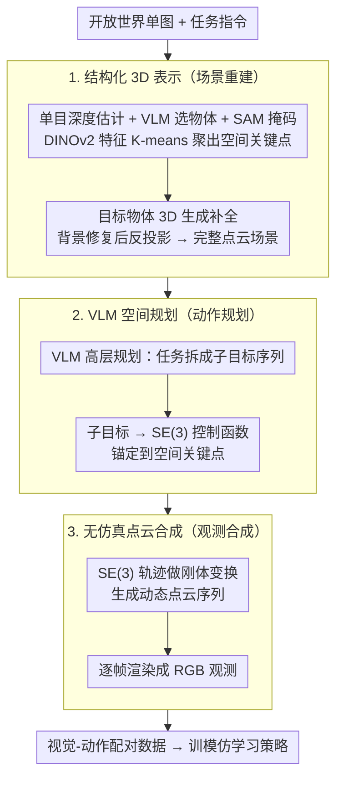

# IGen: Scalable Data Generation for Robot Learning from Open-World Images

**会议**: CVPR 2026  
**arXiv**: [2512.01773](https://arxiv.org/abs/2512.01773)  
**代码**: [https://chenghaogu.github.io/IGen/](https://chenghaogu.github.io/IGen/)  
**领域**: 机器人  
**关键词**: 机器人学习, 数据生成, 开放世界图像, 视觉运动策略, 3D重建

## 一句话总结
IGen 从单张开放世界图像出发，通过3D场景重建→VLM任务规划→SE(3)动作生成→点云合成→帧渲染，自动生成大规模视觉-动作训练数据，仅用生成数据训练的策略即可完成真实世界操作。

## 研究背景与动机
1. **领域现状**：通用机器人策略需要大规模视觉-动作配对数据，但真实数据采集昂贵且局限于特定环境。
2. **现有痛点**：Real-to-Sim方法需要对物理工作空间进行显式重建；视频生成方法无法提供显式动作且对复杂长任务表现差。
3. **核心矛盾**：开放世界图像极其丰富多样但缺乏机器人相关的动作信息，无法直接用于策略学习。
4. **本文目标**：从非结构化的开放世界图像中自动生成接地的视觉-动作数据。
5. **切入角度**：将2D像素转化为结构化3D表示，然后利用VLM进行任务规划和动作生成。
6. **核心idea**：图像→3D点云+关键点→VLM高层规划+低层控制→SE(3)轨迹→点云序列合成→帧渲染。

## 方法详解

### 整体框架
IGen 要回答的问题是：一张普通的开放世界图像（比如网上随手抓的一张桌面照片）里没有任何机器人动作信息，怎么把它变成能直接训策略的视觉-动作数据。它的做法是把这张静态 2D 图先"立起来"成可操作的 3D 工作空间，再让 VLM 在这个空间里规划出一条动作轨迹，最后沿着轨迹合成出"机器人正在操作"的连续观测帧。原文把整条链路拆成三个阶段：场景重建（结构化 3D 表示）→ 动作规划（VLM 空间规划）→ 观测合成（无仿真点云合成）。具体数据流是：单图 → 3D 点云 + 空间关键点 → VLM 高层计划 + 低层 SE(3) 轨迹 → 刚体变换出动态点云序列 → 逐帧渲染成 RGB。整个过程不搭物理仿真工作空间，纯靠几何重建和点云变换跑完。下面三个关键设计正好对应这三个阶段。

### 关键设计

**1. 从像素到结构化 3D 表示：把静态图"立起来"成可操作工作空间**

直接在 2D 图上规划是行不通的——机器人动作发生在三维空间里，2D 像素既给不出深度也给不出抓取点。IGen 先用单目几何基础模型估计整张图的深度，再让 VLM 圈出和任务相关的物体，交给 SAM 抠出物体掩码；掩码内用 DINOv2 提特征、K-means 聚类，得到一组**空间关键点**作为后续动作的锚点。这里有个关键区分：要被操作的目标物体不能只靠单视角深度反投影（背面是空的），所以用 3D 生成模型补出完整形状；背景物体则用图像修复填补遮挡区域后再深度反投影成点云。这样得到的不是一张带深度的"纸片"，而是一个前景物体闭合、背景完整的可交互场景。

**2. 基于 VLM 的空间规划：让语言指令落到 3D 里的具体位姿**

有了 3D 场景还不够，得知道"机器人该怎么动"。IGen 把场景理解和任务描述一起喂给 VLM，让它先产出一个高层计划（例如"抓取 → 移动 → 放置"这样的子目标序列），再把每个子目标映射成低层的 SE(3) 末端执行器位姿序列。前面聚类出的空间关键点在这里派上用场——它们是动作的空间锚点，VLM 不用凭空给坐标，而是把动作绑定到场景中具体的、有几何依据的点上。之所以用 VLM 而不是手写规则，是因为它本身就具备把自然语言指令接地到场景语义的能力，能处理"把杯子放到盘子左边"这类需要常识和空间推理的指令。

**3. 无仿真的点云合成：用刚体变换代替物理引擎**

最后要把规划好的轨迹变成"看得见"的观测序列。传统 Real-to-Sim 最贵的一步是搭一个完整物理仿真环境，IGen 直接跳过：它把 SE(3) 轨迹当作刚体运动，逐步作用到目标物体的点云上，得到操作全过程的动态点云序列，再逐帧渲染成 RGB 观测。因为操作过程中物体本身形状不变、只是位姿在动，刚体变换足以表达大部分抓取-移动-放置类动作，比起跑物理引擎轻量得多，对渲染质量的要求也更宽松——只要观测在视觉上一致、动作在几何上对齐即可。

### 一个完整示例

以一张桌面照片"把红色杯子放到盘子里"为例走一遍：① 单目深度模型先把整张图估出深度，VLM 圈出"杯子""盘子"两个任务物体，SAM 抠掩码，DINOv2+K-means 在杯子上得到几个空间关键点（如杯口、杯身）；杯子和盘子用 3D 生成补全完整形状，桌面背景修复后反投影成点云，至此场景"立"了起来。② VLM 给出高层计划"抓取杯子 → 移动到盘子上方 → 放下"，并把它展开成一串 SE(3) 位姿，抓取位姿锚定在杯身关键点上。③ 沿这串 SE(3) 轨迹对杯子点云做刚体变换，生成杯子从起点移动到盘子的动态点云序列，逐帧渲染出 RGB。最终产出的就是一段"图像观测 + 对应动作"的配对数据，可直接喂给模仿学习策略。

### 损失函数 / 训练策略
把生成的视觉-动作数据当作普通示教数据，训练标准模仿学习策略（如 ACT、DP3 等），用标准行为克隆损失，不引入额外的训练技巧。

## 实验关键数据

### 主实验

| 评估维度 | 指标 | IGen | TesserAct | Cosmos | 说明 |
|---------|------|------|----------|--------|------|
| 视觉保真度 | 一致性评分 | 高 | 中 | 低 | 更接近真实 |
| 动作质量 | 指令遵循+物理对齐 | 最优 | 次优 | 差 | 生成动作更合理 |
| 策略迁移 | 真实任务成功率 | 可比/优于真实数据 | - | - | 纯生成数据有效 |

### 消融实验

| 配置 | 关键指标 | 说明 |
|------|---------|------|
| Full IGen | 最优 | 完整pipeline |
| w/o 3D重建 | 显著下降 | 3D理解是基础 |
| w/o 空间关键点 | 下降 | 关键点提供空间锚定 |
| 2D生成替代 | 下降 | 2D方法缺乏物理接地 |

### 关键发现
- 仅用IGen生成的数据训练的策略能在真实世界中成功执行操作任务，无需任何真实采集数据。
- 在某些场景下，IGen生成数据训练的策略甚至超越了真实数据训练的策略，可能因为场景多样性更高。
- 与视频生成方法相比，IGen生成的动作更物理一致且指令遵循度更高。

## 亮点与洞察
- **"图像即数据源"**的理念极具吸引力：互联网图像是最丰富的视觉资源。
- **无仿真的点云合成**避免了传统Real-to-Sim pipeline中最耗时的仿真环境构建步骤。
- 3D表示 + VLM规划的组合在保持轻量级的同时提供了物理接地。

## 局限与展望
- 依赖单目深度估计，精度受限于估计模型。
- 刚体运动假设限制了对软体/流体操作的建模。
- 对复杂物理交互（如接触力反馈）的建模不足。

## 相关工作与启发
- **vs RoLA**: RoLA也从开放图像生成数据，但依赖物理属性估计且限于简单交互。IGen通过VLM规划支持更复杂的任务。
- **vs TesserAct/Cosmos**: 基于视频生成的方法缺乏显式动作，IGen提供完整的视觉-动作对。

## 评分
- 新颖性: ⭐⭐⭐⭐⭐ 从开放世界图像到机器人数据的完整pipeline是新颖贡献
- 实验充分度: ⭐⭐⭐⭐ 三维度评估+真实世界验证
- 写作质量: ⭐⭐⭐⭐ pipeline描述清晰，对比充分
- 价值: ⭐⭐⭐⭐⭐ 有潜力根本性改变机器人数据获取方式

<!-- RELATED:START -->

## 相关论文

- [\[CVPR 2026\] Video2Robo: 3DGS-based Synthetic Data from One Video Enables Scalable Robot Learning](video2robo_3dgs-based_synthetic_data_from_one_video_enables_scalable_robot_learn.md)
- [\[CVPR 2026\] CoMo: Learning Continuous Latent Motion from Internet Videos for Scalable Robot Learning](como_learning_continuous_latent_motion_from_internet_videos_for_scalable_robot_l.md)
- [\[CVPR 2026\] Scalable Trajectory Generation for Whole-Body Mobile Manipulation](scalable_trajectory_generation_for_whole-body_mobile_manipulation.md)
- [\[CVPR 2026\] RoboWheel: A Data Engine from Real-World Human Demonstrations for Cross-Embodiment Robotic Learning](robowheel_a_data_engine_from_real-world_human_demonstrations_for_cross-embodimen.md)
- [\[CVPR 2026\] Towards Human-Like Robot Handwriting via Contour-Aware Generation](towards_human-like_robot_handwriting_via_contour-aware_generation.md)

<!-- RELATED:END -->
